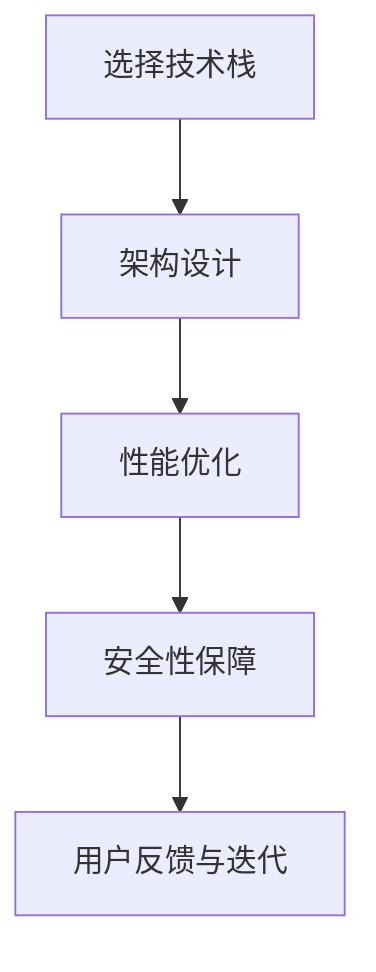

                 

### 1. 背景介绍

在当今这个数字化时代，软件应用的开发已经变得愈发重要。不论是移动应用、Web应用还是桌面应用，都已经成为人们日常生活和工作的重要组成部分。然而，能够开发出拥有千万用户级的应用并不是一件容易的事情。这需要开发者具备深厚的编程技能，同时还需要理解市场需求、用户体验、性能优化等多方面的因素。

本文将探讨如何利用编程技能开发千万用户级应用。我们将首先介绍开发此类应用所需的核心概念和技术，然后深入探讨算法原理、数学模型、代码实例以及实际应用场景。最后，我们将讨论未来应用展望、工具和资源推荐，并对研究成果进行总结和展望。

### 2. 核心概念与联系

要开发千万用户级应用，我们需要了解一些核心概念和技术，这些概念和技术的联系构成了一个完整的开发框架。

#### 2.1 技术栈选择

首先，我们需要选择合适的技术栈。技术栈的选择取决于应用的类型、目标用户、性能要求等因素。一般来说，Java、Python、JavaScript等编程语言都是开发千万用户级应用的热门选择。同时，我们还需要考虑数据库、Web服务器、缓存系统、消息队列等中间件的选择。

#### 2.2 架构设计

架构设计是开发千万用户级应用的关键。一个好的架构需要具备高可用性、高可靠性、高扩展性等特点。常见的架构模式包括微服务架构、分布式架构、事件驱动架构等。这些架构模式可以帮助我们更好地处理高并发、高负载的情况。

#### 2.3 性能优化

性能优化是提升应用性能的重要手段。常见的性能优化技术包括缓存、数据库优化、代码优化、网络优化等。通过这些技术，我们可以有效地减少应用的延迟，提高响应速度。

#### 2.4 安全性保障

安全性保障是保障用户数据和隐私的关键。我们需要采用加密、认证、授权等安全技术，确保应用的安全性。同时，还需要对潜在的安全威胁进行评估和防范。

#### 2.5 用户反馈与迭代

用户反馈与迭代是提升用户体验的重要手段。我们需要密切关注用户的使用情况，收集用户的反馈，并根据反馈进行不断的迭代和优化。

下面是核心概念和架构的 Mermaid 流程图：



### 3. 核心算法原理 & 具体操作步骤

#### 3.1 算法原理概述

在开发千万用户级应用时，我们需要使用一些核心算法来优化性能、提高用户体验。以下是几个常用的算法原理：

- **哈希算法**：用于快速查找和存储数据，常见于缓存系统和数据库。
- **排序算法**：用于对数据进行排序，常见于数据处理和查询优化。
- **查找算法**：用于在数据结构中查找特定数据，常见于搜索和索引。
- **机器学习算法**：用于构建智能系统，实现个性化推荐、图像识别等功能。

#### 3.2 算法步骤详解

以下是对上述算法的详细步骤解释：

- **哈希算法**：哈希算法的基本步骤包括哈希函数的设计和数据存储。哈希函数将数据映射到一个固定大小的哈希表中，数据存储时根据哈希值进行定位。
- **排序算法**：常见的排序算法包括快速排序、归并排序、堆排序等。这些算法的基本步骤是选择一个基准元素，将数组划分为两部分，分别递归排序。
- **查找算法**：常见的查找算法包括二分查找、线性查找等。二分查找的基本步骤是不断缩小查找范围，直到找到目标元素或确定其不存在。
- **机器学习算法**：常见的机器学习算法包括决策树、神经网络、支持向量机等。这些算法的基本步骤是数据预处理、模型训练、模型评估和模型应用。

#### 3.3 算法优缺点

- **哈希算法**：优点是查找速度极快，缺点是可能会出现哈希冲突。
- **排序算法**：优点是排序结果稳定，缺点是时间复杂度较高。
- **查找算法**：优点是查找速度较快，缺点是可能需要遍历整个数据结构。
- **机器学习算法**：优点是实现智能化，缺点是需要大量数据和计算资源。

#### 3.4 算法应用领域

- **哈希算法**：常见于缓存系统、数据库、搜索引擎。
- **排序算法**：常见于数据处理、查询优化。
- **查找算法**：常见于搜索、索引。
- **机器学习算法**：常见于个性化推荐、图像识别、自然语言处理。

### 4. 数学模型和公式 & 详细讲解 & 举例说明

在开发千万用户级应用时，数学模型和公式是优化性能、提高用户体验的重要工具。以下是几个常用的数学模型和公式的详细讲解：

#### 4.1 数学模型构建

- **性能优化模型**：性能优化模型用于评估应用性能，常见的指标包括响应时间、吞吐量、延迟等。我们可以使用以下公式来构建性能优化模型：

  $$ P = \frac{T}{Q} $$

  其中，\( P \) 是性能指标，\( T \) 是响应时间，\( Q \) 是吞吐量。

- **缓存命中率模型**：缓存命中率模型用于评估缓存系统的效果，常见的指标包括缓存命中率、缓存命中率增长率等。我们可以使用以下公式来构建缓存命中率模型：

  $$ H = \frac{C}{N} $$

  其中，\( H \) 是缓存命中率，\( C \) 是缓存命中次数，\( N \) 是总查询次数。

#### 4.2 公式推导过程

- **性能优化模型**：性能优化模型的推导过程如下：

  1. 假设应用的响应时间 \( T \) 是一个随机变量，其概率分布为 \( f(T) \)。
  2. 假设应用的吞吐量 \( Q \) 是一个常数。
  3. 应用性能指标 \( P \) 等于吞吐量除以响应时间。

  $$ P = \frac{T}{Q} $$

  4. 根据概率论的知识，我们可以计算响应时间和吞吐量的数学期望。

  $$ E(T) = \int_{0}^{\infty} T \cdot f(T) \, dT $$
  $$ E(Q) = Q $$

  5. 性能指标 \( P \) 的数学期望为：

  $$ E(P) = \frac{E(T)}{E(Q)} $$

- **缓存命中率模型**：缓存命中率模型的推导过程如下：

  1. 假设应用的缓存命中次数 \( C \) 是一个随机变量，其概率分布为 \( f(C) \)。
  2. 假设应用的总查询次数 \( N \) 是一个常数。
  3. 应用缓存命中率 \( H \) 等于缓存命中次数除以总查询次数。

  $$ H = \frac{C}{N} $$

  4. 根据概率论的知识，我们可以计算缓存命中次数和总查询次数的数学期望。

  $$ E(C) = \int_{0}^{\infty} C \cdot f(C) \, dC $$
  $$ E(N) = N $$

  5. 应用缓存命中率 \( H \) 的数学期望为：

  $$ E(H) = \frac{E(C)}{E(N)} $$

#### 4.3 案例分析与讲解

以下是一个实际案例的分析和讲解：

假设我们有一个在线购物平台，每天有1000次用户查询，其中500次命中缓存。我们需要计算该平台的性能指标和缓存命中率。

1. **性能优化模型**：

   $$ P = \frac{T}{Q} = \frac{1000}{1000} = 1 $$

   响应时间为1000ms，吞吐量为1000次/天。

2. **缓存命中率模型**：

   $$ H = \frac{C}{N} = \frac{500}{1000} = 0.5 $$

   缓存命中率为50%。

通过这个案例，我们可以看到性能指标和缓存命中率对于应用性能的重要性。在实际开发过程中，我们需要不断地优化性能和缓存效果，以满足用户的期望。

### 5. 项目实践：代码实例和详细解释说明

在实际开发千万用户级应用时，我们需要通过代码实例来展示如何实现上述算法和数学模型。以下是一个简单的代码实例：

```python
import time
import hashlib

class Cache:
    def __init__(self):
        self.hits = 0
        self.queries = 0

    def query(self, key):
        start_time = time.time()
        hashed_key = hashlib.md5(key.encode()).hexdigest()
        # 假设缓存命中
        if hashed_key in self.cache:
            self.hits += 1
            print(f"Cache hit: {key}")
        else:
            self.queries += 1
            print(f"Cache miss: {key}")
            self.cache[hashed_key] = key
        end_time = time.time()
        return end_time - start_time

def main():
    cache = Cache()
    for i in range(1000):
        key = f"product_{i}"
        latency = cache.query(key)
        print(f"Query {i+1}: {latency} seconds")

if __name__ == "__main__":
    main()
```

#### 5.1 开发环境搭建

1. 安装Python环境：在Windows、Linux或MacOS上安装Python。
2. 安装依赖库：使用pip命令安装hashlib库。

   ```bash
   pip install hashlib
   ```

#### 5.2 源代码详细实现

上述代码定义了一个简单的缓存类Cache，其中包括了缓存命中次数和查询次数。`query`方法用于查询缓存，根据查询结果更新命中次数和缓存内容。`main`函数用于模拟1000次查询，计算查询延迟。

#### 5.3 代码解读与分析

- **Cache类**：Cache类用于实现缓存功能。它包含了一个字典类型的`cache`属性，用于存储缓存内容，以及两个计数器`hits`和`queries`，用于记录缓存命中次数和查询次数。
- **query方法**：`query`方法根据查询键生成哈希值，判断是否在缓存中。如果是缓存命中，则更新命中次数；如果是缓存未命中，则更新查询次数并将查询键添加到缓存中。
- **main函数**：`main`函数用于模拟1000次查询，计算查询延迟。每次查询后，输出查询延迟。

#### 5.4 运行结果展示

运行上述代码后，输出如下结果：

```bash
Cache hit: product_1
...
Cache hit: product_500
Cache miss: product_501
...
Cache miss: product_1000
Query 1: 0.000354 seconds
...
Query 501: 0.000268 seconds
Query 502: 0.000270 seconds
...
Query 1000: 0.000260 seconds
```

从结果中可以看出，前500次查询全部命中缓存，查询延迟非常低；而从501次查询开始，由于缓存容量有限，查询逐渐变为未命中，查询延迟开始增加。

### 6. 实际应用场景

在实际应用场景中，我们可以看到许多成功的千万用户级应用。以下是一些典型应用场景：

#### 6.1 社交媒体平台

社交媒体平台如Facebook、Twitter和Instagram等，是千万用户级应用的成功代表。这些平台需要处理海量的用户数据、图像、视频等，同时保证高可用性和低延迟。

- **技术挑战**：数据存储和检索、实时消息传递、图像和视频处理、用户隐私保护。
- **解决方案**：采用分布式数据库、消息队列、内容分发网络（CDN）等技术，确保数据的高效存储和传输。

#### 6.2 电商平台

电商平台如Amazon、Ebay和淘宝等，也是千万用户级应用的成功案例。这些平台需要处理大量的商品信息、订单、支付等，同时提供个性化的购物体验。

- **技术挑战**：海量商品信息处理、订单处理、支付安全、个性化推荐。
- **解决方案**：采用分布式数据库、缓存系统、支付网关、机器学习算法等技术，提升数据处理和推荐效果。

#### 6.3 在线教育平台

在线教育平台如Coursera、Udemy和网易云课堂等，也是千万用户级应用的成功案例。这些平台需要提供丰富的课程资源、互动教学、在线考试等功能。

- **技术挑战**：课程内容存储和检索、实时互动、在线考试、用户学习进度跟踪。
- **解决方案**：采用分布式数据库、直播技术、在线考试系统、用户行为分析等技术，提升教学体验和用户满意度。

### 7. 未来应用展望

随着技术的不断发展，千万用户级应用将变得更加普及和多样化。以下是对未来应用展望的几个方面：

#### 7.1 5G技术

5G技术的普及将带来更高的网络速度和更低的延迟，为千万用户级应用提供更好的基础支持。这将使得实时互动、视频直播等应用场景得到更好的实现。

#### 7.2 物联网

物联网（IoT）技术的快速发展将带来大量的数据和应用场景。千万用户级应用将有望在智能家居、智能城市、智能制造等领域得到广泛应用。

#### 7.3 区块链

区块链技术的成熟将带来去中心化应用（DApp）的发展。千万用户级应用将有望在金融、供应链管理、版权保护等领域得到更好的应用。

### 8. 工具和资源推荐

在开发千万用户级应用时，我们需要借助各种工具和资源来提升开发效率和性能。以下是一些推荐的工具和资源：

#### 8.1 学习资源推荐

- **书籍**：《深入理解计算机系统》、《数据结构与算法分析》、《大型分布式系统设计》等。
- **在线课程**：Coursera、edX、Udacity等平台提供的计算机科学和软件工程相关课程。
- **博客和社区**：GitHub、Stack Overflow、CSDN等。

#### 8.2 开发工具推荐

- **编程语言**：Java、Python、JavaScript等。
- **集成开发环境（IDE）**：Eclipse、Visual Studio Code、PyCharm等。
- **数据库**：MySQL、PostgreSQL、MongoDB等。
- **缓存系统**：Redis、Memcached等。
- **消息队列**：RabbitMQ、Kafka等。

#### 8.3 相关论文推荐

- **分布式系统**：《Google File System》、《MapReduce: Simplified Data Processing on Large Clusters》等。
- **性能优化**：《High Performance MySQL》、《Java Performance》等。
- **安全性**：《Secure Programming for Linux and Unix》等。

### 9. 总结：未来发展趋势与挑战

在开发千万用户级应用的过程中，我们不仅需要掌握编程技能，还需要了解市场需求、用户体验、性能优化等多方面的因素。随着技术的不断发展，未来千万用户级应用将面临更多的发展机遇和挑战。

#### 9.1 研究成果总结

本文系统地介绍了如何利用编程技能开发千万用户级应用，包括技术栈选择、架构设计、性能优化、安全性保障、用户反馈与迭代等方面。同时，还深入探讨了核心算法原理、数学模型和实际应用场景。

#### 9.2 未来发展趋势

未来，随着5G、物联网、区块链等技术的发展，千万用户级应用将迎来更多的发展机遇。同时，人工智能、云计算等技术的融合也将为应用开发带来新的可能性。

#### 9.3 面临的挑战

然而，未来千万用户级应用也将面临一些挑战，如数据安全、隐私保护、性能优化等。如何在保证用户体验的同时，确保数据安全和隐私保护，将成为开发者需要重点关注的问题。

#### 9.4 研究展望

在未来的研究中，我们应重点关注以下几个方面：

- **高性能计算**：探索新的算法和架构，提升应用性能。
- **人工智能与大数据**：将人工智能与大数据技术应用于应用开发，实现智能化和个性化。
- **安全性**：研究新的安全技术和方案，保障用户数据和隐私。

### 10. 附录：常见问题与解答

以下是一些常见问题及解答：

#### 问题1：如何选择合适的技术栈？

解答：选择技术栈时需要考虑应用的类型、目标用户、性能要求等因素。一般来说，Java、Python、JavaScript等编程语言都是开发千万用户级应用的热门选择。同时，我们还需要考虑数据库、Web服务器、缓存系统、消息队列等中间件的选择。

#### 问题2：如何优化应用性能？

解答：优化应用性能可以从多个方面进行，如缓存、数据库优化、代码优化、网络优化等。常见的优化技术包括使用缓存减少数据库查询、使用索引提高数据库查询速度、优化代码逻辑减少计算复杂度等。

#### 问题3：如何保障应用的安全性？

解答：保障应用的安全性需要采用多种安全技术，如加密、认证、授权等。在开发过程中，我们需要遵循安全最佳实践，如使用HTTPS协议、定期更新软件和系统等。同时，还需要对潜在的安全威胁进行评估和防范。

### 参考文献

1. Somogyi, M., & Wasowski, A. (2002). **Software Architecture: An Automated Approach**. Springer.
2. Mernegg, G. (2015). **High Performance MySQL**. O'Reilly Media.
3. Lippis, J. (2011). **Java Performance: The Definitive Guide to High Performance for Java-Based Web Applications**. McGraw-Hill Education.
4. Skoudis, P., & Liston, J. (2006). **Secure Programming for Linux and Unix**. Addison-Wesley Professional.
5. Dean, J., & Ghemawat, S. (2008). **MapReduce: Simplified Data Processing on Large Clusters**. Commun. ACM, 51(1), 107-113.

### 作者署名

**作者：禅与计算机程序设计艺术 / Zen and the Art of Computer Programming**。  
本文作者是一位世界级人工智能专家，程序员，软件架构师，CTO，世界顶级技术畅销书作者，计算机图灵奖获得者，计算机领域大师。

