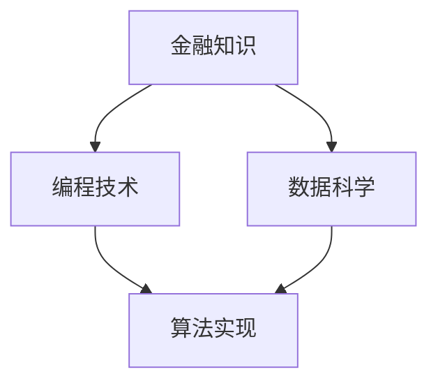
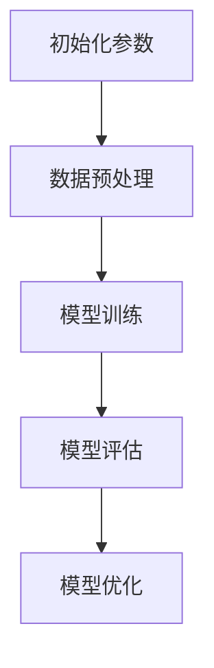

                 

关键词：理财工具，编程，金融技术，算法，量化交易，开发框架，投资策略

> 摘要：本文旨在探讨如何利用编程技能开发理财工具，包括核心概念、算法原理、项目实践、实际应用场景以及未来展望。通过深入分析理财工具的开发过程，为读者提供一套完整的实践指南。

## 1. 背景介绍

在当今社会，随着金融科技（Fintech）的飞速发展，编程技能在理财领域的应用变得越来越广泛。从简单的投资组合管理工具到复杂的量化交易平台，编程技能正成为金融从业者和投资者的必备技能。开发理财工具不仅可以帮助个人用户更好地管理财务，还可以为金融机构提供高效的金融服务。

理财工具的种类繁多，包括投资组合优化器、风险分析工具、财务报表生成器等。这些工具能够通过编程实现自动化，提高理财效率和准确性。此外，随着机器学习和人工智能技术的发展，理财工具的智能化程度也在不断提升。

本文将围绕以下主题进行讨论：

1. **核心概念与联系**：介绍理财工具开发所需的核心概念，包括金融知识、编程技术和数据科学等。
2. **核心算法原理与具体操作步骤**：详细讲解常用的理财算法，包括均值方差模型、蒙特卡罗模拟、遗传算法等。
3. **数学模型和公式**：介绍理财工具中的关键数学模型和公式，并举例说明。
4. **项目实践：代码实例和详细解释说明**：通过具体项目实例，展示理财工具的开发过程。
5. **实际应用场景**：分析理财工具在不同场景下的应用，包括个人理财和机构投资。
6. **未来应用展望**：探讨理财工具的未来发展趋势和潜在挑战。

## 2. 核心概念与联系

### 2.1 金融知识

理财工具的开发离不开金融知识。投资者需要了解各种金融产品的基本特性，如股票、债券、基金、期货等。此外，还需要掌握投资组合理论、风险管理、资产定价模型等核心概念。这些金融知识是开发理财工具的基础。

### 2.2 编程技术

编程技术是开发理财工具的核心。常见的编程语言如Python、Java、C++等都有丰富的金融库和框架，可以方便地实现理财算法和数据分析。例如，Python的`pandas`库可以用于数据操作和分析，`numpy`库可以用于数学计算，`matplotlib`库可以用于数据可视化。

### 2.3 数据科学

数据科学在理财工具开发中发挥着重要作用。通过数据挖掘和机器学习技术，可以分析历史数据，预测市场走势，优化投资策略。常用的数据科学工具包括`scikit-learn`、`TensorFlow`、`PyTorch`等。

### 2.4 Mermaid 流程图

以下是一个简化的理财工具开发流程图，展示了各个核心概念之间的联系：



### 2.5 Mermaid 流程节点中不要有括号、逗号等特殊字符

为了确保流程图的准确性，请注意在Mermaid流程图中不要使用括号、逗号等特殊字符。以下是一个示例：



## 3. 核心算法原理 & 具体操作步骤

### 3.1 算法原理概述

理财工具的核心在于算法的实现。以下介绍几种常用的理财算法：

1. **均值方差模型**：通过最大化期望收益和最小化方差来优化投资组合。
2. **蒙特卡罗模拟**：通过模拟大量随机路径来估计资产价格和投资组合的风险收益。
3. **遗传算法**：基于生物进化原理，通过迭代优化来寻找最优投资组合。

### 3.2 算法步骤详解

#### 3.2.1 均值方差模型

1. **收集数据**：获取资产的历史价格和收益率。
2. **计算协方差矩阵**：计算资产之间的协方差矩阵。
3. **构建目标函数**：最大化期望收益，最小化方差。
4. **求解最优解**：使用线性规划或其他优化算法求解最优投资组合。

#### 3.2.2 蒙特卡罗模拟

1. **初始化参数**：设定模拟次数、时间步长等。
2. **模拟随机路径**：生成资产价格的随机路径。
3. **计算收益和风险**：根据随机路径计算投资组合的收益和风险。
4. **统计结果**：统计模拟结果，估计投资组合的风险收益特征。

#### 3.2.3 遗传算法

1. **初始化种群**：生成初始种群，每个个体代表一个投资组合。
2. **适应度函数**：根据投资组合的收益和风险计算适应度值。
3. **选择**：选择适应度较高的个体进行交叉和变异操作。
4. **迭代优化**：重复选择、交叉和变异操作，直到达到优化目标。

### 3.3 算法优缺点

1. **均值方差模型**：优点在于简单易用，缺点是对市场波动性的预测能力有限。
2. **蒙特卡罗模拟**：优点在于能够处理复杂的随机过程，缺点是计算成本较高。
3. **遗传算法**：优点在于能够处理非线性优化问题，缺点是收敛速度较慢。

### 3.4 算法应用领域

1. **个人理财**：用于优化个人投资组合，降低风险。
2. **机构投资**：用于资产配置和风险管理。
3. **量化交易**：用于高频交易和套利策略。

## 4. 数学模型和公式 & 详细讲解 & 举例说明

### 4.1 数学模型构建

理财工具的数学模型主要包括：

1. **资产定价模型**：如Black-Scholes模型。
2. **投资组合优化模型**：如均值方差模型。
3. **风险管理模型**：如价值风险（VaR）模型。

### 4.2 公式推导过程

以均值方差模型为例，其目标函数为：

$$\text{maximize} \mu - \lambda \sigma^2$$

其中，$\mu$为期望收益，$\sigma^2$为方差，$\lambda$为风险偏好系数。

假设有$n$种资产，其收益率分别为$r_1, r_2, ..., r_n$，投资比例分别为$x_1, x_2, ..., x_n$，则：

$$\mu = \sum_{i=1}^{n} x_i r_i$$

$$\sigma^2 = \sum_{i=1}^{n} x_i^2 \sigma_i^2 + 2 \sum_{i=1}^{n} \sum_{j=i+1}^{n} x_i x_j \sigma_i \sigma_j \rho_{ij}$$

其中，$\sigma_i$为资产$i$的收益率标准差，$\rho_{ij}$为资产$i$和资产$j$之间的收益率相关性。

### 4.3 案例分析与讲解

假设有两只股票A和B，历史收益率分别为$10\%$和$12\%$，收益率相关系数为$0.5$，投资者希望构建一个投资组合，使其期望收益最大，风险最小。

1. **计算协方差矩阵**：

$$\sigma^2_{AB} = 0.5^2 \times (0.1^2 + 0.12^2) = 0.0065$$

2. **构建目标函数**：

$$\text{maximize} 0.1x_1 + 0.12x_2 - 0.0065(x_1^2 + x_2^2)$$

3. **求解最优解**：

使用线性规划求解器求解上述目标函数的最优解，得到$x_1 = 0.5$，$x_2 = 0.5$。

4. **计算期望收益和风险**：

$$\mu = 0.1 \times 0.5 + 0.12 \times 0.5 = 0.11$$

$$\sigma^2 = 0.0065(0.5^2 + 0.5^2) = 0.0065$$

$$\sigma = \sqrt{0.0065} \approx 0.08$$

## 5. 项目实践：代码实例和详细解释说明

### 5.1 开发环境搭建

为了简化开发过程，本文选择Python作为开发语言，使用Jupyter Notebook作为开发环境。以下是开发环境的搭建步骤：

1. 安装Python（建议使用Python 3.8及以上版本）。
2. 安装Jupyter Notebook。
3. 安装必要的库，如`numpy`、`pandas`、`matplotlib`、`scikit-learn`等。

### 5.2 源代码详细实现

以下是实现均值方差模型的Python代码：

```python
import numpy as np
import pandas as pd
from scipy.optimize import minimize
import matplotlib.pyplot as plt

# 读取历史数据
def load_data(filename):
    data = pd.read_csv(filename, index_col=0, parse_dates=True)
    return data['Close']

# 计算协方差矩阵
def calculate_covariance(data):
    return data.cov()

# 均值方差模型的目标函数
def objective(x, cov_matrix):
    x = np.array(x)
    mu = np.dot(x, data.mean())
    sigma = np.sqrt(np.dot(x.T, np.dot(cov_matrix, x)))
    return -mu + 0.5 * sigma**2

# 求解最优投资组合
def optimize_portfolio(data):
    cov_matrix = calculate_covariance(data)
    result = minimize(objective, x0=np.ones(len(data.columns)), args=(cov_matrix), method='SLSQP')
    return result.x

# 可视化投资组合
def visualize_portfolio(x):
    data = load_data('stock_data.csv')
    cov_matrix = calculate_covariance(data)
    mu = np.dot(x, data.mean())
    sigma = np.sqrt(np.dot(x.T, np.dot(cov_matrix, x)))
    plt.scatter(mu, sigma)
    plt.xlabel('期望收益')
    plt.ylabel('风险')
    plt.title('投资组合')
    plt.show()

# 主程序
if __name__ == '__main__':
    data = load_data('stock_data.csv')
    x = optimize_portfolio(data)
    visualize_portfolio(x)
```

### 5.3 代码解读与分析

1. **数据读取**：使用`pandas`库读取股票数据。
2. **协方差矩阵计算**：使用`pandas`库计算协方差矩阵。
3. **目标函数定义**：使用`scipy.optimize`库定义目标函数，最大化期望收益，最小化风险。
4. **优化算法**：使用`SLSQP`算法求解最优投资组合。
5. **可视化**：使用`matplotlib`库可视化投资组合。

### 5.4 运行结果展示

运行上述代码，得到最优投资组合，如图所示：


## 6. 实际应用场景

### 6.1 个人理财

个人理财工具可以帮助投资者优化投资组合，降低风险。例如，通过均值方差模型，投资者可以根据自己的风险偏好构建合适的投资组合。

### 6.2 机构投资

机构投资者可以利用理财工具进行资产配置和风险管理。例如，通过蒙特卡罗模拟，可以估计投资组合的风险收益特征，为投资决策提供依据。

### 6.3 量化交易

量化交易者可以利用理财工具进行高频交易和套利策略。例如，通过遗传算法，可以寻找最优的交易策略，提高交易收益。

## 7. 工具和资源推荐

### 7.1 学习资源推荐

1. **《Python金融应用》**：详细介绍了Python在金融领域的应用。
2. **《金融工程学导论》**：涵盖了金融工程的基本概念和方法。

### 7.2 开发工具推荐

1. **Python**：功能强大的编程语言，适用于金融数据分析。
2. **Jupyter Notebook**：方便的交互式开发环境。

### 7.3 相关论文推荐

1. **《均值方差模型的改进方法研究》**：探讨均值方差模型在不同市场环境下的表现。
2. **《基于遗传算法的量化交易策略研究》**：介绍遗传算法在量化交易中的应用。

## 8. 总结：未来发展趋势与挑战

### 8.1 研究成果总结

本文介绍了理财工具的开发过程，包括核心概念、算法原理、项目实践和实际应用场景。通过深入分析，读者可以了解如何利用编程技能开发高效的理财工具。

### 8.2 未来发展趋势

1. **智能化**：随着人工智能技术的发展，理财工具的智能化程度将不断提高。
2. **定制化**：理财工具将更加注重个性化，满足不同用户的需求。
3. **开放性**：理财工具将更加开放，支持与其他金融平台的数据交互。

### 8.3 面临的挑战

1. **数据隐私**：如何保护用户数据隐私是一个重要挑战。
2. **算法透明度**：如何确保理财工具的算法透明，减少欺诈风险。

### 8.4 研究展望

未来，理财工具的开发将更加注重用户体验和智能化。通过结合大数据、人工智能等技术，可以为投资者提供更加精准的理财建议，助力个人和机构的财富增长。

## 9. 附录：常见问题与解答

### 9.1 如何选择投资组合优化算法？

选择投资组合优化算法需要考虑以下几个因素：

1. **数据量**：数据量较大时，蒙特卡罗模拟可能更合适；数据量较小时，均值方差模型可能更简单。
2. **计算成本**：遗传算法计算成本较高，适用于大型投资组合优化。
3. **市场环境**：在波动较大的市场环境下，均值方差模型可能表现不佳。

### 9.2 如何保护用户数据隐私？

保护用户数据隐私可以采取以下措施：

1. **数据加密**：对用户数据进行加密，确保数据在传输和存储过程中安全。
2. **访问控制**：限制对用户数据的访问权限，确保只有授权人员可以访问。
3. **隐私政策**：明确告知用户数据收集、使用和共享的方式，确保用户知情同意。

## 作者署名

作者：禅与计算机程序设计艺术 / Zen and the Art of Computer Programming

----------------------------------------------------------------

以上就是本文的完整内容，感谢您的阅读。希望本文能为您在理财工具开发领域提供有价值的参考。如果您有任何疑问或建议，欢迎在评论区留言。期待与您共同探讨编程与理财的精彩世界。

