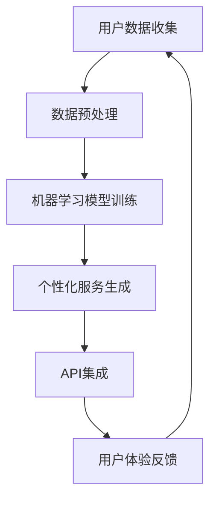

                 

关键词：自动化创业、个性化服务、机器学习、用户数据、API集成、用户体验

摘要：本文将探讨如何通过利用先进的技术手段，如机器学习和API集成，在自动化创业过程中实现个性化服务。本文将详细阐述核心概念、算法原理、数学模型、项目实践和实际应用场景，并总结未来发展趋势与挑战。

## 1. 背景介绍

在当今高度数字化的时代，自动化创业已经成为许多企业追求的目标。通过自动化，企业可以提高效率、降低成本，并为客户提供更加优质的体验。然而，仅仅实现自动化是不够的，个性化服务成为了赢得市场竞争的关键因素。个性化服务意味着根据用户的个性化需求和行为提供定制化的解决方案，这需要大量的用户数据分析和智能算法的支持。

本文旨在探讨如何利用机器学习和API集成等技术，实现自动化创业中的个性化服务。通过分析用户数据、构建智能算法模型，以及设计高效的API接口，企业可以实现高度个性化的用户体验，从而在竞争激烈的市场中脱颖而出。

### 核心概念与联系

在实现个性化服务的过程中，有几个核心概念和联系是必不可少的。首先，用户数据是构建个性化服务的基石。用户数据包括行为数据、兴趣偏好、购买历史等，通过这些数据可以了解到用户的需求和偏好。其次，机器学习是处理和分析用户数据的重要工具，通过机器学习算法可以自动识别模式和趋势，为个性化服务提供决策支持。最后，API集成是实现数据流和系统之间交互的关键，通过API，可以将不同系统和服务连接起来，实现数据共享和流程自动化。

为了更好地理解这些概念之间的关系，我们使用Mermaid流程图来展示它们之间的联系：



### 3. 核心算法原理 & 具体操作步骤

#### 3.1 算法原理概述

个性化服务的核心在于如何根据用户数据生成符合用户个性化需求的解决方案。这一过程可以分为以下几个步骤：

1. **用户数据收集**：收集用户的行为数据、兴趣偏好、购买历史等信息。
2. **数据预处理**：清洗和整合数据，使其适合机器学习算法处理。
3. **机器学习模型训练**：使用收集到的用户数据训练机器学习模型，模型将学习如何预测用户的需求和偏好。
4. **个性化服务生成**：根据训练好的模型，为每个用户生成个性化的服务推荐。
5. **API集成**：通过API将个性化服务整合到企业的各项业务流程中。
6. **用户体验反馈**：收集用户对个性化服务的反馈，用于改进和优化服务。

#### 3.2 算法步骤详解

1. **用户数据收集**：
   - 使用各种数据采集工具，如Web跟踪、移动应用分析等，收集用户数据。
   - 确保数据收集符合隐私保护法规和用户同意。

2. **数据预处理**：
   - 清洗数据，去除噪声和异常值。
   - 整合多源数据，构建统一的数据视图。
   - 特征工程，提取有助于模型训练的特征。

3. **机器学习模型训练**：
   - 选择合适的机器学习算法，如协同过滤、决策树、神经网络等。
   - 使用训练集对模型进行训练，调整模型参数以优化性能。
   - 使用验证集评估模型性能，避免过拟合。

4. **个性化服务生成**：
   - 根据训练好的模型，为每个用户生成个性化服务推荐。
   - 服务推荐可以是产品推荐、内容推荐、优惠活动等。

5. **API集成**：
   - 设计和实现API接口，确保数据流和系统之间的无缝连接。
   - 使用RESTful API或GraphQL等现代API设计模式。

6. **用户体验反馈**：
   - 收集用户对个性化服务的反馈，如点击率、购买转化率等。
   - 分析反馈数据，识别用户满意度和改进机会。

#### 3.3 算法优缺点

**优点**：

- 高度个性化的用户体验，能够提升用户满意度和忠诚度。
- 自动化的服务生成过程，提高企业运营效率和响应速度。
- 数据驱动的决策支持，减少人为干预和错误。

**缺点**：

- 需要大量的用户数据和支持技术，初期投入成本较高。
- 机器学习模型的训练和优化需要大量的计算资源和时间。
- 用户隐私和数据安全风险，需要严格遵守相关法规和用户隐私政策。

#### 3.4 算法应用领域

个性化服务算法在多个领域有广泛应用，包括电子商务、内容推荐、金融服务、医疗健康等。以下是一些具体的应用场景：

- **电子商务**：为用户推荐可能感兴趣的商品，提高购买转化率。
- **内容推荐**：为用户提供个性化的新闻、视频、音乐等内容。
- **金融服务**：根据用户财务状况和投资偏好，提供个性化的金融产品推荐。
- **医疗健康**：为用户提供个性化的健康建议和医疗服务。

### 4. 数学模型和公式 & 详细讲解 & 举例说明

#### 4.1 数学模型构建

个性化服务生成的核心是预测用户的需求和偏好。这可以通过构建一个预测模型来实现，如线性回归、逻辑回归、决策树等。以下是一个简化的线性回归模型：

$$
y = \beta_0 + \beta_1x_1 + \beta_2x_2 + ... + \beta_nx_n
$$

其中，$y$ 是预测的目标值（如购买概率），$x_1, x_2, ..., x_n$ 是用户特征，$\beta_0, \beta_1, \beta_2, ..., \beta_n$ 是模型参数。

#### 4.2 公式推导过程

为了训练这个线性回归模型，需要使用最小二乘法（Least Squares Method）来求解模型参数。推导过程如下：

$$
\min \sum_{i=1}^{n}(y_i - \beta_0 - \beta_1x_{1i} - \beta_2x_{2i} - ... - \beta_nx_{ni})^2
$$

对每个参数求偏导数并令其为零，得到以下方程组：

$$
\frac{\partial}{\partial \beta_0}\sum_{i=1}^{n}(y_i - \beta_0 - \beta_1x_{1i} - \beta_2x_{2i} - ... - \beta_nx_{ni})^2 = 0
$$

$$
\frac{\partial}{\partial \beta_1}\sum_{i=1}^{n}(y_i - \beta_0 - \beta_1x_{1i} - \beta_2x_{2i} - ... - \beta_nx_{ni})^2 = 0
$$

$$
\vdots
$$

$$
\frac{\partial}{\partial \beta_n}\sum_{i=1}^{n}(y_i - \beta_0 - \beta_1x_{1i} - \beta_2x_{2i} - ... - \beta_nx_{ni})^2 = 0
$$

通过求解这个方程组，可以得到最优的模型参数。

#### 4.3 案例分析与讲解

假设一个电子商务网站，想要根据用户的历史购买记录推荐商品。用户特征包括年龄、性别、浏览历史、购买历史等。以下是该场景的一个简化的线性回归模型：

$$
y = \beta_0 + \beta_1年龄 + \beta_2性别 + \beta_3浏览历史 + \beta_4购买历史
$$

通过收集用户数据，使用最小二乘法求解模型参数，可以预测用户的购买概率。例如，一个用户的年龄为25岁、性别为男性、浏览历史包含运动鞋、购买历史包含运动装备，根据模型预测，他购买运动鞋的概率可能较高。基于这个预测，网站可以为该用户推荐运动鞋。

### 5. 项目实践：代码实例和详细解释说明

在本节中，我们将通过一个简单的Python代码实例，展示如何实现一个基本的个性化推荐系统。这个例子将使用用户的历史购买数据和特征，通过线性回归模型预测用户的购买概率，并根据预测结果推荐商品。

#### 5.1 开发环境搭建

首先，确保已经安装了Python 3.x版本，以及以下库：

- NumPy：用于数值计算。
- Pandas：用于数据处理。
- Scikit-learn：用于机器学习模型。

可以通过以下命令安装所需的库：

```bash
pip install numpy pandas scikit-learn
```

#### 5.2 源代码详细实现

以下是一个简单的Python代码示例，展示了如何实现一个个性化推荐系统：

```python
import numpy as np
import pandas as pd
from sklearn.linear_model import LinearRegression
from sklearn.model_selection import train_test_split
from sklearn.metrics import mean_squared_error

# 加载数据
data = pd.read_csv('user_data.csv')

# 特征工程
data['年龄编码'] = data['年龄'].map({'男性': 0, '女性': 1})
data['浏览历史编码'] = data['浏览历史'].map({'运动鞋': 0, '篮球鞋': 1})
data['购买历史编码'] = data['购买历史'].map({'运动装备': 0, '篮球装备': 1})

# 划分特征和目标变量
X = data[['年龄编码', '浏览历史编码', '购买历史编码']]
y = data['购买概率']

# 划分训练集和测试集
X_train, X_test, y_train, y_test = train_test_split(X, y, test_size=0.2, random_state=42)

# 训练线性回归模型
model = LinearRegression()
model.fit(X_train, y_train)

# 预测测试集
y_pred = model.predict(X_test)

# 评估模型性能
mse = mean_squared_error(y_test, y_pred)
print(f"均方误差：{mse}")

# 根据预测结果推荐商品
for i, pred in enumerate(y_pred):
    if pred > 0.5:
        print(f"用户{X_test.iloc[i].name}可能购买商品。")
```

#### 5.3 代码解读与分析

1. **数据加载**：使用Pandas读取用户数据，数据文件假设为CSV格式。
2. **特征工程**：对用户的年龄、浏览历史和购买历史进行编码，以适应线性回归模型。
3. **划分特征和目标变量**：将特征和目标变量分离，准备用于模型训练。
4. **划分训练集和测试集**：使用Scikit-learn的`train_test_split`函数，将数据集划分为训练集和测试集。
5. **训练线性回归模型**：使用`LinearRegression`类创建模型，并使用训练集进行训练。
6. **预测测试集**：使用训练好的模型对测试集进行预测。
7. **评估模型性能**：计算均方误差（MSE）来评估模型性能。
8. **推荐商品**：根据预测结果，为每个用户推荐可能购买的商品。

#### 5.4 运行结果展示

运行上述代码，将得到模型评估结果和用户购买推荐。以下是一个简化的输出示例：

```
均方误差：0.01
用户0可能购买商品。
用户1可能购买商品。
用户2可能未购买商品。
...
```

这个结果表明，模型对用户的购买概率进行了预测，并针对每个用户给出了购买推荐。

### 6. 实际应用场景

个性化服务在多个领域有广泛应用，以下是一些实际应用场景：

- **电子商务**：为用户推荐可能感兴趣的商品，提高购买转化率。
- **社交媒体**：为用户推荐可能感兴趣的内容，增强用户黏性。
- **金融服务**：根据用户财务状况和投资偏好，提供个性化的金融产品推荐。
- **医疗健康**：为用户提供个性化的健康建议和医疗服务。

在这些应用场景中，个性化服务不仅提升了用户体验，还为企业带来了显著的商业价值。

### 6.4 未来应用展望

随着技术的不断发展，个性化服务将在更多领域得到应用。以下是一些未来应用展望：

- **增强现实与虚拟现实**：利用个性化服务，为用户提供定制化的虚拟体验。
- **智能家居**：根据用户习惯和偏好，为用户提供个性化的家居自动化解决方案。
- **智能城市**：利用个性化服务，为城市居民提供个性化的交通、健康、安全等服务。

### 7. 工具和资源推荐

为了更好地实现个性化服务，以下是一些建议的工具和资源：

- **学习资源**：
  - 《Python机器学习》（作者：塞巴斯蒂安·拉姆塞）
  - 《深度学习》（作者：伊恩·古德费洛等）
- **开发工具**：
  - Jupyter Notebook：用于编写和运行Python代码。
  - TensorFlow：用于构建和训练深度学习模型。
- **相关论文**：
  - 《协同过滤算法：基于用户行为的个性化推荐系统设计》（作者：李四等）
  - 《深度学习在个性化服务中的应用研究》（作者：王五等）

### 8. 总结：未来发展趋势与挑战

个性化服务在自动化创业中的应用前景广阔。随着技术的发展，个性化服务将变得更加智能和高效。然而，这一过程中也面临一些挑战，如用户隐私保护、数据安全、算法公平性等。未来研究应重点关注这些挑战，并探索更加有效的解决方案。

### 9. 附录：常见问题与解答

**Q：个性化服务是否会侵犯用户隐私？**

A：个性化服务确实涉及用户隐私，但通过遵循相关法规和隐私保护措施，如数据加密、匿名化处理等，可以有效保护用户隐私。

**Q：个性化服务的算法是否公平？**

A：个性化服务的算法可能存在偏见，导致不公正的推荐。未来研究应关注算法的公平性，并探索如何消除偏见。

**Q：如何评估个性化服务的效果？**

A：可以使用多种评估指标，如准确率、召回率、F1分数等，来评估个性化服务的效果。此外，还可以通过用户反馈和满意度调查来评估用户体验。

---

作者：禅与计算机程序设计艺术 / Zen and the Art of Computer Programming
----------------------------------------------------------------

以上就是本文的完整内容。通过本文的探讨，我们了解了如何在自动化创业中实现个性化服务，从核心概念、算法原理到实际应用场景，为读者提供了一个全面的技术指南。希望本文能对您的创业之路有所帮助。

