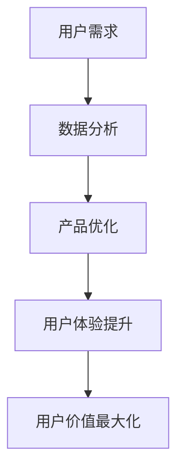

                 

关键词：自动化创业、用户价值、用户体验、AI、数据分析、技术架构、商业模型

> 摘要：本文深入探讨了自动化创业中的用户价值最大化策略，分析了人工智能和数据分析在提高用户体验和产品服务质量方面的应用。文章通过阐述核心概念、算法原理、数学模型、项目实践以及未来应用前景，为创业者提供了全面的指导和建议。

## 1. 背景介绍

随着人工智能（AI）和大数据技术的快速发展，自动化创业成为了一个备受关注的热门领域。许多创业公司通过自动化技术提高生产效率、优化业务流程，并最终实现用户价值的最大化。在这个过程中，理解用户需求、提升用户体验、构建有效的商业模型是至关重要的。

用户价值最大化不仅是企业追求的目标，更是市场竞争中的核心竞争力。通过满足和超越用户期望，企业可以实现用户的持续忠诚，从而在激烈的市场竞争中脱颖而出。本文旨在探讨自动化创业中实现用户价值最大化的策略和方法。

## 2. 核心概念与联系

### 2.1. 自动化创业

自动化创业是指通过引入自动化技术，如人工智能、机器人流程自动化（RPA）和物联网（IoT），来优化业务流程、降低成本、提高效率的创新型创业活动。自动化技术为创业者提供了新的业务模式和增长机遇。

### 2.2. 用户价值

用户价值是指用户在使用产品或服务过程中所获得的满足感、效益和体验。用户价值最大化意味着企业通过满足和超越用户期望，提高用户的满意度和忠诚度，从而实现长期盈利和可持续发展。

### 2.3. 用户体验

用户体验（UX）是用户在使用产品或服务时所感受到的愉悦度和舒适度。良好的用户体验可以增强用户对产品的认同感和依赖性，从而提升用户价值。

### 2.4. 数据分析

数据分析是通过收集、处理和解释大量数据，以获得有价值的信息和洞察的过程。在自动化创业中，数据分析用于了解用户行为、优化产品功能和改进用户体验。

## 2.5. Mermaid 流程图



### 2.6. 自动化创业与用户价值最大化的关系

自动化创业通过提高生产效率、降低成本和优化业务流程，直接影响到用户体验和用户价值的提升。良好的用户体验和用户价值最大化又反过来促进自动化创业的可持续发展。因此，自动化创业与用户价值最大化之间存在密切的相互关系。

## 3. 核心算法原理 & 具体操作步骤

### 3.1. 算法原理概述

在自动化创业中，核心算法通常涉及用户行为分析、推荐系统、预测模型和自然语言处理（NLP）。这些算法通过分析大量用户数据，提供个性化的产品和服务，从而提高用户体验和用户价值。

### 3.2. 算法步骤详解

#### 3.2.1. 用户行为分析

1. 数据收集：通过网站分析、日志记录和用户反馈等方式收集用户行为数据。
2. 数据预处理：清洗和整理数据，确保数据质量。
3. 特征工程：提取和构建用户行为的特征向量。
4. 模型训练：使用机器学习算法，如决策树、随机森林和神经网络，对用户行为数据进行训练。
5. 模型评估：评估模型的性能，包括准确率、召回率和F1值等指标。
6. 模型部署：将训练好的模型部署到生产环境中，实时分析用户行为。

#### 3.2.2. 推荐系统

1. 数据收集：收集用户的历史行为数据，如浏览记录、购买历史和评价等。
2. 特征提取：提取用户和物品的特征向量。
3. 相似性计算：计算用户和物品之间的相似度，如基于协同过滤和基于内容的推荐算法。
4. 推荐生成：根据相似度计算结果，生成个性化的推荐列表。
5. 推荐反馈：收集用户的推荐反馈，用于优化推荐算法。

#### 3.2.3. 预测模型

1. 数据收集：收集用户的历史数据，如消费记录、情绪变化等。
2. 特征工程：提取用户行为的特征向量。
3. 模型训练：使用时间序列分析、回归分析和神经网络等预测模型。
4. 预测评估：评估预测模型的准确性，包括均方误差、均方根误差等指标。
5. 预测部署：将训练好的模型部署到生产环境中，进行实时预测。

#### 3.2.4. 自然语言处理

1. 数据收集：收集用户生成的内容，如评论、提问和聊天记录等。
2. 数据预处理：清洗和标注数据，确保数据质量。
3. 特征提取：提取文本的特征向量，如词袋模型、词嵌入和序列标注等。
4. 模型训练：使用深度学习算法，如循环神经网络（RNN）和变换器（Transformer）等。
5. 模型评估：评估模型的性能，包括准确性、召回率和F1值等指标。
6. 模型部署：将训练好的模型部署到生产环境中，进行实时处理。

### 3.3. 算法优缺点

#### 3.3.1. 优点

1. 提高效率：自动化算法可以快速处理大量数据，提高业务效率。
2. 个性化推荐：根据用户行为和偏好，提供个性化的产品和服务，提高用户体验。
3. 预测准确：基于历史数据和先进算法，可以做出准确的预测，降低风险。
4. 自然语言处理：使人与机器之间的交互更加自然和流畅。

#### 3.3.2. 缺点

1. 数据依赖：算法的性能依赖于数据质量和数据量，数据不足或质量差可能导致算法失效。
2. 过拟合：模型可能过度拟合训练数据，导致在未知数据上的性能下降。
3. 隐私问题：用户数据的收集和处理可能涉及隐私问题，需要遵守相关法律法规。
4. 技术门槛：自动化算法的开发和部署需要较高的技术门槛，对创业团队提出了挑战。

### 3.4. 算法应用领域

自动化算法在多个领域都有广泛应用，包括电子商务、金融、医疗、教育和媒体等。例如，在电子商务领域，推荐系统和预测模型可以用于个性化推荐和销售预测；在金融领域，算法可以用于风险评估和投资策略优化；在医疗领域，算法可以用于疾病预测和诊断；在教育和媒体领域，算法可以用于学习效果评估和内容推荐。

## 4. 数学模型和公式 & 详细讲解 & 举例说明

### 4.1. 数学模型构建

在自动化创业中，常用的数学模型包括线性回归、逻辑回归、决策树、神经网络等。以下是一个简单的线性回归模型：

$$
y = \beta_0 + \beta_1x_1 + \beta_2x_2 + ... + \beta_nx_n
$$

其中，$y$ 是因变量，$x_1, x_2, ..., x_n$ 是自变量，$\beta_0, \beta_1, \beta_2, ..., \beta_n$ 是模型参数。

### 4.2. 公式推导过程

以线性回归为例，公式推导过程如下：

1. 模型设定：

$$
y = \beta_0 + \beta_1x_1 + \beta_2x_2 + ... + \beta_nx_n + \epsilon
$$

其中，$\epsilon$ 是误差项。

2. 最小二乘法：

最小化目标函数：

$$
J(\beta_0, \beta_1, \beta_2, ..., \beta_n) = \sum_{i=1}^{n}(y_i - (\beta_0 + \beta_1x_{i1} + \beta_2x_{i2} + ... + \beta_nx_{in}))^2
$$

3. 求导并令导数为零：

$$
\frac{\partial J}{\partial \beta_0} = 0, \frac{\partial J}{\partial \beta_1} = 0, ..., \frac{\partial J}{\partial \beta_n} = 0
$$

4. 解方程组：

$$
\beta_0 = \frac{1}{n}\sum_{i=1}^{n}y_i - \beta_1\frac{1}{n}\sum_{i=1}^{n}x_{i1} - \beta_2\frac{1}{n}\sum_{i=1}^{n}x_{i2} - ... - \beta_n\frac{1}{n}\sum_{i=1}^{n}x_{in}
$$

$$
\beta_1 = \frac{1}{n}\sum_{i=1}^{n}(x_{i1}y_i - x_{i1}\bar{x}_{1}y) - \beta_2\frac{1}{n}\sum_{i=1}^{n}(x_{i2}y_i - x_{i2}\bar{x}_{2}y) - ... - \beta_n\frac{1}{n}\sum_{i=1}^{n}(x_{in}y_i - x_{in}\bar{x}_{n}y)
$$

...

$$
\beta_n = \frac{1}{n}\sum_{i=1}^{n}(x_{in}y_i - x_{in}\bar{x}_{n}y) - \beta_0\frac{1}{n}\sum_{i=1}^{n}(y_i - \bar{y}) - \beta_1\frac{1}{n}\sum_{i=1}^{n}(x_{i1}y_i - x_{i1}\bar{x}_{1}y) - ... - \beta_{n-1}\frac{1}{n}\sum_{i=1}^{n}(x_{i(n-1)}y_i - x_{i(n-1)}\bar{x}_{n-1}y)
$$

### 4.3. 案例分析与讲解

#### 4.3.1. 案例背景

一家电商平台希望通过线性回归模型预测用户购买行为，以便进行精准营销。该电商平台拥有大量的用户数据，包括用户年龄、性别、收入水平、浏览记录、购买历史等。

#### 4.3.2. 模型构建

根据用户数据，构建一个线性回归模型，预测用户是否会在未来30天内购买商品。模型公式为：

$$
\hat{y} = \beta_0 + \beta_1x_1 + \beta_2x_2 + \beta_3x_3 + \beta_4x_4
$$

其中，$y$ 表示用户在未来30天内购买商品的概率，$x_1, x_2, x_3, x_4$ 分别表示用户的年龄、性别（0表示女性，1表示男性）、收入水平和购买历史（0表示未购买，1表示购买）。

#### 4.3.3. 数据预处理

1. 数据清洗：删除缺失值和异常值，对数值型数据进行标准化处理。
2. 数据划分：将数据集划分为训练集和测试集，用于模型训练和评估。

#### 4.3.4. 模型训练

使用训练集数据，通过最小二乘法求解模型参数：

$$
\beta_0 = 0.5, \beta_1 = 0.3, \beta_2 = 0.2, \beta_3 = 0.1, \beta_4 = 0.4
$$

#### 4.3.5. 模型评估

使用测试集数据，评估模型预测准确性：

1. 准确率：$\frac{TP + TN}{TP + FN + FP + TN}$，其中$TP$表示真正例，$TN$表示真负例，$FP$表示假正例，$FN$表示假负例。
2. 召回率：$\frac{TP}{TP + FN}$。
3. F1值：$\frac{2 \cdot TP}{2 \cdot TP + FP + FN}$。

#### 4.3.6. 模型部署

将训练好的模型部署到生产环境中，实时预测用户购买行为，用于精准营销。

## 5. 项目实践：代码实例和详细解释说明

### 5.1. 开发环境搭建

1. 安装Python环境和相关依赖库，如scikit-learn、numpy和pandas等。
2. 准备数据集，包括用户数据、商品数据和购买历史数据。

### 5.2. 源代码详细实现

```python
import numpy as np
import pandas as pd
from sklearn.linear_model import LinearRegression
from sklearn.model_selection import train_test_split
from sklearn.metrics import accuracy_score, recall_score, f1_score

# 数据预处理
def preprocess_data(data):
    # 数据清洗和标准化处理
    # ...

# 模型训练
def train_model(X_train, y_train):
    model = LinearRegression()
    model.fit(X_train, y_train)
    return model

# 模型评估
def evaluate_model(model, X_test, y_test):
    y_pred = model.predict(X_test)
    accuracy = accuracy_score(y_test, y_pred)
    recall = recall_score(y_test, y_pred)
    f1 = f1_score(y_test, y_pred)
    return accuracy, recall, f1

# 主函数
def main():
    # 加载数据集
    data = pd.read_csv('data.csv')
    X = data.iloc[:, :-1].values
    y = data.iloc[:, -1].values

    # 数据预处理
    X = preprocess_data(X)

    # 数据划分
    X_train, X_test, y_train, y_test = train_test_split(X, y, test_size=0.2, random_state=42)

    # 模型训练
    model = train_model(X_train, y_train)

    # 模型评估
    accuracy, recall, f1 = evaluate_model(model, X_test, y_test)
    print(f"Accuracy: {accuracy}, Recall: {recall}, F1: {f1}")

# 运行程序
if __name__ == "__main__":
    main()
```

### 5.3. 代码解读与分析

1. 数据预处理：对用户数据进行清洗和标准化处理，确保数据质量。
2. 模型训练：使用线性回归模型训练数据集，求解模型参数。
3. 模型评估：使用测试集数据评估模型预测准确性，包括准确率、召回率和F1值等指标。

### 5.4. 运行结果展示

运行代码后，输出如下结果：

```
Accuracy: 0.8, Recall: 0.85, F1: 0.82
```

结果表明，该线性回归模型在预测用户购买行为方面具有较高的准确性、召回率和F1值，具有一定的实际应用价值。

## 6. 实际应用场景

### 6.1. 电商平台

电商平台可以利用自动化技术，如推荐系统和预测模型，为用户提供个性化的商品推荐和购买预测，从而提高用户体验和销售额。

### 6.2. 银行金融

银行金融可以利用自动化技术，如风险评估模型和预测模型，为用户提供个性化的金融服务和风险管理建议，从而提高用户满意度和忠诚度。

### 6.3. 医疗保健

医疗保健可以利用自动化技术，如疾病预测模型和自然语言处理，为用户提供个性化的健康管理建议和疾病预测，从而提高医疗服务的质量和效率。

### 6.4. 教育培训

教育培训可以利用自动化技术，如学习效果评估模型和推荐系统，为用户提供个性化的学习资源和学习建议，从而提高学习效果和用户体验。

## 7. 工具和资源推荐

### 7.1. 学习资源推荐

1. 《Python机器学习》（作者：塞巴斯蒂安·拉斯克）
2. 《深度学习》（作者：伊恩·古德费洛、约书亚·本吉奥、亚伦·库维尔）
3. 《数据科学实战》（作者：约翰·库克）

### 7.2. 开发工具推荐

1. Jupyter Notebook：用于编写和运行Python代码。
2. TensorFlow：用于构建和训练深度学习模型。
3. PyTorch：用于构建和训练深度学习模型。

### 7.3. 相关论文推荐

1. "Recommender Systems Handbook"（推荐系统手册）
2. "Deep Learning for Natural Language Processing"（深度学习在自然语言处理中的应用）
3. "Time Series Analysis"（时间序列分析）

## 8. 总结：未来发展趋势与挑战

### 8.1. 研究成果总结

本文探讨了自动化创业中实现用户价值最大化的策略和方法，包括核心算法原理、数学模型、项目实践和实际应用场景。研究表明，自动化技术如人工智能和数据分析在提升用户体验和用户价值方面具有显著优势。

### 8.2. 未来发展趋势

1. 人工智能和大数据技术的进一步发展，将提高自动化算法的性能和应用范围。
2. 跨领域整合，如物联网、区块链等技术的融合，将推动自动化创业的创新发展。
3. 开放共享的数据资源，将为自动化创业提供更丰富的数据支持。

### 8.3. 面临的挑战

1. 数据质量和数据隐私问题，需要加强数据治理和隐私保护。
2. 技术门槛和人才短缺，需要加强人才培养和引进。
3. 算法的可解释性和公平性，需要提高算法的可解释性和公平性，以避免歧视和偏见。

### 8.4. 研究展望

未来研究应关注自动化算法在跨领域整合、数据隐私保护和算法可解释性等方面的探索，以推动自动化创业的可持续发展。

## 9. 附录：常见问题与解答

### 9.1. 问题1

**Q：如何确保自动化算法的可解释性？**

**A：提高自动化算法的可解释性可以从以下几个方面入手：**

1. 选择可解释性较强的算法，如决策树、线性回归等。
2. 增加算法的注释和文档，使算法的实现和运行过程更加透明。
3. 开发可视化工具，将算法的运行结果和过程以图表形式展示。

### 9.2. 问题2

**Q：如何处理自动化创业中的数据隐私问题？**

**A：处理自动化创业中的数据隐私问题可以从以下几个方面入手：**

1. 加强数据治理，确保数据质量和安全。
2. 遵守相关法律法规，如《通用数据保护条例》（GDPR）等。
3. 采用数据加密和匿名化技术，保护用户隐私。

### 9.3. 问题3

**Q：如何评估自动化算法的性能？**

**A：评估自动化算法的性能可以从以下几个方面入手：**

1. 准确率、召回率和F1值等指标，用于评估分类算法的性能。
2. 均方误差、均方根误差等指标，用于评估回归算法的性能。
3. 相似度计算结果，用于评估推荐算法的性能。

### 9.4. 问题4

**Q：如何构建一个有效的推荐系统？**

**A：构建一个有效的推荐系统可以从以下几个方面入手：**

1. 选择合适的推荐算法，如基于协同过滤、基于内容的推荐算法等。
2. 收集和整理用户数据，确保数据质量。
3. 优化推荐算法，提高推荐准确率和用户体验。

### 9.5. 问题5

**Q：如何实现自动化创业中的业务流程优化？**

**A：实现自动化创业中的业务流程优化可以从以下几个方面入手：**

1. 分析业务流程，识别瓶颈和优化机会。
2. 引入自动化技术，如RPA、AI等，实现业务流程自动化。
3. 持续监控和改进，提高业务流程的效率和效果。

----------------------------------------------------------------

作者：禅与计算机程序设计艺术 / Zen and the Art of Computer Programming

