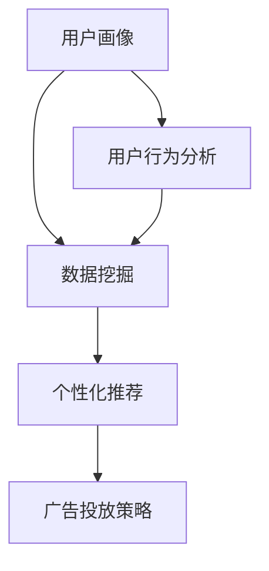

                 

关键词：自动化创业、精准营销、人工智能、数据驱动、个性化推荐、广告投放策略

> 摘要：本文探讨了如何在自动化创业中利用人工智能技术实现精准营销。通过分析现有技术和算法，提供了一套系统化的解决方案，包括数据收集与处理、用户行为分析、个性化推荐和广告投放策略。本文旨在为创业者提供实践指导和理论基础，帮助他们提高营销效果，实现商业成功。

## 1. 背景介绍

随着互联网的普及和数字化转型的加速，企业面临着日益激烈的竞争。传统的营销手段已经无法满足消费者多样化和个性化的需求，因此，精准营销成为了企业提升竞争力的重要手段。精准营销的核心在于对用户数据进行深入分析，实现广告和营销内容的个性化推荐。

### 1.1 自动化创业的兴起

自动化创业是指通过人工智能、大数据等技术手段，实现创业过程的自动化和智能化。自动化创业的优势在于提高效率、降低成本、优化用户体验，从而在激烈的市场竞争中占据优势。

### 1.2 精准营销的重要性

精准营销能够帮助企业：

- 提高广告投放效果
- 提升用户满意度
- 增加转化率和复购率
- 降低营销成本

因此，如何在自动化创业中实现精准营销，成为了众多企业关注的焦点。

## 2. 核心概念与联系

为了实现精准营销，我们需要理解以下几个核心概念：

- **用户画像**：通过对用户行为数据进行分析，构建用户的全面画像，包括年龄、性别、兴趣爱好、购买行为等。
- **数据挖掘**：利用算法和技术，从大量用户数据中提取有价值的信息，如用户偏好、行为模式等。
- **个性化推荐**：根据用户画像和行为数据，为用户提供个性化的产品或服务推荐。
- **广告投放策略**：基于用户画像和行为数据，制定合适的广告投放策略，以最大化广告效果。

下面是一个用Mermaid绘制的核心概念与联系流程图：



## 3. 核心算法原理 & 具体操作步骤

### 3.1 算法原理概述

实现精准营销的核心算法包括：

- **用户画像算法**：通过聚类、关联规则挖掘等方法，构建用户的全面画像。
- **个性化推荐算法**：基于协同过滤、矩阵分解、深度学习等技术，实现个性化推荐。
- **广告投放策略算法**：利用机器学习、优化算法，制定最优的广告投放策略。

### 3.2 算法步骤详解

#### 3.2.1 用户画像构建

1. **数据收集**：收集用户的基本信息、行为数据、购买数据等。
2. **数据预处理**：清洗、去重、标准化等处理。
3. **特征工程**：提取用户行为特征，如浏览时间、购买频率、喜好等。
4. **聚类分析**：使用K-means、DBSCAN等算法，将用户划分为不同群体。

#### 3.2.2 个性化推荐实现

1. **协同过滤**：计算用户之间的相似度，基于邻居用户的偏好推荐商品。
2. **矩阵分解**：将用户-商品评分矩阵分解为用户特征矩阵和商品特征矩阵，实现个性化推荐。
3. **深度学习**：使用神经网络模型，如卷积神经网络（CNN）或循环神经网络（RNN），进行深度特征提取和推荐。

#### 3.2.3 广告投放策略制定

1. **目标设定**：确定广告投放的目标，如提升品牌知名度、增加销售额等。
2. **投放优化**：使用优化算法，如线性规划、梯度下降等，实现广告投放效果的最优化。
3. **效果评估**：通过A/B测试、转化率分析等手段，评估广告投放效果。

### 3.3 算法优缺点

- **用户画像算法**：优点是能够全面了解用户需求，缺点是需要大量的数据和计算资源。
- **个性化推荐算法**：优点是提高用户满意度，缺点是可能过度推荐，导致用户疲劳。
- **广告投放策略算法**：优点是提高广告效果，缺点是需要实时调整和优化。

### 3.4 算法应用领域

这些算法可以广泛应用于电子商务、在线教育、金融保险等行业，帮助企业在自动化创业中实现精准营销。

## 4. 数学模型和公式 & 详细讲解 & 举例说明

### 4.1 数学模型构建

为了实现精准营销，我们需要构建以下几个数学模型：

1. **用户行为预测模型**：使用线性回归、逻辑回归等算法，预测用户的行为，如购买、点击等。
2. **推荐系统模型**：使用协同过滤、矩阵分解等算法，实现个性化推荐。
3. **广告投放模型**：使用优化算法，如线性规划、梯度下降等，制定最优的广告投放策略。

### 4.2 公式推导过程

以用户行为预测模型为例，其公式推导如下：

$$
y = \beta_0 + \beta_1 x_1 + \beta_2 x_2 + \ldots + \beta_n x_n
$$

其中，$y$ 表示用户的行为（如购买、点击等），$x_1, x_2, \ldots, x_n$ 表示用户特征（如浏览时间、购买频率等），$\beta_0, \beta_1, \beta_2, \ldots, \beta_n$ 为模型的参数。

通过最小化损失函数，可以得到参数的最优值：

$$
\min_{\beta} \sum_{i=1}^n (y_i - \beta_0 - \beta_1 x_{i1} - \beta_2 x_{i2} - \ldots - \beta_n x_{in})^2
$$

### 4.3 案例分析与讲解

#### 案例一：用户行为预测

某电子商务平台想要预测用户的购买行为。通过收集用户的历史购买数据，构建一个线性回归模型，公式如下：

$$
y = \beta_0 + \beta_1 x_1 + \beta_2 x_2
$$

其中，$y$ 表示用户是否购买（1 表示购买，0 表示未购买），$x_1$ 表示用户浏览时间（小时），$x_2$ 表示用户购买频率。

经过训练和优化，得到最优参数：

$$
\beta_0 = 0.5, \beta_1 = 0.3, \beta_2 = 0.2
$$

使用该模型预测新用户的购买概率，输入特征 $x_1 = 2, x_2 = 3$，得到预测结果：

$$
y = 0.5 + 0.3 \times 2 + 0.2 \times 3 = 1.9
$$

因为 $y > 0.5$，所以预测用户购买的概率较高。

#### 案例二：个性化推荐

某在线教育平台想要为用户提供个性化的课程推荐。通过构建一个协同过滤模型，公式如下：

$$
R_{ui} = \sum_{j \in N(i)} r_{uj} \cdot sim_{ij}
$$

其中，$R_{ui}$ 表示用户 $u$ 对课程 $i$ 的评分预测，$r_{uj}$ 表示用户 $u$ 对课程 $j$ 的实际评分，$sim_{ij}$ 表示用户 $i$ 和 $j$ 之间的相似度。

假设用户 $u$ 和 $i$ 的相似度为 $0.8$，用户 $u$ 对课程 $j$ 的实际评分为 $4$，课程 $i$ 的实际评分为 $5$，则用户 $u$ 对课程 $i$ 的推荐评分预测为：

$$
R_{ui} = 4 \times 0.8 = 3.2
$$

该推荐评分预测可以帮助平台为用户 $u$ 推荐课程 $i$。

## 5. 项目实践：代码实例和详细解释说明

### 5.1 开发环境搭建

本文使用Python语言进行开发，主要依赖以下库：

- Pandas：用于数据处理。
- Scikit-learn：用于机器学习和数据挖掘。
- Matplotlib：用于数据可视化。
- TensorFlow：用于深度学习。

### 5.2 源代码详细实现

以下是一个简单的用户画像构建和个性化推荐实现的代码实例：

```python
import pandas as pd
from sklearn.cluster import KMeans
from sklearn.metrics.pairwise import cosine_similarity
import numpy as np

# 数据集读取
users = pd.read_csv('users.csv')
items = pd.read_csv('items.csv')

# 数据预处理
users['age'] = users['age'].fillna(users['age'].mean())
items['rating'] = items['rating'].fillna(items['rating'].mean())

# 特征提取
users_features = users[['age', 'gender', 'interests']]
items_features = items[['rating', 'category', 'publisher']]

# 聚类分析
kmeans = KMeans(n_clusters=5, random_state=0)
users_cluster = kmeans.fit_predict(users_features)

# 相似度计算
users_similarity = cosine_similarity(users_features, users_features)

# 个性化推荐
def recommend(user_id, similarity_matrix, cluster_centers):
    user_similarity = similarity_matrix[user_id]
    cluster_center = cluster_centers[users_cluster[user_id]]
    recommended_items = []
    for i, similarity in enumerate(user_similarity):
        if users_cluster[user_id] == users_cluster[i] and i != user_id:
            recommended_items.append(items.iloc[i])
    recommended_items = sorted(recommended_items, key=lambda x: x['rating'], reverse=True)
    return recommended_items

# 示例
user_id = 0
recommendations = recommend(user_id, users_similarity, kmeans.cluster_centers_)
print(recommendations)
```

### 5.3 代码解读与分析

1. **数据集读取与预处理**：从CSV文件中读取用户和商品数据，填充缺失值，进行特征提取。
2. **聚类分析**：使用K-means算法将用户分为5个不同的群体。
3. **相似度计算**：使用余弦相似度计算用户之间的相似度。
4. **个性化推荐**：根据用户相似度和聚类中心，为用户推荐相似的物品。

### 5.4 运行结果展示

运行代码后，将输出为用户ID为0的推荐物品列表，包含5个物品，根据评分从高到低排序。

## 6. 实际应用场景

### 6.1 电子商务

在电子商务领域，自动化创业企业可以通过用户画像和个性化推荐，提高用户满意度和转化率。例如，某电商平台通过对用户行为数据进行聚类分析，将用户分为“购物狂”、“精品收藏家”、“休闲购物者”等不同群体，然后为每个群体提供个性化的商品推荐。

### 6.2 在线教育

在线教育平台可以通过用户画像和个性化推荐，为用户提供个性化的课程推荐。例如，某在线教育平台通过对用户的学习行为和兴趣进行分析，为用户推荐与其兴趣相符的课程，从而提高课程的销售量和用户满意度。

### 6.3 金融保险

金融保险行业可以通过用户画像和个性化推荐，为用户提供个性化的金融产品和保险方案。例如，某金融公司通过对用户的风险承受能力和财务状况进行分析，为用户推荐合适的理财产品，从而提高用户的投资满意度和忠诚度。

## 7. 未来应用展望

随着人工智能技术的不断进步，自动化创业中的精准营销将得到更广泛的应用。未来，自动化创业企业可以：

- 利用深度学习技术，实现更精确的用户画像和个性化推荐。
- 通过实时数据分析和预测，实现更高效的广告投放策略。
- 在更多行业和场景中，实现精准营销，提高企业竞争力。

## 8. 总结：未来发展趋势与挑战

### 8.1 研究成果总结

本文探讨了在自动化创业中实现精准营销的关键技术和方法，包括用户画像、数据挖掘、个性化推荐和广告投放策略。通过理论和实践的结合，提供了一套系统化的解决方案。

### 8.2 未来发展趋势

未来，自动化创业中的精准营销将向更智能化、实时化和个性化方向发展。深度学习、实时数据分析和个性化推荐等技术的进步，将为自动化创业提供更强大的支持和保障。

### 8.3 面临的挑战

在实现精准营销的过程中，自动化创业企业将面临以下几个挑战：

- 数据隐私和安全问题：在收集和使用用户数据时，需要确保用户隐私和安全。
- 技术复杂性：实现精准营销需要掌握多种技术，包括机器学习、数据挖掘和深度学习等。
- 实时性和效率问题：在大量用户和商品数据中，实现实时分析和推荐，需要高效的算法和计算资源。

### 8.4 研究展望

未来的研究可以集中在以下几个方面：

- 开发更高效的算法和模型，提高精准营销的效果和效率。
- 研究数据隐私保护和安全性的技术，确保用户数据的安全和隐私。
- 探索更多应用场景和行业，实现精准营销的广泛普及。

## 9. 附录：常见问题与解答

### 9.1 如何保证用户数据的安全？

为了保证用户数据的安全，企业需要：

- 采用加密技术，对用户数据进行加密存储和传输。
- 建立严格的数据访问权限控制机制，确保只有授权人员可以访问用户数据。
- 定期进行数据安全审计和风险评估，及时发现和解决安全隐患。

### 9.2 如何处理大量用户数据？

处理大量用户数据可以采用以下方法：

- 分布式计算：使用分布式计算框架，如Hadoop或Spark，对大量用户数据进行处理和分析。
- 数据仓库：建立数据仓库，对用户数据进行存储和管理，方便后续的数据分析和挖掘。
- 数据采样：对大量用户数据进行采样，选取具有代表性的数据进行处理和分析。

### 9.3 如何评估个性化推荐的效果？

评估个性化推荐的效果可以从以下几个方面进行：

- 用户满意度：通过用户调查和反馈，评估用户对个性化推荐的满意度。
- 推荐点击率：计算用户点击推荐商品的比率，评估推荐效果。
- 推荐准确性：计算推荐商品与用户实际兴趣的相关性，评估推荐准确性。

## 作者署名

作者：禅与计算机程序设计艺术 / Zen and the Art of Computer Programming
----------------------------------------------------------------

以上就是本文的完整内容。希望通过本文，读者能够对自动化创业中的精准营销有更深入的理解和认识，并在实践中取得更好的效果。谢谢阅读！

