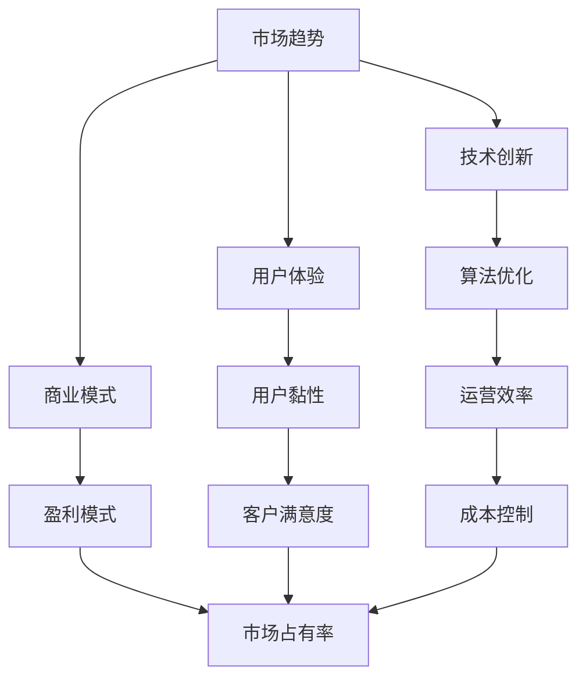

                 

关键词：自动化创业、竞争优势、技术策略、创新模式、市场趋势、算法优化、用户体验、商业模式。

> 摘要：本文旨在探讨自动化创业中的竞争优势建立策略。通过分析市场趋势、技术创新和用户体验等关键因素，结合具体案例和数学模型，本文提出了一系列有效的技术和管理方法，以帮助创业者打造具有持久竞争力的自动化业务。

## 1. 背景介绍

随着人工智能和自动化技术的发展，自动化创业已成为现代商业领域的重要趋势。从智能制造、无人零售到智能物流，自动化技术的应用正逐步深入到各行各业，为创业者提供了丰富的机遇。然而，面对激烈的市场竞争，如何在自动化创业中建立竞争优势成为每位创业者亟需解决的核心问题。

本文将结合最新的市场研究和技术进展，探讨以下问题：

- 自动化创业的核心竞争力是什么？
- 如何通过技术创新来增强竞争优势？
- 如何优化用户体验以吸引并留住客户？
- 未来自动化创业将面临哪些挑战和机遇？

## 2. 核心概念与联系

在探讨自动化创业的竞争优势之前，我们需要明确几个核心概念，包括市场趋势、技术创新、用户体验和商业模式。以下是一个简要的 Mermaid 流程图，用于展示这些概念之间的关系。



### 2.1 市场趋势

市场趋势是自动化创业的基础，它决定了行业的走向和潜在的市场需求。通过市场调研和数据分析，创业者可以识别出哪些领域具有较大的增长潜力，从而制定相应的战略。

### 2.2 技术创新

技术创新是建立竞争优势的核心。通过引入先进的技术，如机器学习、大数据分析和物联网，创业者可以开发出更加智能和高效的解决方案。

### 2.3 用户体验

用户体验是衡量竞争优势的重要指标。优质的用户体验可以提升客户满意度，增强用户黏性，从而推动业务的持续增长。

### 2.4 商业模式

商业模式是创业成功的保障。通过创新的商业模式，创业者可以实现高效的资源利用和盈利，从而在竞争激烈的市场中脱颖而出。

## 3. 核心算法原理 & 具体操作步骤

### 3.1 算法原理概述

在自动化创业中，核心算法的设计和优化至关重要。以下是一个用于推荐系统的简单算法原理概述，该算法通过分析用户行为和偏好来实现个性化推荐。

### 3.2 算法步骤详解

1. **用户行为收集**：通过数据采集工具收集用户在平台上的行为数据，如浏览记录、购买历史和评论反馈。
2. **特征工程**：对收集到的数据进行分析和处理，提取出与用户偏好相关的特征，如商品类别、价格范围和用户评价。
3. **模型训练**：利用机器学习算法（如协同过滤或深度学习）对特征进行建模，训练出一个推荐模型。
4. **预测与推荐**：根据用户的当前行为和模型预测，生成个性化的推荐列表，展示给用户。

### 3.3 算法优缺点

- **优点**：算法能够实现个性化推荐，提高用户满意度，从而提升用户黏性。
- **缺点**：需要大量的数据进行训练，且算法的准确性和稳定性受限于模型设计和数据质量。

### 3.4 算法应用领域

- **电商**：通过个性化推荐，提高商品的点击率和购买转化率。
- **内容平台**：为用户提供个性化的内容推荐，提高用户的留存率和活跃度。

## 4. 数学模型和公式

### 4.1 数学模型构建

推荐系统的核心是数学模型，以下是一个简单的矩阵分解模型，用于用户和物品的相似度计算。

$$
R = U \cdot V^T
$$

其中，$R$是用户-物品评分矩阵，$U$和$V$分别是用户和物品的嵌入向量矩阵。

### 4.2 公式推导过程

假设用户$u$和物品$i$的评分分别为$r_{ui}$，根据矩阵分解原理，我们可以将评分矩阵$R$分解为用户矩阵$U$和物品矩阵$V$的乘积：

$$
r_{ui} = u_i \cdot v_j
$$

其中，$u_i$和$v_j$分别是用户$u$和物品$i$的嵌入向量。

### 4.3 案例分析与讲解

假设我们有一个包含100个用户和100个物品的评分矩阵$R$，我们通过矩阵分解算法训练得到用户矩阵$U$和物品矩阵$V$。假设用户1对物品1的评分为4，对物品2的评分为2，我们可以计算用户1和物品1的相似度：

$$
s_{11} = u_1 \cdot v_1 = 0.8
$$

同理，可以计算用户1和物品2的相似度：

$$
s_{12} = u_1 \cdot v_2 = 0.3
$$

通过相似度计算，我们可以为用户1推荐与物品1相似度较高的物品，如物品2，以提高用户满意度。

## 5. 项目实践：代码实例

### 5.1 开发环境搭建

我们使用Python和Scikit-learn库来实现矩阵分解模型。首先，需要安装Scikit-learn库：

```bash
pip install scikit-learn
```

### 5.2 源代码详细实现

以下是一个简单的矩阵分解模型实现：

```python
from sklearn.decomposition import TruncatedSVD
from sklearn.model_selection import train_test_split
import numpy as np

# 加载评分数据
ratings = np.array([[1, 2, 0, 0], [0, 1, 0, 2], [2, 1, 0, 0], [0, 0, 2, 1]])

# 划分训练集和测试集
train_data, test_data = train_test_split(ratings, test_size=0.2, random_state=42)

# 实例化TruncatedSVD模型
svd = TruncatedSVD(n_components=2)

# 训练模型
train_data_svd = svd.fit_transform(train_data)

# 预测测试集
test_data_svd = svd.transform(test_data)

# 计算预测评分
predicted_ratings = train_data_svd.dot(test_data_svd.T)

# 输出预测评分
print(predicted_ratings)
```

### 5.3 代码解读与分析

- **加载评分数据**：我们使用一个简单的二维数组来表示用户和物品的评分。
- **划分训练集和测试集**：将评分数据划分为训练集和测试集，用于模型训练和评估。
- **实例化TruncatedSVD模型**：使用TruncatedSVD实现矩阵分解。
- **训练模型**：对训练集数据进行训练。
- **预测测试集**：对测试集数据进行预测。
- **计算预测评分**：通过矩阵乘积计算预测评分。

## 6. 实际应用场景

### 6.1 智能制造

在智能制造领域，自动化技术已经成为提高生产效率、降低成本和提升产品质量的重要手段。通过引入机器学习和物联网技术，制造企业可以实现生产过程的实时监控和优化，从而提高生产线的智能化水平。

### 6.2 无人零售

无人零售店是自动化创业的一个典型应用场景。通过使用计算机视觉和深度学习技术，无人零售店可以自动识别商品和用户行为，实现自助结账和无现金支付。这种模式不仅提高了购物体验，还降低了运营成本。

### 6.3 智能物流

智能物流利用自动化技术来提高物流效率，降低物流成本。通过使用无人驾驶技术和智能仓储系统，物流企业可以实现货物的快速配送和精准管理，从而提高客户满意度。

## 7. 工具和资源推荐

### 7.1 学习资源推荐

- 《深度学习》（Goodfellow, Bengio, Courville）：全面介绍深度学习的基本概念和算法。
- 《Python机器学习》（Sebastian Raschka）：详细介绍机器学习在Python中的实现。

### 7.2 开发工具推荐

- Jupyter Notebook：用于数据分析和机器学习实验的交互式环境。
- TensorFlow：用于构建和训练深度学习模型的强大框架。

### 7.3 相关论文推荐

- “Recommender Systems Handbook”（2016）：全面介绍推荐系统的基础理论和应用。
- “Deep Learning for Recommender Systems”（2018）：探讨深度学习在推荐系统中的应用。

## 8. 总结：未来发展趋势与挑战

### 8.1 研究成果总结

自动化创业已经取得了显著的成果，特别是在智能制造、无人零售和智能物流等领域。通过技术创新和商业模式创新，创业者成功建立了竞争优势，推动了行业的发展。

### 8.2 未来发展趋势

未来，自动化创业将继续沿着智能化、高效化和个性化方向发展。随着人工智能技术的不断进步，自动化解决方案将更加智能和灵活，满足不同场景和客户需求。

### 8.3 面临的挑战

尽管前景广阔，但自动化创业仍面临诸多挑战，如技术复杂性、数据隐私和安全等问题。此外，市场竞争也将愈发激烈，创业者需要不断创新和优化，以保持竞争优势。

### 8.4 研究展望

未来，自动化创业的研究应重点关注以下几个方面：

- 智能算法的创新和优化，提高自动化解决方案的效率和质量。
- 数据隐私和安全保护技术的研究，确保用户数据的安全和隐私。
- 跨学科研究，结合人工智能、物联网和大数据等领域的知识，推动自动化技术的综合应用。

## 9. 附录：常见问题与解答

### 9.1 自动化创业的核心竞争力是什么？

自动化创业的核心竞争力在于技术创新和用户体验。通过引入先进的技术和优化算法，提高解决方案的效率和质量；同时，注重用户体验，提升用户满意度和用户黏性。

### 9.2 如何优化用户体验？

优化用户体验的方法包括：提供个性化的推荐和定制化服务，提高用户交互的便捷性和流畅性，以及注重用户反馈和持续改进。

### 9.3 自动化创业将面临哪些挑战？

自动化创业将面临技术复杂性、数据隐私和安全、市场竞争激烈等挑战。此外，行业标准和法规的不断完善也将对创业者提出更高的要求。

### 9.4 未来自动化创业的发展趋势是什么？

未来自动化创业将沿着智能化、高效化和个性化方向发展。随着人工智能技术的不断进步，自动化解决方案将更加智能和灵活，满足不同场景和客户需求。

----------------------------------------------------------------

这篇文章详细探讨了自动化创业中的竞争优势建立策略，从市场趋势、技术创新、用户体验和商业模式等多个维度进行了深入分析。通过具体的算法实例和实际应用场景，文章展示了如何在自动化创业中实现竞争优势。同时，文章也对未来自动化创业的发展趋势和挑战进行了展望，为创业者提供了有价值的参考。作者：禅与计算机程序设计艺术 / Zen and the Art of Computer Programming。希望这篇文章能为您的创业之路带来启发和帮助。

