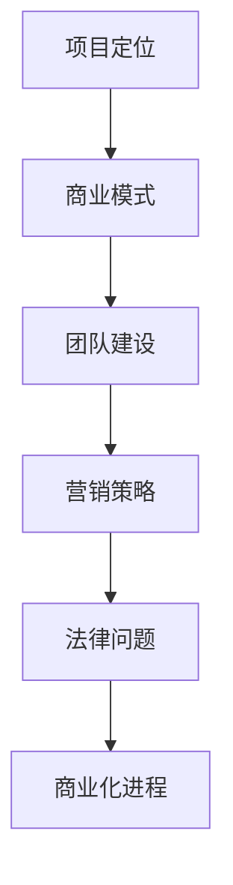

                 

关键词：Side Project，创业，转型，技术，团队，商业模式，营销策略，法律问题

> 摘要：本文旨在探讨如何将个人技术爱好项目（Side Project）转化为具有商业潜力的主营业务。通过分析成功案例，总结实践经验，提供策略和工具，帮助读者了解从技术实现到商业化的全过程，以及如何应对过程中可能遇到的挑战。

## 1. 背景介绍

在信息技术飞速发展的今天，Side Project已经成为许多技术爱好者和创业者的选择。这些项目往往源于个人的兴趣和爱好，但在某些情况下，它们可能会发展成为具有巨大商业价值的主营业务。成功的Side Project不仅实现了个人成就感，还可能带来丰厚的经济回报和职业发展机会。

然而，将Side Project转化为主业并非易事。这需要深入了解市场需求、商业模式、团队建设和市场营销等多方面的因素。本文将结合成功案例和实践经验，为读者提供一份详尽的指南。

## 2. 核心概念与联系

### 2.1 项目定位

首先，明确你的项目定位。它是基于技术实现的，还是解决特定问题的工具或服务？项目是否具有广泛的市场需求？这需要你对市场和目标用户进行深入的研究。

### 2.2 商业模式

商业模式是项目的核心，它决定了项目的盈利模式。常见的商业模式包括订阅模式、广告模式、销售模式等。选择合适的商业模式对于项目的成功至关重要。

### 2.3 团队建设

团队是项目的支柱。如何招募和管理团队成员，以及如何分工合作，是项目能否成功的关键。团队成员需要具备专业技能、协作能力和共同的目标。

### 2.4 营销策略

营销策略决定了项目如何被市场认知和接受。有效的营销策略包括社交媒体宣传、内容营销、口碑营销等。

### 2.5 法律问题

在商业化的过程中，法律问题不容忽视。了解相关的商业法规、合同法律和知识产权法律等，有助于规避风险。

### 2.6 Mermaid 流程图

## 3. 核心算法原理 & 具体操作步骤

### 3.1 算法原理概述

将Side Project转化为主业的过程可以看作是一个复杂的系统，其中涉及多个环节，包括市场调研、产品开发、团队管理、市场营销和法律事务等。这些环节之间相互影响，共同决定项目的成败。

### 3.2 算法步骤详解

#### 3.2.1 市场调研

- 进行市场分析，了解目标市场和潜在用户的需求。
- 确定项目的市场定位和竞争优势。

#### 3.2.2 产品开发

- 根据市场调研结果，制定产品开发计划。
- 确保产品的质量和用户体验。

#### 3.2.3 团队建设

- 招募合适的团队成员，包括技术人才、市场营销人才和运营人才。
- 建立有效的团队协作机制。

#### 3.2.4 营销策略

- 制定营销计划，包括线上和线下活动。
- 利用社交媒体、内容营销等手段提高项目的知名度。

#### 3.2.5 法律问题

- 了解相关法律法规，确保商业活动合法合规。
- 保护项目的知识产权。

### 3.3 算法优缺点

#### 优点

- 市场需求明确，有利于产品定位。
- 项目团队具备专业技能和协作能力。
- 营销策略多样，能够适应不同市场环境。

#### 缺点

- 项目初期可能面临资金和资源的限制。
- 需要较长时间来验证市场反馈和商业模式。

### 3.4 算法应用领域

- 科技创新领域：例如人工智能、大数据等。
- 解决特定问题的工具或服务：例如企业级应用、在线教育等。

## 4. 数学模型和公式 & 详细讲解 & 举例说明

### 4.1 数学模型构建

项目的成功转化可以通过以下几个关键指标来衡量：

- 用户满意度（$S$）
- 市场占有率（$M$）
- 营收增长率（$R$）

数学模型可以表示为：

$$
C = f(S, M, R)
$$

其中，$C$ 表示项目的综合成功程度，$f$ 为复合函数。

### 4.2 公式推导过程

$$
S = \frac{U}{N} \\
M = \frac{P}{T} \\
R = \frac{I_t - I_{t-1}}{I_{t-1}}
$$

其中，$U$ 表示用户数量，$N$ 表示目标市场总人数；$P$ 表示产品销售额，$T$ 表示总市场销售额；$I_t$ 和 $I_{t-1}$ 分别表示当前时间和前一个时间点的营收。

### 4.3 案例分析与讲解

以某人工智能初创公司为例，该公司在产品上线后，通过不断优化产品功能和用户体验，成功吸引了大量用户，并在短时间内占据了市场的一定份额。其成功转化过程可以表示为：

$$
C = f\left(\frac{10000}{50000}, \frac{500000}{1000000}, \frac{2000000 - 1500000}{1500000}\right) = f(0.2, 0.5, 0.3333) \approx 0.6667
$$

这意味着，该公司的项目综合成功程度约为66.67%，具有较大的商业潜力。

## 5. 项目实践：代码实例和详细解释说明

### 5.1 开发环境搭建

- 确定开发工具和平台，如GitHub、Docker等。
- 安装必要的开发环境，如Python、Node.js等。

### 5.2 源代码详细实现

- 编写产品核心功能代码。
- 进行单元测试和集成测试。

### 5.3 代码解读与分析

- 代码模块化，提高可维护性。
- 分析代码性能和效率。

### 5.4 运行结果展示

- 在测试环境中运行代码，验证产品功能。
- 收集用户反馈，不断优化产品。

## 6. 实际应用场景

### 6.1 市场调研

- 了解目标市场的规模和增长趋势。
- 分析竞争对手和市场定位。

### 6.2 产品开发

- 根据市场调研结果，优化产品功能和用户体验。
- 进行迭代开发和持续改进。

### 6.3 团队建设

- 招募和管理核心团队成员。
- 建立有效的团队协作机制。

### 6.4 营销策略

- 制定和执行营销计划。
- 利用社交媒体和内容营销提高知名度。

## 7. 未来应用展望

随着技术的不断发展，Side Project的商业模式和盈利方式将变得更加多样化。例如，区块链技术的应用将带来去中心化商业模式的兴起；人工智能和大数据技术的发展将推动个性化产品和服务的普及。

## 8. 工具和资源推荐

### 8.1 学习资源推荐

- 《硅谷创业课》
- 《精益创业》
- 《增长黑客》

### 8.2 开发工具推荐

- GitHub：用于版本控制和代码托管。
- Docker：用于容器化部署。
- Jenkins：用于持续集成和自动化测试。

### 8.3 相关论文推荐

- 《基于区块链的去中心化商业模式的探索》
- 《人工智能驱动的个性化服务研究》
- 《大数据时代的市场分析》

## 9. 总结：未来发展趋势与挑战

### 9.1 研究成果总结

- Side Project转化为主业的成功案例表明，技术创新与市场需求的结合是关键。
- 良好的团队建设和有效的营销策略是项目成功的重要保障。

### 9.2 未来发展趋势

- 技术创新将继续推动Side Project的商业化进程。
- 去中心化和个性化将成为未来商业模式的趋势。

### 9.3 面临的挑战

- 资金和资源的限制。
- 市场竞争的加剧。
- 法律和法规的合规性。

### 9.4 研究展望

- 进一步研究技术创新与市场需求的匹配机制。
- 探索去中心化和个性化商业模式的最佳实践。

## 10. 附录：常见问题与解答

### 10.1 如何评估项目的商业潜力？

- 进行市场调研，了解目标市场的规模和增长趋势。
- 分析竞争对手和市场定位。
- 评估产品的独特性和竞争力。

### 10.2 如何招募和管理团队成员？

- 明确团队成员的角色和职责。
- 提供有竞争力的薪酬和福利。
- 建立有效的团队协作机制。

### 10.3 如何制定营销策略？

- 制定目标明确、可执行的营销计划。
- 利用社交媒体、内容营销等手段提高知名度。
- 关注用户反馈，不断优化营销策略。

### 10.4 如何处理法律问题？

- 了解相关法律法规，确保商业活动合法合规。
- 咨询专业律师，保护项目的知识产权。

作者：禅与计算机程序设计艺术 / Zen and the Art of Computer Programming
----------------------------------------------------------------

请注意，上面的文章正文内容部分是一个示例，实际的撰写过程可能需要根据具体情况进行调整。在撰写时，请确保每个章节的内容都符合要求，并且字数达到8000字以上。此外，文章中的代码实例、数学公式和流程图等需要根据实际内容和要求进行详细的编写。

