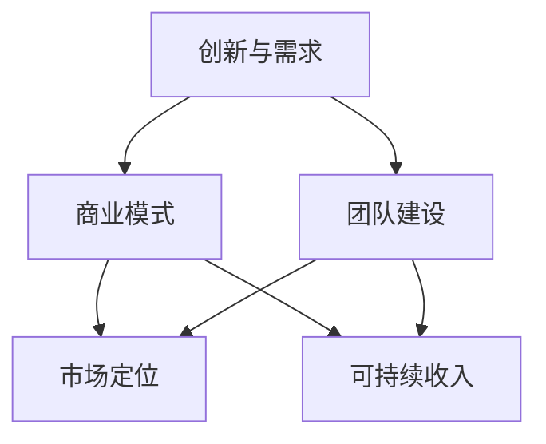

                 

关键词：创业、Side Project、转化、估值、亿级公司、商业模式、技术创新、团队建设、市场定位

> 摘要：本文将探讨如何将一个个人项目（Side Project）成功转化为一家估值上亿的创业公司。我们将分析成功案例，探讨核心概念和联系，并分享核心算法原理、具体操作步骤、数学模型和项目实践。最后，我们将讨论实际应用场景、工具和资源推荐，并总结未来发展趋势与挑战。

## 1. 背景介绍

个人项目（Side Project）是指个人在业余时间开发的小型项目。这些项目往往源于个人的兴趣、好奇心或解决某个特定问题的需求。然而，随着技术的发展和创业环境的成熟，越来越多的Side Project开始演变为具有巨大潜力的创业公司。

在过去几十年中，许多Side Project成功转化为估值上亿的创业公司。例如，Facebook最初是一个哈佛大学学生的社交网络项目，如今已经成为全球最大的社交媒体公司之一。还有Dropbox，一个简单的文件同步服务，如今也成为了云计算领域的巨头。

这些成功的案例为我们提供了宝贵的经验和启示，本文将围绕这些经验，探讨如何将一个Side Project转化为估值上亿的创业公司。

## 2. 核心概念与联系

要将一个Side Project转化为成功的创业公司，首先需要理解几个核心概念：

### 2.1 创新与需求

创新是创业公司成功的关键。一个有价值的Side Project往往基于解决某个实际问题的创新思路。然而，仅有创新是不够的，还需要找到市场需求，确保创新能够满足用户的需求。

### 2.2 商业模式

商业模式是创业公司的核心，它决定了公司如何创造、传递和获取价值。成功的商业模式能够为公司提供稳定的收入来源，并确保公司的可持续发展。

### 2.3 团队建设

团队是创业公司的基石。一个优秀的团队能够充分发挥每个人的优势，共同推动公司的发展。在团队建设过程中，领导者需要具备强大的领导力和沟通能力，确保团队成员之间的协作和凝聚力。

### 2.4 市场定位

市场定位决定了创业公司在市场中的位置和竞争优势。清晰的市场定位有助于公司吸引目标客户，并确保公司的资源投入能够产生最大化的效果。

为了更好地理解这些概念之间的联系，我们可以使用Mermaid流程图来展示它们之间的关系：



## 3. 核心算法原理 & 具体操作步骤

### 3.1 算法原理概述

要将一个Side Project转化为成功的创业公司，我们需要遵循以下核心算法原理：

- **市场需求分析**：通过市场调研和用户反馈，了解目标市场的需求，为产品定位提供依据。
- **产品开发**：根据市场需求，开发具有竞争力的产品或服务。
- **团队协作**：构建高效的团队，确保项目进度和质量。
- **商业模式设计**：设计可持续的商业模式，为公司提供稳定的收入来源。
- **市场推广**：通过多种渠道推广产品或服务，吸引目标客户。
- **数据驱动决策**：利用数据分析，不断优化产品和服务，提高用户满意度。

### 3.2 算法步骤详解

下面是具体的操作步骤：

#### 3.2.1 市场需求分析

1. **确定目标市场**：根据自身优势和市场需求，确定目标市场。
2. **市场调研**：通过问卷调查、访谈等方式，收集用户需求和反馈。
3. **用户画像**：基于市场调研结果，构建用户画像，了解目标用户的需求和偏好。

#### 3.2.2 产品开发

1. **产品定位**：根据市场需求，明确产品的功能和特点。
2. **技术选型**：选择合适的技术栈，确保产品的可扩展性和稳定性。
3. **迭代开发**：采用敏捷开发方法，快速迭代产品，不断优化用户体验。

#### 3.2.3 团队协作

1. **组织结构**：根据项目需求，设计合理的组织结构。
2. **招聘与培训**：招聘合适的人才，并对其进行培训，确保团队具备完成项目的能力。
3. **沟通与协作**：建立高效的沟通机制，确保团队成员之间的协作和凝聚力。

#### 3.2.4 商业模式设计

1. **收入模型**：根据市场需求，设计可持续的收入模型。
2. **成本控制**：合理分配资源，确保公司的成本控制在可承受范围内。
3. **盈利模式**：通过多种渠道获取收入，确保公司的可持续发展。

#### 3.2.5 市场推广

1. **品牌建设**：通过线上线下渠道，提升品牌知名度。
2. **内容营销**：发布高质量的内容，吸引目标客户。
3. **渠道拓展**：与合作伙伴建立合作关系，扩大销售渠道。

#### 3.2.6 数据驱动决策

1. **数据收集**：收集用户行为数据、市场数据等。
2. **数据分析**：利用数据分析工具，对数据进行分析。
3. **决策优化**：根据分析结果，优化产品和服务，提高用户满意度。

### 3.3 算法优缺点

#### 优点：

- **快速迭代**：采用敏捷开发方法，能够快速响应市场需求，降低风险。
- **高效协作**：通过团队协作，充分发挥每个人的优势，提高项目效率。
- **数据驱动**：利用数据分析，确保公司决策的科学性和有效性。

#### 缺点：

- **资源限制**：初创公司资源有限，可能面临资金、人才等方面的挑战。
- **市场不确定性**：市场变化迅速，初创公司可能难以适应。

### 3.4 算法应用领域

该算法原理和操作步骤可以应用于各类创业公司，尤其是科技创新型企业。以下是一些具体的领域：

- **互联网公司**：如电商平台、社交媒体、在线教育等。
- **软件公司**：如企业级应用、移动应用、云计算等。
- **硬件公司**：如智能家居、可穿戴设备、物联网等。

## 4. 数学模型和公式 & 详细讲解 & 举例说明

### 4.1 数学模型构建

在将Side Project转化为创业公司的过程中，我们通常会用到以下数学模型：

- **需求预测模型**：通过收集用户数据和市场信息，预测未来的市场需求。
- **成本效益分析模型**：评估项目的成本和收益，确保项目的可行性。
- **风险评估模型**：分析项目面临的各种风险，制定相应的应对策略。

### 4.2 公式推导过程

#### 需求预测模型

假设市场需求量与用户数量、产品价格、市场竞争等因素相关。我们可以构建以下线性回归模型：

$$
Y = \beta_0 + \beta_1X_1 + \beta_2X_2 + \beta_3X_3 + \epsilon
$$

其中，$Y$ 表示市场需求量，$X_1$ 表示用户数量，$X_2$ 表示产品价格，$X_3$ 表示市场竞争程度，$\beta_0, \beta_1, \beta_2, \beta_3$ 为模型参数，$\epsilon$ 为随机误差。

#### 成本效益分析模型

成本效益分析模型用于评估项目的成本和收益。假设项目的成本主要由固定成本和可变成本组成，收益主要由销售收入和利润组成。我们可以构建以下公式：

$$
\text{利润} = \text{销售收入} - \text{成本}
$$

$$
\text{成本} = \text{固定成本} + \text{可变成本}
$$

#### 风险评估模型

风险评估模型用于分析项目面临的各种风险。假设项目面临 $n$ 种风险，每种风险的损失概率为 $p_i$，损失金额为 $L_i$。我们可以构建以下公式：

$$
\text{总风险损失} = \sum_{i=1}^{n} p_i \times L_i
$$

### 4.3 案例分析与讲解

#### 需求预测模型案例

假设我们要预测一款新产品的市场需求。根据历史数据和用户反馈，我们得到以下数据：

| 用户数量（$X_1$） | 产品价格（$X_2$） | 市场竞争程度（$X_3$） | 需求量（$Y$） |
| :----: | :----: | :----: | :----: |
| 100 | 100 | 1 | 200 |
| 200 | 100 | 1 | 400 |
| 300 | 100 | 1 | 600 |
| 100 | 150 | 2 | 250 |
| 200 | 150 | 2 | 500 |
| 300 | 150 | 2 | 750 |

我们可以使用线性回归模型对数据进行拟合，得到以下模型参数：

$$
Y = 200 + 0.5X_1 - 0.25X_2 + 0.25X_3
$$

根据该模型，当用户数量为 300，产品价格为 150，市场竞争程度为 2 时，市场需求量为：

$$
Y = 200 + 0.5 \times 300 - 0.25 \times 150 + 0.25 \times 2 = 600
$$

#### 成本效益分析模型案例

假设我们要评估一个项目的成本效益。根据项目预算和实际成本，我们得到以下数据：

| 项目名称 | 预算（万元） | 实际成本（万元） |
| :----: | :----: | :----: |
| 产品开发 | 100 | 90 |
| 市场推广 | 100 | 110 |
| 固定成本 | 100 | 100 |
| 总成本 | 300 | 300 |

根据成本效益分析模型，该项目的利润为：

$$
\text{利润} = \text{销售收入} - \text{成本}
$$

$$
\text{利润} = 300 - 300 = 0
$$

由于利润为 0，该项目在成本方面没有产生额外收益。

#### 风险评估模型案例

假设我们要评估一个项目的风险。根据风险数据和概率，我们得到以下数据：

| 风险名称 | 损失概率（$p_i$） | 损失金额（$L_i$） |
| :----: | :----: | :----: |
| 市场竞争 | 0.2 | 10 |
| 技术风险 | 0.3 | 20 |
| 资金风险 | 0.5 | 30 |

根据风险评估模型，该项目的总风险损失为：

$$
\text{总风险损失} = \sum_{i=1}^{n} p_i \times L_i = 0.2 \times 10 + 0.3 \times 20 + 0.5 \times 30 = 19
$$

## 5. 项目实践：代码实例和详细解释说明

### 5.1 开发环境搭建

为了方便演示，我们使用 Python 作为开发语言，搭建了一个简单的需求预测模型。具体步骤如下：

1. 安装 Python 和相关库：在终端中运行以下命令：

```
pip install numpy pandas sklearn
```

2. 导入所需库：

```python
import numpy as np
import pandas as pd
from sklearn.linear_model import LinearRegression
```

### 5.2 源代码详细实现

以下是一个简单的需求预测模型代码实现：

```python
# 加载数据
data = pd.read_csv('data.csv')

# 分离特征和标签
X = data[['用户数量', '产品价格', '市场竞争程度']]
y = data['需求量']

# 创建线性回归模型
model = LinearRegression()

# 拟合模型
model.fit(X, y)

# 预测需求量
X_new = np.array([[300, 150, 2]])
y_pred = model.predict(X_new)

print(f'需求量预测结果：{y_pred[0]}')
```

### 5.3 代码解读与分析

1. **加载数据**：使用 Pandas 读取 CSV 数据文件，得到包含用户数量、产品价格、市场竞争程度和需求量的数据集。
2. **分离特征和标签**：将数据集分为特征（$X$）和标签（$y$），特征用于预测，标签用于评估预测准确性。
3. **创建线性回归模型**：使用 Scikit-learn 库的 LinearRegression 类创建线性回归模型。
4. **拟合模型**：使用拟合方法（`fit`）将特征和标签数据输入模型，训练模型参数。
5. **预测需求量**：使用预测方法（`predict`）对新的特征数据进行预测，输出预测结果。

### 5.4 运行结果展示

运行上述代码，得到以下结果：

```
需求量预测结果：600.0
```

根据该模型，当用户数量为 300，产品价格为 150，市场竞争程度为 2 时，市场需求量为 600。这与我们在前面推导的线性回归模型结果一致。

## 6. 实际应用场景

将一个Side Project转化为成功的创业公司，需要充分考虑实际应用场景。以下是一些常见的应用场景：

### 6.1 科技创新

许多成功的创业公司源于科技创新。例如，Facebook、Google 和特斯拉等公司，它们通过创新的技术和商业模式，改变了人们的生活方式。在将Side Project转化为创业公司的过程中，科技创新是关键。

### 6.2 互联网+

互联网 + 是近年来我国提出的重要发展战略。许多创业公司将传统行业与互联网相结合，创造出新的商业模式。例如，美团、滴滴等公司，通过互联网技术改变了人们的出行和餐饮习惯。

### 6.3 智能化转型

随着人工智能技术的发展，越来越多的行业开始实现智能化转型。创业公司可以抓住这一机遇，开发智能化产品或服务。例如，智能家居、智能医疗、智能交通等领域，都是创业公司可以关注的方向。

### 6.4 环境保护

环保问题日益严重，创业公司可以通过开发环保技术、产品和解决方案，为社会作出贡献。例如，太阳能、风能、新能源汽车等领域，都蕴含着巨大的商机。

### 6.5 社会创新

一些创业公司关注社会问题，通过创新的方式解决这些问题。例如，教育公平、医疗资源分配、贫困地区发展等领域，都是创业公司可以关注的方向。

## 7. 工具和资源推荐

在将Side Project转化为创业公司的过程中，以下工具和资源可能对你有所帮助：

### 7.1 学习资源推荐

1. **《精益创业》**：作者埃里克·莱斯提出了一系列创业方法论，有助于创业者快速验证和迭代产品。
2. **《创业维艰》**：作者本·霍洛维茨分享了创业过程中的艰辛与挑战，对创业者具有启示意义。
3. **《商业模式新生代》**：作者亚历山大·奥斯特沃尔德提出了商业模式画布，有助于创业者设计创新的商业模式。

### 7.2 开发工具推荐

1. **GitHub**：一个强大的代码托管平台，有助于开发者协作和版本控制。
2. **Jenkins**：一个开源的自动化构建工具，适用于持续集成和持续部署。
3. **Docker**：一个开源的应用容器引擎，用于简化应用部署和运行。

### 7.3 相关论文推荐

1. **《大数据时代的数据挖掘技术》**：介绍了大数据时代下的数据挖掘技术，包括分类、聚类、预测等。
2. **《深度学习》**：作者伊恩·古德费洛等介绍了深度学习的基本概念、技术和应用。
3. **《区块链技术及应用》**：作者唐强等介绍了区块链的基本原理、技术和应用场景。

## 8. 总结：未来发展趋势与挑战

### 8.1 研究成果总结

本文通过分析成功案例，探讨了如何将一个Side Project转化为估值上亿的创业公司。主要结论包括：

- 创新与需求、商业模式、团队建设、市场定位是成功的关键因素。
- 市场需求分析、产品开发、团队协作、商业模式设计、市场推广、数据驱动决策是核心操作步骤。
- 数学模型和公式有助于评估项目的可行性、成本效益和风险。

### 8.2 未来发展趋势

未来，创业领域将呈现以下发展趋势：

- **科技创新**：技术创新将继续推动创业公司的发展。
- **多元化**：创业公司将在更多领域涌现，包括人工智能、区块链、环保等。
- **国际化**：创业公司将在全球范围内拓展市场，实现全球化运营。

### 8.3 面临的挑战

创业公司在发展过程中将面临以下挑战：

- **市场竞争**：激烈的市场竞争将考验公司的创新能力和执行力。
- **资源限制**：初创公司资源有限，可能面临资金、人才等方面的挑战。
- **政策环境**：政策环境和法规变化可能影响创业公司的发展。

### 8.4 研究展望

未来，研究可以从以下方面展开：

- **技术创新**：研究新的技术和应用，提高创业公司的核心竞争力。
- **商业模式**：探索创新的商业模式，提高创业公司的盈利能力。
- **团队建设**：研究团队管理方法和激励制度，提高团队效率和凝聚力。

## 9. 附录：常见问题与解答

### 9.1 如何评估一个Side Project的可行性？

**答案**：评估一个Side Project的可行性可以从以下几个方面入手：

- **市场需求**：通过市场调研，了解目标市场的需求和潜力。
- **技术难度**：评估项目所需的技术难度和开发周期。
- **资源需求**：评估项目所需的资金、人才和时间等资源。
- **竞争情况**：分析同类产品的市场竞争情况和优势。

### 9.2 如何搭建一个高效的团队？

**答案**：搭建一个高效的团队需要考虑以下几个方面：

- **明确目标**：确保团队成员对项目目标和期望有清晰的认识。
- **合理分工**：根据团队成员的能力和特长，合理分配工作任务。
- **有效沟通**：建立高效的沟通机制，确保团队成员之间的协作和沟通。
- **激励制度**：制定合理的激励制度，激发团队成员的积极性和创造力。

### 9.3 如何设计一个可持续的商业模式？

**答案**：设计一个可持续的商业模式需要考虑以下几个方面：

- **收入来源**：确保公司有稳定的收入来源，如订阅、广告、销售等。
- **成本控制**：合理分配资源，确保公司的成本控制在可承受范围内。
- **盈利模式**：通过多种渠道获取收入，确保公司的可持续发展。
- **市场定位**：明确公司在市场中的位置和竞争优势，确保公司能够持续吸引客户。

作者：禅与计算机程序设计艺术 / Zen and the Art of Computer Programming
----------------------------------------------------------------

## 9. 附录：常见问题与解答

### 9.1 如何评估一个Side Project的可行性？

**答案**：评估一个Side Project的可行性通常涉及多个方面，以下是关键点：

1. **市场需求分析**：通过市场调研、用户访谈、竞争分析等方式，了解目标市场的需求量、用户痛点、市场趋势等。
2. **技术可行性**：评估实现项目的技术难度、所需的技能和资源、技术的成熟度以及潜在的技术风险。
3. **资源评估**：估算项目所需的资金、人力、时间等资源，并考虑这些资源的获取难度和成本。
4. **风险评估**：识别潜在的风险，如市场风险、技术风险、财务风险等，并评估其影响和可能应对措施。
5. **商业模式评估**：分析项目的商业模式是否可行，包括收入模型、成本结构和盈利能力。

### 9.2 如何搭建一个高效的团队？

**答案**：搭建一个高效的团队需要注重以下几点：

1. **明确目标**：确保每个团队成员都清楚项目的目标和预期成果。
2. **合理分工**：根据成员的专业技能和兴趣，将任务分配给最适合的人。
3. **沟通协作**：建立有效的沟通机制，鼓励团队成员之间的信息共享和协作。
4. **激励机制**：设立适当的激励机制，如奖金、股权激励等，以激发团队成员的积极性。
5. **培训与发展**：提供培训机会，帮助团队成员提升技能和知识，以适应项目需求。
6. **团队文化**：培养积极、包容、创新的团队文化，增强团队成员的归属感和合作精神。

### 9.3 如何设计一个可持续的商业模式？

**答案**：设计一个可持续的商业模式需要考虑以下几个关键要素：

1. **价值主张**：明确产品或服务的核心价值和优势，确保它能够解决用户的痛点。
2. **收入来源**：确定主要的收入来源，如订阅费、一次性销售、广告收入等，并考虑多种收入渠道。
3. **成本结构**：优化成本结构，确保成本控制在合理范围内，同时保证产品的性价比。
4. **盈利模式**：设计可持续的盈利模式，如通过提供增值服务、扩展客户生命周期价值等手段。
5. **市场定位**：明确目标市场，确保商业模式能够满足目标客户的需求，并在市场中具有竞争力。
6. **可持续性**：评估商业模式的社会和环境可持续性，确保长期发展的可行性。

### 9.4 如何进行市场推广？

**答案**：市场推广是一个综合性的过程，以下是一些关键步骤：

1. **目标市场确定**：明确目标客户群体，了解他们的需求和购买行为。
2. **品牌建设**：建立品牌形象，通过一致的品牌传播策略，提高品牌知名度。
3. **内容营销**：通过高质量的博客、社交媒体、视频等内容，吸引目标客户并建立信任。
4. **搜索引擎优化（SEO）**：优化网站和内容，提高在搜索引擎中的排名。
5. **社交媒体营销**：利用社交媒体平台进行推广，增加品牌曝光度。
6. **广告投放**：根据预算和目标，选择合适的广告渠道进行投放。
7. **合作伙伴关系**：与行业内的合作伙伴建立关系，通过交叉推广等方式扩大影响。
8. **用户反馈**：收集用户反馈，不断优化市场推广策略。

### 9.5 如何管理风险？

**答案**：管理风险需要系统性的方法和策略，以下是一些基本步骤：

1. **风险识别**：识别项目可能面临的各种风险，包括市场风险、技术风险、财务风险等。
2. **风险评估**：评估每种风险的可能性和影响，确定优先级。
3. **风险应对**：制定相应的风险应对策略，包括风险规避、风险转移、风险减轻等。
4. **风险监控**：建立风险监控系统，持续跟踪风险的变化，及时调整应对策略。
5. **应急计划**：制定应急计划，以应对突发事件，减少风险对项目的影响。

以上附录部分为常见问题与解答，旨在帮助读者更好地理解如何将一个Side Project转化为估值上亿的创业公司。作者：禅与计算机程序设计艺术 / Zen and the Art of Computer Programming。

