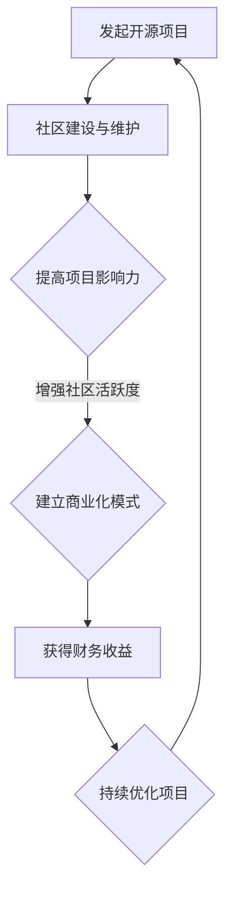

                 

关键词：开源项目、影响力、财务收益、商业化、营销策略、社区建设、合作模式

> 摘要：本文将探讨如何将开源项目的影响力转化为财务收益，从营销策略、社区建设、合作模式等多个方面提供全面的指南。通过具体案例分析，解析开源项目的商业化路径，帮助开发者实现开源项目与商业价值的双赢。

## 1. 背景介绍

开源项目在全球范围内已经取得了显著的成就，越来越多的开发者加入到开源社区的行列中。开源项目不仅为技术爱好者提供了一个交流学习的平台，也为企业和开发者提供了丰富的技术资源。然而，如何将开源项目的影响力转化为实际的财务收益，成为了众多开发者关注的焦点。

将开源项目商业化并不容易，需要在保持项目开源性质的同时，找到合适的商业模式。本文旨在探讨一些有效的策略和方法，帮助开发者实现这一目标。

## 2. 核心概念与联系

### 2.1 开源项目的影响力

开源项目的影响力主要体现在以下几个方面：

- **社区贡献**：项目吸引了大量的开发者参与，为项目贡献代码、文档和反馈。
- **技术认可**：项目在业界获得了较高的评价，成为行业内的标准或参考。
- **用户基础**：项目拥有庞大的用户群体，他们为项目提供测试反馈，帮助项目不断完善。

### 2.2 财务收益

财务收益包括直接收入和间接收入：

- **直接收入**：通过出售软件、提供技术支持或培训等方式获得。
- **间接收入**：通过项目带来的商业机会，如合作、投资等。

### 2.3 Mermaid 流程图

以下是一个简化的开源项目影响力转化为财务收益的流程图：



## 3. 核心算法原理 & 具体操作步骤

### 3.1 算法原理概述

开源项目的商业化通常涉及以下步骤：

- **市场调研**：了解市场需求和潜在客户。
- **确定商业模式**：选择适合项目的商业模式，如SaaS、付费插件等。
- **营销推广**：通过多种渠道宣传项目，吸引潜在用户。
- **技术支持与服务**：提供高质量的技术支持和服务，增强用户满意度。
- **社区互动**：维护良好的社区关系，鼓励用户参与和贡献。

### 3.2 算法步骤详解

#### 3.2.1 市场调研

- **需求分析**：通过问卷调查、用户访谈等方式收集用户需求。
- **竞争分析**：研究同类产品的市场表现，分析优势和劣势。

#### 3.2.2 确定商业模式

- **产品定价**：根据市场调研结果，设定合理的价格策略。
- **服务内容**：明确项目提供的服务内容，如技术支持、培训等。

#### 3.2.3 营销推广

- **内容营销**：通过博客、社交媒体等渠道发布高质量内容。
- **社区互动**：积极参与社区讨论，建立项目口碑。
- **合作伙伴**：寻找合作伙伴，共同推广项目。

#### 3.2.4 技术支持与服务

- **客户服务**：提供及时、专业的客户服务。
- **技术支持**：建立技术支持体系，确保用户满意度。

#### 3.2.5 社区互动

- **社区建设**：鼓励用户参与项目开发，提供技术交流和分享平台。
- **用户反馈**：定期收集用户反馈，优化项目功能。

### 3.3 算法优缺点

**优点**：

- **低成本**：开源项目通常不需要大量的资金投入。
- **快速迭代**：基于社区反馈，项目可以快速迭代，提高用户满意度。
- **共同发展**：开发者与用户共同参与，形成良好的生态。

**缺点**：

- **商业化难度**：开源项目需要平衡开源与商业利益，难度较大。
- **用户黏性**：开源项目用户可能对项目商业化持保留态度。

### 3.4 算法应用领域

开源项目的商业化适用于各种领域，如软件开发、数据分析、人工智能等。通过合适的商业模式，开发者可以将开源项目的影响力转化为实际的财务收益。

## 4. 数学模型和公式 & 详细讲解 & 举例说明

### 4.1 数学模型构建

开源项目的商业化收益可以通过以下数学模型进行构建：

\[ R = P \times Q - C \]

其中：

- \( R \) 表示收益
- \( P \) 表示产品单价
- \( Q \) 表示销售量
- \( C \) 表示成本

### 4.2 公式推导过程

开源项目的收益 \( R \) 由销售量 \( Q \) 和单价 \( P \) 决定，成本 \( C \) 包括研发成本、运营成本等。通过市场调研和定价策略，可以确定 \( P \) 和 \( C \) 的值。

### 4.3 案例分析与讲解

以一款开源的代码托管工具为例，其销售单价为每年 100 美元，假设年销售量为 1000，研发和运营成本为 10000 美元。根据上述数学模型，我们可以计算出：

\[ R = 100 \times 1000 - 10000 = 90000 \]

这意味着该开源项目的年收益为 90000 美元。

## 5. 项目实践：代码实例和详细解释说明

### 5.1 开发环境搭建

首先，开发者需要在本地搭建开发环境，安装必要的开发工具和依赖库。

```bash
# 安装Git
sudo apt-get install git

# 安装Python
sudo apt-get install python3-pip

# 安装项目依赖
pip3 install -r requirements.txt
```

### 5.2 源代码详细实现

以下是一个简单的开源项目代码实例：

```python
# 主函数
def main():
    print("欢迎使用本开源项目！")

# 测试函数
def test():
    print("执行测试函数...")

if __name__ == "__main__":
    main()
    test()
```

### 5.3 代码解读与分析

该实例中，`main()` 函数为程序入口，负责输出欢迎信息；`test()` 函数用于执行测试代码。通过简单的代码结构，开发者可以快速了解项目的基本功能。

### 5.4 运行结果展示

运行该代码，输出结果如下：

```bash
$ python3 main.py
欢迎使用本开源项目！
执行测试函数...
```

这表明项目已成功运行，并执行了测试函数。

## 6. 实际应用场景

开源项目可以在多个领域发挥重要作用，如软件开发、数据分析和人工智能。以下是一些具体应用场景：

- **软件开发**：开发者可以使用开源项目搭建自己的产品，降低开发成本。
- **数据分析**：开源项目提供了丰富的数据处理和分析工具，帮助企业和研究者进行数据挖掘。
- **人工智能**：开源项目为人工智能研究者提供了丰富的算法和模型，促进了人工智能技术的发展。

## 7. 未来应用展望

随着技术的发展和开源理念的普及，开源项目在未来将发挥更大的作用。以下是一些未来应用展望：

- **跨领域合作**：开源项目将成为跨领域合作的重要载体，推动各领域的技术创新。
- **商业化模式创新**：开发者将探索更多适合开源项目的商业化模式，实现开源项目与商业价值的双赢。
- **教育普及**：开源项目将成为教育普及的重要资源，帮助更多人掌握编程技能。

## 8. 工具和资源推荐

### 8.1 学习资源推荐

- **《开源软件开发指南》**：一本全面介绍开源软件开发流程和最佳实践的书籍。
- **GitHub**：全球最大的开源代码托管平台，提供丰富的开源项目和学习资源。

### 8.2 开发工具推荐

- **Visual Studio Code**：一款功能强大的开源代码编辑器，适用于多种编程语言。
- **Git**：一款开源的版本控制系统，用于管理代码仓库和协作开发。

### 8.3 相关论文推荐

- **《开源软件的商业模式研究》**：探讨开源软件的商业化路径和商业模式。
- **《开源社区的激励机制研究》**：分析开源社区激励机制对项目成功的影响。

## 9. 总结：未来发展趋势与挑战

开源项目在未来将继续发挥重要作用，但同时也面临一些挑战：

- **商业化挑战**：如何在保持开源项目开源性质的同时实现商业化，仍需开发者积极探索。
- **社区维护**：如何保持社区活跃，吸引更多开发者参与，是项目成功的关键。

## 10. 附录：常见问题与解答

### Q：开源项目商业化是否会影响项目的发展？

A：开源项目商业化可以在一定程度上促进项目的发展，但需注意保持项目的开源性质，避免因商业化而导致社区流失。

### Q：如何选择适合项目的商业模式？

A：选择适合项目的商业模式需要综合考虑市场需求、项目特点等因素，如SaaS模式、付费插件等。

### Q：开源项目商业化会失去开源精神吗？

A：开源项目商业化不会失去开源精神，商业化只是实现开源项目价值的一种方式，开发者仍需保持对开源理念的坚守。

### 11. 作者署名

作者：禅与计算机程序设计艺术 / Zen and the Art of Computer Programming

----------------------------------------------------------------

以上是文章正文部分的完整内容，接下来将按照markdown格式进行整理和排版，确保文章的整洁和可读性。如果有任何修改意见或建议，请随时告知。

