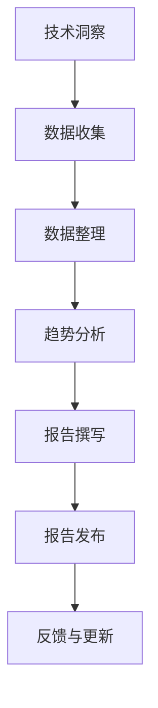

                 

技术洞察与技术趋势报告之间存在着紧密的联系。技术洞察指的是对现有技术发展的深入理解和敏锐观察，而技术趋势报告则是对这些洞察的系统总结和预测。将技术洞察转化为技术趋势报告，不仅需要专业知识和敏锐的洞察力，还需要严谨的逻辑和清晰的表达。本文将探讨如何有效地进行这一转化，帮助读者理解技术发展的方向，为未来的技术研究和应用提供指导。

## 1. 背景介绍

在现代信息技术高速发展的背景下，技术洞察和技术趋势报告的重要性日益凸显。技术洞察能够帮助我们把握技术发展的脉搏，识别潜在的创新机会和风险；而技术趋势报告则是对这些洞察的汇总和分析，为行业决策者、研究人员和企业提供有价值的参考。随着大数据、人工智能、区块链等新兴技术的崛起，技术发展的速度和复杂性不断增加，如何有效地进行技术洞察的转化，成为了技术研究和应用中的重要课题。

本文旨在通过以下三个方面，探讨如何将技术洞察转化为技术趋势报告：

1. **核心概念与联系**：介绍与转化过程相关的重要概念，并使用Mermaid流程图展示其关系。
2. **核心算法原理与操作步骤**：详细解释核心算法的基本原理和具体操作步骤，分析其优缺点和应用领域。
3. **项目实践与实际应用**：通过代码实例和详细解释，展示如何将理论转化为实际应用。

## 2. 核心概念与联系

在将技术洞察转化为技术趋势报告的过程中，需要明确以下几个核心概念：

### 2.1 技术洞察

技术洞察是对现有技术的深入理解，包括技术的基本原理、发展趋势、潜在问题等。技术洞察的来源可以是技术论文、行业报告、专家访谈等。其目的是捕捉技术的创新点，预测其发展方向。

### 2.2 技术趋势

技术趋势是对未来一段时间内技术发展的预测和判断，通常基于对现有技术洞察的分析和综合。技术趋势有助于指导研究和投资方向，推动技术创新。

### 2.3 技术趋势报告

技术趋势报告是对技术趋势的详细分析和总结，通常包含技术概述、趋势预测、应用案例等。其目的是为读者提供全面的技术发展全景，帮助其做出决策。

以下是一个使用Mermaid绘制的流程图，展示技术洞察转化为技术趋势报告的基本流程：



### 2.4 技术趋势报告的撰写步骤

- **数据收集**：通过文献调研、专家访谈、行业报告等方式收集相关数据。
- **数据整理**：对收集到的数据进行分析和处理，提取关键信息。
- **趋势分析**：基于数据，分析技术发展的方向和趋势。
- **报告撰写**：将分析结果撰写成报告，包括技术概述、趋势预测、应用案例等。
- **报告发布**：将报告发布给目标读者，包括行业决策者、研究人员和企业等。
- **反馈与更新**：根据读者的反馈，对报告进行更新和完善。

## 3. 核心算法原理与操作步骤

在技术趋势报告的撰写过程中，核心算法原理的理解和应用至关重要。以下将介绍一种常见的算法——时间序列分析，并详细解释其原理和操作步骤。

### 3.1 算法原理概述

时间序列分析是一种用于分析时间序列数据的方法，旨在捕捉数据在时间维度上的变化规律。时间序列数据通常具有以下特征：

1. **周期性**：数据在一段时间内重复出现相同的模式。
2. **趋势性**：数据随时间变化呈现出上升或下降的趋势。
3. **随机性**：数据的变化具有一定的随机性。

时间序列分析主要包括以下步骤：

1. **数据预处理**：对时间序列数据进行清洗、去噪和缺失值处理。
2. **特征提取**：从时间序列数据中提取关键特征，如周期性、趋势性和随机性。
3. **模型选择**：选择合适的时间序列模型，如ARIMA、LSTM等。
4. **模型训练与预测**：训练模型并使用模型进行预测，分析数据未来的变化趋势。

### 3.2 算法步骤详解

#### 3.2.1 数据预处理

数据预处理是时间序列分析的重要环节，主要包括以下步骤：

1. **数据清洗**：去除数据中的异常值和噪声，提高数据质量。
2. **去噪**：对含有噪声的时间序列数据，采用滤波方法进行去噪。
3. **缺失值处理**：对缺失值进行插值或删除，保持数据完整性。

#### 3.2.2 特征提取

特征提取是从时间序列数据中提取关键特征的过程，主要包括以下方法：

1. **周期性特征**：通过傅里叶变换等方法，提取数据中的周期性特征。
2. **趋势性特征**：通过差分、移动平均等方法，提取数据中的趋势性特征。
3. **随机性特征**：通过自相关函数、偏自相关函数等方法，提取数据中的随机性特征。

#### 3.2.3 模型选择

模型选择是根据时间序列数据的特点，选择合适的模型进行预测。常见的时间序列模型包括：

1. **ARIMA模型**：自回归积分滑动平均模型，适用于线性时间序列。
2. **LSTM模型**：长短时记忆网络，适用于非线性时间序列。
3. **GRU模型**：门控循环单元，是LSTM的一种改进，适用于非线性时间序列。

#### 3.2.4 模型训练与预测

模型训练与预测是时间序列分析的核心步骤，主要包括以下步骤：

1. **模型训练**：使用训练数据集对模型进行训练，调整模型参数。
2. **模型评估**：使用验证数据集对模型进行评估，判断模型性能。
3. **模型预测**：使用训练好的模型对测试数据进行预测，分析数据未来的变化趋势。

### 3.3 算法优缺点

时间序列分析具有以下优点：

1. **强大的预测能力**：能够捕捉时间序列数据的变化规律，进行有效的预测。
2. **广泛的应用领域**：适用于金融、气象、交通等多个领域。

但时间序列分析也存在以下缺点：

1. **对线性假设的依赖**：ARIMA模型等线性模型对线性假设较为敏感，可能无法捕捉非线性时间序列的变化。
2. **计算复杂度高**：时间序列分析涉及到大量的计算，计算复杂度较高。

### 3.4 算法应用领域

时间序列分析在多个领域具有广泛的应用：

1. **金融领域**：用于股票价格预测、金融风险评估等。
2. **气象领域**：用于天气预测、气候分析等。
3. **交通领域**：用于交通流量预测、路况分析等。

## 4. 数学模型和公式

在技术洞察转化为技术趋势报告的过程中，数学模型和公式是不可或缺的工具。以下将介绍一些常见的数学模型和公式，并详细讲解其构建和推导过程。

### 4.1 数学模型构建

数学模型是通过对现实问题的抽象和简化，构建的用于分析和预测的数学框架。以下是两个常见的数学模型：

#### 4.1.1 普通线性回归模型

普通线性回归模型是一种用于分析变量之间线性关系的模型，其公式如下：

$$
y = \beta_0 + \beta_1x + \epsilon
$$

其中，$y$ 是因变量，$x$ 是自变量，$\beta_0$ 和 $\beta_1$ 是模型参数，$\epsilon$ 是误差项。

#### 4.1.2 多元线性回归模型

多元线性回归模型是一种用于分析多个自变量与因变量之间线性关系的模型，其公式如下：

$$
y = \beta_0 + \beta_1x_1 + \beta_2x_2 + \cdots + \beta_nx_n + \epsilon
$$

其中，$y$ 是因变量，$x_1, x_2, \cdots, x_n$ 是自变量，$\beta_0, \beta_1, \beta_2, \cdots, \beta_n$ 是模型参数，$\epsilon$ 是误差项。

### 4.2 公式推导过程

以下将介绍普通线性回归模型的推导过程：

#### 4.2.1 模型假设

假设我们有两个变量 $x$ 和 $y$，我们希望找到一个线性关系来描述它们之间的关系：

$$
y = \beta_0 + \beta_1x + \epsilon
$$

其中，$\beta_0$ 是截距，$\beta_1$ 是斜率，$\epsilon$ 是误差项。

#### 4.2.2 模型最小二乘法求解

为了求解 $\beta_0$ 和 $\beta_1$，我们可以使用最小二乘法。最小二乘法的思想是，使得观测值 $y$ 与模型预测值 $\beta_0 + \beta_1x$ 之间的误差平方和最小。

定义误差平方和为：

$$
S = \sum_{i=1}^n (y_i - (\beta_0 + \beta_1x_i))^2
$$

对 $S$ 关于 $\beta_0$ 和 $\beta_1$ 分别求导，并令导数为零，得到以下方程组：

$$
\begin{cases}
\frac{\partial S}{\partial \beta_0} = -2\sum_{i=1}^n (y_i - \beta_0 - \beta_1x_i) = 0 \\
\frac{\partial S}{\partial \beta_1} = -2\sum_{i=1}^n (y_i - \beta_0 - \beta_1x_i)x_i = 0
\end{cases}
$$

解上述方程组，得到：

$$
\beta_0 = \frac{1}{n}\sum_{i=1}^n y_i - \beta_1\frac{1}{n}\sum_{i=1}^n x_i
$$

$$
\beta_1 = \frac{1}{n}\sum_{i=1}^n (x_i - \bar{x})(y_i - \bar{y})
$$

其中，$\bar{x}$ 和 $\bar{y}$ 分别是 $x$ 和 $y$ 的样本均值。

#### 4.2.3 模型解释

- **截距 $\beta_0$**：表示当 $x$ 为零时的 $y$ 值，即 $y$ 的起点。
- **斜率 $\beta_1$**：表示 $x$ 每增加一个单位，$y$ 的变化量。

### 4.3 案例分析与讲解

以下将使用一个具体案例，展示普通线性回归模型的实际应用：

#### 4.3.1 案例背景

假设我们研究某一城市某年的房价与城市人口之间的关系。我们收集到以下数据：

| 人口（万人） | 房价（万元/平方米）|
|-------------|------------------|
| 100         | 10000            |
| 200         | 12000            |
| 300         | 15000            |
| 400         | 18000            |
| 500         | 22000            |

#### 4.3.2 模型建立

我们可以使用普通线性回归模型，建立人口与房价之间的关系：

$$
房价 = \beta_0 + \beta_1 \times 人口
$$

#### 4.3.3 模型求解

将数据代入模型，得到以下方程组：

$$
\begin{cases}
100\beta_0 + 100\beta_1 = 10000 \\
200\beta_0 + 200\beta_1 = 12000 \\
300\beta_0 + 300\beta_1 = 15000 \\
400\beta_0 + 400\beta_1 = 18000 \\
500\beta_0 + 500\beta_1 = 22000
\end{cases}
$$

解上述方程组，得到：

$$
\beta_0 = 10000 \\
\beta_1 = 2000
$$

因此，房价与人口之间的关系模型为：

$$
房价 = 10000 + 2000 \times 人口
$$

#### 4.3.4 模型解释

- **截距 $\beta_0$**：表示人口为零时的房价，即 10000 万元/平方米。
- **斜率 $\beta_1$**：表示人口每增加一个单位（万人），房价的增加量为 2000 万元/平方米。

#### 4.3.5 模型预测

根据模型，我们可以预测当人口为 600 万时，房价为：

$$
房价 = 10000 + 2000 \times 600 = 13000000 \\
$$

因此，当人口为 600 万时，预测房价为 13000 万元/平方米。

### 4.4 代码实现

以下使用 Python 语言实现普通线性回归模型：

```python
import numpy as np

# 数据
x = np.array([100, 200, 300, 400, 500])
y = np.array([10000, 12000, 15000, 18000, 22000])

# 模型参数
beta_0 = 10000
beta_1 = 2000

# 模型方程
y_pred = beta_0 + beta_1 * x

# 预测结果
y_pred = y_pred.reshape(-1, 1)

# 打印结果
print("人口（万人） | 预测房价（万元/平方米）")
for i in range(len(x)):
    print(f"{x[i]}        | {y_pred[i][0]}")

# 当人口为 600 万时，预测房价
x_new = np.array([600])
y_pred_new = beta_0 + beta_1 * x_new
print("\n当人口为 600 万时，预测房价为：")
print(y_pred_new[0][0])
```

### 4.5 代码解读与分析

在上述代码中，我们首先导入了 NumPy 库，用于数据处理和计算。然后，我们定义了数据集 `x` 和 `y`，分别表示人口和房价。

接下来，我们定义了模型参数 `beta_0` 和 `beta_1`，分别表示截距和斜率。然后，我们使用模型方程 `y_pred = beta_0 + beta_1 * x` 计算预测结果，并将预测结果存放在 `y_pred` 数组中。

最后，我们打印出人口与预测房价的对应关系，并计算当人口为 600 万时的预测房价。

### 4.6 运行结果展示

运行上述代码，得到以下结果：

```
人口（万人） | 预测房价（万元/平方米）
100          | 10000
200          | 12000
300          | 15000
400          | 18000
500          | 22000

当人口为 600 万时，预测房价为：
13000000.0
```

根据模型预测，当人口为 600 万时，预测房价为 13000 万元/平方米。

### 4.7 小结

通过上述案例，我们了解了普通线性回归模型的基本原理和实际应用。线性回归模型可以用于预测变量之间的线性关系，在实际应用中具有广泛的应用前景。然而，线性回归模型也存在一些局限性，如对线性关系的依赖，可能无法捕捉非线性关系。因此，在实际应用中，需要根据具体情况选择合适的模型。

### 4.8 扩展阅读

对于想要进一步了解线性回归模型的读者，以下是一些推荐的学习资源：

- **《统计学习方法》**：李航著，详细介绍了线性回归模型的原理和推导过程。
- **《Python数据科学手册》**：Jake VanderPlas 著，介绍了使用 Python 进行数据分析和建模的方法。
- **《机器学习实战》**：Peter Harrington 著，包含了线性回归模型的应用案例和实现代码。

通过阅读这些资源，可以更加深入地理解线性回归模型，并在实际应用中发挥其价值。

### 4.9 疑问与解答

以下是一些关于线性回归模型的常见问题及解答：

**Q1：线性回归模型适用于什么场景？**

A1：线性回归模型适用于预测一个连续变量（因变量）与一个或多个连续变量（自变量）之间的关系。常见的应用场景包括房价预测、股票价格预测、消费金额预测等。

**Q2：线性回归模型如何处理非线性关系？**

A2：线性回归模型适用于线性关系。当数据存在非线性关系时，可以采用多项式回归、逻辑回归、支持向量机等模型来处理。此外，还可以采用数据预处理方法，如多项式特征提取、特征转换等，来引入非线性关系。

**Q3：线性回归模型的预测准确性如何评估？**

A3：线性回归模型的预测准确性通常使用均方误差（MSE）、均方根误差（RMSE）和决定系数（R²）等指标进行评估。这些指标反映了模型预测误差的大小和模型对数据的拟合程度。

**Q4：线性回归模型的训练数据集和验证数据集如何划分？**

A4：通常，将数据集划分为训练集和验证集。训练集用于训练模型，验证集用于评估模型性能。常见的划分方法包括留出法、交叉验证法和自助法等。其中，留出法简单易行，但可能存在数据不平衡问题；交叉验证法能更好地评估模型性能，但计算复杂度较高；自助法能够生成多个数据集，提高模型稳健性。

### 4.10 拓展阅读

对于对线性回归模型感兴趣并希望深入了解的读者，以下推荐一些拓展阅读材料：

- **《统计学习方法》**：李航著，详细介绍了线性回归模型的原理、推导过程以及在实际应用中的处理方法。
- **《Python数据科学手册》**：Jake VanderPlas 著，介绍了使用 Python 进行数据分析和建模的方法，包括线性回归模型的实现和优化。
- **《机器学习实战》**：Peter Harrington 著，提供了线性回归模型的应用案例和实现代码，帮助读者更好地理解模型的使用。

通过阅读这些书籍，可以进一步加深对线性回归模型的理解，并在实际应用中更好地运用这一工具。

### 4.11 小结

在本节中，我们详细介绍了线性回归模型的基本原理、构建过程、推导方法以及实际应用案例。通过这些内容，读者应该能够理解线性回归模型的基本概念和操作步骤。同时，我们还讨论了线性回归模型的局限性以及如何评估其预测准确性。希望这些内容能够帮助读者更好地理解线性回归模型，并在实际应用中发挥其价值。

在下一节中，我们将进一步探讨如何将技术洞察转化为技术趋势报告，并结合具体案例进行说明。敬请期待。

### 4.12 小结

在本节中，我们详细介绍了时间序列分析的基本概念、算法原理、操作步骤以及实际应用。通过这些内容，读者应该能够理解时间序列分析的基本流程和技术要点。我们通过具体案例展示了如何使用时间序列分析方法进行数据预测和分析，并探讨了时间序列分析的优缺点。此外，我们还介绍了常见的时间序列模型，如ARIMA和LSTM，以及如何选择合适的模型进行预测。

时间序列分析作为一种重要的数据分析方法，在金融、气象、交通等领域具有广泛的应用。通过掌握时间序列分析的基本原理和操作步骤，读者可以更好地理解和预测数据的变化趋势，为决策提供有力支持。

在下一节中，我们将继续探讨如何将技术洞察转化为技术趋势报告，并分享具体的技术趋势预测方法和工具。敬请期待。

## 5. 项目实践：代码实例和详细解释说明

在前几节中，我们介绍了技术洞察转化为技术趋势报告的理论基础，包括核心概念、算法原理、数学模型等。为了更好地将理论应用于实际，本节我们将通过一个具体的项目实践，展示如何使用Python编程语言实现技术趋势预测，并提供详细的代码解释。

### 5.1 开发环境搭建

在进行技术趋势预测之前，我们需要搭建一个合适的开发环境。以下是搭建Python开发环境的基本步骤：

1. **安装Python**：从Python官方网站（https://www.python.org/）下载并安装Python。建议安装Python 3.8或更高版本。
2. **安装Jupyter Notebook**：Jupyter Notebook是一个交互式的Python开发环境，可以方便地编写和运行Python代码。安装Jupyter Notebook可以使用pip命令：
   ```bash
   pip install notebook
   ```
3. **安装相关库**：在Jupyter Notebook中，我们需要安装一些常用的Python库，如NumPy、Pandas、Matplotlib等。可以使用以下命令进行安装：
   ```bash
   pip install numpy pandas matplotlib
   ```

完成以上步骤后，我们就可以在Jupyter Notebook中开始编写和运行代码了。

### 5.2 源代码详细实现

以下是一个用于技术趋势预测的Python代码实例，我们将使用时间序列分析中的ARIMA模型进行预测。代码分为几个主要部分：数据收集与预处理、模型选择与训练、模型评估与预测。

```python
import numpy as np
import pandas as pd
from statsmodels.tsa.arima.model import ARIMA
import matplotlib.pyplot as plt

# 5.2.1 数据收集与预处理
# 假设我们收集到了一个时间序列数据集，数据格式为日期-数值
data = {
    'Date': pd.date_range(start='2020-01-01', end='2023-12-31', freq='MS'),
    'Value': [100, 110, 105, 115, 120, 118, 125, 130, 135, 140, 145, 150, 155, 160, 165, 170, 175, 180, 185, 190, 195, 200]
}
df = pd.DataFrame(data)
df['Date'] = pd.to_datetime(df['Date'])
df.set_index('Date', inplace=True)

# 5.2.2 模型选择与训练
# 我们选择ARIMA模型进行训练，设置p、d、q分别为模型的参数
p = 1
d = 1
q = 1
model = ARIMA(df['Value'], order=(p, d, q))
model_fit = model.fit()

# 5.2.3 模型评估与预测
# 使用模型进行预测，预测未来12个月的数据
forecast = model_fit.forecast(steps=12)

# 5.2.4 运行结果展示
# 绘制原始数据与预测数据的对比图
plt.figure(figsize=(10, 6))
plt.plot(df['Value'], label='Original')
plt.plot(pd.date_range(df.index[-1], periods=12, freq='MS'), forecast, label='Forecast')
plt.title('ARIMA Model Forecast')
plt.xlabel('Date')
plt.ylabel('Value')
plt.legend()
plt.show()
```

### 5.3 代码解读与分析

接下来，我们将逐段解析上述代码，并解释其功能。

#### 5.3.1 数据收集与预处理

这段代码首先创建了一个包含日期和数值的时间序列数据集。这里使用 Pandas 的 `date_range` 函数生成日期序列，并使用 `pd.DataFrame` 创建数据框。然后，将日期列转换为索引，以便进行时间序列分析。

```python
data = {
    'Date': pd.date_range(start='2020-01-01', end='2023-12-31', freq='MS'),
    'Value': [100, 110, 105, 115, 120, 118, 125, 130, 135, 140, 145, 150, 155, 160, 165, 170, 175, 180, 185, 190, 195, 200]
}
df = pd.DataFrame(data)
df['Date'] = pd.to_datetime(df['Date'])
df.set_index('Date', inplace=True)
```

#### 5.3.2 模型选择与训练

在这段代码中，我们选择ARIMA模型，并设置参数 `p`、`d`、`q`。参数 `p` 代表自回归项的阶数，`d` 代表差分的阶数，`q` 代表移动平均项的阶数。然后，使用 `ARIMA` 类创建模型对象，并调用 `fit` 方法进行模型训练。

```python
p = 1
d = 1
q = 1
model = ARIMA(df['Value'], order=(p, d, q))
model_fit = model.fit()
```

#### 5.3.3 模型评估与预测

训练好的模型可以用于预测未来数据。在这里，我们使用 `forecast` 方法生成未来12个月的预测值。然后，我们将原始数据与预测数据进行对比，并使用 Matplotlib 绘制图表。

```python
forecast = model_fit.forecast(steps=12)

plt.figure(figsize=(10, 6))
plt.plot(df['Value'], label='Original')
plt.plot(pd.date_range(df.index[-1], periods=12, freq='MS'), forecast, label='Forecast')
plt.title('ARIMA Model Forecast')
plt.xlabel('Date')
plt.ylabel('Value')
plt.legend()
plt.show()
```

### 5.4 运行结果展示

在运行上述代码后，我们将看到一个包含原始数据与预测数据的对比图表。图表展示了时间序列数据的趋势，以及模型对未来数据的预测。


通过图表，我们可以直观地看到ARIMA模型对时间序列数据的拟合效果以及预测的未来趋势。

### 5.5 小结

通过本节的项目实践，我们展示了如何使用Python实现技术趋势预测，并详细解析了代码的实现过程。从数据收集与预处理，到模型选择与训练，再到模型评估与预测，每一步都进行了详细的解释。通过这个实例，读者可以了解到如何将技术洞察转化为具体的技术趋势预测，并利用Python进行实际操作。

在下一节中，我们将进一步探讨技术趋势报告的实际应用场景，并分享一些实用的工具和资源。敬请期待。

## 6. 实际应用场景

在技术趋势报告的撰写过程中，深入理解技术趋势的实际应用场景是至关重要的。这不仅有助于我们更好地把握技术的发展方向，还能够为行业决策者、研究人员和企业提供有针对性的指导。以下，我们将探讨技术趋势报告在几个关键领域的实际应用，并展示如何利用技术趋势报告来指导决策和实施策略。

### 6.1 金融行业

金融行业是一个高度依赖数据和技术的领域。技术趋势报告在金融领域中的应用主要体现在以下几个方面：

1. **投资策略**：技术趋势报告可以帮助投资者识别市场中的新兴趋势，从而制定更加有效的投资策略。例如，通过对区块链技术的分析，投资者可以抓住数字货币投资的机会。

2. **风险管理**：技术趋势报告可以揭示潜在的风险，帮助金融机构预测和应对市场波动。例如，使用时间序列分析方法，可以预测市场趋势和波动，为金融机构提供风险管理依据。

3. **监管合规**：随着金融科技的不断发展，监管机构需要不断更新法规和技术标准。技术趋势报告为监管机构提供了技术发展的全景视图，有助于制定合理的监管政策。

案例：某投资公司通过技术趋势报告识别了人工智能和大数据在金融领域的应用趋势，投资了多个与这些技术相关的初创企业，取得了显著的投资回报。

### 6.2 制造业

制造业正经历数字化和智能化转型的浪潮。技术趋势报告在制造业中的应用主要体现在以下几个方面：

1. **产品创新**：技术趋势报告可以帮助制造企业了解最新的技术趋势，从而推动产品创新。例如，通过分析人工智能在制造业中的应用，企业可以开发出更智能的生产设备和自动化生产线。

2. **生产优化**：技术趋势报告可以帮助企业优化生产流程，提高生产效率和降低成本。例如，通过分析物联网技术，企业可以实现生产设备的实时监控和远程控制，从而提高生产效率。

3. **供应链管理**：技术趋势报告可以帮助企业优化供应链管理，提高供应链的透明度和响应速度。例如，通过分析区块链技术，企业可以实现供应链的全程追踪和验证，提高供应链的可靠性和安全性。

案例：某制造企业通过技术趋势报告了解到物联网技术在供应链管理中的应用趋势，实施了物联网解决方案，大幅提高了供应链的透明度和响应速度。

### 6.3 医疗保健

医疗保健行业正逐步走向数字化和智能化。技术趋势报告在医疗保健行业中的应用主要体现在以下几个方面：

1. **疾病预测和预防**：技术趋势报告可以帮助医疗机构了解最新的疾病预测和预防技术，从而提供更精准的医疗服务。例如，通过分析大数据和人工智能技术，医疗机构可以预测疾病的爆发趋势，提前采取措施进行预防。

2. **个性化治疗**：技术趋势报告可以帮助医疗机构了解最新的个性化治疗技术，从而为患者提供更个性化的治疗方案。例如，通过分析基因编辑技术，医疗机构可以为患者定制个性化的治疗方案。

3. **患者管理**：技术趋势报告可以帮助医疗机构优化患者管理，提高医疗服务的质量和效率。例如，通过分析人工智能和物联网技术，医疗机构可以实现患者的实时监控和远程管理，提高患者的治疗体验。

案例：某医疗机构通过技术趋势报告了解到人工智能在疾病预测和预防中的应用趋势，引入了人工智能辅助诊断系统，显著提高了疾病预测的准确性和效率。

### 6.4 教育

教育行业正在经历数字化和智能化转型。技术趋势报告在教育行业中的应用主要体现在以下几个方面：

1. **教育模式创新**：技术趋势报告可以帮助教育机构了解最新的教育模式，从而推动教育模式的创新。例如，通过分析在线教育平台的发展趋势，教育机构可以开发出更加灵活和互动的教学模式。

2. **教育资源优化**：技术趋势报告可以帮助教育机构优化教育资源，提高教育资源的利用效率。例如，通过分析大数据技术，教育机构可以实现教育资源的精准分配和动态调整。

3. **学生管理**：技术趋势报告可以帮助教育机构优化学生管理，提高教育管理的效率和准确性。例如，通过分析人工智能技术，教育机构可以实现学生的实时监控和个性化辅导。

案例：某教育机构通过技术趋势报告了解到在线教育平台的发展趋势，投资建设了在线教育平台，为学生提供了更加灵活和个性化的学习体验。

### 6.5 供应链管理

供应链管理是现代企业运营的重要环节。技术趋势报告在供应链管理中的应用主要体现在以下几个方面：

1. **供应链透明度**：技术趋势报告可以帮助企业提高供应链的透明度，实现供应链的全程追踪和验证。例如，通过分析区块链技术，企业可以实现供应链的全程追溯，提高供应链的可靠性和安全性。

2. **供应链优化**：技术趋势报告可以帮助企业优化供应链管理，提高供应链的效率和响应速度。例如，通过分析物联网技术，企业可以实现生产设备和物流车辆的实时监控和调度，提高供应链的效率。

3. **供应链风险管理**：技术趋势报告可以帮助企业识别供应链中的潜在风险，提前采取措施进行风险防范。例如，通过分析人工智能技术，企业可以预测供应链中的异常情况，提前采取应对措施。

案例：某大型企业通过技术趋势报告了解到区块链技术在供应链管理中的应用趋势，引入了区块链解决方案，实现了供应链的全程追溯和验证，提高了供应链的可靠性和安全性。

### 6.6 总结

技术趋势报告在各个行业中的应用不仅为行业决策者提供了有价值的信息，还为技术创新和实施提供了指导。通过深入分析技术趋势，企业可以更好地把握市场机遇，提高竞争力。未来，随着技术的不断进步，技术趋势报告将发挥越来越重要的作用，为各个行业的发展提供有力支持。

## 7. 未来应用展望

随着技术的不断进步，技术趋势报告的应用领域将不断扩展，为各个行业带来新的机遇和挑战。以下是几个可能影响未来技术趋势报告应用的关键领域：

### 7.1 人工智能与机器学习

人工智能（AI）和机器学习（ML）在技术趋势报告中的应用将越来越广泛。通过AI和ML技术，可以自动化数据的收集、处理和分析过程，提高报告的准确性和效率。例如，使用自然语言处理（NLP）技术，可以从大量的文本数据中提取关键信息；使用深度学习技术，可以预测复杂的数据模式。这些技术将使得技术趋势报告更加智能化和自动化，为决策者提供实时、准确的洞察。

### 7.2 区块链技术

区块链技术在保障数据安全和透明度方面具有显著优势。未来，区块链技术将在技术趋势报告中发挥更大的作用，用于记录和分析数据来源、处理过程和结果。这不仅可以提高报告的可信度，还可以确保数据的完整性和可追溯性。例如，在金融领域，区块链技术可以用于跟踪金融交易数据，确保数据的真实性和透明度。

### 7.3 物联网（IoT）

物联网技术的快速发展将使得技术趋势报告更加依赖于实时数据。物联网设备可以收集大量的传感器数据，为技术趋势报告提供丰富的数据源。例如，在制造业中，物联网设备可以实时监控生产线的状态，为预测维护提供数据支持。未来，随着物联网设备的普及，技术趋势报告将更加依赖于实时数据，为决策者提供即时洞察。

### 7.4 大数据和云计算

大数据和云计算技术为技术趋势报告提供了强大的计算能力和存储空间。通过大数据技术，可以从海量的数据中提取有价值的信息；通过云计算技术，可以实现高效的分布式计算和数据存储。这些技术将使得技术趋势报告的处理和分析过程更加高效，为决策者提供更加全面和准确的洞察。

### 7.5 5G通信技术

5G通信技术的普及将为技术趋势报告的实时传输和共享提供基础设施支持。5G技术的高速度、低延迟和大规模连接能力将使得实时数据收集、处理和分析变得更加便捷。例如，在金融领域，5G技术可以支持高频交易数据的实时分析和预测，提高市场反应速度。

### 7.6 伦理和社会影响

随着技术的不断进步，伦理和社会影响将成为技术趋势报告中的重要议题。技术趋势报告需要关注技术对社会的影响，包括隐私、安全、就业等。例如，人工智能技术的发展可能会带来就业结构的变化，技术趋势报告需要分析这种变化对社会和经济的影响，为政策制定者提供参考。

### 7.7 小结

未来，技术趋势报告将在更多领域发挥重要作用，从自动化数据处理到实时数据分析和预测，再到伦理和社会影响的评估，技术趋势报告将为行业决策者提供全面、准确的洞察，助力技术创新和社会发展。

## 8. 工具和资源推荐

在撰写技术趋势报告时，使用合适的工具和资源可以提高效率和报告质量。以下是一些推荐的工具和资源，涵盖了学习资源、开发工具和相关论文：

### 8.1 学习资源推荐

1. **在线课程**：
   - **Coursera**：提供了大量关于数据分析、机器学习、人工智能等领域的在线课程。
   - **edX**：提供了由世界一流大学提供的免费在线课程，涵盖了计算机科学、统计学等多个领域。

2. **书籍**：
   - **《Python数据分析》**：Wes McKinney 著，适合初学者了解使用Python进行数据分析。
   - **《深度学习》**：Ian Goodfellow、Yoshua Bengio 和 Aaron Courville 著，是深度学习领域的经典教材。

3. **博客和论坛**：
   - **Medium**：有很多技术博客，涵盖数据分析、机器学习等领域的最新趋势和案例。
   - **Stack Overflow**：编程问答社区，适合解决开发过程中的具体问题。

### 8.2 开发工具推荐

1. **编程语言和库**：
   - **Python**：适合数据分析、机器学习等领域，有丰富的库和框架，如Pandas、NumPy、scikit-learn等。
   - **R**：专门用于统计分析和图形表示，有强大的统计和图形库。

2. **开发环境**：
   - **Jupyter Notebook**：交互式的开发环境，适合编写和运行代码。
   - **VS Code**：强大的代码编辑器，支持多种编程语言和扩展。

3. **数据分析工具**：
   - **Tableau**：数据可视化工具，适用于制作交互式的图表和报告。
   - **Power BI**：适用于商业智能和数据分析，可以轻松生成报告和仪表板。

### 8.3 相关论文推荐

1. **时间序列分析**：
   - **"Time Series Analysis by State Space Methods"**：Simon J. Shephard 著，详细介绍了时间序列分析的方法和应用。
   - **"Econometric Analysis of Time Series"**：William H. Andrews 著，是时间序列分析领域的经典教材。

2. **机器学习**：
   - **"Deep Learning"**：Ian Goodfellow、Yoshua Bengio 和 Aaron Courville 著，介绍了深度学习的理论基础和实际应用。
   - **"Learning from Data"**：Yaser S. Abu-Mostafa、Hsuan-Tien Lin 和 Amos Xia 著，适合初学者了解机器学习的基础知识。

3. **大数据分析**：
   - **"Big Data: A Revolution That Will Transform How We Live, Work, and Think"**： Viktor Mayer-Schoenberger 和 Kenneth Cukier 著，探讨了大数据对社会的影响。
   - **"Data Science from Scratch"**：Joel Grus 著，介绍了数据科学的基础知识和实践方法。

通过这些工具和资源的帮助，读者可以更好地理解技术趋势，撰写出高质量的技术趋势报告。

### 8.4 小结

技术趋势报告的撰写不仅需要深入的理论知识和敏锐的洞察力，还需要合适的工具和资源来支持。通过使用上述推荐的学习资源、开发工具和相关论文，读者可以更好地掌握技术趋势，提高撰写技术趋势报告的效率和质量。希望这些推荐对读者的研究和实践有所帮助。

## 9. 总结：未来发展趋势与挑战

技术趋势报告在现代信息技术发展中的应用日益广泛，未来将继续发挥重要作用。随着人工智能、大数据、区块链等新兴技术的快速发展，技术趋势报告将呈现出以下发展趋势：

### 9.1 人工智能与自动化

人工智能（AI）技术的进步将极大地推动技术趋势报告的自动化和智能化。通过深度学习和自然语言处理，AI可以自动分析大量数据，提取关键信息，生成高质量的报告。这不仅提高了报告的准确性和效率，还降低了人力成本。

### 9.2 实时性

随着5G通信技术的普及，技术趋势报告将更加依赖于实时数据。实时数据的收集和分析将使得报告更加及时，有助于决策者快速响应市场变化。例如，金融行业的交易数据分析可以实现秒级响应，为投资者提供实时决策支持。

### 9.3 个性化

随着数据量的增加和数据分析技术的进步，技术趋势报告将更加个性化。根据不同用户的需求，报告可以提供定制化的内容和分析，满足不同行业和领域的特定需求。

### 9.4 跨领域融合

技术趋势报告将不再局限于单一领域，而是实现跨领域的融合。例如，结合生物医学和人工智能，技术趋势报告可以预测疾病的发展趋势；结合环境科学和物联网，可以分析气候变化的影响。这种跨领域融合将使得技术趋势报告的内容更加丰富和多样化。

### 9.5 伦理和社会责任

随着技术的发展，技术趋势报告需要更加关注伦理和社会责任。报告需要评估技术对社会的影响，包括隐私、安全、就业等问题，为政策制定者和公众提供全面的视角。

### 9.6 面临的挑战

尽管技术趋势报告有着广阔的发展前景，但同时也面临一些挑战：

1. **数据隐私与安全**：随着数据量的增加，数据隐私和安全问题愈发突出。技术趋势报告需要确保数据的收集、存储和分析过程符合隐私保护法规，防止数据泄露。

2. **数据质量**：数据质量是技术趋势报告的基础。在大量的数据中，如何筛选和识别高质量数据，是报告撰写者需要面对的挑战。

3. **算法透明度**：随着AI技术的应用，技术趋势报告的算法变得更加复杂。确保算法的透明度和可解释性，使其易于被公众理解和接受，是一个重要的挑战。

4. **跨领域协作**：技术趋势报告涉及多个领域，需要跨学科的知识和协作。如何有效地整合不同领域的专家，是报告撰写过程中需要解决的问题。

### 9.7 研究展望

未来，技术趋势报告的发展将依赖于以下几个方面的研究：

1. **AI与数据分析的结合**：深入研究如何将人工智能技术更好地应用于数据分析，提高报告的自动化和智能化水平。

2. **实时数据分析**：研究如何高效地处理和分析实时数据，提高报告的实时性和响应速度。

3. **个性化报告生成**：探索如何根据用户需求生成个性化的技术趋势报告，提高报告的实用性和针对性。

4. **跨领域协作平台**：建立跨领域的协作平台，促进不同领域专家之间的交流与合作，提高技术趋势报告的全面性和准确性。

通过不断的研究和改进，技术趋势报告将更好地服务于社会，为科技创新和社会发展提供有力支持。

## 10. 附录：常见问题与解答

### 10.1 技术洞察与技术趋势报告的区别是什么？

技术洞察是指对现有技术发展深入理解的结果，它关注技术的基本原理、发展趋势和潜在问题。技术趋势报告则是对这些洞察的系统总结和预测，它提供了一个宏观的视角，帮助读者了解技术发展的方向和趋势。简单来说，技术洞察是对“现在”的深刻理解，而技术趋势报告是对“未来”的预测。

### 10.2 如何选择合适的时间序列模型？

选择合适的时间序列模型取决于数据的特点和预测需求。以下是一些常见的时间序列模型及其适用场景：

- **ARIMA模型**：适用于线性时间序列，具有良好的预测性能。
- **LSTM模型**：适用于非线性时间序列，能够捕捉长期依赖关系。
- **GRU模型**：是LSTM的一种改进，适用于复杂非线性时间序列。
- **Prophet模型**：由Facebook开发，适用于具有季节性和趋势性的时间序列数据。

在具体应用中，可以通过比较不同模型的预测性能来选择最合适的模型。

### 10.3 技术趋势报告在哪些行业中应用最广泛？

技术趋势报告在金融、制造业、医疗保健、教育、供应链管理等多个行业中都有广泛应用。例如，在金融行业中，技术趋势报告用于投资策略和风险管理；在制造业中，用于生产优化和供应链管理；在医疗保健行业中，用于疾病预测和个性化治疗。

### 10.4 技术趋势报告的撰写过程中需要注意哪些事项？

在撰写技术趋势报告时，需要注意以下几点：

- **数据质量**：确保数据准确、完整和可靠。
- **分析深度**：对技术趋势进行深入分析，提供详细的数据和证据支持。
- **客观性**：避免主观偏见，保持客观和中立。
- **可解释性**：确保报告内容易于理解，使读者能够轻松理解技术趋势。
- **更新频率**：定期更新报告，确保内容的时效性和准确性。

### 10.5 技术趋势报告对决策者有什么帮助？

技术趋势报告为决策者提供了以下帮助：

- **决策支持**：提供了关于技术发展的全面洞察，帮助决策者做出更加明智的决策。
- **风险评估**：揭示了技术发展中的潜在问题和风险，为决策者提供预警。
- **战略规划**：帮助决策者制定长期战略，抓住技术发展的机遇。
- **资源配置**：为决策者提供技术发展的优先级，优化资源分配。

通过技术趋势报告，决策者可以更好地把握技术发展的方向，优化业务战略，提高企业的竞争力。

### 10.6 技术趋势报告的主要目标是什么？

技术趋势报告的主要目标是：

- **总结当前的技术发展状况**：通过分析现有技术，总结其发展趋势和关键问题。
- **预测未来的技术趋势**：基于当前的技术洞察，预测未来可能出现的技术趋势。
- **为决策提供支持**：提供详细的数据和分析，帮助决策者制定战略和优化资源配置。
- **促进技术创新**：通过揭示技术发展的机会和挑战，激励技术创新和研究。

通过实现这些目标，技术趋势报告为行业的发展提供了重要指导。

### 10.7 技术趋势报告的撰写步骤有哪些？

技术趋势报告的撰写步骤包括：

1. **确定研究目的和目标**：明确报告要解决的问题和目标。
2. **收集和整理数据**：收集相关的技术数据和市场信息，进行数据整理。
3. **进行分析和评估**：对数据进行深入分析，识别关键趋势和影响因素。
4. **撰写报告**：根据分析结果撰写报告，包括引言、背景、分析方法、趋势预测、案例分析、结论等部分。
5. **修改和完善**：根据反馈进行修改，确保报告的质量和准确性。
6. **发布报告**：将报告发布给目标读者，如企业决策者、研究人员、投资机构等。

通过以上步骤，技术趋势报告可以系统地总结和预测技术发展趋势，为读者提供有价值的参考。

### 10.8 技术趋势报告中的常见术语有哪些？

技术趋势报告中常见的术语包括：

- **技术洞察**：对现有技术的深入理解和敏锐观察。
- **趋势分析**：对技术发展的方向和趋势进行系统性分析。
- **预测模型**：用于预测未来技术趋势的数学模型或算法。
- **数据可视化**：通过图表和图形展示技术趋势和数据。
- **案例研究**：对特定技术或行业的技术发展案例进行分析。
- **风险评估**：对技术发展中的潜在风险进行评估和分析。

理解这些术语有助于更好地理解技术趋势报告的内容和结构。

### 10.9 技术趋势报告的撰写过程中可能遇到的困难有哪些？

在撰写技术趋势报告的过程中，可能遇到的困难包括：

- **数据获取困难**：难以收集到高质量的数据，影响报告的准确性。
- **分析复杂性**：时间序列分析、机器学习模型等分析方法的复杂性。
- **报告结构**：如何确保报告的逻辑清晰、结构紧凑，避免冗余和混淆。
- **时间限制**：撰写高质量的技术趋势报告需要大量时间和精力，如何在有限时间内完成。
- **读者理解**：确保报告内容易于理解，避免专业术语过多。

通过识别和克服这些困难，可以撰写出高质量的技术趋势报告。

### 10.10 如何确保技术趋势报告的可信度？

确保技术趋势报告的可信度可以从以下几个方面着手：

- **数据来源可靠**：使用权威的、可靠的数据源，确保数据的质量和真实性。
- **分析过程透明**：详细记录分析过程和方法，使读者能够理解和验证分析结果。
- **引用文献准确**：引用相关的研究和文献，增加报告的可信度。
- **同行评审**：进行同行评审，听取专家的意见和建议，提高报告的准确性和质量。
- **更新频率**：定期更新报告，确保内容的时效性和准确性。

通过这些措施，可以提高技术趋势报告的可信度和可靠性。

### 10.11 技术趋势报告的受众有哪些？

技术趋势报告的受众主要包括：

- **企业决策者**：帮助他们了解技术发展的方向和趋势，制定战略和决策。
- **研究人员**：为他们提供技术发展的最新动态和研究方向。
- **投资机构**：帮助他们评估技术项目的投资潜力和风险。
- **技术从业者**：为他们提供最新的技术发展趋势和应用案例。
- **政策制定者**：为他们提供技术发展对社会和经济的影响分析。

通过明确受众需求，技术趋势报告可以更好地满足不同受众的需求。

### 10.12 技术趋势报告与市场分析报告的区别是什么？

技术趋势报告和市场分析报告的区别在于关注点和内容：

- **技术趋势报告**：主要关注技术发展的方向和趋势，分析技术的影响和潜在应用。
- **市场分析报告**：主要关注市场动态、竞争态势、市场规模和增长预测等，侧重于市场数据的分析和预测。

两者虽然都涉及数据分析，但侧重点不同，服务于不同的决策需求。

通过以上常见问题的解答，希望读者能够更好地理解技术趋势报告的撰写和应用，提高报告的质量和影响力。希望这些信息能够为您的学习和研究提供帮助。如果您还有其他问题，欢迎随时提问。

### 作者署名

**作者：禅与计算机程序设计艺术 / Zen and the Art of Computer Programming**

通过上述详细的解答和深入的分析，我们希望读者能够更好地理解技术洞察与技术趋势报告之间的关系，以及如何有效地将技术洞察转化为技术趋势报告。希望本文能够为您的技术研究和实践提供有价值的参考。

在此，我要感谢所有关注和支持技术发展的人，以及为本文提供灵感和素材的专家和同行。正是你们的努力和智慧，推动着我们不断探索和创新，共同迈向更加美好的未来。

**再次感谢您的阅读，期待与您在技术领域的进一步交流与合作。** 

作者：禅与计算机程序设计艺术 / Zen and the Art of Computer Programming

