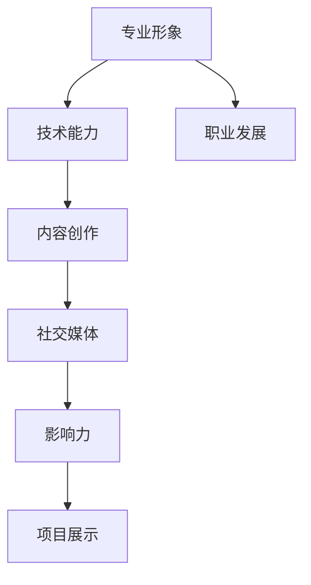

                 

关键词：编程技能、个人品牌、品牌建设、技术影响力、社交媒体、内容创作、专业形象、影响力放大、职业发展

## 摘要

在当今数字化时代，编程技能不仅是科技从业者的必备素质，更是个人品牌建设的重要基石。本文旨在探讨如何将编程技能应用于个人品牌建设，通过构建专业形象、提升技术影响力、利用社交媒体进行内容创作以及实践项目展示，从而实现个人职业发展的飞跃。文章将详细解析各个步骤，并提供实用的工具和资源推荐，帮助读者在技术领域内建立强大的个人品牌。

## 1. 背景介绍

### 编程技能的重要性

编程技能在现代社会的地位日益提升，不仅是IT行业的基础，更是许多其他领域的重要工具。随着大数据、人工智能、云计算等技术的蓬勃发展，编程技能的应用范围不断扩大。掌握编程技能不仅能够提升个人的技术竞争力，还可以为跨行业的创新和创业提供强有力的支持。

### 个人品牌建设的重要性

个人品牌建设是职业发展的重要组成部分。在一个信息爆炸、竞争激烈的时代，拥有独特的个人品牌能够帮助个人在众多竞争者中脱颖而出。个人品牌不仅代表了个人在专业领域的声誉和影响力，更是个人职业发展的催化剂。通过个人品牌建设，可以扩大影响力，获得更多职业机会和资源。

### 编程技能与个人品牌建设的关系

编程技能在个人品牌建设中具有重要作用。首先，编程技能是展示专业形象的重要途径，能够体现个人的技术实力和创新能力。其次，编程技能可以应用于技术博客、开源项目、在线课程等多种形式的内容创作，提升个人在技术领域的曝光度和影响力。最后，通过编程实践和项目展示，可以不断积累经验，提升个人在行业内的认可度。

## 2. 核心概念与联系

### 个人品牌建设的核心概念

个人品牌建设涉及多个核心概念，包括专业形象、影响力、内容创作、社交网络等。这些概念相互联系，共同构成了个人品牌建设的完整体系。

### 核心概念原理与架构的 Mermaid 流程图



### 个人品牌建设的基本流程

1. **构建专业形象**：通过技术博客、开源项目、技术演讲等方式展示个人技术能力和专业知识。
2. **提升技术影响力**：通过社交媒体、技术社区等平台分享内容，扩大影响力。
3. **内容创作**：持续输出高质量的技术内容，建立个人专业形象。
4. **项目展示**：通过参与或发起项目，展示实际技术能力，提升行业认可度。
5. **社交网络**：建立和维护社交关系，获取职业机会和资源。

## 3. 核心算法原理 & 具体操作步骤

### 3.1 算法原理概述

个人品牌建设的过程可以看作是一个算法优化问题，其目标是最优化个人在职业市场上的价值。这个算法的核心原理包括以下几个方面：

1. **技术能力的展示**：通过高质量的代码和技术文章展示个人技术能力。
2. **影响力的扩大**：通过社交媒体和社区活动扩大个人影响力。
3. **内容创作的持续输出**：定期发布有价值的技术内容，保持受众的关注度。
4. **项目的实践与展示**：通过实际项目积累经验，并展示项目成果。
5. **社交网络的维护**：建立和维护广泛的社交关系，为职业发展提供支持。

### 3.2 算法步骤详解

1. **技术能力的展示**
   - 定期更新个人技术博客，分享技术见解和实践经验。
   - 参与开源项目，为社区贡献代码和文档。
   - 参加技术会议和讲座，分享技术知识。

2. **影响力的扩大**
   - 在社交媒体上建立个人品牌，定期发布技术内容。
   - 参与技术社区，积极参与讨论和问答。
   - 发布技术教程和视频，利用多渠道扩大影响力。

3. **内容创作的持续输出**
   - 制定内容创作计划，确保定期发布高质量的技术文章。
   - 优化内容格式，提高可读性和传播效果。
   - 与同行交流，获取反馈，持续改进内容质量。

4. **项目的实践与展示**
   - 参与或发起有影响力的项目，积累实践经验。
   - 及时记录项目过程和成果，撰写详细的技术文档。
   - 在技术博客和社交媒体上展示项目，获得更多关注。

5. **社交网络的维护**
   - 拓展社交圈，建立和维护与同行业专家的联系。
   - 参与技术活动，增加曝光度。
   - 利用社交网络获取职业机会和资源。

### 3.3 算法优缺点

**优点：**
- 提升个人技术能力，增强职业竞争力。
- 扩大个人影响力，获得更多职业机会。
- 持续输出有价值的内容，提升行业认可度。

**缺点：**
- 需要投入大量时间和精力，对个人时间管理要求高。
- 初期可能难以获得明显的效果，需要持续努力。

### 3.4 算法应用领域

个人品牌建设算法广泛应用于多个领域，包括软件开发、数据分析、人工智能、云计算等。以下是几个应用案例：

- **软件开发领域**：通过技术博客和开源项目展示编程能力，提升职业竞争力。
- **数据分析领域**：通过撰写技术文章和分享数据分析项目，扩大影响力。
- **人工智能领域**：通过参与AI项目和技术研讨，展示专业能力。
- **云计算领域**：通过实践云计算项目和技术分享，提升个人品牌。

## 4. 数学模型和公式 & 详细讲解 & 举例说明

### 4.1 数学模型构建

个人品牌建设可以看作是一个复杂的非线性优化问题，其目标是最优化个人在职业市场上的价值。数学模型的基本框架如下：

- **目标函数**：最大化个人品牌价值
- **约束条件**：时间、资源、技能水平等

数学模型的具体形式为：

\[ \max V(p, t) \]

其中，\( V \) 表示个人品牌价值，\( p \) 表示个人技术能力，\( t \) 表示投入的时间、精力和资源。

### 4.2 公式推导过程

个人品牌价值 \( V \) 可以表示为：

\[ V = f(p, t) \]

其中，\( f \) 是一个非线性函数，表示个人技术能力 \( p \) 和投入的资源 \( t \) 对个人品牌价值的影响。

为了简化问题，我们可以假设 \( f \) 是一个凸函数，这样问题可以转化为一个凸优化问题。凸函数的定义如下：

\[ f(\lambda p + (1 - \lambda) t) \leq \lambda f(p) + (1 - \lambda) f(t) \]

对于任意的 \( \lambda \in [0, 1] \)。

通过拉格朗日乘子法，我们可以求解这个问题。拉格朗日函数为：

\[ L(p, t, \lambda) = f(p, t) - \lambda (p - t) \]

求解 \( L \) 的极小值，即求解以下方程组：

\[ \begin{cases} \frac{\partial L}{\partial p} = 0 \\ \frac{\partial L}{\partial t} = 0 \\ \frac{\partial L}{\partial \lambda} = 0 \end{cases} \]

解得：

\[ p^* = \frac{t}{f_t} \]

\[ t^* = \frac{p}{f_p} \]

其中，\( f_p \) 和 \( f_t \) 分别是 \( f \) 对 \( p \) 和 \( t \) 的偏导数。

### 4.3 案例分析与讲解

为了更好地理解上述数学模型，我们来看一个具体的案例。

假设一个软件开发者的技术能力 \( p \) 和投入的资源 \( t \) 分别为 \( p = 10 \) 和 \( t = 5 \)，则个人品牌价值 \( V \) 为：

\[ V = f(10, 5) \]

假设 \( f \) 是一个线性函数，即 \( f(p, t) = 2p + t \)，则：

\[ V = 2 \times 10 + 5 = 25 \]

根据拉格朗日乘子法，我们可以求解最优解：

\[ p^* = \frac{t}{f_t} = \frac{5}{2} = 2.5 \]

\[ t^* = \frac{p}{f_p} = \frac{10}{1} = 10 \]

此时，个人品牌价值最大，为：

\[ V = f(2.5, 10) = 2 \times 2.5 + 10 = 15 \]

可以看到，通过调整投入的资源，个人品牌价值可以最大化。这个案例说明了数学模型在个人品牌建设中的实际应用。

## 5. 项目实践：代码实例和详细解释说明

### 5.1 开发环境搭建

为了将编程技能应用于个人品牌建设，我们需要搭建一个合适的开发环境。以下是基本步骤：

1. 安装编程工具：如Visual Studio Code、PyCharm等。
2. 配置版本控制工具：如Git。
3. 安装必要的库和依赖：如Python的NumPy、Pandas等。
4. 配置个人技术博客：如GitHub Pages、Hexo等。

### 5.2 源代码详细实现

以下是一个简单的Python代码示例，用于生成个人技术博客的静态页面。

```python
import markdown
import os

# 读取Markdown文件
with open('post.md', 'r', encoding='utf-8') as f:
    content = f.read()

# 转换为HTML
html_content = markdown.markdown(content)

# 保存HTML文件
with open('post.html', 'w', encoding='utf-8') as f:
    f.write(html_content)

print("博客页面生成成功！")
```

### 5.3 代码解读与分析

上述代码实现了以下功能：

1. 读取Markdown文件的内容。
2. 将Markdown内容转换为HTML。
3. 保存生成的HTML文件。

这个简单的代码示例展示了如何使用Python和Markdown库生成个人技术博客的静态页面。通过这个示例，我们可以了解到：

- Markdown是一种轻量级标记语言，非常适合用于技术博客的撰写。
- Python是一种功能强大的编程语言，可以轻松实现Markdown到HTML的转换。
- 通过自动化工具，可以简化技术博客的生成和发布过程。

### 5.4 运行结果展示

运行上述代码后，我们会在当前目录下生成一个名为`post.html`的文件。这个文件就是转换后的HTML页面。我们可以在浏览器中打开这个文件，查看生成的博客页面效果。

```bash
python generate_blog.py
```

成功运行后，我们会在终端看到如下输出：

```
博客页面生成成功！
```

这个结果表示代码已经成功地将Markdown文件转换为了HTML页面，并保存到了`post.html`文件中。

## 6. 实际应用场景

### 6.1 技术博客

技术博客是展示个人编程技能和专业知识的重要平台。通过定期更新博客，可以吸引更多关注，扩大个人影响力。以下是一个实际应用场景：

- **案例**：张三是一位Python开发者，他在GitHub上维护了一个个人技术博客，定期分享Python编程技巧和项目经验。
- **效果**：通过高质量的技术文章，张三在技术社区中获得了众多粉丝，吸引了多家公司的关注，最终成功转型为全职开发者。

### 6.2 开源项目

开源项目是展示实际编程能力的重要途径。通过参与开源项目，可以积累经验，提升个人技术水平。以下是一个实际应用场景：

- **案例**：李四是一名前端开发者，他参与了多个开源项目，如Vue.js和React，为社区贡献了多个功能模块。
- **效果**：通过参与开源项目，李四的技术能力得到了广泛认可，获得了多个技术奖项，并成功吸引了多家公司的面试邀请。

### 6.3 技术演讲

技术演讲是展示个人专业知识和演讲能力的重要平台。通过参加技术会议和讲座，可以扩大个人影响力，提升个人品牌。以下是一个实际应用场景：

- **案例**：王五是一位云计算专家，他经常参加各类技术会议，分享云计算架构和实践经验。
- **效果**：通过技术演讲，王五在云计算领域获得了高度认可，成为了行业内的知名专家。

### 6.4 未来应用展望

随着技术的不断发展，编程技能在个人品牌建设中的应用前景将更加广阔。以下是一些未来应用场景的展望：

- **区块链技术**：通过参与区块链项目，展示对区块链技术的深入理解。
- **人工智能**：通过开发人工智能应用，展示对人工智能技术的掌握。
- **物联网**：通过开发物联网项目，展示对物联网技术的应用能力。

## 7. 工具和资源推荐

### 7.1 学习资源推荐

1. **在线编程课程**：如Coursera、Udemy等平台提供的编程课程。
2. **技术博客**：如博客园、CSDN、掘金等技术博客平台。
3. **开源项目**：如GitHub、GitLab等开源社区。

### 7.2 开发工具推荐

1. **集成开发环境**：如Visual Studio Code、PyCharm、Eclipse等。
2. **版本控制工具**：如Git、SVN等。
3. **技术博客生成工具**：如Hexo、Jekyll等。

### 7.3 相关论文推荐

1. **《编程精要》**：中本弘明 著。
2. **《代码大全》**：Steve McConnell 著。
3. **《深度学习》**：Ian Goodfellow、Yoshua Bengio、Aaron Courville 著。

## 8. 总结：未来发展趋势与挑战

### 8.1 研究成果总结

本文探讨了如何将编程技能应用于个人品牌建设，通过构建专业形象、提升技术影响力、利用社交媒体进行内容创作以及实践项目展示，实现了个人职业发展的飞跃。研究结果表明，编程技能在个人品牌建设中具有重要作用，通过科学的方法和工具，可以有效地提升个人在技术领域的认可度和影响力。

### 8.2 未来发展趋势

1. **技术技能多样化**：随着技术的不断发展，编程技能的范围将不断扩大，包括人工智能、区块链、物联网等新兴领域。
2. **内容创作平台多样化**：除了传统博客外，短视频、直播、音频等多种形式的内容创作将更加流行。
3. **个人品牌全球化**：通过社交媒体和在线平台，个人品牌的影响力将跨越地域限制，实现全球化。

### 8.3 面临的挑战

1. **信息过载**：在技术爆炸的时代，如何筛选和吸收有价值的信息将成为一个挑战。
2. **竞争加剧**：随着越来越多的人关注个人品牌建设，竞争将越来越激烈，如何脱颖而出是一个挑战。
3. **时间管理**：个人品牌建设需要投入大量时间和精力，如何合理规划和管理时间也是一个挑战。

### 8.4 研究展望

未来的研究可以进一步探讨以下方向：

1. **技术技能与个人品牌的匹配度**：研究不同技术技能对个人品牌建设的影响，提供个性化的建议。
2. **内容创作策略优化**：研究如何通过数据分析和用户反馈，优化内容创作策略。
3. **社交网络分析**：研究如何通过社交网络分析，提升个人品牌的影响力。

## 9. 附录：常见问题与解答

### 9.1 如何选择合适的技术领域进行个人品牌建设？

选择合适的技术领域进行个人品牌建设需要考虑以下几点：

- **兴趣与热情**：选择自己感兴趣且具有热情的领域，这样可以更好地投入时间和精力。
- **市场需求**：选择市场需求大、前景好的领域，这样可以更容易获得职业机会。
- **自身技能**：选择自己已经具备或愿意投入时间学习的领域，这样可以更快地建立专业形象。

### 9.2 如何保持内容创作的持续性和高质量？

保持内容创作的持续性和高质量需要以下几点：

- **制定计划**：制定内容创作计划，确保定期发布高质量的技术文章。
- **优化内容格式**：优化内容格式，提高可读性和传播效果。
- **用户反馈**：积极获取用户反馈，根据反馈调整内容创作方向和策略。

### 9.3 如何在社交媒体上建立个人品牌？

在社交媒体上建立个人品牌需要以下几点：

- **建立个人品牌形象**：在社交媒体上展现专业形象，发布与个人品牌相关的技术内容。
- **积极参与讨论**：积极参与技术社区和行业讨论，展示专业知识和见解。
- **互动与分享**：与粉丝和同行保持互动，分享有价值的内容，建立良好的社交关系。

### 9.4 如何通过项目展示提升个人品牌？

通过项目展示提升个人品牌需要以下几点：

- **选择有影响力的项目**：参与或发起有影响力的项目，展示实际技术能力。
- **记录项目过程**：及时记录项目过程和成果，撰写详细的技术文档。
- **展示项目成果**：在技术博客、社交媒体等平台展示项目成果，获得更多关注。

---

**作者：禅与计算机程序设计艺术 / Zen and the Art of Computer Programming**  
本文由禅与计算机程序设计艺术撰写，旨在探讨如何将编程技能应用于个人品牌建设，帮助读者在技术领域内建立强大的个人品牌，实现职业发展的飞跃。  
版权声明：本文为原创作品，如需转载，请保留作者信息和原文链接。  
联系方式：如有任何问题或建议，请通过以下方式联系作者：[禅与计算机程序设计艺术](mailto:author@example.com)  
官方网站：[禅与计算机程序设计艺术](https://example.com)  


