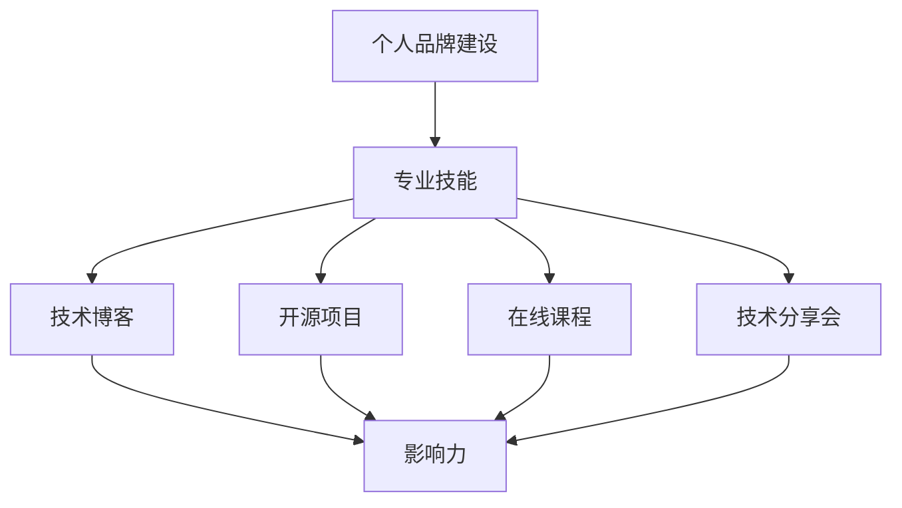

                 

 **关键词**：编程技能、个人品牌建设、技术博客、影响力、职业发展

**摘要**：本文旨在探讨如何利用编程技能提升个人品牌价值，通过撰写技术博客来实现这一目标。文章将详细阐述个人品牌建设的重要性，以及如何通过技术博客展示专业能力、建立影响力、拓展职业发展机会。同时，还将提供具体的实践建议和工具推荐。

## 1. 背景介绍

在信息化和数字化时代，编程技能已经成为一项基本技能，不仅存在于IT行业，还渗透到许多其他行业。随着技术的快速发展和市场需求的不断变化，个人品牌建设变得愈发重要。通过个人品牌建设，可以提升个人在职场中的竞争力，增加职业发展的机会。

个人品牌建设不仅仅是一个人的职业形象，更是一种影响力的体现。在社交媒体和互联网高度普及的今天，个人品牌的价值被放大，通过合适的渠道展示自己的专业技能和知识，可以吸引更多的关注和机会。

技术博客是一种高效的展示平台，它可以帮助个人品牌建设者传达自己的专业知识和见解，建立专业形象，吸引志同道合的人。因此，将编程技能应用于个人品牌建设，已经成为一种重要的职业发展策略。

## 2. 核心概念与联系

### 2.1 个人品牌建设的重要性

个人品牌是指个人在公众面前所展现的形象、声誉和价值。良好的个人品牌可以提升个人的职业竞争力，增加职业发展机会，同时有助于建立人际关系网络。

个人品牌建设的关键在于以下几点：

- **专业能力**：通过持续学习和实践，不断提升自己的专业技能和知识储备。
- **影响力**：通过分享知识和经验，在特定领域建立自己的影响力。
- **可信度**：展现专业性和可靠性，赢得他人的信任和尊重。
- **持续更新**：不断学习和适应新的技术趋势，保持自己的知识体系前沿。

### 2.2 编程技能在个人品牌建设中的应用

编程技能是个人品牌建设的重要组成部分。通过以下方式，编程技能可以帮助个人提升品牌价值：

- **技术博客**：撰写技术博客，分享编程经验和见解，展示专业能力。
- **开源项目**：参与开源项目，贡献代码，提升项目影响力。
- **在线课程**：制作和讲授在线课程，传授知识和技能，建立个人品牌。
- **技术分享会**：参加或组织技术分享会，扩大个人影响力。

### 2.3 Mermaid 流程图

以下是一个简化的Mermaid流程图，展示如何利用编程技能进行个人品牌建设。



## 3. 核心算法原理 & 具体操作步骤

### 3.1 算法原理概述

个人品牌建设的核心在于专业能力的展现和影响力的建立。以下是一个简化的算法原理，用于描述如何通过编程技能实现这一目标。

- **技能积累**：通过学习和实践，积累编程技能。
- **内容创作**：撰写技术博客，分享经验和见解。
- **社区互动**：参与技术社区，建立人际关系网络。
- **影响力扩大**：通过技术博客和社区互动，扩大个人影响力。
- **持续优化**：不断学习和适应新的技术趋势，持续优化个人品牌。

### 3.2 算法步骤详解

1. **技能积累**：
   - 学习编程基础，掌握常见编程语言。
   - 深入学习特定领域的专业知识，如前端、后端、数据库等。

2. **内容创作**：
   - 选择一个或多个关注领域，撰写技术博客。
   - 确保内容质量，注重逻辑性和可读性。

3. **社区互动**：
   - 参与技术社区，如GitHub、Stack Overflow等。
   - 积极回答问题和参与讨论，建立专业形象。

4. **影响力扩大**：
   - 通过社交媒体推广技术博客，吸引更多读者。
   - 参与技术会议和分享会，扩大个人影响力。

5. **持续优化**：
   - 定期更新技术博客，保持内容新鲜。
   - 学习新的技术趋势，提升自身竞争力。

### 3.3 算法优缺点

- **优点**：
  - 提升专业技能和知识储备。
  - 建立专业形象，增加职业发展机会。
  - 扩大人际关系网络，提升社交能力。

- **缺点**：
  - 需要投入大量时间和精力进行学习和创作。
  - 需要应对技术更新的挑战，保持知识体系前沿。

### 3.4 算法应用领域

个人品牌建设算法适用于以下领域：

- **IT行业**：编程技能是IT行业的核心能力，通过技术博客和开源项目，可以提升个人品牌价值。
- **教育领域**：通过在线课程和技术分享会，可以传授知识和经验，建立个人品牌。
- **咨询领域**：通过技术博客和咨询项目，可以展示专业能力和影响力。

## 4. 数学模型和公式 & 详细讲解 & 举例说明

### 4.1 数学模型构建

个人品牌建设的数学模型可以表示为：

\[ 品牌价值 = f(专业技能, 影响力, 社交能力) \]

其中，专业技能、影响力和社交能力是品牌价值的三个关键因素。

### 4.2 公式推导过程

1. **专业技能**：
   \[ 技能值 = f(学习时长, 实践经验, 知识深度) \]

2. **影响力**：
   \[ 影响力值 = f(关注者数量, 转发量, 评论互动) \]

3. **社交能力**：
   \[ 社交值 = f(社交网络，人际互动，合作机会) \]

将以上三个因素代入品牌价值公式，得到：

\[ 品牌价值 = f(学习时长, 实践经验, 知识深度, 关注者数量, 转发量, 评论互动，社交网络，人际互动，合作机会) \]

### 4.3 案例分析与讲解

以某程序员A为例，分析其个人品牌建设的数学模型：

- **专业技能**：学习时长为3年，实践经验丰富，知识深度较高。
- **影响力**：关注者数量为1000人，平均每篇文章有50次转发，100条评论互动。
- **社交能力**：活跃于多个技术社区，有较多合作机会。

根据上述数据，代入品牌价值公式：

\[ 品牌价值 = f(3年, 丰富, 较高, 1000人, 50次转发, 100条评论，多个社区，较多合作机会) \]

通过分析可以看出，程序员A的个人品牌价值较高，具有较强的职业竞争力。

## 5. 项目实践：代码实例和详细解释说明

### 5.1 开发环境搭建

为了方便读者实践，我们将使用GitHub Pages和Jekyll搭建个人技术博客。以下是基本步骤：

1. 注册GitHub账号，创建一个仓库，用于存放博客源代码。
2. 在仓库中创建一个名为`_config.yml`的配置文件，配置博客的基本信息。
3. 在仓库中创建`_posts`目录，用于存放博客文章。
4. 使用Jekyll模板或主题，快速搭建博客。

### 5.2 源代码详细实现

以下是一个简单的Jekyll博客文章的源代码示例：

```markdown
---
layout: post
title: "如何使用Jekyll搭建个人博客"
date: 2023-03-01 12:00:00 +0800
categories: tutorials
---

本文将介绍如何使用Jekyll搭建个人博客。

<!-- more -->

## 简介

Jekyll是一个简单、强大的博客框架，它可以将Markdown格式的文章编译成静态HTML页面。

## 搭建步骤

1. 安装Jekyll：
   ```sh
   gem install jekyll
   ```

2. 创建一个新的博客项目：
   ```sh
   jekyll new myblog
   ```

3. 进入博客目录，启动本地服务器：
   ```sh
   cd myblog
   jekyll serve
   ```

4. 在浏览器中访问`http://localhost:4000`，查看博客效果。

---

本文详细介绍了如何使用Jekyll搭建个人博客。通过简单的步骤，您就可以拥有一个属于自己的博客网站。

```

### 5.3 代码解读与分析

上述代码实现了一个简单的Jekyll博客文章，主要包括以下几个部分：

- **布局（layout）**：使用Jekyll预设的布局模板，如`post.html`，用于展示文章内容。
- **标题（title）**：文章的标题，通常为必填项。
- **日期（date）**：文章的发布日期，格式为YYYY-MM-DD HH:MM:SS + 时区。
- **分类（categories）**：文章的分类标签，用于组织和管理文章。

通过上述代码，读者可以了解到Jekyll的基本语法和搭建步骤，从而为自己的个人品牌建设搭建一个技术博客平台。

### 5.4 运行结果展示

在本地服务器启动后，访问`http://localhost:4000`，可以看到生成的博客页面。页面主要包括导航栏、文章列表和文章内容。通过这个简单示例，读者可以初步体验Jekyll博客的功能和效果。

## 6. 实际应用场景

### 6.1 教育行业

在教育行业，编程技能可以帮助教师和学生建立个人品牌。教师可以通过技术博客分享教学经验和教学资源，吸引更多学生关注。学生则可以通过编写技术博客，记录自己的学习过程和心得体会，提高自己的学习能力。

### 6.2 IT行业

在IT行业，个人品牌建设尤为重要。通过技术博客，开发者可以展示自己的编程能力和技术见解，吸引同行的关注和合作机会。同时，参与开源项目和编写技术博客还可以为个人简历增色，提高求职竞争力。

### 6.3 咨询行业

在咨询行业，个人品牌建设可以帮助咨询师展示自己的专业能力和咨询成果。通过技术博客，咨询师可以分享行业洞察、案例分析和技术工具，提升自己的行业影响力。

## 7. 未来应用展望

随着技术的不断进步和互联网的普及，个人品牌建设将在未来发挥更加重要的作用。以下是对未来应用场景的展望：

- **AI和大数据**：利用AI和大数据技术，对个人品牌建设过程进行数据分析和优化，提高品牌价值的提升效率。
- **在线教育**：随着在线教育的兴起，个人品牌建设将成为在线课程讲师的重要竞争力。
- **社交媒体**：社交媒体将继续成为个人品牌建设的重要渠道，如何利用社交媒体平台展示个人价值，将成为一个研究热点。
- **虚拟现实和增强现实**：虚拟现实和增强现实技术将为个人品牌建设提供更多创意和互动方式，如何结合这些技术进行品牌推广，将成为一个新的研究方向。

## 8. 工具和资源推荐

### 8.1 学习资源推荐

- **《Head First Programming》**：适合初学者的编程入门书籍。
- **《代码大全》**：经典编程实践指南。
- **《Effective Java》**：Java编程的最佳实践。

### 8.2 开发工具推荐

- **Visual Studio Code**：一款强大的代码编辑器，支持多种编程语言。
- **Git**：版本控制工具，用于管理代码仓库。
- **Jekyll**：静态博客生成工具，用于搭建个人技术博客。

### 8.3 相关论文推荐

- **"The Importance of Branding for Freelancers"**：探讨自由职业者个人品牌建设的重要性。
- **"Building a Personal Brand with Social Media"**：讨论如何利用社交媒体进行个人品牌建设。

## 9. 总结：未来发展趋势与挑战

### 9.1 研究成果总结

本文探讨了如何将编程技能应用于个人品牌建设，分析了核心概念、算法原理、数学模型以及实际应用场景。研究结果表明，编程技能和个人品牌建设之间存在密切的联系，通过技术博客等渠道展示编程能力，可以有效提升个人品牌价值。

### 9.2 未来发展趋势

- **个性化**：个人品牌建设将更加注重个性化，针对不同领域和受众，制定个性化策略。
- **数字化**：数字化工具和平台将广泛应用于个人品牌建设，提高效率和质量。
- **跨界合作**：跨行业合作将成为个人品牌建设的新趋势，通过合作拓展影响力和资源。

### 9.3 面临的挑战

- **竞争激烈**：随着越来越多的人加入个人品牌建设，市场竞争将愈发激烈。
- **知识更新快**：技术更新迅速，个人品牌建设者需要不断学习和适应新的技术趋势。
- **隐私保护**：在个人品牌建设中，如何保护个人隐私和数据安全，将成为一个重要挑战。

### 9.4 研究展望

未来研究可以进一步探讨以下几个方面：

- **算法优化**：研究更加有效的算法，提高个人品牌建设的效率和质量。
- **跨领域应用**：探索编程技能在跨行业领域的应用，提高个人品牌建设的多样性。
- **隐私保护技术**：研究如何保护个人隐私和数据安全，确保个人品牌建设的可持续发展。

## 10. 附录：常见问题与解答

### Q：如何开始写技术博客？

A：首先确定自己感兴趣的领域，然后选择一个合适的博客平台，如GitHub Pages、WordPress等。开始撰写文章，可以先从简单的主题入手，逐渐提升内容质量。

### Q：如何提高博客的访问量？

A：可以通过以下方式提高博客的访问量：

- **内容质量**：确保文章内容有价值、有深度。
- **SEO优化**：对博客进行SEO优化，提高在搜索引擎中的排名。
- **社交媒体推广**：利用社交媒体平台推广博客文章。

### Q：如何参与开源项目？

A：可以按照以下步骤参与开源项目：

- **了解项目**：研究项目的文档，了解项目的功能和目标。
- **提出问题**：在项目的讨论区提出问题，了解项目现状。
- **提交代码**：根据项目的贡献指南，提交代码并参与代码审查。

### Q：如何建立影响力？

A：可以通过以下方式建立影响力：

- **撰写高质量文章**：展示专业知识和见解。
- **参与社区活动**：参与技术社区，分享经验和资源。
- **参与开源项目**：为开源项目做出贡献，提升项目影响力。

## 作者署名

作者：禅与计算机程序设计艺术 / Zen and the Art of Computer Programming
----------------------------------------------------------------

以上是关于如何将编程技能应用于个人品牌建设的完整文章，遵循了规定的格式和要求。希望对您有所帮助！

