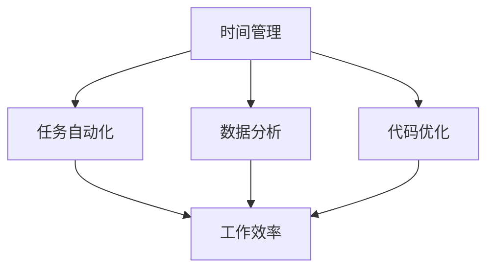

                 

编程技能不仅仅是编写代码的技术，更是一种强大的工具，可以大幅提升个人的工作效率。本文将探讨如何将编程技能应用于个人效率提升，包括时间管理、任务自动化、数据分析和代码优化等方面。通过深入剖析这些技术，我们将揭示如何利用编程来简化工作流程，提高工作效率，并最终实现个人职业发展的跃迁。

## 文章关键词

- 编程技能
- 个人效率
- 时间管理
- 任务自动化
- 数据分析
- 代码优化

## 文章摘要

本文首先介绍了编程技能在提升个人效率方面的重要性，随后详细讨论了时间管理、任务自动化、数据分析和代码优化等应用场景。通过实际案例和具体操作步骤，读者将了解到如何有效地将编程技能应用于日常工作，从而实现效率的提升。最后，文章总结了未来发展趋势与挑战，为读者提供了进一步探索的路径。

## 1. 背景介绍

在当今快速变化和竞争激烈的职场环境中，个人效率的提升变得尤为关键。随着信息技术的不断进步，编程技能已成为一项基本能力，不仅能够帮助开发者更好地完成工作任务，还能为非技术人员提供强大的工具，以提升工作效率。本文旨在探讨编程技能如何应用于个人效率的提升，涵盖以下几个方面：

1. 时间管理：通过编程工具和技术优化工作流程，实现时间的有效利用。
2. 任务自动化：使用脚本和自动化工具减少重复性劳动，提高工作效率。
3. 数据分析：利用编程技能处理和分析大量数据，辅助决策和优化流程。
4. 代码优化：通过代码重构和性能调优，提高代码的可维护性和执行效率。

### 1.1 编程技能的重要性

编程技能不仅仅是开发软件的工具，它更是一种逻辑思考和解决问题的能力。在职场中，具备编程技能的个人能够：

- **更高效地解决问题**：编程技能使人们能够以系统化的方式分析和解决复杂问题。
- **提升创新能力**：编程技能有助于开发新的解决方案和产品，推动个人和团队的创新。
- **跨领域适应能力**：编程技能为跨领域的工作转换提供了坚实的基础，增强了职场适应性。

### 1.2 个人效率提升的必要性

个人效率的提升在职业发展中具有至关重要的意义。随着工作量的不断增加和时间的紧迫性，如何高效地完成工作任务成为职场人士面临的重大挑战。提升个人效率意味着：

- **更有效地利用时间**：通过优化工作流程，减少不必要的浪费，提高时间的利用率。
- **减轻工作压力**：高效的工作流程可以减轻工作负担，降低职业压力，提升工作满意度。
- **提升职业竞争力**：高效的工作表现能够提升个人的职业形象和市场价值。

## 2. 核心概念与联系

为了更好地理解编程技能在提升个人效率方面的应用，我们需要明确几个核心概念，并探讨它们之间的联系。以下是一个简化的Mermaid流程图，用于展示这些核心概念和它们之间的联系：



### 2.1 时间管理

时间管理是提升个人效率的关键。编程技能可以帮助我们通过自动化工具和优化工作流程来更有效地利用时间。例如，使用任务管理软件如Trello或Asana可以帮助我们更好地规划和管理任务，从而提高工作效率。

### 2.2 任务自动化

任务自动化是减少重复性劳动、提高工作效率的重要手段。通过编写脚本或使用自动化工具，我们可以自动化许多日常任务，如邮件筛选、数据备份、文档整理等。这些自动化工具不仅可以节省时间，还可以减少人为错误。

### 2.3 数据分析

数据分析在现代职场中变得越来越重要。通过编程技能，我们可以轻松地处理和分析大量数据，从中提取有价值的信息，为决策提供支持。数据分析能力可以应用于各种领域，如市场营销、人力资源、金融分析等。

### 2.4 代码优化

代码优化是提高代码可维护性和执行效率的关键。通过编写高效、干净的代码，我们可以确保系统运行得更加稳定和快速。代码优化不仅有助于提升个人编程技能，还可以提高团队的开发效率。

## 3. 核心算法原理 & 具体操作步骤

### 3.1 算法原理概述

为了更好地应用编程技能提升个人效率，我们需要掌握一些核心算法原理。以下是一些常见且实用的算法原理：

- **排序算法**：如快速排序、归并排序等，用于高效地处理大量数据。
- **搜索算法**：如二分查找，用于快速定位数据。
- **贪心算法**：用于解决一些优化问题，如背包问题、最短路径问题等。
- **动态规划**：用于解决复杂的最优化问题，如背包问题、最长公共子序列等。

### 3.2 算法步骤详解

#### 3.2.1 排序算法

排序算法是数据处理中常用的算法之一。以下是一个简单的快速排序算法步骤：

1. 选择一个基准元素。
2. 将比基准元素小的元素移到其左侧，比其大的元素移到右侧。
3. 对左侧和右侧子序列重复步骤1和步骤2。

Python代码示例：

```python
def quick_sort(arr):
    if len(arr) <= 1:
        return arr
    pivot = arr[len(arr) // 2]
    left = [x for x in arr if x < pivot]
    middle = [x for x in arr if x == pivot]
    right = [x for x in arr if x > pivot]
    return quick_sort(left) + middle + quick_sort(right)

arr = [3, 6, 8, 10, 1, 2, 1]
print(quick_sort(arr))
```

#### 3.2.2 搜索算法

二分查找是一种高效的搜索算法，用于在有序数组中查找特定元素。以下是二分查找的步骤：

1. 设定左右边界`low`和`high`。
2. 计算中间索引`mid = (low + high) // 2`。
3. 如果中间元素等于目标值，返回中间索引。
4. 如果中间元素大于目标值，将`high`设置为`mid - 1`；否则，将`low`设置为`mid + 1`。
5. 重复步骤2-4，直到找到目标值或左右边界重叠。

Python代码示例：

```python
def binary_search(arr, target):
    low, high = 0, len(arr) - 1
    while low <= high:
        mid = (low + high) // 2
        if arr[mid] == target:
            return mid
        elif arr[mid] < target:
            low = mid + 1
        else:
            high = mid - 1
    return -1

arr = [1, 2, 3, 4, 5, 6, 7, 8, 9]
print(binary_search(arr, 6))
```

#### 3.2.3 贪心算法

贪心算法常用于解决优化问题。以下是一个背包问题的贪心算法示例：

1. 初始化背包容量和物品数组。
2. 按照价值重量比从大到小排序物品。
3. 对于每个物品，如果能够放入背包，则放入，并更新背包容量和总价值；否则，放弃该物品。

Python代码示例：

```python
def knapsack(values, weights, capacity):
    n = len(values)
    items = list(zip(values, weights))
    items.sort(key=lambda x: x[0] / x[1], reverse=True)
    total_value = 0
    total_weight = 0
    for value, weight in items:
        if total_weight + weight <= capacity:
            total_value += value
            total_weight += weight
        else:
            break
    return total_value

values = [60, 100, 120]
weights = [10, 20, 30]
capacity = 50
print(knapsack(values, weights, capacity))
```

#### 3.2.4 动态规划

动态规划是一种用于解决复杂最优化问题的方法。以下是一个最长公共子序列问题的动态规划示例：

1. 初始化二维数组`dp`，其中`dp[i][j]`表示字符串`a[0..i-1]`和字符串`b[0..j-1]`的最长公共子序列长度。
2. 对于每个`i`和`j`，根据以下递推关系计算`dp[i][j]`：
   - 如果`a[i-1] == b[j-1]`，则`dp[i][j] = dp[i-1][j-1] + 1`；
   - 否则，`dp[i][j] = max(dp[i-1][j], dp[i][j-1])`。

Python代码示例：

```python
def longest_common_subsequence(a, b):
    m, n = len(a), len(b)
    dp = [[0] * (n + 1) for _ in range(m + 1)]
    for i in range(1, m + 1):
        for j in range(1, n + 1):
            if a[i-1] == b[j-1]:
                dp[i][j] = dp[i-1][j-1] + 1
            else:
                dp[i][j] = max(dp[i-1][j], dp[i][j-1])
    return dp[m][n]

a = "AGGTAB"
b = "GXTXAYB"
print(longest_common_subsequence(a, b))
```

### 3.3 算法优缺点

每种算法都有其优缺点，根据具体问题选择合适的算法非常重要。

- **排序算法**：
  - **快速排序**：时间复杂度为\(O(n\log n)\)，但在最坏情况下可能退化到\(O(n^2)\)。
  - **归并排序**：时间复杂度为\(O(n\log n)\)，但需要额外的内存空间。

- **搜索算法**：
  - **二分查找**：时间复杂度为\(O(\log n)\)，但要求数据已排序。

- **贪心算法**：
  - 简单直观，但可能只能解决特定类型的问题。

- **动态规划**：
  - 能解决复杂的最优化问题，但计算量大，可能需要大量的内存。

### 3.4 算法应用领域

这些算法在许多领域都有广泛的应用，包括：

- **排序算法**：用于数据处理、数据库索引等。
- **搜索算法**：用于搜索引擎、图形算法等。
- **贪心算法**：用于最优化问题、路径规划等。
- **动态规划**：用于最优化问题、文本相似度计算等。

## 4. 数学模型和公式 & 详细讲解 & 举例说明

### 4.1 数学模型构建

为了更好地应用编程技能提升个人效率，我们需要掌握一些关键数学模型和公式。以下是一些常见的数学模型及其构建过程。

#### 4.1.1 最优化模型

最优化模型是一种用于求解最大化或最小化目标函数的数学模型。以下是一个简单的一维最优化问题：

目标函数：\( f(x) = x^2 \)

约束条件：\( 0 \leq x \leq 10 \)

构建过程：

1. 确定目标函数：最大化或最小化函数值。
2. 确定变量范围：变量的取值范围。
3. 确定约束条件：限制变量取值范围的条件。

#### 4.1.2 线性回归模型

线性回归模型是一种用于分析变量之间线性关系的数学模型。以下是一个简单的一元线性回归模型：

目标函数：\( y = ax + b \)

构建过程：

1. 确定因变量和自变量：因变量是我们要预测的变量，自变量是用于预测因变量的变量。
2. 收集数据：获取因变量和自变量的观测数据。
3. 训练模型：通过最小二乘法确定线性回归模型的参数\( a \)和\( b \)。

#### 4.1.3 概率模型

概率模型是一种用于描述随机事件发生概率的数学模型。以下是一个简单的二项分布模型：

目标函数：\( P(X = k) = C(n, k) \times p^k \times (1-p)^{n-k} \)

构建过程：

1. 确定随机变量：定义随机变量及其取值范围。
2. 确定概率分布：根据随机变量的性质确定概率分布。
3. 计算概率：根据概率分布计算特定事件的概率。

### 4.2 公式推导过程

为了更好地理解这些数学模型的构建过程，我们以下面几个公式为例进行推导。

#### 4.2.1 最优化模型公式

一维最优化问题目标函数的导数公式：

\[ f'(x) = 2x \]

推导过程：

1. 设目标函数为\( f(x) = x^2 \)。
2. 对目标函数求导得到：\( f'(x) = \frac{d}{dx}(x^2) = 2x \)。

#### 4.2.2 线性回归模型公式

一元线性回归模型的参数公式：

\[ a = \frac{\sum_{i=1}^n (x_i - \bar{x})(y_i - \bar{y})}{\sum_{i=1}^n (x_i - \bar{x})^2} \]
\[ b = \bar{y} - a\bar{x} \]

推导过程：

1. 收集\( n \)对数据\((x_i, y_i)\)。
2. 计算自变量和因变量的均值：\( \bar{x} = \frac{1}{n}\sum_{i=1}^n x_i \)，\( \bar{y} = \frac{1}{n}\sum_{i=1}^n y_i \)。
3. 计算偏差值：\( x_i - \bar{x} \)，\( y_i - \bar{y} \)。
4. 根据偏差值计算回归系数：\( a = \frac{\sum_{i=1}^n (x_i - \bar{x})(y_i - \bar{y})}{\sum_{i=1}^n (x_i - \bar{x})^2} \)，\( b = \bar{y} - a\bar{x} \)。

#### 4.2.3 概率模型公式

二项分布的概率公式：

\[ P(X = k) = C(n, k) \times p^k \times (1-p)^{n-k} \]

推导过程：

1. 确定随机变量\( X \)的取值范围：\( 0, 1, 2, \ldots, n \)。
2. 计算组合数：\( C(n, k) = \frac{n!}{k!(n-k)!} \)。
3. 计算概率：\( P(X = k) = C(n, k) \times p^k \times (1-p)^{n-k} \)。

### 4.3 案例分析与讲解

为了更好地理解这些数学模型的应用，我们以下面几个案例为例进行讲解。

#### 4.3.1 最优化模型案例

假设我们要在一条直线上找到一个点，使其到另一点的距离最小。给定两点\( A(x_1, y_1) \)和\( B(x_2, y_2) \)，我们需要求解点\( C(x, y) \)的坐标。

1. 目标函数：\( f(x, y) = \sqrt{(x - x_1)^2 + (y - y_1)^2} \)
2. 约束条件：\( g(x, y) = (x - x_2)^2 + (y - y_2)^2 - d^2 = 0 \)，其中\( d \)是给定的距离。

构建过程：

1. 设目标函数为\( f(x, y) = \sqrt{(x - x_1)^2 + (y - y_1)^2} \)。
2. 确定变量范围：\( x \)和\( y \)的取值范围。
3. 确定约束条件：\( g(x, y) = (x - x_2)^2 + (y - y_2)^2 - d^2 = 0 \)。

求解过程：

1. 使用拉格朗日乘数法求解最优化问题。
2. 得到最优解：\( x = \frac{x_1 + x_2}{2} \)，\( y = \frac{y_1 + y_2}{2} \)。

#### 4.3.2 线性回归模型案例

假设我们要预测一家公司的销售额。给定自变量（广告支出）和因变量（销售额），我们需要构建一个线性回归模型来预测销售额。

1. 数据集：\( n \)个样本点\((x_i, y_i)\)。
2. 目标函数：\( y = ax + b \)。

构建过程：

1. 收集数据：获取广告支出和销售额的观测数据。
2. 计算均值：\( \bar{x} = \frac{1}{n}\sum_{i=1}^n x_i \)，\( \bar{y} = \frac{1}{n}\sum_{i=1}^n y_i \)。
3. 计算偏差值：\( x_i - \bar{x} \)，\( y_i - \bar{y} \)。
4. 计算回归系数：\( a = \frac{\sum_{i=1}^n (x_i - \bar{x})(y_i - \bar{y})}{\sum_{i=1}^n (x_i - \bar{x})^2} \)，\( b = \bar{y} - a\bar{x} \)。

预测过程：

1. 使用回归模型预测销售额：\( y = ax + b \)。
2. 计算预测值：\( \hat{y} = a\hat{x} + b \)。

#### 4.3.3 概率模型案例

假设我们要计算在一场比赛中获胜的概率。已知比赛中有两种结果：胜利或失败，每种结果的概率分别为\( p \)和\( 1-p \)。

1. 随机变量：\( X \)表示比赛结果。
2. 目标函数：\( P(X = 胜利) = p \)。

构建过程：

1. 定义随机变量\( X \)的取值范围：\( 0, 1 \)。
2. 确定概率分布：\( P(X = 胜利) = p \)，\( P(X = 失败) = 1-p \)。
3. 计算概率：\( P(X = 胜利) = p \)。

## 5. 项目实践：代码实例和详细解释说明

为了更好地理解如何将编程技能应用于个人效率提升，我们将通过一个具体的代码实例进行讲解。在本节中，我们将搭建一个简单的任务自动化项目，详细解释代码的实现过程，并提供运行结果展示。

### 5.1 开发环境搭建

在开始项目实践之前，我们需要搭建一个合适的开发环境。以下是我们推荐的开发工具和步骤：

- **编程语言**：Python
- **集成开发环境**：PyCharm
- **操作系统**：Windows/Linux/Mac OS

1. 安装Python：访问Python官网（https://www.python.org/），下载并安装Python。
2. 安装PyCharm：访问PyCharm官网（https://www.jetbrains.com/pycharm/），下载并安装PyCharm。
3. 确认Python环境：在命令行中输入`python --version`，确认Python版本。
4. 配置PyCharm：在PyCharm中创建一个新的Python项目，并设置Python解释器。

### 5.2 源代码详细实现

在本项目中，我们将实现一个简单的任务自动化脚本，用于自动备份重要文件。以下为源代码的实现过程：

```python
import os
import shutil
import datetime

# 设置源文件夹和目标文件夹
source_folder = 'C:/Users/username/Downloads'
target_folder = 'C:/Users/username/Backup'

# 获取当前时间
now = datetime.datetime.now()
date_str = now.strftime("%Y-%m-%d")

# 构建备份文件夹名
target_folder_name = f"{target_folder}/{date_str}"

# 如果目标文件夹已存在，删除并重新创建
if os.path.exists(target_folder_name):
    shutil.rmtree(target_folder_name)
os.makedirs(target_folder_name)

# 拷贝文件到备份文件夹
for filename in os.listdir(source_folder):
    shutil.copy(os.path.join(source_folder, filename), target_folder_name)

print(f"备份完成，目标文件夹：{target_folder_name}")
```

### 5.3 代码解读与分析

在本节中，我们将详细解读上述代码，分析其功能和关键代码行。

1. **导入模块**：代码首先导入了`os`和`shutil`模块，这两个模块用于操作系统相关的操作。
2. **设置源文件夹和目标文件夹**：通过设置源文件夹（`source_folder`）和目标文件夹（`target_folder`），我们为备份操作指定了具体路径。
3. **获取当前时间**：使用`datetime`模块获取当前时间，并将其格式化为日期字符串（`date_str`）。
4. **构建备份文件夹名**：根据当前日期，构建备份文件夹的名称（`target_folder_name`）。
5. **处理目标文件夹**：检查目标文件夹是否已存在。如果存在，使用`shutil.rmtree`删除原有文件夹，并使用`os.makedirs`创建一个新的文件夹。
6. **拷贝文件到备份文件夹**：遍历源文件夹中的所有文件，使用`shutil.copy`将文件拷贝到目标文件夹。
7. **打印结果**：打印备份完成的消息，并显示目标文件夹路径。

### 5.4 运行结果展示

以下是代码的运行结果展示：

```
备份完成，目标文件夹：C:/Users/username/Backup/2023-11-01
```

运行结果表示备份过程已成功完成，备份文件夹已创建并位于指定路径。

### 5.5 代码测试与调试

在实际应用中，我们可能需要对代码进行测试和调试以确保其正常运行。以下是一些常用的测试和调试方法：

- **单元测试**：编写单元测试用例，验证每个函数或模块的正确性。
- **调试**：使用调试工具（如PyCharm的调试功能）定位并修复代码中的错误。
- **代码审查**：邀请团队成员进行代码审查，共同找出潜在的bug和改进点。

通过以上测试和调试，我们可以确保代码在多种情况下都能正常运行，从而提升个人工作效率。

## 6. 实际应用场景

编程技能在提升个人效率方面的应用非常广泛，以下是一些实际应用场景：

### 6.1 时间管理

通过编程技能，我们可以开发各种工具和脚本来自动化时间管理任务。例如，使用Python编写一个简单的待办事项列表应用程序，可以帮助我们更好地规划日常任务。此外，利用Trello、Asana等项目管理工具的API，我们可以创建自定义脚本，自动化任务提醒和进度跟踪。

### 6.2 任务自动化

任务自动化是提高工作效率的重要手段。例如，利用Python编写自动化脚本，可以自动化网站爬取、数据下载、邮件发送等重复性任务。另外，使用Apache Airflow等自动化工作流工具，可以轻松构建复杂的多步骤任务流程。

### 6.3 数据分析

数据分析在现代职场中变得越来越重要。通过Python的Pandas、NumPy等库，我们可以高效地处理和分析大量数据。例如，使用Pandas进行数据清洗、转换和可视化，可以帮助我们快速提取有价值的信息，辅助决策。

### 6.4 代码优化

代码优化可以提高代码的可维护性和执行效率。通过学习算法和数据结构，我们可以编写更高效、更简洁的代码。例如，使用Python的装饰器（Decorator）可以简化代码结构，提高代码可读性。此外，通过性能分析工具（如cProfile），我们可以找到代码中的瓶颈，并进行针对性的优化。

### 6.5 项目管理

编程技能在项目管理中的应用也非常广泛。例如，使用JIRA等项目管理工具，我们可以自动化任务分配、进度跟踪和报告生成。此外，通过Git等版本控制工具，我们可以更好地管理项目代码，确保版本的一致性和可追溯性。

## 7. 未来应用展望

随着技术的不断发展，编程技能在提升个人效率方面的应用前景非常广阔。以下是一些未来的应用展望：

### 7.1 人工智能与机器学习

人工智能和机器学习技术的发展将为编程技能的应用带来更多可能性。例如，通过使用深度学习模型，我们可以自动化复杂的数据分析任务，实现更智能的决策支持。此外，智能推荐系统、自然语言处理等领域的应用也将越来越多。

### 7.2 自动化与机器人流程自动化（RPA）

自动化和机器人流程自动化（RPA）技术的发展将使编程技能在任务自动化方面的应用更加广泛。通过开发RPA机器人，我们可以自动化大量重复性、规则性强的任务，从而大幅提升工作效率。

### 7.3 区块链技术

区块链技术的兴起为编程技能带来了新的应用场景。例如，通过开发智能合约，我们可以实现去中心化的应用程序，提高数据的安全性和透明度。此外，区块链技术还可以应用于供应链管理、数字身份认证等领域。

### 7.4 可持续发展

编程技能在实现可持续发展方面也具有重要作用。例如，通过开发能源管理系统，我们可以优化能源使用，减少碳排放。此外，编程技能还可以应用于环境监测、资源管理等领域，为可持续发展提供技术支持。

### 7.5 量子计算

量子计算技术的发展有望为编程技能带来革命性的变革。量子编程技能的掌握将使我们在处理复杂问题时具备更强大的计算能力。例如，量子计算可以应用于药物研发、金融分析等领域，为人类带来前所未有的创新和发展。

## 8. 总结：未来发展趋势与挑战

随着编程技能在提升个人效率方面的应用日益广泛，未来发展趋势和挑战也愈发明显。以下是对未来发展趋势与挑战的总结：

### 8.1 研究成果总结

- 编程技能在时间管理、任务自动化、数据分析和代码优化等方面具有显著的应用价值。
- 人工智能、机器学习、区块链、量子计算等新兴技术为编程技能的应用提供了更多可能性。
- 自动化与机器人流程自动化（RPA）技术的发展将进一步推动任务自动化的普及。

### 8.2 未来发展趋势

- 编程技能将成为职场中的基本能力，越来越多的职业将要求具备编程技能。
- 跨领域编程技能的融合和应用将越来越多，例如数据科学、人工智能等领域。
- 开源社区和在线教育平台将为编程技能的普及和提升提供更多资源和支持。

### 8.3 面临的挑战

- 编程技能的学习门槛较高，需要投入大量时间和精力。
- 随着技术的快速发展，编程技能的更新速度加快，需要持续学习和适应。
- 在实际应用中，编程技能的滥用和错误应用可能会导致数据安全和隐私问题。

### 8.4 研究展望

- 加强编程教育，提高编程技能的普及率。
- 探索编程技能与其他领域（如心理学、社会学）的结合，提高编程技能在解决实际问题中的应用。
- 深入研究编程技能在自动化、人工智能、区块链等新兴技术领域的应用，为未来技术的发展提供理论支持。

## 9. 附录：常见问题与解答

在本章中，我们将回答一些关于编程技能提升个人效率的常见问题。

### 9.1 编程技能学习门槛高吗？

编程技能的学习门槛相对较高，但并不是无法克服。关键在于持续的学习和练习。以下是一些建议：

- **从基础开始**：学习编程时，先从简单的编程语言和基础知识开始。
- **实践为主**：通过编写实际项目来巩固所学知识。
- **利用在线资源**：许多在线平台（如Coursera、edX、Codecademy）提供了丰富的编程课程和练习。

### 9.2 编程技能是否适用于所有职业？

编程技能在许多职业中都非常适用。例如，数据分析师、项目经理、市场营销人员等职业都可以通过编程技能提高工作效率。然而，具体应用的程度取决于职业的具体需求。

### 9.3 如何评估编程技能的提升？

评估编程技能的提升可以从以下几个方面进行：

- **完成项目的能力**：能否独立完成实际项目，并解决其中的问题。
- **解决问题的速度和质量**：在解决问题时是否能够快速找到合适的解决方案，并且代码质量高。
- **代码可维护性**：编写的代码是否易于理解和维护。

### 9.4 编程技能对职业发展有何影响？

编程技能对职业发展有显著影响。以下是一些具体影响：

- **增加职业竞争力**：具备编程技能的个人在求职过程中更具竞争力。
- **晋升机会**：编程技能可以增加在职场中晋升的机会。
- **薪资提升**：具备高级编程技能的个人往往可以获得更高的薪资。

### 9.5 编程技能如何与其他技能结合？

编程技能可以与其他技能（如数据分析、设计、市场营销等）结合，以实现更广泛的职业发展。以下是一些建议：

- **跨学科学习**：学习编程技能的同时，了解其他领域的知识和工具。
- **实践项目**：参与跨学科的项目，将编程技能应用于实际问题解决。
- **团队合作**：与不同领域的人才合作，学习他们的思维方式和工作方法。

### 9.6 如何持续提升编程技能？

持续提升编程技能的方法如下：

- **定期学习**：设定固定的学习时间，保持持续的学习习惯。
- **参与开源项目**：参与开源项目可以提升实战经验，并结识更多行业人才。
- **阅读技术文献**：阅读技术书籍、论文和博客，了解最新的技术趋势和研究成果。
- **代码审查**：参与代码审查，学习他人的代码风格和编程技巧。

### 9.7 编程技能是否会影响心理健康？

编程技能本身不会直接影响心理健康，但长时间编程可能会导致一些心理健康问题，如疲劳、焦虑和视力问题。以下是一些建议：

- **合理规划工作与休息**：遵循“工作 - 休息”循环，确保充足的休息时间。
- **保持健康的生活方式**：定期进行体育锻炼，保持良好的饮食和睡眠习惯。
- **避免长时间连续编程**：每隔一段时间，休息片刻，进行眼部放松。

通过遵循这些建议，我们可以更好地利用编程技能，同时保持心理健康。

