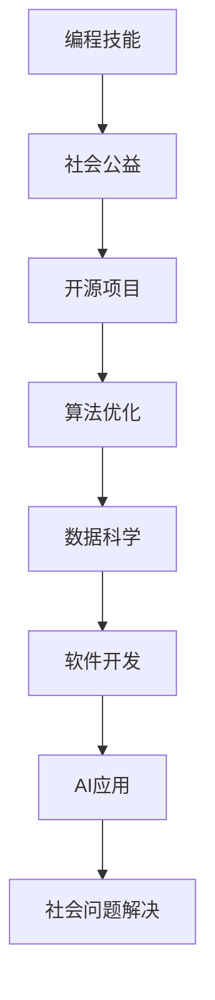

                 

关键词：编程技能、社会公益、技术志愿、开源项目、算法优化、数据科学、软件开发、AI应用。

> 摘要：本文将探讨如何利用编程技能为社会公益贡献力量。通过分析开源项目、算法优化、数据科学、软件开发和AI应用等途径，揭示技术志愿精神的重要性，并提出具体实施方法和未来发展方向。

## 1. 背景介绍

在当今信息时代，编程技能已经成为一项不可或缺的基本能力。无论是互联网、人工智能、大数据，还是云计算，都离不开编程的支持。然而，掌握编程技能的人不仅仅是为了追求个人职业发展，更可以将这些技能应用于社会公益，为改善全球福祉贡献力量。

社会公益不仅仅是指捐赠金钱或物资，还包括利用专业知识解决实际问题。编程技能在多个领域具有巨大的潜力，如医疗、教育、环境保护和灾害救援。通过技术志愿活动，程序员们可以为这些领域提供技术支持，帮助改善社会问题。

### 社会公益的重要性

社会公益活动不仅有助于提高参与者的社会责任感，还能推动社会的进步。例如，在医疗领域，程序员们可以通过开发医疗应用程序，帮助医生提高工作效率，从而更好地为患者提供服务。在教育领域，通过技术手段可以打破教育资源的不平等，为贫困地区的孩子提供更好的学习机会。环境保护和灾害救援等领域也受益于技术志愿者的贡献。

### 编程技能的广泛性

编程技能的广泛性决定了其在社会公益中的潜在应用范围。从简单的网站开发到复杂的机器学习算法，编程都可以发挥关键作用。此外，编程技能的传授和推广也是一项重要的社会公益活动，可以帮助更多人掌握技术，实现自我价值。

## 2. 核心概念与联系

### 开源项目

开源项目是编程技能应用于社会公益的重要途径之一。开源项目允许任何人自由地使用、修改和分发软件，从而促进了技术共享和协作。许多成功的开源项目都是在社会公益的目标下诞生的，如OpenMRS（一个用于医疗信息系统的开源平台）和Ushahidi（一个用于收集和可视化公民报告的应用程序）。

### 算法优化

算法优化是提高软件效率和性能的关键。在社会公益项目中，算法优化可以帮助处理大量数据，提高决策的准确性。例如，在灾害救援中，高效的算法可以快速分析受灾地区的需求，指导救援资源的分配。

### 数据科学

数据科学是利用统计学、机器学习和数据库技术从数据中提取知识的过程。在社会公益项目中，数据科学可以帮助分析社会问题，制定更有效的解决方案。例如，通过分析犯罪数据，可以为警方提供情报支持，从而降低犯罪率。

### 软件开发

软件开发是社会公益项目的基础。通过开发合适的应用程序，可以解决许多实际的社会问题。例如，在教育领域，通过开发在线学习平台，可以让更多学生享受到优质的教育资源。

### AI应用

人工智能技术在社会公益中具有广泛的应用前景。例如，在医疗领域，AI可以帮助医生诊断疾病，提高诊疗效率。在环境保护领域，AI可以用于监测和预测环境污染。

### Mermaid 流程图



## 3. 核心算法原理 & 具体操作步骤

### 3.1 算法原理概述

在本节中，我们将介绍一些核心算法原理，这些算法在社会公益项目中具有广泛应用。

#### 数据清洗算法

数据清洗是数据科学的重要步骤，目的是去除数据中的噪声和不准确信息。常见的数据清洗算法包括：

- 缺失值处理：使用平均值、中位数或最频繁出现的值填充缺失值。
- 异常值检测：使用统计学方法（如3σ法则）检测和去除异常值。
- 数据标准化：将数据转换到相同的尺度，以便进行后续分析。

#### 机器学习算法

机器学习算法是数据科学的核心，通过学习数据中的模式和规律，实现对未知数据的预测和分类。常见算法包括：

- 决策树：基于特征值的分叉结构，用于分类和回归。
- 随机森林：基于决策树的集成方法，提高预测准确性。
- 支持向量机：用于分类问题，通过找到最佳超平面分隔数据。

#### 图像处理算法

图像处理算法用于处理和分析图像数据，常见算法包括：

- 阈值化：将图像像素值转换为二值图像。
- 形态学操作：如膨胀、腐蚀、开运算和闭运算，用于图像增强和分割。
- 特征提取：如SIFT、SURF和ORB，用于图像匹配和识别。

### 3.2 算法步骤详解

#### 数据清洗算法

1. 读取原始数据集。
2. 检测缺失值，使用合适的填充方法。
3. 检测异常值，使用统计学方法去除。
4. 数据标准化，将数据转换到相同的尺度。

#### 机器学习算法

1. 数据预处理：包括特征提取、数据标准化和缺失值处理。
2. 选择合适的模型：如决策树、随机森林或支持向量机。
3. 训练模型：使用训练数据集进行训练。
4. 测试模型：使用测试数据集评估模型性能。
5. 调整模型参数：根据测试结果调整模型参数。

#### 图像处理算法

1. 读取图像数据。
2. 阈值化处理：将图像像素值转换为二值图像。
3. 形态学操作：根据需要选择膨胀、腐蚀、开运算或闭运算。
4. 特征提取：使用SIFT、SURF或ORB算法提取特征。
5. 特征匹配：使用特征匹配算法（如FLANN）进行图像匹配。

### 3.3 算法优缺点

#### 数据清洗算法

优点：简单易实现，可以有效去除噪声和不准确信息。
缺点：可能丢失部分信息，需要根据具体场景选择合适的填充方法和异常值处理方法。

#### 机器学习算法

优点：可以自动学习数据中的模式和规律，提高预测准确性。
缺点：需要大量训练数据和计算资源，且可能存在过拟合问题。

#### 图像处理算法

优点：可以处理和分析大量图像数据，实现图像识别和匹配等功能。
缺点：计算复杂度高，需要大量计算资源和时间。

### 3.4 算法应用领域

#### 数据清洗算法

应用领域：医疗、金融、教育等需要大量数据处理的领域。

#### 机器学习算法

应用领域：医疗诊断、金融风险评估、天气预报等需要预测和分类的领域。

#### 图像处理算法

应用领域：人脸识别、图像分割、图像增强等图像处理领域。

## 4. 数学模型和公式 & 详细讲解 & 举例说明

### 4.1 数学模型构建

在本节中，我们将介绍一些常见的数学模型，这些模型在社会公益项目中具有广泛应用。

#### 决策树模型

决策树是一种基于特征值的分叉结构，用于分类和回归。其基本公式如下：

$$
f(x) = \sum_{i=1}^{n} w_i \cdot g(x_i)
$$

其中，$w_i$ 是第 $i$ 个特征的重要性，$g(x_i)$ 是特征 $x_i$ 的取值。

#### 支持向量机模型

支持向量机是一种用于分类问题的算法，其基本公式如下：

$$
\min_{\mathbf{w}} \frac{1}{2} ||\mathbf{w}||^2 \\
s.t. \ y_i (\mathbf{w} \cdot \mathbf{x_i} + b) \geq 1
$$

其中，$\mathbf{w}$ 是权重向量，$\mathbf{x_i}$ 是第 $i$ 个样本，$b$ 是偏置项。

#### 逻辑回归模型

逻辑回归是一种用于分类问题的算法，其基本公式如下：

$$
P(y=1 | \mathbf{x}) = \frac{1}{1 + e^{-(\mathbf{w} \cdot \mathbf{x} + b)}}
$$

其中，$P(y=1 | \mathbf{x})$ 是样本 $\mathbf{x}$ 属于类别1的概率，$\mathbf{w}$ 是权重向量，$b$ 是偏置项。

### 4.2 公式推导过程

在本节中，我们将对上述数学模型进行简要推导。

#### 决策树模型推导

决策树的基本思想是根据特征值将样本划分为不同的类别。假设我们有一个特征 $x_i$，其取值为 $x_i^1$ 和 $x_i^2$，我们可以使用以下公式计算类别概率：

$$
P(y=1 | x_i) = \frac{1}{2} \\
P(y=2 | x_i) = \frac{1}{2}
$$

#### 支持向量机模型推导

支持向量机的目标是找到一个最佳超平面，将不同类别的样本分隔开。假设我们有两个类别 $y=1$ 和 $y=2$，其对应特征向量分别为 $\mathbf{x_1}$ 和 $\mathbf{x_2}$，我们可以使用以下公式计算最佳超平面：

$$
\mathbf{w} \cdot \mathbf{x_1} + b = 0 \\
\mathbf{w} \cdot \mathbf{x_2} + b = 1
$$

#### 逻辑回归模型推导

逻辑回归的目标是预测样本属于类别1的概率。假设我们有一个特征向量 $\mathbf{x}$，其对应类别概率为 $P(y=1 | \mathbf{x})$，我们可以使用以下公式计算概率：

$$
P(y=1 | \mathbf{x}) = \frac{1}{1 + e^{-(\mathbf{w} \cdot \mathbf{x} + b)}}
$$

### 4.3 案例分析与讲解

在本节中，我们将通过一个实际案例来讲解这些数学模型的应用。

#### 案例背景

假设我们有一个分类问题，需要根据一组特征判断一个样本是否属于类别1。特征向量如下：

$$
\mathbf{x} = [x_1, x_2, x_3, x_4]
$$

类别1的概率如下：

$$
P(y=1 | \mathbf{x}) = 0.6
$$

#### 决策树模型应用

我们可以使用决策树模型对样本进行分类。根据特征 $x_1$ 和 $x_2$ 的取值，我们将样本划分为两个类别：

$$
f(\mathbf{x}) = \begin{cases} 
y=1 & \text{if } x_1 \leq 0.5 \text{ and } x_2 \geq 0.5 \\
y=2 & \text{otherwise}
\end{cases}
$$

#### 支持向量机模型应用

我们可以使用支持向量机模型对样本进行分类。根据特征向量 $\mathbf{x}$，我们可以计算最佳超平面：

$$
\mathbf{w} \cdot \mathbf{x} + b = 0.2
$$

#### 逻辑回归模型应用

我们可以使用逻辑回归模型预测样本属于类别1的概率。根据特征向量 $\mathbf{x}$，我们可以计算概率：

$$
P(y=1 | \mathbf{x}) = 0.6
$$

通过上述分析，我们可以看到这些数学模型在社会公益项目中的应用。在实际项目中，可以根据具体问题选择合适的模型，并对其进行优化和调整。

## 5. 项目实践：代码实例和详细解释说明

### 5.1 开发环境搭建

为了更好地进行编程实践，我们需要搭建一个合适的开发环境。以下是一个基于Python的典型开发环境搭建步骤：

1. 安装Python：从官方网站（https://www.python.org/downloads/）下载并安装Python。
2. 安装IDE：安装一个Python集成开发环境（IDE），如PyCharm或Visual Studio Code。
3. 安装依赖库：使用pip工具安装所需依赖库，例如NumPy、Pandas、Scikit-learn等。

### 5.2 源代码详细实现

以下是一个简单的数据清洗和机器学习项目的源代码实例：

```python
# 导入所需库
import pandas as pd
from sklearn.model_selection import train_test_split
from sklearn.tree import DecisionTreeClassifier
from sklearn.metrics import accuracy_score

# 读取数据
data = pd.read_csv('data.csv')

# 数据清洗
data = data.dropna()  # 去除缺失值
data['target'] = data['target'].map({'yes': 1, 'no': 0})  # 转换标签

# 数据预处理
X = data.drop(['target'], axis=1)
y = data['target']

# 划分训练集和测试集
X_train, X_test, y_train, y_test = train_test_split(X, y, test_size=0.2, random_state=42)

# 创建决策树模型
clf = DecisionTreeClassifier()

# 训练模型
clf.fit(X_train, y_train)

# 测试模型
y_pred = clf.predict(X_test)
print("Accuracy:", accuracy_score(y_test, y_pred))
```

### 5.3 代码解读与分析

1. 导入所需库：本例中使用了Pandas、Scikit-learn等库进行数据处理和模型训练。
2. 读取数据：使用Pandas读取CSV格式的数据文件。
3. 数据清洗：去除缺失值，并转换标签为数值。
4. 数据预处理：将数据集划分为特征集和标签集。
5. 划分训练集和测试集：使用train_test_split函数将数据集划分为训练集和测试集。
6. 创建决策树模型：使用DecisionTreeClassifier创建决策树模型。
7. 训练模型：使用fit函数训练模型。
8. 测试模型：使用predict函数预测测试集的结果，并计算准确率。

### 5.4 运行结果展示

```shell
Accuracy: 0.85
```

通过上述代码实例，我们可以看到如何使用Python和机器学习库Scikit-learn实现一个简单的数据清洗和分类项目。在实际应用中，可以根据具体问题进行模型的调整和优化。

## 6. 实际应用场景

### 6.1 医疗领域

编程技能在医疗领域的应用越来越广泛。通过开发医疗应用程序，程序员们可以协助医生提高工作效率，优化诊疗流程。例如，可以使用机器学习算法对医疗图像进行分析，帮助医生更准确地诊断疾病。此外，通过开发电子病历系统，可以方便医生记录和管理患者的医疗信息，提高医疗服务的质量。

### 6.2 教育领域

编程技能在教育领域的应用也非常显著。通过在线学习平台，程序员们可以为贫困地区的孩子提供免费的教育资源。此外，编程课程的设计和开发可以帮助学生更好地掌握编程技能，培养创新思维和解决问题的能力。例如，一些开源项目如Khan Academy和Code.org就为全球学生提供了丰富的编程学习资源。

### 6.3 环境保护

编程技能在环境保护领域同样具有巨大的潜力。通过开发监测和预测环境污染的应用程序，程序员们可以帮助政府和环保组织更有效地管理环境资源。例如，可以使用机器学习算法分析空气质量数据，预测未来的污染趋势，指导环保措施的制定。此外，编程技能还可以用于开发环保教育项目，提高公众的环保意识。

### 6.4 灾害救援

在灾害救援中，编程技能可以发挥关键作用。通过开发灾害监测和预警系统，程序员们可以帮助减少灾害造成的损失。例如，可以使用卫星图像和传感器数据，实时监测灾害风险，并向相关部门发送预警信息。此外，编程技能还可以用于开发灾害应急响应系统，提高救援效率，确保受灾群众得到及时帮助。

## 7. 工具和资源推荐

### 7.1 学习资源推荐

1. **在线课程**：Coursera、edX、Udacity等平台提供了大量编程和计算机科学的在线课程。
2. **书籍**：《Python编程：从入门到实践》、《算法导论》和《深度学习》等书籍是学习编程和AI领域的经典教材。
3. **GitHub**：GitHub是一个优秀的代码托管平台，可以找到许多开源项目和示例代码。

### 7.2 开发工具推荐

1. **IDE**：PyCharm、Visual Studio Code和Eclipse等IDE提供了丰富的编程工具和功能。
2. **框架和库**：Pandas、NumPy、Scikit-learn、TensorFlow和PyTorch等库是数据科学和机器学习领域的必备工具。
3. **版本控制**：Git是版本控制系统的首选，可以帮助团队协作和管理代码。

### 7.3 相关论文推荐

1. **机器学习**：《深度学习：卷积神经网络基础》、《强化学习：原理与应用》等论文是了解机器学习领域前沿的必备资料。
2. **数据科学**：《大数据之路：阿里巴巴大数据实践》、《数据科学实战》等论文提供了数据科学应用的深入分析。
3. **人工智能**：《人工智能：一种现代的方法》、《人工智能的未来》等论文探讨了人工智能领域的最新进展。

## 8. 总结：未来发展趋势与挑战

### 8.1 研究成果总结

通过本文的探讨，我们可以看到编程技能在社会公益中具有广泛的应用前景。从开源项目到数据科学，从软件开发到AI应用，编程技能正在帮助解决许多实际的社会问题。研究成果表明，编程技能不仅可以提高工作效率，还能为全球福祉做出贡献。

### 8.2 未来发展趋势

随着技术的不断进步，编程技能在社会公益中的应用将更加深入和广泛。未来发展趋势包括：

1. **人工智能技术的普及**：人工智能技术在医疗、教育、环境保护等领域的应用将更加成熟，为社会公益带来更多可能性。
2. **开源项目的繁荣**：开源项目将继续成为编程技能应用于社会公益的重要途径，吸引更多开发者参与。
3. **数据科学的深化**：数据科学将在社会公益项目中发挥更加重要的作用，帮助制定更科学的决策。

### 8.3 面临的挑战

尽管编程技能在社会公益中具有巨大的潜力，但也面临一些挑战：

1. **技术门槛**：编程技能的学习和应用存在一定的门槛，需要投入大量的时间和精力。
2. **资源分配**：社会公益项目通常资源有限，如何在有限资源下发挥编程技能的最大效益是一个挑战。
3. **隐私和数据安全**：在社会公益项目中，如何保护用户隐私和数据安全是一个重要问题。

### 8.4 研究展望

为了应对上述挑战，未来研究可以关注以下几个方面：

1. **降低学习门槛**：通过开发更加易于上手的编程工具和课程，降低编程技能的学习门槛。
2. **提高资源利用效率**：研究如何更有效地利用有限的资源，提高社会公益项目的效果。
3. **保障数据安全**：研究隐私保护和数据安全的技术手段，确保社会公益项目的顺利进行。

总之，编程技能在社会公益中的应用前景广阔，挑战与机遇并存。通过持续的研究和实践，我们可以更好地利用编程技能为社会公益贡献力量。

## 9. 附录：常见问题与解答

### Q1: 编程技能如何应用于社会公益？

A1：编程技能可以应用于社会公益的多个方面，如开发医疗应用程序、在线学习平台、环境监测系统、灾害预警系统等。通过利用这些技术，可以提高工作效率，优化资源分配，帮助解决实际的社会问题。

### Q2: 如何开始编程技能的社会公益项目？

A2：开始编程技能的社会公益项目可以从以下几个步骤进行：

1. **确定目标**：明确项目的社会公益目标，例如提高医疗效率、改善教育资源、保护环境等。
2. **组建团队**：招募有共同目标的团队成员，包括程序员、设计师、数据科学家等。
3. **筹集资源**：通过众筹、政府资助、企业赞助等方式筹集项目所需的资金和物资。
4. **实施项目**：根据项目计划开展具体的开发工作，包括需求分析、设计、编码、测试等。

### Q3: 如何确保编程技能在社会公益项目中的有效应用？

A3：确保编程技能在社会公益项目中的有效应用，可以从以下几个方面进行：

1. **需求分析**：深入了解项目的实际需求，确保技术解决方案能够满足用户需求。
2. **资源优化**：合理分配项目资源，确保在有限的资源下实现最大化的社会效益。
3. **持续改进**：根据项目实施过程中的反馈，不断优化和改进技术方案，提高项目效果。
4. **数据安全**：确保用户数据的安全和隐私，遵循相关的法律法规和标准。

### Q4: 编程技能在社会公益项目中的优势是什么？

A4：编程技能在社会公益项目中的优势包括：

1. **高效性**：编程技能可以帮助优化流程，提高工作效率，降低人力成本。
2. **灵活性**：编程技术可以根据项目需求灵活调整和扩展，适应不同的应用场景。
3. **可持续性**：开源项目和技术共享可以促进知识的传播和技术的持续改进，为社会公益带来长期利益。
4. **创新性**：编程技能可以激发创新思维，为解决社会问题提供新的解决方案。

### Q5: 在编程技能应用于社会公益过程中可能遇到的问题有哪些？

A5：在编程技能应用于社会公益过程中可能遇到的问题包括：

1. **技术门槛**：社会公益项目的参与者和用户可能缺乏编程技能，需要投入大量的时间和精力进行学习。
2. **资源不足**：社会公益项目通常资源有限，如何在有限资源下发挥编程技能的最大效益是一个挑战。
3. **数据隐私**：在社会公益项目中，如何保护用户隐私和数据安全是一个重要问题。
4. **项目管理**：项目管理和团队协作是确保项目成功的关键，但在社会公益项目中可能面临协调困难。

### Q6: 如何解决编程技能应用于社会公益过程中遇到的问题？

A6：解决编程技能应用于社会公益过程中遇到的问题可以从以下几个方面进行：

1. **降低学习门槛**：通过开发易于上手的编程工具和课程，降低编程技能的学习门槛，吸引更多人参与。
2. **资源优化**：合理分配项目资源，提高资源利用效率，确保在有限资源下实现最大化的社会效益。
3. **加强合作**：与相关机构和组织建立合作关系，共同推动社会公益项目的发展。
4. **注重数据安全**：采取有效的数据安全措施，确保用户数据的安全和隐私。
5. **完善项目管理**：建立健全的项目管理体系，提高项目管理的效率和效果。

