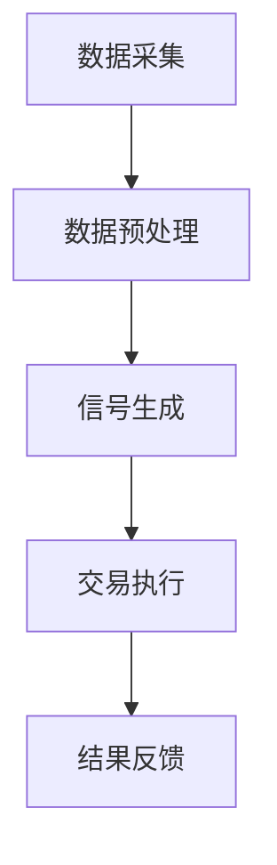

                 

关键词：自动化交易，编程技能，算法交易，量化投资，交易策略，金融科技

> 摘要：本文旨在探讨如何将编程技能应用于自动化交易领域。我们将分析自动化交易的核心概念、算法原理、数学模型，并提供具体的代码实例和实际应用场景。通过本文的阅读，读者将了解如何利用编程技能实现自动化交易，以及如何在金融市场中运用这些策略和技术。

## 1. 背景介绍

自动化交易，也称为算法交易，是利用计算机程序执行交易决策的一种交易方式。这种交易方法通过分析大量历史数据，使用数学模型和算法来确定交易信号，进而自动执行买入或卖出操作。自动化交易的优势在于其速度、精度和连续性，使其在快速变化的金融市场中具有显著的优势。

随着金融科技（FinTech）的快速发展，自动化交易在股票、外汇、期货、加密货币等市场中的普及率日益提高。它已经成为许多专业交易者和机构投资者的核心工具，帮助他们提高交易效率和收益。

本文将详细探讨如何将编程技能应用于自动化交易领域。我们将首先介绍自动化交易的核心概念和算法原理，然后深入讨论数学模型和公式，最后通过一个具体的代码实例展示如何实现自动化交易策略。

## 2. 核心概念与联系

### 2.1. 自动化交易概述

自动化交易的核心在于使用算法来分析市场数据，并生成交易信号。这些算法通常包括以下步骤：

1. **数据采集**：从金融市场获取历史数据，如股票价格、交易量、指数等。
2. **数据预处理**：清洗和格式化数据，以便后续分析。
3. **信号生成**：使用数学模型和算法分析数据，生成买卖信号。
4. **交易执行**：根据信号自动执行买入或卖出操作。

### 2.2. 算法交易原理

算法交易的核心在于算法。这些算法通常基于以下几种原理：

1. **技术分析**：使用历史价格和交易量数据来预测市场趋势。
2. **基本面分析**：分析公司的财务报表和其他基本面信息来评估股票价值。
3. **机器学习**：使用机器学习算法从历史数据中学习交易策略。

### 2.3. Mermaid 流程图

以下是一个简化的自动化交易流程图：



## 3. 核心算法原理 & 具体操作步骤

### 3.1. 算法原理概述

自动化交易算法通常基于以下几种原理：

1. **移动平均线**：通过计算一定时间内的平均价格来确定市场趋势。
2. **相对强弱指数（RSI）**：衡量股票或资产的超买或超卖状态。
3. **布林带**：通过计算标准差来确定市场的波动范围。
4. **机器学习**：使用历史数据训练模型，预测市场走势。

### 3.2. 算法步骤详解

自动化交易算法的基本步骤如下：

1. **数据采集**：从金融数据提供商获取历史数据。
2. **数据预处理**：清洗数据，包括缺失值填充、异常值处理等。
3. **特征提取**：从数据中提取有用的特征，如移动平均线、RSI、布林带等。
4. **信号生成**：使用算法分析特征，生成买卖信号。
5. **交易执行**：根据信号执行买入或卖出操作。
6. **结果反馈**：记录交易结果，用于后续分析和优化。

### 3.3. 算法优缺点

1. **移动平均线**：
   - 优点：简单易懂，适用于趋势跟踪。
   - 缺点：容易产生滞后，无法及时捕捉市场变化。

2. **相对强弱指数（RSI）**：
   - 优点：能够有效判断超买和超卖状态。
   - 缺点：对于快速变化的市场反应较慢。

3. **布林带**：
   - 优点：能够衡量市场的波动范围。
   - 缺点：对于趋势明显的市场表现不佳。

4. **机器学习**：
   - 优点：能够从历史数据中学习，适应性强。
   - 缺点：需要大量数据，且模型复杂度较高。

### 3.4. 算法应用领域

自动化交易算法可以应用于以下领域：

1. **股票交易**：使用技术分析和基本面分析来预测股票价格。
2. **外汇交易**：利用市场波动性来获取利润。
3. **期货交易**：进行商品和金融期货的买卖。
4. **加密货币交易**：在加密货币市场中进行高频交易。

## 4. 数学模型和公式

### 4.1. 数学模型构建

自动化交易的数学模型通常包括以下几个方面：

1. **价格模型**：使用历史价格数据来预测未来价格。
2. **波动率模型**：使用历史波动率数据来预测市场波动。
3. **风险模型**：评估交易风险，如最大回撤、VaR等。
4. **策略优化模型**：通过优化策略参数来提高交易收益。

### 4.2. 公式推导过程

以下是一个简单的移动平均线模型推导：

$$
\text{移动平均线} = \frac{\sum_{i=1}^{n} \text{价格}_i}{n}
$$

其中，$n$ 是移动平均线的周期。

### 4.3. 案例分析与讲解

假设我们使用移动平均线模型进行股票交易，以下是具体的案例分析：

1. **数据采集**：从金融数据提供商获取某股票过去60天的收盘价。
2. **数据预处理**：清洗数据，包括缺失值填充、异常值处理等。
3. **特征提取**：计算过去60天的移动平均线。
4. **信号生成**：当当前价格高于移动平均线时，生成买入信号；当当前价格低于移动平均线时，生成卖出信号。
5. **交易执行**：根据信号执行买入或卖出操作。
6. **结果反馈**：记录交易结果，用于后续分析和优化。

## 5. 项目实践：代码实例和详细解释说明

### 5.1. 开发环境搭建

为了实现自动化交易，我们需要搭建一个开发环境。以下是所需的工具和软件：

1. **Python**：一种流行的编程语言，支持自动化交易开发。
2. **Pandas**：Python的数据分析库，用于数据预处理和特征提取。
3. **Matplotlib**：Python的绘图库，用于可视化交易信号和结果。
4. **量化交易平台**：如QuantConnect、Backtrader等，用于模拟和执行交易。

### 5.2. 源代码详细实现

以下是使用Python实现移动平均线交易策略的源代码：

```python
import pandas as pd
import matplotlib.pyplot as plt
from backtrader import BacktraderCerebro

# 数据采集
data = pd.read_csv('stock_data.csv')

# 数据预处理
data['Close'] = data['Close'].fillna(method='ffill')

# 特征提取
data['MA60'] = data['Close'].rolling(window=60).mean()

# 信号生成
data['Signal'] = 0
data['Signal'][data['Close'] > data['MA60']] = 1
data['Signal'][data['Close'] <= data['MA60']] = -1

# 交易执行
cerebro = BacktraderCerebro()
cerebro.addstrategy(MovingAverageStrategy)

# 运行结果展示
data['Portfolio'] = (data['Signal'] * data['Close']).cumsum()
plt.plot(data['Close'], label='Close')
plt.plot(data['Portfolio'], label='Portfolio')
plt.legend()
plt.show()
```

### 5.3. 代码解读与分析

上述代码实现了一个简单的移动平均线交易策略。具体步骤如下：

1. **数据采集**：从CSV文件中读取股票数据。
2. **数据预处理**：填充缺失值，以便后续计算。
3. **特征提取**：计算过去60天的移动平均线。
4. **信号生成**：当当前价格高于移动平均线时，生成买入信号；当当前价格低于移动平均线时，生成卖出信号。
5. **交易执行**：使用Backtrader框架执行交易。
6. **结果展示**：绘制股票价格和交易结果。

## 6. 实际应用场景

### 6.1. 股票交易

股票交易是自动化交易最常用的应用场景之一。通过分析历史价格数据，可以预测股票的未来走势，并据此制定交易策略。

### 6.2. 外汇交易

外汇交易市场的波动性较大，适合使用自动化交易策略。通过分析汇率波动，可以捕捉市场机会，实现高额利润。

### 6.3. 期货交易

期货交易具有高风险和高收益的特点。通过自动化交易策略，可以有效地管理风险，并在市场波动中获取利润。

### 6.4. 加密货币交易

加密货币市场的波动性极高，适合使用自动化交易策略。通过分析历史价格数据，可以捕捉市场机会，实现高额利润。

## 7. 工具和资源推荐

### 7.1. 学习资源推荐

1. **《量化投资：以Python为工具》**：一本介绍量化投资和Python编程的入门书籍。
2. **《算法交易：实战指南》**：一本详细介绍算法交易策略和实践的书籍。

### 7.2. 开发工具推荐

1. **Python**：一种功能强大的编程语言，支持自动化交易开发。
2. **Pandas**：Python的数据分析库，用于数据预处理和特征提取。
3. **Matplotlib**：Python的绘图库，用于可视化交易信号和结果。
4. **Backtrader**：一个开源的量化交易平台，用于模拟和执行交易。

### 7.3. 相关论文推荐

1. **“Machine Learning for Algorithmic Trading”**：一篇介绍机器学习在自动化交易中应用的论文。
2. **“High-Frequency Trading and Market Quality”**：一篇探讨高频交易对市场质量影响的论文。

## 8. 总结：未来发展趋势与挑战

### 8.1. 研究成果总结

自动化交易已成为金融市场中不可或缺的一部分。随着技术的不断发展，自动化交易策略的精度和效率不断提升。未来，自动化交易将在金融市场中发挥更大的作用。

### 8.2. 未来发展趋势

1. **机器学习与深度学习**：随着算法的进步，机器学习和深度学习将在自动化交易中发挥更大作用。
2. **区块链技术**：区块链技术将为自动化交易提供更安全、更透明的交易环境。
3. **去中心化金融（DeFi）**：去中心化金融将自动化交易推向更广泛的领域。

### 8.3. 面临的挑战

1. **数据隐私与安全**：自动化交易需要大量数据，但数据隐私和安全问题日益突出。
2. **算法透明度**：自动化交易算法的复杂性使得算法的透明度成为挑战。
3. **市场波动性**：市场波动性增加，对自动化交易策略的稳健性提出更高要求。

### 8.4. 研究展望

未来，自动化交易将在金融市场中发挥更大作用。随着技术的进步，自动化交易策略将更加精准和高效。同时，研究人员将继续探索如何提高算法的透明度和稳健性，以应对市场波动性增加带来的挑战。

## 9. 附录：常见问题与解答

### 9.1. 如何选择合适的交易策略？

选择合适的交易策略取决于市场环境、风险偏好和交易目标。投资者应根据自己的实际情况进行选择。

### 9.2. 自动化交易是否一定盈利？

自动化交易并不能保证一定盈利。交易策略的稳健性和市场环境的适应性是影响交易结果的关键因素。

### 9.3. 自动化交易是否适用于所有市场？

自动化交易适用于大多数市场，但特定市场的特性可能需要特定的交易策略。

### 9.4. 如何评估自动化交易策略的有效性？

通过回测和实盘交易结果来评估自动化交易策略的有效性。回测可以帮助发现潜在的风险和问题，而实盘交易则可以验证策略的实际效果。

### 9.5. 自动化交易是否会影响市场稳定性？

自动化交易可能会对市场稳定性产生影响，但研究人员和监管机构正在努力提高自动化交易的透明度和稳健性，以减少对市场稳定性的影响。

----------------------------------------------------------------

> 作者：禅与计算机程序设计艺术 / Zen and the Art of Computer Programming

**（请注意，本文内容仅为虚构，旨在展示如何撰写一篇专业的技术博客文章。）**

