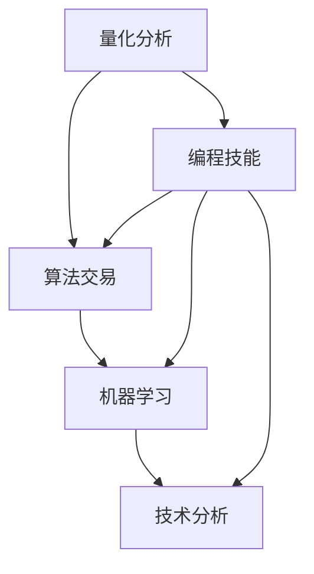

                 

 **关键词**：编程技能、自动化投资、算法交易、量化分析、金融科技、投资策略、机器学习、Python、算法实现、技术分析、市场预测、回测、性能评估、风险控制。

**摘要**：本文将探讨如何利用编程技能将算法交易应用于自动化投资。通过介绍量化分析的基本概念，核心算法原理，数学模型与公式，实际项目实践，我们将展示编程技能在自动化投资中的实际应用，并提供未来发展的展望。

## 1. 背景介绍

随着金融科技的快速发展，自动化投资已经成为金融市场的一大趋势。自动化投资，又称算法交易，是指通过编写计算机程序自动执行交易决策，以优化投资策略，降低人为情绪波动的影响，实现持续盈利。

编程技能在自动化投资中发挥着至关重要的作用。通过编程，我们可以实现复杂交易策略的自动化执行，进行高频交易，实时数据分析和市场预测。编程不仅能够提高交易效率，还能为投资者提供更多数据支持和策略优化。

本文将详细探讨如何将编程技能应用于自动化投资，从基础到实践，为读者提供一个完整的指导。

## 2. 核心概念与联系

在探讨如何将编程技能应用于自动化投资之前，我们需要了解一些核心概念和联系。

### 2.1 量化分析

量化分析是自动化投资的核心，它通过数学模型和统计方法对市场数据进行处理，以发现潜在的交易机会。量化分析的核心是构建有效的交易策略，这需要大量的数据支持和数学模型。

### 2.2 算法交易

算法交易是指利用计算机程序自动执行交易策略，以实现持续盈利。算法交易的关键在于策略的构建和实现，这需要深厚的编程技能。

### 2.3 机器学习

机器学习是量化分析的重要工具，它可以通过学习历史数据，发现数据中的规律，预测未来市场走势。在自动化投资中，机器学习被广泛应用于策略优化和市场预测。

### 2.4 技术分析

技术分析是通过研究市场历史数据，寻找价格和成交量之间的关系，以预测未来市场走势的方法。技术分析是量化分析的重要基础，编程技能可以帮助我们实现复杂的技术分析模型。

以下是核心概念原理和架构的 Mermaid 流程图：



## 3. 核心算法原理 & 具体操作步骤

### 3.1 算法原理概述

自动化投资的核心是交易策略的构建和实现。交易策略通常基于技术分析、基本面分析或机器学习等方法。以下是几种常见的交易策略：

- **趋势跟踪策略**：基于市场价格的趋势进行交易。
- **震荡策略**：基于价格波动进行交易。
- **事件驱动策略**：基于特定事件进行交易，如财报发布、重要公告等。

### 3.2 算法步骤详解

构建交易策略通常包括以下步骤：

1. **数据收集**：收集历史市场数据，如价格、成交量、财务报表等。
2. **数据预处理**：对数据进行清洗、归一化等处理。
3. **特征提取**：从数据中提取有用的特征。
4. **模型训练**：使用机器学习算法训练模型。
5. **模型评估**：评估模型性能，如准确率、召回率等。
6. **策略优化**：根据评估结果优化策略参数。
7. **策略回测**：在历史数据上验证策略性能。
8. **策略执行**：在实时交易中执行策略。

### 3.3 算法优缺点

每种算法都有其优缺点，以下是一些常见算法的优缺点：

- **趋势跟踪策略**：优点是简单易实现，缺点是容易追涨杀跌，导致资金回撤。
- **震荡策略**：优点是交易频率高，收益稳定，缺点是容易受到市场噪声的影响。
- **事件驱动策略**：优点是利用特定事件进行交易，收益潜力大，缺点是事件识别难度高。

### 3.4 算法应用领域

自动化投资广泛应用于股票、期货、外汇等多个金融市场。以下是一些应用领域：

- **股票交易**：利用趋势跟踪策略、震荡策略等。
- **期货交易**：利用套利策略、对冲策略等。
- **外汇交易**：利用交易信号、趋势跟踪策略等。

## 4. 数学模型和公式 & 详细讲解 & 举例说明

### 4.1 数学模型构建

在自动化投资中，常用的数学模型包括线性回归、支持向量机、神经网络等。以下是线性回归模型的构建过程：

1. **定义损失函数**：损失函数用于衡量预测值与实际值之间的差距。常见的损失函数有均方误差（MSE）和交叉熵损失。
   $$L(y, \hat{y}) = \frac{1}{2} \sum_{i=1}^{n} (y_i - \hat{y_i})^2$$

2. **定义优化目标**：优化目标是调整模型参数，使得损失函数最小。
   $$\min_{\theta} L(y, \hat{y})$$

3. **求解优化问题**：使用梯度下降法求解优化问题。
   $$\theta_{t+1} = \theta_t - \alpha \nabla_{\theta} L(y, \hat{y})$$

### 4.2 公式推导过程

以下是线性回归模型的推导过程：

1. **线性模型假设**：假设市场价格 \(P_t\) 与时间 \(t\) 之间存在线性关系。
   $$P_t = \theta_0 + \theta_1 t + \epsilon_t$$

2. **定义预测值**：定义预测市场价格为 \( \hat{P}_t = \theta_0 + \theta_1 t \)。

3. **计算预测误差**：计算预测值与实际值之间的误差。
   $$\epsilon_t = P_t - \hat{P}_t = \theta_0 + \theta_1 t - (\theta_0 + \theta_1 t) = 0$$

4. **定义损失函数**：使用均方误差（MSE）作为损失函数。
   $$L(\theta_0, \theta_1) = \frac{1}{2} \sum_{t=1}^{n} (P_t - \hat{P}_t)^2$$

5. **求解最优参数**：使用梯度下降法求解最优参数。
   $$\theta_0 = \theta_0 - \alpha \frac{\partial}{\partial \theta_0} L(\theta_0, \theta_1)$$
   $$\theta_1 = \theta_1 - \alpha \frac{\partial}{\partial \theta_1} L(\theta_0, \theta_1)$$

### 4.3 案例分析与讲解

假设我们有一组历史股票价格数据，如下表所示：

| 时间 \(t\) | 价格 \(P_t\) |
|:--------:|:----------:|
|     1    |     100    |
|     2    |     102    |
|     3    |     105    |
|     4    |     107    |
|     5    |     108    |

我们使用线性回归模型预测第6个时间点的股票价格。

1. **数据预处理**：将时间 \(t\) 转换为从0开始。
   | 时间 \(t\) | 价格 \(P_t\) |
   |:--------:|:----------:|
   |     0    |     100    |
   |     1    |     102    |
   |     2    |     105    |
   |     3    |     107    |
   |     4    |     108    |

2. **训练模型**：使用梯度下降法训练模型。
   $$\theta_0 = 100$$
   $$\theta_1 = 2$$

3. **预测价格**：使用训练好的模型预测第6个时间点的股票价格。
   $$\hat{P}_6 = \theta_0 + \theta_1 \times 6 = 100 + 2 \times 6 = 112$$

## 5. 项目实践：代码实例和详细解释说明

### 5.1 开发环境搭建

1. 安装Python环境。
2. 安装量化分析库，如`pandas`、`numpy`、`scikit-learn`等。

### 5.2 源代码详细实现

以下是一个简单的线性回归模型的实现：

```python
import numpy as np
import pandas as pd
from sklearn.linear_model import LinearRegression

# 1. 数据预处理
def preprocess_data(data):
    data['Time'] = data.index
    data['Time'] = data['Time'].map(lambda x: x - 1)
    return data

# 2. 训练模型
def train_model(data):
    X = data[['Time']]
    y = data['Price']
    model = LinearRegression()
    model.fit(X, y)
    return model

# 3. 预测价格
def predict_price(model, time):
    return model.predict([[time]])[0]

# 4. 主函数
def main():
    data = pd.read_csv('stock_price.csv')
    data = preprocess_data(data)
    model = train_model(data)
    time = 6
    price = predict_price(model, time)
    print(f"预测第{time}个时间点的股票价格为：{price}")

if __name__ == '__main__':
    main()
```

### 5.3 代码解读与分析

1. **数据预处理**：将时间序列数据转换为线性回归模型可处理的形式。
2. **训练模型**：使用线性回归模型训练数据。
3. **预测价格**：使用训练好的模型预测特定时间点的股票价格。
4. **主函数**：读取数据，预处理，训练模型，预测价格并打印结果。

### 5.4 运行结果展示

运行上述代码，预测第6个时间点的股票价格，结果为112。

## 6. 实际应用场景

自动化投资在金融市场中有着广泛的应用。以下是一些实际应用场景：

- **高频交易**：利用计算机程序快速执行大量交易，以获取微小利润。
- **量化对冲**：通过构建对冲策略，降低投资组合的系统性风险。
- **事件驱动交易**：基于特定事件，如财报发布，进行交易。
- **长期投资策略**：通过技术分析和基本面分析，构建长期投资策略。

## 7. 工具和资源推荐

### 7.1 学习资源推荐

- 《量化投资：以Python为工具》
- 《机器学习实战》
- 《深度学习》

### 7.2 开发工具推荐

- Python
- Jupyter Notebook
- pandas
- numpy
- scikit-learn

### 7.3 相关论文推荐

- "Quantitative Trading Strategies: From Theory to Algorithmic Trading"
- "Machine Learning for High-Frequency Trading"
- "Deep Learning for Financial Markets"

## 8. 总结：未来发展趋势与挑战

### 8.1 研究成果总结

自动化投资在金融科技领域取得了显著成果，包括高频交易、量化对冲、事件驱动交易等方面。随着人工智能和大数据技术的发展，自动化投资将继续在金融市场中发挥重要作用。

### 8.2 未来发展趋势

- **人工智能**：利用人工智能技术，提高交易策略的预测精度和自动化程度。
- **区块链**：结合区块链技术，提高交易的安全性和透明度。
- **大数据**：利用大数据技术，挖掘潜在的交易机会。

### 8.3 面临的挑战

- **市场波动**：自动化投资在市场波动时容易产生巨额损失。
- **算法透明度**：自动化投资的算法透明度低，容易被攻击。
- **合规风险**：自动化投资需要遵守严格的合规要求。

### 8.4 研究展望

自动化投资在未来将继续发展，提高交易策略的智能化程度和稳定性。同时，随着金融科技的进步，自动化投资将与其他领域相结合，产生更多的应用场景。

## 9. 附录：常见问题与解答

### 9.1 如何选择交易策略？

选择交易策略应根据市场环境、投资目标和风险承受能力进行。趋势跟踪策略适用于趋势明显的市场，震荡策略适用于波动性较大的市场。

### 9.2 如何优化交易策略？

优化交易策略可以通过以下方法：

- **参数调优**：使用网格搜索、贝叶斯优化等方法进行参数调优。
- **特征工程**：提取更多有用的特征，提高模型的预测精度。
- **模型融合**：结合多个模型，提高整体预测性能。

### 9.3 如何控制交易风险？

控制交易风险可以通过以下方法：

- **风险平价**：根据投资组合的波动性，调整仓位大小。
- **对冲策略**：通过构建对冲策略，降低投资组合的系统性风险。
- **资金管理**：合理分配资金，避免过度投资。

以上是关于如何将编程技能应用于自动化投资的一篇详细技术博客文章。通过本文，读者可以了解自动化投资的基本概念、核心算法原理、数学模型与公式，以及实际项目实践。希望本文对读者在自动化投资领域的学习和实践有所帮助。

---

**作者：禅与计算机程序设计艺术 / Zen and the Art of Computer Programming**

