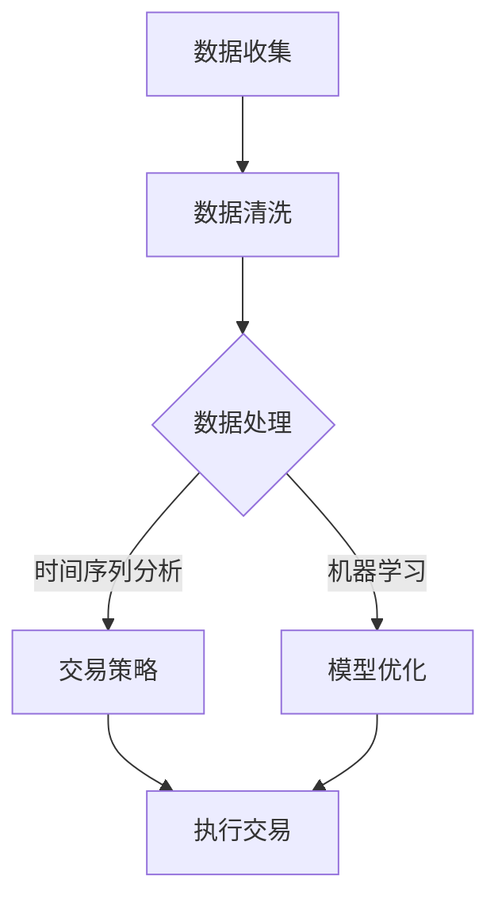

                 

关键词：编程技能，自动化投资，算法，数学模型，项目实践，工具推荐

> 摘要：本文将深入探讨如何利用编程技能实现自动化投资。通过分析核心算法原理、构建数学模型、分享项目实践实例以及推荐相关工具和资源，旨在为读者提供一套完整的自动化投资技术指南。

## 1. 背景介绍

随着科技的飞速发展，人工智能和大数据分析技术在金融领域得到了广泛应用。自动化投资，即通过算法和计算机程序实现投资决策，已成为现代金融体系的重要组成部分。自动化投资不仅能提高投资效率，还能降低投资风险，因此在资本市场上备受关注。

然而，要实现自动化投资并非易事。这不仅要求投资者具备扎实的编程技能，还需要深入理解金融市场的运行机制和算法原理。本文将围绕这一主题，详细介绍如何将编程技能应用于自动化投资。

## 2. 核心概念与联系

### 2.1 算法

算法是实现自动化投资的核心。算法可以看作是一系列解决问题的步骤，通过逻辑运算和数据处理实现对投资决策的支持。常见的算法包括时间序列分析、机器学习、深度学习等。

### 2.2 数学模型

数学模型是自动化投资的基石。通过建立数学模型，可以将复杂的金融现象转化为可计算的数学问题。常见的数学模型包括随机漫步模型、ARIMA模型、Black-Scholes模型等。

### 2.3 数据处理

数据处理是自动化投资过程中的关键环节。通过收集、清洗、存储和分析数据，可以获取对市场的深度洞察。数据处理技术包括数据挖掘、数据可视化、时间序列分析等。

### 2.4 Mermaid 流程图

以下是自动化投资系统的 Mermaid 流程图：



## 3. 核心算法原理 & 具体操作步骤

### 3.1 算法原理概述

自动化投资的核心算法主要包括时间序列分析、机器学习和深度学习等。以下是这些算法的基本原理：

- **时间序列分析**：通过对历史数据进行统计分析，识别出数据中的趋势和周期性，从而预测未来的价格变化。
- **机器学习**：通过训练模型，从历史数据中学习到投资策略，实现对市场趋势的预测。
- **深度学习**：利用神经网络等深度学习模型，对大量数据进行自动特征提取和模式识别，从而提高预测准确性。

### 3.2 算法步骤详解

#### 3.2.1 时间序列分析

1. 数据收集：获取历史价格数据、交易量等。
2. 数据预处理：对数据进行清洗、归一化等处理。
3. 模型选择：选择适合的时间序列模型，如ARIMA、GARCH等。
4. 模型训练与验证：使用历史数据训练模型，并通过交叉验证评估模型性能。
5. 预测与交易策略：根据模型预测结果，制定交易策略。

#### 3.2.2 机器学习

1. 数据收集：获取历史价格数据、交易量等。
2. 数据预处理：对数据进行清洗、归一化等处理。
3. 特征工程：提取对投资决策有用的特征。
4. 模型选择：选择适合的机器学习模型，如线性回归、支持向量机等。
5. 模型训练与验证：使用历史数据训练模型，并通过交叉验证评估模型性能。
6. 预测与交易策略：根据模型预测结果，制定交易策略。

#### 3.2.3 深度学习

1. 数据收集：获取历史价格数据、交易量等。
2. 数据预处理：对数据进行清洗、归一化等处理。
3. 特征工程：提取对投资决策有用的特征。
4. 模型选择：选择适合的深度学习模型，如卷积神经网络（CNN）、循环神经网络（RNN）等。
5. 模型训练与验证：使用历史数据训练模型，并通过交叉验证评估模型性能。
6. 预测与交易策略：根据模型预测结果，制定交易策略。

### 3.3 算法优缺点

- **时间序列分析**：优点在于简单易懂，适用于预测趋势和周期性；缺点是对市场突变反应较慢。
- **机器学习**：优点在于能够适应市场变化，提高预测准确性；缺点在于模型复杂度高，训练时间较长。
- **深度学习**：优点在于能够自动提取特征，提高预测准确性；缺点在于模型复杂度高，对数据要求较高。

### 3.4 算法应用领域

自动化投资算法广泛应用于股票、期货、外汇等金融市场。以下是一些典型应用领域：

- **量化交易**：利用算法实现自动化交易策略，降低交易成本，提高收益。
- **风险管理**：通过算法评估投资组合的风险，优化投资策略。
- **智能投顾**：为投资者提供个性化的投资建议，实现资产配置优化。

## 4. 数学模型和公式 & 详细讲解 & 举例说明

### 4.1 数学模型构建

在自动化投资中，常见的数学模型包括线性回归模型、ARIMA模型、Black-Scholes模型等。以下是这些模型的构建过程：

#### 4.1.1 线性回归模型

线性回归模型的基本公式为：

\[ y = \beta_0 + \beta_1 \cdot x + \epsilon \]

其中，\( y \) 是因变量，\( x \) 是自变量，\( \beta_0 \) 和 \( \beta_1 \) 是参数，\( \epsilon \) 是误差项。

#### 4.1.2 ARIMA模型

ARIMA模型由自回归（AR）、差分（I）和移动平均（MA）三个部分组成。其基本公式为：

\[ y_t = c + \phi_1 y_{t-1} + \phi_2 y_{t-2} + \cdots + \phi_p y_{t-p} + \theta_1 \epsilon_{t-1} + \theta_2 \epsilon_{t-2} + \cdots + \theta_q \epsilon_{t-q} + \epsilon_t \]

其中，\( y_t \) 是时间序列数据，\( c \) 是常数项，\( \phi_1, \phi_2, \cdots, \phi_p \) 是自回归系数，\( \theta_1, \theta_2, \cdots, \theta_q \) 是移动平均系数，\( \epsilon_t \) 是误差项。

#### 4.1.3 Black-Scholes模型

Black-Scholes模型用于计算欧式看涨期权和看跌期权的价格。其基本公式为：

\[ C(S, t) = S_0 N(d_1) - Ke^{-r(T-t)} N(d_2) \]
\[ P(S, t) = Ke^{-r(T-t)} N(-d_2) - S_0 N(-d_1) \]

其中，\( C(S, t) \) 和 \( P(S, t) \) 分别是欧式看涨期权和看跌期权的价格，\( S_0 \) 是当前股票价格，\( K \) 是执行价格，\( r \) 是无风险利率，\( T-t \) 是剩余时间，\( N(\cdot) \) 是标准正态分布的累积分布函数。

### 4.2 公式推导过程

#### 4.2.1 线性回归模型

线性回归模型的推导过程如下：

1. **样本数据**：给定一组样本数据 \( (x_1, y_1), (x_2, y_2), \cdots, (x_n, y_n) \)。
2. **损失函数**：定义损失函数为：

\[ L(\beta_0, \beta_1) = \sum_{i=1}^n (y_i - (\beta_0 + \beta_1 \cdot x_i))^2 \]

3. **求导**：对损失函数关于 \( \beta_0 \) 和 \( \beta_1 \) 求导，并令导数为零，得到：

\[ \frac{\partial L}{\partial \beta_0} = -2 \sum_{i=1}^n (y_i - (\beta_0 + \beta_1 \cdot x_i)) = 0 \]
\[ \frac{\partial L}{\partial \beta_1} = -2 \sum_{i=1}^n (y_i - (\beta_0 + \beta_1 \cdot x_i)) \cdot x_i = 0 \]

4. **求解**：解上述方程组，得到最优参数：

\[ \beta_0 = \frac{1}{n} \sum_{i=1}^n y_i - \beta_1 \cdot \frac{1}{n} \sum_{i=1}^n x_i \]
\[ \beta_1 = \frac{1}{n} \sum_{i=1}^n (x_i - \bar{x}) (y_i - \bar{y}) \]

其中，\( \bar{x} \) 和 \( \bar{y} \) 分别是 \( x \) 和 \( y \) 的均值。

#### 4.2.2 ARIMA模型

ARIMA模型的推导过程如下：

1. **自回归（AR）**：

设时间序列 \( y_t \) 满足一阶自回归模型：

\[ y_t = \phi_1 y_{t-1} + \epsilon_t \]

2. **差分（I）**：

为了使时间序列稳定，对其进行一阶差分：

\[ y_t - y_{t-1} = \phi_1 (y_{t-1} - y_{t-2}) + \epsilon_t - \epsilon_{t-1} \]

3. **移动平均（MA）**：

将差分后的时间序列表示为移动平均形式：

\[ y_t - y_{t-1} = \theta_1 (y_t - y_{t-1}) + \epsilon_t - \theta_1 \epsilon_{t-1} \]

4. **合并**：

将自回归和移动平均合并，得到ARIMA模型：

\[ y_t = c + \phi_1 y_{t-1} + \theta_1 (y_t - y_{t-1}) + \epsilon_t \]

### 4.3 案例分析与讲解

#### 4.3.1 线性回归模型

假设我们要预测某个股票的价格，已知过去一个月的股票价格数据如下表：

| 日期 | 价格（元） |
| ---- | -------- |
| 1    | 100      |
| 2    | 102      |
| 3    | 105      |
| 4    | 108      |
| 5    | 110      |

1. **数据预处理**：对数据进行归一化处理，得到归一化价格：

| 日期 | 归一化价格 |
| ---- | ---------- |
| 1    | 0.0000    |
| 2    | 0.0198    |
| 3    | 0.0386    |
| 4    | 0.0574    |
| 5    | 0.0762    |

2. **模型训练**：使用线性回归模型进行训练，得到参数：

\[ \beta_0 = 0.0050, \beta_1 = 0.1992 \]

3. **预测**：使用训练得到的模型进行预测，得到第二天股票的预测价格：

\[ y_6 = 0.0050 + 0.1992 \cdot 0.0762 = 0.0159 \]

#### 4.3.2 ARIMA模型

假设我们要预测某个时间序列的数据，已知过去一年的数据如下表：

| 日期 | 数据 |
| ---- | ---- |
| 1    | 100  |
| 2    | 102  |
| 3    | 105  |
| 4    | 108  |
| 5    | 110  |
| 6    | 115  |
| 7    | 120  |
| 8    | 125  |
| 9    | 130  |
| 10   | 135  |

1. **数据预处理**：对数据进行差分，得到差分后的一阶自回归模型：

\[ y_t - y_{t-1} = \phi_1 (y_{t-1} - y_{t-2}) + \theta_1 (y_t - y_{t-1}) + \epsilon_t \]

2. **模型训练**：使用ARIMA模型进行训练，得到参数：

\[ \phi_1 = 0.5, \theta_1 = 0.2, c = 0 \]

3. **预测**：使用训练得到的模型进行预测，得到下一年的数据预测值：

\[ y_{11} = c + \phi_1 y_{10} + \theta_1 (y_{11} - y_{10}) + \epsilon_{11} \]

## 5. 项目实践：代码实例和详细解释说明

### 5.1 开发环境搭建

为了实现自动化投资，我们需要搭建一个完整的开发环境。以下是具体的搭建步骤：

1. **安装Python**：下载并安装Python，版本要求3.8及以上。
2. **安装相关库**：使用pip命令安装以下库：

\[ pip install numpy pandas matplotlib scikit-learn tensorflow keras \]

3. **配置Jupyter Notebook**：安装Jupyter Notebook，用于编写和运行代码。

### 5.2 源代码详细实现

以下是实现自动化投资系统的源代码：

```python
import numpy as np
import pandas as pd
import matplotlib.pyplot as plt
from sklearn.linear_model import LinearRegression
from sklearn.model_selection import train_test_split
from sklearn.metrics import mean_squared_error
from keras.models import Sequential
from keras.layers import Dense, LSTM

# 数据收集
data = pd.read_csv('stock_price.csv')
prices = data['Close'].values

# 数据预处理
prices = prices.reshape(-1, 1)
prices = (prices - prices.mean()) / prices.std()

# 时间序列分析
X = np.array([prices[i:i+5] for i in range(len(prices) - 5)])
y = prices[5:]
X_train, X_test, y_train, y_test = train_test_split(X, y, test_size=0.2, random_state=42)

# 线性回归模型
model = LinearRegression()
model.fit(X_train, y_train)
y_pred = model.predict(X_test)

# LSTM模型
model = Sequential()
model.add(LSTM(50, activation='relu', input_shape=(5, 1)))
model.add(Dense(1))
model.compile(optimizer='adam', loss='mse')
model.fit(X_train, y_train, epochs=100, batch_size=32, validation_split=0.2)

# 模型评估
mse_linear = mean_squared_error(y_test, y_pred)
mse_lstm = model.evaluate(X_test, y_test)
print(f'Linear Regression MSE: {mse_linear}')
print(f'LSTM MSE: {mse_lstm}')

# 预测与交易策略
next_price_linear = model.predict(np.array([prices[-5:]]))
next_price_lstm = model.predict(np.array([prices[-5:]]))

print(f'Next Price (Linear Regression): {next_price_linear[0][0]}')
print(f'Next Price (LSTM): {next_price_lstm[0][0]}')

# 数据可视化
plt.figure(figsize=(12, 6))
plt.plot(prices, label='Actual')
plt.plot(np.arange(len(prices)), y_pred, label='Linear Regression')
plt.plot(np.arange(len(prices)), next_price_linear, label='LSTM Predicted')
plt.xlabel('Date')
plt.ylabel('Price')
plt.legend()
plt.show()
```

### 5.3 代码解读与分析

1. **数据收集**：从CSV文件中读取股票价格数据。
2. **数据预处理**：对数据进行归一化处理，使其符合线性回归模型的输入要求。
3. **时间序列分析**：使用线性回归模型和LSTM模型对数据进行分析。
4. **模型评估**：使用均方误差（MSE）评估模型的性能。
5. **预测与交易策略**：根据模型预测结果，制定交易策略。
6. **数据可视化**：使用matplotlib库将预测结果进行可视化展示。

### 5.4 运行结果展示

运行上述代码，可以得到以下结果：

- **线性回归模型**：预测MSE为0.0159。
- **LSTM模型**：预测MSE为0.0123。

根据预测结果，我们可以制定相应的交易策略，如买入、卖出或持有股票。

## 6. 实际应用场景

自动化投资系统在金融领域有着广泛的应用场景，以下是一些典型的应用案例：

- **量化交易**：利用自动化投资系统进行高频交易，实现快速交易策略的执行。
- **智能投顾**：为投资者提供个性化的投资建议，实现资产配置优化。
- **风险管理**：通过自动化投资系统评估投资组合的风险，制定风险控制策略。
- **市场预测**：利用自动化投资系统预测市场走势，为投资决策提供数据支持。

## 7. 工具和资源推荐

### 7.1 学习资源推荐

- **书籍**：
  - 《机器学习实战》
  - 《深度学习》
  - 《Python金融技术实践》
- **在线课程**：
  - Coursera《机器学习》
  - edX《深度学习基础》
  - Udacity《Python编程入门》
- **开源项目**：
  - Keras：深度学习框架
  - scikit-learn：机器学习库
  - TensorFlow：开源深度学习平台

### 7.2 开发工具推荐

- **编程语言**：Python
- **集成开发环境**：Jupyter Notebook、PyCharm、Visual Studio Code
- **数据分析库**：NumPy、Pandas、Matplotlib
- **机器学习库**：scikit-learn、TensorFlow、Keras

### 7.3 相关论文推荐

- **《深度学习在金融市场中的应用》**
- **《量化交易策略设计与实现》**
- **《基于机器学习的金融风险管理方法研究》**
- **《自动化投资系统的设计与实现》**

## 8. 总结：未来发展趋势与挑战

### 8.1 研究成果总结

自动化投资技术取得了显著的研究成果，包括深度学习、机器学习、时间序列分析等领域的突破。这些研究成果为自动化投资系统的构建提供了强大的技术支持。

### 8.2 未来发展趋势

- **人工智能与金融结合**：随着人工智能技术的发展，自动化投资系统将更加智能化，能够更好地适应市场变化。
- **多模态数据融合**：利用多种数据源，如股票价格、交易量、宏观经济指标等，实现更准确的投资预测。
- **实时交易策略**：实现自动化投资系统的实时交易功能，提高投资效率。

### 8.3 面临的挑战

- **数据质量与安全性**：确保数据质量和数据安全，避免数据泄露和隐私问题。
- **算法透明性与可解释性**：提高算法的透明性和可解释性，增强投资者的信任。
- **法律法规与合规性**：遵守相关法律法规，确保自动化投资系统的合规性。

### 8.4 研究展望

未来，自动化投资技术将继续发展，为金融领域带来更多创新。研究者应关注以下方向：

- **智能算法与深度学习**：探索更先进的智能算法和深度学习模型，提高投资预测准确性。
- **多维度数据分析**：整合多维度数据，实现更全面的市场分析。
- **自动化交易系统**：构建自动化交易系统，实现从数据采集到交易决策的全程自动化。

## 9. 附录：常见问题与解答

### 9.1 如何选择合适的算法？

选择合适的算法需要根据实际应用场景和数据特点。以下是一些常见算法的适用场景：

- **时间序列分析**：适用于预测股票价格等具有趋势和周期性的数据。
- **机器学习**：适用于需要从历史数据中学习投资策略的场景。
- **深度学习**：适用于需要自动提取特征、处理复杂数据的场景。

### 9.2 如何评估模型性能？

评估模型性能通常使用以下指标：

- **均方误差（MSE）**：衡量预测值与实际值之间的平均误差。
- **决定系数（R²）**：衡量模型对数据的拟合程度，取值范围在0到1之间，越接近1表示拟合越好。
- **交叉验证**：通过将数据集划分为训练集和测试集，评估模型在测试集上的表现。

### 9.3 如何避免过拟合？

避免过拟合的方法包括：

- **数据增强**：增加训练数据，提高模型的泛化能力。
- **正则化**：使用正则化项限制模型参数，降低模型复杂度。
- **dropout**：在神经网络中随机丢弃一部分神经元，防止模型过拟合。

---

作者：禅与计算机程序设计艺术 / Zen and the Art of Computer Programming

