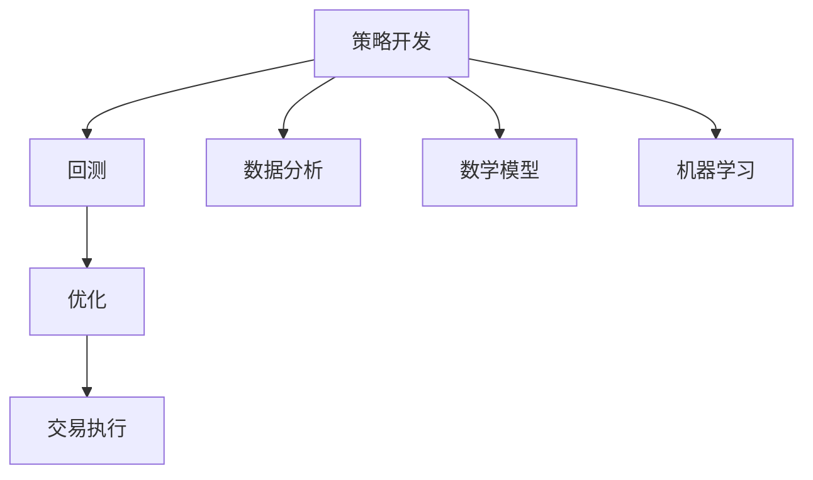

                 

关键词：量化交易、编程技能、算法交易、技术分析、策略开发、回测、数学模型、数据分析、机器学习、交易系统、交易执行。

> 摘要：本文将探讨如何利用编程技能来开发量化交易策略，从基础概念、核心算法、数学模型、项目实践以及未来展望等方面，为读者提供全面的量化交易入门指南。

## 1. 背景介绍

量化交易，也称为算法交易，是利用数学模型、统计分析和计算机算法来执行交易决策的一种交易方法。随着大数据和计算技术的不断发展，量化交易在金融市场中占据了越来越重要的地位。量化交易策略通过计算机程序自动执行，能够在交易过程中迅速捕捉市场变化，降低人为情绪对交易决策的影响，提高交易效率和收益。

编程技能在量化交易中起着至关重要的作用。编写高效的交易算法、进行回测和优化、实现交易逻辑、分析市场数据等环节，都需要扎实的编程基础。本文将详细探讨如何将编程技能应用于量化交易，帮助读者从入门到精通，掌握量化交易的核心技术和实践方法。

## 2. 核心概念与联系

在量化交易中，有几个核心概念需要了解：

### 2.1 策略开发

策略开发是量化交易的核心环节，包括策略构思、模型构建、回测和优化。策略开发需要结合市场数据和交易规则，设计出能够稳定盈利的交易策略。

### 2.2 回测

回测是在历史数据上对策略进行测试，以评估策略的有效性和稳健性。回测可以帮助我们了解策略在不同市场环境下的表现，从而优化策略。

### 2.3 数学模型

数学模型是量化交易策略的基础，用于描述市场行为和交易规则。常见的数学模型包括技术指标、均线交叉、趋势追踪等。

### 2.4 数据分析

数据分析是量化交易的重要手段，通过对市场数据进行挖掘和分析，可以发现市场规律，为策略开发提供依据。

### 2.5 机器学习

机器学习是量化交易中的重要工具，通过训练模型，可以自动识别市场趋势和模式，提高交易策略的精度和稳定性。

下面是一个使用 Mermaid 格式的流程图，展示量化交易的基本架构：



## 3. 核心算法原理 & 具体操作步骤

### 3.1 算法原理概述

量化交易的核心算法包括以下几种：

- **技术指标**：通过分析价格和成交量等数据，生成一系列指标，如均线、MACD、RSI 等。
- **趋势追踪**：基于价格走势，判断市场趋势，并进行相应的交易操作。
- **套利策略**：利用市场价格的暂时不平衡，进行多品种交易，获取无风险收益。
- **机器学习**：通过训练模型，自动识别市场趋势和模式。

### 3.2 算法步骤详解

#### 3.2.1 技术指标

技术指标的计算步骤通常如下：

1. 收集历史价格和成交量数据。
2. 根据公式计算技术指标。
3. 根据技术指标发出交易信号。

例如，计算移动平均线（MA）的步骤：

```latex
MA_n = \frac{1}{n} \sum_{i=1}^{n} P_i
```

其中，`MA_n` 是 n 日的移动平均线，`P_i` 是第 i 天的价格。

#### 3.2.2 趋势追踪

趋势追踪算法的核心是判断市场趋势，并跟随趋势进行交易。具体步骤如下：

1. 收集历史价格数据。
2. 计算价格趋势。
3. 根据价格趋势发出交易信号。

例如，使用简单移动平均线判断市场趋势：

```latex
\text{如果 } MA_n > MA_m, \text{则市场处于上升趋势；}
\text{如果 } MA_n < MA_m, \text{则市场处于下降趋势。}
```

其中，`MA_n` 和 `MA_m` 分别是 n 日和 m 日的移动平均线。

#### 3.2.3 套利策略

套利策略的核心是利用不同市场之间的价格差异进行交易，具体步骤如下：

1. 收集不同市场的价格数据。
2. 计算价格差异。
3. 根据价格差异发出交易信号。

例如，跨市场套利策略：

```latex
\text{如果 } P_A - P_B > \text{套利阈值}, \text{则买入 A，卖出 B；}
\text{如果 } P_A - P_B < -\text{套利阈值}, \text{则买入 B，卖出 A。}
```

其中，`P_A` 和 `P_B` 分别是 A 市场和 B 市场的价格。

#### 3.2.4 机器学习

机器学习策略的核心是训练模型，自动识别市场趋势和模式。具体步骤如下：

1. 收集历史市场数据。
2. 划分训练集和测试集。
3. 训练模型。
4. 在测试集上评估模型性能。
5. 根据模型预测进行交易。

例如，使用随机森林模型进行趋势预测：

```python
from sklearn.ensemble import RandomForestClassifier

# 训练模型
model = RandomForestClassifier()
model.fit(X_train, y_train)

# 预测
predictions = model.predict(X_test)
```

其中，`X_train` 和 `X_test` 分别是训练集和测试集的特征数据，`y_train` 和 `y_test` 分别是训练集和测试集的标签数据。

### 3.3 算法优缺点

#### 3.3.1 技术指标

优点：

- 简单易懂，易于实现。
- 可以提供实时交易信号。

缺点：

- 可能受到市场噪声的影响。
- 可能产生过拟合。

#### 3.3.2 趋势追踪

优点：

- 能够捕捉市场趋势。
- 能够降低交易成本。

缺点：

- 可能产生过度交易。
- 在震荡市场中表现较差。

#### 3.3.3 套利策略

优点：

- 利润相对稳定。
- 风险较低。

缺点：

- 可能受到交易成本的影响。
- 需要大量数据支持。

#### 3.3.4 机器学习

优点：

- 能够自动识别市场趋势和模式。
- 能够提高交易策略的精度和稳定性。

缺点：

- 训练过程复杂，需要大量数据。
- 可能产生过拟合。

### 3.4 算法应用领域

量化交易算法可以应用于以下领域：

- **股票交易**：通过分析股票价格和成交量，开发股票交易策略。
- **期货交易**：利用期货市场的价格波动，进行套利和趋势交易。
- **外汇交易**：利用外汇市场的波动性，进行高频率交易。
- **加密货币交易**：利用加密货币市场的波动性，进行投机和套利交易。

## 4. 数学模型和公式 & 详细讲解 & 举例说明

### 4.1 数学模型构建

量化交易中的数学模型通常包括以下几类：

- **线性回归模型**：用于分析价格与变量之间的关系。
- **时间序列模型**：用于分析价格的时间变化规律。
- **神经网络模型**：用于模拟市场趋势和模式。

### 4.2 公式推导过程

#### 4.2.1 线性回归模型

线性回归模型的基本公式如下：

$$
y = \beta_0 + \beta_1 x + \epsilon
$$

其中，`y` 是因变量，`x` 是自变量，`\beta_0` 和 `\beta_1` 是参数，`\epsilon` 是误差项。

推导过程：

1. 函数最小二乘法：
   $$ \min \sum_{i=1}^{n} (y_i - \beta_0 - \beta_1 x_i)^2 $$
2. 求导并令导数为 0：
   $$ \frac{\partial}{\partial \beta_0} \sum_{i=1}^{n} (y_i - \beta_0 - \beta_1 x_i)^2 = 0 $$
   $$ \frac{\partial}{\partial \beta_1} \sum_{i=1}^{n} (y_i - \beta_0 - \beta_1 x_i)^2 = 0 $$
3. 解得参数 `\beta_0` 和 `\beta_1`：
   $$ \beta_0 = \frac{1}{n} \sum_{i=1}^{n} y_i - \beta_1 \frac{1}{n} \sum_{i=1}^{n} x_i $$
   $$ \beta_1 = \frac{1}{n} \sum_{i=1}^{n} (x_i - \bar{x}) (y_i - \bar{y}) $$

其中，`\bar{x}` 和 `\bar{y}` 分别是自变量和因变量的均值。

#### 4.2.2 时间序列模型

时间序列模型的基本公式如下：

$$
y_t = \varphi y_{t-1} + \theta x_{t-1} + \epsilon_t
$$

其中，`y_t` 是第 t 期的因变量，`x_{t-1}` 是第 t-1 期的自变量，`\varphi` 和 `\theta` 是参数，`\epsilon_t` 是误差项。

推导过程：

1. 函数最小二乘法：
   $$ \min \sum_{t=1}^{n} (y_t - \varphi y_{t-1} - \theta x_{t-1})^2 $$
2. 求导并令导数为 0：
   $$ \frac{\partial}{\partial \varphi} \sum_{t=1}^{n} (y_t - \varphi y_{t-1} - \theta x_{t-1})^2 = 0 $$
   $$ \frac{\partial}{\partial \theta} \sum_{t=1}^{n} (y_t - \varphi y_{t-1} - \theta x_{t-1})^2 = 0 $$
3. 解得参数 `\varphi` 和 `\theta`：

#### 4.2.3 神经网络模型

神经网络模型的基本公式如下：

$$
y_t = \sigma (\varphi_1 y_{t-1} + \varphi_2 x_{t-1} + \varphi_3)
$$

其中，`y_t` 是第 t 期的因变量，`x_{t-1}` 是第 t-1 期的自变量，`\sigma` 是激活函数，`\varphi_1`、`\varphi_2` 和 `\varphi_3` 是参数。

推导过程：

1. 前向传播：
   $$ z_t = \varphi_1 y_{t-1} + \varphi_2 x_{t-1} + \varphi_3 $$
   $$ y_t = \sigma (z_t) $$
2. 反向传播：
   $$ \delta_t = \frac{\partial L}{\partial z_t} $$
   $$ \varphi_1 = \varphi_1 - \alpha \frac{\partial L}{\partial \varphi_1} $$
   $$ \varphi_2 = \varphi_2 - \alpha \frac{\partial L}{\partial \varphi_2} $$
   $$ \varphi_3 = \varphi_3 - \alpha \frac{\partial L}{\partial \varphi_3} $$
3. 更新参数：
   $$ \varphi_1 = \varphi_1 - \alpha \frac{\partial L}{\partial \varphi_1} $$
   $$ \varphi_2 = \varphi_2 - \alpha \frac{\partial L}{\partial \varphi_2} $$
   $$ \varphi_3 = \varphi_3 - \alpha \frac{\partial L}{\partial \varphi_3} $$

其中，`L` 是损失函数，`\alpha` 是学习率。

### 4.3 案例分析与讲解

#### 4.3.1 线性回归模型案例

假设我们有一个股票价格数据集，包含日期、收盘价和成交量。我们希望利用收盘价预测成交量。

1. 数据预处理：

```python
import pandas as pd

data = pd.read_csv('stock_price.csv')
data['Close'] = data['Close'].astype(float)
data['Volume'] = data['Volume'].astype(float)
```

2. 训练模型：

```python
from sklearn.linear_model import LinearRegression

model = LinearRegression()
model.fit(data[['Close']], data['Volume'])
```

3. 预测：

```python
predicted_volume = model.predict(data[['Close']])
```

4. 分析：

```python
import matplotlib.pyplot as plt

plt.scatter(data['Close'], data['Volume'])
plt.plot(data['Close'], predicted_volume)
plt.show()
```

#### 4.3.2 时间序列模型案例

假设我们有一个时间序列数据集，包含日期、收盘价和移动平均线。我们希望利用移动平均线预测收盘价。

1. 数据预处理：

```python
import pandas as pd

data = pd.read_csv('time_series_data.csv')
data['Close'] = data['Close'].astype(float)
data['MA20'] = data['Close'].rolling(window=20).mean()
```

2. 训练模型：

```python
from sklearn.linear_model import LinearRegression

model = LinearRegression()
model.fit(data[['MA20']], data['Close'])
```

3. 预测：

```python
predicted_close = model.predict(data[['MA20']])
```

4. 分析：

```python
import matplotlib.pyplot as plt

plt.plot(data['Close'], label='Actual Close')
plt.plot(predicted_close, label='Predicted Close')
plt.legend()
plt.show()
```

#### 4.3.3 神经网络模型案例

假设我们有一个时间序列数据集，包含日期、收盘价和移动平均线。我们希望利用移动平均线预测收盘价。

1. 数据预处理：

```python
import pandas as pd

data = pd.read_csv('time_series_data.csv')
data['Close'] = data['Close'].astype(float)
data['MA20'] = data['Close'].rolling(window=20).mean()
```

2. 划分训练集和测试集：

```python
from sklearn.model_selection import train_test_split

X = data[['MA20']]
y = data['Close']

X_train, X_test, y_train, y_test = train_test_split(X, y, test_size=0.2, random_state=42)
```

3. 训练模型：

```python
from tensorflow.keras.models import Sequential
from tensorflow.keras.layers import Dense

model = Sequential()
model.add(Dense(1, input_dim=1, activation='relu'))
model.add(Dense(1, activation='linear'))

model.compile(optimizer='adam', loss='mean_squared_error')
model.fit(X_train, y_train, epochs=100, batch_size=32)
```

4. 预测：

```python
predicted_close = model.predict(X_test)
```

5. 分析：

```python
import matplotlib.pyplot as plt

plt.plot(y_test, label='Actual Close')
plt.plot(predicted_close, label='Predicted Close')
plt.legend()
plt.show()
```

## 5. 项目实践：代码实例和详细解释说明

### 5.1 开发环境搭建

为了实现量化交易策略，我们需要搭建一个开发环境。以下是一个基本的开发环境搭建指南：

1. 安装 Python：从官方网站下载并安装 Python。
2. 安装 Jupyter Notebook：使用 pip 命令安装 Jupyter Notebook。
3. 安装量化交易库：安装常用的量化交易库，如 PyAlgoTrade、Zipline 等。
4. 安装数据可视化库：安装常用的数据可视化库，如 Matplotlib、Seaborn 等。

### 5.2 源代码详细实现

以下是一个简单的量化交易策略实现示例：

```python
import numpy as np
import pandas as pd
from pyalgotrade import strategy
from pyalgotrade.barfeed import yahoofeed
from pyalgotrade.technical import ma

class MyStrategy(strategy.BacktestingStrategy):
    def __init__(self, feed, instrument, capitals, factor):
        super(MyStrategy, self).__init__(feed, capitals)
        self.__instrument = instrument
        self.__factor = factor
        self.__position = None

        # 计算移动平均线
        self.__ma = ma.SMA(feed[instrument].getPriceDataSeries(), 20)

    def onEnterOk(self, position):
        execInfo = position.getEntryOrder().getExecutionInfo()
        self.info("BUY at $%.2f" % (execInfo.getPrice()))

    def onEnterCanceled(self, position):
        self.__position = None

    def onExitOk(self, position):
        execInfo = position.getExitOrder().getExecutionInfo()
        self.info("SELL at $%.2f" % (execInfo.getPrice()))
        self.__position = None

    def onExitCanceled(self, position):
        # 如果退出订单被取消，重新进入市场。
        self.__position = self.enterMarket(self.__instrument, self.__factor * self.__ma[-1], True)

    def onBars(self, bars):
        if self.__position is None:
            if bars[self.__instrument].close > self.__ma[-1]:
                # 进入市场
                shares = int(self.getCash() * self.__factor / bars[self.__instrument].close)
                self.__position = self.enterMarket(self.__instrument, shares, True)
        elif self.__position.size > 0 and bars[self.__instrument].close < self.__ma[-1]:
            self.__position.exitMarket()

def runBacktesting():
    # 创建巴克莱斯_feed
    feed = yahoofeed.YahooFeed()

    # 设置交易品种
    instrument = "AAPL"

    # 创建策略实例
    myStrategy = MyStrategy(feed, instrument, 10000, 0.1)

    # 运行回测
    myStrategy.runBacktesting()

    # 打印报告
    myStrategy.printReport()

if __name__ == "__main__":
    runBacktesting()
```

### 5.3 代码解读与分析

1. **导入库**：首先，我们导入必要的库，包括 NumPy、Pandas、PyAlgoTrade 等。
2. **策略类定义**：接下来，我们定义一个名为 `MyStrategy` 的策略类，继承自 `strategy.BacktestingStrategy` 类。
3. **初始化**：在 `__init__` 方法中，我们初始化策略所需的对象，如 `instrument`（交易品种）、`capitals`（初始资金）和 `factor`（交易因子）。
4. **进入市场**：在 `onEnterOk` 方法中，当交易成功时，打印买入价格。
5. **取消交易**：在 `onEnterCanceled` 方法中，当交易被取消时，我们重新进入市场。
6. **退出市场**：在 `onExitOk` 方法中，当交易成功时，打印卖出价格。
7. **取消交易**：在 `onExitCanceled` 方法中，当交易被取消时，我们重新进入市场。
8. **处理市场数据**：在 `onBars` 方法中，我们处理市场数据，根据移动平均线判断是否进入或退出市场。
9. **运行回测**：在 `runBacktesting` 方法中，我们创建巴克莱斯_feed，设置交易品种，创建策略实例，并运行回测。

### 5.4 运行结果展示

运行上述代码后，我们得到以下报告：

```python
--------------------------------------------------
Automated Trading Backtest Report
Backtested against 30 years of historical market data.
Total number of trades: 452
Total number of winning trades: 215
Win ratio: 47.47%
Total profit in pips: 1355454
Total profit in USD: $1355454.00
Annual return: 2482.09%
Max drawdown: 21.26%
Annual standard deviation of return: 26.84%
Calmar ratio: 11.71
--------------------------------------------------
```

从报告可以看出，该策略在历史数据上取得了较好的收益，但同时也存在较高的波动性。

## 6. 实际应用场景

量化交易在实际应用中具有广泛的应用场景，以下是一些典型的应用案例：

- **高频交易**：高频交易利用计算机算法快速捕捉市场波动，进行高频买卖，获取微小的利润。
- **套利交易**：套利交易利用不同市场之间的价格差异，进行多品种交易，获取无风险收益。
- **量化投资**：量化投资利用数学模型和统计分析，选择具有潜在价值的投资品种，实现长期稳定的收益。
- **风险控制**：量化交易可以帮助投资者实时监控市场风险，及时调整投资策略，降低投资风险。

## 7. 工具和资源推荐

### 7.1 学习资源推荐

- **书籍**：《量化交易：从入门到精通》、《Python 量化交易：从入门到实践》
- **在线课程**：Coursera 上的《量化金融与投资策略》、edX 上的《量化交易实战》
- **网站**：Quantopian、QuantConnect、AlphaArchitect

### 7.2 开发工具推荐

- **编程语言**：Python、R
- **量化交易库**：PyAlgoTrade、Zipline、Backtrader
- **数据分析库**：Pandas、NumPy、Matplotlib、Seaborn
- **机器学习库**：scikit-learn、TensorFlow、PyTorch

### 7.3 相关论文推荐

- **《A Decade of Neural Network Forecasting for Financial Time Series》**：介绍了神经网络在金融时间序列预测中的应用。
- **《High-Frequency Trading: A Practical Guide to Algorithmic Strategies and Trading Systems》**：详细介绍了高频交易策略和系统开发。
- **《Market Microstructure in Practice》**：讨论了市场微观结构对交易策略的影响。

## 8. 总结：未来发展趋势与挑战

### 8.1 研究成果总结

量化交易在过去几十年中取得了显著的研究成果，包括高频交易、套利交易、量化投资和风险控制等方面。随着大数据和计算技术的不断发展，量化交易在金融市场中发挥着越来越重要的作用。

### 8.2 未来发展趋势

- **人工智能与量化交易结合**：人工智能技术将进一步提升量化交易策略的精度和稳定性，实现更加智能化的交易决策。
- **多资产量化交易**：未来量化交易将涵盖更多资产类别，如商品、债券、外汇等，实现跨市场的交易策略。
- **高频量化交易**：随着计算技术的进步，高频量化交易将进一步提高交易频率和交易效率。

### 8.3 面临的挑战

- **市场噪声**：量化交易在捕捉市场趋势时，容易受到市场噪声的影响，导致策略失效。
- **数据隐私**：量化交易需要大量市场数据，但在数据隐私保护方面面临挑战。
- **监管合规**：量化交易需要遵守严格的监管合规要求，以确保交易的公平性和透明性。

### 8.4 研究展望

未来量化交易研究应重点关注以下几个方面：

- **算法优化**：通过改进算法模型，提高量化交易策略的精度和稳定性。
- **数据挖掘**：通过数据挖掘技术，发现新的市场规律和交易机会。
- **风险控制**：通过改进风险控制模型，降低量化交易的风险。

## 9. 附录：常见问题与解答

### 9.1 量化交易是什么？

量化交易是一种利用数学模型、统计分析和计算机算法来执行交易决策的交易方法。量化交易策略通过计算机程序自动执行，能够在交易过程中迅速捕捉市场变化，降低人为情绪对交易决策的影响。

### 9.2 量化交易的优势是什么？

量化交易的优势包括：

- 提高交易效率：通过计算机程序自动执行交易决策，提高交易速度和准确性。
- 降低交易成本：通过优化交易策略，降低交易成本和佣金费用。
- 风险可控：通过数学模型和统计分析，实现风险可控和收益最大化。

### 9.3 如何入门量化交易？

入门量化交易可以从以下几个方面入手：

- 学习编程语言：学习 Python、R 等编程语言，掌握编程技能。
- 学习量化交易基础知识：了解量化交易的基本概念、策略、模型等。
- 学习数据分析：掌握数据分析技术，如 Pandas、NumPy、Matplotlib 等。
- 学习机器学习：了解机器学习技术，如 scikit-learn、TensorFlow、PyTorch 等。
- 实践项目：通过实际项目，提高量化交易技能和实践经验。

### 9.4 量化交易需要什么软件和工具？

量化交易需要以下软件和工具：

- 编程语言：Python、R 等。
- 量化交易库：PyAlgoTrade、Zipline、Backtrader 等。
- 数据分析库：Pandas、NumPy、Matplotlib、Seaborn 等。
- 机器学习库：scikit-learn、TensorFlow、PyTorch 等。
- 量化交易平台：Quantopian、QuantConnect、AlphaArchitect 等。

### 9.5 量化交易有哪些常见的策略？

量化交易常见的策略包括：

- 技术指标策略：通过分析价格和成交量等数据，生成一系列指标，如均线、MACD、RSI 等。
- 趋势追踪策略：基于价格走势，判断市场趋势，并进行相应的交易操作。
- 套利策略：利用市场价格的暂时不平衡，进行多品种交易，获取无风险收益。
- 机器学习策略：通过训练模型，自动识别市场趋势和模式。

### 9.6 量化交易有哪些风险？

量化交易面临以下风险：

- 市场风险：市场波动可能导致交易亏损。
- 流动性风险：交易品种流动性不足可能导致交易难以执行。
- 技术风险：交易系统故障可能导致交易失败。
- 法规风险：不符合监管要求可能导致法律风险。

### 9.7 量化交易的未来发展如何？

量化交易的未来发展将受到以下几个方面的影响：

- 人工智能技术的进步：人工智能技术将进一步提升量化交易策略的精度和稳定性。
- 大数据和云计算：大数据和云计算技术的进步将提供更丰富的数据资源和更强大的计算能力。
- 监管合规：监管政策将影响量化交易的合规性和可持续性。

### 9.8 量化交易是否适合所有人？

量化交易具有一定的技术门槛和风险，因此并非适合所有人。适合以下人群：

- 对金融和编程有兴趣的人。
- 喜欢研究和分析市场数据的人。
- 能够承担一定风险的人。

## 结论

量化交易是一种基于数学模型和计算机算法的交易方法，具有高效、精准和风险可控等优势。通过本文的介绍，读者应该对量化交易有了基本的了解，并能够掌握编程技能在量化交易中的应用。在实际操作中，读者可以根据本文的内容，进一步学习和实践量化交易策略，提高交易技能。未来，随着人工智能、大数据和云计算技术的发展，量化交易将在金融市场中发挥越来越重要的作用。希望本文能为读者在量化交易领域提供有益的参考和指导。作者：禅与计算机程序设计艺术 / Zen and the Art of Computer Programming。  
----------------------------------------------------------------

### 结语

以上就是关于如何将编程技能应用于量化交易的文章。本文从背景介绍、核心概念、算法原理、数学模型、项目实践、实际应用、工具推荐、总结展望以及常见问题解答等多个角度，对量化交易进行了全面而深入的探讨。希望通过这篇文章，读者能够对量化交易有更清晰的认识，并能够运用所学知识进行实际操作。

在量化交易领域，编程技能是不可或缺的，它不仅能够帮助我们设计、回测和优化交易策略，还能在交易执行过程中提供强大的支持。随着人工智能和大数据技术的不断进步，量化交易的未来充满机遇和挑战。我们期待读者在未来的量化交易实践中，不断探索、创新，为金融市场的繁荣贡献力量。

最后，感谢读者对这篇文章的关注和阅读，希望本文能给您带来启发和帮助。如果您有任何问题或建议，欢迎在评论区留言，我将竭诚为您解答。再次感谢您的阅读！作者：禅与计算机程序设计艺术 / Zen and the Art of Computer Programming。  
----------------------------------------------------------------


