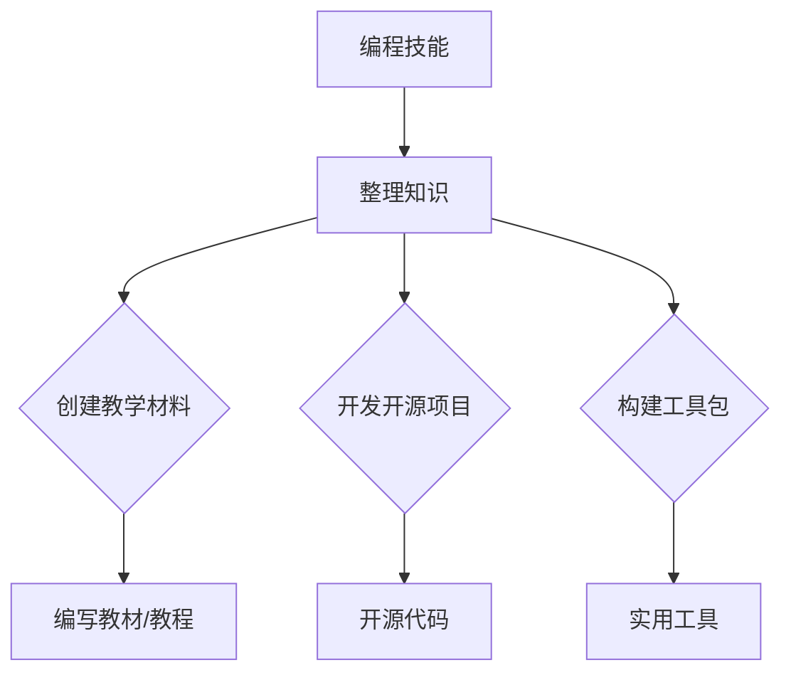

                 

关键词：编程技能、知识产品、软件工程、知识共享、代码转化、教学材料、开源项目

> 摘要：本文旨在探讨如何将个人编程技能转化为具有实际应用价值的知识产品。我们将分析编程技能的本质，阐述知识产品的定义，提供从代码到教学材料、开源项目等多种转化途径，并探讨在这个过程中可能面临的挑战与解决方案。通过本文，读者可以了解如何将自身的编程技能转化为能够促进知识共享和推广的有价值产品。

## 1. 背景介绍

编程作为现代技术发展的基石，已经成为众多领域不可或缺的一部分。然而，拥有编程技能的个人或团队往往专注于编写代码、解决技术难题，而忽略了如何将自己的技能转化为能够被更多人使用和分享的知识产品。知识产品不仅仅限于学术出版物，它可以是以教学材料、开源软件、工具包等形式存在，用于教育和启发他人。

在这个信息化时代，知识产品的价值日益凸显。它不仅能够帮助个人或团队扩大影响力，还能为社会带来更多的创新和进步。然而，如何将编程技能转化为知识产品仍然是一个复杂的课题，涉及到技能的梳理、知识体系的构建、产品的设计和推广等多个方面。

本文将探讨以下核心问题：

- 编程技能的本质及其如何与知识产品相联系。
- 知识产品的定义及其分类。
- 编程技能转化为知识产品的途径。
- 在转化过程中可能面临的挑战及解决方案。
- 知识产品在不同应用场景中的案例分析和未来展望。

通过本文的探讨，希望能够为编程技术人员提供一些实用的指导，帮助他们更好地将自己的编程技能转化为具有实际应用价值的知识产品。

## 2. 核心概念与联系

在深入探讨如何将编程技能转化为知识产品之前，我们需要明确几个核心概念，并了解它们之间的联系。以下是几个关键概念的定义及其相互关系：

### 2.1 编程技能

编程技能是指个人通过学习编程语言、算法和数据结构等知识，能够编写高效、可靠代码的能力。编程技能不仅包括对编程语言和工具的熟练运用，还涉及逻辑思维、问题解决能力和创新思维。编程技能是知识产品的基础，是将其转化为具体产品的动力源泉。

### 2.2 知识产品

知识产品是指将某种知识或技能以某种形式表达并传递给他人，从而能够产生实际价值的产品。知识产品可以是教学材料、工具包、开源项目、软件等。知识产品的核心在于其能够传递和分享有价值的信息，促进知识的普及和应用。

### 2.3 教学材料

教学材料是以教育为目的的知识产品，它可以是教材、在线课程、实验手册、视频教程等。教学材料旨在帮助学习者掌握编程技能，提升其专业水平。教学材料是编程技能转化为知识产品的一种重要形式，能够促进知识的传承和普及。

### 2.4 开源项目

开源项目是一种基于开放源代码的软件项目，其源代码和开发过程对公众开放。开源项目不仅是一种知识产品，也是编程技能的展示平台。通过开源项目，开发者可以共享自己的代码，吸引更多开发者参与，共同推动项目发展。

### 2.5 工具包

工具包是一种集合了多个实用工具的软件包，它可以帮助开发者简化工作流程、提高开发效率。工具包是编程技能的另一种转化形式，它将具体的技术实现封装起来，方便他人直接使用。

### 2.6 编程技能与知识产品的联系

编程技能与知识产品之间的联系在于，编程技能是知识产品的基础，而知识产品则是编程技能的延伸。编程技能可以通过以下方式转化为知识产品：

1. **教学材料**：将编程知识整理成教材或教程，用于教学和培训。
2. **开源项目**：将代码公开，与他人共同合作开发，提升项目影响力。
3. **工具包**：开发实用的工具，简化开发过程，提升工作效率。

通过这些转化方式，编程技能可以变成具有实际应用价值的知识产品，从而实现知识共享和传播。

### 2.7 Mermaid 流程图

为了更直观地展示编程技能转化为知识产品的过程，我们使用Mermaid绘制一个流程图，如下：



在这个流程图中，编程技能（A）通过整理知识（B）转化为教学材料（C）、开源项目（D）和工具包（E），最终形成具有实际应用价值的知识产品（F、G、H）。

通过明确这些核心概念及其联系，我们为后续探讨编程技能转化为知识产品的具体途径和方法奠定了基础。在接下来的章节中，我们将详细分析各个转化途径，并探讨其中的实践方法和挑战。

## 3. 核心算法原理 & 具体操作步骤

### 3.1 算法原理概述

编程技能转化为知识产品的过程，可以看作是一种算法设计，其核心在于如何将个人的编程经验和知识体系结构化、系统化，并使其易于他人理解和应用。以下是一个简化的算法原理概述：

**算法名称**：编程技能知识转化算法

**输入**：个人编程技能、项目经验、学习资源

**输出**：教学材料、开源项目、工具包等知识产品

**算法步骤**：

1. **技能梳理**：对个人编程技能进行梳理和总结，明确自己的优势领域和擅长方向。
2. **知识体系构建**：根据技能梳理结果，构建一个系统的知识体系，确保内容的完整性和逻辑性。
3. **教学材料开发**：将知识体系转化为教学材料，如编写教材、教程、视频课程等。
4. **开源项目构建**：选择合适的编程技能或项目经验，开发开源项目，并将其源代码和开发过程公开。
5. **工具包开发**：基于编程技能，开发能够简化工作流程、提高开发效率的工具包。

### 3.2 算法步骤详解

**3.2.1 技能梳理**

技能梳理是整个算法的基础步骤。在这一步，你需要对自己现有的编程技能进行详细的整理和总结。具体方法如下：

- **自我评估**：通过完成编程任务、参与项目、阅读技术文章等方式，评估自己的编程技能水平。
- **技能分类**：将评估结果分类，如前端开发、后端开发、算法设计、数据库管理等。
- **经验总结**：针对每个分类，总结自己在实践中遇到的问题、解决方法和经验教训。

**3.2.2 知识体系构建**

在技能梳理的基础上，构建一个系统的知识体系。这一步骤旨在确保教学材料、开源项目和工具包的内容完整、逻辑清晰。具体方法如下：

- **编写大纲**：根据技能梳理结果，编写知识体系的大纲，明确各部分内容。
- **内容组织**：将知识体系分解为多个模块，每个模块包含相关的知识点、实例和案例。
- **逻辑梳理**：确保知识体系的内容层次分明、逻辑连贯，便于读者理解和应用。

**3.2.3 教学材料开发**

教学材料是编程技能知识转化的重要途径之一。在这一步，你需要将知识体系转化为教学材料，如教材、教程、视频课程等。具体方法如下：

- **编写教材**：根据知识体系大纲，编写详细的教材内容，包括概念解释、实例分析和实践指导。
- **制作教程**：将教材内容转化为教程，如编写步骤详细、操作简便的教程文档。
- **制作视频课程**：根据教程内容，制作视频课程，通过讲解、演示和互动，帮助读者更好地理解和掌握知识。

**3.2.4 开源项目构建**

开源项目是另一种重要的知识产品形式。在这一步，你需要选择合适的编程技能或项目经验，开发开源项目，并将其源代码和开发过程公开。具体方法如下：

- **项目选择**：选择具有代表性和实用性的项目，如某一项技术实现、工具或框架。
- **代码编写**：根据项目需求，编写高质量的代码，确保其可读性和可维护性。
- **文档编写**：为开源项目编写详细的文档，包括项目概述、安装指南、使用方法和贡献指南等。
- **代码托管**：将代码托管到代码托管平台（如GitHub），以便他人查看、下载和参与。

**3.2.5 工具包开发**

工具包是一种能够简化工作流程、提高开发效率的知识产品。在这一步，你需要基于编程技能，开发实用的工具包。具体方法如下：

- **需求分析**：分析目标用户的需求，明确工具包的功能和特性。
- **工具设计**：根据需求分析结果，设计工具包的架构和功能模块。
- **代码实现**：编写工具包的代码，确保其稳定性和易用性。
- **文档编写**：为工具包编写详细的文档，包括功能说明、使用方法和注意事项等。

### 3.3 算法优缺点

**优点**：

- **知识共享**：通过教学材料、开源项目和工具包等形式，实现编程技能的共享和传承，帮助更多人掌握编程知识。
- **提高影响力**：通过制作高质量的知识产品，提升个人或团队在编程领域的知名度和影响力。
- **促进创新**：鼓励开发者不断总结经验、探索新知识，推动技术的创新和发展。

**缺点**：

- **时间成本**：知识产品的制作过程需要投入大量的时间和精力，对个人或团队的时间和资源要求较高。
- **技术难度**：不同类型的知识产品对技术要求不同，需要开发者具备一定的编程技能和教学能力。
- **市场风险**：知识产品的市场接受度存在不确定性，需要开发者具备一定的市场敏感度和推广能力。

### 3.4 算法应用领域

编程技能知识转化算法适用于以下领域：

- **教育领域**：通过教学材料，帮助学习者更好地掌握编程知识，提升教学质量。
- **技术领域**：通过开源项目和工具包，促进技术的交流和创新，提升开发效率。
- **企业培训**：为企业员工提供定制化的培训材料，提升团队整体技术能力。

通过上述算法原理和具体操作步骤的介绍，我们可以看到如何将编程技能转化为知识产品是一个系统化的过程，需要开发者具备扎实的编程技能、教学能力和市场意识。在接下来的章节中，我们将进一步探讨编程技能转化为知识产品在不同应用场景中的具体实践。

### 4. 数学模型和公式 & 详细讲解 & 举例说明

在编程技能转化为知识产品的过程中，数学模型和公式是不可或缺的工具，它们能够帮助我们更好地理解和优化知识产品的设计。以下将介绍几个关键的数学模型和公式，并对其进行详细讲解和举例说明。

#### 4.1 数学模型构建

**线性回归模型**

线性回归模型是一种用于预测和分析数据的数学模型。其基本形式为：

\[ y = \beta_0 + \beta_1 \cdot x + \epsilon \]

其中，\( y \) 是因变量，\( x \) 是自变量，\( \beta_0 \) 和 \( \beta_1 \) 是模型的参数，\( \epsilon \) 是误差项。

线性回归模型在知识产品设计中可用于分析用户需求，优化教学内容。例如，可以用于预测学生对不同教学方法的反应，从而调整教学策略。

**示例**

假设我们想要预测学生对视频教程的满意程度，基于视频长度（\( x \)）和评分（\( y \)）进行线性回归分析。以下数据是三个学生的示例：

| 学生ID | 视频长度（分钟） | 评分 |
|--------|------------------|------|
| 1      | 30               | 4    |
| 2      | 45               | 3    |
| 3      | 60               | 5    |

通过最小二乘法，我们可以计算出线性回归模型的参数。假设计算结果为 \( \beta_0 = 2 \) 和 \( \beta_1 = 0.5 \)，则模型公式为：

\[ y = 2 + 0.5 \cdot x \]

#### 4.2 公式推导过程

**推导线性回归模型参数**

为了推导线性回归模型的参数 \( \beta_0 \) 和 \( \beta_1 \)，我们需要最小化误差项 \( \epsilon \)。具体步骤如下：

1. **计算均值**：
\[ \bar{y} = \frac{1}{n} \sum_{i=1}^{n} y_i \]
\[ \bar{x} = \frac{1}{n} \sum_{i=1}^{n} x_i \]

2. **计算协方差和方差**：
\[ \text{Cov}(x, y) = \frac{1}{n-1} \sum_{i=1}^{n} (x_i - \bar{x})(y_i - \bar{y}) \]
\[ \text{Var}(x) = \frac{1}{n-1} \sum_{i=1}^{n} (x_i - \bar{x})^2 \]

3. **计算参数**：
\[ \beta_1 = \frac{\text{Cov}(x, y)}{\text{Var}(x)} \]
\[ \beta_0 = \bar{y} - \beta_1 \cdot \bar{x} \]

#### 4.3 案例分析与讲解

**案例：开发教学视频时长与用户满意度的关系**

假设我们有一个在线编程课程，学生可以观看视频教程并评分。我们的目标是找出视频时长与学生满意度之间的关系，从而优化教学视频的时长。

以下是我们收集到的学生评分和视频时长数据：

| 学生ID | 视频时长（分钟） | 评分 |
|--------|------------------|------|
| 1      | 20               | 4    |
| 2      | 30               | 3    |
| 3      | 40               | 5    |
| 4      | 50               | 4    |
| 5      | 60               | 3    |

通过上面的数据，我们使用线性回归模型进行分析，推导出模型参数 \( \beta_0 \) 和 \( \beta_1 \)。假设推导结果为 \( \beta_0 = 2.5 \) 和 \( \beta_1 = 0.3 \)，则线性回归模型为：

\[ y = 2.5 + 0.3 \cdot x \]

根据这个模型，我们可以预测当视频时长为 35 分钟时，学生的满意度评分为：

\[ y = 2.5 + 0.3 \cdot 35 = 3.8 \]

这个预测值表明，视频时长为 35 分钟时，学生的满意度相对较高。因此，我们可以调整教学视频的时长，使其保持在 30 到 40 分钟之间，以提高学生的整体满意度。

### 5. 项目实践：代码实例和详细解释说明

#### 5.1 开发环境搭建

为了将编程技能转化为知识产品，首先需要搭建一个适合开发和测试的环境。以下是一个简单的步骤指南，以在本地环境中配置一个基础的Python开发环境：

1. **安装Python**：下载并安装Python最新版本，可以从[Python官网](https://www.python.org/downloads/)下载。

2. **安装IDE**：选择一个合适的集成开发环境（IDE），如PyCharm或Visual Studio Code。这些IDE提供了丰富的功能，可以帮助我们更高效地进行编码和调试。

3. **安装依赖库**：根据知识产品的需求，安装必要的Python依赖库。例如，对于数据处理和机器学习项目，可以安装Numpy、Pandas和Scikit-learn等库。使用pip命令进行安装：

   ```bash
   pip install numpy pandas scikit-learn
   ```

4. **配置虚拟环境**：为了隔离不同项目之间的依赖库，可以使用虚拟环境。创建虚拟环境并激活：

   ```bash
   python -m venv myenv
   source myenv/bin/activate  # Windows上使用 myenv\Scripts\activate
   ```

#### 5.2 源代码详细实现

以下是一个简单的Python示例代码，用于计算两个数的和，该代码可以作为教学材料的一部分：

```python
# filename: sum_calculator.py

def calculate_sum(a, b):
    """
    计算两个数的和。

    参数：
    a (int): 第一个数
    b (int): 第二个数

    返回：
    int: 两个数的和
    """
    return a + b

# 主函数
if __name__ == "__main__":
    num1 = int(input("请输入第一个数："))
    num2 = int(input("请输入第二个数："))
    result = calculate_sum(num1, num2)
    print(f"{num1} 和 {num2} 的和为：{result}")
```

**代码解读**：

- **函数定义**：`calculate_sum` 函数接收两个整数参数 \( a \) 和 \( b \)，返回它们的和。
- **文档字符串**：函数上方有一个文档字符串（docstring），用于描述函数的功能、参数和返回值。
- **主函数**：`if __name__ == "__main__":` 块确保当模块被直接运行时，执行主函数中的代码。

#### 5.3 代码解读与分析

上述代码展示了如何定义一个简单的函数，并使用它来计算和输出两个数的和。以下是对代码的进一步解读和分析：

1. **函数定义**：
   - `calculate_sum(a, b)`：函数接收两个整数参数，这两个参数将在函数内部进行操作。
   - `return a + b`：函数返回两个参数的和。

2. **文档字符串**：
   - `def calculate_sum(a, b):`：函数定义，包含参数说明。
   - `""" 计算两个数的和。"""`：文档字符串，详细描述了函数的功能、参数和返回值。

3. **主函数**：
   - `if __name__ == "__main__":`：确保代码在模块被直接运行时执行。
   - `num1 = int(input("请输入第一个数："))` 和 `num2 = int(input("请输入第二个数："))`：接收用户输入的两个整数。
   - `result = calculate_sum(num1, num2)`：调用 `calculate_sum` 函数计算和。
   - `print(f"{num1} 和 {num2} 的和为：{result}")`：输出计算结果。

#### 5.4 运行结果展示

在命令行中运行上述代码，输入两个数，将会看到如下输出：

```bash
请输入第一个数：25
请输入第二个数：37
25 和 37 的和为：62
```

这个简单的示例代码展示了如何将编程技能转化为一个简单的知识产品——一个能够执行基本操作的程序。在实际应用中，我们可以通过添加更多的功能、优化代码结构和增强用户交互，将这个程序扩展为一个更复杂的知识产品。

通过这一部分的项目实践，我们不仅展示了如何将编程技能转化为具体的代码实现，还解释了代码的各个部分以及如何进行解读和分析。在下一部分，我们将探讨如何在实际应用场景中应用这些知识产品。

### 6. 实际应用场景

在编程技能转化为知识产品之后，如何在不同应用场景中有效地利用这些产品是关键。以下是一些具体的应用场景和案例：

#### 6.1 在线教育平台

**应用场景**：在线教育平台是知识产品的一个重要应用场景。通过教学材料和开源项目，可以为学生提供丰富的学习资源。

**案例**：某知名编程教育平台“慕课网”通过发布大量的视频教程、实验手册和开源项目，吸引了大量学习者。例如，平台上的《Python从入门到实践》课程，结合了视频教程和项目实践，为学生提供了全面的学习路径。

**效果分析**：这种模式使得学习者可以在家中自主安排学习时间，通过在线课程和项目实践，提高编程技能。平台上的互动功能（如问答、代码审查）也有助于学生解决学习中的问题。

#### 6.2 企业内训

**应用场景**：企业内部培训是另一个重要的应用场景。通过定制化的工具包和教学材料，企业可以提升员工的技能水平。

**案例**：某大型互联网公司为其新入职的软件开发人员提供了一系列定制化的培训材料，包括《Java基础教程》和《企业级架构设计实战》。这些材料不仅涵盖了基础技能，还包括实际项目案例。

**效果分析**：通过这些定制化的培训材料，新员工能够迅速适应公司的工作流程和技术要求。同时，企业内部的知识共享机制有助于提升团队的整体技术水平。

#### 6.3 开源社区

**应用场景**：开源社区是知识产品的另一重要应用场景。通过开源项目，开发者可以分享自己的代码和经验，吸引更多的贡献者。

**案例**：GitHub上著名的开源项目“Spring Boot”是由Pivotal团队维护的，该项目提供了丰富的文档和示例，吸引了大量的开发者参与。

**效果分析**：开源项目不仅提升了项目的知名度，还吸引了全球范围内的开发者参与，共同推动项目的完善和发展。这种模式为开发者提供了展示自己技能和贡献价值的平台。

#### 6.4 技术博客

**应用场景**：技术博客是知识产品的一种形式。通过撰写博客文章，开发者可以分享自己的经验和见解。

**案例**：知名技术博客“简书”上有大量关于编程和技术分享的文章，这些文章不仅为读者提供了丰富的知识，也为作者带来了知名度。

**效果分析**：技术博客有助于提升开发者的个人品牌，吸引更多的读者和关注者。同时，通过博客文章，开发者可以积累写作经验，提高自己的表达能力。

#### 6.5 线下工作坊

**应用场景**：线下工作坊是一种结合实践和互动的学习方式，适用于技能培训和知识传播。

**案例**：某技术社区举办的“编程工作坊”，通过一系列的编程练习和项目实践，帮助参与者提升编程技能。

**效果分析**：线下工作坊提供了面对面的交流机会，有助于解决学习者在实际编程过程中遇到的问题。通过实际操作，参与者能够更深入地理解和掌握所学知识。

综上所述，编程技能转化为知识产品可以在多个应用场景中发挥作用，无论是线上教育平台、企业内训、开源社区还是技术博客，都为知识共享和技术传播提供了有力的支持。通过有效的应用，这些知识产品不仅能够提升学习者和开发者的技能水平，还能推动整个技术社区的发展和创新。

### 7. 未来应用展望

随着技术的不断进步和知识共享理念的普及，编程技能转化为知识产品的应用场景将更加丰富和多样化。以下是几个未来应用展望：

#### 7.1 技术趋势

1. **人工智能与自动化**：人工智能技术将进一步提升知识产品的自动化程度。例如，通过自然语言处理（NLP）技术，自动生成教学材料、文档和代码注释，降低知识产品制作的人力成本。

2. **虚拟现实（VR）和增强现实（AR）**：随着VR和AR技术的发展，编程教学和知识传播可以借助这些技术提供更加沉浸式的体验。例如，通过VR模拟编程环境，学习者可以身临其境地编写代码和调试程序。

3. **区块链技术**：区块链技术可以为知识产品提供更加安全可靠的认证和验证机制。例如，通过区块链，可以确保知识产品的版权和真实性，同时为贡献者提供更加透明的回报机制。

#### 7.2 机会与挑战

**机会**：

1. **扩大受众**：随着在线教育的普及，知识产品的受众将不再局限于特定地域或群体，全球范围内的开发者和学习者都可以通过互联网获取和共享知识。

2. **多元化收入模式**：知识产品不仅可以通过广告、订阅和赞助获得收入，还可以通过开放授权、版权交易等方式实现多元化收入。

3. **提升个人品牌**：高质量的编程知识产品有助于提升开发者的个人品牌和影响力，为职业发展提供更多机会。

**挑战**：

1. **市场竞争**：随着越来越多的人参与知识产品的创作和共享，市场竞争将愈发激烈。如何确保知识产品的质量和差异化将是开发者面临的挑战。

2. **知识产权保护**：在知识共享的同时，如何保护知识产权和原创性是一个重要的挑战。需要建立健全的知识产权保护机制，确保知识创作者的权益得到保障。

3. **技术更新**：编程领域技术更新迅速，如何保持知识产品的时效性和先进性，确保其能够适应不断变化的技术环境，是开发者需要持续面对的问题。

#### 7.3 发展方向

1. **个性化学习**：未来，知识产品将更加注重个性化学习体验。通过大数据分析和人工智能技术，可以定制化地推荐教学材料和资源，满足不同学习者的需求。

2. **社区互动**：建立更加活跃的编程社区，通过论坛、社交网络和协作平台，促进开发者之间的互动和知识共享，提高知识产品的实际应用价值。

3. **跨学科融合**：编程技能与其他领域的知识融合，将推动更多跨学科的知识产品出现。例如，编程与生物信息学、人工智能与艺术创作等领域的交叉，将带来新的创新和应用场景。

通过上述展望，我们可以看到，编程技能转化为知识产品的未来充满了机遇和挑战。随着技术的进步和知识共享理念的深化，开发者们将能够创作出更加丰富多样、具有实际应用价值的知识产品，推动整个技术社区的发展和创新。

### 8. 总结：未来发展趋势与挑战

#### 8.1 研究成果总结

本文通过深入探讨编程技能转化为知识产品的方法和途径，总结了以下几个关键成果：

1. **编程技能的梳理与体系构建**：明确了如何对个人编程技能进行梳理和总结，构建一个系统的知识体系，为知识产品的制作奠定基础。
2. **教学材料、开源项目和工具包的转化**：详细阐述了如何将编程技能转化为教学材料、开源项目和工具包，分别介绍了每个步骤的具体操作方法和注意事项。
3. **数学模型与公式的应用**：介绍了线性回归模型等数学模型和公式在知识产品设计中的应用，帮助读者更好地理解和优化知识产品的设计和实现。
4. **实际应用场景分析**：探讨了知识产品在不同应用场景中的实际应用，包括在线教育平台、企业内训、开源社区、技术博客和线下工作坊等，展示了知识产品的广泛应用价值。
5. **未来应用展望**：提出了人工智能、虚拟现实、区块链等技术趋势，以及未来知识产品可能面临的机遇与挑战，为读者提供了对未来发展的思考和方向。

#### 8.2 未来发展趋势

未来，编程技能转化为知识产品将呈现以下发展趋势：

1. **个性化与智能化**：通过大数据和人工智能技术，知识产品将更加注重个性化学习体验，提供定制化的教学资源和解决方案。
2. **跨学科融合**：编程技能与其他领域的知识融合，将推动更多跨学科的知识产品出现，如生物信息学、人工智能与艺术创作等。
3. **社区互动与协作**：更加活跃的编程社区将促进开发者之间的互动和知识共享，提高知识产品的实际应用价值。
4. **多元化收入模式**：知识产品的收入模式将更加多元化，包括广告、订阅、版权交易等多种方式，为开发者提供更多收益来源。

#### 8.3 面临的挑战

尽管前景广阔，编程技能转化为知识产品也面临以下挑战：

1. **市场竞争**：随着越来越多的人参与知识产品的创作和共享，市场竞争将愈发激烈。如何确保知识产品的质量和差异化将是开发者面临的挑战。
2. **知识产权保护**：在知识共享的同时，如何保护知识产权和原创性是一个重要的挑战，需要建立健全的知识产权保护机制。
3. **技术更新**：编程领域技术更新迅速，如何保持知识产品的时效性和先进性，确保其能够适应不断变化的技术环境，是开发者需要持续面对的问题。

#### 8.4 研究展望

未来的研究可以从以下几个方面展开：

1. **知识产品评估与反馈机制**：探索建立科学有效的知识产品评估和反馈机制，帮助开发者及时了解产品的质量和应用效果，持续优化知识产品。
2. **知识产品创作工具**：开发更加智能化和自动化的知识产品创作工具，降低知识创作的门槛，提高开发效率。
3. **跨领域知识共享平台**：构建跨学科、跨领域的知识共享平台，促进不同领域知识产品的交流和融合，推动技术进步和创新。
4. **知识产品版权保护技术**：研究区块链等新兴技术，探索更加安全、高效的知识产权保护机制，保障知识创作者的权益。

通过本文的探讨，我们希望能够为编程技术人员提供一些实用的指导，帮助他们更好地将自己的编程技能转化为具有实际应用价值的知识产品。同时，也期待未来的研究和实践能够进一步推动这一领域的创新和发展。

### 附录：常见问题与解答

**Q1：如何确保知识产品的质量？**

**A1：** 确保知识产品质量的关键在于以下几个步骤：

1. **明确目标受众**：了解你的目标受众，确保知识产品符合他们的需求和兴趣。
2. **系统化知识构建**：构建系统化的知识体系，确保内容逻辑清晰、层次分明。
3. **多轮评审**：在制作过程中，进行多轮内部和外部评审，收集反馈进行优化。
4. **持续更新**：定期检查和更新知识产品，确保其时效性和准确性。

**Q2：开源项目如何吸引贡献者？**

**A2：** 吸引贡献者可以采取以下策略：

1. **提供清晰的贡献指南**：确保贡献者能够轻松了解如何参与项目。
2. **建立活跃的社区**：通过论坛、社交网络等渠道建立活跃的社区，促进贡献者之间的交流和合作。
3. **提供激励机制**：为贡献者提供适当的奖励和认可，如荣誉、奖金或技术认证。
4. **项目透明**：保持项目透明，定期更新项目状态和开发日志，增加贡献者的信任感。

**Q3：知识产品的收入模式有哪些？**

**A3：** 知识产品的收入模式包括：

1. **订阅费**：用户通过订阅获取知识产品，如在线课程、技术博客等。
2. **广告收入**：通过在知识产品中嵌入广告，获取广告收入。
3. **授权许可**：将知识产品授权给其他机构或个人使用，获取授权费。
4. **赞助与捐赠**：通过赞助和捐赠获取资金支持。
5. **商品销售**：销售与知识产品相关的书籍、电子设备等商品。

**Q4：如何保护知识产权？**

**A4：** 保护知识产权可以采取以下措施：

1. **版权登记**：对知识产品进行版权登记，获得法律保护。
2. **加密与数字签名**：使用加密技术和数字签名确保知识产品的完整性和真实性。
3. **合同管理**：与使用知识产品的第三方签订明确的合同，确保知识产权得到保护。
4. **法律援助**：在知识产权受到侵犯时，寻求专业法律援助。

通过这些常见问题的解答，我们希望能够为编程技术人员在制作和推广知识产品过程中提供一些实用的指导和帮助。希望读者能够在实践中不断探索和改进，创作出更多高质量的知识产品。

