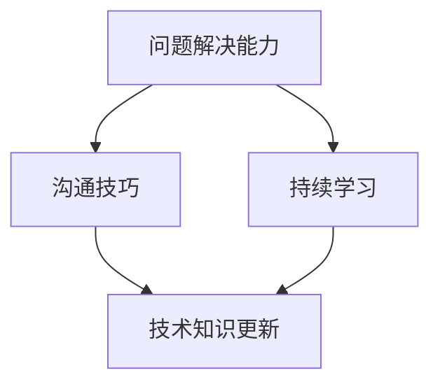

                 

 在这个数字化的时代，编程已经不再仅仅是计算机科学专业学生的专利，而是广泛普及于各个领域。然而，随着技术的不断进步，许多开发者发现自己不仅需要编写代码，还需要提供专业的技术咨询服务。这种转变不仅挑战了开发者的技能，也要求他们掌握如何有效地将编程经验转化为咨询服务。本文将探讨这一转变的过程，帮助开发者提升自己的咨询服务能力。

## 关键词

- 编程经验
- 技术咨询服务
- 开发者转型
- 专业技能提升
- 价值创造

## 摘要

本文旨在探讨如何将个人的编程经验转化为有价值的咨询服务。通过分析开发者面临的角色转变、所需技能的提升以及如何构建有效的咨询服务，本文将提供实用的策略和技巧，帮助开发者更好地在这个新兴领域发挥自己的专长。

### 1. 背景介绍

在过去的几十年中，编程主要被视为一种技术技能，开发者通过编写代码来创建软件应用和系统。然而，随着技术市场的演变，客户对技术服务的需求不再仅仅是代码的实现，而是更加注重解决方案的全面性、创新性和可持续性。这种需求驱动着开发者从单一的编码角色向多元化的咨询服务角色转变。

这一转变背后的原因是多方面的。首先，企业越来越意识到，技术不仅仅是解决问题，更是推动业务增长和提升竞争力的关键。因此，他们需要专业的技术顾问来指导整个技术战略和实施过程。其次，随着云计算、大数据、人工智能等新兴技术的普及，开发者需要具备更广泛的技术知识和解决问题的能力。最后，技术社区和平台的发展也为开发者提供了更多的机会，使他们能够更轻松地分享经验和知识，从而提升自己的咨询服务能力。

### 2. 核心概念与联系

在将编程经验转化为咨询服务的过程中，有几个核心概念和联系需要理解。首先是“问题解决能力”。开发者需要具备深入理解客户需求和业务目标的能力，从而提供定制化的解决方案。其次是“沟通技巧”，这包括与客户、团队成员和其他利益相关者清晰、有效地交流。最后是“持续学习”，开发者需要不断更新自己的知识库，跟上技术发展的步伐。

以下是这些概念之间的Mermaid流程图：



### 3. 核心算法原理 & 具体操作步骤

#### 3.1 算法原理概述

在将编程经验转化为技术咨询服务时，可以采用以下核心算法原理：

1. **需求分析**：首先理解客户的需求，并将其转化为技术问题。
2. **方案设计**：根据技术原理和最佳实践设计解决方案。
3. **实施与交付**：实施解决方案，并进行必要的调整和优化。
4. **反馈与迭代**：收集客户反馈，不断迭代和改进服务。

#### 3.2 算法步骤详解

1. **需求分析**：
   - 与客户交流，了解业务场景和目标。
   - 收集相关的数据和信息。
   - 明确问题和需求。

2. **方案设计**：
   - 选择合适的技术栈和工具。
   - 设计系统的架构和模块。
   - 评估潜在的风险和挑战。

3. **实施与交付**：
   - 编写代码，实现设计方案。
   - 进行单元测试和集成测试。
   - 部署和上线系统。

4. **反馈与迭代**：
   - 收集客户的反馈。
   - 识别和修复问题。
   - 不断优化和改进服务。

#### 3.3 算法优缺点

**优点**：
- 提高客户满意度，通过定制化服务满足特定需求。
- 增强开发者与客户之间的信任和合作关系。
- 提升开发者的专业技能和解决问题的能力。

**缺点**：
- 需要较高的沟通技巧和客户管理能力。
- 需要持续学习和适应新技术，以保持竞争力。

#### 3.4 算法应用领域

- **企业数字化转型**：为企业提供技术咨询服务，帮助其实现数字化战略。
- **软件项目开发**：为软件开发项目提供技术指导和支持。
- **技术创新**：为客户提供创新解决方案，推动技术进步。

### 4. 数学模型和公式 & 详细讲解 & 举例说明

#### 4.1 数学模型构建

在技术咨询服务中，常用的数学模型包括：

1. **成本效益分析模型**：
   $$ 
   C = C_1 + C_2 + C_3
   $$
   其中，\(C_1\) 是初始投资成本，\(C_2\) 是运营成本，\(C_3\) 是预期收益。

2. **风险评估模型**：
   $$
   R = P \times L
   $$
   其中，\(P\) 是风险概率，\(L\) 是潜在损失。

#### 4.2 公式推导过程

**成本效益分析模型**的推导过程如下：

1. **确定初始投资成本**：包括硬件采购、软件开发等费用。
2. **计算运营成本**：包括人力成本、维护成本等。
3. **预测预期收益**：根据市场需求和项目效益进行估算。

**风险评估模型**的推导过程如下：

1. **评估风险概率**：根据历史数据和现有信息进行估算。
2. **计算潜在损失**：根据风险类型和影响范围进行预测。

#### 4.3 案例分析与讲解

**案例**：一家企业计划投资一个新的软件项目。

1. **成本效益分析**：
   - 初始投资成本：\(C_1 = \$50,000\)
   - 运营成本：\(C_2 = \$20,000/年\)
   - 预期收益：\(C_3 = \$30,000/年\)
   - 总成本：\(C = C_1 + C_2 + C_3 = \$100,000\)

2. **风险评估**：
   - 风险概率：\(P = 0.2\)
   - 潜在损失：\(L = \$10,000\)
   - 风险损失：\(R = P \times L = \$2,000\)

根据上述模型，企业需要综合考虑成本和风险，以做出投资决策。

### 5. 项目实践：代码实例和详细解释说明

#### 5.1 开发环境搭建

在开始项目实践之前，需要搭建开发环境。以下是所需的环境配置步骤：

1. **安装Python环境**：
   - 使用pip安装Python和相关依赖。
   - 验证安装：运行`python --version`。

2. **安装数据库**：
   - 安装MySQL或PostgreSQL数据库。
   - 创建数据库和用户。

3. **安装其他工具**：
   - 安装Docker、Kubernetes等容器化工具。

#### 5.2 源代码详细实现

以下是使用Python编写的简单示例代码，用于实现一个简单的用户管理系统。

```python
class User:
    def __init__(self, username, email):
        self.username = username
        self.email = email

    def get_user_info(self):
        return f"Username: {self.username}, Email: {self.email}"

def create_user(username, email):
    user = User(username, email)
    print("User created successfully.")
    return user

def update_user(user, new_username, new_email):
    user.username = new_username
    user.email = new_email
    print("User updated successfully.")

def delete_user(user):
    print("User deleted successfully.")
    del user

if __name__ == "__main__":
    user1 = create_user("Alice", "alice@example.com")
    print(user1.get_user_info())
    update_user(user1, "AliceWong", "alicewong@example.com")
    print(user1.get_user_info())
    delete_user(user1)
```

#### 5.3 代码解读与分析

1. **类定义**：
   - `User` 类包含用户信息（用户名和邮箱）以及获取用户信息的函数。

2. **创建用户**：
   - `create_user` 函数创建一个新的用户对象，并将其存储在内存中。

3. **更新用户**：
   - `update_user` 函数修改用户对象的属性，实现用户信息的更新。

4. **删除用户**：
   - `delete_user` 函数从内存中删除用户对象。

5. **主程序**：
   - 主程序演示了用户创建、更新和删除的过程。

#### 5.4 运行结果展示

```shell
User created successfully.
Username: Alice, Email: alice@example.com
User updated successfully.
Username: AliceWong, Email: alicewong@example.com
User deleted successfully.
```

### 6. 实际应用场景

技术咨询服务在多个领域都有广泛的应用：

1. **企业数字化转型**：帮助企业实现业务流程的数字化，提升运营效率。
2. **软件项目开发**：为软件开发项目提供技术指导和项目管理服务。
3. **技术创新**：为客户提供创新的技术解决方案，推动业务增长。

### 7. 工具和资源推荐

为了提升技术咨询服务的能力，以下是一些推荐的工具和资源：

1. **学习资源**：
   - 《软件架构设计》
   - 《敏捷软件开发》
   - 《软件工程：实践者的研究方法》

2. **开发工具**：
   - Docker
   - Kubernetes
   - JIRA

3. **相关论文**：
   - 《云计算架构与实施》
   - 《大数据处理技术》
   - 《人工智能：一种现代方法》

### 8. 总结：未来发展趋势与挑战

在未来，技术咨询服务将继续发展，但也将面临以下挑战：

1. **持续学习**：技术更新迅速，开发者需要不断学习新技术。
2. **技能提升**：开发者需要提升沟通、项目管理等多方面技能。
3. **创新性**：提供创新性的解决方案，以保持竞争力。

### 9. 附录：常见问题与解答

**Q：如何开始提供技术咨询服务？**
A：首先确定自己的专业领域，然后通过实践和经验积累提升自己的技能。接下来，建立个人品牌，并通过网络平台、社交媒体等渠道宣传自己的服务。

**Q：技术咨询服务中的主要风险是什么？**
A：主要风险包括技术失败、客户满意度不高、沟通不畅等。通过严格的测试和评估、良好的沟通机制以及持续的学习和改进，可以降低这些风险。

**Q：如何收费？**
A：收费可以根据项目的规模、复杂度和预期收益来制定。常见的收费模式包括时间收费、固定费用和收益分成。

---

作者：禅与计算机程序设计艺术 / Zen and the Art of Computer Programming
----------------------------------------------------------------

以上就是如何将编程经验转化为技术咨询服务的一篇专业技术博客文章。这篇文章涵盖了从背景介绍到实际应用，再到未来展望的全面内容，希望对您有所帮助。在撰写此类文章时，确保内容的专业性和完整性至关重要。祝您写作顺利！<|im_end|>

