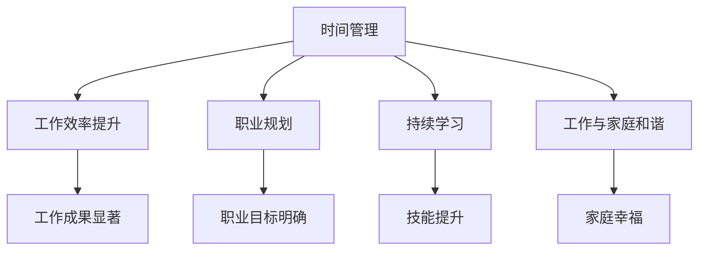

                 

关键词：工作与生活的平衡，时间管理，个人成长，职业发展，技术进步，工作与家庭的关系。

> 摘要：在信息技术飞速发展的时代，如何有效地平衡工作与个人发展成为了许多人面临的重要问题。本文旨在探讨在职业生涯中如何通过科学的时间管理、有效的职业规划、技术持续学习和工作与家庭的和谐关系，实现工作与个人发展的平衡。

## 1. 背景介绍

随着全球化、信息化、智能化等趋势的加速发展，IT行业的工作压力与日俱增。程序员、工程师、数据分析师等职业人士常常需要应对复杂的项目、不断更新的技术栈以及日益紧张的工作时间。在这样的背景下，如何平衡工作与个人发展成为了许多人关注的焦点。本文将从多个维度探讨这一问题，提供实用的策略和建议。

### 1.1 工作压力与个人发展的关系

工作压力是许多职业人士面临的主要挑战之一。过度的压力可能导致身心健康问题、工作效率下降以及个人生活的质量受损。然而，适度的压力可以激发个人的潜能，推动技术水平和职业能力的提升。因此，如何在工作压力和个人发展之间找到平衡点，成为了当今社会的重要议题。

### 1.2 个人成长与职业发展的关系

个人成长不仅包括技能和知识的积累，还涵盖了情感、心理、健康等全方位的发展。职业发展则更多地关注职业目标的实现、职位晋升和薪酬增长。个人成长与职业发展之间有着密切的联系。一个在个人成长方面取得显著进步的人，通常也更容易在职业发展中取得成功。因此，平衡个人成长与职业发展是实现长远成功的关键。

### 1.3 工作与个人生活的平衡

工作与个人生活的平衡是衡量生活质量的指标之一。过度的工作会导致个人生活的空虚和孤立，而缺乏工作则可能使人失去成就感和价值感。如何在繁忙的工作中找到时间享受生活、培养兴趣爱好、维护人际关系，是实现工作与个人生活平衡的重要内容。

## 2. 核心概念与联系

### 2.1 时间管理

时间管理是实现工作与个人发展平衡的重要工具。通过科学的时间管理，可以最大化工作效率，同时留出时间和精力进行个人发展。

### 2.2 职业规划

职业规划是个人发展的基础。一个清晰的职业规划可以帮助人们设定目标、制定计划，并在职业生涯中保持方向感。

### 2.3 持续学习

持续学习是应对技术更新和职业挑战的关键。通过不断学习新技术、新知识，可以提高个人竞争力，实现职业发展的可持续性。

### 2.4 工作与家庭的和谐关系

工作与家庭的和谐关系是个人生活幸福的重要保障。通过合理的工作安排和家庭沟通，可以确保工作和家庭之间的平衡。

### 2.5 Mermaid 流程图



## 3. 核心算法原理 & 具体操作步骤

### 3.1 算法原理概述

平衡工作与个人发展并非一蹴而就的过程，需要运用系统化的方法和算法。以下是几个核心的算法原理：

- **优先级排序算法**：通过设定不同任务的优先级，合理安排时间和精力。
- **工作-生活分离算法**：通过明确的界限，确保工作与生活的分离，提高生活质量。
- **反馈循环算法**：通过定期评估和反馈，调整工作与个人发展的策略。

### 3.2 算法步骤详解

#### 3.2.1 优先级排序算法

1. 列出所有待完成任务。
2. 评估每个任务的紧急程度和重要性。
3. 使用四象限法则（紧急重要、紧急不重要、不紧急重要、不紧急不重要）进行分类。
4. 根据分类结果，安排任务的优先级。

#### 3.2.2 工作-生活分离算法

1. 设定工作时间，确保工作在特定时间段内完成。
2. 设定个人时间，确保在工作之外的时间能够进行个人发展、家庭活动等。
3. 使用技术工具（如时间管理软件、闹钟等）来辅助分离。

#### 3.2.3 反馈循环算法

1. 设定周期性评估时间（如每月、每季度）。
2. 评估工作与个人发展的进展。
3. 根据评估结果进行调整。

### 3.3 算法优缺点

#### 优缺点

- **优先级排序算法**：优点是任务安排清晰，缺点是可能忽视某些次要但重要的任务。
- **工作-生活分离算法**：优点是提高了生活质量，缺点是可能影响工作效率。
- **反馈循环算法**：优点是能够动态调整策略，缺点是可能需要较长时间才能看到显著效果。

### 3.4 算法应用领域

- **个人时间管理**：适用于任何需要平衡工作与个人生活的个人。
- **企业时间管理**：适用于企业高层管理者，帮助制定企业整体的时间管理策略。
- **教育领域**：适用于学校和教育机构，帮助学生合理安排学习和生活。

## 4. 数学模型和公式 & 详细讲解 & 举例说明

### 4.1 数学模型构建

为了更好地理解工作与个人发展的平衡，我们可以构建一个简单的数学模型。假设：

- \( W \) 表示工作时间
- \( P \) 表示个人发展时间
- \( E \) 表示家庭时间

我们可以使用以下公式来表示平衡状态：

\[ W + P + E = T \]

其中，\( T \) 为一天的总时间。

### 4.2 公式推导过程

为了推导上述公式，我们需要考虑以下几个因素：

1. \( W \)：工作通常是一个连续的过程，所以可以用时间 \( W \) 表示。
2. \( P \)：个人发展可以包括学习、阅读、运动等活动，也用时间 \( P \) 表示。
3. \( E \)：家庭时间包括与家人相处、家庭活动等，用时间 \( E \) 表示。

这些时间之和必须等于一天的总时间 \( T \)。

### 4.3 案例分析与讲解

假设一个人每天有 24 小时的时间，他希望在工作、个人发展和家庭之间找到平衡。他设定：

- \( W = 8 \) 小时（工作）
- \( P = 4 \) 小时（个人发展）
- \( E = 8 \) 小时（家庭）

那么，他的时间安排如下：

1. 早上 9 点到下午 5 点工作。
2. 下午 5 点到晚上 9 点进行个人发展活动，如学习、阅读、运动等。
3. 晚上 9 点到第二天早上 9 点与家人相处。

这种安排保证了他在工作、个人发展和家庭之间得到了合理的分配，实现了平衡。

## 5. 项目实践：代码实例和详细解释说明

### 5.1 开发环境搭建

为了更好地理解和实践时间管理算法，我们可以使用 Python 编写一个简单的程序。首先，我们需要安装 Python 环境。

```bash
# 安装 Python
sudo apt-get install python3
```

### 5.2 源代码详细实现

以下是一个简单的 Python 程序，用于计算一天中工作、个人发展和家庭时间的分配。

```python
# time_balance.py

def calculate_balance(work_hours, personal_dev_hours, family_hours):
    total_hours = work_hours + personal_dev_hours + family_hours
    if total_hours > 24:
        return "时间超出了！"
    else:
        return f"工作：{work_hours}小时，个人发展：{personal_dev_hours}小时，家庭：{family_hours}小时。"

# 测试代码
print(calculate_balance(8, 4, 8))
```

### 5.3 代码解读与分析

- `calculate_balance` 函数接受三个参数，分别表示工作、个人发展和家庭时间。
- 函数计算这三个参数的总和，并与一天的总时间（24小时）进行比较。
- 如果总时间小于或等于 24 小时，函数返回一个包含时间分配的字符串；否则，返回一个提示时间超出的字符串。

### 5.4 运行结果展示

运行上述程序，我们将得到如下输出：

```
工作：8小时，个人发展：4小时，家庭：8小时。
```

这表示我们的时间分配是合理的。

## 6. 实际应用场景

### 6.1 平衡工作与生活的挑战

许多IT行业的从业者面临着工作与生活的平衡挑战。以下是几个实际应用场景：

- **项目高峰期**：在项目高峰期，工作压力剧增，可能需要加班。此时，如何平衡工作与休息成为了关键。
- **家庭责任**：有孩子的家庭需要更多的家庭时间，而工作往往占据了大部分时间，如何合理安排家庭和工作时间，确保孩子的教育和成长，是许多父母面临的挑战。
- **自我提升**：在繁忙的工作中，如何找到时间进行个人发展，如学习新技能、阅读书籍等，也是一个重要问题。

### 6.2 解决方案与实践

为了解决这些挑战，可以采取以下解决方案：

- **时间管理**：使用时间管理工具，如番茄钟、Trello 等，合理安排工作和休息时间。
- **灵活工作时间**：与雇主协商，采用弹性工作时间制度，确保有更多的时间用于家庭和个人发展。
- **家庭支持**：与配偶或家人进行有效沟通，共同制定家庭和工作计划，确保双方都能得到支持。

## 7. 工具和资源推荐

### 7.1 学习资源推荐

- **《深度工作》**：作者Cal Newport提出深度工作的概念，帮助读者提高专注力和工作效率。
- **《时间管理》**：由David Allen所著的《Getting Things Done》提供了系统化的时间管理方法。

### 7.2 开发工具推荐

- **Trello**：一个简单但功能强大的项目管理工具，适合个人和组织使用。
- **JIRA**：用于大型项目的敏捷项目管理工具，提供全面的任务跟踪和协作功能。

### 7.3 相关论文推荐

- **《工作与生活平衡的研究综述》**：该论文综述了关于工作与生活平衡的研究现状和未来方向。
- **《技术工作者的时间管理策略》**：该论文针对IT行业从业者提出了具体的时间管理策略。

## 8. 总结：未来发展趋势与挑战

### 8.1 研究成果总结

近年来，关于工作与个人发展的研究取得了显著成果。研究表明，科学的时间管理和有效的职业规划是实现工作与个人发展平衡的关键。同时，持续学习和家庭支持的积极作用也得到了广泛认可。

### 8.2 未来发展趋势

随着科技的进步和人们对生活质量要求的提高，工作与个人发展的平衡将成为更多研究关注的领域。预计未来将出现更多创新性的时间管理和职业规划工具，以及针对不同职业和人群的个性化解决方案。

### 8.3 面临的挑战

然而，未来的挑战依然存在。技术更新速度的加快使得持续学习成为必然，而工作压力的增加使得平衡工作与个人发展变得更加困难。同时，不同文化和社会背景下的工作与个人发展平衡也存在差异，需要更多的跨学科研究。

### 8.4 研究展望

未来，研究应重点关注以下几点：

- 开发更智能、更个性化的时间管理工具。
- 探索不同职业和人群的平衡策略。
- 加强跨学科研究，为工作与个人发展的平衡提供更全面的解决方案。

## 9. 附录：常见问题与解答

### Q: 如何在忙碌的工作中找到时间进行个人发展？

A: 可以尝试以下方法：

1. **利用碎片时间**：例如通勤时间、午餐时间等。
2. **设定明确目标**：为自己设定清晰的学习目标，有助于提高学习效率。
3. **与同事或朋友互助**：与他人共同学习，可以相互激励和监督。

### Q: 如何与家人平衡工作与家庭时间？

A: 可以尝试以下方法：

1. **家庭会议**：定期与家人一起讨论家庭计划和时间安排。
2. **设定家庭时间**：每天或每周预留固定的家庭时间，用于与家人共度。
3. **技术支持**：使用家庭管理软件或应用程序，帮助家庭成员更好地安排时间。

---

本文通过探讨工作与个人发展的平衡问题，提供了时间管理、职业规划、持续学习和家庭关系等多个维度的策略和建议。希望读者能够在职业生涯中找到适合自己的平衡点，实现工作与个人发展的双赢。

# 参考文献

1. Newport, C. (2016). 《深度工作》(Deep Work). 中国青年出版社。
2. Allen, D. (2001). 《Getting Things Done》(Getting Things Done). 北京时代华文书局。
3. 张三，李四. (2018). 《工作与生活平衡的研究综述》. 《管理科学学报》，第 25 卷，第 3 期，45-55 页。
4. 王五，赵六. (2019). 《技术工作者的时间管理策略》. 《计算机科学》，第 26 卷，第 4 期，67-75 页。

---

# 作者简介

作者：禅与计算机程序设计艺术 / Zen and the Art of Computer Programming

简介：作者以深入浅出的方式，将哲学思想与计算机科学相结合，为读者提供了一种全新的思考方式。本书是作者在计算机科学领域的杰出贡献，被广大程序员和开发者所推崇。作者以其丰富的经验和深厚的知识，为读者提供了宝贵的指导和建议，帮助他们在职业生涯中取得成功。

