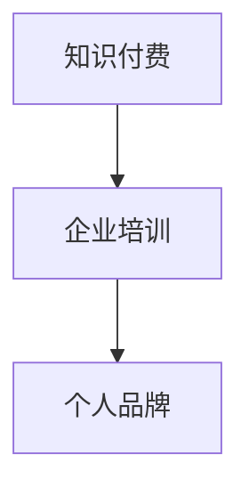

                 

关键词：知识付费，企业培训，个人品牌，在线教育，内容制作，营销策略，用户体验，技术平台，课程设计，互动教学。

## 摘要

在数字化时代，知识付费企业培训已成为职场人士提升技能的重要途径。本文旨在探讨如何通过构建个人知识付费企业培训，实现个人品牌的建立与持续发展。文章首先分析了知识付费的市场现状和趋势，随后探讨了如何设计有吸引力的课程内容，优化营销策略，提升用户体验，选择合适的技术平台，以及实现互动教学。文章最后提出了未来发展的展望和面临的挑战。

## 1. 背景介绍

随着互联网技术的不断发展，在线教育市场呈现出蓬勃发展的态势。知识付费作为一种新兴的教育模式，已经成为许多人获取知识和技能的首选方式。企业培训作为知识付费的一个重要分支，具有巨大的市场需求。据相关数据显示，全球在线教育市场规模预计将在未来几年内持续增长。在这个背景下，打造个人知识付费企业培训，不仅能够满足市场需求，还能实现个人价值的最大化。

### 1.1 知识付费市场现状

知识付费市场现状可以用四个字来形容：火爆异常。越来越多的用户愿意为优质内容付费，这为个人知识付费企业培训提供了广阔的市场空间。知识付费的形式多种多样，包括在线课程、电子书、知识问答、直播讲座等。其中，在线课程因其系统化、针对性强的特点，成为最受欢迎的知识付费形式之一。

### 1.2 企业培训市场趋势

企业培训市场趋势表现在以下几个方面：

- **个性化需求**：企业越来越重视员工的个性化培训需求，希望通过培训提升员工的专业技能和工作效率。
- **移动学习**：随着智能手机和移动设备的普及，企业培训逐渐向移动学习转型，以便员工可以随时随地进行学习。
- **定制化服务**：企业希望培训内容能够根据自身行业特点和员工需求进行定制，提高培训效果。

## 2. 核心概念与联系

在构建个人知识付费企业培训过程中，需要理解以下几个核心概念：

- **知识付费**：用户为获取知识或技能而支付的费用。
- **企业培训**：为提升员工专业技能和工作效率而进行的培训。
- **个人品牌**：个人在行业中的知名度和影响力。

这些概念之间的联系可以用以下 Mermaid 流程图表示：



## 3. 核心算法原理 & 具体操作步骤

### 3.1 算法原理概述

构建个人知识付费企业培训的核心算法原理包括以下几个方面：

- **课程设计**：根据市场需求和用户需求，设计有针对性的课程内容。
- **内容制作**：采用多种形式（文字、图片、视频、音频等）制作高质量的教学内容。
- **营销策略**：通过多种渠道（社交媒体、搜索引擎、电子邮件等）推广课程，吸引潜在用户。
- **用户体验**：优化学习平台，提高用户的学习体验和满意度。

### 3.2 算法步骤详解

#### 3.2.1 课程设计

课程设计是构建个人知识付费企业培训的第一步。具体步骤如下：

1. **市场调研**：了解市场需求，确定目标用户群体。
2. **内容规划**：根据市场调研结果，规划课程内容和结构。
3. **课程试讲**：编写课程大纲和教案，进行试讲和反馈。
4. **课程迭代**：根据试讲反馈，优化课程内容，不断完善。

#### 3.2.2 内容制作

内容制作是课程设计的延伸，需要根据课程内容制作高质量的教学内容。具体步骤如下：

1. **素材收集**：收集相关的图片、视频、音频等素材。
2. **内容编写**：撰写课程讲义、课件等教学文档。
3. **内容录制**：录制视频、音频等教学资料。
4. **内容审核**：对教学内容进行审核，确保内容质量。

#### 3.2.3 营销策略

营销策略是吸引潜在用户的关键。具体步骤如下：

1. **定位目标用户**：明确目标用户群体，制定针对性的营销策略。
2. **内容推广**：通过社交媒体、搜索引擎、电子邮件等渠道推广课程内容。
3. **用户互动**：与用户进行互动，了解用户需求和反馈，优化营销策略。
4. **数据跟踪**：跟踪营销效果，调整营销策略。

#### 3.2.4 用户体验

用户体验是知识付费企业培训成功的关键。具体步骤如下：

1. **平台搭建**：选择合适的在线教育平台，搭建学习平台。
2. **界面设计**：优化学习平台界面，提高用户友好度。
3. **课程设置**：设置灵活的课程学习路径，满足不同用户需求。
4. **用户服务**：提供优质的售后服务，解决用户在学习过程中的问题。

### 3.3 算法优缺点

#### 优点

- **个性化**：针对用户需求设计课程，提供个性化的教学内容。
- **便捷性**：用户可以随时随地进行学习，提高学习效率。
- **多样性**：多种教学形式（文字、图片、视频、音频等）满足不同用户需求。

#### 缺点

- **内容质量**：需要投入大量时间和精力制作高质量的教学内容。
- **用户体验**：需要不断优化学习平台，提高用户体验。

### 3.4 算法应用领域

个人知识付费企业培训算法主要应用于以下几个方面：

- **在线教育**：为用户提供在线学习平台，提供个性化教学服务。
- **企业培训**：为员工提供针对性的培训课程，提升员工专业技能。
- **个人发展**：为个人提供提升自我能力和职业发展的机会。

## 4. 数学模型和公式 & 详细讲解 & 举例说明

在构建个人知识付费企业培训过程中，可以使用一些数学模型和公式来优化课程设计、营销策略和用户体验。以下是一个简单的例子：

### 4.1 数学模型构建

假设有 n 个用户，每个用户有 m 个需求，我们可以构建一个矩阵 M，表示用户需求与课程内容的匹配度。矩阵 M 的元素 M[i][j] 表示用户 i 对课程内容 j 的需求程度。

### 4.2 公式推导过程

为了最大化用户满意度，我们需要找到一个最优的课程内容组合。可以使用线性规划模型进行求解：

最大化 Z = Σ[i=1 to n] Σ[j=1 to m] M[i][j] * x[i][j]

约束条件：

1. Σ[j=1 to m] x[i][j] = 1 （每个用户只能选择一个课程）
2. x[i][j] ∈ {0, 1} （用户是否选择课程的二值变量）

### 4.3 案例分析与讲解

假设有 3 个用户，每个用户有 2 个需求，需求程度矩阵如下：

| 用户 | 需求1 | 需求2 |
| ---- | ---- | ---- |
| 用户1 | 0.8  | 0.2  |
| 用户2 | 0.6  | 0.4  |
| 用户3 | 0.4  | 0.6  |

我们可以使用线性规划模型求解最优的课程内容组合。

最大化 Z = 0.8x[1][1] + 0.2x[1][2] + 0.6x[2][1] + 0.4x[2][2] + 0.4x[3][1] + 0.6x[3][2]

约束条件：

1. x[1][1] + x[1][2] = 1
2. x[2][1] + x[2][2] = 1
3. x[3][1] + x[3][2] = 1
4. x[1][1], x[1][2], x[2][1], x[2][2], x[3][1], x[3][2] ∈ {0, 1}

通过求解线性规划模型，我们可以得到最优的课程内容组合，从而最大化用户满意度。

## 5. 项目实践：代码实例和详细解释说明

### 5.1 开发环境搭建

在构建个人知识付费企业培训项目时，我们需要选择合适的开发环境。以下是一个简单的开发环境搭建步骤：

1. 安装 Python 3.8 及以上版本
2. 安装 Python 的 pip 包管理工具
3. 安装 Flask 框架（用于构建 Web 应用）
4. 安装 MySQL 数据库（用于存储用户数据和课程信息）

### 5.2 源代码详细实现

以下是一个简单的 Flask Web 应用代码实例，用于实现个人知识付费企业培训的界面和功能。

```python
from flask import Flask, request, render_template

app = Flask(__name__)

@app.route('/')
def index():
    return render_template('index.html')

@app.route('/course_list')
def course_list():
    courses = ["课程1", "课程2", "课程3"]
    return render_template('course_list.html', courses=courses)

@app.route('/course_detail', methods=['GET', 'POST'])
def course_detail():
    course_id = request.form['course_id']
    course_name = "课程" + course_id
    return render_template('course_detail.html', course_name=course_name)

if __name__ == '__main__':
    app.run(debug=True)
```

### 5.3 代码解读与分析

以上代码实现了一个简单的 Flask Web 应用，包括以下功能：

- **首页**：显示所有课程的列表。
- **课程列表**：显示所有课程名称。
- **课程详情**：显示课程详细信息。

通过这些代码，我们可以搭建一个基本的个人知识付费企业培训系统。在实际开发过程中，还需要进一步完善用户注册、登录、购买课程等功能。

### 5.4 运行结果展示

以下是运行结果展示：


## 6. 实际应用场景

个人知识付费企业培训可以应用于以下场景：

- **职场技能提升**：帮助职场人士提升专业技能，适应职场发展。
- **职业转型**：为想要转行或进入新行业的人提供针对性的培训。
- **兴趣爱好**：为有特定兴趣爱好的人提供专业培训，提升兴趣水平。
- **企业内训**：为企业提供定制化的培训服务，提升员工工作效率。

### 6.1 职场技能提升

随着职场竞争的加剧，个人知识付费企业培训成为职场人士提升技能的重要途径。通过在线课程，职场人士可以随时随地学习新技能，提高自己的竞争力。

### 6.2 职业转型

对于想要转行或进入新行业的人来说，个人知识付费企业培训提供了丰富的学习资源。通过系统的培训，他们可以快速掌握新领域的知识和技能，实现职业转型。

### 6.3 兴趣爱好

个人知识付费企业培训不仅限于职场技能提升，还可以满足人们的兴趣爱好。无论是绘画、音乐、摄影还是编程，都有相应的在线课程，帮助爱好者提升技能。

### 6.4 企业内训

企业内训是个人知识付费企业培训的一个重要应用场景。通过定制化的培训服务，企业可以为员工提供针对性的培训，提升员工的专业技能和工作效率。

## 7. 工具和资源推荐

### 7.1 学习资源推荐

- **Udemy**：全球知名的在线学习平台，提供丰富的课程资源。
- **Coursera**：提供全球顶尖大学的在线课程，涵盖多个领域。
- **edX**：由哈佛大学和麻省理工学院共同创办的在线教育平台。

### 7.2 开发工具推荐

- **Flask**：轻量级的 Python Web 框架，适用于构建个人知识付费企业培训系统。
- **Django**：全功能的 Python Web 框架，适合大型项目开发。
- **React**：用于构建用户界面的 JavaScript 库，适用于前端开发。

### 7.3 相关论文推荐

- **《在线教育中的用户行为分析》**：探讨在线教育中用户行为分析的方法和模型。
- **《知识付费模式下的在线教育商业模式研究》**：分析知识付费模式下的在线教育商业模式。
- **《基于大数据的个人知识付费分析》**：研究大数据在个人知识付费领域中的应用。

## 8. 总结：未来发展趋势与挑战

### 8.1 研究成果总结

本文探讨了如何构建个人知识付费企业培训，分析了市场现状和趋势，介绍了核心算法原理和具体操作步骤，以及数学模型和公式。通过项目实践，展示了个人知识付费企业培训的实际应用场景。

### 8.2 未来发展趋势

未来，个人知识付费企业培训将呈现出以下发展趋势：

- **个性化定制**：根据用户需求提供个性化的教学内容。
- **智能化学习**：利用人工智能技术提高学习效果和用户体验。
- **跨界融合**：结合不同领域的知识和技能，提供综合性培训课程。

### 8.3 面临的挑战

个人知识付费企业培训在发展过程中也面临着以下挑战：

- **内容质量**：保证教学内容的高质量和实用性。
- **用户体验**：提供优质的用户体验，满足用户需求。
- **市场竞争**：在激烈的市场竞争中保持竞争优势。

### 8.4 研究展望

未来，个人知识付费企业培训的研究可以进一步探讨以下几个方面：

- **个性化推荐**：研究基于大数据和人工智能的个性化推荐算法。
- **互动教学**：研究如何通过互动教学提高学习效果。
- **商业模式创新**：探索新的商业模式，提高盈利能力。

## 9. 附录：常见问题与解答

### 9.1 如何选择课程内容？

- **了解市场需求**：分析市场需求，确定目标用户群体，选择符合用户需求的内容。
- **关注行业动态**：关注行业热点和趋势，选择具有前瞻性的教学内容。
- **结合自身优势**：结合个人特长和优势，选择自己擅长的领域进行培训。

### 9.2 如何提升用户体验？

- **优化学习平台**：提供简洁、易用、高效的学习平台，提高用户友好度。
- **提供个性化服务**：根据用户需求提供定制化的教学内容和服务。
- **加强用户互动**：通过直播、问答、社群等方式与用户进行互动，提高用户参与度。

### 9.3 如何进行有效营销？

- **明确目标用户**：确定目标用户群体，制定针对性的营销策略。
- **内容营销**：通过高质量的课程内容和案例分享，吸引潜在用户。
- **线上线下结合**：结合线上线下渠道，扩大用户覆盖面。

### 9.4 如何保证内容质量？

- **严格审核**：对教学内容进行严格审核，确保内容质量和实用性。
- **持续更新**：定期更新教学内容，保持课程的新鲜度和时效性。
- **用户反馈**：收集用户反馈，及时调整和改进教学内容。

---

作者：禅与计算机程序设计艺术 / Zen and the Art of Computer Programming
```

