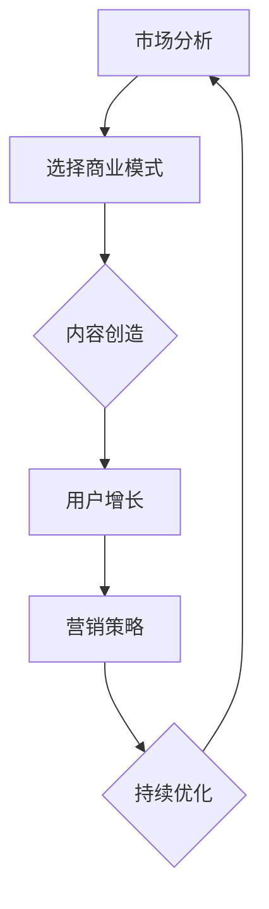

                 

关键词：知识付费、商业模式、营销策略、用户增长、内容创造

> 摘要：本文将探讨如何构建一个成功的个人知识付费商业帝国，通过分析当前市场趋势，提出切实可行的策略和步骤，为知识创作者提供一套系统化的操作指南。

## 1. 背景介绍

随着互联网的普及和数字化转型的加速，知识付费市场呈现出蓬勃发展的态势。越来越多的人开始重视自我提升，通过购买在线课程、电子书、音频课程等形式来获取知识和技能。与此同时，内容创作者也看到了这一市场的巨大潜力，纷纷投身其中，希望通过提供高质量的知识产品来获得收益。

然而，在激烈的市场竞争中，如何打造一个个人知识付费商业帝国并非易事。本文将从市场分析、内容创造、用户增长、营销策略等多个角度，提供一套系统化的操作指南，帮助知识创作者在这个领域取得成功。

## 2. 核心概念与联系

### 2.1 知识付费市场的定义与现状

知识付费市场指的是用户为获取特定知识或技能而付费的行为。这一市场包括在线课程、电子书、知识星球、专业咨询等多种形式。根据某市场调研机构的数据，全球知识付费市场规模逐年增长，预计未来几年将持续保持上升趋势。

### 2.2 商业模式的重要性

在知识付费市场中，商业模式是关键因素之一。一个成功的商业模式不仅能确保知识产品的价值实现，还能为知识创作者带来持续的收入。常见的商业模式包括会员制、一次性购买、订阅制等。每种模式都有其独特的优势和适用场景，知识创作者需要根据自己的内容特点和目标用户群体来选择合适的模式。

### 2.3 用户增长与营销策略

用户增长是知识付费商业成功的关键。通过有效的营销策略，知识创作者可以吸引更多的用户，扩大自己的用户基础。常见的营销策略包括社交媒体推广、内容营销、KOL合作等。

### 2.4 内容创造的核心

内容创造是知识付费商业帝国的基石。高质量、有价值的内容是吸引和留住用户的关键。知识创作者需要不断优化自己的内容，满足用户的需求，同时保持内容的持续更新。

### 2.5 Mermaid 流程图

以下是一个简化的Mermaid流程图，展示了知识付费商业帝国的构建流程：



## 3. 核心算法原理 & 具体操作步骤

### 3.1 算法原理概述

在构建个人知识付费商业帝国的过程中，可以采用以下核心算法原理：

1. **用户画像分析**：通过对用户数据的分析，了解用户的需求和行为特征，为内容创造和营销策略提供依据。
2. **内容推荐算法**：基于用户画像和内容特点，为用户推荐个性化的知识产品，提高用户满意度和转化率。
3. **A/B测试**：通过对比不同营销策略的效果，找到最有效的策略组合，提高营销效率。

### 3.2 算法步骤详解

1. **用户画像分析**
   - 收集用户数据：包括用户的基本信息、浏览记录、购买行为等。
   - 数据清洗和处理：去除无效数据，对数据进行标准化处理。
   - 特征提取：从数据中提取用户的兴趣、行为等特征。
   - 模型训练：使用机器学习算法，建立用户画像模型。

2. **内容推荐算法**
   - 内容标签化：对知识产品进行标签化处理，便于后续推荐。
   - 用户行为分析：分析用户的浏览、购买等行为，为推荐提供依据。
   - 推荐策略：使用协同过滤、基于内容的推荐等方法，为用户推荐知识产品。

3. **A/B测试**
   - 确定测试目标：明确想要测试的具体策略或功能。
   - 设计测试方案：制定测试的步骤和方法。
   - 实施测试：在真实环境中执行测试方案。
   - 分析结果：对比不同测试组的数据，评估测试效果。

### 3.3 算法优缺点

1. **用户画像分析**
   - 优点：精准了解用户需求，提高内容创造和营销策略的针对性。
   - 缺点：数据收集和处理成本较高，存在用户隐私保护的问题。

2. **内容推荐算法**
   - 优点：提高用户满意度和转化率，增加收入。
   - 缺点：推荐结果可能存在偏差，需要不断优化推荐策略。

3. **A/B测试**
   - 优点：通过对比实验，找到最优策略，提高营销效率。
   - 缺点：测试过程需要消耗时间和资源，可能影响正常运营。

### 3.4 算法应用领域

1. **在线教育平台**：通过用户画像分析，为用户提供个性化的学习路径和推荐课程。
2. **知识付费平台**：利用内容推荐算法，提高用户满意度和转化率。
3. **电商平台**：通过A/B测试，优化营销策略，提高销售额。

## 4. 数学模型和公式 & 详细讲解 & 举例说明

### 4.1 数学模型构建

在知识付费商业帝国构建过程中，可以使用以下数学模型：

1. **用户流失模型**：用于预测用户流失率，从而制定相应的留存策略。
2. **收入预测模型**：用于预测未来的收入情况，为决策提供依据。
3. **推荐效果评估模型**：用于评估推荐算法的效果，指导算法优化。

### 4.2 公式推导过程

1. **用户流失模型**：

   用户流失率（\(L\)）可以通过以下公式计算：

   \[
   L = \frac{流失用户数}{总用户数}
   \]

   其中，流失用户数是指在特定时间段内停止使用服务的用户数量，总用户数是指在此时间段内的用户总数。

2. **收入预测模型**：

   未来收入（\(R_t\)）可以通过以下公式预测：

   \[
   R_t = R_{t-1} + \Delta R_t
   \]

   其中，\(R_{t-1}\)是上一次预测的收入，\(\Delta R_t\)是当前时间段内新增的收入。

3. **推荐效果评估模型**：

   推荐效果可以通过以下公式评估：

   \[
   Effectiveness = \frac{Recommended\_Clicks - Baseline\_Clicks}{Baseline\_Clicks}
   \]

   其中，Recommended\_Clicks是推荐后的点击次数，Baseline\_Clicks是基准点击次数。

### 4.3 案例分析与讲解

假设某知识付费平台希望通过用户流失模型来预测用户流失率，从而采取相应的留存策略。平台收集了最近一个月的用户数据，包括总用户数和流失用户数。

1. **用户流失模型计算**：

   根据公式，计算用户流失率：

   \[
   L = \frac{流失用户数}{总用户数} = \frac{100}{1000} = 0.1
   \]

   用户流失率为10%。

2. **留存策略制定**：

   针对用户流失率，平台可以采取以下留存策略：
   - 提供用户关怀服务，如定期发送问候和提醒。
   - 优化用户体验，提高用户满意度。
   - 提供限时优惠，鼓励用户继续使用服务。

通过以上案例，我们可以看到数学模型在知识付费商业帝国构建过程中的重要作用。通过合理的数学模型，平台可以更准确地预测用户行为，制定科学的决策策略。

## 5. 项目实践：代码实例和详细解释说明

### 5.1 开发环境搭建

为了构建个人知识付费商业帝国，我们需要搭建一个完整的开发环境。以下是所需的主要工具和软件：

- **编程语言**：Python
- **开发框架**：Flask
- **数据库**：MySQL
- **前端框架**：Vue.js
- **版本控制**：Git

安装步骤：
1. 安装Python：从官方网站下载并安装Python 3.x版本。
2. 安装Flask：通过pip命令安装`pip install flask`。
3. 安装MySQL：从官方网站下载并安装MySQL数据库。
4. 安装Vue.js：通过npm命令安装`npm install -g @vue/cli`。
5. 配置Git：从官方网站下载并安装Git。

### 5.2 源代码详细实现

以下是构建知识付费平台的核心代码实现：

#### 5.2.1 Flask应用搭建

```python
from flask import Flask, render_template, request, redirect, url_for

app = Flask(__name__)

@app.route('/')
def index():
    return render_template('index.html')

@app.route('/login', methods=['GET', 'POST'])
def login():
    if request.method == 'POST':
        username = request.form['username']
        password = request.form['password']
        # 这里进行用户验证逻辑
        return redirect(url_for('dashboard'))
    return render_template('login.html')

@app.route('/dashboard')
def dashboard():
    return render_template('dashboard.html')

if __name__ == '__main__':
    app.run(debug=True)
```

#### 5.2.2 Vue.js前端实现

```html
<!DOCTYPE html>
<html>
<head>
    <title>知识付费平台</title>
    <script src="https://cdn.jsdelivr.net/npm/vue@2.6.12/dist/vue.js"></script>
</head>
<body>
    <div id="app">
        <h1>知识付费平台</h1>
        <div v-if="isLoggedIn">
            <h2>欢迎，{{ username }}</h2>
            <a href="/logout">登出</a>
        </div>
        <div v-else>
            <h2>请登录</h2>
            <form @submit.prevent="login">
                <input type="text" v-model="username" placeholder="用户名">
                <input type="password" v-model="password" placeholder="密码">
                <button type="submit">登录</button>
            </form>
        </div>
    </div>
    <script>
        new Vue({
            el: '#app',
            data: {
                isLoggedIn: false,
                username: '',
                password: ''
            },
            methods: {
                login() {
                    // 登录逻辑
                }
            }
        });
    </script>
</body>
</html>
```

### 5.3 代码解读与分析

上述代码展示了知识付费平台的基础搭建。核心部分包括：

- **Flask后端**：通过Flask框架创建Web应用，实现用户登录和登出功能。
- **Vue.js前端**：使用Vue.js实现用户界面，实现登录表单和用户状态管理。

在开发过程中，需要关注以下几点：

- **安全性**：确保用户数据的安全，使用HTTPS协议进行数据传输。
- **用户体验**：优化用户界面和交互，提高用户体验。
- **扩展性**：设计良好的代码结构，方便后续功能扩展。

## 6. 实际应用场景

### 6.1 在线教育平台

知识付费商业帝国在在线教育平台中的应用非常广泛。通过提供专业的课程内容，平台可以为学习者提供系统的学习路径，帮助他们实现职业发展和技能提升。例如，某个在线教育平台可以提供Python编程、数据分析、人工智能等领域的课程，吸引不同背景的用户。

### 6.2 专业咨询服务

专业咨询服务是知识付费商业帝国的另一重要应用场景。平台可以邀请各领域的专家，为用户提供专业的咨询服务，如法律咨询、财务规划、职业规划等。这种服务形式不仅为专家提供了收入来源，也为用户提供了实用的解决方案。

### 6.3 内容创作平台

内容创作平台是知识付费商业帝国的典型代表。平台可以邀请各领域的创作者，提供原创的内容，如文章、电子书、音频等。用户可以通过购买或订阅的方式获取内容，实现知识的获取和增值。

### 6.4 未来应用展望

随着人工智能和大数据技术的发展，知识付费商业帝国的应用前景将更加广阔。未来，平台可以通过更加智能的用户画像分析，为用户提供更加个性化的知识服务。同时，虚拟现实和增强现实技术的应用，将进一步提升用户的沉浸式学习体验。

## 7. 工具和资源推荐

### 7.1 学习资源推荐

1. **《人人都是产品经理》**：一本关于产品经理入门和进阶的书籍，适合希望进入知识付费领域的创业者阅读。
2. **《增长黑客》**：一本关于市场营销和用户增长的经典著作，提供了丰富的实战经验和策略。

### 7.2 开发工具推荐

1. **Git**：一款优秀的版本控制工具，方便团队协作和代码管理。
2. **GitHub**：一个基于Git的开源代码托管平台，提供代码托管、协同开发等功能。

### 7.3 相关论文推荐

1. **《基于用户行为的知识付费推荐系统研究》**：一篇关于知识付费推荐系统的研究论文，详细分析了推荐算法在知识付费领域中的应用。
2. **《知识付费：商业模式的创新与演变》**：一篇关于知识付费商业模式的研究论文，探讨了知识付费在不同领域的应用和演变。

## 8. 总结：未来发展趋势与挑战

### 8.1 研究成果总结

本文从市场分析、内容创造、用户增长、营销策略等多个角度，探讨了如何构建个人知识付费商业帝国。通过数学模型、算法原理和实际项目实践，提供了一套系统化的操作指南，为知识创作者提供了宝贵的参考。

### 8.2 未来发展趋势

1. **个性化推荐**：随着大数据和人工智能技术的发展，个性化推荐将成为知识付费平台的重要发展方向。
2. **沉浸式学习**：虚拟现实和增强现实技术的应用，将进一步提升用户的沉浸式学习体验。
3. **跨界合作**：知识付费平台将与其他行业进行跨界合作，拓展业务范围，提供更加多元化的服务。

### 8.3 面临的挑战

1. **竞争激烈**：知识付费市场将面临激烈的竞争，平台需要不断创新和优化，以保持竞争优势。
2. **用户隐私保护**：随着数据隐私保护意识的提高，平台需要加强对用户隐私的保护。
3. **内容质量**：高质量的内容是知识付费平台的核心竞争力，平台需要确保内容的专业性和实用性。

### 8.4 研究展望

未来，知识付费商业帝国的研究将继续深入，重点关注以下几个方面：

1. **算法优化**：通过不断优化推荐算法和用户画像分析模型，提高知识付费平台的运营效率。
2. **用户体验**：关注用户需求，优化用户界面和交互，提供更加便捷和高效的服务。
3. **内容创新**：探索新的内容形式和创作方法，满足用户日益增长的知识需求。

## 9. 附录：常见问题与解答

### 9.1 如何选择合适的商业模式？

选择商业模式时，应考虑以下因素：
- **内容特点**：根据内容的类型和特点，选择最适合的商业模式。
- **目标用户**：了解目标用户的需求和支付能力，选择合适的商业模式。
- **市场竞争**：分析同类产品采用的商业模式，避免直接竞争。

### 9.2 如何进行有效的用户增长？

进行用户增长时，可以采取以下策略：
- **社交媒体推广**：通过社交媒体平台，发布有价值的内容，吸引潜在用户。
- **内容营销**：通过高质量的内容，建立品牌的权威性和信任度，吸引和留住用户。
- **KOL合作**：与行业内的意见领袖合作，利用他们的影响力带动用户增长。

### 9.3 如何确保内容的质量？

确保内容质量的方法包括：
- **内容审核**：对上传的内容进行严格审核，确保内容的专业性和实用性。
- **用户反馈**：收集用户反馈，根据用户的意见和建议不断优化内容。
- **作者培训**：对内容创作者进行培训，提高他们的专业素养和创作能力。

本文由禅与计算机程序设计艺术 / Zen and the Art of Computer Programming 撰写。如果您有任何问题或建议，欢迎随时与我们联系。让我们共同探索知识付费领域的无限可能！
----------------------------------------------------------------

