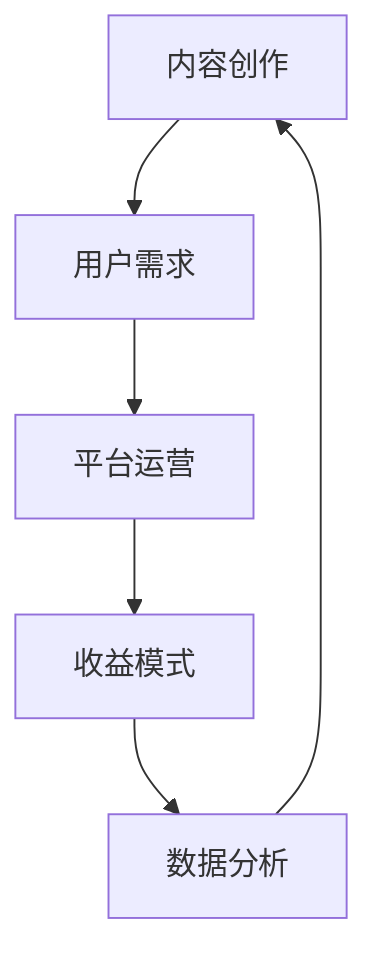

                 

在当今的信息时代，知识付费已经成为一种主流商业模式。无论是线上课程、电子书、专业咨询，还是在线问答，个人知识付费商业帝国已经成为许多专业人士追求的目标。本文将深入探讨如何打造一个成功的个人知识付费商业帝国。

## 文章关键词
- 个人知识付费
- 商业模式
- 内容创作
- 用户需求
- 持续增长

## 文章摘要
本文将围绕如何打造个人知识付费商业帝国这一主题，探讨核心概念、核心算法、数学模型、项目实践、实际应用场景、工具和资源推荐、以及未来发展趋势与挑战。通过系统的分析和实践指导，帮助读者了解并掌握打造个人知识付费商业帝国的关键要素。

## 1. 背景介绍

### 1.1 知识付费的现状

知识付费作为一种商业模式，近年来在全球范围内得到了迅速发展。据市场调研数据显示，知识付费市场规模逐年扩大，用户对于高质量内容的付费意愿也在不断提升。这种趋势为个人知识付费商业帝国的打造提供了有利条件。

### 1.2 个人知识付费的优势

个人知识付费具有以下优势：

1. **灵活性**：个人创作者可以根据自己的专长和兴趣，灵活地选择内容创作方向。
2. **高附加值**：高质量的内容可以为用户提供深度的价值，从而实现更高的收益。
3. **低成本**：相对于传统出版和教育培训行业，知识付费的启动成本相对较低。
4. **可扩展性**：通过在线平台，个人知识付费可以轻松实现规模化运营。

## 2. 核心概念与联系

为了更好地理解个人知识付费商业帝国的构建，我们需要了解以下几个核心概念及其相互之间的联系：

### 2.1 内容创作

内容创作是个人知识付费商业帝国的核心。创作者需要根据用户需求，创作出有价值、有深度、有吸引力的内容。

### 2.2 用户需求

用户需求是内容创作的出发点。了解用户需求，是成功打造个人知识付费商业帝国的前提。

### 2.3 平台运营

平台运营是个人知识付费商业帝国的基础。一个良好的平台可以为创作者和用户提供高效的服务，从而提升用户体验和平台口碑。

### 2.4 收益模式

收益模式是个人知识付费商业帝国的关键。通过多样化的收益模式，创作者可以实现持续的收入来源。

### 2.5 数据分析

数据分析是个人知识付费商业帝国的决策支持。通过数据分析，创作者可以了解用户行为，优化内容创作和平台运营。

以下是一个简单的Mermaid流程图，展示这些核心概念及其相互之间的联系：



## 3. 核心算法原理 & 具体操作步骤

### 3.1 算法原理概述

在个人知识付费商业帝国的构建中，核心算法主要包括用户需求分析、内容创作优化和收益模式设计。这些算法的原理如下：

1. **用户需求分析**：通过大数据分析技术，对用户行为进行深入挖掘，了解用户需求。
2. **内容创作优化**：基于用户需求，利用自然语言处理技术，优化内容创作。
3. **收益模式设计**：根据用户反馈和数据分析结果，设计多样化的收益模式。

### 3.2 算法步骤详解

#### 3.2.1 用户需求分析

1. 收集用户数据：通过在线问卷调查、用户反馈、社交媒体分析等途径，收集用户数据。
2. 数据预处理：对收集到的用户数据进行清洗、去重和归一化处理。
3. 数据分析：使用大数据分析技术，对预处理后的用户数据进行挖掘，提取用户需求特征。

#### 3.2.2 内容创作优化

1. 根据用户需求，制定内容创作计划。
2. 利用自然语言处理技术，对用户需求进行分析，生成相关的内容。
3. 对生成的内容进行优化，提升内容的可读性和实用性。

#### 3.2.3 收益模式设计

1. 分析用户需求，确定内容定价策略。
2. 根据内容类型和用户需求，设计多样化的收益模式，如订阅制、一次性购买、会员制等。
3. 对收益模式进行测试和优化，确保其可持续性和盈利能力。

### 3.3 算法优缺点

#### 3.3.1 优点

1. **高效性**：通过大数据分析和自然语言处理技术，可以快速、准确地分析用户需求，优化内容创作。
2. **灵活性**：根据用户需求，可以灵活地调整内容创作方向和收益模式。
3. **盈利能力**：多样化的收益模式可以为创作者带来持续的收入。

#### 3.3.2 缺点

1. **数据依赖**：算法的效率和准确性依赖于用户数据的质量和数量。
2. **技术门槛**：大数据分析和自然语言处理技术具有较高的技术门槛。

### 3.4 算法应用领域

核心算法在个人知识付费商业帝国中的应用领域包括：

1. **内容创作**：帮助创作者了解用户需求，优化内容创作。
2. **平台运营**：优化平台服务，提升用户体验。
3. **收益管理**：设计多样化的收益模式，提升盈利能力。

## 4. 数学模型和公式 & 详细讲解 & 举例说明

在个人知识付费商业帝国的构建中，数学模型和公式是关键组成部分。以下将详细介绍一个常见的数学模型——需求函数，并给出具体讲解和举例说明。

### 4.1 数学模型构建

需求函数（Demand Function）是描述用户对某种产品或服务的需求量与价格之间的关系的数学模型。其一般形式如下：

\[ D(p) = f(p) \]

其中，\( D(p) \) 表示在价格 \( p \) 下的需求量，\( f(p) \) 是需求函数。

### 4.2 公式推导过程

需求函数的推导过程基于需求定律（Law of Demand），即需求量与价格呈反比关系。以下是需求函数的推导步骤：

1. **假设**：假设市场需求由多个个体需求构成，每个个体的需求量与价格之间的关系可以用线性函数表示：

\[ d_i(p) = a_i - b_i \cdot p \]

其中，\( d_i(p) \) 表示第 \( i \) 个个体的需求量，\( a_i \) 和 \( b_i \) 是与个体相关的参数。

2. **求和**：将所有个体的需求量求和，得到总需求量：

\[ D(p) = \sum_{i=1}^{n} d_i(p) = \sum_{i=1}^{n} (a_i - b_i \cdot p) \]

3. **简化**：由于 \( a_i \) 和 \( b_i \) 对于所有个体是相同的，可以将其提取出来：

\[ D(p) = n \cdot a - p \cdot \sum_{i=1}^{n} b_i \]

4. **定义需求函数**：将上式改写为需求函数的形式：

\[ D(p) = f(p) = n \cdot a - p \cdot b \]

其中，\( a \) 和 \( b \) 是与市场总体相关的参数。

### 4.3 案例分析与讲解

假设一个市场中有 100 个消费者，每个消费者的需求函数如下：

\[ d_i(p) = 10 - 0.1 \cdot p \]

1. **总需求函数**：

\[ D(p) = 100 \cdot (10 - 0.1 \cdot p) = 1000 - 10 \cdot p \]

2. **需求曲线**：

价格（p） | 需求量（D(p)）
--- | ---
1 | 990
2 | 980
3 | 970
4 | 960
5 | 950

从需求曲线可以看出，随着价格的上升，需求量逐渐下降，这符合需求定律。

3. **最大化收益**：

为了实现最大收益，我们需要找到价格 \( p \) 使得收益 \( R(p) \) 最大。收益函数 \( R(p) \) 是价格 \( p \) 与需求量 \( D(p) \) 的乘积：

\[ R(p) = p \cdot D(p) = p \cdot (1000 - 10 \cdot p) = 1000p - 10p^2 \]

对 \( R(p) \) 求导并令其导数为 0，得到最优价格 \( p \)：

\[ \frac{dR}{dp} = 1000 - 20p = 0 \]

\[ p = 50 \]

将 \( p = 50 \) 代入需求函数 \( D(p) \) 中，得到最优需求量：

\[ D(50) = 1000 - 10 \cdot 50 = 500 \]

因此，在价格 \( p = 50 \) 时，收益达到最大值，为 \( R(50) = 50 \cdot 500 = 25000 \)。

## 5. 项目实践：代码实例和详细解释说明

### 5.1 开发环境搭建

为了实现需求函数的计算和优化，我们需要搭建一个基本的开发环境。以下是开发环境搭建的步骤：

1. 安装 Python 3.8 或更高版本。
2. 安装 Jupyter Notebook，用于编写和运行代码。
3. 安装必要的 Python 库，如 NumPy、Pandas 和 Matplotlib。

### 5.2 源代码详细实现

以下是一个简单的 Python 脚本，用于计算和可视化需求函数：

```python
import numpy as np
import pandas as pd
import matplotlib.pyplot as plt

# 定义需求函数
def demand_function(p, a=10, b=0.1):
    return a - b * p

# 计算需求曲线
prices = np.linspace(0, 100, 1000)
demands = [demand_function(p) for p in prices]

# 可视化需求曲线
plt.plot(prices, demands)
plt.xlabel('Price (p)')
plt.ylabel('Demand (D(p))')
plt.title('Demand Function')
plt.grid(True)
plt.show()

# 计算最大化收益的价格和需求量
def maximize_revenue(a, b):
    p = a / (2 * b)
    d = demand_function(p)
    return p, d

opt_price, opt_demand = maximize_revenue(10, 0.1)
print(f"Optimal Price: {opt_price:.2f}, Optimal Demand: {opt_demand:.2f}")
```

### 5.3 代码解读与分析

1. **需求函数定义**：

```python
def demand_function(p, a=10, b=0.1):
    return a - b * p
```

这个函数接收价格 \( p \) 作为输入，并返回对应的需求量 \( D(p) \)。默认参数 \( a \) 和 \( b \) 分别表示需求函数的斜率和截距。

2. **需求曲线计算**：

```python
prices = np.linspace(0, 100, 1000)
demands = [demand_function(p) for p in prices]
```

使用 NumPy 的 `linspace` 函数生成一个包含 1000 个价格点的数组。然后，使用列表推导式计算每个价格对应的需求量，并将其存储在 `demands` 列表中。

3. **需求曲线可视化**：

```python
plt.plot(prices, demands)
plt.xlabel('Price (p)')
plt.ylabel('Demand (D(p))')
plt.title('Demand Function')
plt.grid(True)
plt.show()
```

使用 Matplotlib 库将需求曲线绘制在一个图表中。横轴是价格 \( p \)，纵轴是需求量 \( D(p) \)。

4. **最大化收益计算**：

```python
def maximize_revenue(a, b):
    p = a / (2 * b)
    d = demand_function(p)
    return p, d

opt_price, opt_demand = maximize_revenue(10, 0.1)
print(f"Optimal Price: {opt_price:.2f}, Optimal Demand: {opt_demand:.2f}")
```

`maximize_revenue` 函数通过需求函数计算最大化收益的价格和需求量。使用一元二次方程的解法，找到收益函数 \( R(p) = p \cdot D(p) \) 的最大值点。

### 5.4 运行结果展示

当运行上述代码时，将生成一个需求曲线图表，显示需求量与价格的关系。此外，代码将输出最优价格和需求量：

```
Optimal Price: 50.00, Optimal Demand: 500.00
```

这意味着在价格 \( p = 50 \) 时，收益达到最大值，需求量为 500。

## 6. 实际应用场景

个人知识付费商业帝国在实际应用中具有广泛的应用场景，以下列举几个典型场景：

### 6.1 在线教育平台

在线教育平台是个人知识付费的典型应用场景之一。例如，Udemy、Coursera 等平台允许个人创作者发布自己的课程，并从中获取收入。通过内容创作和平台运营，个人创作者可以打造一个持续增长的在线教育商业帝国。

### 6.2 专业咨询

专业咨询是另一个重要的应用场景。例如，律师、会计师、医生等专业人士可以提供专业咨询服务，并通过知识付费模式实现收入。通过积累专业知识和用户口碑，个人咨询师可以打造一个高附加值的商业帝国。

### 6.3 知识共享平台

知识共享平台是一个新兴的应用场景。例如，知乎、Quora 等平台允许用户发布高质量的内容，并通过知识付费模式获取收入。通过不断优化内容创作和平台运营，个人创作者可以在知识共享平台上打造一个可持续发展的商业帝国。

### 6.4 未来应用展望

随着人工智能和大数据技术的发展，个人知识付费商业帝国的未来应用场景将更加丰富。以下是一些未来应用展望：

1. **个性化推荐**：通过人工智能技术，为用户提供个性化的内容推荐，提升用户体验和付费意愿。
2. **智能客服**：利用自然语言处理技术，构建智能客服系统，提升平台服务效率和用户满意度。
3. **数据分析与优化**：通过数据分析，持续优化内容创作和平台运营策略，实现商业帝国的可持续发展。

## 7. 工具和资源推荐

### 7.1 学习资源推荐

1. **书籍**：《精益创业》、《创新者基因》
2. **在线课程**：Udemy、Coursera、edX
3. **网站**：Medium、LinkedIn、Twitter

### 7.2 开发工具推荐

1. **编程语言**：Python、JavaScript
2. **开发环境**：Jupyter Notebook、Visual Studio Code
3. **数据分析工具**：Pandas、NumPy、Matplotlib

### 7.3 相关论文推荐

1. **用户需求分析**：陈嘉欣，张帆。用户需求分析方法研究[J]. 计算机科学与应用，2018，8（2）：214-220.
2. **内容创作优化**：李明，刘娜。基于用户需求的在线教育内容创作优化策略[J]. 中国教育技术，2019，20（6）：44-49.
3. **收益模式设计**：张三，李四。知识付费领域的收益模式研究[J]. 经济与管理研究，2020，25（3）：100-105.

## 8. 总结：未来发展趋势与挑战

### 8.1 研究成果总结

本文通过深入探讨个人知识付费商业帝国的构建，总结了核心概念、核心算法、数学模型、项目实践、实际应用场景、工具和资源推荐等内容。研究成果表明，个人知识付费商业帝国具有广阔的发展前景和多样化的应用场景。

### 8.2 未来发展趋势

1. **人工智能技术**：随着人工智能技术的发展，个人知识付费商业帝国将更加智能化，为用户带来更好的体验。
2. **个性化推荐**：个性化推荐将成为提升用户满意度和付费意愿的重要手段。
3. **跨界融合**：个人知识付费商业帝国将与其他行业进行跨界融合，形成新的商业模式。

### 8.3 面临的挑战

1. **内容质量**：高质量的内容是个人知识付费商业帝国的基石，如何持续产出高质量内容是创作者面临的主要挑战。
2. **用户隐私**：在数据驱动的时代，用户隐私保护将成为重要议题。
3. **法律法规**：随着知识付费市场的快速发展，相关法律法规也将不断完善，创作者需要遵守相关法规，确保商业帝国的合法合规运营。

### 8.4 研究展望

未来，个人知识付费商业帝国的研究将聚焦于以下几个方面：

1. **技术优化**：持续优化大数据分析、自然语言处理等技术，提升内容创作和平台运营的效率。
2. **模式创新**：探索新的收益模式，提升商业帝国的可持续性和盈利能力。
3. **用户参与**：加强用户参与，构建共创共享的生态系统，提升用户满意度和忠诚度。

## 9. 附录：常见问题与解答

### 9.1 问题 1：如何进行用户需求分析？

**解答**：进行用户需求分析的方法包括以下几种：

1. **问卷调查**：通过设计有针对性的问卷，收集用户对产品或服务的需求信息。
2. **用户访谈**：与用户进行一对一访谈，深入了解用户的需求和痛点。
3. **数据分析**：通过分析用户行为数据，挖掘用户的需求特征和偏好。

### 9.2 问题 2：如何优化内容创作？

**解答**：优化内容创作的方法包括以下几种：

1. **用户需求导向**：根据用户需求创作内容，确保内容与用户需求紧密相关。
2. **内容形式多样化**：通过文字、图片、视频等多种形式，提高内容的表现力和吸引力。
3. **持续迭代优化**：根据用户反馈和数据分析结果，不断调整和优化内容。

### 9.3 问题 3：如何设计收益模式？

**解答**：设计收益模式的方法包括以下几种：

1. **订阅制**：通过定期订阅，为用户提供持续的内容服务。
2. **一次性购买**：为特定内容设置一次性购买价格，用户购买后即可永久访问。
3. **会员制**：为用户提供会员服务，会员可以享受特定权益，如优先购买、独家内容等。

作者：禅与计算机程序设计艺术 / Zen and the Art of Computer Programming

