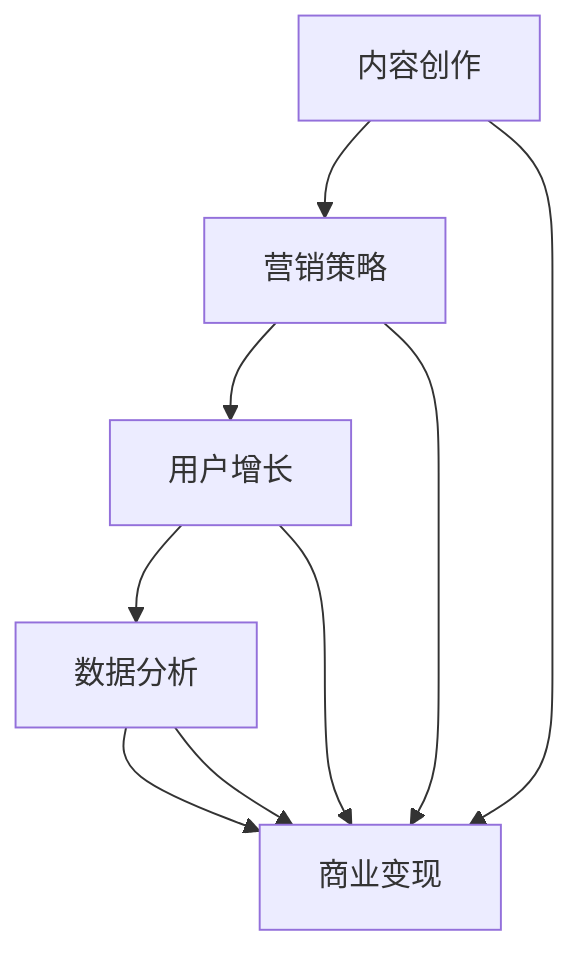

                 

关键词：知识付费、商业模型、内容创作、营销策略、用户增长、数据分析、人工智能

> 摘要：本文将探讨如何通过构建个人知识付费商业帝国，实现从内容创作到用户增长，再到商业变现的全流程策略。我们将分析成功案例，探讨核心算法原理，提供实践指南，并展望未来发展趋势。

## 1. 背景介绍

在当今知识经济时代，知识付费已经成为一种重要的商业模式。越来越多的人开始通过互联网平台分享自己的知识和经验，从而获得收入。从知乎、分答到得到、喜马拉雅，知识付费市场呈现出蓬勃发展的态势。然而，如何在竞争激烈的市场中脱颖而出，打造个人知识付费商业帝国，成为众多知识工作者关注的焦点。

### 1.1 知识付费的定义

知识付费是指消费者为获取特定领域的知识、技能或经验而支付的费用。这一模式的出现，反映了人们对专业知识和高质量内容的需求。知识付费不仅仅局限于在线课程、电子书，还包括咨询、直播、短视频等多种形式。

### 1.2 知识付费市场的现状

根据数据显示，2019年中国知识付费市场规模达到1796亿元，预计到2023年将突破4000亿元。随着5G、人工智能等技术的应用，知识付费市场将继续保持高速增长。

## 2. 核心概念与联系

为了打造个人知识付费商业帝国，我们需要理解以下几个核心概念：

### 2.1 内容创作

内容创作是知识付费商业帝国的基石。高质量的内容能够吸引并留住用户，从而实现商业变现。内容创作包括课程设计、文章撰写、视频制作等多个环节。

### 2.2 营销策略

营销策略是知识付费商业帝国成功的关键。通过精准定位目标用户、运用多种营销手段，可以有效提高用户认知度和粘性。

### 2.3 用户增长

用户增长是衡量知识付费商业帝国规模的重要指标。通过不断吸引用户，扩大用户群体，可以为商业变现提供充足的客户资源。

### 2.4 数据分析

数据分析是优化运营策略的重要工具。通过对用户行为数据、市场数据进行分析，可以指导内容创作、营销策略的调整。

### 2.5 商业变现

商业变现是将知识付费转化为实际收入的过程。通过会员订阅、课程销售、广告投放等多种方式，实现知识付费的商业价值。

### 2.6 Mermaid 流程图



## 3. 核心算法原理 & 具体操作步骤

### 3.1 算法原理概述

打造个人知识付费商业帝国的核心算法原理主要包括以下几个方面：

1. **内容创作算法**：通过分析用户需求和市场趋势，设计出具有吸引力和教育价值的内容。
2. **营销策略算法**：运用大数据分析，精准定位目标用户，制定个性化的营销方案。
3. **用户增长算法**：通过社群运营、口碑传播等手段，实现用户的持续增长。
4. **数据分析算法**：对用户行为、市场数据进行分析，指导内容创作和营销策略的优化。
5. **商业变现算法**：根据用户价值、市场行情等，制定合理的定价策略和销售方案。

### 3.2 算法步骤详解

#### 3.2.1 内容创作

1. **需求分析**：通过市场调研、用户访谈等方式，了解用户需求。
2. **内容规划**：根据需求分析，制定内容大纲和知识点结构。
3. **内容制作**：采用图文、视频、音频等多种形式，制作高质量的内容。
4. **内容审核**：对内容进行审核，确保其质量和合规性。

#### 3.2.2 营销策略

1. **用户定位**：分析用户特征，确定目标用户群体。
2. **内容推广**：通过社交媒体、SEO、广告投放等多种渠道，推广内容。
3. **互动营销**：通过问答、直播、社群等方式，与用户互动，提升用户粘性。
4. **数据分析**：对营销效果进行监测和分析，调整营销策略。

#### 3.2.3 用户增长

1. **社群运营**：建立社群，培养核心用户，实现口碑传播。
2. **内容营销**：通过高质量内容，吸引潜在用户，实现用户增长。
3. **活动运营**：举办线上线下活动，提高用户参与度，促进用户增长。

#### 3.2.4 数据分析

1. **数据采集**：收集用户行为、市场等数据。
2. **数据分析**：运用数据分析工具，对数据进行分析。
3. **策略调整**：根据分析结果，调整内容创作、营销策略。

#### 3.2.5 商业变现

1. **定价策略**：根据用户价值、市场行情等因素，制定合理的定价策略。
2. **销售渠道**：选择合适的销售渠道，如电商平台、微信公众号等。
3. **促销活动**：通过优惠券、限时折扣等促销活动，提高销售业绩。
4. **用户反馈**：收集用户反馈，不断优化产品和服务。

### 3.3 算法优缺点

#### 优点

1. **高效性**：通过算法，可以快速分析和处理大量数据，提高运营效率。
2. **精准性**：算法可以根据用户需求和市场趋势，精准定位用户，提高营销效果。
3. **持续性**：算法可以持续优化，不断适应市场变化，保持竞争优势。

#### 缺点

1. **复杂性**：算法开发和维护需要较高技术门槛。
2. **数据依赖**：算法效果依赖于数据的准确性和完整性。
3. **时效性**：算法需要不断更新，以适应市场变化。

### 3.4 算法应用领域

1. **教育培训**：通过算法，可以精准推荐课程，提高学习效果。
2. **营销推广**：通过算法，可以制定个性化的营销方案，提高转化率。
3. **用户增长**：通过算法，可以分析用户行为，实现精准的用户增长策略。
4. **商业变现**：通过算法，可以优化定价策略和销售渠道，提高商业变现能力。

## 4. 数学模型和公式 & 详细讲解 & 举例说明

### 4.1 数学模型构建

在知识付费商业帝国中，我们可以构建以下数学模型：

#### 用户增长模型

$$
\text{用户增长} = \text{初始用户数} \times (1 + r)^n
$$

其中，$r$ 为用户增长率，$n$ 为增长周期。

#### 数据分析模型

$$
\text{数据分析结果} = f(\text{用户行为数据}, \text{市场数据}, \text{历史数据})
$$

其中，$f$ 为数据分析函数。

### 4.2 公式推导过程

#### 用户增长模型推导

假设初始用户数为 $u_0$，用户增长率为 $r$，增长周期为 $n$。则第 $n$ 个周期的用户数为：

$$
u_n = u_0 \times (1 + r)^n
$$

对上述公式两边同时取对数，得：

$$
\ln u_n = \ln u_0 + n \ln (1 + r)
$$

令 $a = \ln u_0$，$b = n \ln (1 + r)$，则：

$$
u_n = e^a \times e^{b} = u_0 \times (1 + r)^n
$$

#### 数据分析模型推导

假设用户行为数据为 $x$，市场数据为 $y$，历史数据为 $z$。则数据分析结果为：

$$
f(x, y, z) = \frac{1}{1 + e^{-(wx + by + cz)}}
$$

其中，$w$、$b$、$c$ 为权重参数。

### 4.3 案例分析与讲解

#### 案例一：用户增长模型

假设某知识付费平台的初始用户数为 1000，用户增长率为 10%，增长周期为 1 年。求 5 年后的用户数。

代入公式：

$$
\text{用户数} = 1000 \times (1 + 0.1)^5 = 1000 \times 1.61051 \approx 1611
$$

因此，5 年后的用户数约为 1611。

#### 案例二：数据分析模型

假设某平台对用户行为数据进行分析，得到以下结果：

$$
f(x, y, z) = \frac{1}{1 + e^{-(-0.5x + 0.3y + 0.2z)}}
$$

其中，$x$、$y$、$z$ 分别为用户行为数据、市场数据、历史数据。

代入数据进行计算，得到数据分析结果为：

$$
f(10, 20, 30) = \frac{1}{1 + e^{-(-0.5 \times 10 + 0.3 \times 20 + 0.2 \times 30)}} \approx 0.732
$$

因此，该用户的行为分析结果为 0.732，表示该用户的行为较为积极。

## 5. 项目实践：代码实例和详细解释说明

### 5.1 开发环境搭建

为了实现知识付费商业帝国的算法，我们需要搭建以下开发环境：

- 操作系统：Windows/Linux/MacOS
- 编程语言：Python
- 数据分析工具：Pandas、NumPy
- 机器学习库：Scikit-learn
- 数据可视化工具：Matplotlib

### 5.2 源代码详细实现

以下是一个简单的用户增长模型的 Python 代码实现：

```python
import numpy as np
import matplotlib.pyplot as plt

# 用户增长模型参数
initial_users = 1000  # 初始用户数
growth_rate = 0.1     # 用户增长率
growth_cycles = 5     # 增长周期

# 计算用户数
user_counts = initial_users * (1 + growth_rate) ** np.arange(growth_cycles)

# 绘制用户增长曲线
plt.plot(np.arange(growth_cycles), user_counts, 'o-')
plt.title('User Growth Model')
plt.xlabel('Growth Cycle')
plt.ylabel('User Count')
plt.show()
```

### 5.3 代码解读与分析

1. **参数设置**：设置初始用户数、用户增长率、增长周期等参数。
2. **计算用户数**：使用 NumPy 库计算每个周期的用户数。
3. **绘制曲线**：使用 Matplotlib 库绘制用户增长曲线，展示用户增长趋势。

### 5.4 运行结果展示

运行上述代码后，将得到以下用户增长曲线：


从图中可以看出，随着增长周期的增加，用户数呈现指数级增长。

## 6. 实际应用场景

### 6.1 在线教育

在线教育是知识付费的重要领域。通过构建个人知识付费商业帝国，教育工作者可以开设在线课程，提供专业知识和技能培训。例如，某位知名程序员通过开设编程课程，吸引了大量学生，实现了个人知识付费的商业变现。

### 6.2 咨询服务

咨询服务是知识付费的另一个重要领域。专业人士可以通过线上平台提供咨询服务，如法律咨询、财务规划等。通过精准的营销策略和高质量的内容创作，可以吸引更多客户，实现商业变现。

### 6.3 创意内容

创意内容，如写作、绘画、摄影等，也是知识付费的重要领域。创作者可以通过平台发布作品，获得粉丝支持和商业收入。例如，某位知名作家通过发布网络小说，吸引了大量粉丝，实现了知识付费的商业变现。

## 6.4 未来应用展望

### 6.4.1 技术发展

随着人工智能、大数据、区块链等技术的发展，知识付费商业帝国将迎来更多创新和机遇。例如，智能推荐系统可以更精准地满足用户需求，区块链技术可以确保知识付费的透明和公正。

### 6.4.2 跨界融合

知识付费商业帝国可以与其他领域融合，如文化产业、娱乐产业等。通过跨界合作，可以创造出更多具有吸引力的内容，吸引更多用户。

### 6.4.3 社会价值

知识付费商业帝国不仅可以为个人创造收入，还可以为社会创造价值。通过高质量的内容创作和传播，可以提高整个社会的知识水平和创新能力。

## 7. 工具和资源推荐

### 7.1 学习资源推荐

1. **《深度学习》（Goodfellow et al.）**：深入理解深度学习的基本原理和应用。
2. **《机器学习实战》（Hurwitz et al.）**：通过实际案例学习机器学习的应用。
3. **《数据分析：实践与应用》（Cheng et al.）**：全面掌握数据分析的方法和技巧。

### 7.2 开发工具推荐

1. **Jupyter Notebook**：强大的交互式开发环境，适用于数据分析和机器学习。
2. **TensorFlow**：广泛使用的深度学习框架，适用于各种机器学习任务。
3. **Scikit-learn**：简单的机器学习库，适用于数据分析和预测。

### 7.3 相关论文推荐

1. **"Deep Learning for Text Classification"**：探讨深度学习在文本分类领域的应用。
2. **"Recommender Systems Handbook"**：全面介绍推荐系统的基础知识和应用。
3. **"Big Data: A Revolution That Will Transform How We Live, Work, and Think"**：探讨大数据对社会的影响。

## 8. 总结：未来发展趋势与挑战

### 8.1 研究成果总结

本文探讨了如何打造个人知识付费商业帝国的全流程策略，包括内容创作、营销策略、用户增长、数据分析和商业变现等。通过算法原理的深入分析，我们提供了一系列实践指南。

### 8.2 未来发展趋势

未来，知识付费商业帝国将更加依赖人工智能、大数据等技术的发展，实现个性化推荐、精准营销等创新应用。同时，跨界融合和国际化也将成为重要趋势。

### 8.3 面临的挑战

知识付费商业帝国面临的主要挑战包括技术门槛、数据隐私、市场饱和等。如何提高内容质量、优化用户体验、实现可持续的商业变现，将是未来需要解决的问题。

### 8.4 研究展望

未来的研究可以关注以下几个方面：

1. **算法优化**：提高算法的效率和准确性，为用户提供更优质的服务。
2. **跨领域融合**：探索知识付费与其他领域的结合，创造更多创新价值。
3. **数据治理**：建立健全数据治理体系，确保数据安全和隐私。

## 9. 附录：常见问题与解答

### 9.1 如何保证内容质量？

**解答**：内容质量是知识付费商业帝国的核心。为了保证内容质量，可以采取以下措施：

1. **专业培训**：对内容创作者进行专业培训，提高其专业素养。
2. **同行评审**：建立同行评审机制，对内容进行严格审核。
3. **用户反馈**：收集用户反馈，不断优化内容。

### 9.2 如何应对市场竞争？

**解答**：在激烈的市场竞争中，可以采取以下策略：

1. **差异化定位**：明确自己的独特价值，避免与竞争对手直接竞争。
2. **创新内容**：不断推出新颖、有趣、有教育价值的内容。
3. **品牌建设**：通过品牌宣传，提高品牌知名度和影响力。

### 9.3 如何提升用户满意度？

**解答**：提升用户满意度可以从以下几个方面入手：

1. **优质内容**：提供高质量的内容，满足用户需求。
2. **互动体验**：通过互动环节，增强用户参与感。
3. **个性化服务**：根据用户行为和喜好，提供个性化推荐和服务。

----------------------------------------------------------------

作者：禅与计算机程序设计艺术 / Zen and the Art of Computer Programming

[END]

