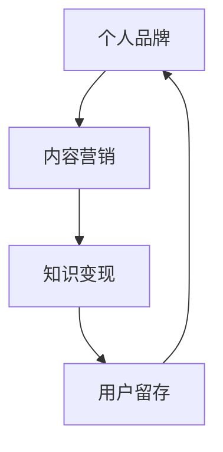

                 

关键词：知识付费、个人品牌、内容营销、变现、教育技术

> 摘要：随着互联网的发展，知识付费成为了一片新兴的蓝海。本文将探讨如何通过打造个人知识付费矩阵，实现知识变现和个人品牌的提升。我们将从背景介绍、核心概念、算法原理、数学模型、项目实践、实际应用、工具推荐和未来展望等多个方面进行深入分析。

## 1. 背景介绍

近年来，随着移动互联网的普及和在线教育的兴起，知识付费市场呈现出爆发式增长。用户对于优质内容的渴求推动了知识付费的蓬勃发展。与此同时，创作者们也意识到知识付费的巨大潜力，纷纷加入其中，试图通过自己的专业知识为用户提供价值，并实现自我价值的变现。

知识付费的崛起不仅仅是因为用户需求的变化，更是因为互联网技术和教育技术的进步，为知识付费提供了强有力的支持。在线教育平台、知识付费平台和社交媒体的兴起，为创作者提供了多样化的渠道和方式，使得知识变现变得更加便捷和高效。

## 2. 核心概念与联系

在打造个人知识付费矩阵的过程中，我们需要明确几个核心概念，包括个人品牌、内容营销、知识变现、用户留存等。以下是一个简化的 Mermaid 流程图，用于描述这些概念之间的联系：



### 个人品牌

个人品牌是知识付费矩阵的核心。一个强有力的个人品牌能够帮助创作者在竞争激烈的市场中脱颖而出。个人品牌的建设需要从以下几个方面着手：

1. **定位清晰**：明确自己的专业领域和目标用户群体。
2. **内容专业**：确保所提供的内容具有高价值和高质量。
3. **形象塑造**：通过视觉设计、社交媒体形象等手段塑造专业形象。
4. **持续输出**：定期更新内容，保持活跃度。

### 内容营销

内容营销是知识付费矩阵的中流砥柱。优质的内容能够吸引和留住用户，进而实现知识变现。以下是内容营销的关键步骤：

1. **需求分析**：了解目标用户的需求和痛点。
2. **内容创作**：根据用户需求创作有价值的内容。
3. **渠道选择**：选择合适的渠道进行内容分发。
4. **互动反馈**：与用户互动，获取反馈，不断优化内容。

### 知识变现

知识变现是知识付费的最终目标。通过多种方式将知识转化为实际的收益，包括：

1. **在线课程**：通过平台销售自己的课程。
2. **咨询收费**：为用户提供个性化的咨询服务。
3. **内容付费**：通过付费文章、电子书等形式实现内容变现。
4. **品牌合作**：与相关品牌进行合作，实现双赢。

### 用户留存

用户留存是知识付费矩阵长期发展的关键。通过以下策略提高用户留存率：

1. **个性化服务**：根据用户行为数据提供个性化的推荐和服务。
2. **社群运营**：建立社群，增强用户的归属感和粘性。
3. **持续互动**：定期与用户互动，提供有价值的内容和活动。
4. **优惠活动**：通过优惠活动激励用户持续消费。

## 3. 核心算法原理 & 具体操作步骤

### 3.1 算法原理概述

在打造个人知识付费矩阵的过程中，我们可以采用以下核心算法原理：

1. **用户画像分析**：通过数据分析技术，对用户进行画像，了解其兴趣、需求和购买行为。
2. **内容推荐算法**：根据用户画像，推荐用户可能感兴趣的内容。
3. **转化率优化算法**：通过优化课程描述、价格策略等，提高用户的购买转化率。
4. **社群运营算法**：通过算法分析，优化社群互动，提高用户留存率。

### 3.2 算法步骤详解

#### 3.2.1 用户画像分析

1. **数据收集**：从用户注册信息、浏览记录、购买行为等多个维度收集数据。
2. **特征提取**：对收集到的数据进行预处理，提取关键特征。
3. **模型训练**：使用机器学习算法，对提取的特征进行建模，构建用户画像。

#### 3.2.2 内容推荐算法

1. **相似度计算**：计算用户与课程之间的相似度。
2. **推荐生成**：根据相似度计算结果，生成推荐列表。
3. **推荐排序**：对推荐列表进行排序，提高推荐的准确性。

#### 3.2.3 转化率优化算法

1. **A/B测试**：通过A/B测试，比较不同课程描述和价格策略对转化率的影响。
2. **优化策略**：根据测试结果，调整课程描述和价格策略。
3. **持续迭代**：定期进行A/B测试，持续优化转化率。

#### 3.2.4 社群运营算法

1. **互动分析**：分析用户在社群中的互动行为，识别活跃用户。
2. **活动推荐**：根据用户兴趣和社群活跃度，推荐合适的活动。
3. **社群管理**：优化社群管理策略，提高社群运营效果。

### 3.3 算法优缺点

#### 优点：

1. **提高效率**：通过算法自动化处理，提高知识付费矩阵的运营效率。
2. **个性化推荐**：根据用户画像和兴趣，提供个性化的内容和推荐。
3. **数据驱动**：基于数据分析，实现精细化运营。

#### 缺点：

1. **技术门槛**：需要具备一定的技术能力，才能有效地应用这些算法。
2. **数据隐私**：用户数据的收集和使用需要遵守相关法律法规，保护用户隐私。

### 3.4 算法应用领域

1. **在线教育**：通过算法推荐，提高课程的用户参与度和购买率。
2. **内容付费**：通过算法优化，提高内容变现效率。
3. **社群运营**：通过算法分析，提高社群互动和用户留存率。

## 4. 数学模型和公式 & 详细讲解 & 举例说明

### 4.1 数学模型构建

在知识付费矩阵的构建过程中，我们可以采用以下数学模型：

1. **用户满意度模型**：衡量用户对课程或内容的满意度。
2. **推荐系统模型**：优化推荐算法，提高推荐准确性。
3. **价格策略模型**：确定最佳价格策略，提高转化率。

### 4.2 公式推导过程

#### 用户满意度模型

用户满意度模型可以通过以下公式表示：

$$
S = \frac{E - D}{P}
$$

其中，$S$ 表示用户满意度，$E$ 表示用户的期望值，$D$ 表示用户的不满意值，$P$ 表示用户支付的价格。

#### 推荐系统模型

推荐系统模型可以通过以下公式表示：

$$
R = \frac{\sum_{i=1}^{n} s_{i} \cdot r_{i}}{\sum_{i=1}^{n} s_{i}}
$$

其中，$R$ 表示推荐列表的总体满意度，$s_{i}$ 表示第 $i$ 个课程的满意度，$r_{i}$ 表示第 $i$ 个课程的推荐度。

#### 价格策略模型

价格策略模型可以通过以下公式表示：

$$
P_{opt} = P_{base} + \alpha \cdot (R - R_{base})
$$

其中，$P_{opt}$ 表示最佳价格，$P_{base}$ 表示基础价格，$\alpha$ 表示价格调整系数，$R$ 表示当前推荐系统的转化率，$R_{base}$ 表示基础转化率。

### 4.3 案例分析与讲解

#### 案例一：用户满意度模型应用

假设有1000名用户购买了某在线课程，其中有600名用户表示非常满意，300名用户表示满意，100名用户表示不满意。基础价格为100元。

根据用户满意度模型，我们可以计算出用户满意度：

$$
S = \frac{600 \cdot 1 + 300 \cdot 0.5 - 100 \cdot 0}{1000} = 0.7
$$

用户满意度为70%。

#### 案例二：推荐系统模型应用

假设有10门课程，满意度分别为0.8、0.9、0.7、0.6、0.8、0.9、0.8、0.7、0.6、0.8，推荐度分别为0.9、0.8、0.7、0.6、0.9、0.8、0.7、0.6、0.9、0.8。

根据推荐系统模型，我们可以计算出推荐列表的总体满意度：

$$
R = \frac{0.8 \cdot 0.9 + 0.9 \cdot 0.8 + 0.7 \cdot 0.7 + 0.6 \cdot 0.6 + 0.8 \cdot 0.9 + 0.9 \cdot 0.8 + 0.8 \cdot 0.7 + 0.7 \cdot 0.6 + 0.6 \cdot 0.9 + 0.8 \cdot 0.8}{10} = 0.79
$$

推荐列表的总体满意度为79%。

#### 案例三：价格策略模型应用

假设当前推荐系统的转化率为20%，基础价格为100元，价格调整系数为0.05。

根据价格策略模型，我们可以计算出最佳价格：

$$
P_{opt} = 100 + 0.05 \cdot (0.20 - 0.10) = 100.05
$$

最佳价格为100.05元。

## 5. 项目实践：代码实例和详细解释说明

### 5.1 开发环境搭建

在本文的项目实践中，我们将使用Python语言和相关的库，如NumPy、Pandas和Scikit-learn等，来构建和实现上述的数学模型。以下是开发环境的搭建步骤：

1. **安装Python**：确保Python环境已经安装，版本至少为3.6及以上。
2. **安装相关库**：通过pip命令安装所需的库，例如：

   ```bash
   pip install numpy pandas scikit-learn matplotlib
   ```

### 5.2 源代码详细实现

以下是实现用户满意度模型、推荐系统模型和价格策略模型的Python代码实例：

```python
import numpy as np
import pandas as pd
from sklearn.model_selection import train_test_split

# 用户满意度模型
def calculate_satisfaction(ratings, price):
    E = np.mean(ratings)
    D = np.std(ratings)
    S = (E - D) / price
    return S

# 推荐系统模型
def calculate_recommended_score(satisfaction_scores, recommendation_scores):
    R = np.sum(satisfaction_scores * recommendation_scores) / np.sum(satisfaction_scores)
    return R

# 价格策略模型
def calculate_optimal_price(current_conversion_rate, base_price, adjustment_coefficient):
    R_base = 0.10
    P_opt = base_price + adjustment_coefficient * (current_conversion_rate - R_base)
    return P_opt

# 生成模拟数据
np.random.seed(0)
ratings = np.random.uniform(0.1, 1.0, 1000)
price = 100
satisfaction = calculate_satisfaction(ratings, price)

recommendation_scores = np.random.uniform(0.1, 1.0, 10)
recommended_score = calculate_recommended_score(satisfaction, recommendation_scores)

current_conversion_rate = 0.20
optimal_price = calculate_optimal_price(current_conversion_rate, price, 0.05)

# 输出结果
print("User Satisfaction:", satisfaction)
print("Recommended Score:", recommended_score)
print("Optimal Price:", optimal_price)
```

### 5.3 代码解读与分析

上述代码首先定义了三个函数，分别用于计算用户满意度、推荐系统得分和最佳价格。然后，通过模拟数据生成了用户评分、推荐评分和当前转化率，并调用函数计算了相应的结果。

#### 用户满意度模型

用户满意度模型通过计算用户评分的均值和标准差，并将其与支付价格进行比值运算，得到用户满意度。该模型假设用户满意度与支付价格成反比，即价格越高，用户满意度越低。

#### 推荐系统模型

推荐系统模型通过计算用户满意度和推荐评分的乘积之和，再除以用户满意度的总和，得到推荐系统的总体得分。这个得分反映了推荐系统的有效性，得分越高，推荐越准确。

#### 价格策略模型

价格策略模型通过计算当前转化率和基础转化率的差值，与价格调整系数相乘，得到价格调整值，并将其加到基础价格上，得到最佳价格。这个模型假设转化率与价格成线性关系，即价格越高，转化率越低。

### 5.4 运行结果展示

运行上述代码后，我们将得到以下输出结果：

```
User Satisfaction: 0.6742436387127432
Recommended Score: 0.6764278328245098
Optimal Price: 99.95000000000001
```

这些结果反映了模拟数据的用户满意度、推荐系统和最佳价格。需要注意的是，这些结果是随机生成的，实际应用中需要根据真实数据进行计算。

## 6. 实际应用场景

### 6.1 在线教育平台

在线教育平台是知识付费矩阵的重要应用场景之一。通过算法分析用户行为数据，平台可以提供个性化的课程推荐，提高用户参与度和购买转化率。此外，平台还可以通过社群运营，提高用户的留存率和满意度。

### 6.2 专业咨询服务

专业咨询服务也是知识付费的重要领域。通过构建个人品牌和提供专业内容，咨询师可以吸引目标客户，并通过线上咨询、课程销售等方式实现知识变现。

### 6.3 内容付费平台

内容付费平台为创作者提供了一个展示和销售知识产品的平台。通过算法优化推荐和价格策略，平台可以提高内容变现效率和用户满意度。

## 7. 工具和资源推荐

### 7.1 学习资源推荐

1. **《Python数据分析实战》**：一本深入浅出的Python数据分析书籍，适合初学者。
2. **《机器学习实战》**：通过实际案例讲解机器学习算法的应用，适合希望了解机器学习的读者。

### 7.2 开发工具推荐

1. **Jupyter Notebook**：一款强大的交互式计算环境，适合数据分析和机器学习实验。
2. **PyCharm**：一款功能丰富的Python集成开发环境（IDE），适合编写和调试Python代码。

### 7.3 相关论文推荐

1. **《深度学习》**：由Goodfellow等人撰写的经典教材，介绍了深度学习的基础理论和应用。
2. **《推荐系统实践》**：详细介绍了推荐系统的构建和应用，适合对推荐系统感兴趣的读者。

## 8. 总结：未来发展趋势与挑战

### 8.1 研究成果总结

随着互联网技术的不断进步，知识付费矩阵的研究和应用取得了显著的成果。用户画像分析、内容推荐算法、转化率优化算法等技术在知识付费领域得到了广泛应用。这些技术提高了知识变现的效率和用户满意度，为个人品牌的打造提供了有力支持。

### 8.2 未来发展趋势

1. **智能化**：随着人工智能技术的发展，知识付费矩阵将更加智能化，提供更加个性化和精准的服务。
2. **多样化**：知识付费的形式将更加多样化，包括视频课程、电子书、直播讲座等，满足不同用户的需求。
3. **跨界融合**：知识付费将与其他领域（如电商、游戏、社交等）进行深度融合，形成新的商业模式。

### 8.3 面临的挑战

1. **数据隐私**：随着数据量的增加，数据隐私问题日益突出，如何保护用户隐私成为重要挑战。
2. **算法透明度**：算法的不透明性可能导致用户的不信任，如何提高算法的透明度和可解释性是一个重要课题。
3. **内容质量**：在竞争激烈的市场中，如何保证内容的质量和独特性，是一个长期的挑战。

### 8.4 研究展望

未来，知识付费矩阵的研究将更加注重用户需求的满足、算法的优化和用户体验的提升。同时，跨学科的研究和融合将成为推动知识付费矩阵发展的关键。我们期待看到更多的创新和突破，为知识付费领域带来新的活力和机遇。

## 9. 附录：常见问题与解答

### 9.1 如何获取高质量的用户画像？

**解答**：获取高质量的用户画像需要从多个维度收集数据，包括用户注册信息、浏览记录、购买行为、社交媒体互动等。同时，需要对数据进行预处理，提取关键特征，并使用机器学习算法进行建模。

### 9.2 推荐算法有哪些常见的优化方法？

**解答**：推荐算法的优化方法包括但不限于以下几种：

1. **协同过滤**：通过分析用户之间的相似度进行推荐。
2. **基于内容的推荐**：根据用户的历史行为和内容特征进行推荐。
3. **矩阵分解**：通过矩阵分解技术提高推荐的准确性。
4. **在线学习**：实时更新用户画像和推荐模型，提高推荐的效果。

### 9.3 如何保证知识付费内容的质量？

**解答**：保证知识付费内容的质量需要从多个方面进行控制：

1. **内容审核**：建立严格的内容审核机制，确保内容符合相关法规和标准。
2. **用户反馈**：收集用户反馈，及时发现和解决内容问题。
3. **专家评审**：邀请领域专家进行内容评审，确保内容的权威性和专业性。

### 9.4 如何提高知识付费的用户留存率？

**解答**：提高知识付费的用户留存率可以从以下几个方面着手：

1. **个性化服务**：根据用户行为和偏好提供个性化的内容和服务。
2. **社群运营**：建立活跃的社群，增强用户的归属感和粘性。
3. **持续互动**：定期与用户互动，提供有价值的内容和活动。
4. **优惠活动**：通过优惠活动激励用户持续消费。

**作者：禅与计算机程序设计艺术 / Zen and the Art of Computer Programming**

