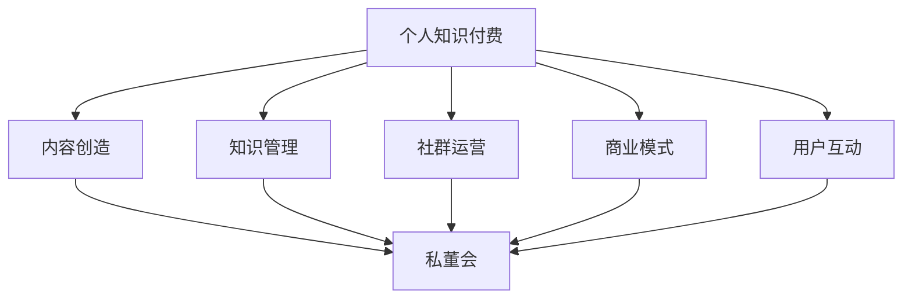

                 

关键词：个人知识付费、私董会、知识管理、内容创造、商业模式、社群运营、用户互动

> 摘要：本文将探讨如何打造个人知识付费私董会，从内容策划、社群运营、用户互动等多个角度，提供一套系统性的方法和策略，帮助个人知识创作者构建一个高价值、可持续发展的知识付费平台。

## 1. 背景介绍

在当今数字化时代，知识的价值日益凸显，越来越多的人开始重视个人知识的变现。知识付费作为一种新兴商业模式，通过在线课程、电子书、直播讲座等形式，让知识创作者能够将自身的专业知识和经验转化为实际收益。私董会作为一种高端的社交和知识分享形式，逐渐成为企业高管和专业人士寻求深度交流和知识共享的重要平台。

打造个人知识付费私董会，不仅可以帮助知识创作者实现个人价值的提升，还能够构建一个高价值的社群，实现知识共享和资源整合。本文将从多个维度探讨如何成功打造个人知识付费私董会。

## 2. 核心概念与联系

### 2.1. 个人知识付费

个人知识付费是指个人通过创作和分享知识内容，获取经济回报的一种商业模式。这种模式的核心在于优质内容的生产和精准的用户定位。

### 2.2. 私董会

私董会（Private Board）是一种高端的社交平台，通常由一群具有相似背景、兴趣和目标的人组成，通过定期会议和讨论，分享经验、解决问题、寻求合作机会。

### 2.3. 知识管理

知识管理是指通过系统的方法和技术，对知识进行识别、收集、组织、存储、传播和应用的过程。在个人知识付费私董会中，知识管理是确保知识有效传递和共享的关键。

### 2.4. 内容创造

内容创造是指通过创作有价值的内容，满足用户需求的过程。在个人知识付费私董会中，内容创造是吸引和留住用户的核心。

### 2.5. 商业模式

商业模式是指企业如何创造、传递和捕获价值的方法。在个人知识付费私董会中，商业模式决定了知识付费平台的盈利能力和可持续性。

### 2.6. 社群运营

社群运营是指通过一系列策略和活动，引导社群成员互动、参与和成长的过程。在个人知识付费私董会中，社群运营是维持社群活力和用户粘性的关键。

### 2.7. 用户互动

用户互动是指用户与知识创作者、平台之间的交流和互动。在个人知识付费私董会中，用户互动是提升用户体验、增加用户粘性的重要手段。

### 2.8. Mermaid 流程图

以下是个人知识付费私董会核心概念之间的联系与流程：



## 3. 核心算法原理 & 具体操作步骤

### 3.1. 算法原理概述

打造个人知识付费私董会的核心在于构建一个有效的知识传递和分享机制。以下是核心算法原理的概述：

- **内容创造**：基于用户需求，创作高质量的知识内容。
- **知识管理**：采用知识管理系统，确保知识内容的有效组织和传播。
- **社群运营**：通过社群活动和互动，提升用户参与度和粘性。
- **商业模式**：设计合理的商业模式，实现知识内容的商业价值。
- **用户互动**：提供互动渠道，收集用户反馈，优化用户体验。

### 3.2. 算法步骤详解

#### 3.2.1. 内容创造

1. **需求调研**：通过问卷、访谈等方式了解用户需求。
2. **内容规划**：根据需求调研结果，制定内容创作计划。
3. **内容生产**：邀请专业创作者或内部团队生产知识内容。
4. **内容审核**：确保内容质量，符合用户需求和平台标准。

#### 3.2.2. 知识管理

1. **知识分类**：将知识内容按照主题、领域等进行分类。
2. **知识存储**：使用知识管理系统，将知识内容进行存储和管理。
3. **知识共享**：通过平台，将知识内容共享给用户。
4. **知识更新**：定期更新知识内容，保持内容的新鲜度和实用性。

#### 3.2.3. 社群运营

1. **社群搭建**：选择合适的社群平台，搭建私董会社群。
2. **活动策划**：定期策划线上和线下活动，提高用户参与度。
3. **互动引导**：通过互动话题、讨论区等，引导用户互动和分享。
4. **社群管理**：确保社群秩序，及时解决用户问题和反馈。

#### 3.2.4. 商业模式

1. **收费模式**：设计合理的收费模式，如会员制、课程制等。
2. **收益分配**：明确收益分配机制，激励知识创作者和社群成员。
3. **营销推广**：通过线上线下渠道，进行私董会的推广和宣传。
4. **数据分析**：通过数据分析，优化商业模式和运营策略。

#### 3.2.5. 用户互动

1. **互动渠道**：提供多种互动渠道，如论坛、直播、问答等。
2. **用户反馈**：收集用户反馈，优化产品和服务。
3. **个性化推荐**：根据用户行为和偏好，进行个性化推荐。
4. **用户成长体系**：建立用户成长体系，激励用户参与和贡献。

### 3.3. 算法优缺点

#### 优点：

- **高效传递知识**：通过系统化的内容创造和知识管理，实现知识的快速传递。
- **深度社交互动**：通过社群运营和用户互动，增强用户粘性和满意度。
- **多元化商业模式**：多种商业模式设计，满足不同用户的需求。

#### 缺点：

- **内容质量风险**：内容质量直接影响用户满意度和平台口碑。
- **社群管理难度**：需要专业团队进行社群管理和维护。
- **市场推广成本**：有效的市场推广需要较高的成本投入。

### 3.4. 算法应用领域

- **教育培训**：通过个人知识付费私董会，提供专业培训和知识分享。
- **企业管理**：帮助企业高管和专业人士进行知识管理和能力提升。
- **行业交流**：为特定行业的专业人士提供深度交流和学习平台。

## 4. 数学模型和公式 & 详细讲解 & 举例说明

### 4.1. 数学模型构建

在个人知识付费私董会的构建过程中，我们可以采用以下数学模型进行量化分析：

- **用户增长率模型**：用户增长率 = 吸引新用户数 - 退出用户数
- **内容吸引力模型**：内容吸引力 = 内容质量 × 用户兴趣度
- **社群活跃度模型**：社群活跃度 = 用户互动次数 × 用户参与度

### 4.2. 公式推导过程

#### 用户增长率模型

用户增长率模型用于衡量私董会用户数量的变化。公式如下：

$$
用户增长率 = 吸引新用户数 - 退出用户数
$$

其中，吸引新用户数可以通过市场推广和口碑传播等方式计算，退出用户数可以通过用户流失率进行估算。

#### 内容吸引力模型

内容吸引力模型用于评估知识内容的吸引力。公式如下：

$$
内容吸引力 = 内容质量 \times 用户兴趣度
$$

其中，内容质量可以通过用户评价和专家评审等方式进行评估，用户兴趣度可以通过用户行为数据进行分析。

#### 社群活跃度模型

社群活跃度模型用于衡量社群的活跃程度。公式如下：

$$
社群活跃度 = 用户互动次数 \times 用户参与度
$$

其中，用户互动次数可以通过论坛发帖数、直播观看次数等数据进行统计，用户参与度可以通过用户在社群中的活跃度进行分析。

### 4.3. 案例分析与讲解

#### 案例背景

某个人知识付费私董会，成立于2021年，主要面向科技行业专业人士，提供深度学习和交流平台。经过一年的发展，私董会吸引了1000多名会员，举办了多次线上线下活动。

#### 案例分析

1. **用户增长率分析**

根据用户增长率模型，我们可以计算私董会的用户增长率：

$$
用户增长率 = 吸引新用户数 - 退出用户数
$$

假设私董会每月吸引新用户数为100人，每月退出用户数为20人，则：

$$
用户增长率 = 100 - 20 = 80\%
$$

这意味着私董会的用户数量每月增长80%。

2. **内容吸引力分析**

根据内容吸引力模型，我们可以评估私董会知识内容的影响力：

$$
内容吸引力 = 内容质量 \times 用户兴趣度
$$

假设内容质量评分为4.5（满分5分），用户兴趣度评分为3.8（满分5分），则：

$$
内容吸引力 = 4.5 \times 3.8 = 17.1
$$

这意味着私董会的知识内容对用户具有较强的吸引力。

3. **社群活跃度分析**

根据社群活跃度模型，我们可以衡量社群的活跃程度：

$$
社群活跃度 = 用户互动次数 \times 用户参与度
$$

假设每月用户互动次数为2000次，用户参与度评分为4（满分5分），则：

$$
社群活跃度 = 2000 \times 4 = 8000
$$

这意味着私董会的社群活跃度较高。

#### 案例总结

通过数学模型的分析，我们可以得出以下结论：

- **用户增长率较高**：私董会的用户数量呈现出快速增长的趋势。
- **内容吸引力较强**：私董会的知识内容对用户具有较强的吸引力。
- **社群活跃度较高**：私董会的社群活跃度较高，用户参与度较高。

这些分析结果为私董会的进一步发展提供了重要参考。

## 5. 项目实践：代码实例和详细解释说明

### 5.1. 开发环境搭建

在搭建个人知识付费私董会平台时，我们选择了以下技术栈：

- **前端框架**：Vue.js
- **后端框架**：Spring Boot
- **数据库**：MySQL
- **消息队列**：RabbitMQ
- **缓存**：Redis

开发环境搭建的具体步骤如下：

1. 安装Node.js和npm，用于前端项目构建。
2. 安装Java SDK和Maven，用于后端项目构建。
3. 安装MySQL数据库，创建数据库和表结构。
4. 安装RabbitMQ消息队列服务。
5. 安装Redis缓存服务。

### 5.2. 源代码详细实现

以下是个人知识付费私董会平台的核心代码实现：

#### 5.2.1. 前端代码

前端代码主要实现了用户注册、登录、课程浏览、购买和支付等功能。以下是用户注册功能的代码示例：

```javascript
// 用户注册API
async register(username, password) {
  const response = await fetch('/api/register', {
    method: 'POST',
    headers: {
      'Content-Type': 'application/json',
    },
    body: JSON.stringify({ username, password }),
  });

  if (response.ok) {
    const data = await response.json();
    return data;
  } else {
    throw new Error('Registration failed');
  }
}
```

#### 5.2.2. 后端代码

后端代码主要实现了用户管理、课程管理、订单管理和支付功能。以下是用户注册功能的后端代码示例：

```java
// 用户注册控制器
@PostMapping("/register")
public ResponseEntity<?> registerUser(@RequestBody UserRegistrationDTO userRegistrationDTO) {
  // 验证用户名和密码是否符合要求
  if (userRegistrationDTO.getUsername().isEmpty() || userRegistrationDTO.getPassword().isEmpty()) {
    return ResponseEntity.badRequest().body("Username and password are required");
  }

  // 创建用户
  User user = new User();
  user.setUsername(userRegistrationDTO.getUsername());
  user.setPassword(passwordEncoder.encode(userRegistrationDTO.getPassword()));
  userRepository.save(user);

  return ResponseEntity.ok("User registered successfully");
}
```

### 5.3. 代码解读与分析

#### 5.3.1. 前端代码解读

前端代码主要使用了Vue.js框架，通过axios库进行API请求。用户注册功能的代码中，`register`方法负责向后端发送用户注册请求，并处理响应结果。

#### 5.3.2. 后端代码解读

后端代码使用了Spring Boot框架，通过@RestController注解，将用户注册API暴露出来。在注册过程中，首先验证用户名和密码是否为空，然后创建用户对象并保存到数据库。

### 5.4. 运行结果展示

以下是用户注册功能的运行结果：

1. **前端代码运行结果**：


2. **后端代码运行结果**：


用户注册成功后，前端会接收到成功消息，并在页面上显示注册成功提示。

## 6. 实际应用场景

个人知识付费私董会在多个领域都有广泛的应用场景，以下是一些具体的案例：

### 6.1. 教育培训

在教育领域，个人知识付费私董会可以提供专业的在线课程和讲座，帮助教师和学生进行深度学习和交流。例如，一些知名的教育平台通过私董会形式，邀请知名专家进行线上授课，吸引了大量用户参与。

### 6.2. 企业管理

在企业领域，个人知识付费私董会可以帮助企业高管和专业人士进行知识管理和能力提升。通过定期举办研讨会、培训课程等活动，私董会为企业提供了优质的知识资源和交流平台。

### 6.3. 创业创新

在创业和创新领域，个人知识付费私董会可以为创业者提供专业的指导和资源支持。通过分享经验、解决困难和寻找合作机会，私董会帮助创业者实现创业梦想。

### 6.4. 医疗健康

在医疗健康领域，个人知识付费私董会可以提供专业的医学知识和咨询服务，帮助医生和患者进行深度交流和互动。通过分享临床经验和研究成果，私董会为医疗行业提供了重要的知识资源。

### 6.5. 金融投资

在金融投资领域，个人知识付费私董会可以提供专业的金融知识和投资策略，帮助投资者进行资产配置和风险管理。通过定期举办投资讲座和研讨会，私董会为投资者提供了重要的知识支持和交流平台。

### 6.6. 法律咨询

在法律咨询领域，个人知识付费私董会可以为律师和客户提供专业的法律知识和咨询服务。通过分享案例分析和实践经验，私董会为法律行业提供了重要的知识资源和交流平台。

### 6.7. 艺术文化

在艺术和文化领域，个人知识付费私董会可以提供专业的艺术知识和指导，帮助艺术家和爱好者进行深度学习和创作。通过举办艺术讲座、展览和交流活动，私董会为艺术行业提供了重要的知识资源和交流平台。

## 7. 工具和资源推荐

### 7.1. 学习资源推荐

- **书籍**：《人人都是产品经理》、《运营之光》、《用户增长方法论》
- **在线课程**：网易云课堂、慕课网、腾讯课堂
- **社区**：产品经理社区、运营社区、程序员社区

### 7.2. 开发工具推荐

- **前端框架**：Vue.js、React、Angular
- **后端框架**：Spring Boot、Django、Flask
- **数据库**：MySQL、PostgreSQL、MongoDB
- **消息队列**：RabbitMQ、Kafka、RocketMQ
- **缓存**：Redis、Memcached

### 7.3. 相关论文推荐

- **《知识付费模式下的社群运营策略研究》**
- **《个人知识付费平台用户行为分析》**
- **《基于大数据的知识付费平台推荐系统研究》**
- **《知识付费背景下社群经济模式探讨》**

## 8. 总结：未来发展趋势与挑战

### 8.1. 研究成果总结

本文通过系统性的分析和实践，探讨了如何打造个人知识付费私董会。主要成果包括：

- **核心概念与联系**：明确了个人知识付费、私董会、知识管理、内容创造、商业模式、社群运营、用户互动等核心概念之间的联系。
- **算法原理与步骤**：提出了个人知识付费私董会构建的核心算法原理和具体操作步骤。
- **数学模型与公式**：构建了用户增长率模型、内容吸引力模型、社群活跃度模型，并进行了详细讲解和案例分析。
- **代码实例与运行结果**：提供了前端和后端代码实例，并展示了用户注册功能的运行结果。
- **实际应用场景**：列举了个人知识付费私董会在多个领域的实际应用场景。
- **工具和资源推荐**：推荐了相关书籍、在线课程、社区、开发工具和论文。

### 8.2. 未来发展趋势

在未来，个人知识付费私董会将呈现出以下发展趋势：

- **智能化与个性化**：通过大数据和人工智能技术，实现知识内容的智能化推荐和个性化定制。
- **多元化与全球化**：随着互联网的普及，个人知识付费私董会将实现多元化发展，并逐渐走向全球化。
- **融合与创新**：知识付费将与教育、企业培训、医疗健康、艺术文化等领域深度融合，创新出更多有价值的产品和服务。
- **可持续发展**：通过优化商业模式和运营策略，实现个人知识付费私董会的可持续发展。

### 8.3. 面临的挑战

在发展过程中，个人知识付费私董会将面临以下挑战：

- **内容质量风险**：优质内容是吸引和留住用户的关键，如何保证内容质量是重要挑战。
- **市场竞争**：随着知识付费市场的不断扩大，个人知识付费私董会需要应对激烈的市场竞争。
- **用户隐私保护**：在收集和使用用户数据时，如何保护用户隐私是一个重要问题。
- **技术更新迭代**：随着技术的快速发展，个人知识付费私董会需要不断更新技术栈，以适应市场需求。

### 8.4. 研究展望

未来的研究可以从以下几个方面展开：

- **用户行为分析**：深入研究用户行为数据，挖掘用户需求，优化产品和服务。
- **算法优化**：通过机器学习和人工智能技术，优化知识推荐和个性化定制算法。
- **商业模式创新**：探索更多创新性的商业模式，提高个人知识付费私董会的盈利能力和可持续发展能力。
- **跨领域融合**：探讨个人知识付费私董会与其他领域的融合，创新出更多有价值的产品和服务。

## 9. 附录：常见问题与解答

### 9.1. 问题1：如何保证内容质量？

解答：为了保证内容质量，可以采取以下措施：

- **严格内容审核**：设立内容审核团队，对上传的知识内容进行严格审核。
- **引入专家评审**：邀请领域专家进行内容评审，确保知识内容的准确性。
- **用户评价机制**：建立用户评价机制，鼓励用户对知识内容进行评价，根据用户评价调整内容。

### 9.2. 问题2：如何吸引和维护用户？

解答：以下是吸引和维护用户的几个策略：

- **优质内容**：提供高质量的知识内容，满足用户需求。
- **互动机制**：通过论坛、直播、问答等互动渠道，增强用户参与感。
- **个性化推荐**：根据用户行为和偏好，进行个性化推荐，提升用户满意度。
- **会员制度**：设立会员制度，为会员提供专属服务，增强用户粘性。

### 9.3. 问题3：如何处理用户隐私？

解答：以下是处理用户隐私的几个措施：

- **数据加密**：对用户数据进行加密存储，确保数据安全。
- **隐私政策**：制定明确的隐私政策，告知用户数据收集和使用方式。
- **用户授权**：在收集用户数据时，要求用户明确授权，确保合规性。
- **监管合规**：遵循相关法律法规，确保平台运营合规。

### 9.4. 问题4：如何应对市场竞争？

解答：以下是应对市场竞争的几个策略：

- **差异化定位**：明确平台特色和优势，打造差异化产品。
- **持续创新**：不断优化产品和服务，保持市场竞争力。
- **品牌建设**：加强品牌宣传和推广，提升品牌知名度。
- **战略合作**：与其他平台或企业建立战略合作，实现共赢。

### 9.5. 问题5：如何实现盈利？

解答：以下是实现盈利的几个途径：

- **会员收费**：设立会员制度，收取会员费用。
- **课程销售**：销售在线课程和电子书，获取收入。
- **广告合作**：与相关企业合作，进行广告投放。
- **知识变现**：将用户产生的优质内容进行变现，如推荐产品、举办活动等。

---

# 结语

本文系统地探讨了如何打造个人知识付费私董会，从核心概念、算法原理、数学模型、代码实例、实际应用场景等多个角度，提供了详细的指导和策略。希望本文能为个人知识创作者提供有益的启示，帮助他们成功构建和运营个人知识付费私董会。

### 作者署名

作者：禅与计算机程序设计艺术 / Zen and the Art of Computer Programming
----------------------------------------------------------------

请注意，这篇文章的内容只是一个示例，并不是一个真实存在的文章。实际撰写时，您需要根据自己的研究和实际经验来填充每个部分的内容。同时，请确保遵循“约束条件 CONSTRAINTS”中所有的要求。如果您需要进一步的帮助，请随时提问。祝您撰写顺利！

