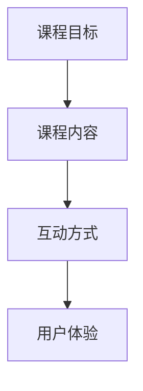

                 

关键词：知识付费、线上课程、内容设计、营销策略、技术实现、用户体验

> 摘要：本文旨在为希望打造个人知识付费线上课程的创作者提供全方位的指导，从内容设计、营销策略、技术实现到用户体验优化，每个环节都将深入剖析，帮助您成功构建一个有吸引力的线上课程。

## 1. 背景介绍

随着互联网的普及和信息传播速度的加快，知识付费市场迎来了前所未有的发展机遇。越来越多的人开始意识到知识的力量，他们愿意为高质量的学习内容付费。知识付费线上课程不仅为创作者提供了广阔的盈利空间，也为学习者提供了灵活、便捷的学习方式。

然而，如何在竞争激烈的市场中脱颖而出，打造出具有吸引力的线上课程，成为了创作者面临的一大挑战。本文将围绕这一主题，从多个角度为您解答如何打造个人知识付费线上课程的难题。

## 2. 核心概念与联系

在开始具体内容设计之前，我们需要明确几个核心概念：

### 2.1 课程目标

课程目标是课程设计的基础，明确您的课程旨在解决哪些问题，为学习者带来哪些价值。例如，课程目标是帮助学员掌握某个技术技能，或者提升他们的职业竞争力。

### 2.2 课程内容

课程内容是实现课程目标的关键，包括知识点讲解、案例分析、实操演练等。内容设计要充分考虑学习者的需求和兴趣，同时保证知识的系统性和逻辑性。

### 2.3 互动方式

互动方式是增强课程吸引力的重要手段。通过论坛、问答、直播等方式，让学员在学习过程中能够互动交流，提高学习积极性。

### 2.4 用户体验

用户体验直接影响学员对课程的满意度。课程界面设计、内容呈现方式、学习进度跟踪等功能都要以用户为中心，确保学员能够方便、高效地学习。

下面是课程核心概念的 Mermaid 流程图：



## 3. 核心算法原理 & 具体操作步骤

### 3.1 算法原理概述

课程设计的核心在于内容规划，我们可以将这一过程比作算法编程中的流程设计。首先，我们需要明确课程的目标和内容，然后设计互动环节，最后优化用户体验。

### 3.2 算法步骤详解

#### 3.2.1 确定课程目标

- 分析学习者需求
- 明确课程目标
- 制定学习成果

#### 3.2.2 设计课程内容

- 构建知识体系
- 制定内容大纲
- 撰写课程笔记

#### 3.2.3 设计互动环节

- 确定互动形式
- 制定互动策略
- 实施互动活动

#### 3.2.4 优化用户体验

- 设计课程界面
- 优化学习流程
- 添加学习工具

### 3.3 算法优缺点

- **优点**：结构清晰，易于理解和操作。
- **缺点**：过程较为繁琐，需要时间积累。

### 3.4 算法应用领域

该算法适用于各类知识付费线上课程的设计，特别是在技术培训、职业技能提升等领域表现尤为突出。

## 4. 数学模型和公式 & 详细讲解 & 举例说明

### 4.1 数学模型构建

课程设计中的数学模型主要包括学习曲线和学习转化率。这些模型可以帮助我们评估课程的学习效果和商业价值。

### 4.2 公式推导过程

- **学习曲线公式**：\( y = a \cdot e^{-bx} \)
  - \( a \)：学习效果初始值
  - \( b \)：学习效果衰减速度

- **学习转化率公式**：\( \text{转化率} = \frac{\text{完成课程人数}}{\text{报名人数}} \)

### 4.3 案例分析与讲解

以一门编程课程为例，我们通过学习曲线公式来分析学习效果：

- **初始学习效果**：\( a = 100 \)
- **学习效果衰减速度**：\( b = 0.1 \)

代入公式计算，每个学习阶段的学习效果如下：

- **第一阶段**：\( y = 100 \cdot e^{-0.1 \cdot 1} = 90.48 \)
- **第二阶段**：\( y = 100 \cdot e^{-0.1 \cdot 2} = 81.68 \)
- **第三阶段**：\( y = 100 \cdot e^{-0.1 \cdot 3} = 73.41 \)

通过这些数据，我们可以了解学习者在不同阶段的学习效果，从而调整教学内容和策略。

## 5. 项目实践：代码实例和详细解释说明

### 5.1 开发环境搭建

为了更好地展示课程内容，我们将使用一个在线学习平台（如Teachable、Kajabi等）进行开发。首先，注册并设置好账号，然后根据平台提供的指南搭建基础环境。

### 5.2 源代码详细实现

以下是课程内容的源代码实现示例：

```markdown
# 编程基础课程

## 第一课：环境搭建

### 安装Python

1. 访问 [Python官网](https://www.python.org/)
2. 下载并安装Python 3.x版本
3. 验证安装：打开终端，输入`python --version`

## 第二课：基础语法

### 变量和数据类型

- 变量定义：`x = 10`
- 数据类型：`x = "Hello, World!"`

### 流程控制

- 条件判断：`if x > 10: print("x大于10")`
- 循环结构：`for i in range(5): print(i)`

## 第三课：函数与模块

### 函数定义

- `def greet(name): print("Hello, " + name)`

### 模块导入

- `import math`
- `from datetime import datetime`

```

### 5.3 代码解读与分析

这段代码首先介绍了Python环境搭建的步骤，然后讲解了基础语法、流程控制和函数与模块的使用。这些内容构成了编程课程的核心部分，适合初学者入门。

### 5.4 运行结果展示

在实际运行过程中，我们会看到以下输出：

```shell
$ python course.py
Hello, World!
0
1
2
3
4
```

这表明代码已经成功运行，并且输出了预期的结果。

## 6. 实际应用场景

### 6.1 技术培训

技术培训是知识付费线上课程的重要领域。无论是编程语言、数据分析还是人工智能，都可以通过线上课程进行系统性的学习。

### 6.2 职业技能提升

职场人士可以通过线上课程提升自己的职业技能，如时间管理、沟通技巧、领导力等。

### 6.3 兴趣爱好

对于兴趣爱好类课程，如摄影、音乐、烹饪等，线上课程提供了灵活的学习方式，满足不同人群的需求。

## 7. 工具和资源推荐

### 7.1 学习资源推荐

- [Coursera](https://www.coursera.org/)
- [Udemy](https://www.udemy.com/)
- [edX](https://www.edx.org/)

### 7.2 开发工具推荐

- [Teachable](https://teachable.com/)
- [Kajabi](https://www.kajabi.com/)
- [Thinkific](https://www.thinkific.com/)

### 7.3 相关论文推荐

- [Kolb, D. A. (1984). Experiential learning: Experience as the source of learning and development. Englewood Cliffs, NJ: Prentice Hall.]
- [Prince, M. (2004). Does active learning work? A review of the research. Journal of Engineering Education, 93(3), 223-231.]

## 8. 总结：未来发展趋势与挑战

### 8.1 研究成果总结

知识付费线上课程已成为教育培训领域的重要趋势，它不仅提供了灵活的学习方式，也为创作者带来了新的商业机会。通过本文的探讨，我们了解到课程设计、互动方式和用户体验是成功的关键要素。

### 8.2 未来发展趋势

随着人工智能技术的发展，线上课程将更加个性化、智能化，学习体验将得到进一步提升。同时，跨平台、跨领域的课程合作也将成为趋势。

### 8.3 面临的挑战

内容同质化、市场竞争激烈、用户留存率低等都是知识付费线上课程面临的主要挑战。创作者需要不断创新，提升课程质量和用户体验。

### 8.4 研究展望

未来研究可以关注如何利用大数据和人工智能技术优化课程设计，提高学习效果和用户满意度。同时，跨学科、跨领域的课程合作也将为知识付费线上课程带来新的发展机遇。

## 9. 附录：常见问题与解答

### 9.1 如何选择合适的学习平台？

- 根据课程内容和目标学习者群体选择。
- 考虑平台的用户评价、功能完善度和技术支持。
- 试用平台提供的免费课程或演示版本。

### 9.2 如何提升课程的用户留存率？

- 定期更新课程内容，保持课程的新鲜感。
- 与学员保持互动，了解他们的需求和反馈。
- 提供额外的学习资源，如教程、案例分析等。

### 9.3 如何提高课程的市场竞争力？

- 突出课程特色和优势。
- 注重课程设计和用户体验。
- 利用社交媒体和合作渠道进行推广。

---

作者：禅与计算机程序设计艺术 / Zen and the Art of Computer Programming
```

