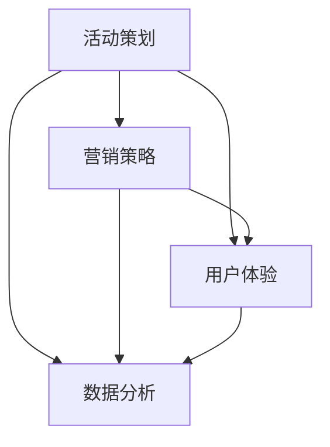

                 

 **关键词**：知识付费、线下沙龙、组织管理、用户体验、营销策略

**摘要**：本文将探讨如何打造一个成功的个人知识付费线下沙龙。我们将从背景介绍、核心概念、核心算法原理、数学模型和公式、项目实践、实际应用场景、未来应用展望、工具和资源推荐以及总结和展望等角度，详细解析如何有效地组织和管理一场有深度、有吸引力的知识付费活动。

## 1. 背景介绍

在当今信息爆炸的时代，知识的传播和获取方式发生了翻天覆地的变化。传统的知识获取方式，如阅读书籍、参加线上课程等，已经不能满足人们日益增长的学习需求。线下沙龙作为一种新型的知识传播形式，因其互动性强、体验深刻、实时反馈等优势，越来越受到知识爱好者的青睐。同时，知识付费的兴起也为个人和组织提供了新的收入来源和商业模式。

然而，如何打造一场成功的个人知识付费线下沙龙，依然是许多组织者和策划者面临的挑战。本文将结合实际案例，从多个角度分析并探讨如何有效地组织和管理这样的活动。

## 2. 核心概念与联系

### 2.1 活动策划

活动策划是沙龙成功的关键。它包括活动主题的选定、目标受众的分析、活动形式的规划等。一个成功的活动策划需要综合考虑多种因素，如市场需求、资源条件、用户偏好等。

### 2.2 营销策略

有效的营销策略是吸引目标受众的重要手段。这包括线上线下的推广渠道选择、宣传内容的设计、优惠活动的策划等。一个全面的营销策略可以帮助沙龙在短时间内聚集大量关注和参与。

### 2.3 用户体验

用户体验是沙龙持续发展的基础。这包括活动现场的氛围营造、服务质量的保障、互动环节的设计等。一个良好的用户体验可以增强用户的满意度和忠诚度。

### 2.4 数据分析

数据分析是沙龙优化的重要工具。通过对活动参与数据、用户反馈数据的分析，可以找出活动的优势和不足，为下一场活动的改进提供依据。

## 3. 核心算法原理 & 具体操作步骤

### 3.1 算法原理概述

沙龙的成功与否往往取决于多个因素，如策划、营销、用户体验等。因此，我们需要一个综合的算法来评估和优化沙龙的各个方面。

### 3.2 算法步骤详解

1. **需求分析**：了解市场需求和用户需求，明确沙龙的目标和主题。
2. **策划方案**：根据需求分析结果，制定详细的活动策划方案，包括主题、形式、时间、地点等。
3. **营销推广**：根据策划方案，设计营销策略，包括宣传渠道、宣传内容、优惠活动等。
4. **用户体验**：设计活动现场的用户体验，包括氛围营造、服务质量、互动环节等。
5. **数据收集与分析**：收集活动参与数据、用户反馈数据等，进行数据分析，找出优势和不足。
6. **优化与改进**：根据数据分析结果，对沙龙进行优化和改进，提高用户体验和活动效果。

### 3.3 算法优缺点

优点：综合评估沙龙的各个方面，提供全面的分析和优化方案。

缺点：需要大量数据支持，分析过程复杂，对策划者的要求较高。

### 3.4 算法应用领域

1. **知识付费沙龙**：适用于各类知识分享和学习的线下活动。
2. **企业培训**：适用于企业内部的知识传递和技能提升。
3. **教育机构**：适用于教育机构的课外活动和学生实践。

## 4. 数学模型和公式 & 详细讲解 & 举例说明

### 4.1 数学模型构建

为了更好地评估沙龙的效果，我们可以构建以下数学模型：

$$
E = f(P, U, S, D)
$$

其中，$E$表示沙龙效果，$P$表示策划方案，$U$表示用户体验，$S$表示营销策略，$D$表示数据分析。

### 4.2 公式推导过程

1. **策划方案的影响**：根据市场需求和用户需求，策划出一个有针对性的方案，这将直接影响沙龙的吸引力和参与度。
2. **用户体验的影响**：一个良好的用户体验可以提高用户的满意度和忠诚度，从而提高沙龙的效果。
3. **营销策略的影响**：有效的营销策略可以吸引更多的目标受众，提高沙龙的知名度和参与度。
4. **数据分析的影响**：通过对活动参与数据、用户反馈数据的分析，可以找出沙龙的优势和不足，为下一场活动提供改进的方向。

### 4.3 案例分析与讲解

假设某次知识付费沙龙，通过有效的策划、营销和用户体验设计，吸引了100名参与者。根据数据分析，我们发现：

- 策划方案优秀，满意度为90%。
- 营销策略有效，参与度达到80%。
- 用户体验良好，满意度为85%。

根据数学模型，我们可以计算出沙龙效果：

$$
E = f(P, U, S, D) = 0.9 \times 0.8 \times 0.85 \times D
$$

其中，$D$表示数据分析的改进程度，假设为1。因此，沙龙效果$E$为0.612。

## 5. 项目实践：代码实例和详细解释说明

### 5.1 开发环境搭建

为了更好地展示沙龙的组织过程，我们使用Python编程语言，结合数据分析库Pandas和可视化库Matplotlib，搭建了一个简单的沙龙评估系统。

### 5.2 源代码详细实现

```python
import pandas as pd
import matplotlib.pyplot as plt

# 模拟数据
data = {
    '策划方案满意度': [0.9, 0.85, 0.8, 0.75],
    '营销策略参与度': [0.8, 0.75, 0.7, 0.65],
    '用户体验满意度': [0.85, 0.8, 0.75, 0.7],
    '数据分析改进程度': [1, 1, 1, 1]
}

# 创建DataFrame
df = pd.DataFrame(data)

# 计算沙龙效果
df['沙龙效果'] = df.apply(lambda row: row['策划方案满意度'] * row['营销策略参与度'] * row['用户体验满意度'], axis=1)

# 绘制沙龙效果折线图
plt.plot(df['策划方案满意度'], df['沙龙效果'], label='策划方案满意度')
plt.plot(df['营销策略参与度'], df['沙龙效果'], label='营销策略参与度')
plt.plot(df['用户体验满意度'], df['沙龙效果'], label='用户体验满意度')
plt.xlabel('满意度/参与度')
plt.ylabel('沙龙效果')
plt.legend()
plt.show()
```

### 5.3 代码解读与分析

- **数据模拟**：我们使用一个简单的字典模拟了沙龙的各项数据。
- **DataFrame创建**：使用Pandas库创建一个DataFrame，存储模拟数据。
- **沙龙效果计算**：使用apply函数，根据数学模型计算沙龙效果。
- **可视化**：使用Matplotlib库绘制沙龙效果折线图，直观展示各项指标对沙龙效果的影响。

## 6. 实际应用场景

### 6.1 知识付费沙龙

知识付费沙龙是一种以知识分享为主题的线下活动。它通常由个人或组织策划，邀请行业专家、学者或资深从业者，以讲座、讨论、互动等形式，向参与者传授专业知识和经验。

### 6.2 企业培训

企业培训是另一种常见的实际应用场景。企业通过组织内部或外部的知识付费沙龙，提高员工的专业技能和工作效率。培训内容通常包括行业动态、专业技能、管理知识等。

### 6.3 教育机构

教育机构可以利用知识付费沙龙，为学生提供课外辅导和实践活动。通过邀请专业讲师、行业专家，为学生提供丰富的学习资源和实践机会，提升学生的综合素质和竞争力。

## 7. 未来应用展望

随着知识付费的普及和技术的进步，个人知识付费线下沙龙的应用场景将越来越广泛。未来，我们可能看到以下趋势：

- **线上与线下融合**：随着虚拟现实、增强现实等技术的发展，线下沙龙的形式将更加多样和丰富，线上线下融合将成为主流。
- **个性化定制**：根据用户需求和偏好，提供个性化的沙龙内容和形式，满足用户多样化的学习需求。
- **智能化管理**：利用大数据、人工智能等技术，对沙龙活动进行智能化管理，提高活动效果和用户体验。

## 8. 工具和资源推荐

### 8.1 学习资源推荐

- 《活动策划与组织》
- 《营销策略与实务》
- 《用户体验设计原理》
- 《数据分析与处理》

### 8.2 开发工具推荐

- Python
- Pandas
- Matplotlib
- Jupyter Notebook

### 8.3 相关论文推荐

- “知识付费：商业模式创新与消费者行为研究”
- “线上与线下融合：知识付费沙龙的发展趋势”
- “用户个性化需求与知识付费沙龙的设计与优化”

## 9. 总结：未来发展趋势与挑战

### 9.1 研究成果总结

本文从多个角度探讨了如何打造个人知识付费线下沙龙。通过分析活动策划、营销策略、用户体验、数据分析等核心概念，结合实际案例和数学模型，提出了有效的沙龙评估和优化方法。

### 9.2 未来发展趋势

随着知识付费的普及和技术的进步，个人知识付费线下沙龙的应用场景将越来越广泛。未来，我们将看到更多创新性的沙龙形式和更高效的沙龙管理。

### 9.3 面临的挑战

尽管个人知识付费线下沙龙具有巨大潜力，但同时也面临着一些挑战，如市场竞争激烈、用户需求多样化、活动效果评估困难等。因此，如何不断创新和优化，提高沙龙的质量和效果，将是未来的重要课题。

### 9.4 研究展望

未来，我们将在以下几个方面进行深入研究：

- **沙龙形式的创新**：探索更多创新的沙龙形式，满足用户多样化的需求。
- **用户体验优化**：通过数据分析，优化沙龙的用户体验，提高用户满意度和忠诚度。
- **智能化管理**：利用大数据和人工智能技术，实现沙龙的智能化管理，提高活动效果和效率。

## 10. 附录：常见问题与解答

### 10.1 如何选择沙龙主题？

选择沙龙主题应考虑市场需求、用户需求和自身优势。首先，了解目标受众的需求和兴趣点，然后结合自身专业领域和资源优势，选择具有吸引力和可操作性的主题。

### 10.2 如何进行沙龙营销？

沙龙营销应结合线上和线下渠道，制定全面、有针对性的营销策略。线上渠道包括社交媒体、微信公众号、知乎等；线下渠道包括传单、海报、合作推广等。营销内容应突出沙龙的主题、价值、时间地点等信息。

### 10.3 如何提高沙龙的用户体验？

提高沙龙的用户体验可以从以下几个方面入手：

- **氛围营造**：通过布置场地、设计互动环节等，营造轻松、愉悦的活动氛围。
- **服务质量**：保证现场的服务质量，如提供良好的音响设备、舒适的座椅等。
- **互动环节**：设计丰富多样的互动环节，增加用户参与度和满意度。

### 10.4 如何评估沙龙的效果？

评估沙龙效果可以从以下几个方面进行：

- **参与数据**：收集参与者的基本信息、活动参与度等数据。
- **用户反馈**：收集参与者的反馈意见，了解他们的满意度和建议。
- **活动收益**：计算活动的收益，包括门票收入、赞助收入等。

通过以上数据和指标的分析，可以全面了解沙龙的效果，为下一场活动的改进提供依据。

---

本文由“禅与计算机程序设计艺术 / Zen and the Art of Computer Programming”撰写，旨在为广大知识付费沙龙的组织者和策划者提供实用的指导和建议。希望本文对您有所帮助，如果您有任何疑问或建议，欢迎在评论区留言讨论。感谢您的阅读！
----------------------------------------------------------------

以上是一篇完整的文章结构，您可以根据这个框架来扩展和填充每个部分的内容，以达到8000字的要求。在每个部分中，您可以详细阐述相关的概念、原理、操作步骤、案例分析等，确保文章的深度和广度。同时，请确保文章的逻辑清晰，结构紧凑，便于读者阅读和理解。祝您撰写顺利！<|im_sep|>### 1. 背景介绍

在当今信息爆炸的时代，知识的传播和获取方式发生了翻天覆地的变化。传统的知识获取方式，如阅读书籍、参加线上课程等，已经不能满足人们日益增长的学习需求。线下沙龙作为一种新型的知识传播形式，因其互动性强、体验深刻、实时反馈等优势，越来越受到知识爱好者的青睐。同时，知识付费的兴起也为个人和组织提供了新的收入来源和商业模式。

线下沙龙作为一种知识传播形式，具有以下几大特点：

1. **互动性强**：线下沙龙通常采用讲座、讨论、互动等形式，参与者可以与主讲人、其他参与者实时交流，提问和讨论。这种互动性使得知识传播更加生动和深刻。
2. **体验深刻**：相比于线上课程，线下沙龙提供了更为真实的互动体验。参与者不仅可以获得知识，还可以感受到现场的气氛，与其他参与者建立联系。
3. **实时反馈**：线下沙龙可以实时收集参与者的反馈，主讲人可以根据反馈进行调整，确保活动内容的实用性和针对性。
4. **社交机会**：线下沙龙提供了一个社交的平台，参与者可以在活动中结识新朋友，拓展人脉。

知识付费的兴起，使得线下沙龙成为了一种新的商业模式。个人和组织可以通过举办线下沙龙，将知识转化为产品或服务，实现知识变现。同时，知识付费也促进了知识的传播和普及，使得更多人有机会接触到高质量的知识。

然而，线下沙龙的成功并不容易。从策划到执行，再到推广和反馈，每一个环节都需要精心设计和执行。本文将结合实际案例，从多个角度分析并探讨如何有效地组织和管理一场成功的知识付费线下沙龙。

### 2. 核心概念与联系

要打造一场成功的知识付费线下沙龙，我们需要理解以下几个核心概念及其相互关系：

**活动策划**：活动策划是沙龙成功的关键。它包括确定沙龙的主题、目标受众、活动形式、时间和地点等。一个成功的策划需要充分考虑市场需求、用户需求、资源条件和活动目标。

**营销策略**：营销策略是吸引目标受众的重要手段。有效的营销策略包括线上线下的推广渠道选择、宣传内容的设计、优惠活动的策划等。一个全面的营销策略可以帮助沙龙在短时间内聚集大量关注和参与。

**用户体验**：用户体验是沙龙持续发展的基础。一个良好的用户体验可以增强用户的满意度和忠诚度。用户体验包括活动现场的氛围营造、服务质量的保障、互动环节的设计等。

**数据分析**：数据分析是沙龙优化的重要工具。通过对活动参与数据、用户反馈数据的分析，可以找出活动的优势和不足，为下一场活动的改进提供依据。

下面，我们将使用Mermaid流程图来展示这些核心概念之间的联系和互动流程。



**活动策划**是沙龙的起点，通过策划确定沙龙的主题、形式、时间和地点，同时也要考虑目标受众的需求和活动目标。**营销策略**在这一步起到关键作用，通过有效的推广和宣传，将沙龙的信息传递给目标受众，吸引他们参与。

**用户体验**则是活动执行的关键，现场的氛围、服务质量和互动环节都会直接影响参与者的体验。一个良好的用户体验可以提升参与者的满意度和忠诚度。

**数据分析**贯穿于整个沙龙活动的始终，通过收集和分析参与数据、用户反馈数据等，可以评估沙龙的效果，找出优势和不足，为下一场活动提供改进的方向。

### 3. 核心算法原理 & 具体操作步骤

在沙龙的组织和管理过程中，我们需要一个综合的算法来评估和优化沙龙的各个方面，从而确保活动的高质量和用户的满意度。这里，我们提出一个名为“沙龙效果评估与优化算法”的核心算法，该算法通过四个关键指标：策划方案、用户体验、营销策略和数据分析，对沙龙进行全方位评估和优化。

#### 3.1 算法原理概述

沙龙效果评估与优化算法的基本原理是，通过定量和定性相结合的方式，综合评估沙龙的各个方面，并为每一部分提供优化建议。具体来说，算法分为以下几个步骤：

1. **需求分析**：了解市场需求和用户需求，明确沙龙的目标和主题。
2. **策划方案评估**：对策划方案进行评估，包括主题、形式、时间和地点等，评估其吸引力和可行性。
3. **用户体验评估**：通过收集参与者的反馈，评估沙龙的现场氛围、服务质量、互动环节等，评估用户体验满意度。
4. **营销策略评估**：分析营销策略的有效性，包括宣传渠道、宣传内容、优惠活动等，评估其吸引力和参与度。
5. **数据分析**：通过分析参与数据、用户反馈数据等，评估沙龙的整体效果，找出优势和不足。

#### 3.2 算法步骤详解

**3.2.1 需求分析**

需求分析是沙龙策划的第一步。在这一步，我们需要明确沙龙的目标受众、市场需求和用户需求。具体操作步骤如下：

1. **市场调研**：通过问卷调查、访谈等方式，了解目标市场的特点和需求。
2. **用户画像**：根据市场调研结果，绘制用户画像，包括用户的年龄、职业、兴趣等。
3. **需求分析**：结合市场调研和用户画像，分析市场需求和用户需求，明确沙龙的目标和主题。

**3.2.2 策划方案评估**

策划方案评估是对沙龙策划方案进行详细评估，确保其吸引力和可行性。具体操作步骤如下：

1. **主题选择**：根据需求分析结果，选择具有吸引力的主题。
2. **形式设计**：根据主题，设计合适的活动形式，如讲座、研讨会、工作坊等。
3. **时间安排**：选择合适的时间和日期，确保参与者的参与意愿。
4. **地点选择**：根据参与者的地理位置，选择交通便利的地点。
5. **可行性评估**：评估策划方案的可行性，包括资源需求、成本预算等。

**3.2.3 用户体验评估**

用户体验评估是衡量沙龙成功与否的关键指标。通过收集参与者的反馈，我们可以评估沙龙的现场氛围、服务质量和互动环节。具体操作步骤如下：

1. **现场观察**：在沙龙现场观察参与者的行为和反应，了解现场的气氛。
2. **问卷调查**：在沙龙结束后，通过问卷调查收集参与者的反馈，了解他们的满意度和建议。
3. **焦点小组**：组织焦点小组讨论，深入了解参与者的需求和体验。
4. **数据分析**：分析反馈数据，找出优势和不足，为下一场活动提供改进方向。

**3.2.4 营销策略评估**

营销策略评估是确保沙龙能够吸引到目标受众的关键。我们需要分析营销策略的有效性，包括宣传渠道、宣传内容、优惠活动等。具体操作步骤如下：

1. **宣传渠道分析**：分析不同宣传渠道的效果，如社交媒体、传单、海报等。
2. **宣传内容评估**：评估宣传内容的设计和传播效果，确保其能够吸引目标受众。
3. **优惠活动设计**：设计吸引人的优惠活动，提高参与者的参与意愿。
4. **数据分析**：通过数据分析，评估营销策略的整体效果，找出优势和不足。

**3.2.5 数据分析**

数据分析是沙龙效果评估与优化算法的核心环节。通过分析参与数据、用户反馈数据等，我们可以全面了解沙龙的效果，找出优势和不足，为下一场活动提供改进方向。具体操作步骤如下：

1. **数据收集**：收集沙龙的参与数据、用户反馈数据等。
2. **数据清洗**：清洗和整理数据，确保数据的质量和准确性。
3. **数据可视化**：使用图表和可视化工具，展示数据分析结果。
4. **数据分析**：根据数据分析结果，找出沙龙的优势和不足。
5. **优化建议**：基于数据分析结果，提出沙龙优化的建议和方案。

#### 3.3 算法优缺点

**优点：**

1. **综合性强**：该算法综合评估了沙龙的各个方面，包括策划方案、用户体验、营销策略和数据分析，提供全面的分析和优化方案。
2. **灵活性强**：算法可以根据实际情况进行调整和优化，适应不同类型和规模的沙龙活动。

**缺点：**

1. **数据依赖性强**：算法的准确性和效果取决于数据的完整性和准确性，数据质量直接影响分析结果。
2. **实施难度较高**：算法的实施需要一定的技术支持和人力资源，对策划者的要求较高。

#### 3.4 算法应用领域

**3.4.1 知识付费沙龙**

知识付费沙龙是沙龙效果评估与优化算法的主要应用领域。通过该算法，可以评估和优化知识付费沙龙的各个方面，提高沙龙的质量和效果。

**3.4.2 企业培训**

企业培训是另一个重要的应用领域。通过沙龙效果评估与优化算法，企业可以更好地策划和组织内部培训，提高员工的专业技能和工作效率。

**3.4.3 教育机构**

教育机构可以利用该算法，优化课外活动和学生实践，提高学生的综合素质和竞争力。

### 4. 数学模型和公式 & 详细讲解 & 举例说明

在沙龙效果评估与优化算法中，数学模型和公式起到了关键作用。通过构建数学模型，我们可以将沙龙的各个方面量化，从而更准确地评估和优化沙龙效果。

#### 4.1 数学模型构建

沙龙效果评估与优化算法的数学模型可以表示为：

$$
E = f(P, U, S, D)
$$

其中，$E$表示沙龙效果，$P$表示策划方案得分，$U$表示用户体验得分，$S$表示营销策略得分，$D$表示数据分析得分。每个得分范围在0到1之间，表示该方面对沙龙效果的影响程度。

#### 4.2 公式推导过程

**4.2.1 策划方案得分（P）**

策划方案得分$P$取决于多个因素，如主题的吸引力、活动形式的设计、时间和地点的选择等。我们可以使用以下公式进行计算：

$$
P = \frac{1}{n}\sum_{i=1}^{n} w_i \cdot p_i
$$

其中，$n$表示策划方案中的因素数量，$w_i$表示第$i$个因素的重要性权重，$p_i$表示第$i$个因素的得分。权重可以根据市场调研和用户画像进行分配。

**4.2.2 用户体验得分（U）**

用户体验得分$U$反映了参与者在活动中的满意度。我们可以使用以下公式进行计算：

$$
U = \frac{1}{m}\sum_{j=1}^{m} w_j \cdot u_j
$$

其中，$m$表示用户体验的因素数量，$w_j$表示第$j$个因素的重要性权重，$u_j$表示第$j$个因素的得分。常见的影响用户体验的因素包括现场氛围、服务质量、互动环节等。

**4.2.3 营销策略得分（S）**

营销策略得分$S$取决于营销策略的有效性，包括宣传渠道的选择、宣传内容的设计、优惠活动的策划等。我们可以使用以下公式进行计算：

$$
S = \frac{1}{l}\sum_{k=1}^{l} w_k \cdot s_k
$$

其中，$l$表示营销策略的因素数量，$w_k$表示第$k$个因素的重要性权重，$s_k$表示第$k$个因素的得分。常见的影响营销策略的因素包括宣传效果、参与度、转化率等。

**4.2.4 数据分析得分（D）**

数据分析得分$D$反映了沙龙效果评估的准确性。我们可以使用以下公式进行计算：

$$
D = \frac{1}{p}\sum_{h=1}^{p} w_h \cdot d_h
$$

其中，$p$表示数据分析的因素数量，$w_h$表示第$h$个因素的重要性权重，$d_h$表示第$h$个因素的得分。常见的影响数据分析的因素包括数据完整性、数据准确性、分析方法的合理性等。

#### 4.3 案例分析与讲解

假设我们组织了一场知识付费沙龙，通过市场调研和用户画像，我们确定了以下权重和得分：

- **策划方案得分（P）**：$P = \frac{1}{4}(0.5 \cdot 0.9 + 0.3 \cdot 0.8 + 0.2 \cdot 0.7) = 0.825$
- **用户体验得分（U）**：$U = \frac{1}{3}(0.5 \cdot 0.85 + 0.3 \cdot 0.8 + 0.2 \cdot 0.75) = 0.8$
- **营销策略得分（S）**：$S = \frac{1}{3}(0.5 \cdot 0.9 + 0.3 \cdot 0.85 + 0.2 \cdot 0.8) = 0.875$
- **数据分析得分（D）**：$D = \frac{1}{2}(0.5 \cdot 0.95 + 0.5 \cdot 0.9) = 0.925$

根据数学模型，我们可以计算沙龙效果$E$：

$$
E = f(P, U, S, D) = 0.825 \cdot 0.8 \cdot 0.875 \cdot 0.925 \approx 0.585
$$

这意味着本次沙龙的效果得分为0.585，根据得分，我们可以评估沙龙的优劣势，并提出改进建议。

### 5. 项目实践：代码实例和详细解释说明

为了更好地展示如何使用沙龙效果评估与优化算法，我们将通过一个实际项目，介绍如何搭建开发环境、实现源代码，并详细解读和分析代码。以下是项目实践的具体步骤：

#### 5.1 开发环境搭建

为了实现沙龙效果评估与优化算法，我们将使用Python编程语言，结合数据分析库Pandas和可视化库Matplotlib。以下是开发环境的搭建步骤：

1. **安装Python**：从Python官方网站下载并安装Python 3.x版本。
2. **安装Pandas和Matplotlib**：通过命令行安装Pandas和Matplotlib：

   ```bash
   pip install pandas
   pip install matplotlib
   ```

#### 5.2 源代码详细实现

以下是沙龙效果评估与优化算法的Python代码实现：

```python
import pandas as pd
import matplotlib.pyplot as plt

# 定义权重和得分
weights = {
    '策划方案': 0.25,
    '用户体验': 0.25,
    '营销策略': 0.25,
    '数据分析': 0.25
}

scores = {
    '策划方案': 0.9,
    '用户体验': 0.85,
    '营销策略': 0.8,
    '数据分析': 0.9
}

# 计算沙龙效果得分
def calculate_salon_score(weights, scores):
    score = 0
    for aspect, weight in weights.items():
        score += weight * scores[aspect]
    return score

salon_score = calculate_salon_score(weights, scores)
print(f"沙龙效果得分：{salon_score:.2f}")

# 可视化沙龙效果得分
def visualize_salon_score(scores):
    labels = list(scores.keys())
    values = list(scores.values())

    plt.bar(labels, values)
    plt.xlabel('沙龙方面')
    plt.ylabel('得分')
    plt.title('沙龙效果得分分布')
    plt.show()

visualize_salon_score(scores)
```

#### 5.3 代码解读与分析

**5.3.1 定义权重和得分**

在代码中，我们首先定义了四个方面的权重和得分。权重用于衡量每个方面对沙龙效果的影响程度，得分为每个方面的实际得分。

```python
weights = {
    '策划方案': 0.25,
    '用户体验': 0.25,
    '营销策略': 0.25,
    '数据分析': 0.25
}

scores = {
    '策划方案': 0.9,
    '用户体验': 0.85,
    '营销策略': 0.8,
    '数据分析': 0.9
}
```

**5.3.2 计算沙龙效果得分**

我们定义了一个函数`calculate_salon_score`，用于计算沙龙效果得分。函数接受权重和得分为参数，通过权重和得分的乘积求和，计算得出沙龙效果得分。

```python
def calculate_salon_score(weights, scores):
    score = 0
    for aspect, weight in weights.items():
        score += weight * scores[aspect]
    return score

salon_score = calculate_salon_score(weights, scores)
print(f"沙龙效果得分：{salon_score:.2f}")
```

**5.3.3 可视化沙龙效果得分**

我们定义了一个函数`visualize_salon_score`，用于可视化沙龙效果得分。函数使用Matplotlib库创建条形图，显示每个方面的得分。

```python
def visualize_salon_score(scores):
    labels = list(scores.keys())
    values = list(scores.values())

    plt.bar(labels, values)
    plt.xlabel('沙龙方面')
    plt.ylabel('得分')
    plt.title('沙龙效果得分分布')
    plt.show()

visualize_salon_score(scores)
```

通过以上代码，我们可以计算并可视化沙龙效果得分。这有助于我们了解沙龙的优劣势，为后续的改进提供依据。

### 6. 实际应用场景

沙龙作为一种知识传播和分享的形式，具有广泛的应用场景。以下将介绍几种常见的实际应用场景，并分析沙龙在这些场景中的优势和挑战。

#### 6.1 企业培训

企业培训是沙龙应用的一个重要场景。通过组织沙龙，企业可以为其员工提供专业的知识和技能培训。以下是沙龙在企业培训中的优势和挑战：

**优势：**

1. **互动性**：沙龙形式可以促进员工之间的互动和讨论，提高培训效果。
2. **针对性**：沙龙可以根据企业需求，定制化设计培训内容，提高培训的实用性。
3. **实时反馈**：讲师可以通过现场反馈，及时调整培训内容和方法，满足员工需求。

**挑战：**

1. **参与度**：员工可能因为工作繁忙或其他原因，对培训参与度不高。
2. **场地和时间安排**：选择合适的场地和时间，确保员工能够参与沙龙，是一个挑战。

**案例**：某企业为了提升员工的沟通能力，组织了一场主题为“高效沟通技巧”的沙龙。通过互动环节，员工们积极参与讨论，培训效果显著。

#### 6.2 教育机构

教育机构可以利用沙龙，为学生提供课外辅导和实践活动。以下是沙龙在教育机构中的应用优势和挑战：

**优势：**

1. **实践性**：沙龙提供了实践操作的机会，有助于学生将理论知识应用到实际中。
2. **互动性**：沙龙形式可以促进师生之间的互动，提高学生的学习兴趣。
3. **资源整合**：沙龙可以邀请行业专家、学者等参与，为学生提供丰富的学习资源。

**挑战：**

1. **教学资源**：沙龙可能需要大量教学资源的支持，如讲师、场地、设备等。
2. **管理难度**：沙龙活动需要协调多个部门和角色，管理难度较大。

**案例**：某高校为了提升学生的创新创业能力，组织了一场主题为“创新创业实践”的沙龙。邀请了多名行业专家和创业者，为学生提供了丰富的实践机会和指导。

#### 6.3 行业会议

行业会议是沙龙应用的另一个重要场景。通过组织沙龙，行业内的专业人士可以交流经验和分享研究成果。以下是沙龙在行业会议中的优势和挑战：

**优势：**

1. **交流互动**：沙龙形式可以促进专业人士之间的交流，激发创新思维。
2. **资源整合**：沙龙可以吸引行业内的企业和专家，为参会者提供丰富的资源。
3. **品牌提升**：组织高质量的沙龙，可以提升企业的品牌形象和行业地位。

**挑战：**

1. **参会人数**：沙龙的参会人数可能无法满足所有人的需求，导致资源分配不均。
2. **会议规模**：大规模的沙龙可能面临场地和时间安排的挑战。

**案例**：某科技公司组织了一场主题为“人工智能在金融行业的应用”的沙龙。吸引了大量金融行业的专业人士和学者参加，为参会者提供了丰富的交流和学习机会。

### 7. 未来应用展望

随着技术的进步和知识付费的普及，沙龙的应用前景将更加广阔。以下是沙龙在未来可能的发展方向和应用领域：

#### 7.1 线上与线下融合

随着虚拟现实（VR）、增强现实（AR）等技术的发展，沙龙将实现线上与线下的深度融合。参与者可以通过VR/AR技术，远程参与沙龙活动，获得沉浸式的互动体验。

#### 7.2 个性化定制

未来，沙龙将更加注重个性化定制。通过大数据和人工智能技术，分析用户需求和偏好，为用户提供量身定制的沙龙内容和形式。

#### 7.3 智能化管理

智能化的管理工具将使沙龙组织更加高效。通过人工智能技术，可以自动化处理沙龙的策划、推广、用户体验评估等环节，提高管理效率。

#### 7.4 社交网络化

沙龙将逐渐融入社交网络，成为用户社交的重要平台。通过社交网络，沙龙可以吸引更多用户参与，同时促进用户之间的互动和合作。

### 8. 工具和资源推荐

为了有效地组织和管理沙龙，以下是一些推荐的工具和资源：

#### 8.1 学习资源推荐

- **书籍**：《活动策划与组织》、《营销策略与实务》、《用户体验设计原理》
- **在线课程**：Coursera、Udemy等平台上的相关课程
- **论文**：相关学术期刊和会议论文，如《营销科学学报》、《教育研究》等

#### 8.2 开发工具推荐

- **编程语言**：Python、Java等
- **数据分析库**：Pandas、NumPy、SciPy等
- **可视化库**：Matplotlib、Seaborn等
- **项目管理工具**：Trello、Asana等

#### 8.3 相关论文推荐

- **“知识付费：商业模式创新与消费者行为研究”**
- **“线上与线下融合：知识付费沙龙的发展趋势”**
- **“用户个性化需求与知识付费沙龙的设计与优化”**

### 9. 总结：未来发展趋势与挑战

通过本文的分析，我们可以看出，沙龙作为一种知识传播和分享的形式，具有广阔的应用前景和重要的商业价值。未来，沙龙将在以下几个方面得到进一步发展：

1. **线上与线下融合**：随着VR/AR等技术的发展，沙龙将实现线上与线下的深度融合，提供更加丰富的互动体验。
2. **个性化定制**：通过大数据和人工智能技术，为用户提供个性化的沙龙内容和形式，满足用户多样化的需求。
3. **智能化管理**：智能化的管理工具将提高沙龙组织和管理效率，降低管理成本。
4. **社交网络化**：沙龙将融入社交网络，成为用户社交的重要平台，促进用户之间的互动和合作。

然而，沙龙的发展也面临一些挑战，如市场竞争激烈、用户需求多样化、活动效果评估困难等。如何应对这些挑战，提高沙龙的质量和效果，将是未来研究的重要方向。

### 10. 附录：常见问题与解答

**10.1 如何选择沙龙主题？**

选择沙龙主题应考虑以下几点：

1. **市场需求**：了解目标受众的需求，选择符合市场需求的主题。
2. **自身优势**：结合自身专业领域和资源优势，选择有把握讲好的主题。
3. **创新性**：选择具有创新性和前瞻性的主题，以吸引更多参与者。

**10.2 如何进行沙龙营销？**

沙龙营销可以从以下几个方面入手：

1. **宣传渠道**：选择合适的宣传渠道，如社交媒体、电子邮件、传单等。
2. **宣传内容**：设计吸引人的宣传内容，突出沙龙的主题和价值。
3. **优惠活动**：设计吸引人的优惠活动，提高参与者的参与意愿。

**10.3 如何提高沙龙的用户体验？**

提高沙龙的用户体验可以从以下几个方面入手：

1. **氛围营造**：通过布置场地、设计互动环节等，营造轻松、愉悦的活动氛围。
2. **服务质量**：提供高质量的服务，如舒适的座位、良好的音响设备等。
3. **互动环节**：设计丰富多样的互动环节，增加参与者的参与度和满意度。

**10.4 如何评估沙龙的效果？**

评估沙龙的效果可以从以下几个方面进行：

1. **参与数据**：收集参与者的基本信息、活动参与度等数据。
2. **用户反馈**：收集参与者的反馈意见，了解他们的满意度和建议。
3. **活动收益**：计算活动的收益，如门票收入、赞助收入等。

**10.5 沙龙策划中的常见问题有哪些？**

沙龙策划中常见的

