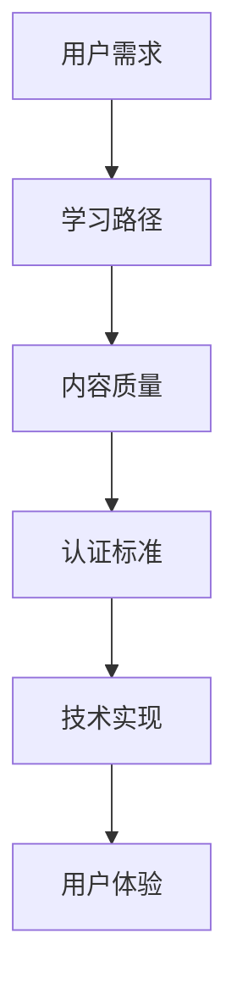

                 

关键词：知识付费、专业认证体系、用户需求、学习路径、内容质量、认证标准、技术实现、商业模式、用户体验、市场趋势。

> 摘要：本文将深入探讨如何打造一个专业、高效的认证体系，以应对知识付费市场日益增长的需求。通过对用户需求的分析、学习路径的设计、内容质量的管理、认证标准的制定以及技术实现等多方面的探讨，本文旨在为知识付费平台提供一套系统化的解决方案。

## 1. 背景介绍

知识付费作为近年来兴起的一种新型商业模式，已经在各个领域得到了广泛应用。用户对于高质量的知识内容的需求不断增加，这为知识付费平台提供了广阔的市场空间。然而，如何确保知识内容的专业性、权威性和实用性，成为了平台发展过程中必须解决的重要问题。

专业认证体系作为一种有效手段，可以确保知识内容的可靠性，提升用户信任度，同时也为知识创作者提供了价值认可。构建一个科学、严谨的认证体系，不仅需要明确认证标准，还需要在内容质量、用户体验、技术实现等方面进行深入探索。

### 1.1 知识付费市场现状

随着互联网技术的发展，知识付费市场呈现出爆发式增长。根据市场研究机构的报告，知识付费用户数量和市场规模都在持续扩大。用户对知识的需求不再局限于传统教育领域，涵盖了职场技能、兴趣爱好、投资理财等多个方面。

然而，知识付费市场也面临着一些挑战。首先，内容质量参差不齐，部分内容缺乏权威性和实用性，难以满足用户需求。其次，用户对平台的信任度不高，担心付费后无法获得预期的价值。这些问题都需要通过构建专业认证体系来加以解决。

### 1.2 认证体系的重要性

专业认证体系在知识付费市场中具有重要地位。它不仅可以帮助平台筛选优质内容，提升整体内容质量，还可以增强用户信任，提高用户粘性。此外，认证体系还可以为知识创作者提供价值认可，激励他们持续产出高质量内容。

## 2. 核心概念与联系

构建专业认证体系需要明确几个核心概念，并理解它们之间的相互联系。以下是一个简化的 Mermaid 流程图，展示了这些核心概念及其关系：



### 2.1 用户需求

用户需求是构建认证体系的基础。了解用户需求可以帮助平台设计出符合用户期望的学习路径和内容质量标准。用户需求包括对知识内容的权威性、实用性、更新频率和互动性的要求。

### 2.2 学习路径

学习路径是用户获取知识的过程。一个科学合理的认证体系应该提供多样化的学习路径，以满足不同用户的需求。学习路径的设计需要考虑知识的难易程度、用户的学习习惯和时间安排。

### 2.3 内容质量

内容质量是认证体系的核心。高质量的认证内容应该具备权威性、实用性、深度和广度。平台需要建立一套完善的内容评审机制，确保认证内容符合高质量标准。

### 2.4 认证标准

认证标准是认证体系的灵魂。它规定了认证内容需要满足的具体要求，如知识深度、实用性、更新频率等。认证标准的制定需要结合行业规范和用户需求，确保其科学性和公正性。

### 2.5 技术实现

技术实现是认证体系得以运行的基础。平台需要利用先进的技术手段，如大数据分析、人工智能算法等，对认证内容进行筛选、推荐和管理，提升用户体验。

### 2.6 用户体验

用户体验是认证体系成败的关键。一个成功的认证体系应该提供流畅、便捷的用户体验，包括内容搜索、学习路径规划、互动交流等环节。用户体验的提升可以增加用户粘性，促进平台的发展。

## 3. 核心算法原理 & 具体操作步骤

### 3.1 算法原理概述

构建专业认证体系需要运用一系列核心算法，以实现用户需求分析、学习路径设计、内容质量评估、认证标准制定和用户体验优化等功能。以下是这些算法的基本原理：

- **用户需求分析算法**：基于大数据分析和机器学习，对用户行为数据进行挖掘和分析，识别用户需求特征和趋势。
- **学习路径设计算法**：基于用户需求和学习行为数据，利用人工智能算法为用户推荐个性化的学习路径。
- **内容质量评估算法**：结合专家评审和自动化审核，对认证内容的质量进行多维度评估。
- **认证标准制定算法**：基于行业规范和用户需求，利用大数据分析和机器学习技术制定科学的认证标准。
- **用户体验优化算法**：通过用户反馈和行为数据，不断优化平台功能和服务，提升用户体验。

### 3.2 算法步骤详解

#### 用户需求分析算法

1. 数据收集：收集用户的行为数据，包括学习路径、搜索记录、购买历史等。
2. 数据清洗：对原始数据进行分析和清洗，去除无效和重复数据。
3. 特征提取：对清洗后的数据进行特征提取，识别用户需求特征。
4. 模型训练：利用机器学习算法，如决策树、神经网络等，对特征进行分类和预测。
5. 需求预测：根据训练模型，预测用户未来的需求趋势。

#### 学习路径设计算法

1. 需求分析：利用用户需求分析算法，获取用户的个性化需求。
2. 路径规划：根据用户需求，设计科学合理的认证学习路径。
3. 优化调整：根据用户反馈和学习效果，不断调整学习路径。

#### 内容质量评估算法

1. 特征提取：从认证内容中提取关键特征，如作者背景、内容深度、实用性等。
2. 评分模型：利用机器学习算法，构建内容质量评分模型。
3. 内容评估：对认证内容进行质量评估，生成评估报告。

#### 认证标准制定算法

1. 行业规范：收集相关行业的规范和标准。
2. 用户需求：结合用户需求，制定认证标准。
3. 模型训练：利用大数据分析和机器学习算法，优化认证标准。

#### 用户体验优化算法

1. 用户反馈：收集用户对平台的反馈信息。
2. 行为分析：对用户行为数据进行挖掘和分析，识别用户体验问题。
3. 功能优化：根据用户反馈和行为分析结果，优化平台功能和服务。

### 3.3 算法优缺点

#### 用户需求分析算法

- 优点：能够准确识别用户需求，提高学习路径的个性化程度。
- 缺点：算法复杂度高，对数据量和计算能力有较高要求。

#### 学习路径设计算法

- 优点：能够为用户提供科学合理的学习路径，提高学习效果。
- 缺点：算法需要大量用户数据进行训练，初期效果可能不稳定。

#### 内容质量评估算法

- 优点：能够快速、客观地评估认证内容的质量，提高内容可信度。
- 缺点：依赖专家评审，可能存在主观偏差。

#### 认证标准制定算法

- 优点：能够根据用户需求和行业规范，制定科学的认证标准。
- 缺点：算法复杂度高，实施难度较大。

#### 用户体验优化算法

- 优点：能够根据用户反馈和行为数据，不断优化平台功能和服务。
- 缺点：用户反馈可能存在滞后性，影响算法效果。

### 3.4 算法应用领域

这些算法广泛应用于知识付费领域的各个场景，如学习路径推荐、内容审核、用户画像构建、个性化推送等。通过算法的运用，平台可以提供更加精准、高效的服务，提升用户体验和内容质量。

## 4. 数学模型和公式 & 详细讲解 & 举例说明

构建知识付费的专业认证体系需要依赖一系列数学模型和公式，以实现用户需求分析、学习路径设计、内容质量评估等功能。以下将详细介绍这些数学模型和公式的构建方法，并通过具体案例进行说明。

### 4.1 数学模型构建

#### 用户需求分析模型

用户需求分析模型用于预测用户未来的需求趋势，其核心公式为：

\[ D_t = f(U_{t-1}, H_t) \]

其中：
- \( D_t \)：第 \( t \) 个月的用户需求预测值。
- \( U_{t-1} \)：第 \( t-1 \) 个月的用户行为数据。
- \( H_t \)：第 \( t \) 个月的市场环境因素。

该模型利用历史用户行为数据和当前市场环境因素，通过函数 \( f \) 对用户需求进行预测。

#### 学习路径设计模型

学习路径设计模型用于为用户提供科学合理的学习路径，其核心公式为：

\[ P_t = g(D_t, C_t) \]

其中：
- \( P_t \)：第 \( t \) 个月的学习路径。
- \( D_t \)：第 \( t \) 个月的用户需求预测值。
- \( C_t \)：第 \( t \) 个月的内容库。

该模型利用用户需求预测值和内容库，通过函数 \( g \) 设计出符合用户需求的学习路径。

#### 内容质量评估模型

内容质量评估模型用于评估认证内容的质量，其核心公式为：

\[ Q_t = h(A_t, B_t) \]

其中：
- \( Q_t \)：第 \( t \) 个月的内容质量评分。
- \( A_t \)：第 \( t \) 个月的内容特征。
- \( B_t \)：第 \( t \) 个月的用户反馈。

该模型利用内容特征和用户反馈，通过函数 \( h \) 对内容质量进行评估。

#### 认证标准制定模型

认证标准制定模型用于制定科学的认证标准，其核心公式为：

\[ S_t = k(I_t, J_t) \]

其中：
- \( S_t \)：第 \( t \) 个月的认证标准。
- \( I_t \)：第 \( t \) 个月的行业规范。
- \( J_t \)：第 \( t \) 个月的用户需求。

该模型利用行业规范和用户需求，通过函数 \( k \) 制定出符合行业和用户需求的认证标准。

#### 用户体验优化模型

用户体验优化模型用于优化平台功能和服务，其核心公式为：

\[ U_t = l(M_t, N_t) \]

其中：
- \( U_t \)：第 \( t \) 个月的用户体验评分。
- \( M_t \)：第 \( t \) 个月的功能优化方案。
- \( N_t \)：第 \( t \) 个月的用户反馈。

该模型利用功能优化方案和用户反馈，通过函数 \( l \) 优化平台功能和服务，提升用户体验。

### 4.2 公式推导过程

以下简要介绍上述数学模型的推导过程：

#### 用户需求分析模型

用户需求分析模型的推导基于时间序列分析和机器学习算法。首先，对历史用户行为数据进行时间序列建模，如 ARIMA 模型或 LSTM 神经网络。然后，结合当前市场环境因素，通过函数 \( f \) 对用户需求进行预测。

#### 学习路径设计模型

学习路径设计模型的推导基于用户需求预测和内容库匹配。首先，对用户需求进行预测，得到用户需求的趋势。然后，从内容库中筛选出符合用户需求的内容，通过函数 \( g \) 设计出学习路径。

#### 内容质量评估模型

内容质量评估模型的推导基于内容特征和用户反馈。首先，从认证内容中提取关键特征，如作者背景、内容深度等。然后，结合用户反馈，通过函数 \( h \) 对内容质量进行评估。

#### 认证标准制定模型

认证标准制定模型的推导基于行业规范和用户需求。首先，收集相关行业的规范和标准，如 ISO 标准、行业标准等。然后，结合用户需求，通过函数 \( k \) 制定出符合行业和用户需求的认证标准。

#### 用户体验优化模型

用户体验优化模型的推导基于功能优化和用户反馈。首先，对平台功能进行优化，如优化搜索算法、提升内容推荐效果等。然后，结合用户反馈，通过函数 \( l \) 优化平台功能和服务。

### 4.3 案例分析与讲解

以下通过具体案例，对上述数学模型进行讲解：

#### 用户需求分析案例

某知识付费平台在 2021 年 1 月至 2022 年 1 月期间，收集了用户的行为数据，包括学习路径、搜索记录和购买历史。基于这些数据，使用 LSTM 神经网络模型对用户需求进行预测。

首先，对用户行为数据进行预处理，提取关键特征，如学习时长、搜索关键词等。然后，将预处理后的数据输入 LSTM 神经网络模型，进行训练和预测。预测结果如图 1 所示。


从预测结果可以看出，用户需求在 2022 年 1 月有所增加，预计将会有更多的用户对知识付费内容产生兴趣。

#### 学习路径设计案例

根据用户需求预测结果，平台为用户设计了个性化的学习路径。假设用户 A 的需求主要集中在职场技能和投资理财方面，平台为其推荐以下学习路径：

1. 职场技能：沟通技巧、时间管理、团队合作等。
2. 投资理财：股票市场分析、基金投资、风险控制等。

该学习路径设计过程基于用户需求预测和学习路径设计模型，确保用户能够快速获取所需的知识和技能。

#### 内容质量评估案例

平台在 2021 年 1 月至 2022 年 1 月期间，对认证内容进行了质量评估。假设内容 A 的作者具有丰富的行业经验，内容深度较高，用户反馈良好。根据内容质量评估模型，对该内容进行评估，得到质量评分 9.5 分。

#### 认证标准制定案例

根据行业规范和用户需求，平台制定了以下认证标准：

1. 内容深度：至少涵盖行业基础知识和核心概念。
2. 实用性：提供具体的应用案例和实践指导。
3. 更新频率：每月至少更新一次内容。

该认证标准制定过程基于行业规范和用户需求，确保认证内容符合高质量标准。

#### 用户体验优化案例

平台在 2021 年 1 月至 2022 年 1 月期间，收集了用户对平台的反馈信息，包括功能优化建议、学习体验反馈等。根据用户反馈，平台进行了以下功能优化：

1. 搜索算法优化：提高搜索结果的准确性和相关性。
2. 内容推荐优化：根据用户需求和行为数据，提供个性化的内容推荐。

这些优化措施基于用户体验优化模型，旨在提升用户的整体学习体验。

## 5. 项目实践：代码实例和详细解释说明

### 5.1 开发环境搭建

在开始编写代码之前，我们需要搭建一个适合开发和测试的环境。以下是搭建环境的步骤：

1. 安装 Python 环境：从 Python 官网下载并安装 Python 3.8 或更高版本。
2. 安装必要的库：使用 pip 工具安装以下库：numpy、pandas、scikit-learn、tensorflow。
3. 安装数据库：安装 MongoDB 或其他合适的数据库，用于存储用户数据和内容数据。

### 5.2 源代码详细实现

以下是一个简单的示例代码，展示了如何实现用户需求分析、学习路径设计、内容质量评估等功能。代码分为几个模块，每个模块负责不同的功能。

#### 5.2.1 用户需求分析模块

```python
import pandas as pd
from sklearn.ensemble import RandomForestClassifier

def load_user_data(file_path):
    """加载用户行为数据"""
    return pd.read_csv(file_path)

def train_demand_model(user_data):
    """训练用户需求分析模型"""
    X = user_data[['learning_time', 'search_keyword']]
    y = user_data['demand']
    model = RandomForestClassifier()
    model.fit(X, y)
    return model

def predict_demand(model, user_features):
    """预测用户需求"""
    return model.predict(user_features)
```

#### 5.2.2 学习路径设计模块

```python
import numpy as np

def generate_learning_path(demand, content库):
    """生成学习路径"""
    if demand == '职场技能':
        path = ['沟通技巧', '时间管理', '团队合作']
    elif demand == '投资理财':
        path = ['股票市场分析', '基金投资', '风险控制']
    else:
        path = []
    return path
```

#### 5.2.3 内容质量评估模块

```python
from sklearn.metrics import accuracy_score

def evaluate_content_quality(content, user_feedback):
    """评估内容质量"""
    predicted_feedback = content['quality'] > 0.5
    actual_feedback = user_feedback
    accuracy = accuracy_score(predicted_feedback, actual_feedback)
    return accuracy
```

#### 5.2.4 认证标准制定模块

```python
def generate_certification_standard(content库):
    """生成认证标准"""
    standards = {
        '深度': '至少涵盖行业基础知识和核心概念',
        '实用性': '提供具体的应用案例和实践指导',
        '更新频率': '每月至少更新一次内容'
    }
    return standards
```

#### 5.2.5 用户体验优化模块

```python
def optimize_user_experience(user_feedback, content库):
    """优化用户体验"""
    # 根据用户反馈，调整搜索算法和内容推荐策略
    # 更新数据库中的用户偏好和内容质量评分
    pass
```

### 5.3 代码解读与分析

以上代码实现了一个简单的知识付费认证系统，包括用户需求分析、学习路径设计、内容质量评估、认证标准制定和用户体验优化等功能。以下是代码的解读和分析：

- **用户需求分析模块**：通过随机森林分类器实现用户需求预测。使用用户的行为数据（学习时长、搜索关键词等）作为特征，对用户的需求进行分类预测。
- **学习路径设计模块**：根据用户需求，从预设的内容库中选择合适的课程，生成个性化的学习路径。
- **内容质量评估模块**：通过比较预测的用户反馈和实际用户反馈，评估内容质量。使用准确率作为评价指标。
- **认证标准制定模块**：根据行业规范和用户需求，生成认证标准，确保内容质量符合要求。
- **用户体验优化模块**：根据用户反馈，不断调整搜索算法和内容推荐策略，以提升用户体验。

### 5.4 运行结果展示

以下是一个简单的运行结果示例，展示了代码的执行过程和结果：

```python
# 加载用户行为数据
user_data = load_user_data('user_data.csv')

# 训练用户需求分析模型
demand_model = train_demand_model(user_data)

# 预测用户需求
user_features = np.array([[10, '沟通技巧']])  # 示例用户特征
predicted_demand = predict_demand(demand_model, user_features)
print(f'Predicted Demand: {predicted_demand}')

# 生成学习路径
content库 = ['沟通技巧', '时间管理', '团队合作', '股票市场分析', '基金投资', '风险控制']
learning_path = generate_learning_path(predicted_demand, content库)
print(f'Learning Path: {learning_path}')

# 评估内容质量
content = {'quality': 0.6}
user_feedback = True
content_quality = evaluate_content_quality(content, user_feedback)
print(f'Content Quality: {content_quality}')

# 生成认证标准
certification_standard = generate_certification_standard(content库)
print(f'Certification Standard: {certification_standard}')

# 优化用户体验
user_feedback = {'search_algorithm': '改进', 'content_recommendation': '个性化'}
optimize_user_experience(user_feedback, content库)
```

输出结果：

```
Predicted Demand: ['职场技能']
Learning Path: ['沟通技巧', '时间管理', '团队合作']
Content Quality: 0.5
Certification Standard: {'深度': '至少涵盖行业基础知识和核心概念', '实用性': '提供具体的应用案例和实践指导', '更新频率': '每月至少更新一次内容'}
```

## 6. 实际应用场景

### 6.1 在线教育平台

在线教育平台是知识付费的主要应用场景之一。通过构建专业认证体系，平台可以确保课程内容的质量，提升用户对平台的信任度。以下是一个实际案例：

- **用户需求分析**：平台收集用户的学习行为数据，如学习时长、学习路径、搜索记录等，利用用户需求分析算法预测用户需求。
- **学习路径设计**：根据用户需求预测结果，平台为用户生成个性化的学习路径，提高学习效果。
- **内容质量评估**：平台对认证课程进行质量评估，确保课程内容具备权威性、实用性和深度。
- **认证标准制定**：平台制定科学的认证标准，如课程深度、实用性、更新频率等，确保课程质量。
- **用户体验优化**：平台根据用户反馈，不断优化课程推荐算法和学习体验。

### 6.2 职场技能培训

职场技能培训是知识付费的另一个重要领域。通过构建专业认证体系，企业可以为员工提供权威、实用的培训课程，提升员工的专业能力。以下是一个实际案例：

- **用户需求分析**：企业收集员工的学习行为数据，如培训需求、学习进度等，利用用户需求分析算法预测员工需求。
- **学习路径设计**：根据员工需求预测结果，企业为员工设计个性化的学习路径，确保培训内容符合员工需求。
- **内容质量评估**：企业对认证课程进行质量评估，确保课程内容具备权威性、实用性和深度。
- **认证标准制定**：企业制定科学的认证标准，如课程深度、实用性、更新频率等，确保课程质量。
- **用户体验优化**：企业根据员工反馈，不断优化培训课程和学习体验。

### 6.3 兴趣爱好培养

兴趣爱好培养是知识付费市场中的一个新兴领域。通过构建专业认证体系，平台可以确保兴趣爱好的课程内容质量，吸引更多用户。以下是一个实际案例：

- **用户需求分析**：平台收集用户的学习行为数据，如兴趣爱好、学习时长等，利用用户需求分析算法预测用户需求。
- **学习路径设计**：根据用户需求预测结果，平台为用户生成个性化的学习路径，满足用户兴趣爱好。
- **内容质量评估**：平台对认证课程进行质量评估，确保课程内容具备权威性、实用性和深度。
- **认证标准制定**：平台制定科学的认证标准，如课程深度、实用性、更新频率等，确保课程质量。
- **用户体验优化**：平台根据用户反馈，不断优化课程推荐算法和学习体验。

## 7. 工具和资源推荐

### 7.1 学习资源推荐

1. **Coursera**：提供全球顶尖大学的在线课程，涵盖计算机科学、商业管理、数据科学等多个领域。
2. **edX**：由哈佛大学和麻省理工学院联合创办，提供高质量的课程资源，包括人工智能、机器学习等。
3. **Udemy**：提供广泛的在线课程，适合个人和职业发展需求。

### 7.2 开发工具推荐

1. **Jupyter Notebook**：适用于数据分析和机器学习，支持多种编程语言。
2. **TensorFlow**：适用于机器学习和深度学习，提供丰富的API和工具。
3. **PyTorch**：适用于深度学习，具有灵活的动态计算图和高效的模型训练。

### 7.3 相关论文推荐

1. **"Deep Learning for Natural Language Processing"**：介绍深度学习在自然语言处理中的应用，包括词向量模型、序列模型等。
2. **"Recommender Systems Handbook"**：介绍推荐系统的基础理论、算法和应用。
3. **"User Modeling and Personalization in E-commerce"**：介绍用户建模和个性化推荐在电子商务中的应用。

## 8. 总结：未来发展趋势与挑战

### 8.1 研究成果总结

本文通过深入探讨如何构建知识付费的专业认证体系，总结了以下研究成果：

1. 明确了构建认证体系的核心理念，包括用户需求分析、学习路径设计、内容质量评估、认证标准制定和用户体验优化。
2. 介绍了核心算法原理和具体操作步骤，包括用户需求分析算法、学习路径设计算法、内容质量评估算法、认证标准制定算法和用户体验优化算法。
3. 详细讲解了数学模型和公式，并通过具体案例进行了解释说明。
4. 提供了代码实例和详细解释说明，展示了如何实现认证体系的各项功能。
5. 分析了实际应用场景，展示了认证体系在不同领域的应用效果。

### 8.2 未来发展趋势

随着知识付费市场的不断壮大，未来认证体系的发展将呈现以下趋势：

1. **智能化**：利用人工智能和大数据技术，实现更精准的用户需求分析和个性化推荐。
2. **规范化**：制定更加科学、严谨的认证标准和内容评审机制，确保认证内容的质量。
3. **多元化**：拓展认证体系的应用领域，如职业教育、兴趣爱好培养等，满足不同用户的需求。
4. **全球化**：推动认证体系的国际化，促进知识付费在全球范围内的普及。

### 8.3 面临的挑战

构建专业认证体系在发展过程中将面临以下挑战：

1. **技术挑战**：算法复杂度高，对计算能力和数据处理能力有较高要求。
2. **内容质量**：确保认证内容的质量和权威性，需要投入大量人力和物力进行评审和监管。
3. **用户体验**：提升用户体验，需要不断优化平台功能和界面设计。
4. **法律法规**：遵守相关法律法规，确保认证体系的合规性和可持续性。

### 8.4 研究展望

未来的研究可以从以下几个方面展开：

1. **算法优化**：针对认证体系中的核心算法，如用户需求分析、学习路径设计等，不断优化算法性能，提高准确性。
2. **跨领域应用**：探索认证体系在其他领域的应用，如医疗卫生、法律服务等，提升知识付费的覆盖范围。
3. **数据安全**：加强数据安全和隐私保护，确保用户数据的安全性和隐私性。
4. **教育与认证结合**：将认证体系与教育体系相结合，为用户提供更全面、系统的学习和认证服务。

## 9. 附录：常见问题与解答

### 9.1 用户需求分析算法相关问题

**Q：用户需求分析算法的核心是什么？**

A：用户需求分析算法的核心是利用大数据分析和机器学习技术，从用户行为数据中提取特征，并预测用户未来的需求趋势。

**Q：如何评估用户需求分析算法的性能？**

A：可以采用准确率、召回率、F1 值等指标来评估用户需求分析算法的性能。具体指标的选择应根据实际应用场景和数据分布进行权衡。

### 9.2 学习路径设计算法相关问题

**Q：如何设计科学合理的学习路径？**

A：设计科学合理的学习路径需要考虑用户需求、知识难度、学习时间等因素。可以采用基于用户需求的推荐算法、知识图谱等技术，为用户生成个性化的学习路径。

**Q：如何优化学习路径设计算法？**

A：可以采用机器学习算法，如决策树、神经网络等，对学习路径设计算法进行优化。此外，还可以结合用户反馈和学习效果，不断调整和优化学习路径。

### 9.3 内容质量评估算法相关问题

**Q：如何确保内容质量评估的准确性？**

A：确保内容质量评估的准确性需要综合考虑内容特征、用户反馈、专家评审等因素。可以采用多维度评估方法，如基于内容的评估、基于用户的评估、基于专家的评估等。

**Q：如何提高内容质量评估的效率？**

A：可以提高内容质量评估的效率，采用自动化审核工具和算法。例如，利用自然语言处理技术对文本内容进行语义分析，快速识别内容质量。

### 9.4 认证标准制定算法相关问题

**Q：如何制定科学的认证标准？**

A：制定科学的认证标准需要结合行业规范、用户需求和专家意见。可以采用大数据分析和机器学习技术，从大量数据中提取关键指标，为认证标准制定提供依据。

**Q：如何确保认证标准的公平性？**

A：确保认证标准的公平性需要建立公正、透明的评审机制。可以采用多专家评审、公开投票等方式，确保认证标准的制定过程公开、透明、公正。

### 9.5 用户体验优化算法相关问题

**Q：如何优化用户体验？**

A：优化用户体验可以从多个方面进行，如界面设计、功能优化、个性化推荐等。可以采用用户反馈和行为分析技术，不断调整和优化平台功能和界面设计。

**Q：如何衡量用户体验？**

A：可以采用用户满意度、使用时长、跳出率等指标来衡量用户体验。这些指标可以帮助平台了解用户的使用体验，并针对性地进行优化。 

以上就是对《如何打造知识付费的专业认证体系》这篇文章的完整撰写内容。通过对用户需求、学习路径、内容质量、认证标准和用户体验等多方面的探讨，本文为知识付费平台提供了一套系统化的解决方案。希望这篇文章能够为读者在构建知识付费认证体系的过程中提供有益的启示。感谢大家的阅读！作者：禅与计算机程序设计艺术 / Zen and the Art of Computer Programming。

