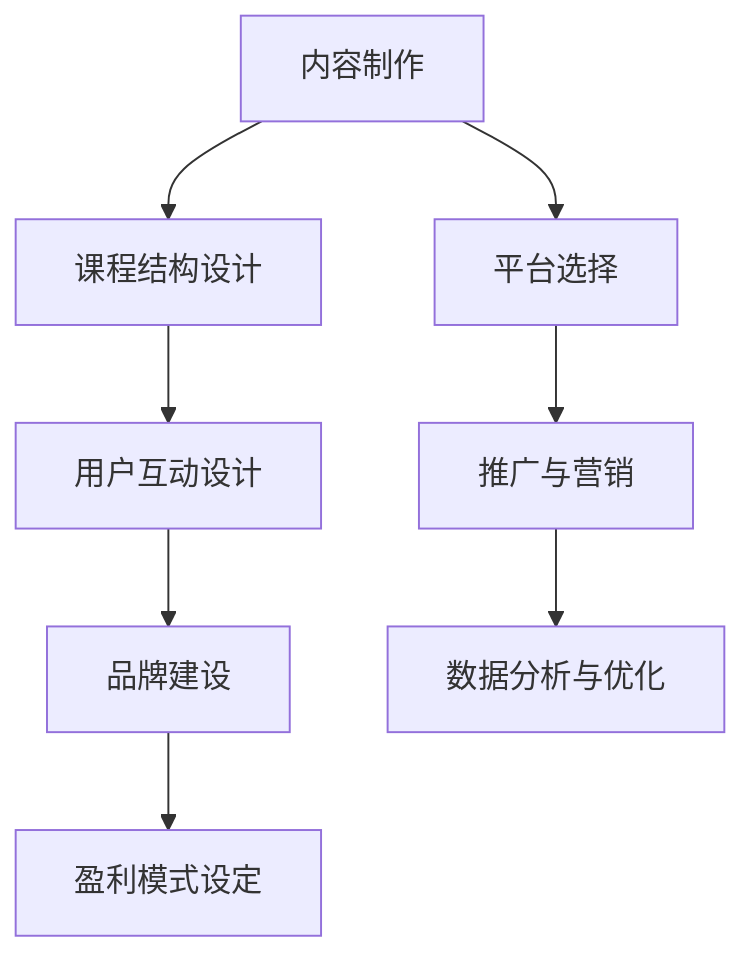

                 

关键词：知识付费，付费专栏，内容制作，用户参与，平台选择，盈利模式

> 摘要：随着互联网技术的飞速发展，知识付费逐渐成为教育培训领域的新趋势。本文旨在探讨如何打造一个有吸引力、有价值、可持续的付费专栏，通过详细的分析和实操建议，帮助内容创作者在知识付费市场上取得成功。

## 1. 背景介绍

在信息爆炸的时代，获取知识的方式和途径越来越丰富，但高质量、有深度的内容仍然稀缺。知识付费作为一种新兴商业模式，使得优质内容能够得到合理的定价和回报，同时也为用户提供了更多样化的学习选择。付费专栏作为知识付费的一种重要形式，通过系统性的内容分发，为学习者提供专业的、系统的学习资源。

知识付费的市场规模逐年扩大，用户对于高质量内容的付费意愿也在增强。这一趋势促使内容创作者和平台积极布局，打造出既有吸引力又能持续盈利的付费专栏。本文将围绕如何打造知识付费的付费专栏，从内容制作、用户参与、平台选择等多个维度进行分析和探讨。

## 2. 核心概念与联系

### 2.1. 知识付费的定义

知识付费是指用户为了获取专业知识或技能而支付的费用，这种付费模式通常通过在线平台进行。知识付费的常见形式包括课程、讲座、专栏、直播等。

### 2.2. 付费专栏的构成要素

一个成功的付费专栏通常由以下几个要素构成：

- **优质内容**：这是付费专栏的核心价值所在，内容的质量直接影响到用户的满意度和付费意愿。
- **系统化课程结构**：内容需要按照一定的逻辑和体系进行组织，帮助用户系统地学习。
- **互动与反馈**：通过提问、讨论区等形式增加用户参与感，提升用户体验。
- **品牌影响力**：创作者的个人品牌或机构的品牌影响力是吸引用户的重要因素。
- **盈利模式**：包括订阅模式、课程销售、广告等多种盈利方式。

### 2.3. Mermaid 流程图



通过以上流程图，我们可以清晰地看到，一个成功的付费专栏需要各个环节的有机结合和持续优化。

## 3. 核心算法原理 & 具体操作步骤

### 3.1. 算法原理概述

打造一个成功的付费专栏，需要遵循以下几个核心原则：

- **用户需求导向**：内容要满足用户的需求，解决用户的实际问题。
- **高质量内容制作**：内容要有深度、系统化，并具有较高的实用性。
- **用户体验优先**：设计互动环节，提升用户参与度和满意度。
- **品牌价值塑造**：建立个人或机构品牌，提升用户信任度。
- **数据驱动**：通过数据分析优化内容和服务。

### 3.2. 算法步骤详解

#### 3.2.1. 内容制作

1. **确定主题和目标用户**：选择用户感兴趣且具有市场需求的主题，明确目标用户群体。
2. **内容策划**：制定详细的内容大纲，确保内容的系统性和逻辑性。
3. **内容创作**：根据大纲进行内容创作，注意知识点的准确性和实用性。
4. **内容审核**：确保内容质量，包括知识点准确性、语言表达等。

#### 3.2.2. 课程结构设计

1. **模块化设计**：将内容划分为模块，每个模块有明确的主题和目标。
2. **逻辑关联**：确保模块之间的逻辑性和关联性，帮助用户更好地理解知识体系。
3. **知识点排列**：按照知识点的重要性、难度等进行合理排列。

#### 3.2.3. 用户互动设计

1. **讨论区**：设置讨论区，鼓励用户提问和交流。
2. **问卷调查**：定期进行问卷调查，了解用户需求和满意度。
3. **互动直播**：定期举办互动直播，解答用户疑问，增加用户粘性。

#### 3.2.4. 品牌建设

1. **个人品牌**：建立个人专业形象，提升个人影响力。
2. **品牌传播**：通过社交媒体、内容平台等渠道进行品牌传播。
3. **品牌合作**：与其他品牌或机构合作，扩大品牌影响力。

#### 3.2.5. 盈利模式设定

1. **订阅模式**：用户订阅专栏，定期获取更新内容。
2. **课程销售**：销售独立课程，适用于不同需求的用户。
3. **广告收入**：通过展示广告获取收入。

#### 3.2.6. 平台选择

1. **自建平台**：控制内容分发和用户体验，适合有较强技术实力的创作者。
2. **第三方平台**：如知乎、得到、分答等，覆盖广泛用户群体，但收益分配比例较高。
3. **多平台布局**：在多个平台进行内容分发，扩大影响力和用户覆盖。

### 3.3. 算法优缺点

#### 优点：

- **高质量内容**：注重内容质量和实用性，满足用户需求。
- **系统化学习**：提供系统化的知识体系，帮助用户深入掌握知识。
- **用户参与**：互动设计增加用户参与感，提升用户体验。
- **多样化盈利模式**：多种盈利方式，提高收益稳定性。

#### 缺点：

- **内容制作成本高**：高质量内容制作需要较高成本和时间投入。
- **用户维护成本高**：需要持续进行用户互动和反馈，维护用户关系。
- **竞争激烈**：知识付费市场竞争激烈，需要不断提升内容质量和品牌影响力。

### 3.4. 算法应用领域

- **教育培训**：如在线课程、知识分享等。
- **专业咨询**：提供行业专业知识和咨询服务。
- **技能提升**：如编程、设计、营销等技能培训。

## 4. 数学模型和公式 & 详细讲解 & 举例说明

### 4.1. 数学模型构建

为了评估付费专栏的用户满意度，我们可以构建以下数学模型：

用户满意度 = f(内容质量, 互动设计, 品牌影响力)

其中，f为复合函数，内容质量、互动设计和品牌影响力分别为自变量。

### 4.2. 公式推导过程

用户满意度可以通过以下公式推导：

用户满意度 = (内容质量得分 × 互动设计得分 × 品牌影响力得分) / (1 + ω × (内容质量得分 + 互动设计得分 + 品牌影响力得分))

其中，ω为调节参数，用于平衡三个得分之间的关系。

### 4.3. 案例分析与讲解

假设某付费专栏的内容质量得分为8，互动设计得分为7，品牌影响力得分为6，调节参数ω为0.5。根据上述公式，我们可以计算出该专栏的用户满意度：

用户满意度 = (8 × 7 × 6) / (1 + 0.5 × (8 + 7 + 6)) ≈ 0.87

这意味着该专栏的用户满意度较高，具有较好的市场前景。

## 5. 项目实践：代码实例和详细解释说明

### 5.1. 开发环境搭建

在开始项目实践之前，我们需要搭建一个合适的内容制作和发布环境。以下是开发环境搭建的步骤：

1. **选择内容制作工具**：如Markdown编辑器、视频剪辑软件等。
2. **搭建内容发布平台**：可以选择自建平台或第三方平台。
3. **配置服务器和数据库**：确保内容的安全和稳定访问。

### 5.2. 源代码详细实现

以下是一个简单的Markdown文件示例，用于制作付费专栏的章节内容：

```markdown
# 购买指南

## 1. 订阅流程

1. 登录专栏平台。
2. 选择订阅专栏。
3. 填写订阅信息。
4. 确认支付。

## 2. 支付方式

1. 支付宝。
2. 微信支付。
3. 银行卡。

## 3. 订阅权益

1. 定期更新内容。
2. 互动交流。
3. 专属优惠。

```

### 5.3. 代码解读与分析

上述Markdown文件包含三个主要部分：

- **章节标题**：使用`#`号进行标记，级别越高，标题越大。
- **段落内容**：使用空行进行分隔，每个段落包含具体的说明和细节。
- **列表项**：使用`-`号或`1.`等符号进行标记，用于列出多个相关的项目或步骤。

通过Markdown文件，我们可以轻松地制作和编辑文档，使其具备良好的格式和结构。

### 5.4. 运行结果展示

将上述Markdown文件导入到内容发布平台，即可生成一个格式规范、内容清晰的购买指南页面，供用户查阅和订阅。

## 6. 实际应用场景

### 6.1. 教育培训

付费专栏在教育培训领域具有广泛的应用，如编程、语言学习、专业知识分享等。通过系统化的内容分发，用户可以方便地获取所需知识。

### 6.2. 专业咨询

某些专业领域，如法律、财务、医疗等，付费专栏提供专业的咨询服务，用户可以通过专栏获取行业专业知识和建议。

### 6.3. 技能提升

对于技能提升类内容，如设计、编程、营销等，付费专栏可以帮助用户快速掌握相关技能，提高职业竞争力。

### 6.4. 未来应用展望

随着互联网技术的不断发展，知识付费将进入更多领域。未来，付费专栏的应用将更加广泛，内容形式也将更加多样，如虚拟现实、增强现实等。

## 7. 工具和资源推荐

### 7.1. 学习资源推荐

- **书籍**：《内容创业》、《运营之光》等。
- **在线课程**：知乎Live、网易云课堂等。

### 7.2. 开发工具推荐

- **内容制作工具**：Markdown编辑器、视频剪辑软件等。
- **平台选择**：知乎、得到、分答等。

### 7.3. 相关论文推荐

- **付费专栏商业模式研究**。
- **知识付费市场发展趋势分析**。

## 8. 总结：未来发展趋势与挑战

### 8.1. 研究成果总结

本文从内容制作、用户参与、平台选择等多个维度探讨了如何打造成功的付费专栏，并提出了一系列实用建议。

### 8.2. 未来发展趋势

知识付费市场将持续扩大，内容形式将更加多样，用户需求也将更加个性化。

### 8.3. 面临的挑战

内容质量竞争、用户维护成本、盈利模式创新等是未来付费专栏面临的挑战。

### 8.4. 研究展望

未来，付费专栏将向个性化、智能化方向发展，为用户提供更高质量、更个性化的学习体验。

## 9. 附录：常见问题与解答

### 9.1. 如何确定付费专栏的主题？

- 调研用户需求。
- 选择市场需求大、竞争小的领域。
- 结合自身专业优势。

### 9.2. 如何保证付费专栏的内容质量？

- 确保内容准确性。
- 注重内容实用性。
- 定期进行内容审核和更新。

### 9.3. 如何吸引和维护用户？

- 提供优质内容。
- 设计互动环节。
- 定期进行用户调研和反馈。

作者：禅与计算机程序设计艺术 / Zen and the Art of Computer Programming

----------------------------------------------------------------

以上是文章的主体内容，根据您提供的文章结构模板，我已经完成了各个章节的撰写。如果您有任何需要修改或补充的地方，请随时告诉我。希望这篇文章能够对您在知识付费领域的发展有所帮助。

