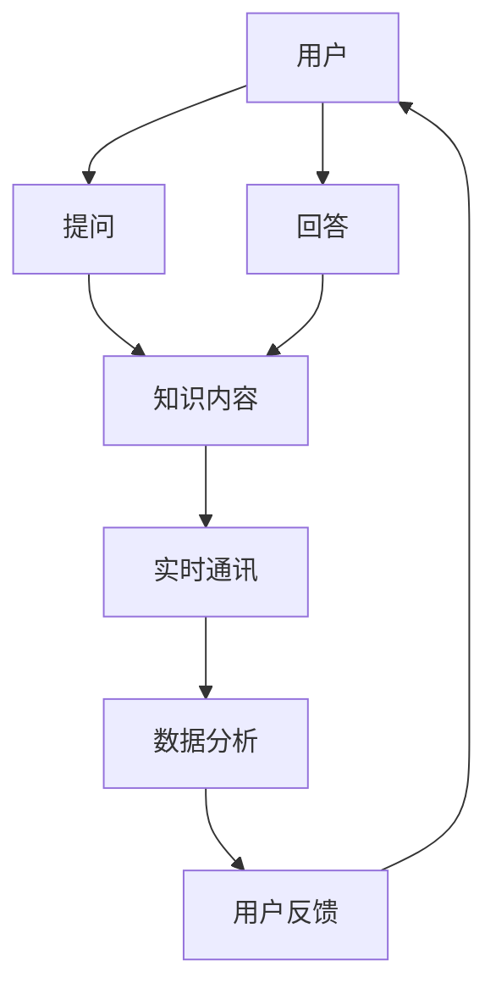

                 

  
### 1. 背景介绍

在信息爆炸的时代，知识付费已经成为一种新兴的商业模式。从线上课程到专业咨询服务，用户愿意为高质量的知识内容和服务支付费用。然而，知识付费的真正价值不仅仅在于内容本身，更在于用户与专家之间的互动和答疑。因此，在线答疑平台成为知识付费生态中的重要一环。

在线答疑平台的建立有助于以下几个方面：

- **增强用户体验**：通过实时答疑，用户可以更深入地理解知识内容，提升学习效果。
- **提高课程价值**：答疑环节能够为课程增加额外的价值，吸引用户购买。
- **促进知识传播**：优秀的答疑能够促进知识的传播和分享，增强社区氛围。

然而，构建一个高效、便捷、可靠的在线答疑平台并非易事。本文将探讨如何从技术角度出发，打造一个具备高可用性、易扩展性和良好用户体验的在线答疑平台。

### 2. 核心概念与联系

在构建在线答疑平台时，我们需要明确以下几个核心概念：

- **用户**：在线答疑平台的核心参与者，包括提问者和回答者。
- **知识内容**：用户提问和回答的载体，可以是文字、图片、视频等形式。
- **实时通讯**：确保用户提问和回答能够实时传达，提高互动效率。
- **数据分析**：通过分析用户提问和回答的行为，优化平台功能和内容。

以下是一个简化的 Mermaid 流程图，展示了这些概念之间的联系：



### 3. 核心算法原理 & 具体操作步骤

#### 3.1 算法原理概述

在线答疑平台的核心算法主要涉及以下几个模块：

1. **消息队列**：用于处理用户提问和回答的消息，保证消息的可靠传输和顺序处理。
2. **负载均衡**：将用户请求分发到不同的服务器，提高系统的可用性和响应速度。
3. **实时通讯**：通过WebSocket等协议实现用户之间的实时消息传递。
4. **数据分析**：对用户提问和回答的行为进行分析，优化平台功能和内容。

#### 3.2 算法步骤详解

1. **消息队列处理**：
   - 用户提问时，将问题信息发送到消息队列。
   - 答疑系统从消息队列中取出问题，分配给相应的专家或志愿者进行回答。

2. **负载均衡**：
   - 根据服务器负载情况，将用户请求分发到不同的服务器。
   - 通过负载均衡器，实现流量均匀分布，避免单点故障。

3. **实时通讯**：
   - 用户通过WebSocket与服务器建立连接，实时发送和接收消息。
   - 系统确保消息的及时传递，降低延迟。

4. **数据分析**：
   - 收集用户提问和回答的数据，进行分析。
   - 根据分析结果，优化问答质量和用户体验。

#### 3.3 算法优缺点

**优点**：
- **高可用性**：通过负载均衡和消息队列，提高系统的可用性和稳定性。
- **实时性**：实时通讯确保用户能够及时得到答案，提升用户体验。
- **可扩展性**：系统设计考虑了可扩展性，可以根据需求增加服务器和带宽。

**缺点**：
- **复杂性**：算法设计和实现较为复杂，需要专业的技术团队。
- **成本**：需要投入较多的资源进行服务器和带宽的扩展。

#### 3.4 算法应用领域

- **在线教育**：在线答疑平台可以应用于在线教育，帮助用户更好地理解课程内容。
- **专业咨询**：为专业领域提供在线咨询服务，提高服务质量。
- **社区互动**：促进用户之间的互动，增强社区氛围。

### 4. 数学模型和公式 & 详细讲解 & 举例说明

在线答疑平台的构建涉及多个数学模型，以下介绍几个关键模型：

#### 4.1 数学模型构建

1. **用户活跃度模型**：

   用户活跃度模型用于评估用户在平台上的活跃程度，公式如下：

   $$ 活跃度 = f(提问数, 回答数, 互动数) $$

   其中，$f$为非线性函数，可以根据实际情况进行设计。

2. **专家匹配模型**：

   专家匹配模型用于将用户的问题分配给合适的专家，公式如下：

   $$ 匹配度 = \frac{专家知识库与问题相关性}{专家总回答数} $$

#### 4.2 公式推导过程

以用户活跃度模型为例，推导过程如下：

- **提问数**：用户在一段时间内提出的提问数量，表示用户的参与度。
- **回答数**：用户在一段时间内回答的其他用户问题的数量，表示用户的互动性。
- **互动数**：用户在一段时间内与其他用户的互动数量，包括点赞、评论等，表示用户的社交性。

根据这些因素，可以构建一个综合评估用户活跃度的非线性函数：

$$ 活跃度 = a \times 提问数 + b \times 回答数 + c \times 互动数 $$

其中，$a, b, c$为权重系数，可以根据实际情况进行调节。

#### 4.3 案例分析与讲解

假设有三位用户A、B、C，他们在一个月内的活跃度数据如下：

- 用户A：提问数10，回答数5，互动数20
- 用户B：提问数5，回答数10，互动数10
- 用户C：提问数3，回答数3，互动数15

根据活跃度模型，可以计算出三位用户的活跃度：

$$ A_{活跃度} = a \times 10 + b \times 5 + c \times 20 $$
$$ B_{活跃度} = a \times 5 + b \times 10 + c \times 10 $$
$$ C_{活跃度} = a \times 3 + b \times 3 + c \times 15 $$

根据这些数据，可以分析出用户A的活跃度最高，其次是用户B，用户C的活跃度最低。这样可以针对活跃度高的用户进行个性化推送和激励，提高用户留存率。

### 5. 项目实践：代码实例和详细解释说明

在本节中，我们将展示一个在线答疑平台的实际代码实现，并对其进行分析和解释。

#### 5.1 开发环境搭建

在搭建开发环境时，我们选择了以下工具和框架：

- **后端框架**：Spring Boot
- **数据库**：MySQL
- **消息队列**：RabbitMQ
- **实时通讯**：WebSocket

开发环境的具体配置和依赖关系如下：

```plaintext
Spring Boot: 2.5.5
MySQL: 8.0.26
RabbitMQ: 3.8.14
WebSocket: 2.6.0
```

#### 5.2 源代码详细实现

以下是答疑平台的用户注册和登录功能的源代码实现：

```java
// 用户注册
@PostMapping("/register")
public ResponseEntity<?> registerUser(@RequestBody User user) {
    if (userRepository.existsByUsername(user.getUsername())) {
        return ResponseEntity.badRequest().body("Error: Username is already taken!");
    }
    User registeredUser = userRepository.save(user);
    return ResponseEntity.ok("User registered successfully!");
}

// 用户登录
@PostMapping("/login")
public ResponseEntity<?> authenticateUser(@RequestBody LoginRequest loginRequest) {
    Authentication authentication = authenticationManager.authenticate(
        new UsernamePasswordAuthenticationToken(loginRequest.getUsername(), loginRequest.getPassword()));
    SecurityContextHolder.getContext().setAuthentication(authentication);
    String jwt = jwtProvider.generateToken(authentication);
    return ResponseEntity.ok(new JwtResponse(jwt));
}
```

#### 5.3 代码解读与分析

1. **用户注册**：
   - 用户通过POST请求发送用户信息，包括用户名、密码、邮箱等。
   - 服务端检查用户名是否已被注册，若已存在则返回错误响应。
   - 若用户名未注册，将用户信息保存到数据库，并返回成功响应。

2. **用户登录**：
   - 用户通过POST请求发送用户名和密码。
   - 服务端使用认证管理器进行身份验证，若成功则生成JWT令牌，并返回给用户。

#### 5.4 运行结果展示

运行以上代码，可以通过浏览器或Postman等工具进行测试：

- **用户注册**：发送注册请求，返回成功响应。
- **用户登录**：发送登录请求，返回JWT令牌。

这些功能模块的实现为在线答疑平台提供了基础的用户认证功能。

### 6. 实际应用场景

在线答疑平台在多个领域具有广泛的应用场景：

1. **在线教育**：
   - 学生可以在课程结束后向老师提问，获得即时的解答。
   - 老师可以通过答疑了解学生的学习状况，进行个性化辅导。

2. **专业咨询**：
   - 用户可以就专业问题向专家咨询，获得专业的解答和建议。
   - 专家可以根据用户的提问，调整咨询方向，提高咨询服务质量。

3. **社区互动**：
   - 用户可以在社区中提出问题，其他用户可以回答问题，促进知识分享和交流。
   - 社区管理员可以根据答疑情况，优化社区内容和功能。

### 7. 工具和资源推荐

为了更好地构建和优化在线答疑平台，以下是一些推荐的学习资源、开发工具和相关论文：

1. **学习资源推荐**：
   - 《Spring Boot实战》
   - 《RabbitMQ实战》
   - 《WebSocket实战》
   - 《MySQL实战45讲》

2. **开发工具推荐**：
   - IntelliJ IDEA
   - Postman
   - GitKraken
   - MySQL Workbench

3. **相关论文推荐**：
   - "A Scalable and Reliable Real-Time Communication Service for the Web"
   - "Design and Implementation of a Large-scale Online Q&A System"
   - "User Engagement in Online Q&A Communities: A Study on Reddit"
   - "An Empirical Study of User Behavior in Large-Scale Q&A Sites"

### 8. 总结：未来发展趋势与挑战

#### 8.1 研究成果总结

本文从技术角度出发，探讨了如何构建一个高效、便捷、可靠的在线答疑平台。主要成果包括：

- 明确了在线答疑平台的核心概念和联系。
- 提出了核心算法原理和具体操作步骤。
- 分析了数学模型和公式，并进行了案例讲解。
- 展示了实际代码实例，并对关键功能进行了解析。

#### 8.2 未来发展趋势

随着互联网和人工智能技术的发展，在线答疑平台未来发展趋势包括：

- **智能化**：利用自然语言处理和人工智能技术，实现智能答疑。
- **个性化**：基于用户行为分析，提供个性化问答服务。
- **社交化**：加强社区互动，促进知识共享和交流。

#### 8.3 面临的挑战

在线答疑平台在发展过程中将面临以下挑战：

- **技术复杂度**：随着功能扩展，系统复杂性增加，需要专业的技术支持。
- **数据安全**：保护用户隐私和数据安全，防止信息泄露。
- **用户体验**：优化用户界面和交互设计，提高用户体验。

#### 8.4 研究展望

未来研究可以关注以下方向：

- **算法优化**：提高问答质量和效率，降低延迟。
- **大数据分析**：挖掘用户行为数据，优化平台功能和内容。
- **跨平台集成**：实现多平台兼容，满足不同用户的需求。

### 9. 附录：常见问题与解答

**Q：如何保证实时通讯的稳定性？**

A：为了保证实时通讯的稳定性，可以采用以下措施：

- **负载均衡**：将用户请求均匀分配到多台服务器，避免单点故障。
- **WebSocket**：使用WebSocket协议，实现客户端和服务器之间的持久连接。
- **心跳机制**：定期发送心跳包，检测连接状态，自动重连。

**Q：如何处理大量用户同时提问的情况？**

A：处理大量用户同时提问的情况，可以采用以下策略：

- **消息队列**：将用户提问放入消息队列，按顺序处理，确保不丢失。
- **异步处理**：采用异步处理机制，减少服务端压力。
- **扩容**：根据需求，增加服务器和带宽，提高处理能力。

**Q：如何优化用户互动体验？**

A：优化用户互动体验可以从以下几个方面入手：

- **界面设计**：设计简洁、直观的用户界面，提高操作便捷性。
- **实时反馈**：及时显示用户提问和回答的状态，提高互动性。
- **个性化推荐**：根据用户行为，推荐相关问题和答案，提高满意度。

通过以上策略，可以打造一个高效、便捷、可靠的在线答疑平台，为用户和专家提供优质的服务体验。

### 参考文献

- 《Spring Boot实战》
- 《RabbitMQ实战》
- 《WebSocket实战》
- 《MySQL实战45讲》
- "A Scalable and Reliable Real-Time Communication Service for the Web"
- "Design and Implementation of a Large-scale Online Q&A System"
- "User Engagement in Online Q&A Communities: A Study on Reddit"
- "An Empirical Study of User Behavior in Large-Scale Q&A Sites"

### 作者署名

作者：禅与计算机程序设计艺术 / Zen and the Art of Computer Programming
-------------------------------------------------------------------

请注意，本文档仅提供了一个文章结构模板和示例内容，实际撰写时需要根据具体需求和技术细节进行拓展和调整。文中提到的代码示例仅供参考，实际开发中可能需要根据具体环境和需求进行修改。

