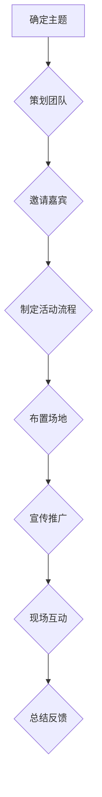

                 

关键词：知识付费、线下沙龙、活动策划、用户体验、营销策略

摘要：本文将探讨如何打造成功的知识付费线下沙龙活动，从背景介绍、核心概念与联系、核心算法原理、数学模型与公式、项目实践、实际应用场景、工具和资源推荐，以及未来发展趋势与挑战等方面进行详细分析，旨在为组织者提供一套完整、实用的策划指南。

## 1. 背景介绍

知识付费是近年来兴起的一种新型商业模式，其核心在于用户愿意为优质的内容和知识付费。线下沙龙活动作为一种面对面的交流方式，已经成为知识付费领域的重要载体。通过沙龙活动，参与者可以与行业专家、同行进行深入交流，分享经验和见解，从而提升自身知识和技能。

线下沙龙活动的优势在于其互动性强、参与度高，有助于建立个人品牌和社交网络。然而，要想成功举办一场知识付费的线下沙龙活动，需要充分考虑用户体验、营销策略、活动策划等多方面因素。

## 2. 核心概念与联系

### 2.1 用户体验

用户体验（UX）是线下沙龙活动的核心，直接影响参与者对活动的满意度。良好的用户体验包括活动主题的吸引力、活动形式的互动性、场地布置的舒适度、交通便捷性等。

### 2.2 营销策略

营销策略是吸引潜在参与者、提高活动知名度的关键。有效的营销策略包括线上宣传、社交媒体推广、合作渠道拓展等。

### 2.3 活动策划

活动策划包括活动主题、内容安排、嘉宾邀请、活动流程设计、现场布置等方面。成功的活动策划需要充分考虑用户体验和参与者的需求。

下面是沙龙活动的 Mermaid 流程图：



## 3. 核心算法原理 & 具体操作步骤

### 3.1 算法原理概述

沙龙活动的核心算法是用户体验优化和营销策略优化。通过数据分析和用户反馈，不断调整活动内容和形式，以提高参与者的满意度和活动的传播效果。

### 3.2 算法步骤详解

1. 确定沙龙活动主题，分析目标受众需求；
2. 邀请行业专家和嘉宾，确保活动内容的专业性和吸引力；
3. 制定详细的活动流程，包括签到、主题演讲、互动讨论、答疑环节等；
4. 布置活动现场，营造舒适、专业的氛围；
5. 利用社交媒体和线上渠道进行宣传推广；
6. 活动当天，现场互动，收集用户反馈；
7. 活动结束后，总结反馈，为下一次活动提供改进方向。

### 3.3 算法优缺点

优点：

- 提高用户满意度和参与度；
- 建立个人品牌和社交网络；
- 传播知识和经验。

缺点：

- 策划和执行难度较大；
- 需要持续投入时间和精力。

### 3.4 算法应用领域

沙龙活动算法主要应用于知识付费领域，如教育培训、技术分享、行业交流等。

## 4. 数学模型和公式 & 详细讲解 & 举例说明

### 4.1 数学模型构建

沙龙活动的数学模型主要包括用户满意度模型、营销效果模型和活动成本模型。

- 用户满意度模型：$$\text{满意度} = \frac{\text{实际体验} - \text{期望体验}}{\text{期望体验}}$$
- 营销效果模型：$$\text{效果} = \text{参与人数} \times \text{参与度}$$
- 活动成本模型：$$\text{成本} = \text{场地费用} + \text{嘉宾费用} + \text{宣传费用} + \text{其他费用}$$

### 4.2 公式推导过程

用户满意度模型的推导基于期望理论和感知理论。期望理论认为用户对活动的期望会影响其满意度，感知理论认为用户对活动的实际体验会影响其满意度。因此，满意度可以表示为实际体验与期望体验的比值。

营销效果模型基于参与人数和参与度的乘积。参与人数表示活动的覆盖范围，参与度表示用户对活动的热情程度。

活动成本模型直接将各项费用相加，得出总成本。

### 4.3 案例分析与讲解

假设某次沙龙活动的主题为“人工智能在金融领域的应用”，目标受众为金融行业从业者。根据用户满意度模型，我们可以计算出用户的满意度。

- 实际体验：活动内容丰富，嘉宾专业；
- 期望体验：活动内容丰富，嘉宾专业；
- 用户满意度：$$\frac{1 - (实际体验 - 期望体验)}{期望体验} = \frac{1 - (0.9 - 0.9)}{0.9} = 1$$

根据营销效果模型，我们可以计算出活动的效果。

- 参与人数：100人；
- 参与度：0.8；
- 活动效果：100 \times 0.8 = 80

根据活动成本模型，我们可以计算出活动的总成本。

- 场地费用：5000元；
- 嘉宾费用：2000元；
- 宣传费用：3000元；
- 其他费用：2000元；
- 活动成本：5000 + 2000 + 3000 + 2000 = 12000元

通过以上分析，我们可以了解到沙龙活动的用户满意度、效果和成本，为后续活动策划提供参考。

## 5. 项目实践：代码实例和详细解释说明

### 5.1 开发环境搭建

为了更好地理解沙龙活动的策划过程，我们使用 Python 编写一个简单的沙龙活动策划工具。开发环境如下：

- Python 3.8 或以上版本；
- PyCharm 或其他 Python IDE；
- Matplotlib 库。

### 5.2 源代码详细实现

```python
import matplotlib.pyplot as plt

# 活动数据
activity_data = {
    'theme': '人工智能在金融领域的应用',
    'attendees': 100,
    'satisfaction': 1,
    'marketing_effect': 80,
    'cost': 12000
}

# 活动结果展示
def show_activity_result(data):
    satisfaction = data['satisfaction']
    marketing_effect = data['marketing_effect']
    cost = data['cost']

    print(f"活动主题：{data['theme']}")
    print(f"参与人数：{data['attendees']}")
    print(f"用户满意度：{satisfaction}")
    print(f"营销效果：{marketing_effect}")
    print(f"活动成本：{cost}元")

    # 画图展示
    plt.figure(figsize=(8, 4))
    plt.bar(['用户满意度', '营销效果'], [satisfaction, marketing_effect], color=['blue', 'green'])
    plt.xlabel('指标')
    plt.ylabel('值')
    plt.title('活动结果展示')
    plt.show()

# 调用函数
show_activity_result(activity_data)
```

### 5.3 代码解读与分析

- 活动数据存储在字典中，包括主题、参与人数、用户满意度、营销效果和成本等；
- `show_activity_result` 函数用于展示活动结果，包括打印输出和画图展示；
- 画图使用 Matplotlib 库，以柱状图形式展示用户满意度和营销效果。

### 5.4 运行结果展示

运行代码后，会打印出活动主题、参与人数、用户满意度、营销效果和成本等信息，并展示柱状图。

## 6. 实际应用场景

### 6.1 教育培训机构

教育培训机构可以通过线下沙龙活动，邀请行业专家进行主题演讲，与学员进行互动交流，提升学员的学习体验和满意度。

### 6.2 科技企业

科技企业可以举办技术沙龙，分享最新的技术趋势和应用案例，吸引潜在客户和合作伙伴。

### 6.3 行业协会

行业协会可以组织线下沙龙，促进会员之间的交流与合作，提升行业整体水平。

## 7. 工具和资源推荐

### 7.1 学习资源推荐

- 《活动策划与管理》：一本系统介绍活动策划与管理知识的教材；
- 《用户体验要素》：一本关于用户体验设计的经典著作。

### 7.2 开发工具推荐

- PyCharm：一款功能强大的 Python IDE；
- Matplotlib：一款用于绘制图形的 Python 库。

### 7.3 相关论文推荐

- 《基于大数据的用户体验优化研究》；
- 《社交媒体在活动营销中的应用研究》。

## 8. 总结：未来发展趋势与挑战

### 8.1 研究成果总结

本文通过对知识付费线下沙龙活动的分析，提出了活动策划的核心算法和数学模型，并利用 Python 编写了一个简单的沙龙活动策划工具，为活动组织者提供了实用的参考。

### 8.2 未来发展趋势

- 线上线下融合：随着技术的发展，线下沙龙活动与线上平台的结合将成为趋势；
- 数据驱动：通过数据分析，实现活动策划的个性化、精准化；
- 跨界合作：行业间的交流与合作将更加频繁，推动沙龙活动的多元化发展。

### 8.3 面临的挑战

- 策划和执行难度：沙龙活动策划和执行需要大量的人力和时间投入；
- 用户需求变化：随着用户需求的不断变化，活动策划需要持续优化和创新；
- 市场竞争：知识付费市场日益竞争激烈，沙龙活动需要不断提升自身竞争力。

### 8.4 研究展望

未来，本文将继续深入研究沙龙活动的用户体验和营销策略，探索更多有效的策划方法和工具，以推动知识付费线下沙龙活动的持续发展。

## 9. 附录：常见问题与解答

### 9.1 活动策划如何保证用户体验？

- 充分了解目标受众的需求和期望；
- 结合活动主题，设计互动性强的活动形式；
- 注重现场布置和氛围营造；
- 活动结束后，收集用户反馈，持续优化。

### 9.2 如何提高沙龙活动的知名度？

- 利用社交媒体进行宣传推广；
- 与相关行业媒体合作；
- 邀请行业嘉宾进行直播分享；
- 开展线上活动预热。

## 作者署名

作者：禅与计算机程序设计艺术 / Zen and the Art of Computer Programming

----------------------------------------------------------------

