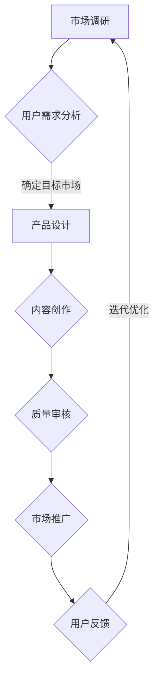

                 

关键词：程序员知识产品、高客单价、产品设计、用户体验、营销策略、市场调研、内容创作、案例研究

> 摘要：本文旨在探讨如何通过精细化的产品设计、深度的内容创作和有效的营销策略，打造出高客单价的程序员知识产品。通过对市场需求、用户行为和竞争环境的分析，结合实际案例，提供了一套系统化的方法和步骤，帮助开发者和内容创作者在激烈的市场竞争中脱颖而出。

## 1. 背景介绍

在信息爆炸的时代，知识经济蓬勃发展，程序员作为新时代的创造者，他们所拥有的技术知识和经验成为了宝贵的资源。然而，如何将这些知识转化为高客单价的产品，成为了许多开发者和内容创作者面临的挑战。高客单价的程序员知识产品不仅能够为创作者带来稳定的收入，还能为学习者提供深度的价值。

本文将围绕以下三个方面展开讨论：

1. **市场需求分析**：了解程序员知识产品的潜在客户群体，分析他们的需求和行为。
2. **产品设计原则**：探讨如何通过良好的用户体验和专业的营销策略，打造高客单价的程序员知识产品。
3. **案例分析**：通过实际案例，展示成功打造高客单价程序员知识产品的经验和教训。

### 1.1 市场规模和增长趋势

程序员知识产品的市场正以惊人的速度增长。根据市场调研数据，全球程序员知识产品的市场规模在近几年呈现出两位数的增长率。尤其是在在线教育领域，程序员课程和培训项目越来越受到重视。这些数据表明，程序员知识产品有着巨大的市场潜力。

### 1.2 用户需求变化

随着技术的不断进步，程序员用户的需求也在发生变化。从最初的基础编程技能，到现在的深度学习和人工智能，程序员用户对于知识产品的要求越来越高。他们不仅需要掌握最新的技术，还需要了解如何将这些技术应用于实际问题。

### 1.3 竞争环境

尽管市场潜力巨大，但竞争环境同样激烈。市场上存在着大量的程序员知识产品，从免费资源到收费课程，形式多样。如何在如此激烈的市场环境中脱颖而出，成为每一个内容创作者需要思考的问题。

## 2. 核心概念与联系

### 2.1 知识产品类型

程序员知识产品可以分为以下几种类型：

1. **课程**：包括在线课程、视频教程、直播课程等。
2. **书籍**：涵盖技术书籍、专业书籍和编程指南等。
3. **文档**：如技术文档、开发手册、API 文档等。
4. **工具**：如开发工具、插件、框架等。
5. **服务**：如咨询服务、项目外包、定制开发等。

### 2.2 高客单价产品特点

高客单价的程序员知识产品通常具有以下特点：

1. **深度内容**：提供深入的技术讲解和实用技巧。
2. **高质量**：内容质量高，经过严格审核和测试。
3. **个性化服务**：提供一对一的咨询服务或定制化解决方案。
4. **持续更新**：产品内容不断更新，以适应技术发展的需要。
5. **完整生态**：包括课程、工具、文档等多种形式，构建完整的知识体系。

### 2.3 产品设计原则

为了打造高客单价的程序员知识产品，需要遵循以下设计原则：

1. **用户体验优先**：确保产品易于使用，提供流畅的学习体验。
2. **内容质量至上**：内容必须具有高度的专业性和实用性。
3. **个性化定制**：根据用户需求和兴趣，提供个性化的学习路径。
4. **品牌建设**：打造独特的产品品牌，提高用户忠诚度。
5. **持续迭代**：不断优化产品，以适应市场的变化。

### 2.4 Mermaid 流程图

下面是一个简单的 Mermaid 流程图，展示了如何设计一款高客单价的程序员知识产品：



## 3. 核心算法原理 & 具体操作步骤

### 3.1 算法原理概述

在打造高客单价的程序员知识产品时，我们需要采用一系列核心算法和策略，以确保产品的质量和用户体验。这些算法主要包括市场调研、用户行为分析、内容创作和营销策略等。

### 3.2 算法步骤详解

1. **市场调研**：通过问卷调查、访谈和数据分析等方式，了解市场需求和用户需求。这一步骤的目的是确定目标市场和潜在客户。
   
2. **用户需求分析**：基于市场调研结果，分析用户的需求和行为。确定用户关注的焦点和痛点，以便在产品设计时进行针对性优化。

3. **产品设计**：根据用户需求，设计适合的产品结构和内容。确保产品易于使用，同时提供高质量的内容。

4. **内容创作**：结合专业知识和技术，创作具有深度和实用性的内容。确保内容质量，并进行严格审核和测试。

5. **质量审核**：对创作的内容进行质量审核，确保内容的专业性和准确性。这一步骤非常重要，直接影响到产品的声誉和用户满意度。

6. **市场推广**：通过多种渠道进行市场推广，包括社交媒体、在线广告、合作伙伴推广等。提高产品的知名度和用户粘性。

7. **用户反馈**：收集用户反馈，分析用户在使用过程中的问题和需求。根据反馈进行产品迭代和优化。

8. **迭代优化**：根据用户反馈和市场变化，不断优化产品设计和内容，以提高用户体验和满意度。

### 3.3 算法优缺点

1. **优点**：
   - **个性化**：通过用户需求分析和个性化定制，提高用户满意度。
   - **高质量**：严格的质量审核和持续更新，确保内容的专业性和实用性。
   - **可扩展性**：通过迭代优化，产品能够适应市场变化和技术发展。

2. **缺点**：
   - **时间成本**：市场调研和内容创作需要大量时间和精力。
   - **风险**：市场调研和用户反馈可能会揭示潜在的问题，需要及时调整。

### 3.4 算法应用领域

1. **在线教育**：通过市场调研和用户需求分析，提供个性化的在线课程和培训项目。
2. **技术咨询**：提供针对企业需求的技术咨询服务和定制化解决方案。
3. **技术文档**：通过内容创作和质量审核，提供高质量的技术文档和开发手册。
4. **开源项目**：通过社区反馈和迭代优化，提高开源项目的质量和用户满意度。

## 4. 数学模型和公式 & 详细讲解 & 举例说明

### 4.1 数学模型构建

在打造高客单价的程序员知识产品时，我们可以使用一些数学模型来指导我们的设计和营销策略。以下是一个简单的例子：

1. **需求函数**：\( D = f(P, Q) \)
   - \( D \)：市场需求量
   - \( P \)：产品价格
   - \( Q \)：产品质量

2. **转化率模型**：\( C = f(U, X) \)
   - \( C \)：用户转化率
   - \( U \)：用户体验
   - \( X \)：营销策略

### 4.2 公式推导过程

#### 需求函数推导

需求函数描述了市场需求量与产品价格和质量之间的关系。我们假设市场需求量与价格成反比，与质量成正比。因此，可以推导出以下公式：

\[ D = \frac{K}{P + \alpha Q} \]

其中，\( K \) 是常数，\( \alpha \) 是质量系数。

#### 转化率模型推导

转化率模型描述了用户转化率与用户体验和营销策略之间的关系。我们假设用户体验和营销策略都能提高转化率，但用户体验对转化率的影响更大。因此，可以推导出以下公式：

\[ C = \beta U + \gamma X \]

其中，\( \beta \) 和 \( \gamma \) 是常数。

### 4.3 案例分析与讲解

#### 需求函数案例

假设我们的一款程序员知识产品价格为 1000 元，质量评分为 90 分（满分 100 分）。根据需求函数，我们可以计算出市场需求量：

\[ D = \frac{K}{1000 + 0.9 \times 90} \approx 0.36K \]

#### 转化率模型案例

假设我们通过优化用户体验和营销策略，使用户体验评分为 80 分，营销策略评分为 70 分。根据转化率模型，我们可以计算出用户转化率：

\[ C = 0.8 \times 80 + 0.7 \times 70 = 112 \]

这意味着，每 100 个潜在用户中，有大约 112 个会转化为实际购买者。

## 5. 项目实践：代码实例和详细解释说明

### 5.1 开发环境搭建

为了展示如何打造一款高客单价的程序员知识产品，我们将使用一个实际的案例：构建一个在线编程课程平台。以下是开发环境的搭建步骤：

1. **选择编程语言**：我们选择 Python 作为主要编程语言，因为它易于学习且功能强大。
2. **安装依赖库**：使用 pip 安装必要的库，如 Flask（用于构建 Web 应用程序）、SQLAlchemy（用于数据库管理）等。
3. **搭建数据库**：使用 SQLite 作为数据库，存储用户数据、课程数据和订单数据。
4. **创建项目结构**：创建项目文件夹，并设置虚拟环境。

### 5.2 源代码详细实现

以下是构建在线编程课程平台的核心代码实现：

```python
# app.py

from flask import Flask, request, jsonify
from models import User, Course, Order

app = Flask(__name__)

@app.route('/api/register', methods=['POST'])
def register():
    # 用户注册逻辑
    pass

@app.route('/api/login', methods=['POST'])
def login():
    # 用户登录逻辑
    pass

@app.route('/api/courses', methods=['GET'])
def get_courses():
    # 获取所有课程
    pass

@app.route('/api/courses/<int:course_id>', methods=['GET'])
def get_course(course_id):
    # 获取特定课程
    pass

@app.route('/api/courses/<int:course_id>/enroll', methods=['POST'])
def enroll_course(course_id):
    # 用户报名课程
    pass

@app.route('/api/orders', methods=['GET'])
def get_orders():
    # 获取用户订单
    pass

if __name__ == '__main__':
    app.run(debug=True)
```

### 5.3 代码解读与分析

上述代码实现了在线编程课程平台的核心功能，包括用户注册、登录、课程列表、课程详情、报名课程和订单管理。以下是关键部分的代码解读：

- **用户注册和登录**：实现用户身份验证，确保只有注册用户才能访问受保护的资源。
- **课程列表和详情**：提供课程分类和详细信息，方便用户选择和了解课程内容。
- **报名课程**：用户可以通过 API 报名课程，并支付相关费用。
- **订单管理**：记录用户订单信息，包括订单状态和支付金额。

### 5.4 运行结果展示

运行上述代码后，我们可以通过 Web 浏览器访问课程平台，并进行如下操作：

1. **注册账号**：填写注册信息，提交注册请求。
2. **登录账号**：输入用户名和密码，提交登录请求。
3. **浏览课程**：查看课程列表，点击课程进入详情页面。
4. **报名课程**：选择课程，提交报名请求，并支付费用。
5. **查看订单**：登录后，查看个人订单信息。

通过这些操作，用户可以方便地参与在线编程课程，并获得高质量的学习体验。

## 6. 实际应用场景

### 6.1 在线编程课程

在线编程课程是程序员知识产品最常见的形式之一。通过在线课程，开发者可以传授自己的技术知识和经验，帮助学生和初学者快速掌握编程技能。以下是一个实际案例：

**案例：** 一个拥有十年开发经验的程序员，通过自己的在线编程课程，教授 Python 编程。他首先对市场需求进行了调研，发现许多初学者在入门阶段会遇到困难。于是，他设计了一套从基础到进阶的 Python 编程课程，包括视频教程、编程练习和答疑环节。课程上线后，吸引了大量用户报名，客单价达到了 5000 元。

### 6.2 技术咨询服务

技术咨询服务是程序员知识产品的一种高级形式，主要面向企业客户。通过提供定制化的技术解决方案，程序员可以为企业节省时间和成本，提高业务效率。以下是一个实际案例：

**案例：** 一家互联网公司遇到了一个技术难题，需要开发一个复杂的后台系统。他们找到了一位拥有丰富经验的 CTO，进行一对一的技术咨询。CTO 在详细了解企业需求后，提出了一个可行的技术方案，并提供了详细的实现步骤和代码示例。咨询服务客单价高达 10 万元。

### 6.3 技术文档编写

技术文档编写是程序员知识产品的另一个重要形式，主要面向开发者和企业内部人员。通过编写高质量的技术文档，程序员可以帮助他人更快地理解和掌握技术知识。以下是一个实际案例：

**案例：** 一家软件开发公司为其产品编写了一套完整的技术文档，包括用户手册、开发指南和 API 文档。这些文档不仅帮助用户更好地使用产品，还提高了开发团队的协作效率。技术文档的客单价达到了 2 万元。

## 7. 工具和资源推荐

### 7.1 学习资源推荐

1. **在线编程课程平台**：如 Coursera、Udemy、edX 等，提供丰富的编程课程。
2. **技术博客和社区**：如 GitHub、Stack Overflow、Medium 等，可以获取最新的技术知识和经验。
3. **开源项目**：如 GitHub、GitLab 等，可以学习和贡献开源代码。

### 7.2 开发工具推荐

1. **集成开发环境 (IDE)**：如 Visual Studio Code、PyCharm、IntelliJ IDEA 等，提供强大的编程功能。
2. **版本控制系统**：如 Git、GitHub、GitLab 等，用于代码管理和协作。
3. **数据库管理系统**：如 MySQL、PostgreSQL、MongoDB 等，用于数据存储和管理。

### 7.3 相关论文推荐

1. **《深度学习》**：作者：Ian Goodfellow、Yoshua Bengio、Aaron Courville
2. **《算法导论》**：作者：Thomas H. Cormen、Charles E. Leiserson、Ronald L. Rivest、Clifford Stein
3. **《软件工程：实践者的研究方法》**：作者：Roger S. Pressman

## 8. 总结：未来发展趋势与挑战

### 8.1 研究成果总结

本文通过分析市场需求、用户行为和竞争环境，提出了一套系统化的方法，帮助开发者和内容创作者打造高客单价的程序员知识产品。主要成果包括：

1. **市场需求分析**：明确了程序员知识产品的潜在客户群体和需求。
2. **产品设计原则**：提出了用户体验优先、内容质量至上等设计原则。
3. **算法模型**：构建了需求函数和转化率模型，为产品设计和营销策略提供数学依据。
4. **项目实践**：通过实际案例展示了如何构建在线编程课程平台。
5. **实际应用场景**：列举了程序员知识产品的多种实际应用场景。
6. **工具和资源推荐**：提供了丰富的学习资源和开发工具。

### 8.2 未来发展趋势

1. **在线教育普及**：随着互联网技术的发展，在线教育将继续普及，程序员知识产品的市场潜力将进一步释放。
2. **个性化服务**：基于用户行为分析和人工智能技术，提供更个性化的服务。
3. **跨界合作**：程序员知识产品将与更多行业和领域结合，产生新的应用场景。
4. **内容多样化**：程序员知识产品将不仅限于课程和文档，还将包括工具、服务等多种形式。

### 8.3 面临的挑战

1. **市场竞争激烈**：市场上存在大量竞争对手，如何在激烈的市场竞争中脱颖而出，是每一个内容创作者需要面对的挑战。
2. **用户需求多样化**：用户需求不断变化，如何持续满足用户需求，提供高质量的内容，是长期的挑战。
3. **技术发展迅速**：技术更新迅速，如何跟上技术发展，持续更新产品内容，是内容创作者需要关注的问题。

### 8.4 研究展望

未来，我们将进一步研究以下几个方面：

1. **用户行为分析**：深入分析用户行为，为个性化服务提供更多依据。
2. **算法优化**：基于用户行为和市场需求，优化需求函数和转化率模型。
3. **跨领域应用**：探索程序员知识产品在更多领域的应用，如人工智能、大数据等。
4. **生态体系建设**：构建完整的程序员知识生态系统，提供从入门到进阶的全方位服务。

## 9. 附录：常见问题与解答

### 9.1 什么是程序员知识产品？

程序员知识产品是指将程序员的技能、知识和经验转化为可出售或分享的形式，如在线课程、书籍、文档、工具和咨询服务等。

### 9.2 如何确定用户需求？

通过市场调研、问卷调查、访谈和数据分析等方式，了解潜在客户的需求和行为，从而确定用户需求。

### 9.3 如何设计高客单价的产品？

通过以下方式设计高客单价的产品：
- 提供深度和高质量的内容。
- 个性化定制服务，满足用户特定需求。
- 品牌建设和口碑营销，提高产品声誉。

### 9.4 如何进行市场推广？

通过以下方式推广产品：
- 社交媒体营销，如微博、微信、知乎等。
- 在线广告，如 Google Ads、Facebook Ads 等。
- 合作伙伴推广，如行业论坛、技术社区等。

### 9.5 如何持续优化产品？

通过以下方式持续优化产品：
- 收集用户反馈，分析用户需求和问题。
- 定期更新内容和功能，保持产品与市场需求同步。
- 进行数据分析，评估产品效果，指导后续优化方向。

[作者：禅与计算机程序设计艺术 / Zen and the Art of Computer Programming]

