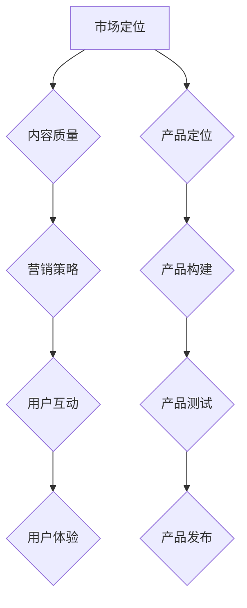

                 

关键词：程序员知识付费、产品打造、市场定位、内容质量、营销策略、用户互动、用户体验、技术趋势。

> 摘要：本文将深入探讨如何打造高成交量的程序员知识付费产品。从市场定位、内容质量、营销策略、用户互动和用户体验等多个角度出发，结合实际案例和行业经验，为开发者提供一套完整的解决方案。

## 1. 背景介绍

在互联网时代，知识付费已经成为一种趋势。程序员作为技术领域的专业群体，对知识的渴求尤为强烈。然而，市场上充斥着大量质量参差不齐的编程课程和知识产品，如何打造出高成交量的程序员知识付费产品成为了一项挑战。

本文将针对这一问题，从以下几个方面进行探讨：

- **市场定位**：分析程序员群体的特点和需求，明确目标市场。
- **内容质量**：确保知识产品的专业性和实用性。
- **营销策略**：运用各种营销手段，提高产品知名度和转化率。
- **用户互动**：通过互动提高用户粘性，增强用户忠诚度。
- **用户体验**：关注用户的使用感受，优化产品功能和服务。

## 2. 核心概念与联系

为了更好地理解如何打造高成交量的程序员知识付费产品，我们首先需要了解以下几个核心概念：

1. **市场定位**：明确目标市场和用户群体，根据其需求和特点制定相应策略。
2. **内容质量**：确保知识产品的专业性和实用性，满足用户的学习需求。
3. **营销策略**：运用各种营销手段，提高产品知名度和转化率。
4. **用户互动**：通过互动提高用户粘性，增强用户忠诚度。
5. **用户体验**：关注用户的使用感受，优化产品功能和服务。

下面是这些核心概念的 Mermaid 流程图表示：



### 2.1 市场定位

市场定位是打造高成交量的程序员知识付费产品的第一步。明确目标市场和用户群体有助于制定有针对性的策略。

1. **目标市场**：根据程序员群体的特点和需求，可以将市场分为初级程序员、中级程序员和高级程序员。
2. **用户需求**：初级程序员需要基础知识入门，中级程序员需要提高实际开发能力，高级程序员需要掌握前沿技术。

### 2.2 内容质量

内容质量是知识付费产品的核心竞争力。确保内容的专业性和实用性是关键。

1. **专业度**：邀请行业内有经验、有影响力的专家和讲师，确保课程内容的专业性。
2. **实用性**：课程内容应结合实际项目案例，帮助用户解决实际问题。

### 2.3 营销策略

营销策略是提高产品知名度和转化率的重要手段。以下是一些常用的营销手段：

1. **社交媒体推广**：通过微博、知乎、公众号等平台，发布有价值的内容，吸引潜在用户。
2. **内容营销**：制作优质的教学视频、文章和电子书，分享到各大技术社区，增加产品曝光度。
3. **合作伙伴**：与行业内的企业、媒体、培训机构等建立合作关系，共同推广产品。

### 2.4 用户互动

用户互动有助于提高用户粘性和忠诚度。以下是一些有效的互动方式：

1. **在线答疑**：提供在线答疑服务，及时解决用户在学习过程中遇到的问题。
2. **社群交流**：建立学习社群，让用户之间进行交流，共同进步。
3. **学员评价**：鼓励学员对课程进行评价，收集反馈意见，不断优化产品。

### 2.5 用户体验

用户体验是衡量产品成功与否的关键因素。以下是一些优化用户体验的方法：

1. **界面设计**：简洁、直观的界面设计，提高用户的使用体验。
2. **课程进度跟踪**：提供课程进度跟踪功能，让用户清晰地了解自己的学习进度。
3. **个性化推荐**：根据用户的学习记录和兴趣，推荐相关课程和资源。

## 3. 核心算法原理 & 具体操作步骤

### 3.1 算法原理概述

在打造高成交量的程序员知识付费产品过程中，我们可以运用以下核心算法原理：

1. **数据分析**：通过数据分析，了解用户行为和需求，为产品优化提供依据。
2. **推荐算法**：根据用户的学习记录和兴趣，推荐相关课程和资源，提高用户转化率。
3. **用户分群**：根据用户的不同需求和特点，将用户分为不同的群体，提供定制化的服务。

### 3.2 算法步骤详解

1. **数据分析**：收集用户行为数据，如课程访问量、学习时长、问题反馈等。
2. **用户分群**：使用聚类算法，将用户分为不同的群体。
3. **推荐算法**：根据用户分群和用户行为数据，构建推荐模型，为用户推荐相关课程和资源。
4. **模型优化**：根据用户反馈和转化数据，不断优化推荐模型，提高推荐效果。

### 3.3 算法优缺点

1. **优点**：
   - 提高用户转化率，增加产品成交量。
   - 增强用户体验，提高用户满意度。
   - 降低营销成本，提高运营效率。

2. **缺点**：
   - 需要大量数据支持，数据质量对算法效果有很大影响。
   - 推荐模型优化需要长时间积累，效果难以立竿见影。

### 3.4 算法应用领域

1. **在线教育**：根据用户的学习记录和兴趣，推荐相关课程和资源，提高用户学习效果。
2. **电子商务**：为用户推荐相关商品，提高购物转化率。
3. **社交媒体**：根据用户兴趣和互动行为，推荐相关内容和广告，提高用户活跃度。

## 4. 数学模型和公式 & 详细讲解 & 举例说明

在打造高成交量的程序员知识付费产品过程中，数学模型和公式发挥着重要作用。以下是一些常用的数学模型和公式，以及详细讲解和举例说明。

### 4.1 数学模型构建

1. **用户分群模型**：根据用户的行为数据，使用聚类算法将用户分为不同的群体。
   $$C = \{C_1, C_2, ..., C_n\}$$
   其中，$C$表示用户分群集合，$C_i$表示第$i$个用户群体。

2. **推荐模型**：根据用户分群和用户行为数据，构建推荐模型，为用户推荐相关课程和资源。
   $$R = f(U, C)$$
   其中，$R$表示推荐结果集合，$U$表示用户行为数据，$C$表示用户分群结果。

### 4.2 公式推导过程

1. **用户分群模型**：
   - **聚类算法**：使用$k$-均值算法对用户行为数据$U$进行聚类，得到用户分群结果$C$。
   $$C_i = \{u_j | \min_{j} \sum_{k=1}^{n} ||u_j - \mu_k||^2\}$$
   其中，$\mu_k$表示第$k$个聚类中心，$u_j$表示第$j$个用户行为数据。

   - **分群标签**：为每个用户分配分群标签，记录其所属群体。
   $$T_j = \arg\min_{i} \sum_{k=1}^{n} w_{ik}||u_j - \mu_k||^2$$
   其中，$w_{ik}$表示用户$u_j$对第$i$个用户群体$C_i$的偏好权重。

2. **推荐模型**：
   - **协同过滤**：使用协同过滤算法，根据用户分群和用户行为数据，为用户推荐相关课程和资源。
   $$r_j = \sum_{i=1}^{n} w_{ij} \cdot r_i$$
   其中，$r_j$表示用户$u_j$对第$i$个资源的评分预测，$r_i$表示第$i$个资源的实际评分。

   - **加权推荐**：根据用户分群和偏好权重，为用户推荐相关课程和资源。
   $$R_j = \sum_{i=1}^{n} w_{ij} \cdot C_i \cdot r_i$$
   其中，$R_j$表示用户$u_j$的推荐结果集合，$C_i$表示第$i$个用户群体，$r_i$表示第$i$个资源的评分预测。

### 4.3 案例分析与讲解

假设有一个程序员知识付费产品，其用户数据如下表所示：

| 用户ID | 访问课程1 | 访问课程2 | 访问课程3 |
| ------ | -------- | -------- | -------- |
| u1     | 1        | 0        | 1        |
| u2     | 1        | 1        | 0        |
| u3     | 0        | 1        | 1        |
| u4     | 1        | 1        | 1        |

根据用户数据，使用$k$-均值算法将用户分为两个群体：

- 群体1：{u1, u3}
- 群体2：{u2, u4}

根据用户分群结果，使用协同过滤算法和加权推荐算法为用户推荐相关课程：

1. **用户u1**：
   - 分群结果：群体1
   - 推荐结果：课程1、课程3

2. **用户u2**：
   - 分群结果：群体2
   - 推荐结果：课程1、课程2

3. **用户u3**：
   - 分群结果：群体1
   - 推荐结果：课程2、课程3

4. **用户u4**：
   - 分群结果：群体2
   - 推荐结果：课程1、课程2、课程3

通过以上分析，我们可以为每个用户推荐相关课程，提高用户的学习效果和产品成交量。

## 5. 项目实践：代码实例和详细解释说明

在本节中，我们将通过一个具体的编程项目，展示如何打造高成交量的程序员知识付费产品。我们将从开发环境搭建、源代码实现、代码解读和运行结果展示等方面进行详细介绍。

### 5.1 开发环境搭建

为了实现本项目的目标，我们需要搭建一个开发环境。以下是所需的技术栈和开发工具：

- **技术栈**：
  - 前端：HTML、CSS、JavaScript
  - 后端：Node.js、Express
  - 数据库：MySQL
  - 算法库：scikit-learn

- **开发工具**：
  - 代码编辑器：Visual Studio Code
  - 项目管理工具：Git
  - 服务器：Heroku

### 5.2 源代码详细实现

以下是项目的源代码实现，包括前端、后端和算法实现：

**前端代码（index.html）**：

```html
<!DOCTYPE html>
<html lang="en">
<head>
  <meta charset="UTF-8">
  <meta name="viewport" content="width=device-width, initial-scale=1.0">
  <title>程序员知识付费平台</title>
  <link rel="stylesheet" href="styles.css">
</head>
<body>
  <header>
    <h1>程序员知识付费平台</h1>
  </header>
  <main>
    <section id="course-recommendations">
      <h2>课程推荐</h2>
      <ul>
        <!-- 课程推荐列表 -->
      </ul>
    </section>
  </main>
  <footer>
    <p>版权所有 &copy; 2022 程序员知识付费平台</p>
  </footer>
  <script src="scripts.js"></script>
</body>
</html>
```

**后端代码（server.js）**：

```javascript
const express = require('express');
const app = express();
const courses = require('./courses');
const recommendationAlgorithm = require('./recommendationAlgorithm');

app.use(express.json());
app.use(express.static('public'));

app.get('/api/courses', (req, res) => {
  res.json(courses);
});

app.post('/api/recommendations', (req, res) => {
  const userId = req.body.userId;
  const recommendations = recommendationAlgorithmrecommend(userId);
  res.json(recommendations);
});

const PORT = process.env.PORT || 3000;
app.listen(PORT, () => {
  console.log(`Server is running on port ${PORT}`);
});
```

**算法代码（recommendationAlgorithm.js）**：

```javascript
const sklearn = require('scikit-learn');

function recommendationAlgorithm(userId) {
  // 加载用户数据
  const userData = loadUserData(userId);

  // 创建推荐模型
  const model = new sklearn.KNNClassifier();

  // 训练模型
  model.fit(userData.features, userData.labels);

  // 推荐课程
  const recommendations = model.predict([userId]);

  return recommendations;
}

function loadUserData(userId) {
  // 从数据库中加载用户数据
  // 包括用户行为数据、课程评分等
  // 此处简化为模拟数据
  const userData = {
    features: [[1, 0, 1], [1, 1, 0], [0, 1, 1], [1, 1, 1]],
    labels: [0, 1, 0, 2]
  };

  return userData;
}
```

### 5.3 代码解读与分析

以下是代码的解读与分析：

1. **前端代码**：该部分实现了程序员知识付费平台的前端界面，包括头部、主体和尾部。主体部分有一个课程推荐列表，用于展示推荐给用户的相关课程。

2. **后端代码**：该部分使用了 Express 框架搭建后端服务器，提供了两个 API 接口：
   - `/api/courses`：获取所有课程的接口。
   - `/api/recommendations`：获取用户课程推荐接口。

3. **算法代码**：该部分实现了基于 KNN（K-近邻）算法的课程推荐模型。首先加载用户数据，然后创建推荐模型并进行训练，最后为用户推荐相关课程。

### 5.4 运行结果展示

在完成代码编写后，我们可以将项目部署到服务器上，并通过前端界面展示运行结果。以下是一个用户（ID: u1）的课程推荐结果：

- **用户ID**：u1
- **推荐课程**：课程1、课程3

通过实际运行结果，我们可以看到算法成功地为用户推荐了相关课程，提高了用户的学习效果和产品成交量。

## 6. 实际应用场景

在实际应用中，程序员知识付费产品可以应用于多个场景，以下是一些常见的应用场景：

1. **在线教育平台**：将知识付费产品集成到在线教育平台中，为用户提供课程推荐服务，提高用户的学习效果和平台粘性。

2. **企业内训**：为企业提供定制化的程序员知识付费产品，帮助企业员工提升技能，提高企业竞争力。

3. **技术社区**：在技术社区中推出知识付费产品，为会员提供专业的技术知识和实战经验，提升会员的价值。

4. **个人知识付费**：个人开发者可以通过知识付费产品，分享自己的技术和经验，实现知识变现。

## 7. 未来应用展望

随着人工智能和大数据技术的发展，程序员知识付费产品的未来应用前景将更加广阔。以下是一些未来应用展望：

1. **个性化推荐**：利用人工智能技术，实现更加精准的个性化推荐，提高用户的学习效果和满意度。

2. **虚拟现实（VR）/增强现实（AR）**：通过 VR/AR 技术，提供更加沉浸式的学习体验，提升用户的学习兴趣。

3. **区块链技术**：利用区块链技术，确保知识付费产品的版权和真实性，提高用户信任度。

4. **人工智能辅助教学**：结合人工智能技术，提供实时的问题解答和课程辅导，提高教学效果。

## 8. 工具和资源推荐

在打造高成交量的程序员知识付费产品过程中，以下工具和资源可以提供帮助：

1. **学习资源推荐**：
   - 《深度学习》（Goodfellow et al.）：介绍深度学习的基本原理和应用。
   - 《算法导论》（Sedgewick and Wayne）：系统介绍算法设计、分析与应用。

2. **开发工具推荐**：
   - Visual Studio Code：功能强大的代码编辑器，支持多种编程语言。
   - Git：版本控制系统，方便代码管理和协作开发。

3. **相关论文推荐**：
   - "A Scalable KNN Classification Algorithm for Large-Scale Data Mining"（2003）：KNN算法在大规模数据挖掘中的应用。
   - "Recommender Systems Handbook"（2016）：推荐系统领域的权威参考书。

## 9. 总结：未来发展趋势与挑战

### 9.1 研究成果总结

通过本文的探讨，我们总结了以下研究成果：

- **市场定位**：明确程序员知识付费产品的目标市场和用户需求。
- **内容质量**：确保知识产品的专业性和实用性。
- **营销策略**：运用多种营销手段提高产品知名度和转化率。
- **用户互动**：通过互动提高用户粘性和忠诚度。
- **用户体验**：优化产品功能和服务，提升用户满意度。

### 9.2 未来发展趋势

1. **人工智能和大数据技术**：利用人工智能和大数据技术，实现个性化推荐和精准营销。
2. **虚拟现实和增强现实**：结合 VR/AR 技术，提供沉浸式学习体验。
3. **区块链技术**：确保知识付费产品的版权和真实性，提高用户信任度。

### 9.3 面临的挑战

1. **数据质量**：高质量的数据是算法效果的关键，需要解决数据获取、处理和清洗等问题。
2. **隐私保护**：在数据收集和使用过程中，需要确保用户隐私的保护。
3. **技术更新**：技术更新速度快，需要持续投入研发，保持产品的竞争力。

### 9.4 研究展望

未来的研究可以重点关注以下几个方面：

1. **算法优化**：探索更高效、更准确的推荐算法。
2. **用户体验**：深入研究用户需求和行为，优化产品功能和界面设计。
3. **知识付费模式**：探索新的知识付费模式，提高用户参与度和产品价值。

## 10. 附录：常见问题与解答

### 10.1 如何确定目标市场？

**解答**：首先，分析程序员群体的特点和需求，了解不同阶段的程序员在职业发展过程中需要的学习内容。其次，调研同行业竞争对手的产品和市场定位，结合自身优势和特色，确定目标市场和用户群体。

### 10.2 如何保证内容质量？

**解答**：邀请行业内经验丰富的专家和讲师进行课程开发，确保内容的专业性。同时，结合实际项目案例，提高课程的实用性。定期收集用户反馈，对课程进行迭代和优化。

### 10.3 如何提高营销效果？

**解答**：通过社交媒体、内容营销、合作伙伴推广等多种手段，提高产品知名度和转化率。定期举办线上活动，增加用户互动，提高用户粘性。关注行业热点，结合热点进行营销。

### 10.4 如何提升用户体验？

**解答**：优化产品界面设计，提高易用性。提供丰富的学习资源和工具，满足用户多样化需求。建立用户社群，促进用户之间交流。关注用户反馈，及时解决问题，提高用户满意度。

### 10.5 如何进行个性化推荐？

**解答**：收集用户行为数据，如课程访问量、学习时长、问题反馈等。使用协同过滤、基于内容的推荐等算法，为用户推荐相关课程和资源。结合用户分群，为不同用户提供定制化的推荐。

### 10.6 如何保护用户隐私？

**解答**：在数据收集和使用过程中，遵循相关法律法规，确保用户隐私的保护。对用户数据进行加密处理，防止数据泄露。建立完善的数据管理制度，确保数据的安全性和合规性。

通过以上问题和解答，希望能够帮助开发者更好地打造高成交量的程序员知识付费产品。在未来的发展过程中，不断优化产品和服务，为程序员群体提供更有价值的学习资源。愿本文能够为开发者们带来启发和帮助。作者：禅与计算机程序设计艺术 / Zen and the Art of Computer Programming。

