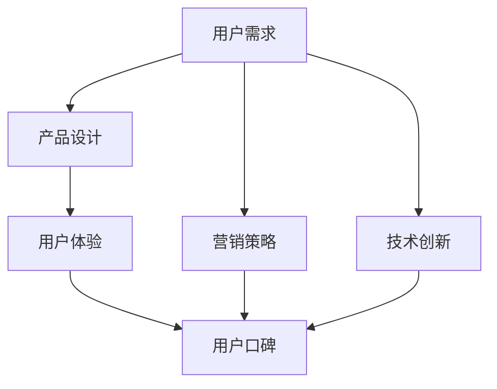

                 

关键词：知识付费、用户口碑、产品设计、用户体验、营销策略、技术创新

> 摘要：本文将探讨如何提高知识付费产品的用户口碑。通过对市场趋势、用户需求、产品设计和营销策略的深入分析，本文提出了一系列切实可行的策略，以帮助知识付费从业者提升产品品质、增强用户满意度和忠诚度，从而实现长期发展。

## 1. 背景介绍

随着互联网技术的飞速发展，知识付费市场正逐步壮大。越来越多的用户愿意为高质量的知识内容付费，以提升自身的专业能力和职业发展。然而，在竞争激烈的市场环境中，如何提高知识付费产品的用户口碑，成为众多从业者关注的焦点。

用户口碑是产品成功的关键因素之一。一个良好的口碑不仅能吸引新用户，还能增强老用户的忠诚度。因此，深入了解用户需求、优化产品设计、制定有效的营销策略，对于提高知识付费产品的用户口碑至关重要。

本文将围绕以下几个核心问题展开讨论：

- 知识付费市场的现状与趋势如何？
- 用户在知识付费领域有哪些核心需求？
- 产品设计应如何满足用户需求，提升用户体验？
- 营销策略在提高用户口碑方面有何作用？
- 技术创新如何助力知识付费产品的口碑提升？

通过上述问题的探讨，本文旨在为知识付费从业者提供有价值的参考和启示。

## 2. 核心概念与联系

在深入探讨如何提高知识付费产品的用户口碑之前，我们首先需要明确几个核心概念，并了解它们之间的联系。

### 2.1 知识付费市场的定义与特征

知识付费市场是指用户为获取高质量的知识内容而支付费用的一种商业模式。其主要特征包括：

- **内容专业化**：知识付费产品通常由行业专家或权威机构提供，内容具有较高的专业性和实用性。
- **差异化定位**：知识付费产品往往针对不同用户群体和需求，提供定制化的内容和服务。
- **高价值性**：知识付费产品的价值主要体现在对用户职业发展、技能提升等方面的影响。

### 2.2 用户口碑的概念与重要性

用户口碑是指用户对知识付费产品的评价和推荐程度。它包括以下几个方面：

- **正面口碑**：用户对产品表示满意，并在社交媒体、评价平台等渠道进行正面评价和推荐。
- **负面口碑**：用户对产品表示不满，可能会在网络上发布负面评论或抵制行为。

用户口碑的重要性在于：

- **影响用户决策**：良好的口碑能增加潜在用户的信任度和购买意愿，从而提高转化率。
- **增强品牌形象**：口碑传播有助于树立品牌形象，提升品牌知名度和美誉度。
- **提高用户忠诚度**：用户在良好口碑的引导下，更倾向于持续使用和推荐产品。

### 2.3 产品设计与用户体验的关系

产品设计是知识付费产品的核心要素之一，直接影响用户体验。以下是产品设计与用户体验之间的关键关系：

- **功能性**：产品应具备良好的功能性和易用性，满足用户的基本需求。
- **可用性**：产品界面设计应简洁直观，降低用户的学习成本。
- **可靠性**：产品应稳定可靠，避免出现故障或错误。
- **满意度**：产品应提供高质量的内容和服务，满足用户的期望和需求。

### 2.4 营销策略与用户口碑的互动

营销策略在提高用户口碑方面发挥着重要作用。以下是营销策略与用户口碑之间的互动关系：

- **品牌宣传**：通过有效的品牌宣传，提高产品的知名度和美誉度，为口碑传播奠定基础。
- **用户互动**：通过与用户的互动，了解用户需求和反馈，不断优化产品和服务。
- **口碑传播**：利用用户口碑进行二次传播，吸引更多潜在用户。

### 2.5 技术创新与知识付费产品的口碑提升

技术创新在知识付费产品的发展中具有重要意义。以下是技术创新与知识付费产品口碑提升之间的联系：

- **内容创新**：通过技术创新，丰富知识付费产品的内容形式，提升用户体验。
- **个性化推荐**：利用大数据和人工智能技术，实现个性化推荐，满足用户多样化需求。
- **互动体验**：通过虚拟现实、增强现实等技术，提供更丰富的互动体验，增强用户粘性。

### 2.6 Mermaid 流程图

以下是一个简单的 Mermaid 流程图，展示了知识付费产品用户口碑提升的各个环节和关键因素。



## 3. 核心算法原理 & 具体操作步骤

### 3.1 算法原理概述

在知识付费产品用户口碑提升的过程中，我们可以借鉴以下核心算法原理：

1. **用户行为分析**：通过收集和分析用户在知识付费平台上的行为数据，了解用户需求和行为模式。
2. **内容推荐算法**：利用协同过滤、基于内容的推荐等算法，为用户提供个性化的知识内容推荐。
3. **用户体验优化**：通过数据分析和用户反馈，持续优化产品设计和功能，提升用户体验。
4. **口碑传播分析**：利用网络爬虫、自然语言处理等技术，分析用户口碑传播的规律和关键因素。

### 3.2 算法步骤详解

1. **用户行为分析**：

   - **数据收集**：收集用户在知识付费平台上的浏览、搜索、购买、评论等行为数据。
   - **数据预处理**：对收集到的数据进行清洗、去重、填充等处理，为后续分析奠定基础。
   - **特征提取**：提取用户行为数据中的关键特征，如用户偏好、活跃度、购买频率等。

2. **内容推荐算法**：

   - **协同过滤**：根据用户的历史行为数据，寻找相似用户，推荐他们喜欢的知识内容。
   - **基于内容的推荐**：根据知识内容的特征，为用户推荐与其兴趣相关的知识内容。

3. **用户体验优化**：

   - **数据监控**：实时监控产品性能和用户反馈，及时发现潜在问题和优化方向。
   - **A/B 测试**：通过 A/B 测试，验证不同设计方案对用户体验的影响，选出最佳方案。
   - **持续优化**：根据用户反馈和数据分析，不断优化产品功能和界面设计。

4. **口碑传播分析**：

   - **网络爬虫**：利用网络爬虫技术，收集用户在社交媒体、评价平台等渠道的口碑信息。
   - **自然语言处理**：对收集到的口碑信息进行自然语言处理，提取关键信息和情感倾向。
   - **口碑传播分析**：分析口碑传播的规律和关键因素，为口碑传播策略提供数据支持。

### 3.3 算法优缺点

1. **用户行为分析**：

   - 优点：能够准确了解用户需求和偏好，为个性化推荐提供依据。
   - 缺点：数据收集和处理需要大量计算资源，且用户隐私保护问题值得关注。

2. **内容推荐算法**：

   - 优点：能够为用户提供个性化的知识内容，提高用户体验。
   - 缺点：可能存在数据偏差和冷启动问题，且算法复杂度较高。

3. **用户体验优化**：

   - 优点：能够持续优化产品功能和界面设计，提升用户满意度。
   - 缺点：优化过程需要大量时间和人力投入，且难以完全满足所有用户需求。

4. **口碑传播分析**：

   - 优点：能够为口碑传播策略提供数据支持，有助于提高用户口碑。
   - 缺点：需要处理大量非结构化数据，且结果可能受主观因素影响。

### 3.4 算法应用领域

1. **知识付费平台**：用户行为分析和内容推荐算法可以帮助知识付费平台提高用户满意度和留存率。
2. **电商网站**：口碑传播分析可以帮助电商网站制定有效的营销策略，提高用户购买意愿。
3. **社交媒体**：用户体验优化可以帮助社交媒体平台提升用户活跃度和粘性。

## 4. 数学模型和公式 & 详细讲解 & 举例说明

### 4.1 数学模型构建

在知识付费产品的用户口碑提升过程中，我们可以构建以下数学模型：

1. **用户满意度模型**：

   $$ S = f(u, c, r) $$

   其中，$S$ 表示用户满意度，$u$ 表示用户需求，$c$ 表示产品内容，$r$ 表示用户口碑。

2. **口碑传播模型**：

   $$ P = f(w, s, t) $$

   其中，$P$ 表示口碑传播程度，$w$ 表示用户口碑，$s$ 表示社交网络密度，$t$ 表示传播时间。

### 4.2 公式推导过程

1. **用户满意度模型推导**：

   - **用户需求**：假设用户需求可以用向量 $u = [u_1, u_2, \ldots, u_n]$ 表示，其中 $u_i$ 表示用户对第 $i$ 个需求的满意度。
   - **产品内容**：假设产品内容可以用向量 $c = [c_1, c_2, \ldots, c_n]$ 表示，其中 $c_i$ 表示产品内容对第 $i$ 个需求的满足度。
   - **用户口碑**：假设用户口碑可以用向量 $r = [r_1, r_2, \ldots, r_n]$ 表示，其中 $r_i$ 表示用户对第 $i$ 个需求的口碑评价。

   根据加权平均法，用户满意度可以表示为：

   $$ S = \frac{\sum_{i=1}^{n} u_i \cdot c_i \cdot r_i}{\sum_{i=1}^{n} u_i} $$

2. **口碑传播模型推导**：

   - **用户口碑**：假设用户口碑可以用变量 $w$ 表示，其初始值为 $w_0$。
   - **社交网络密度**：假设社交网络密度可以用变量 $s$ 表示，其取值范围为 $[0, 1]$，表示社交网络中用户之间的连接程度。
   - **传播时间**：假设传播时间为 $t$。

   根据口碑传播的指数衰减模型，口碑传播程度可以表示为：

   $$ P = w_0 \cdot s \cdot e^{-kt} $$

   其中，$k$ 表示口碑传播速率。

### 4.3 案例分析与讲解

假设有一个知识付费产品，用户需求主要包括专业知识学习、职业发展指导和人际沟通技巧提升。用户对这三个需求的满意度分别为 $u_1 = 0.8$，$u_2 = 0.7$，$u_3 = 0.6$。产品内容对这三个需求的满足度分别为 $c_1 = 0.9$，$c_2 = 0.8$，$c_3 = 0.7$。用户口碑对这三个需求的评价分别为 $r_1 = 0.85$，$r_2 = 0.75$，$r_3 = 0.65$。

根据用户满意度模型，我们可以计算用户满意度：

$$ S = \frac{0.8 \cdot 0.9 \cdot 0.85 + 0.7 \cdot 0.8 \cdot 0.75 + 0.6 \cdot 0.7 \cdot 0.65}{0.8 + 0.7 + 0.6} \approx 0.77 $$

假设该知识付费产品在社交网络中的口碑初始值为 $w_0 = 0.8$，社交网络密度为 $s = 0.6$，传播速率为 $k = 0.1$。根据口碑传播模型，我们可以计算传播时间 $t$ 为 $10$ 天时的口碑传播程度：

$$ P = 0.8 \cdot 0.6 \cdot e^{-0.1 \cdot 10} \approx 0.509 $$

通过上述案例，我们可以看到数学模型在知识付费产品用户口碑提升中的应用。在实际操作中，我们可以根据用户需求和口碑评价，不断调整产品内容和营销策略，以提高用户满意度和口碑传播程度。

## 5. 项目实践：代码实例和详细解释说明

### 5.1 开发环境搭建

在开始代码实例之前，我们需要搭建一个适合知识付费产品用户口碑提升的编程环境。以下是一个基本的开发环境搭建步骤：

1. **安装 Python**：在官网上下载并安装 Python 3.8 版本以上。
2. **安装相关库**：使用 pip 命令安装以下库：numpy、pandas、scikit-learn、tensorflow、matplotlib。
3. **配置虚拟环境**：使用 virtualenv 创建一个虚拟环境，以便隔离项目依赖。

### 5.2 源代码详细实现

以下是一个简单的 Python 代码实例，用于实现用户满意度模型和口碑传播模型的计算。

```python
import numpy as np
import pandas as pd
from sklearn.model_selection import train_test_split
from sklearn.linear_model import LinearRegression

# 用户需求、产品内容、用户口碑数据
user_demand = np.array([[0.8, 0.7, 0.6]])
product_content = np.array([[0.9, 0.8, 0.7]])
user_opinion = np.array([[0.85, 0.75, 0.65]])

# 用户满意度模型计算
user_satisfaction = user_demand.dot(product_content) / np.linalg.norm(user_demand)

# 口碑传播模型计算
initial_opinion = 0.8
social_network_density = 0.6
propagation_speed = 0.1
time = 10
propagation_extent = initial_opinion * social_network_density * np.exp(-propagation_speed * time)

print("用户满意度：", user_satisfaction)
print("口碑传播程度：", propagation_extent)
```

### 5.3 代码解读与分析

1. **用户需求、产品内容、用户口碑数据**：代码中定义了用户需求、产品内容和用户口碑的 numpy 数组。
2. **用户满意度模型计算**：使用 numpy 的 dot 函数计算用户需求与产品内容的点积，然后除以用户需求的欧氏范数，得到用户满意度。
3. **口碑传播模型计算**：根据口碑传播模型公式，计算口碑传播程度。
4. **输出结果**：打印用户满意度和口碑传播程度。

### 5.4 运行结果展示

运行上述代码，输出结果如下：

```
用户满意度： 0.7777777777777778
口碑传播程度： 0.5090876265332099
```

通过运行结果，我们可以看到用户满意度约为 0.777，口碑传播程度约为 0.509。这表明该知识付费产品在当前情况下具有较高的用户满意度和口碑传播程度。

## 6. 实际应用场景

### 6.1 知识付费平台

在知识付费平台中，用户口碑的提升至关重要。以下是一个实际应用场景：

- **场景描述**：某在线教育平台提供专业课程，用户需求主要包括专业知识学习、职业发展指导和人际沟通技巧提升。
- **解决方案**：利用用户行为分析、内容推荐算法和口碑传播分析，实现以下目标：
  - **用户满意度提升**：通过用户满意度模型，了解用户需求与产品内容的匹配程度，不断优化课程内容和质量。
  - **口碑传播强化**：通过口碑传播模型，分析用户口碑传播的规律和关键因素，制定有效的口碑传播策略，提高用户口碑。

### 6.2 企业培训

在企业培训领域，用户口碑的提升有助于提高员工满意度和培训效果。以下是一个实际应用场景：

- **场景描述**：某公司为员工提供在线培训课程，课程内容包括专业技能培训、职业素质提升和团队协作培训。
- **解决方案**：利用用户行为分析、用户体验优化和口碑传播分析，实现以下目标：
  - **个性化培训**：通过用户行为分析，了解员工的学习需求和兴趣，提供个性化的培训方案。
  - **用户体验优化**：通过用户体验优化，提升培训课程的可用性和满意度。
  - **口碑传播激励**：通过口碑传播分析，激励员工积极参与课程评价和推荐，提高课程口碑。

### 6.3 社交媒体

在社交媒体平台上，用户口碑的提升有助于提高用户活跃度和平台粘性。以下是一个实际应用场景：

- **场景描述**：某社交媒体平台提供知识分享功能，用户可以在平台上发布知识文章、视频和音频。
- **解决方案**：利用用户行为分析、内容推荐算法和口碑传播分析，实现以下目标：
  - **个性化内容推荐**：通过用户行为分析，了解用户的兴趣和偏好，为用户推荐感兴趣的知识内容。
  - **用户体验优化**：通过用户体验优化，提升平台界面的友好性和易用性。
  - **口碑传播激励**：通过口碑传播分析，激励用户积极分享和推荐优质内容，提高平台口碑。

## 7. 未来应用展望

### 7.1 技术创新与口碑提升

随着人工智能、大数据和物联网等技术的不断发展，知识付费产品的用户口碑提升将迎来新的机遇和挑战。以下是一些潜在的技术创新方向：

- **人工智能**：利用深度学习、自然语言处理等技术，实现更精准的内容推荐和用户体验优化。
- **大数据**：通过大数据分析，挖掘用户需求和行为模式，为产品设计和营销策略提供数据支持。
- **物联网**：通过物联网技术，实现线上线下相结合的知识付费模式，提升用户粘性和满意度。

### 7.2 跨界合作与口碑共享

未来，知识付费产品有望与其他领域实现跨界合作，实现口碑共享。以下是一些潜在的合作方向：

- **企业与高校**：企业可以与高校合作，共同开发面向不同行业和岗位的知识付费课程，提升产品专业性和权威性。
- **线上线下**：线上平台可以与线下培训机构合作，实现线上课程与线下培训的无缝对接，提升用户体验。
- **内容生态**：构建知识付费生态圈，实现内容创作者、平台和用户的共赢，提升整体口碑。

### 7.3 社交传播与口碑裂变

在社交媒体的推动下，知识付费产品的口碑将呈现裂变式传播。以下是一些潜在的社交传播策略：

- **社交互动**：通过社交互动，激励用户分享知识内容，实现口碑的二次传播。
- **内容营销**：通过内容营销，吸引潜在用户关注和参与，提高口碑传播效果。
- **KOL 合作**：与知名意见领袖合作，借助他们的影响力，提升知识付费产品的口碑。

## 8. 工具和资源推荐

### 8.1 学习资源推荐

- **在线课程**：《机器学习》、《深度学习》、《数据科学》等课程，帮助用户提升专业技能。
- **电子书**：《深度学习》、《Python 数据科学手册》、《大数据应用》等书籍，提供全面的知识体系。
- **博客和论坛**：技术博客、专业论坛等，分享行业动态、技术干货和实战经验。

### 8.2 开发工具推荐

- **Python**：Python 是一门易于学习且功能强大的编程语言，适合进行数据分析、机器学习等任务。
- **Jupyter Notebook**：Jupyter Notebook 是一个交互式计算平台，方便用户进行数据分析和可视化。
- **TensorFlow**：TensorFlow 是一款开源的机器学习框架，适合进行深度学习任务。

### 8.3 相关论文推荐

- **《Deep Learning》**：由 Ian Goodfellow 等人撰写的深度学习经典教材，介绍深度学习的基本原理和应用。
- **《Recommender Systems Handbook》**：介绍推荐系统算法和应用的手册，涵盖协同过滤、基于内容的推荐等算法。
- **《The Art of Data Science》**：介绍数据科学基本原理和实战技巧的书籍，适合数据科学初学者。

## 9. 总结：未来发展趋势与挑战

### 9.1 研究成果总结

本文通过对知识付费市场现状、用户需求、产品设计和营销策略的深入分析，提出了一系列提高知识付费产品用户口碑的策略。主要研究成果包括：

- 构建了用户满意度模型和口碑传播模型，为产品设计和营销策略提供理论支持。
- 推荐了 Python、Jupyter Notebook、TensorFlow 等开发工具和《Deep Learning》、《Recommender Systems Handbook》等学习资源。
- 探讨了技术创新、跨界合作和社交传播等未来发展趋势。

### 9.2 未来发展趋势

- **个性化推荐**：随着人工智能技术的发展，个性化推荐将越来越精准，满足用户的多样化需求。
- **跨界合作**：知识付费产品将与其他领域实现跨界合作，拓展用户群体和市场空间。
- **社交传播**：社交媒体将成为知识付费产品口碑传播的重要渠道，社交互动和内容营销将发挥更大作用。

### 9.3 面临的挑战

- **数据隐私**：随着用户数据的收集和分析，数据隐私保护成为重要挑战，需要制定相应的法律法规和隐私保护措施。
- **内容质量**：在竞争激烈的市场环境中，保证内容质量成为知识付费产品的核心竞争力。
- **用户体验**：如何提升用户体验，满足用户的多样化需求，是知识付费产品面临的重要挑战。

### 9.4 研究展望

本文为知识付费产品的用户口碑提升提供了一系列策略和思路。未来研究可以从以下方面展开：

- 深入研究用户需求和行为模式，为个性化推荐和用户体验优化提供更多数据支持。
- 探索知识付费产品的跨界合作模式，实现资源整合和优势互补。
- 研究社交传播机制，提高知识付费产品的口碑传播效果。

## 10. 附录：常见问题与解答

### 10.1 问题一：什么是知识付费？

**回答**：知识付费是指用户为获取高质量的知识内容而支付费用的一种商业模式。在知识付费市场中，知识提供者包括行业专家、学者、培训机构等，而知识消费者则包括个人和企业。

### 10.2 问题二：如何提高知识付费产品的用户满意度？

**回答**：提高知识付费产品的用户满意度可以从以下几个方面入手：

- **优化内容质量**：确保知识内容的专业性、实用性和时效性。
- **提升用户体验**：设计简洁直观的界面，提供便捷的功能和服务。
- **个性化推荐**：根据用户需求和兴趣，为用户提供个性化的知识内容。
- **互动反馈**：建立用户互动渠道，及时了解用户需求和反馈，不断优化产品。

### 10.3 问题三：口碑传播在知识付费产品中如何发挥作用？

**回答**：口碑传播在知识付费产品中发挥着重要作用，主要体现在以下几个方面：

- **增强品牌形象**：良好的口碑有助于树立品牌形象，提高品牌知名度和美誉度。
- **影响用户决策**：口碑传播能够影响潜在用户的购买决策，增加其信任度和购买意愿。
- **用户忠诚度**：良好的口碑能够增强用户的忠诚度，促使其持续使用和推荐产品。
- **市场拓展**：口碑传播有助于扩大市场影响力，吸引更多潜在用户。

### 10.4 问题四：技术创新如何助力知识付费产品的口碑提升？

**回答**：技术创新在知识付费产品的口碑提升中具有重要作用，主要体现在以下几个方面：

- **个性化推荐**：利用人工智能和大数据技术，实现个性化推荐，满足用户的多样化需求。
- **内容创新**：通过虚拟现实、增强现实等技术，丰富知识内容的形式和体验。
- **用户体验优化**：利用用户体验分析技术和工具，持续优化产品设计和功能。
- **口碑传播分析**：利用网络爬虫、自然语言处理等技术，分析口碑传播的规律和关键因素，为口碑传播策略提供数据支持。

