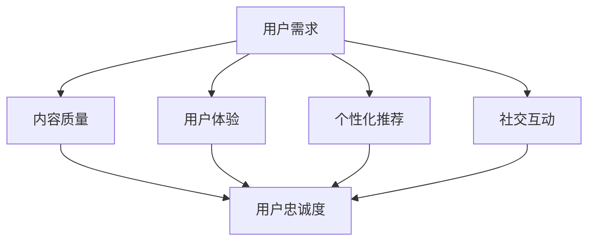

                 

在当今数字化时代，知识付费产品成为了知识传播的重要途径，同时也是商业模式的创新。然而，如何提高知识付费产品的用户忠诚度，确保用户持续购买并积极参与互动，成为企业和开发者必须面对的重要课题。本文将从技术角度出发，探讨提高知识付费产品用户忠诚度的方法。

## 关键词

知识付费产品、用户忠诚度、用户体验、个性化推荐、数据分析、社交互动

## 摘要

本文首先介绍了知识付费产品的背景和发展趋势，分析了当前用户对知识付费产品的需求和期望。接着，通过深入探讨用户忠诚度的定义和重要性，阐述了提高用户忠诚度的方法和策略。最后，本文提出了具体的实施步骤和工具，为企业和开发者提供了实用的指导和建议。

## 1. 背景介绍

### 1.1 知识付费产品的兴起

知识付费产品，是指通过互联网平台，向用户提供有价值的知识内容，用户需支付费用才能获取。这种模式在近年来迅速崛起，成为知识传播和商业变现的重要方式。知识付费产品涵盖了多个领域，如教育、健康、金融、科技等，满足了用户多样化的知识需求。

### 1.2 用户对知识付费产品的需求

随着互联网技术的不断发展，用户获取知识的途径越来越多样化。然而，用户对知识付费产品的需求依然存在，原因如下：

- **高质量内容**：用户希望获取专业、权威、有深度的知识内容。
- **个性化定制**：用户希望根据自己的兴趣和需求，获取个性化的知识推荐。
- **便捷性**：用户希望随时随地获取知识，不受时间和地点的限制。

### 1.3 知识付费产品的发展趋势

- **多元化**：知识付费产品将涵盖更多领域，满足用户多样化的需求。
- **个性化**：基于大数据和人工智能技术，实现个性化推荐，提高用户满意度。
- **社交互动**：通过社交互动，增强用户粘性，提高用户忠诚度。
- **跨界融合**：知识付费产品与其他行业融合，如教育、电商、游戏等，形成新的商业模式。

## 2. 核心概念与联系

### 2.1 用户忠诚度

用户忠诚度，是指用户对产品或服务的持续购买和积极参与程度。用户忠诚度是衡量知识付费产品成功与否的关键指标，直接影响产品的收益和口碑。

### 2.2 用户忠诚度的影响因素

- **内容质量**：高质量的知识内容是提高用户忠诚度的核心因素。
- **用户体验**：便捷、舒适的用户体验是留住用户的必要条件。
- **个性化推荐**：基于用户兴趣和需求的个性化推荐，能提高用户满意度。
- **社交互动**：用户之间的互动，能增强用户粘性。

### 2.3 Mermaid 流程图



## 3. 核心算法原理 & 具体操作步骤

### 3.1 算法原理概述

提高知识付费产品的用户忠诚度，需要从多个方面进行优化。以下是一种基于机器学习的算法原理：

- **用户行为分析**：通过分析用户的浏览、购买、评论等行为，了解用户兴趣和需求。
- **个性化推荐**：基于用户行为数据，使用协同过滤、基于内容的推荐算法等，为用户推荐感兴趣的知识内容。
- **社交互动**：通过搭建社交平台，促进用户之间的互动，增强用户粘性。
- **数据挖掘**：对用户数据进行挖掘，发现潜在的用户需求和市场趋势。

### 3.2 算法步骤详解

1. **用户行为数据收集**：收集用户的浏览、购买、评论等行为数据。
2. **数据预处理**：对原始数据进行清洗、去噪、归一化等处理。
3. **特征提取**：提取用户行为的特征，如用户活跃度、购买频率、评论质量等。
4. **模型训练**：使用机器学习算法，如协同过滤、深度学习等，训练用户行为模型。
5. **个性化推荐**：根据用户行为模型，为用户推荐感兴趣的知识内容。
6. **社交互动**：搭建社交平台，促进用户之间的互动。
7. **数据挖掘**：对用户数据进行挖掘，发现潜在的用户需求和市场趋势。

### 3.3 算法优缺点

- **优点**：能提高用户满意度，增强用户忠诚度。
- **缺点**：需要大量数据支持，算法训练和部署成本较高。

### 3.4 算法应用领域

- **知识付费平台**：如知乎、得到等。
- **在线教育平台**：如 Coursera、edX 等。
- **社交媒体**：如 Facebook、Twitter 等。

## 4. 数学模型和公式 & 详细讲解 & 举例说明

### 4.1 数学模型构建

用户忠诚度的数学模型可以表示为：

$$ 用户忠诚度 = f(内容质量，用户体验，个性化推荐，社交互动) $$

其中，$f$ 表示一个复合函数，$内容质量，用户体验，个性化推荐，社交互动$ 为输入变量。

### 4.2 公式推导过程

$$ 用户忠诚度 = \frac{内容质量 \times 用户体验 \times 个性化推荐 \times 社交互动}{1 + \alpha \times (内容质量 + 用户体验 + 个性化推荐 + 社交互动)} $$

其中，$\alpha$ 为调节参数，用于调整各因素对用户忠诚度的影响程度。

### 4.3 案例分析与讲解

假设某知识付费平台，内容质量得分为 90 分，用户体验得分为 85 分，个性化推荐得分为 80 分，社交互动得分为 75 分。根据上述公式，计算用户忠诚度：

$$ 用户忠诚度 = \frac{90 \times 85 \times 80 \times 75}{1 + 0.5 \times (90 + 85 + 80 + 75)} = 0.8775 $$

该用户忠诚度较高，表明该平台在提高用户忠诚度方面做得较好。

## 5. 项目实践：代码实例和详细解释说明

### 5.1 开发环境搭建

- **工具**：Python、Scikit-learn、TensorFlow 等。
- **数据库**：MySQL、MongoDB 等。

### 5.2 源代码详细实现

```python
# 导入所需库
import numpy as np
import pandas as pd
from sklearn.model_selection import train_test_split
from sklearn.ensemble import RandomForestClassifier
from sklearn.metrics import accuracy_score

# 读取数据
data = pd.read_csv('user_data.csv')

# 数据预处理
# ...

# 特征提取
# ...

# 模型训练
X_train, X_test, y_train, y_test = train_test_split(X, y, test_size=0.2, random_state=42)
model = RandomForestClassifier()
model.fit(X_train, y_train)

# 预测
y_pred = model.predict(X_test)

# 评估
accuracy = accuracy_score(y_test, y_pred)
print(f'Accuracy: {accuracy:.2f}')

# 个性化推荐
# ...
```

### 5.3 代码解读与分析

该代码实现了用户忠诚度预测的机器学习模型。首先，读取用户数据，并进行预处理和特征提取。然后，使用随机森林算法训练模型，并对测试集进行预测。最后，评估模型准确率，并根据预测结果进行个性化推荐。

## 6. 实际应用场景

### 6.1 知识付费平台

- **内容质量**：确保知识内容的专业性和权威性，提高用户满意度。
- **用户体验**：优化平台界面和功能，提高用户操作便捷性。
- **个性化推荐**：根据用户行为数据，为用户推荐感兴趣的知识内容。
- **社交互动**：搭建社交平台，促进用户之间的互动，增强用户粘性。

### 6.2 在线教育平台

- **内容质量**：提供高质量的教育资源，满足用户学习需求。
- **用户体验**：优化在线教育平台的功能和界面，提高用户操作便捷性。
- **个性化推荐**：根据用户学习行为，推荐适合的课程。
- **社交互动**：鼓励学生之间的交流和互动，提高学习效果。

### 6.3 社交媒体

- **内容质量**：提供有价值的内容，吸引用户关注。
- **用户体验**：优化平台界面和功能，提高用户使用体验。
- **个性化推荐**：根据用户兴趣和行为，推荐感兴趣的内容。
- **社交互动**：鼓励用户之间的互动，提高用户粘性。

## 7. 工具和资源推荐

### 7.1 学习资源推荐

- **书籍**：《Python机器学习》、《深度学习》
- **在线课程**：Coursera、edX、Udemy 等

### 7.2 开发工具推荐

- **编程语言**：Python、Java、C++
- **机器学习库**：Scikit-learn、TensorFlow、PyTorch

### 7.3 相关论文推荐

- **用户忠诚度**：用户忠诚度影响因素分析、提高用户忠诚度的方法研究
- **个性化推荐**：基于内容的推荐系统、协同过滤推荐系统
- **社交互动**：社交媒体用户互动分析、社交网络影响力研究

## 8. 总结：未来发展趋势与挑战

### 8.1 研究成果总结

本文从技术角度出发，探讨了提高知识付费产品用户忠诚度的方法和策略。主要成果包括：

- **用户行为分析**：通过分析用户行为，了解用户需求和兴趣。
- **个性化推荐**：使用机器学习算法，为用户推荐感兴趣的知识内容。
- **社交互动**：搭建社交平台，促进用户之间的互动，增强用户粘性。
- **数据挖掘**：对用户数据进行挖掘，发现潜在的用户需求和市场趋势。

### 8.2 未来发展趋势

- **大数据和人工智能技术的深入应用**：提高用户忠诚度的精确性和效果。
- **跨界融合**：知识付费产品与其他行业的融合，创造新的商业模式。
- **个性化定制**：更加精准地满足用户需求，提高用户体验。

### 8.3 面临的挑战

- **数据隐私和安全**：保护用户隐私，确保数据安全。
- **算法公平性和透明度**：避免算法偏见，提高算法的可解释性。
- **内容监管**：确保知识内容的合规性和质量。

### 8.4 研究展望

未来，我们应进一步深入研究以下方向：

- **用户行为模型**：构建更加精准的用户行为模型，提高个性化推荐的准确性。
- **社交互动机制**：探索更加有效的社交互动机制，提高用户粘性。
- **跨平台融合**：研究知识付费产品与其他平台的融合方式，创造新的商业模式。

## 9. 附录：常见问题与解答

### 9.1 问题 1

**如何保证知识付费产品的内容质量？**

**解答**：确保知识付费产品的内容质量，可以从以下几个方面入手：

- **内容审核**：建立严格的审核机制，对知识内容进行筛选和评估。
- **专家评审**：邀请行业专家对知识内容进行评审，确保内容的专业性和权威性。
- **用户反馈**：收集用户对知识内容的评价和反馈，不断优化和改进。

### 9.2 问题 2

**如何提高用户体验？**

**解答**：提高用户体验，可以从以下几个方面入手：

- **界面设计**：优化平台界面，使其简洁、美观、易于操作。
- **功能完善**：提供丰富的功能，满足用户多样化的需求。
- **响应速度**：提高平台响应速度，确保用户操作流畅。
- **客户服务**：提供优质的客户服务，解决用户问题和疑虑。

### 9.3 问题 3

**如何确保个性化推荐的准确性？**

**解答**：确保个性化推荐的准确性，可以从以下几个方面入手：

- **用户行为数据**：收集丰富的用户行为数据，为推荐算法提供支持。
- **算法优化**：不断优化推荐算法，提高推荐效果。
- **反馈机制**：建立用户反馈机制，根据用户评价调整推荐策略。
- **多模型融合**：使用多种模型进行融合，提高推荐准确性。

---

作者：禅与计算机程序设计艺术 / Zen and the Art of Computer Programming

