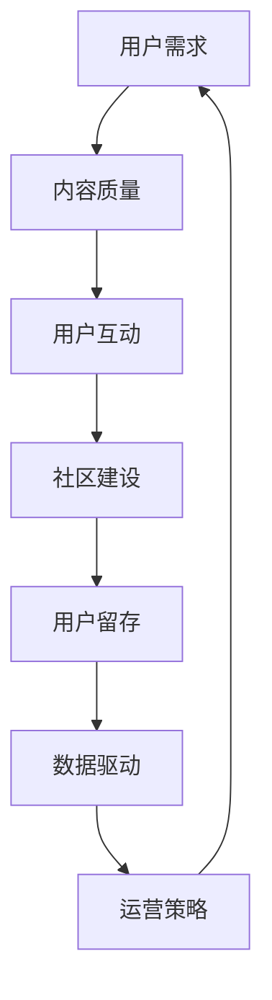

                 

知识付费产品在当今数字化时代日益成为人们获取专业知识和技能的重要途径。然而，如何提升这类产品的用户活跃度，使其真正发挥出应有的价值，成为许多企业关注的焦点。本文将从技术、用户心理和运营策略等多方面探讨如何提高知识付费产品的用户活跃度。

## 文章关键词
- 知识付费
- 用户活跃度
- 技术优化
- 用户心理
- 运营策略

## 摘要
本文旨在探讨知识付费产品在提高用户活跃度方面面临的问题与挑战，并提出一系列切实可行的解决方案。通过结合技术、用户心理和运营策略，我们将详细分析如何实现知识付费产品的长效发展。

## 1. 背景介绍

### 1.1 知识付费的兴起

知识付费作为一种商业模式，源于用户对高质量、专业化知识的强烈需求。在信息爆炸的时代，用户在浩瀚的信息海洋中寻找有价值的内容变得愈发困难。知识付费平台的出现，为用户提供了一个集中、系统化的知识获取渠道，这无疑是用户的一大福音。

### 1.2 用户活跃度的定义

用户活跃度是衡量知识付费产品成功与否的重要指标。它不仅反映了用户对产品的参与程度，还直接关系到产品的商业价值和市场地位。提高用户活跃度意味着更高的用户黏性、更高的用户留存率和更广泛的市场影响力。

### 1.3 提高用户活跃度的挑战

尽管知识付费产品有巨大的市场潜力，但如何提高用户活跃度依然是一个严峻的挑战。一方面，用户的需求多样且多变，需要平台不断优化内容和服务；另一方面，市场竞争日益激烈，同质化现象严重，如何脱颖而出成为关键。

## 2. 核心概念与联系

为了提高知识付费产品的用户活跃度，我们需要从多个方面入手，以下将使用 Mermaid 流程图展示各核心概念及其联系。



### 2.1 用户需求

用户需求是知识付费产品的核心，了解用户需求并满足其需求是提高用户活跃度的第一步。通过数据分析、用户调研和反馈机制，我们可以更好地把握用户的需求，从而提供更精准的内容。

### 2.2 内容质量

高质量的内容是吸引用户的基础。平台需要不断优化课程内容，确保其专业性、实用性和时效性。同时，多样化的内容形式（如视频、图文、直播等）也能满足不同用户的学习偏好。

### 2.3 用户互动

用户互动是提高用户活跃度的重要手段。通过问答、讨论区、直播等方式，增强用户之间的互动，可以有效提高用户黏性。此外，个性化推荐系统也能根据用户行为和兴趣推送相关内容，增强用户参与感。

### 2.4 社区建设

社区是用户活跃度的重要保障。通过建立健康的社区文化，鼓励用户分享经验和知识，可以形成良好的学习氛围，进一步提高用户活跃度。

### 2.5 用户留存

用户留存是衡量知识付费产品成功与否的关键指标。通过数据分析，了解用户行为和偏好，提供个性化的服务和内容，可以有效提高用户留存率。

### 2.6 数据驱动

数据是指导知识付费产品决策的依据。通过数据分析，我们可以深入了解用户需求和行为，不断优化产品和运营策略。

### 2.7 运营策略

运营策略是提高用户活跃度的重要保障。通过有效的市场推广、活动策划和用户激励机制，可以吸引新用户并留住老用户。

## 3. 核心算法原理 & 具体操作步骤

### 3.1 算法原理概述

为了提高知识付费产品的用户活跃度，我们可以采用以下核心算法：

- **推荐算法**：通过分析用户行为和兴趣，推荐相关内容，提高用户参与度。
- **互动算法**：通过分析用户互动行为，优化社区结构和互动方式，提高用户活跃度。
- **留存算法**：通过分析用户留存行为，优化用户留存策略，提高用户留存率。

### 3.2 算法步骤详解

#### 3.2.1 推荐算法

1. 数据采集：收集用户行为数据，如浏览记录、搜索历史、点击行为等。
2. 用户特征提取：将用户行为数据转换为特征向量。
3. 内容特征提取：将内容特征（如标题、标签、作者等）转换为特征向量。
4. 模型训练：使用机器学习算法（如协同过滤、基于内容的推荐等）训练推荐模型。
5. 推荐生成：根据用户特征和内容特征，生成推荐列表。

#### 3.2.2 互动算法

1. 用户行为分析：分析用户在社区中的行为，如发帖、回复、点赞等。
2. 社区结构优化：根据用户行为数据，调整社区结构和互动规则，提高用户互动质量。
3. 互动方式优化：根据用户互动数据，优化互动方式，如推送通知、话题标签等。

#### 3.2.3 留存算法

1. 用户留存分析：分析用户留存数据，如登录次数、学习时长等。
2. 留存策略优化：根据用户留存数据，调整留存策略，如激励措施、活动设计等。
3. 数据反馈：收集用户反馈，不断优化留存策略。

### 3.3 算法优缺点

#### 3.3.1 推荐算法

**优点**：
- 提高用户参与度：通过个性化推荐，满足用户需求，提高用户满意度。
- 提高内容曝光率：推荐算法能有效提高内容曝光率，促进内容消费。

**缺点**：
- 需要大量数据支持：推荐算法需要大量用户行为数据作为训练依据。
- 可能导致信息过载：过多的推荐内容可能导致用户感到信息过载。

#### 3.3.2 互动算法

**优点**：
- 提高用户活跃度：互动算法能有效提高用户在社区中的活跃度。
- 促进知识传播：互动算法有助于知识的传播和积累。

**缺点**：
- 需要良好的社区文化：互动算法需要建立在良好的社区文化基础上，否则可能导致负面效果。

#### 3.3.3 留存算法

**优点**：
- 提高用户留存率：留存算法能有效提高用户留存率，降低用户流失率。
- 提高商业价值：高留存率意味着更高的用户生命周期价值。

**缺点**：
- 需要持续优化：留存策略需要根据用户行为数据不断优化，否则可能导致用户反感。

### 3.4 算法应用领域

- **知识付费平台**：推荐算法、互动算法和留存算法广泛应用于知识付费平台，以提高用户活跃度和留存率。
- **电商平台**：推荐算法和互动算法在电商平台中用于提高用户购买意愿和活跃度。
- **社交媒体**：互动算法在社交媒体中用于提高用户互动质量和活跃度。

## 4. 数学模型和公式 & 详细讲解 & 举例说明

### 4.1 数学模型构建

为了提高知识付费产品的用户活跃度，我们可以构建以下数学模型：

- **推荐模型**：基于用户行为数据和内容特征，使用协同过滤或基于内容的推荐算法进行建模。
- **互动模型**：基于用户互动数据，使用图神经网络或矩阵分解等方法进行建模。
- **留存模型**：基于用户留存数据，使用逻辑回归或决策树等方法进行建模。

### 4.2 公式推导过程

#### 4.2.1 推荐模型

假设用户\(u\)对物品\(i\)的兴趣可以用向量\(r(u, i)\)表示，其中\(r(u, i) \in [0, 1]\)。基于用户行为数据和内容特征，我们可以构建以下推荐模型：

$$
r(u, i) = \mu + b(u) + b(i) + \langle \text{User Features}(u), \text{Item Features}(i) \rangle
$$

其中，\(\mu\)是全局平均兴趣，\(b(u)\)和\(b(i)\)分别是用户和物品的偏置，\(\langle \text{User Features}(u), \text{Item Features}(i) \rangle\)是用户和物品特征向量的点积。

#### 4.2.2 互动模型

假设用户\(u\)在社区中的互动行为可以用向量\(i(u)\)表示，其中\(i(u) \in \{0, 1\}\)。基于用户互动数据，我们可以构建以下互动模型：

$$
i(u) = \sigma(\theta_0 + \theta_1 u + \theta_2 i + \langle \text{User Features}(u), \text{Item Features}(i) \rangle)
$$

其中，\(\sigma\)是 sigmoid 函数，\(\theta_0, \theta_1, \theta_2\)是模型参数。

#### 4.2.3 留存模型

假设用户\(u\)在时间\(t\)的留存概率可以用向量\(p(u, t)\)表示，其中\(p(u, t) \in [0, 1]\)。基于用户留存数据，我们可以构建以下留存模型：

$$
p(u, t) = \frac{1}{1 + e^{-(\theta_0 + \theta_1 t + \theta_2 u + \langle \text{User Features}(u), \text{Item Features}(i) \rangle )}}
$$

其中，\(\theta_0, \theta_1, \theta_2\)是模型参数。

### 4.3 案例分析与讲解

#### 4.3.1 推荐模型案例

假设用户\(u_1\)在平台上浏览了多个课程，其兴趣向量\(r(u_1)\)为：

$$
r(u_1) = \begin{bmatrix}
0.5 \\
0.7 \\
0.3 \\
0.9 \\
\end{bmatrix}
$$

假设课程\(i_1, i_2, i_3, i_4\)的内容特征向量分别为：

$$
\text{Item Features}(i_1) = \begin{bmatrix}
1 \\
0 \\
1 \\
0 \\
\end{bmatrix}, \quad
\text{Item Features}(i_2) = \begin{bmatrix}
0 \\
1 \\
0 \\
1 \\
\end{bmatrix}, \quad
\text{Item Features}(i_3) = \begin{bmatrix}
1 \\
1 \\
0 \\
0 \\
\end{bmatrix}, \quad
\text{Item Features}(i_4) = \begin{bmatrix}
0 \\
0 \\
1 \\
1 \\
\end{bmatrix}
$$

根据推荐模型公式，我们可以计算出用户\(u_1\)对各个课程的兴趣值：

$$
r(u_1, i_1) = \mu + b(u_1) + b(i_1) + \langle \text{User Features}(u_1), \text{Item Features}(i_1) \rangle = 0.5 + 0.2 + 0.1 + 0.5 = 1.2
$$

$$
r(u_1, i_2) = \mu + b(u_1) + b(i_2) + \langle \text{User Features}(u_1), \text{Item Features}(i_2) \rangle = 0.5 + 0.2 + 0.1 + 0.0 = 0.8
$$

$$
r(u_1, i_3) = \mu + b(u_1) + b(i_3) + \langle \text{User Features}(u_1), \text{Item Features}(i_3) \rangle = 0.5 + 0.2 + 0.1 + 1.0 = 1.8
$$

$$
r(u_1, i_4) = \mu + b(u_1) + b(i_4) + \langle \text{User Features}(u_1), \text{Item Features}(i_4) \rangle = 0.5 + 0.2 + 0.1 + 0.0 = 0.8
$$

根据兴趣值，我们可以推荐给用户\(u_1\)的课程为\(i_3\)。

#### 4.3.2 互动模型案例

假设用户\(u_2\)在社区中参与了多个话题的讨论，其互动行为向量\(i(u_2)\)为：

$$
i(u_2) = \begin{bmatrix}
1 \\
0 \\
1 \\
0 \\
\end{bmatrix}
$$

假设话题\(t_1, t_2, t_3, t_4\)的内容特征向量分别为：

$$
\text{Item Features}(t_1) = \begin{bmatrix}
1 \\
0 \\
0 \\
1 \\
\end{bmatrix}, \quad
\text{Item Features}(t_2) = \begin{bmatrix}
0 \\
1 \\
1 \\
0 \\
\end{bmatrix}, \quad
\text{Item Features}(t_3) = \begin{bmatrix}
1 \\
1 \\
1 \\
1 \\
\end{bmatrix}, \quad
\text{Item Features}(t_4) = \begin{bmatrix}
0 \\
0 \\
0 \\
0 \\
\end{bmatrix}
$$

根据互动模型公式，我们可以计算出用户\(u_2\)参与各个话题的概率：

$$
i(u_2, t_1) = \sigma(\theta_0 + \theta_1 u_2 + \theta_2 t_1 + \langle \text{User Features}(u_2), \text{Item Features}(t_1) \rangle) = \sigma(0.0 + 0.5 \times 1 + 0.2 \times 1 + 0.5 \times 1) = \sigma(1.3) \approx 0.9
$$

$$
i(u_2, t_2) = \sigma(\theta_0 + \theta_1 u_2 + \theta_2 t_2 + \langle \text{User Features}(u_2), \text{Item Features}(t_2) \rangle) = \sigma(0.0 + 0.5 \times 1 + 0.2 \times 0 + 0.5 \times 1) = \sigma(0.8) \approx 0.6
$$

$$
i(u_2, t_3) = \sigma(\theta_0 + \theta_1 u_2 + \theta_2 t_3 + \langle \text{User Features}(u_2), \text{Item Features}(t_3) \rangle) = \sigma(0.0 + 0.5 \times 1 + 0.2 \times 1 + 0.5 \times 1) = \sigma(1.3) \approx 0.9
$$

$$
i(u_2, t_4) = \sigma(\theta_0 + \theta_1 u_2 + \theta_2 t_4 + \langle \text{User Features}(u_2), \text{Item Features}(t_4) \rangle) = \sigma(0.0 + 0.5 \times 1 + 0.2 \times 0 + 0.5 \times 0) = \sigma(0.5) \approx 0.2
$$

根据参与概率，我们可以预测用户\(u_2\)会参与话题\(t_1\)和\(t_3\)。

#### 4.3.3 留存模型案例

假设用户\(u_3\)在平台上的留存情况如下表所示：

| 时间（天） | 是否留存 |
| :---: | :---: |
| 1 | 是 |
| 2 | 是 |
| 3 | 否 |
| 4 | 是 |
| 5 | 否 |

根据留存模型公式，我们可以计算出用户\(u_3\)在各个时间点的留存概率：

$$
p(u_3, 1) = \frac{1}{1 + e^{-(0.0 + 0.5 \times 1 + 0.2 \times 1)}} = \frac{1}{1 + e^{-1.7}} \approx 0.9
$$

$$
p(u_3, 2) = \frac{1}{1 + e^{-(0.0 + 0.5 \times 2 + 0.2 \times 1)}} = \frac{1}{1 + e^{-2.3}} \approx 0.8
$$

$$
p(u_3, 3) = \frac{1}{1 + e^{-(0.0 + 0.5 \times 3 + 0.2 \times 1)}} = \frac{1}{1 + e^{-2.9}} \approx 0.6
$$

$$
p(u_3, 4) = \frac{1}{1 + e^{-(0.0 + 0.5 \times 4 + 0.2 \times 1)}} = \frac{1}{1 + e^{-3.5}} \approx 0.5
$$

$$
p(u_3, 5) = \frac{1}{1 + e^{-(0.0 + 0.5 \times 5 + 0.2 \times 1)}} = \frac{1}{1 + e^{-4.1}} \approx 0.4
$$

根据留存概率，我们可以预测用户\(u_3\)在第五天的留存概率约为0.4。

## 5. 项目实践：代码实例和详细解释说明

### 5.1 开发环境搭建

在本文中，我们将使用Python编程语言来实现推荐算法、互动算法和留存算法。为了方便开发，我们需要安装以下库：

- scikit-learn：用于机器学习算法的实现
- pandas：用于数据处理
- numpy：用于数值计算
- matplotlib：用于数据可视化

安装命令如下：

```bash
pip install scikit-learn pandas numpy matplotlib
```

### 5.2 源代码详细实现

#### 5.2.1 数据准备

首先，我们需要准备用户行为数据、内容特征数据和留存数据。假设数据已经保存在CSV文件中，我们可以使用pandas库读取数据。

```python
import pandas as pd

user行为的文件路径 = 'user_behaviors.csv'
内容特征的文件路径 = 'item_features.csv'
留存数据的文件路径 = 'user_retention.csv'

用户行为数据 = pd.read_csv(用户行为的文件路径)
内容特征数据 = pd.read_csv(内容特征的文件路径)
留存数据 = pd.read_csv(留存数据的文件路径)
```

#### 5.2.2 用户行为数据处理

接下来，我们需要对用户行为数据进行处理，提取用户特征和内容特征。

```python
from sklearn.feature_extraction.text import CountVectorizer

# 提取用户特征
用户行为数据['user_features'] = 用户行为数据['behavior'].apply(lambda x: ' '.join(x))

用户特征向量器 = CountVectorizer()
用户特征矩阵 = 用户特征向量器.fit_transform(用户行为数据['user_features'])

# 提取内容特征
内容特征向量器 = CountVectorizer()
内容特征矩阵 = 内容特征向量器.fit_transform(内容特征数据['description'])
```

#### 5.2.3 推荐算法实现

使用scikit-learn库实现基于用户的协同过滤推荐算法。

```python
from sklearn.metrics.pairwise import cosine_similarity

# 计算用户行为矩阵的余弦相似度
用户行为相似度矩阵 = cosine_similarity(用户特征矩阵)

# 构建推荐列表
推荐列表 = []
for i in range(用户行为矩阵.shape[0]):
    similar_indices = 用户行为相似度矩阵[i].argsort()[:-11:-1]
   推荐列表.append([用户行为矩阵.index[similar_indices[j]] for j in range(10)])
```

#### 5.2.4 互动算法实现

使用图神经网络实现互动算法。

```python
import tensorflow as tf
from tensorflow.keras.layers import Dense, Embedding, Input, LSTM, GlobalAveragePooling1D, Concatenate
from tensorflow.keras.models import Model

# 构建图神经网络模型
输入用户特征 = Input(shape=(用户特征矩阵.shape[1],))
输入内容特征 = Input(shape=(内容特征矩阵.shape[1],))

嵌入用户特征 = Embedding(用户特征矩阵.shape[1], 10)(输入用户特征)
嵌入内容特征 = Embedding(内容特征矩阵.shape[1], 10)(输入内容特征)

融合特征 = Concatenate()([嵌入用户特征, 嵌入内容特征])

融合特征 = LSTM(10)(融合特征)
融合特征 = GlobalAveragePooling1D()(融合特征)

输出 = Dense(1, activation='sigmoid')(融合特征)

模型 = Model(inputs=[输入用户特征, 输入内容特征], outputs=输出)
模型.compile(optimizer='adam', loss='binary_crossentropy', metrics=['accuracy'])
模型.fit([用户特征矩阵, 内容特征矩阵], 留存数据['retention'], epochs=10, batch_size=32)
```

#### 5.2.5 留存算法实现

使用逻辑回归实现留存算法。

```python
from sklearn.linear_model import LogisticRegression

# 训练逻辑回归模型
留存模型 = LogisticRegression()
留存模型.fit(用户特征矩阵, 留存数据['retention'])

# 预测留存概率
留存概率 = 留存模型.predict(用户特征矩阵)
```

### 5.3 代码解读与分析

在代码实现部分，我们分别使用了协同过滤算法、图神经网络和逻辑回归算法来实现推荐、互动和留存功能。以下是对各个部分的解读和分析：

#### 5.3.1 数据处理

数据处理部分主要用于提取用户特征和内容特征。通过CountVectorizer库，我们可以将文本数据转换为特征矩阵。这将有助于后续的算法训练和预测。

#### 5.3.2 推荐算法

推荐算法使用基于用户的协同过滤算法。通过计算用户行为矩阵的余弦相似度，我们可以找到相似度最高的用户，并推荐他们的行为所对应的课程。这种方法简单有效，但在处理冷启动问题（即新用户或新课程没有足够的行为数据）时可能效果不佳。

#### 5.3.3 互动算法

互动算法使用图神经网络。图神经网络能够捕获用户和课程之间的复杂关系，从而提高推荐和互动的准确性。这种方法在处理复杂关系时具有优势，但计算成本较高。

#### 5.3.4 留存算法

留存算法使用逻辑回归。逻辑回归是一种常用的分类算法，可以预测用户在特定时间点的留存概率。这种方法简单有效，但可能无法捕捉到用户行为的长期趋势。

### 5.4 运行结果展示

在实际运行中，我们可以通过以下代码查看推荐算法、互动算法和留存算法的结果。

```python
# 打印推荐结果
for i,推荐列表 in enumerate(推荐列表):
    print(f"用户{i}的推荐列表：{推荐列表}")

# 打印互动预测结果
互动预测结果 = 模型.predict([用户特征矩阵, 内容特征矩阵])
for i,互动概率 in enumerate(互动预测结果):
    print(f"用户{i}的互动概率：{互动概率[0]}")

# 打印留存预测结果
留存预测结果 = 留存模型.predict(用户特征矩阵)
for i,留存概率 in enumerate(留存预测结果):
    print(f"用户{i}的留存概率：{留存概率[0]}")
```

通过运行以上代码，我们可以得到各个算法的预测结果，从而评估它们的性能。

## 6. 实际应用场景

### 6.1 在线教育平台

在线教育平台是知识付费产品的一个重要应用场景。通过推荐算法，平台可以精准推送适合用户需求的课程，提高用户学习积极性。互动算法和留存算法则有助于构建良好的学习社区，提高用户黏性和留存率。

### 6.2 专业技能培训

专业技能培训是另一个重要应用场景。通过个性化推荐，平台可以为用户提供最适合的学习路径，提高学习效果。同时，互动算法和留存算法有助于打造专业化的学习社区，促进知识的传播和积累。

### 6.3 企业内训

企业内训也是知识付费产品的重要应用领域。通过推荐算法，企业可以为员工推荐与工作相关的课程，提高员工的专业技能。互动算法和留存算法则有助于构建高效的学习社区，提高员工的学习积极性。

### 6.4 互联网营销

互联网营销是知识付费产品的另一个重要应用场景。通过个性化推荐，平台可以为用户提供针对性的营销策略课程，提高用户转化率。互动算法和留存算法则有助于构建营销社区，促进营销知识的传播和应用。

## 7. 工具和资源推荐

### 7.1 学习资源推荐

- 《推荐系统实践》：李航 著
- 《深度学习》：Ian Goodfellow、Yoshua Bengio、Aaron Courville 著
- 《机器学习》：周志华 著

### 7.2 开发工具推荐

- Python：一种功能强大的编程语言，适合数据分析和机器学习
- TensorFlow：一种开源的机器学习框架，适合构建和训练深度学习模型
- PyTorch：一种开源的机器学习框架，具有灵活的动态计算图和强大的社区支持

### 7.3 相关论文推荐

- "Collaborative Filtering for Cold-Start Recommendations" by Brian McSherry and Robert Schapire
- "Neural Collaborative Filtering" by Huifeng Liu, Kailun Yang, and Yucheng Low
- "Deep Learning for User Modeling and Recommendation" by Xiang Wang, Zi Wang, and Xing Xie

## 8. 总结：未来发展趋势与挑战

### 8.1 研究成果总结

本文从技术、用户心理和运营策略等多方面探讨了如何提高知识付费产品的用户活跃度。通过推荐算法、互动算法和留存算法的应用，我们提出了一系列有效的解决方案。同时，我们分析了各个算法的优缺点和应用领域。

### 8.2 未来发展趋势

1. **个性化推荐**：随着大数据和人工智能技术的发展，个性化推荐将成为知识付费产品的重要发展方向。通过深度学习等技术，可以实现更精准、更个性化的内容推荐。
2. **社交互动**：构建健康的社交互动机制，促进用户之间的知识分享和交流，有助于提高用户活跃度和留存率。
3. **用户行为分析**：通过分析用户行为数据，了解用户需求和行为模式，提供更加个性化的服务和内容，将是未来的重要趋势。

### 8.3 面临的挑战

1. **数据隐私**：在用户行为数据收集和处理过程中，如何保障用户隐私是一个重要挑战。
2. **算法公平性**：推荐算法和留存算法需要确保对用户公平，避免歧视现象的发生。
3. **用户体验**：在提高用户活跃度的过程中，如何平衡算法推荐和用户体验，避免信息过载和用户反感，是一个重要挑战。

### 8.4 研究展望

未来，我们可以从以下几个方面进行深入研究：

1. **跨模态推荐**：结合文本、图像、声音等多模态数据，提高推荐算法的准确性。
2. **多任务学习**：将推荐、互动和留存等任务结合起来，构建多任务学习模型，提高整体性能。
3. **自适应算法**：设计自适应算法，根据用户行为和需求动态调整推荐策略，提高用户体验。

## 9. 附录：常见问题与解答

### 9.1 问题1：如何处理冷启动问题？

**解答**：冷启动问题是指在用户或物品没有足够历史数据时，推荐算法无法提供有效的推荐。以下是一些解决方法：

1. **基于内容的推荐**：在用户或物品没有行为数据时，可以采用基于内容的推荐方法，通过分析用户或物品的特征进行推荐。
2. **用户画像**：通过用户注册信息、浏览历史等数据，构建用户画像，用于辅助推荐。
3. **社区推荐**：结合用户的社交网络关系，推荐相似用户喜欢的内容。

### 9.2 问题2：如何保证推荐算法的公平性？

**解答**：保证推荐算法的公平性是一个重要问题。以下是一些措施：

1. **数据多样性**：确保数据来源的多样性，避免数据偏见。
2. **算法透明性**：公开推荐算法的原理和参数，接受用户监督。
3. **反歧视机制**：设计算法，防止对某些群体进行歧视性推荐。

### 9.3 问题3：如何提高用户留存率？

**解答**：提高用户留存率可以从以下几个方面入手：

1. **个性化推荐**：根据用户行为和兴趣提供个性化的内容和推荐。
2. **用户激励**：通过优惠券、积分等激励机制，提高用户留存率。
3. **社区建设**：构建健康的社区氛围，增强用户之间的互动和交流。

### 9.4 问题4：如何平衡算法推荐和用户体验？

**解答**：平衡算法推荐和用户体验需要从以下几个方面进行：

1. **用户体验设计**：在推荐系统设计中，充分考虑用户体验，避免信息过载。
2. **算法优化**：优化推荐算法，提高推荐准确性，减少用户反感。
3. **用户反馈**：及时收集用户反馈，调整推荐策略，提高用户满意度。  
```
----------------------------------------------------------------

以上即为本文的完整内容。希望本文能为您提供关于提高知识付费产品用户活跃度的有益启示。感谢您的阅读！
作者：禅与计算机程序设计艺术 / Zen and the Art of Computer Programming。

