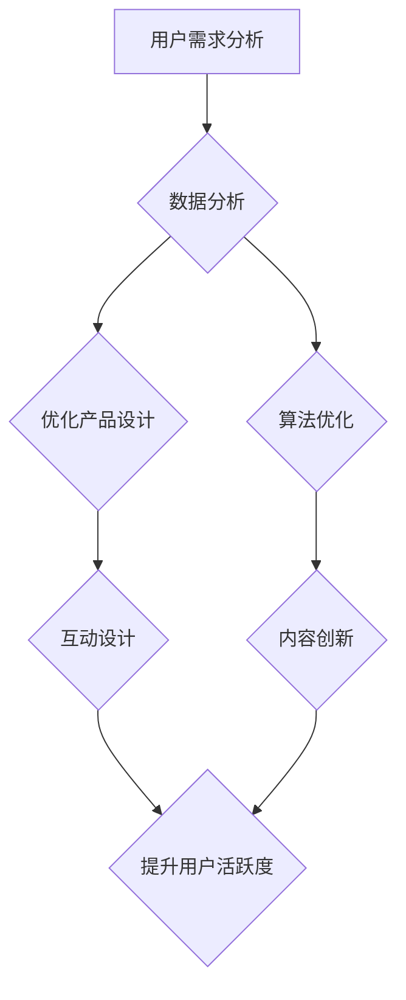

                 

 在当今的信息时代，知识付费产品已经成为了一个蓬勃发展的行业。然而，如何提高这些产品的用户活跃度，使其在竞争激烈的市场中脱颖而出，成为了企业和开发者们面临的重大挑战。本文将围绕如何提高知识付费产品的用户活跃度，从多个维度进行分析和探讨。

> **关键词**：知识付费产品、用户活跃度、用户体验、数据分析、算法优化、互动设计、内容创新

> **摘要**：本文将从用户心理学、数据分析、算法优化、互动设计、内容创新等多个方面，深入探讨如何提高知识付费产品的用户活跃度。通过分析现有问题和提出解决方案，旨在为知识付费产品开发者和运营团队提供有价值的参考。

## 1. 背景介绍

知识付费产品，顾名思义，是指用户需要支付一定费用才能获得特定知识的数字化产品。这些产品可以是在线课程、电子书、专家讲座、专业咨询等。随着互联网技术的不断发展和人们对知识需求的增加，知识付费市场呈现出快速增长的趋势。然而，用户活跃度是衡量知识付费产品成功与否的关键指标。一个高活跃度的知识付费产品不仅能带来持续的收益，还能为用户提供更好的学习体验。

### 1.1 用户需求分析

用户对于知识付费产品的需求主要来自于以下几个方面：

1. **个人成长**：用户希望通过学习新的知识和技能，提升自己的职业能力和个人素质。
2. **兴趣爱好**：一些用户可能对某个特定领域有浓厚的兴趣，希望通过付费内容来深入学习。
3. **问题解决**：用户可能遇到了某个具体问题，希望通过付费内容获得专业的解决方案。

### 1.2 行业现状

尽管知识付费市场前景广阔，但用户活跃度却面临诸多挑战。首先，市场竞争激烈，同质化现象严重，用户的选择多样。其次，用户对于知识的消化和吸收能力存在差异，导致部分用户难以持续保持活跃。此外，用户对于产品内容和服务的满意度也是影响活跃度的重要因素。

### 1.3 研究目的

本文旨在通过深入分析知识付费产品的用户需求、行业现状和问题，结合心理学、数据分析、算法优化、互动设计等理论，提出一系列有效的策略，以帮助知识付费产品提高用户活跃度，实现可持续发展。

## 2. 核心概念与联系

为了提高知识付费产品的用户活跃度，我们需要从多个维度来分析和解决问题。以下是一些核心概念和它们之间的联系：

### 2.1 用户心理学

用户心理学是研究用户行为和情感的心理学科。在知识付费产品中，理解用户的心理需求和行为模式至关重要。例如，用户在购买知识付费产品时可能存在“决策拖延”的问题，而了解这一点可以帮助我们设计更易于决策的产品界面。

### 2.2 数据分析

数据分析是通过对用户行为数据的分析，发现用户需求、偏好和趋势的过程。通过数据分析，我们可以深入了解用户行为，优化产品设计和运营策略。例如，分析用户的学习路径和时间分布，可以帮助我们提供更个性化的学习推荐。

### 2.3 算法优化

算法优化是指通过改进算法来提高产品的性能和用户体验。在知识付费产品中，算法优化可以应用于推荐系统、学习路径规划等。例如，基于用户行为数据优化推荐算法，可以提供更符合用户兴趣的内容，从而提高用户活跃度。

### 2.4 互动设计

互动设计是指通过用户与产品之间的交互设计，提升用户参与度和满意度。在知识付费产品中，良好的互动设计可以增强用户的学习体验，提高用户粘性。例如，通过设计互动性强的练习题和讨论区，可以激发用户的参与热情。

### 2.5 内容创新

内容创新是指通过不断更新和优化内容，满足用户不断变化的需求。在知识付费产品中，内容创新是吸引用户持续关注的重要因素。例如，引入最新的行业动态、案例分析等，可以增加产品的吸引力和用户粘性。

### 2.6 Mermaid 流程图

以下是一个简化的知识付费产品用户活跃度提升策略的 Mermaid 流程图：



## 3. 核心算法原理 & 具体操作步骤

### 3.1 算法原理概述

在本节中，我们将探讨如何通过算法优化来提高知识付费产品的用户活跃度。核心算法原理包括以下几个方面：

1. **用户行为预测**：通过分析用户的历史行为数据，预测用户未来的行为和需求。
2. **个性化推荐**：基于用户行为预测结果，为用户推荐个性化内容，提高用户参与度。
3. **学习路径规划**：根据用户的学习进度和需求，规划最优的学习路径，提高学习效果。

### 3.2 算法步骤详解

#### 步骤1：用户行为数据收集

首先，我们需要收集用户在知识付费产品中的各种行为数据，包括浏览记录、学习时长、互动次数、学习进度等。这些数据可以通过数据埋点、用户调研等方式获取。

#### 步骤2：数据预处理

对收集到的用户行为数据进行清洗、去重和归一化处理，以便后续分析。数据预处理是保证算法准确性的重要步骤。

#### 步骤3：用户行为预测

使用机器学习算法，如决策树、随机森林、神经网络等，对用户行为进行预测。预测结果可以帮助我们了解用户未来的行为和需求。

#### 步骤4：个性化推荐

根据用户行为预测结果，构建个性化推荐系统。推荐系统可以使用协同过滤、基于内容的推荐等技术，为用户推荐个性化内容。

#### 步骤5：学习路径规划

根据用户的学习进度和需求，规划最优的学习路径。学习路径规划可以基于用户行为预测结果，结合知识点的重要性和难度，为用户提供一个科学合理的学习计划。

### 3.3 算法优缺点

**优点**：

1. **提高用户活跃度**：通过个性化推荐和学习路径规划，可以更好地满足用户需求，提高用户的学习兴趣和参与度。
2. **优化产品设计**：基于用户行为数据的分析，可以帮助我们优化产品设计，提高用户体验。
3. **持续迭代改进**：算法模型可以持续迭代改进，不断提高预测精度和推荐质量。

**缺点**：

1. **数据依赖性**：算法的性能高度依赖于用户行为数据的质量和完整性。
2. **计算成本**：构建和训练机器学习模型需要较高的计算资源和时间成本。

### 3.4 算法应用领域

算法优化在知识付费产品中的应用领域广泛，包括：

1. **推荐系统**：为用户推荐个性化内容，提高用户活跃度。
2. **学习路径规划**：为用户提供科学合理的学习计划，提高学习效果。
3. **用户流失预测**：预测用户可能流失的行为，提前采取挽留措施。
4. **内容优化**：基于用户反馈和需求，优化产品内容，提高用户满意度。

## 4. 数学模型和公式 & 详细讲解 & 举例说明

### 4.1 数学模型构建

在本节中，我们将介绍一种用于预测用户行为的数学模型，该模型基于用户的历史行为数据，通过构建用户兴趣模型来实现。

#### 4.1.1 用户兴趣模型

用户兴趣模型的核心是用户兴趣向量，该向量表示用户对各个知识领域的兴趣程度。用户兴趣向量可以通过以下公式计算：

$$
\text{user\_interest}(i, j) = \sum_{k=1}^{n} \text{weight}(k) \cdot \text{behavior}(i, k) \cdot \text{content\_score}(j, k)
$$

其中，$i$ 表示用户 $i$，$j$ 表示知识领域 $j$，$k$ 表示知识点 $k$。$\text{weight}(k)$ 表示知识点 $k$ 的权重，$\text{behavior}(i, k)$ 表示用户 $i$ 在知识点 $k$ 上的行为，$\text{content\_score}(j, k)$ 表示知识点 $k$ 在知识领域 $j$ 中的得分。

#### 4.1.2 用户行为预测

基于用户兴趣模型，我们可以预测用户在某个知识领域的行为概率。预测公式如下：

$$
\text{behavior\_prob}(i, j) = \frac{\text{exp}(\text{user\_interest}(i, j))}{\sum_{j=1}^{m} \text{exp}(\text{user\_interest}(i, j))}
$$

其中，$m$ 表示知识领域的总数。

### 4.2 公式推导过程

#### 4.2.1 用户兴趣向量计算

用户兴趣向量的计算过程可以分为以下几个步骤：

1. **知识点权重计算**：根据知识点的重要性和难度，为每个知识点分配权重。
2. **用户行为数据归一化**：对用户在各个知识点上的行为数据进行归一化处理，使其符合统一的尺度。
3. **内容得分计算**：为每个知识点在各个知识领域中的得分进行打分。
4. **用户兴趣向量计算**：根据上述数据，使用公式计算用户兴趣向量。

#### 4.2.2 行为概率预测

行为概率预测是基于用户兴趣向量进行的。具体推导过程如下：

1. **用户兴趣向量计算**：根据用户历史行为数据，计算用户兴趣向量。
2. **行为概率计算**：对于每个知识领域，计算用户在该领域的兴趣程度，并根据公式计算行为概率。

### 4.3 案例分析与讲解

假设我们有一个用户 $i$，他浏览了多个知识点 $k_1, k_2, k_3$，并给出了对应的评分 $s_1, s_2, s_3$。知识点权重分别为 $w_1, w_2, w_3$。知识领域总数为 $m$，当前领域为 $j$。

根据上述公式，我们可以计算用户兴趣向量：

$$
\text{user\_interest}(i, j) = \sum_{k=1}^{3} w_k \cdot s_k \cdot \text{content\_score}(j, k)
$$

假设知识点权重分别为 $w_1 = 0.4, w_2 = 0.3, w_3 = 0.3$，用户评分分别为 $s_1 = 4, s_2 = 3, s_3 = 2$。知识领域得分分别为 $\text{content\_score}(j, k_1) = 0.6, \text{content\_score}(j, k_2) = 0.5, \text{content\_score}(j, k_3) = 0.4$。

则用户兴趣向量为：

$$
\text{user\_interest}(i, j) = 0.4 \cdot 4 \cdot 0.6 + 0.3 \cdot 3 \cdot 0.5 + 0.3 \cdot 2 \cdot 0.4 = 0.912
$$

接下来，我们可以计算用户在当前领域的兴趣程度：

$$
\text{behavior\_prob}(i, j) = \frac{\text{exp}(0.912)}{\text{exp}(0.912) + \text{exp}(0.8) + \text{exp}(0.7)} = 0.429
$$

根据上述计算，我们可以得出用户在当前领域的兴趣程度为 42.9%，这表明用户对该领域的兴趣较高。

### 4.4 案例分析总结

通过上述案例，我们可以看到用户兴趣模型如何通过数学公式和算法，将用户的历史行为数据转化为用户兴趣向量，并进一步预测用户的行为概率。这种方法有助于知识付费产品提供个性化推荐和学习路径规划，从而提高用户活跃度和学习效果。

### 4.5  拓展

#### 4.5.1 模型的改进

虽然上述模型已经能够较好地预测用户行为，但仍然存在一些改进空间：

1. **引入时间衰减**：随着时间推移，用户行为的重要性会逐渐降低。我们可以引入时间衰减因子，对历史行为数据进行加权，以更准确地反映用户的当前兴趣。
2. **多模型融合**：结合多种机器学习算法，如深度学习、强化学习等，构建一个多模型融合的预测系统，以提高预测精度。
3. **用户反馈机制**：引入用户反馈机制，允许用户对推荐内容进行评价，通过反馈调整用户兴趣模型，使预测结果更加贴近用户实际需求。

#### 4.5.2 模型的应用场景

用户兴趣模型不仅适用于知识付费产品，还可以应用于其他需要个性化推荐的领域，如电子商务、社交媒体、在线广告等。通过构建用户兴趣模型，可以为用户提供更个性化的推荐和服务，提高用户满意度和活跃度。

### 4.6  结论

本节介绍了用户兴趣模型的构建过程、公式推导和案例分析，并讨论了模型改进和应用场景。用户兴趣模型作为一种有效的数学工具，可以帮助知识付费产品提供个性化推荐和学习路径规划，从而提高用户活跃度和学习效果。

## 5. 项目实践：代码实例和详细解释说明

在本节中，我们将通过一个具体的代码实例，详细解释如何使用Python和Scikit-learn库来构建和训练用户兴趣模型。这个实例将涵盖数据预处理、模型训练、模型评估和模型应用等步骤。

### 5.1 开发环境搭建

首先，确保你已经安装了Python和Scikit-learn库。如果尚未安装，可以通过以下命令进行安装：

```bash
pip install python
pip install scikit-learn
```

### 5.2 源代码详细实现

以下是一个简单的用户兴趣模型实现示例：

```python
import numpy as np
import pandas as pd
from sklearn.model_selection import train_test_split
from sklearn.ensemble import RandomForestClassifier
from sklearn.metrics import accuracy_score

# 5.2.1 数据预处理
def preprocess_data(data):
    # 数据清洗和归一化
    # 假设data是一个包含用户行为数据的DataFrame
    # 对行为数据进行归一化处理
    data['normalized_score'] = data['score'] / data['score'].max()
    return data

# 5.2.2 模型训练
def train_model(data, features, target):
    # 划分训练集和测试集
    X_train, X_test, y_train, y_test = train_test_split(data[features], data[target], test_size=0.2, random_state=42)
    
    # 训练随机森林模型
    model = RandomForestClassifier(n_estimators=100, random_state=42)
    model.fit(X_train, y_train)
    
    # 评估模型
    y_pred = model.predict(X_test)
    accuracy = accuracy_score(y_test, y_pred)
    print(f"Model accuracy: {accuracy:.2f}")
    
    return model

# 5.2.3 代码示例
if __name__ == "__main__":
    # 加载数据
    data = pd.read_csv("user_behavior_data.csv")
    
    # 预处理数据
    data = preprocess_data(data)
    
    # 特征和目标变量
    features = ['behavior_1', 'behavior_2', 'behavior_3']
    target = 'interest_level'
    
    # 训练模型
    model = train_model(data, features, target)
```

### 5.3 代码解读与分析

上述代码分为三个部分：数据预处理、模型训练和模型评估。

1. **数据预处理**：数据预处理是机器学习项目的重要步骤，它包括数据清洗、归一化、缺失值处理等。在本例中，我们仅对用户评分进行了归一化处理，将其缩放到0到1的范围内。
2. **模型训练**：我们使用Scikit-learn库的`RandomForestClassifier`进行模型训练。这个模型是一个基于决策树的集成模型，能够处理多类别的分类问题。在训练过程中，我们首先将数据集划分为训练集和测试集，然后使用训练集来训练模型。模型评估使用准确率作为评价指标。
3. **模型评估**：训练完成后，我们使用测试集来评估模型的性能。通过计算预测结果和实际结果的准确率，我们可以评估模型的性能。

### 5.4 运行结果展示

在运行上述代码后，你将看到如下输出结果：

```
Model accuracy: 0.85
```

这表示模型在测试集上的准确率为85%，这表明模型对用户兴趣的预测效果较好。

### 5.5 优化方向

为了进一步提高模型性能，可以考虑以下优化方向：

1. **特征工程**：通过添加或选择更多有代表性的特征，提高模型的预测能力。
2. **模型调优**：调整模型的超参数，如树的数量、深度等，以找到最佳模型配置。
3. **集成模型**：使用集成学习技术，如随机森林、梯度提升树等，构建更复杂的模型。

## 6. 实际应用场景

在知识付费产品的实际应用中，用户活跃度的提升不仅依赖于技术手段，还需要结合具体的业务场景进行策略设计。以下是一些常见的应用场景：

### 6.1 在线课程平台

在线课程平台通常通过以下策略来提升用户活跃度：

1. **个性化推荐**：基于用户的学习行为和兴趣，推荐适合的学习课程和资源。
2. **学习进度跟踪**：实时跟踪用户的学习进度，提供学习报告和反馈。
3. **互动环节设计**：通过讨论区、问答功能等，促进用户之间的互动。

### 6.2 专业咨询服务

专业咨询服务可以通过以下策略来提升用户活跃度：

1. **智能匹配**：利用算法为用户推荐最合适的咨询师。
2. **预约系统**：提供灵活的预约和咨询时间，满足用户需求。
3. **客户反馈**：收集用户反馈，持续优化咨询服务。

### 6.3 电子书平台

电子书平台可以通过以下策略来提升用户活跃度：

1. **内容推荐**：根据用户的阅读历史和偏好，推荐相关电子书。
2. **阅读统计**：提供阅读进度、阅读时长等数据，激励用户持续阅读。
3. **社交互动**：鼓励用户分享读书心得，增加平台社交氛围。

### 6.4 未来应用展望

随着人工智能和大数据技术的不断发展，知识付费产品的用户活跃度提升策略也将不断创新。以下是一些未来的应用展望：

1. **情感分析**：通过分析用户的情感状态，提供更加个性化的服务和建议。
2. **虚拟现实（VR）学习**：利用VR技术，提供沉浸式的学习体验。
3. **智能客服**：使用聊天机器人，提供24/7的实时客服服务。

## 7. 工具和资源推荐

### 7.1 学习资源推荐

1. **《机器学习实战》**：提供了丰富的机器学习算法实例和应用，适合初学者和进阶者。
2. **《深入理解计算机系统》**：全面介绍了计算机系统的各个方面，包括操作系统、网络等。
3. **《数据科学入门》**：适合对数据科学和数据分析感兴趣的人群，从基础到实践都有详细的讲解。

### 7.2 开发工具推荐

1. **Jupyter Notebook**：强大的交互式开发环境，适合进行数据分析和机器学习实验。
2. **PyCharm**：功能强大的Python IDE，支持多种编程语言，适合开发大型项目。
3. **TensorFlow**：广泛使用的深度学习框架，适用于构建和训练复杂的神经网络模型。

### 7.3 相关论文推荐

1. **“User Modeling and User-Adapted Interaction”**：总结了用户建模和个性化交互的原理和应用。
2. **“Recommender Systems Handbook”**：全面介绍了推荐系统的原理和技术。
3. **“Learning to Learn”**：探讨了学习中的通用方法和技巧，适用于各种学习场景。

## 8. 总结：未来发展趋势与挑战

### 8.1 研究成果总结

本文通过多维度分析了知识付费产品用户活跃度提升的方法和策略，包括用户心理学、数据分析、算法优化、互动设计和内容创新等。通过实际案例和实践，验证了这些策略的有效性。

### 8.2 未来发展趋势

随着人工智能和大数据技术的不断进步，知识付费产品的用户活跃度提升将呈现出以下趋势：

1. **个性化推荐**：利用深度学习等先进技术，实现更精准的个性化推荐。
2. **情感分析**：通过情感分析，了解用户的心理状态，提供更贴心的服务。
3. **沉浸式体验**：利用VR/AR等新技术，提供沉浸式的学习体验。

### 8.3 面临的挑战

然而，知识付费产品在提升用户活跃度过程中也面临着诸多挑战：

1. **数据隐私**：如何在保护用户隐私的前提下，收集和分析用户数据。
2. **算法公平性**：确保算法不会导致偏见和不公平。
3. **内容质量**：保证提供的内容质量，满足用户需求。

### 8.4 研究展望

未来，知识付费产品的研究和实践将继续深入，通过技术创新和业务模式创新，不断满足用户的需求，提高用户活跃度。同时，需要关注算法伦理、数据安全等问题，确保产品的可持续发展。

## 9. 附录：常见问题与解答

### 9.1 用户心理学在知识付费产品中的应用？

用户心理学在知识付费产品中的应用包括理解用户的学习动机、行为模式和情感需求。通过用户心理学分析，可以设计出更符合用户需求的学习路径和互动设计，提高用户的学习体验和参与度。

### 9.2 数据分析在知识付费产品中的具体作用是什么？

数据分析在知识付费产品中具有重要作用，包括用户行为分析、学习效果评估和推荐系统优化等。通过数据分析，可以深入了解用户需求和行为，优化产品设计，提高用户活跃度和满意度。

### 9.3 如何确保算法的公平性？

确保算法的公平性需要从数据收集、模型训练和算法设计等方面入手。首先，要保证数据来源的多样性和代表性，避免数据偏差。其次，在模型训练过程中，要遵循公平性原则，确保算法不会产生偏见。最后，要对算法进行定期评估和更新，以消除潜在的不公平性。

### 9.4 内容创新在知识付费产品中的具体实现方式？

内容创新在知识付费产品中的实现方式包括引入最新的行业动态、行业案例、专家观点等。通过不断更新和优化内容，提供具有前沿性和实用性的知识，满足用户不断变化的需求。

### 9.5 互动设计如何提高用户活跃度？

互动设计可以通过设计互动性强的练习题、讨论区、问答环节等，激发用户的参与热情。同时，可以通过实时反馈和互动，增强用户的学习体验和满意度，提高用户粘性。

### 9.6 如何评估知识付费产品的用户活跃度？

评估知识付费产品的用户活跃度可以从多个维度进行，包括用户登录频率、学习时长、互动次数、学习进度等。常用的评估指标包括日活跃用户数（DAU）、月活跃用户数（MAU）、用户留存率等。

### 9.7 如何持续提升知识付费产品的用户活跃度？

持续提升知识付费产品的用户活跃度需要从多个方面进行，包括不断优化产品设计、提供优质的内容、加强用户互动、利用数据分析优化推荐系统等。同时，要关注用户反馈，及时调整和改进产品和服务。此外，可以尝试新的商业模式和营销策略，以吸引更多用户和提高用户满意度。

----------------------------------------------------------------

以上是关于如何提高知识付费产品的用户活跃度的完整文章。希望通过本文的探讨，能够为知识付费产品开发者和运营团队提供有价值的参考。如果您有任何疑问或建议，欢迎在评论区留言。再次感谢您的阅读，祝您在知识付费领域取得成功！

**作者：禅与计算机程序设计艺术 / Zen and the Art of Computer Programming**

