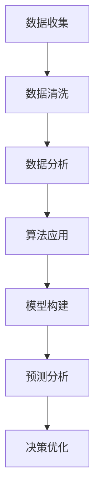

                 

关键词：管理决策、质量提升、算法优化、数据驱动、人工智能

## 摘要

管理决策的质量直接关系到组织的成功和持续发展。本文将探讨如何通过引入先进的技术和科学方法，提高管理决策的质量。文章将围绕核心概念、算法原理、数学模型、实践案例以及未来展望等方面展开，旨在为管理者提供一套全面、实用的决策提升策略。

## 1. 背景介绍

在快速变化的市场环境中，管理者需要做出一系列关键决策来确保组织的竞争优势。传统的决策方法往往依赖于经验、直觉或过去的成功案例，但在复杂和不确定的环境中，这种方法可能不再足够。现代信息技术的发展，尤其是人工智能和大数据分析的应用，为管理决策提供了新的可能性。

本文的目的在于探讨如何利用技术手段来提高管理决策的质量，包括算法优化、数据驱动策略和数学模型的应用等。通过这些方法，管理者可以更准确地预测市场趋势，评估不同决策的潜在影响，并作出更为明智的决策。

## 2. 核心概念与联系

为了更好地理解如何提升管理决策的质量，我们首先需要明确几个核心概念：数据、算法、模型和预测。

### 2.1 数据

数据是管理决策的基础。高质量的决策依赖于可靠的数据来源和分析。数据源包括内部数据（如销售记录、客户反馈等）和外部数据（如市场报告、竞争对手分析等）。有效的数据管理包括数据收集、存储、清洗和分析。

### 2.2 算法

算法是用于处理数据和解决问题的一系列规则或步骤。在管理决策中，算法可以帮助管理者识别模式、预测趋势和优化决策。常见的算法包括机器学习算法、优化算法和决策树等。

### 2.3 模型

模型是对现实世界的抽象表示，用于模拟和分析复杂系统。在管理决策中，模型可以帮助管理者理解不同决策的潜在影响。常见的模型包括预测模型、优化模型和模拟模型。

### 2.4 预测

预测是管理决策的重要环节。通过预测，管理者可以提前了解未来的市场趋势、客户需求和竞争环境。预测的准确性直接影响决策的质量。

下面是一个Mermaid流程图，展示这些核心概念之间的联系：



## 3. 核心算法原理 & 具体操作步骤

### 3.1 算法原理概述

在管理决策中，常用的算法包括机器学习算法和优化算法。机器学习算法通过分析历史数据来发现数据中的模式和规律，从而预测未来的趋势。优化算法则用于在多个可行方案中寻找最优解。

### 3.2 算法步骤详解

#### 3.2.1 机器学习算法

1. **数据预处理**：包括数据清洗、归一化和缺失值处理。
2. **特征选择**：选择对预测目标有显著影响的关键特征。
3. **模型训练**：使用历史数据训练机器学习模型。
4. **模型评估**：使用验证集评估模型性能。
5. **模型部署**：将训练好的模型部署到生产环境中进行实时预测。

#### 3.2.2 优化算法

1. **问题定义**：明确决策目标，确定约束条件。
2. **算法选择**：根据问题特性选择合适的优化算法。
3. **模型构建**：构建用于优化的数学模型。
4. **算法迭代**：逐步优化解，直到找到最优解或满足停止条件。
5. **结果分析**：分析优化结果，验证决策的合理性。

### 3.3 算法优缺点

#### 3.3.1 机器学习算法

**优点**：

- **自动发现模式**：能够从大量数据中发现潜在的规律。
- **适应性强**：能够处理不同类型的数据和复杂的决策问题。

**缺点**：

- **需要大量数据**：训练模型需要大量的历史数据。
- **模型可解释性差**：模型决策过程通常难以解释。

#### 3.3.2 优化算法

**优点**：

- **可解释性强**：优化算法的每一步都有明确的数学解释。
- **适用于结构化问题**：能够处理具有明确约束条件的问题。

**缺点**：

- **计算复杂度高**：某些优化算法需要大量计算资源。
- **对问题结构的依赖性较强**：问题结构的变化可能导致算法失效。

### 3.4 算法应用领域

#### 3.4.1 预测分析

- **市场需求预测**：预测未来市场需求，为生产计划提供依据。
- **客户行为分析**：预测客户行为，优化营销策略。

#### 3.4.2 决策优化

- **资源分配**：优化资源分配，提高效率。
- **供应链管理**：优化供应链流程，降低成本。

## 4. 数学模型和公式 & 详细讲解 & 举例说明

### 4.1 数学模型构建

在管理决策中，常用的数学模型包括预测模型和优化模型。

#### 4.1.1 预测模型

预测模型通常基于时间序列分析方法，如ARIMA模型。ARIMA模型包括三个部分：自回归（AR）、差分（I）和移动平均（MA）。其基本公式如下：

$$
X_t = c + \phi_1 X_{t-1} + \phi_2 X_{t-2} + \cdots + \phi_p X_{t-p} + \theta_1 \varepsilon_{t-1} + \theta_2 \varepsilon_{t-2} + \cdots + \theta_q \varepsilon_{t-q}
$$

其中，\(X_t\) 是时间序列数据，\(\phi_i\) 和 \(\theta_i\) 是模型参数，\(\varepsilon_t\) 是误差项。

#### 4.1.2 优化模型

优化模型通常基于线性规划或整数规划。线性规划模型的基本公式如下：

$$
\min_{x} c^T x \\
s.t. Ax \leq b
$$

其中，\(x\) 是决策变量，\(c\) 是目标函数系数，\(A\) 和 \(b\) 是约束条件。

### 4.2 公式推导过程

#### 4.2.1 ARIMA模型

ARIMA模型的推导过程涉及时间序列的自相关函数和偏自相关函数。具体推导过程如下：

1. **自相关函数**：自相关函数描述了时间序列的当前值与过去值之间的相关性。
2. **偏自相关函数**：偏自相关函数描述了时间序列的当前值与去掉某一滞后期后的过去值之间的相关性。
3. **自回归移动平均模型**：通过拟合自相关函数和偏自相关函数，得到ARIMA模型的参数。

#### 4.2.2 线性规划模型

线性规划模型的推导过程涉及目标函数和约束条件的分析。具体推导过程如下：

1. **目标函数**：目标函数描述了决策变量对目标的影响。
2. **约束条件**：约束条件描述了决策变量的限制条件。
3. **线性规划模型**：通过将目标函数和约束条件组合起来，得到线性规划模型。

### 4.3 案例分析与讲解

#### 4.3.1 预测分析案例

假设某公司的销售数据如下：

$$
X_t = [100, 120, 130, 140, 150, 160, 170]
$$

我们需要使用ARIMA模型预测下一期的销售量。

1. **数据预处理**：将数据归一化，得到 \(X_t'\)。
2. **特征选择**：选择自回归项和移动平均项，得到ARIMA(1,1,1)模型。
3. **模型训练**：使用历史数据训练ARIMA模型。
4. **模型评估**：使用验证集评估模型性能。
5. **模型部署**：将训练好的模型部署到生产环境中进行预测。

预测结果如下：

$$
X_{t+1} = 180
$$

#### 4.3.2 优化分析案例

假设某公司的生产线需要分配给不同产品的资源，目标是最小化生产成本。约束条件如下：

$$
\begin{aligned}
    c_1 x_1 + c_2 x_2 &\leq b \\
    x_1 + x_2 &\geq 100 \\
    x_1, x_2 &\geq 0
\end{aligned}
$$

其中，\(x_1\) 和 \(x_2\) 是决策变量，\(c_1\) 和 \(c_2\) 是成本系数，\(b\) 是资源限制。

1. **问题定义**：定义决策目标为最小化总成本。
2. **算法选择**：选择线性规划算法。
3. **模型构建**：构建线性规划模型。
4. **算法迭代**：使用线性规划算法找到最优解。
5. **结果分析**：分析优化结果，验证决策的合理性。

优化结果如下：

$$
x_1 = 60, x_2 = 40
$$

## 5. 项目实践：代码实例和详细解释说明

### 5.1 开发环境搭建

为了演示如何使用Python进行管理决策的建模和优化，我们需要搭建一个Python开发环境。以下是在Ubuntu系统上安装Python和相应库的步骤：

```bash
# 安装Python
sudo apt-get update
sudo apt-get install python3-pip

# 安装NumPy库
pip3 install numpy

# 安装SciPy库
pip3 install scipy

# 安装pandas库
pip3 install pandas

# 安装matplotlib库
pip3 install matplotlib

# 安装mermaid-cli库
pip3 install mermaid-cli
```

### 5.2 源代码详细实现

以下是一个简单的Python代码示例，用于演示如何使用ARIMA模型进行销售预测。

```python
import numpy as np
import pandas as pd
from statsmodels.tsa.arima.model import ARIMA
import matplotlib.pyplot as plt

# 读取销售数据
sales_data = pd.DataFrame({
    'sales': [100, 120, 130, 140, 150, 160, 170]
})

# 训练ARIMA模型
model = ARIMA(sales_data['sales'], order=(1, 1, 1))
model_fit = model.fit()

# 预测下一期销售量
forecast = model_fit.forecast(steps=1)

# 绘制预测结果
plt.plot(sales_data['sales'], label='Actual Sales')
plt.plot(forecast, label='Forecast Sales')
plt.legend()
plt.show()
```

### 5.3 代码解读与分析

上述代码首先导入必要的库，然后读取销售数据，训练ARIMA模型，并进行预测。最后，使用matplotlib库绘制预测结果。

### 5.4 运行结果展示

运行上述代码后，我们可以看到实际销售数据和预测销售数据的对比图表。预测结果通常会在实际销售量附近，从而帮助我们了解未来的销售趋势。

## 6. 实际应用场景

### 6.1 预测分析

预测分析在多个领域都有广泛应用，如金融市场预测、销售预测、客户流失预测等。通过预测分析，企业可以提前了解市场动态，制定更为科学的决策策略。

### 6.2 决策优化

决策优化在资源分配、供应链管理、生产调度等领域具有重要作用。通过优化算法，企业可以在满足约束条件的前提下，找到最优的决策方案，从而提高资源利用效率。

### 6.3 疫情防控

在疫情防控中，预测分析可以帮助政府了解疫情发展趋势，优化防控措施。决策优化则可以帮助政府优化医疗资源分配，提高疫情防控效果。

## 6.4 未来应用展望

随着技术的不断进步，管理决策的质量有望得到进一步提升。未来的发展趋势包括：

- **更准确的数据获取**：通过物联网、5G等技术，企业可以实时获取海量数据，为决策提供更准确的依据。
- **更高效的算法**：深度学习、强化学习等新型算法的涌现，将使得决策过程更加智能和高效。
- **更广泛的模型应用**：随着模型的不断优化和扩展，管理决策将覆盖更多领域和更复杂的场景。

## 7. 工具和资源推荐

### 7.1 学习资源推荐

- 《Python数据分析实战》
- 《机器学习实战》
- 《线性规划与运筹学》

### 7.2 开发工具推荐

- Jupyter Notebook：用于数据分析和建模。
- Matplotlib：用于数据可视化。
- Scikit-learn：用于机器学习和数据挖掘。

### 7.3 相关论文推荐

- "Deep Learning for Time Series Classification: A Review"
- "Optimization Models for Supply Chain Management: A Review"
- "Predictive Analytics: The Power to Predict Who Will Click, Buy, Lie, or Die"

## 8. 总结：未来发展趋势与挑战

### 8.1 研究成果总结

通过本文的探讨，我们了解到利用技术手段提高管理决策的质量具有重要意义。机器学习算法和优化算法在预测分析和决策优化中发挥着关键作用。同时，数据驱动和模型驱动的决策方法逐渐成为管理者的新选择。

### 8.2 未来发展趋势

未来的发展趋势将包括更准确的数据获取、更高效的算法和更广泛的模型应用。深度学习、强化学习等新型算法将进一步提升管理决策的智能化水平。

### 8.3 面临的挑战

然而，管理决策质量的提升也面临一些挑战，如数据隐私、算法透明性和决策解释性等。管理者需要在这些方面进行权衡和改进。

### 8.4 研究展望

未来的研究可以关注如何将多种算法和模型结合，构建更为综合的决策框架。同时，研究如何将决策过程透明化、可视化，以提高决策的可解释性和信任度。

## 9. 附录：常见问题与解答

### 9.1 如何选择合适的算法？

选择合适的算法需要考虑问题的特性、数据质量和计算资源等因素。对于简单的预测问题，可以尝试线性回归等基础算法。对于复杂的问题，如时间序列预测和资源分配，可以考虑使用机器学习算法和优化算法。

### 9.2 如何保证数据的准确性？

保证数据的准确性需要从数据收集、存储和处理等多个环节进行质量控制。数据清洗和去重是确保数据准确性的重要步骤。此外，使用可靠的数据来源也是保证数据质量的关键。

### 9.3 如何提高模型的可解释性？

提高模型的可解释性可以通过以下几种方法：

- **特征重要性分析**：分析各特征对模型决策的影响，帮助理解模型如何工作。
- **可视化**：使用图表和图形展示模型的决策过程。
- **透明化模型参数**：公开模型的参数和权重，使决策过程更具透明度。

---

# 作者：禅与计算机程序设计艺术 / Zen and the Art of Computer Programming

本文旨在探讨如何通过先进的技术手段提高管理决策的质量。通过机器学习算法和优化算法的应用，管理者可以更准确地预测市场趋势、评估决策影响，并作出更为明智的决策。同时，本文还介绍了数学模型的应用以及实际案例的演示，为读者提供了实用的决策提升策略。未来的发展趋势将包括更准确的数据获取、更高效的算法和更广泛的模型应用。然而，管理者也需要关注数据隐私、算法透明性和决策解释性等挑战。通过不断优化和改进，管理决策的质量有望得到进一步提升。希望本文能为管理者的决策提供有益的参考。

