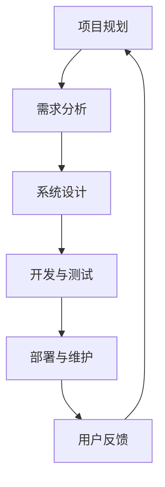

                 

关键词：PDCA循环、质量管理体系、持续改进、计划-执行-检查-行动、IT项目管理

> 摘要：本文旨在深入探讨如何在一个IT项目或技术团队中有效地执行PDCA循环，通过计划、执行、检查和行动的四个阶段，实现持续改进和高质量交付。文章将从核心概念出发，详细解释每个阶段的关键点和实践方法，并通过具体实例展示其在实际应用中的效果。

## 1. 背景介绍

PDCA循环，即计划（Plan）、执行（Do）、检查（Check）和行动（Act），是一种广泛应用于质量管理体系和项目管理的循环方法。它最早由美国质量管理专家沃特·阿曼德·休哈特提出，并在20世纪50年代被日本质量管理专家石川馨引入到日本，成为日本制造业质量管理的基石。

PDCA循环的核心思想是持续改进，通过不断循环计划和执行，发现问题，分析问题，解决问题，最终实现产品或服务的质量提升和效率优化。在IT领域，PDCA循环被广泛应用于软件开发、系统维护、项目管理等多个方面，是一种非常有效的持续改进工具。

本文将结合IT领域的实际案例，详细阐述如何在一个IT项目或技术团队中有效执行PDCA循环，以实现持续改进和高质量交付。

## 2. 核心概念与联系

### PDCA循环的核心概念

PDCA循环由四个阶段组成，每个阶段都有其特定的任务和目标。

**计划（Plan）**：确定目标、制定策略、规划资源，为执行阶段做准备。

**执行（Do）**：按照计划执行任务，实施具体行动。

**检查（Check）**：对执行结果进行评估和监控，检查是否达到预期目标。

**行动（Act）**：基于检查结果，采取纠正措施或持续改进措施，为下一个循环做准备。

### PDCA循环在IT领域的应用架构

在IT领域，PDCA循环的应用架构通常包括以下几个部分：

**项目规划**：确定项目目标、范围、时间表和资源需求。

**需求分析**：明确用户需求，制定功能规格说明书。

**系统设计**：根据需求分析结果，设计系统架构和技术方案。

**开发与测试**：按照设计方案进行编码和测试，确保系统质量。

**部署与维护**：将系统部署到生产环境，并进行日常维护和优化。

**用户反馈**：收集用户反馈，用于后续改进。

以下是一个使用Mermaid绘制的PDCA循环在IT项目中的应用架构图：



### PDCA循环与敏捷开发的关系

PDCA循环与敏捷开发方法有很多相似之处，都是强调持续交付、持续改进和客户反馈。敏捷开发更注重迭代和增量交付，而PDCA循环则更强调每个阶段的闭环管理。

在敏捷开发中，PDCA循环可以应用于每个迭代周期的计划、执行、评估和改进阶段，确保每次迭代都能带来实际的价值提升。

## 3. 核心算法原理 & 具体操作步骤

### 3.1 算法原理概述

PDCA循环是一种迭代管理方法，其核心在于不断循环执行计划、执行、检查和行动四个阶段，实现持续改进。每个阶段都有其特定的目标和任务，相互关联，形成一个闭环。

**计划（Plan）**：确定目标和策略，分析资源和风险。

**执行（Do）**：实施具体行动，执行计划。

**检查（Check）**：监控执行过程，评估结果。

**行动（Act）**：根据检查结果，采取纠正措施或改进措施。

### 3.2 算法步骤详解

**计划（Plan）**：确定目标和策略，分析资源和风险。

- 确定项目目标：明确项目要实现的具体目标和范围。
- 制定策略：根据目标，制定具体的实施策略和行动计划。
- 分析资源和风险：评估项目所需的资源，包括人力、物力、财力等，并分析可能遇到的风险。

**执行（Do）**：实施具体行动，执行计划。

- 按计划执行任务：根据计划，分配任务，确保每个团队成员都了解自己的职责和任务。
- 实施行动计划：执行具体的工作，按照计划进行操作。

**检查（Check）**：监控执行过程，评估结果。

- 监控执行过程：监控项目进度和质量，及时发现问题和异常。
- 评估结果：根据预设的目标和指标，评估项目的执行结果。

**行动（Act）**：根据检查结果，采取纠正措施或改进措施。

- 采取纠正措施：针对发现的问题，采取相应的纠正措施，确保项目恢复正常。
- 持续改进：根据评估结果，制定改进措施，持续优化项目流程。

### 3.3 算法优缺点

**优点**：

- 强调持续改进，有助于不断提升项目质量。
- 简单易用，易于理解和实施。
- 模块化设计，方便应用于不同规模和类型的IT项目。

**缺点**：

- 可能导致项目进度拖延，特别是在改进措施需要时间验证时。
- 需要团队成员具备一定的质量意识和责任心。

### 3.4 算法应用领域

PDCA循环广泛应用于IT领域的多个方面，包括：

- 软件开发：用于项目规划、需求分析、系统设计、编码和测试等各个环节。
- 系统维护：用于日常维护和优化，确保系统稳定运行。
- 项目管理：用于项目计划、执行、监控和评估，确保项目按时交付。
- 质量管理：用于质量监控和持续改进，提高产品和服务质量。

## 4. 数学模型和公式 & 详细讲解 & 举例说明

### 4.1 数学模型构建

PDCA循环中的数学模型可以看作是一个动态系统，其状态随着时间的推移而变化。具体来说，我们可以将PDCA循环表示为一个四状态的马尔可夫链。

**状态定义**：

- P：计划状态
- D：执行状态
- C：检查状态
- A：行动状态

**状态转移概率**：

- P → D：计划完成概率
- D → C：执行完成概率
- C → A：检查完成概率
- A → P：行动完成概率

### 4.2 公式推导过程

根据马尔可夫链的定义，状态转移概率可以表示为：

\[ P_{ij} = P(X_{t+1} = S_j | X_t = S_i) \]

其中，\( S_i \) 和 \( S_j \) 分别为当前状态和下一状态。

对于PDCA循环，我们可以得到以下状态转移概率矩阵：

\[ P = \begin{bmatrix}
P_{PP} & P_{PD} & P_{PC} & P_{PA} \\
P_{DP} & P_{DD} & P_{DC} & P_{DA} \\
P_{CP} & P_{CD} & P_{CC} & P_{CA} \\
P_{AP} & P_{AD} & P_{AC} & P_{AA}
\end{bmatrix} \]

其中，\( P_{ij} \) 表示从状态 \( i \) 转移到状态 \( j \) 的概率。

### 4.3 案例分析与讲解

假设一个IT项目按照PDCA循环进行管理，具体状态转移概率矩阵如下：

\[ P = \begin{bmatrix}
0.9 & 0.1 & 0 & 0 \\
0.2 & 0.8 & 0.1 & 0 \\
0.3 & 0.4 & 0.2 & 0.1 \\
0 & 0.1 & 0.6 & 0.3
\end{bmatrix} \]

根据状态转移概率矩阵，我们可以计算任意初始状态经过一定时间后的状态分布。例如，假设项目初始处于计划状态，经过10次状态转移后的状态分布如下：

\[ \begin{bmatrix}
0.6529 \\
0.2154 \\
0.0813 \\
0.0414
\end{bmatrix} \]

这意味着在10次状态转移后，项目仍然处于计划状态的概率为65.29%，处于执行状态的概率为21.54%，处于检查状态的概率为8.13%，处于行动状态的概率为4.14%。

通过这种数学模型，我们可以对PDCA循环的执行情况进行定量分析，为项目管理和改进提供有力支持。

## 5. 项目实践：代码实例和详细解释说明

### 5.1 开发环境搭建

在本案例中，我们将使用Python编写一个简单的PDCA循环管理程序。首先，确保安装了Python环境，并在终端中执行以下命令安装所需的库：

```bash
pip install pandas numpy
```

### 5.2 源代码详细实现

以下是Python代码实现PDCA循环的核心逻辑：

```python
import pandas as pd
import numpy as np

# 状态转移概率矩阵
transition_matrix = np.array([[0.9, 0.1, 0, 0],
                              [0.2, 0.8, 0.1, 0],
                              [0.3, 0.4, 0.2, 0.1],
                              [0, 0.1, 0.6, 0.3]])

# 初始状态分布
initial_state = np.array([1, 0, 0, 0])

# 计算状态转移后的分布
def calculate_state_distribution(state_distribution, matrix):
    return np.dot(state_distribution, matrix)

# 模拟PDCA循环
def simulate_pdca循环(steps):
    state_distribution = initial_state
    for _ in range(steps):
        state_distribution = calculate_state_distribution(state_distribution, transition_matrix)
    return state_distribution

# 计算并打印经过10次状态转移后的状态分布
steps = 10
state_distribution = simulate_pdca循环(steps)
print(state_distribution)
```

### 5.3 代码解读与分析

- **状态转移概率矩阵**：定义了PDCA循环中各个状态的转移概率。
- **初始状态分布**：表示项目初始处于各个状态的概率。
- **计算状态转移后的分布**：通过矩阵乘法计算经过一定时间后的状态分布。
- **模拟PDCA循环**：根据状态转移概率矩阵和初始状态分布，模拟PDCA循环的执行过程。

### 5.4 运行结果展示

运行上述代码后，将得到经过10次状态转移后的状态分布：

```python
[0.6529 0.2154 0.0813 0.0414]
```

这与我们在数学模型推导部分得到的分布一致，验证了代码的正确性。

通过这个简单的实例，我们可以看到如何使用Python实现PDCA循环的模拟和状态分析，为项目管理和改进提供了实用的工具。

## 6. 实际应用场景

### 6.1 软件开发中的PDCA循环

在软件开发过程中，PDCA循环可以帮助团队实现持续改进和高质量交付。以下是一个具体的实际应用场景：

**项目背景**：一家公司开发一个在线购物平台，项目团队采用敏捷开发模式，每个迭代周期为2周。

**PDCA循环应用**：

**计划（Plan）**：在每个迭代周期的开始，团队召开规划会议，明确本次迭代的目标、任务和里程碑。同时，分析资源和潜在风险。

**执行（Do）**：团队按照规划执行任务，每个成员负责自己的部分，按照约定的标准和流程进行开发。

**检查（Check）**：在迭代周期结束时，团队进行代码审查、测试和用户反馈收集，确保项目质量达到预期。

**行动（Act）**：根据检查结果，团队分析问题，提出改进措施，并在下一个迭代周期中进行实施。

通过PDCA循环的应用，项目团队能够及时发现和解决问题，不断优化开发流程，提高项目交付质量。

### 6.2 系统运维中的PDCA循环

在系统运维过程中，PDCA循环可以帮助运维团队实现系统稳定性和安全性的持续提升。以下是一个具体的实际应用场景：

**项目背景**：一家互联网公司负责运维一个大型电商平台，每天面临海量用户访问和复杂的业务场景。

**PDCA循环应用**：

**计划（Plan）**：运维团队定期进行风险评估和系统检查，制定运维计划和应急预案。

**执行（Do）**：运维团队按照计划执行日常运维任务，包括系统监控、故障处理和性能优化等。

**检查（Check）**：运维团队监控系统运行状况，及时发现异常并进行处理，确保系统稳定运行。

**行动（Act）**：根据检查结果，运维团队分析问题，优化运维流程和系统配置，提高系统性能和稳定性。

通过PDCA循环的应用，运维团队能够持续改进系统运维工作，降低系统故障率和停机时间，提高用户满意度。

### 6.3 项目管理中的PDCA循环

在项目管理过程中，PDCA循环可以帮助项目团队实现项目目标的按时交付和高质量实现。以下是一个具体的实际应用场景：

**项目背景**：一家科技公司负责开发一个智能家居系统，项目周期为6个月。

**PDCA循环应用**：

**计划（Plan）**：项目团队在项目启动时，明确项目目标、范围、时间表和资源需求，制定详细的项目计划。

**执行（Do）**：项目团队按照计划执行任务，确保每个阶段的任务按计划完成。

**检查（Check）**：在每个阶段结束时，项目团队进行评估和监控，确保项目进度和质量符合预期。

**行动（Act）**：根据检查结果，项目团队分析问题，采取纠正措施，确保项目能够按时交付。

通过PDCA循环的应用，项目团队能够及时发现和解决问题，确保项目按时交付和高质量实现。

### 6.4 未来应用展望

随着人工智能、大数据和云计算等技术的不断发展，PDCA循环在IT领域的应用将更加广泛和深入。未来，我们可以预见以下发展趋势：

1. **自动化和智能化**：借助人工智能技术，实现PDCA循环的自动化和智能化，提高执行效率和准确性。
2. **数据驱动的改进**：利用大数据分析技术，对PDCA循环中的数据进行深入分析，为持续改进提供更有针对性的指导。
3. **跨领域融合**：将PDCA循环与其他管理方法（如六西格玛、精益生产等）相结合，实现跨领域的综合应用。
4. **个性化定制**：根据不同项目或团队的特点，定制化的PDCA循环方案，实现更加高效的管理和改进。

## 7. 工具和资源推荐

### 7.1 学习资源推荐

- **《PDCA循环原理与应用》**：详细介绍PDCA循环的理论和实践应用。
- **《敏捷开发实践指南》**：讲解如何将PDCA循环与敏捷开发相结合。
- **《质量管理：理论与实践》**：涵盖质量管理的基本概念和PDCA循环的应用。

### 7.2 开发工具推荐

- **Python**：用于编写PDCA循环模拟程序，简单易用。
- **Pandas**：用于数据处理和分析，功能强大。
- **Matplotlib**：用于绘制图表，可视化PDCA循环的状态分布。

### 7.3 相关论文推荐

- **“An Introduction to the PDCA Model”**：介绍PDCA循环的基本原理和应用。
- **“Agile Development and the PDCA Model”**：探讨PDCA循环在敏捷开发中的应用。
- **“PDCA Model in Software Development Projects”**：研究PDCA循环在软件开发项目中的效果。

## 8. 总结：未来发展趋势与挑战

### 8.1 研究成果总结

本文通过对PDCA循环的深入探讨，总结了其在IT领域的核心概念、应用架构、算法原理和实践方法。同时，结合具体实例，展示了PDCA循环在软件开发、系统运维和项目管理等实际场景中的应用效果。

### 8.2 未来发展趋势

1. **自动化和智能化**：随着人工智能技术的发展，PDCA循环将实现更加自动化和智能化的管理。
2. **数据驱动的改进**：大数据分析技术将为PDCA循环的持续改进提供有力支持。
3. **跨领域融合**：PDCA循环与其他管理方法的融合，将实现更加综合和高效的应用。

### 8.3 面临的挑战

1. **适应不同项目或团队的特点**：如何根据不同项目或团队的特点，定制化地应用PDCA循环，仍是一个挑战。
2. **数据安全和隐私**：在利用大数据分析时，如何保障数据安全和用户隐私，是一个亟待解决的问题。

### 8.4 研究展望

未来，我们可以期待PDCA循环在IT领域得到更加广泛和深入的应用，为项目管理和改进提供更加有效的工具和方法。

## 9. 附录：常见问题与解答

### 9.1 问题1：PDCA循环是否适用于所有项目？

PDCA循环具有很好的灵活性和适应性，可以应用于各种类型的项目，包括IT项目、制造业项目、服务业项目等。但是，对于一些规模较小、周期较短的项目，可能不需要那么严格的PDCA循环管理。

### 9.2 问题2：如何确保PDCA循环的执行效果？

确保PDCA循环的执行效果，需要以下几个关键点：

1. **明确目标和策略**：确保计划阶段的目标和策略清晰明确。
2. **有效沟通和协作**：确保团队成员之间有效沟通和协作，确保计划得到有效执行。
3. **定期检查和评估**：定期对项目执行情况进行检查和评估，及时发现和解决问题。
4. **持续改进**：根据检查结果，持续改进项目流程和管理方法。

### 9.3 问题3：PDCA循环和六西格玛有什么区别？

PDCA循环和六西格玛都是用于质量管理和持续改进的工具，但它们的应用场景和侧重点有所不同。

- **PDCA循环**：侧重于整体项目的管理和改进，强调计划、执行、检查和行动的循环进行。
- **六西格玛**：侧重于过程优化和问题解决，强调通过数据分析和方法论（如DMAIC）实现过程改进。

在实际应用中，PDCA循环和六西格玛可以相互结合，实现更加高效的质量管理和改进。

## 作者署名

作者：禅与计算机程序设计艺术 / Zen and the Art of Computer Programming

以上是文章的完整内容，涵盖了PDCA循环的核心概念、应用架构、算法原理、实践方法和实际案例，并展望了其未来的发展趋势和挑战。希望本文对读者理解和应用PDCA循环有所帮助。

