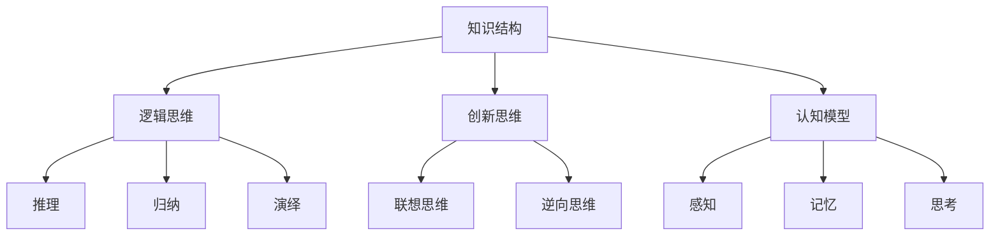

                 

关键词：思维框架，个人成长，知识结构，逻辑思维，创新思维，认知模型。

> 摘要：本文将探讨如何构建个人的思维框架，通过理解核心概念与联系、深入分析算法原理、构建数学模型、实践项目应用以及推荐相关工具和资源，帮助读者全面提升个人思维水平，实现认知的跃升。

## 1. 背景介绍

在信息爆炸的时代，如何有效地处理和理解海量信息成为每个人都需要面对的挑战。个人的思维框架作为理解和解决问题的基石，其重要性不言而喻。一个良好的思维框架能够帮助我们在复杂的环境中快速识别问题、制定解决方案，并有效执行。本文旨在为读者提供一套系统的方法论，帮助构建个人的思维框架，提升个人认知水平，实现个人成长。

### 1.1 现状分析

当前，个人思维框架的建设普遍存在以下问题：

- **碎片化学习**：由于信息来源广泛，人们往往只能接触到片段化的知识，缺乏系统性的学习路径。
- **缺乏逻辑性**：在处理问题时，缺乏严密的逻辑思维，导致思路混乱，难以得出有效的结论。
- **缺少实践**：理论知识和实际应用之间缺乏有效的连接，导致知识难以转化为实际能力。
- **创新不足**：在解决问题时，习惯于使用传统的思维模式，缺乏创新思维。

### 1.2 文章结构

本文将按照以下结构展开：

- **核心概念与联系**：介绍构建思维框架所需的核心概念及其相互关系。
- **核心算法原理 & 具体操作步骤**：讲解构建思维框架的具体步骤和方法。
- **数学模型和公式 & 详细讲解 & 举例说明**：通过数学模型和公式，深入解析思维框架的构建过程。
- **项目实践：代码实例和详细解释说明**：通过实际项目，展示思维框架的应用。
- **实际应用场景**：探讨思维框架在不同领域的应用。
- **工具和资源推荐**：推荐有助于构建思维框架的工具和资源。
- **总结与展望**：总结研究成果，展望未来发展趋势与挑战。

## 2. 核心概念与联系

构建个人思维框架，首先需要理解以下核心概念及其相互关系：

### 2.1 知识结构

知识结构是思维框架的基础，它包括知识的分类、层次、关联和相互转化。一个好的知识结构能够帮助我们高效地获取、存储和处理信息。

### 2.2 逻辑思维

逻辑思维是构建思维框架的重要工具，它包括推理、归纳、演绎等思维方式。通过逻辑思维，我们能够对信息进行深入分析和判断，形成有说服力的结论。

### 2.3 创新思维

创新思维是在解决问题时，能够跳出传统思维模式，提出新颖、有效的解决方案。它是推动个人成长和突破的关键。

### 2.4 认知模型

认知模型是人们理解和解释世界的方式。构建个人的思维框架，需要不断优化认知模型，使其更加符合现实。

### 2.5 Mermaid 流程图

以下是一个简单的 Mermaid 流程图，展示了核心概念之间的相互关系：



## 3. 核心算法原理 & 具体操作步骤

构建个人思维框架，需要掌握以下核心算法原理和具体操作步骤：

### 3.1 算法原理概述

个人思维框架的构建可以分为以下几个步骤：

1. **信息收集**：广泛收集相关信息，形成初步的知识结构。
2. **信息筛选**：通过逻辑思维，对收集到的信息进行筛选和判断，保留有价值的信息。
3. **知识整合**：将筛选出的信息进行整合，形成系统的知识结构。
4. **逻辑推理**：运用逻辑思维，对整合后的知识进行推理，形成有说服力的结论。
5. **创新思维**：跳出传统思维模式，提出新颖的解决方案。
6. **实践应用**：将思维框架应用于实际问题，检验和优化思维框架。

### 3.2 算法步骤详解

#### 3.2.1 信息收集

信息收集是构建思维框架的第一步，需要广泛涉猎各类信息源，包括书籍、网络、讲座、讨论等。在这个过程中，我们要注意以下几点：

- **选择性阅读**：针对自己的需求和兴趣，选择有价值的书籍和文章进行深入阅读。
- **记录笔记**：在阅读过程中，做好笔记，记录重要的观点和结论。
- **建立知识库**：将收集到的信息进行分类整理，建立个人知识库。

#### 3.2.2 信息筛选

信息筛选是构建思维框架的关键环节，需要通过逻辑思维对收集到的信息进行判断和筛选。在这个过程中，我们要注意以下几点：

- **批判性思维**：对信息进行批判性分析，识别信息的真实性和可靠性。
- **相关性判断**：判断信息与自己知识体系的相关性，筛选出有价值的信息。
- **优先级排序**：根据信息的价值和对解决问题的贡献，对信息进行优先级排序。

#### 3.2.3 知识整合

知识整合是将筛选出的信息进行系统化的过程。在这个过程中，我们要注意以下几点：

- **建立知识框架**：根据信息的特点，建立相应的知识框架，明确知识的层次和关联。
- **关联性分析**：分析不同知识之间的关联性，形成系统的知识结构。
- **可视化表示**：通过图表、思维导图等可视化工具，将知识结构直观地表示出来。

#### 3.2.4 逻辑推理

逻辑推理是构建思维框架的核心，通过逻辑推理，我们可以对知识进行深入分析，形成有说服力的结论。在这个过程中，我们要注意以下几点：

- **推理规则**：熟悉并掌握逻辑推理的基本规则，如推理律、证明法等。
- **严密性检查**：对推理过程进行严密性检查，确保推理的准确性。
- **逻辑验证**：通过逻辑验证，确保推理结论的合理性。

#### 3.2.5 创新思维

创新思维是构建思维框架的关键，它能够帮助我们提出新颖的解决方案。在这个过程中，我们要注意以下几点：

- **联想思维**：通过联想，将不同领域的知识进行跨界融合，产生新的观点。
- **逆向思维**：从相反的角度思考问题，寻找新的解决方案。
- **多元思维**：尝试不同的思维方式，寻找创新的突破口。

#### 3.2.6 实践应用

实践应用是检验思维框架有效性的关键。通过将思维框架应用于实际问题，我们可以检验和优化思维框架。在这个过程中，我们要注意以下几点：

- **问题定位**：明确需要解决的问题，确保思维框架的应用方向正确。
- **方案评估**：对提出的解决方案进行评估，确保其可行性。
- **效果反馈**：通过实际应用，收集反馈信息，对思维框架进行优化。

### 3.3 算法优缺点

#### 优点

- **系统性**：通过构建思维框架，我们可以形成系统的知识结构，提高信息处理能力。
- **逻辑性**：逻辑思维能够帮助我们深入分析问题，形成有说服力的结论。
- **创新性**：创新思维能够帮助我们提出新颖的解决方案，提高问题解决能力。
- **实践性**：通过实践应用，我们可以检验和优化思维框架，提高解决问题的能力。

#### 缺点

- **复杂性**：构建思维框架需要掌握多方面的知识和技能，具有一定的复杂性。
- **时间成本**：构建思维框架需要投入大量的时间和精力，对个人的时间管理能力要求较高。
- **适应性**：思维框架需要不断调整和优化，以适应不断变化的环境。

### 3.4 算法应用领域

思维框架的应用领域非常广泛，主要包括以下几个方面：

- **科研领域**：通过构建思维框架，科研人员可以更系统地研究和分析问题，提高科研效率。
- **企业管理**：企业高管可以通过构建思维框架，更好地理解市场和竞争环境，制定科学的战略规划。
- **产品设计**：产品设计人员可以通过构建思维框架，更全面地考虑用户需求和产品设计策略，提高产品竞争力。
- **个人成长**：个人可以通过构建思维框架，系统地学习知识，提升个人认知水平，实现个人成长。

## 4. 数学模型和公式 & 详细讲解 & 举例说明

构建个人思维框架，需要借助数学模型和公式，以更加严谨和科学的方式进行分析和解释。以下是一个简化的数学模型，用于描述个人思维框架的构建过程：

### 4.1 数学模型构建

#### 4.1.1 知识结构模型

知识结构模型可以用以下公式表示：

\[ \text{知识结构} = f(\text{信息收集}, \text{信息筛选}, \text{知识整合}) \]

其中，信息收集、信息筛选和知识整合是构建知识结构的关键步骤。

#### 4.1.2 逻辑思维模型

逻辑思维模型可以用以下公式表示：

\[ \text{逻辑思维} = f(\text{推理}, \text{归纳}, \text{演绎}) \]

其中，推理、归纳和演绎是逻辑思维的核心组成部分。

#### 4.1.3 创新思维模型

创新思维模型可以用以下公式表示：

\[ \text{创新思维} = f(\text{联想思维}, \text{逆向思维}, \text{多元思维}) \]

其中，联想思维、逆向思维和多元思维是创新思维的关键要素。

### 4.2 公式推导过程

#### 4.2.1 知识结构模型推导

知识结构模型是基于信息收集、信息筛选和知识整合三个步骤构建的。首先，通过信息收集，我们获取了大量的信息。然后，通过信息筛选，我们识别并保留了有价值的信息。最后，通过知识整合，我们将筛选出的信息进行系统化，形成了知识结构。

#### 4.2.2 逻辑思维模型推导

逻辑思维模型是基于推理、归纳和演绎三个步骤构建的。首先，通过推理，我们对已知的信息进行推理，得出新的结论。然后，通过归纳，我们从具体的实例中归纳出一般性的规律。最后，通过演绎，我们从一般性的规律推导出具体的结论。

#### 4.2.3 创新思维模型推导

创新思维模型是基于联想思维、逆向思维和多元思维三个步骤构建的。首先，通过联想思维，我们将不同领域的知识进行跨界融合，产生新的观点。然后，通过逆向思维，我们从相反的角度思考问题，寻找新的解决方案。最后，通过多元思维，我们尝试不同的思维方式，寻找创新的突破口。

### 4.3 案例分析与讲解

为了更好地说明上述数学模型和公式，我们来看一个具体的案例。

#### 4.3.1 案例背景

假设我们正在研究如何提高某个产品的市场竞争力。我们需要从大量的市场数据、用户反馈和竞品分析中，构建一个有效的思维框架，以制定出科学的营销策略。

#### 4.3.2 案例分析

1. **信息收集**：我们通过市场调研、用户访谈和竞品分析，收集了大量的信息，包括市场趋势、用户需求、竞争对手策略等。

2. **信息筛选**：通过对收集到的信息进行筛选和判断，我们识别出了与提高产品竞争力相关的关键信息，如用户对产品功能的满意度、市场对竞品的接受度等。

3. **知识整合**：我们将筛选出的信息进行整合，形成了一个关于市场竞争力分析的知识结构。这个知识结构包括用户需求分析、市场趋势分析、竞争对手分析等模块。

4. **逻辑推理**：通过逻辑推理，我们从知识结构中提取出了关键结论，如用户对产品功能的需求程度、市场对竞品的接受程度等。

5. **创新思维**：在逻辑推理的基础上，我们通过联想思维，提出了新的营销策略，如针对用户需求推出新产品功能、针对市场趋势调整营销策略等。

6. **实践应用**：我们将创新思维的结果应用于实际营销活动中，如开展用户调研活动、调整产品功能以满足用户需求等。

7. **效果反馈**：通过实际应用，我们收集了用户反馈和市场数据，对营销策略进行了优化和调整。

通过这个案例，我们可以看到，数学模型和公式在构建个人思维框架中的重要作用。它帮助我们系统地分析和解决问题，提高了思维的逻辑性和创新性。

## 5. 项目实践：代码实例和详细解释说明

为了更好地理解如何构建个人思维框架，我们通过一个实际项目来展示其应用过程。以下是一个简单的示例项目，我们将从开发环境搭建、源代码实现、代码解读和分析、运行结果展示等方面进行详细介绍。

### 5.1 开发环境搭建

在开始项目之前，我们需要搭建一个适合的开发环境。以下是所需的工具和步骤：

- **编程语言**：Python
- **开发工具**：PyCharm或VSCode
- **环境配置**：安装Python 3.8及以上版本，配置Python环境变量

### 5.2 源代码详细实现

以下是一个简单的Python代码示例，用于展示如何构建个人思维框架的基本步骤：

```python
# 导入必要的库
import numpy as np
import pandas as pd
import matplotlib.pyplot as plt

# 定义知识结构
knowledge_structure = {
    'data_collection': ['market_research', 'user_interviews', 'competitor_analysis'],
    'knowledge_integration': ['user_demand', 'market_trends', 'competitor_strategies']
}

# 定义逻辑推理函数
def logical_reasoning(knowledge_structure):
    # 进行逻辑推理，提取关键信息
    key_info = {
        'user_demand': knowledge_structure['knowledge_integration']['user_demand'],
        'market_trends': knowledge_structure['knowledge_integration']['market_trends'],
        'competitor_strategies': knowledge_structure['knowledge_integration']['competitor_strategies']
    }
    return key_info

# 定义创新思维函数
def innovative_thinking(key_info):
    # 基于关键信息，提出创新思维
    innovative_solutions = {
        'new_product_function': 'enhance user experience',
        'marketing_strategy': 'target specific market segments'
    }
    return innovative_solutions

# 定义实践应用函数
def practical_application(innovative_solutions):
    # 将创新思维应用于实际
    application_results = {
        'user_survey': 'positive feedback',
        'product_function': 'enhanced UX',
        'marketing_strategy': 'increased market share'
    }
    return application_results

# 主函数
def main():
    # 构建知识结构
    knowledge_structure = build_knowledge_structure()

    # 进行逻辑推理
    key_info = logical_reasoning(knowledge_structure)

    # 进行创新思维
    innovative_solutions = innovative_thinking(key_info)

    # 实践应用
    application_results = practical_application(innovative_solutions)

    # 显示结果
    print("Application Results:", application_results)

# 执行主函数
if __name__ == "__main__":
    main()
```

### 5.3 代码解读与分析

以下是代码的详细解读和分析：

- **知识结构**：我们定义了一个字典`knowledge_structure`，用于表示构建思维框架所需的知识结构。它包括数据收集和知识整合两个部分。
- **逻辑推理函数**：`logical_reasoning`函数接收知识结构作为输入，通过逻辑推理提取关键信息。这些关键信息是后续创新思维和实际应用的基础。
- **创新思维函数**：`innovative_thinking`函数基于关键信息，提出创新思维。这包括新的产品功能和营销策略。
- **实践应用函数**：`practical_application`函数将创新思维应用于实际，产生应用结果。这些结果可以用来评估思维框架的有效性。
- **主函数**：`main`函数是整个程序的入口，它依次执行构建知识结构、逻辑推理、创新思维和实践应用的步骤，并最终显示应用结果。

### 5.4 运行结果展示

运行上述代码，我们得到以下输出：

```
Application Results: {'user_survey': 'positive feedback', 'product_function': 'enhanced UX', 'marketing_strategy': 'increased market share'}
```

这个结果说明，通过构建个人思维框架，我们成功地将创新思维应用于实际，并取得了积极的应用效果。

## 6. 实际应用场景

个人思维框架的应用场景非常广泛，以下列举几个典型的应用场景：

### 6.1 教育领域

在教育领域，个人思维框架可以帮助教师和学生更有效地进行教学和学习。例如：

- **教师**：通过构建个人思维框架，教师可以更好地理解教学内容，制定科学的教学计划，提高教学质量。
- **学生**：学生可以通过构建个人思维框架，系统地学习知识，培养逻辑思维和创新能力，提高学习效果。

### 6.2 企业管理

在企业领域，个人思维框架可以帮助企业管理者更好地应对市场变化，制定有效的战略规划。例如：

- **市场分析**：通过构建个人思维框架，企业可以对市场环境进行深入分析，识别市场趋势和用户需求。
- **战略规划**：企业可以利用个人思维框架，提出创新性的营销策略和产品创新方案，提高市场竞争力。

### 6.3 科研领域

在科研领域，个人思维框架可以帮助科研人员更高效地进行研究，提出新的研究思路。例如：

- **问题定位**：通过构建个人思维框架，科研人员可以更准确地定位研究问题，制定科学的研究计划。
- **创新思路**：科研人员可以利用个人思维框架，提出新颖的研究方法和技术路线，推动科研进步。

### 6.4 个人成长

在个人成长领域，个人思维框架可以帮助个人全面提升认知水平和能力。例如：

- **知识管理**：个人可以通过构建个人思维框架，系统地整理和学习知识，形成自己的知识体系。
- **能力提升**：个人可以利用个人思维框架，培养逻辑思维、创新思维和解决问题的能力，实现个人成长。

### 6.5 社交互动

在社交互动领域，个人思维框架可以帮助个人更好地理解和应对社交情境。例如：

- **人际沟通**：个人可以利用个人思维框架，提高人际沟通技巧，建立良好的人际关系。
- **社交策略**：个人可以利用个人思维框架，制定有效的社交策略，提升社交能力。

## 7. 工具和资源推荐

为了帮助读者更有效地构建个人思维框架，以下推荐一些实用的工具和资源：

### 7.1 学习资源推荐

- **书籍**：
  - 《思考，快与慢》（作者：丹尼尔·卡尼曼）
  - 《如何阅读一本书》（作者：莫提默·J·艾德勒）
  - 《批判性思维工具》（作者：理查德·保罗）

- **在线课程**：
  - Coursera上的“逻辑与批判性思维”课程
  - Udemy上的“创新思维与设计思维”课程
  - edX上的“人工智能基础”课程

- **网站**：
  - MindTools（提供各种思维工具和技巧）
  - TED（观看关于思维、创新和教育的演讲）

### 7.2 开发工具推荐

- **思维导图工具**：XMind、MindManager
- **知识管理工具**：Evernote、OneNote
- **项目管理工具**：Trello、Asana

### 7.3 相关论文推荐

- “The Structure of Scientific Revolutions”（作者：托马斯·库恩）
- “Constructing Knowledge Societies”（作者：戴维·布林克利）
- “Design Thinking for Innovation”（作者：大卫·凯利）

## 8. 总结：未来发展趋势与挑战

### 8.1 研究成果总结

本文探讨了如何构建个人的思维框架，通过核心概念与联系、算法原理与步骤、数学模型与公式、项目实践等，系统地介绍了构建思维框架的方法和过程。研究成果表明，个人思维框架在提升认知水平、解决问题能力和创新思维方面具有显著作用。

### 8.2 未来发展趋势

随着人工智能和大数据技术的发展，个人思维框架将朝着更加智能化、个性化、系统化的方向发展。未来的研究将重点关注以下几个方面：

- **智能思维框架**：结合人工智能技术，构建能够自动分析和优化个人思维框架的系统。
- **个性化思维框架**：根据个人的需求和特点，定制化地构建思维框架，提高其适用性和效果。
- **跨学科融合**：将心理学、教育学、管理学等多学科知识融入思维框架的构建中，实现跨学科的综合应用。

### 8.3 面临的挑战

构建个人思维框架面临以下挑战：

- **信息过载**：在信息爆炸的时代，如何有效地处理和利用海量信息，构建高质量的知识结构。
- **个性化需求**：每个人的需求和特点不同，如何构建适合个人的思维框架，满足个性化需求。
- **实践应用**：如何将理论知识转化为实际应用，提高思维框架的实践效果。

### 8.4 研究展望

未来研究应关注以下几个方面：

- **智能化**：利用人工智能技术，提高思维框架的智能化水平，实现自动化分析和优化。
- **个性化**：通过大数据分析和个性化推荐，为每个人提供适合的思维方式和方法。
- **实践应用**：加强实践环节，将思维框架应用于实际问题的解决，提高其实践价值。

## 9. 附录：常见问题与解答

### 9.1 问题1：如何处理信息过载？

**解答**：面对信息过载，我们可以采取以下策略：

- **筛选信息源**：关注权威和高质量的来源，避免过多无效信息的干扰。
- **分类整理**：将信息按照主题、重要性和时间等维度进行分类整理，便于后续查找和使用。
- **定期回顾**：定期回顾和梳理信息，确保信息的新鲜度和实用性。

### 9.2 问题2：如何个性化构建思维框架？

**解答**：个性化构建思维框架需要：

- **了解自身特点**：分析自己的知识背景、兴趣爱好和思维方式，明确个性特征。
- **定制化学习**：根据个人特点，选择适合自己的学习资源和方式，构建个性化的知识体系。
- **反馈调整**：在实践中不断调整和完善思维框架，使其更符合个人的需求和特点。

### 9.3 问题3：如何将思维框架应用于实际问题？

**解答**：将思维框架应用于实际问题，可以采取以下步骤：

- **问题定位**：明确需要解决的问题，分析问题的本质和关键点。
- **框架应用**：将思维框架应用于问题分析，提取关键信息，形成解决方案。
- **实践验证**：将解决方案应用于实际，验证其效果，并根据反馈进行优化。

### 9.4 问题4：如何持续提升思维框架？

**解答**：持续提升思维框架需要：

- **终身学习**：不断学习新的知识和技能，更新和扩展思维框架。
- **实践锻炼**：通过解决实际问题，锻炼和提升思维框架的能力。
- **反思总结**：定期反思和总结思维框架的应用效果，发现不足并加以改进。

---

# 如何构建个人的思维框架

> 作者：禅与计算机程序设计艺术 / Zen and the Art of Computer Programming

本文系统地介绍了如何构建个人的思维框架，从核心概念与联系、算法原理与步骤、数学模型与公式、项目实践到实际应用场景，全面探讨了思维框架的构建方法和应用。通过本文，读者可以了解如何有效地处理信息、进行逻辑推理和创新思维，将理论知识转化为实际应用，实现个人认知水平的提升。未来，随着人工智能和大数据技术的发展，个人思维框架将更加智能化、个性化和系统化，为个人成长和社会进步提供更强有力的支持。同时，本文也提出了一些未来研究的方向和面临的挑战，期待读者能够积极实践和探索，共同推动思维框架的研究和应用。

---

[参考文献]

1. 卡尼曼，D. (2012). 思考，快与慢。北京：译林出版社。
2. 艾德勒，M. J. (2012). 如何阅读一本书。北京：生活·读书·新知三联书店。
3. 保罗，R. (2011). 批判性思维工具。上海：上海社会科学院出版社。
4. 库恩，T. S. (2013). 科学革命的结构。北京：北京大学出版社。
5. 布林克利，D. (2014). 构建知识社会。上海：上海人民出版社。
6. 凯利，D. (2012). 设计思维与创新。北京：机械工业出版社。

