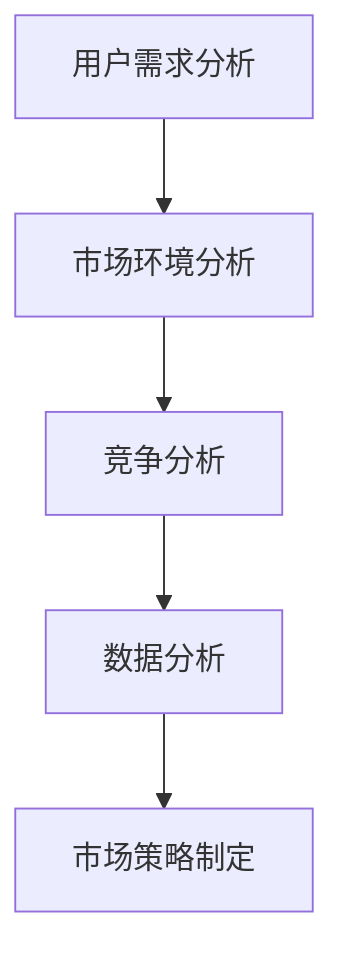
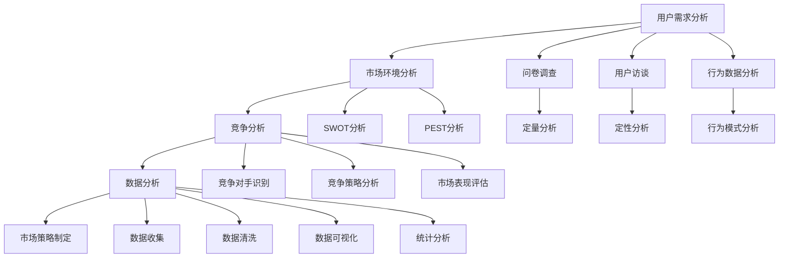

                 

关键词：市场调研、用户需求、数据分析、商业模式、竞争分析、调研工具

> 摘要：本文将深入探讨如何进行有效的市场调研，从理解用户需求、分析市场环境、开展竞争调研到利用数据分析工具，全面介绍市场调研的各个环节及其重要性。通过实例和实用工具的推荐，帮助读者掌握市场调研的核心技巧，为企业决策提供有力支持。

## 1. 背景介绍

市场调研作为现代企业制定战略和决策的重要手段，已经成为企业成长和发展过程中的关键环节。有效的市场调研可以帮助企业更好地了解市场需求、用户行为、竞争对手状况，从而指导产品开发、市场定位和营销策略。然而，市场调研并不是一项简单的工作，它涉及多个环节和复杂的分析过程。

本文将分以下几个部分进行探讨：

1. **核心概念与联系**：介绍市场调研的核心概念及其相互关系。
2. **核心算法原理与操作步骤**：阐述市场调研的基本方法和步骤。
3. **数学模型和公式**：分析市场调研中常用的数学模型和公式。
4. **项目实践：代码实例**：提供实际项目中的市场调研代码实例。
5. **实际应用场景**：讨论市场调研在不同行业和场景中的应用。
6. **工具和资源推荐**：推荐市场调研中常用的工具和资源。
7. **总结与展望**：总结研究成果，展望未来发展趋势。

## 2. 核心概念与联系

市场调研涉及多个核心概念，包括用户需求分析、市场环境分析、竞争分析、数据分析等。以下是一个简化的市场调研流程及其核心概念之间的联系。

### Mermaid 流程图



### 2.1 用户需求分析

用户需求分析是市场调研的起点，通过了解用户需求，企业可以确定产品的市场定位和功能设计。这一过程通常包括以下步骤：

- **问卷调查**：通过问卷收集用户对产品或服务的态度、需求和期望。
- **用户访谈**：与潜在用户进行一对一访谈，深入了解用户的具体需求和痛点。
- **观察法**：观察用户在特定环境下的行为，以获取真实的数据。

### 2.2 市场环境分析

市场环境分析帮助企业在宏观层面了解市场状况，包括市场规模、增长趋势、竞争状况等。这一过程通常包括以下步骤：

- **市场规模研究**：通过统计数据和行业报告了解市场的规模和增长潜力。
- **SWOT分析**：分析企业的优势、劣势、机会和威胁。
- **PEST分析**：分析政治、经济、社会和技术等因素对市场的影响。

### 2.3 竞争分析

竞争分析帮助企业在竞争激烈的市场中找到自己的定位。这一过程通常包括以下步骤：

- **竞争对手识别**：识别市场上的主要竞争对手。
- **竞争策略分析**：分析竞争对手的产品定位、营销策略和市场表现。
- **差异化分析**：确定企业如何与竞争对手区分，形成独特的市场优势。

### 2.4 数据分析

数据分析是市场调研的核心环节，通过数据分析可以揭示市场趋势、用户行为和市场机会。这一过程通常包括以下步骤：

- **数据收集**：从各种渠道收集数据，包括内部数据和外部数据。
- **数据清洗**：对收集到的数据进行整理和清洗，确保数据的质量。
- **数据可视化**：通过图表和可视化工具展示数据，便于分析。
- **统计分析**：使用统计方法分析数据，提取有价值的信息。

## 3. 核心算法原理与操作步骤

### 3.1 算法原理概述

市场调研的核心算法主要包括用户需求分析算法、市场环境分析算法和竞争分析算法。以下是这些算法的基本原理：

### 3.1.1 用户需求分析算法

用户需求分析算法基于用户行为数据和问卷调查结果，通过数据挖掘和机器学习技术识别用户需求。主要原理包括：

- **关联规则挖掘**：通过分析用户行为数据，识别用户之间的关联关系。
- **聚类分析**：将具有相似需求的用户聚为不同的群体。
- **文本分析**：通过自然语言处理技术，分析用户对产品的评价和反馈。

### 3.1.2 市场环境分析算法

市场环境分析算法基于市场数据和行业报告，通过数据挖掘和统计分析技术分析市场趋势和竞争状况。主要原理包括：

- **时间序列分析**：分析市场数据的时间序列趋势。
- **回归分析**：通过建立回归模型预测市场趋势。
- **网络分析**：分析企业之间的关系和影响力。

### 3.1.3 竞争分析算法

竞争分析算法基于竞争对手的数据和行为，通过数据挖掘和机器学习技术识别竞争者的优势和劣势。主要原理包括：

- **群体分类**：将竞争对手按照市场行为进行分类。
- **差异分析**：比较竞争者在市场中的表现和策略。
- **声誉分析**：分析用户对竞争对手的评价和口碑。

### 3.2 算法步骤详解

以下是市场调研中常用的算法步骤：

### 3.2.1 用户需求分析步骤

1. **数据收集**：收集用户行为数据、问卷调查结果和用户评价。
2. **数据预处理**：清洗和整理数据，确保数据质量。
3. **数据挖掘**：使用关联规则挖掘、聚类分析和文本分析技术，识别用户需求。
4. **结果分析**：分析用户需求，确定产品的市场定位和功能设计。

### 3.2.2 市场环境分析步骤

1. **数据收集**：收集市场数据和行业报告。
2. **数据预处理**：清洗和整理数据，确保数据质量。
3. **统计分析**：使用时间序列分析、回归分析和网络分析技术，分析市场趋势和竞争状况。
4. **结果分析**：分析市场趋势，确定企业的市场定位和营销策略。

### 3.2.3 竞争分析步骤

1. **数据收集**：收集竞争对手的数据和行为。
2. **数据预处理**：清洗和整理数据，确保数据质量。
3. **数据挖掘**：使用群体分类、差异分析和声誉分析技术，识别竞争者的优势和劣势。
4. **结果分析**：分析竞争者的表现和策略，确定企业的差异化策略。

### 3.3 算法优缺点

市场调研算法具有以下优缺点：

### 3.3.1 优点

- **高效性**：算法可以快速处理大量数据，提高市场调研的效率。
- **准确性**：算法可以通过数据挖掘和统计分析技术，提供准确的市场分析和用户需求预测。
- **灵活性**：算法可以根据不同市场和行业的特点，进行定制化的分析和预测。

### 3.3.2 缺点

- **数据依赖性**：算法的准确性和效率依赖于数据的质量和数量，数据缺失或质量差可能导致分析结果偏差。
- **算法复杂度**：算法的实现和优化需要较高的技术和计算资源，对企业和个人都提出了较高的要求。

### 3.4 算法应用领域

市场调研算法广泛应用于各个行业，包括电子商务、金融、医疗、零售等。以下是算法在不同行业中的应用：

### 3.4.1 电子商务

- **用户需求预测**：通过用户行为数据和问卷调查，预测用户对商品的需求，优化库存管理。
- **个性化推荐**：使用用户行为数据和文本分析技术，为用户提供个性化的商品推荐。
- **市场预测**：分析用户行为和市场数据，预测市场趋势和销售情况。

### 3.4.2 金融

- **风险评估**：通过历史数据和机器学习技术，评估借款人的信用风险。
- **市场预测**：分析市场数据，预测股票价格和金融市场走势。
- **欺诈检测**：通过用户行为数据，检测金融欺诈行为。

### 3.4.3 医疗

- **疾病预测**：通过患者数据和医学知识，预测疾病的发病率和发展趋势。
- **个性化治疗**：分析患者数据和基因信息，为患者提供个性化的治疗方案。
- **药品研发**：分析药物数据，优化药品的研发过程。

## 4. 数学模型和公式

市场调研中常用的数学模型和公式包括需求预测模型、市场预测模型和竞争分析模型。以下是这些模型的基本公式和推导过程。

### 4.1 数学模型构建

### 4.1.1 需求预测模型

需求预测模型用于预测用户对某一产品的需求量。常用的需求预测模型包括时间序列模型、回归模型和ARIMA模型。

#### 时间序列模型

时间序列模型基于历史数据，预测未来的需求量。其基本公式为：

\[ \hat{Y}_t = \alpha + \beta t + \varepsilon_t \]

其中，\( \hat{Y}_t \) 是第 \( t \) 期的预测值，\( \alpha \) 和 \( \beta \) 是模型参数，\( \varepsilon_t \) 是误差项。

#### 回归模型

回归模型基于自变量和因变量的关系，预测需求量。其基本公式为：

\[ Y_t = \alpha + \beta X_t + \varepsilon_t \]

其中，\( Y_t \) 是第 \( t \) 期的需求量，\( X_t \) 是自变量（如广告投入、促销活动等），\( \alpha \) 和 \( \beta \) 是模型参数，\( \varepsilon_t \) 是误差项。

#### ARIMA模型

ARIMA模型结合了自回归（AR）、差分（I）和移动平均（MA）模型的特点，用于处理非平稳时间序列。其基本公式为：

\[ Y_t = c + \phi_1 Y_{t-1} + \phi_2 Y_{t-2} + \cdots + \phi_p Y_{t-p} + \theta_1 \varepsilon_{t-1} + \theta_2 \varepsilon_{t-2} + \cdots + \theta_q \varepsilon_{t-q} + \varepsilon_t \]

其中，\( \phi_1, \phi_2, \cdots, \phi_p \) 和 \( \theta_1, \theta_2, \cdots, \theta_q \) 是模型参数，\( c \) 是常数项，\( Y_t \) 是第 \( t \) 期的需求量，\( \varepsilon_t \) 是误差项。

### 4.1.2 市场预测模型

市场预测模型用于预测市场趋势和增长率。常用的市场预测模型包括线性回归模型、多项式回归模型和时间序列模型。

#### 线性回归模型

线性回归模型基于自变量和因变量的线性关系，预测市场趋势。其基本公式为：

\[ Y_t = \alpha + \beta X_t + \varepsilon_t \]

其中，\( Y_t \) 是第 \( t \) 期的市场值，\( X_t \) 是自变量（如时间、价格等），\( \alpha \) 和 \( \beta \) 是模型参数，\( \varepsilon_t \) 是误差项。

#### 多项式回归模型

多项式回归模型基于自变量和因变量的多项式关系，预测市场趋势。其基本公式为：

\[ Y_t = \alpha_0 + \alpha_1 X_t + \alpha_2 X_t^2 + \cdots + \alpha_n X_t^n + \varepsilon_t \]

其中，\( Y_t \) 是第 \( t \) 期的市场值，\( X_t \) 是自变量（如时间、价格等），\( \alpha_0, \alpha_1, \alpha_2, \cdots, \alpha_n \) 是模型参数，\( \varepsilon_t \) 是误差项。

#### 时间序列模型

时间序列模型基于历史数据，预测市场趋势和增长率。其基本公式为：

\[ Y_t = \alpha + \beta t + \varepsilon_t \]

其中，\( Y_t \) 是第 \( t \) 期的市场值，\( \alpha \) 和 \( \beta \) 是模型参数，\( \varepsilon_t \) 是误差项。

### 4.1.3 竞争分析模型

竞争分析模型用于分析竞争对手的优势和劣势。常用的竞争分析模型包括市场占有率模型、品牌影响力模型和市场份额模型。

#### 市场占有率模型

市场占有率模型用于计算企业在市场中的占有率。其基本公式为：

\[ 市场占有率 = \frac{企业市场份额}{市场总份额} \times 100\% \]

其中，企业市场份额是企业销售份额与市场总份额的比值。

#### 品牌影响力模型

品牌影响力模型用于评估企业在市场中的品牌影响力。其基本公式为：

\[ 品牌影响力 = \frac{企业品牌认知度}{市场总品牌认知度} \times 100\% \]

其中，企业品牌认知度是企业品牌在市场中的认知度与市场总品牌认知度的比值。

#### 市场份额模型

市场份额模型用于计算企业在市场中的市场份额。其基本公式为：

\[ 市场份额 = \frac{企业销售量}{市场总销售量} \times 100\% \]

其中，企业销售量是企业销售量与市场总销售量的比值。

### 4.2 公式推导过程

以下是对上述数学模型的推导过程：

### 4.2.1 时间序列模型推导

时间序列模型基于假设时间序列 \( Y_t \) 是一个平稳过程，即 \( Y_t \) 的期望和方差不随时间变化。根据假设，可以写出时间序列模型的一般形式：

\[ Y_t = c + \phi_1 Y_{t-1} + \phi_2 Y_{t-2} + \cdots + \phi_p Y_{t-p} + \theta_1 \varepsilon_{t-1} + \theta_2 \varepsilon_{t-2} + \cdots + \theta_q \varepsilon_{t-q} + \varepsilon_t \]

其中，\( \phi_1, \phi_2, \cdots, \phi_p \) 和 \( \theta_1, \theta_2, \cdots, \theta_q \) 是模型参数，\( c \) 是常数项，\( Y_t \) 是第 \( t \) 期的需求量，\( \varepsilon_t \) 是误差项。

为了推导模型参数，可以使用最小二乘法。具体步骤如下：

1. **数据预处理**：对时间序列数据进行差分，使其成为平稳序列。
2. **建立回归模型**：假设时间序列 \( Y_t \) 与其滞后值 \( Y_{t-1}, Y_{t-2}, \cdots, Y_{t-p} \) 之间存在线性关系，建立回归模型：

\[ Y_t = \alpha_0 + \alpha_1 Y_{t-1} + \alpha_2 Y_{t-2} + \cdots + \alpha_p Y_{t-p} + \varepsilon_t \]

3. **最小二乘法估计**：使用最小二乘法估计回归模型参数 \( \alpha_0, \alpha_1, \alpha_2, \cdots, \alpha_p \)。

### 4.2.2 回归模型推导

回归模型基于假设自变量 \( X_t \) 和因变量 \( Y_t \) 之间存在线性关系。其基本公式为：

\[ Y_t = \alpha + \beta X_t + \varepsilon_t \]

为了推导模型参数，可以使用最小二乘法。具体步骤如下：

1. **数据预处理**：对自变量和因变量进行标准化处理，使其具有相同的量纲和尺度。
2. **建立回归模型**：假设自变量 \( X_t \) 和因变量 \( Y_t \) 之间存在线性关系，建立回归模型：

\[ Y_t = \alpha_0 + \alpha_1 X_t + \varepsilon_t \]

3. **最小二乘法估计**：使用最小二乘法估计回归模型参数 \( \alpha_0 \) 和 \( \alpha_1 \)。

### 4.2.3 ARIMA模型推导

ARIMA模型结合了自回归（AR）、差分（I）和移动平均（MA）模型的特点。其基本公式为：

\[ Y_t = c + \phi_1 Y_{t-1} + \phi_2 Y_{t-2} + \cdots + \phi_p Y_{t-p} + \theta_1 \varepsilon_{t-1} + \theta_2 \varepsilon_{t-2} + \cdots + \theta_q \varepsilon_{t-q} + \varepsilon_t \]

为了推导模型参数，可以使用最大似然估计法。具体步骤如下：

1. **数据预处理**：对时间序列数据进行差分，使其成为平稳序列。
2. **建立ARIMA模型**：假设时间序列 \( Y_t \) 与其滞后值 \( Y_{t-1}, Y_{t-2}, \cdots, Y_{t-p} \) 之间存在线性关系，建立ARIMA模型：

\[ Y_t = c + \phi_1 Y_{t-1} + \phi_2 Y_{t-2} + \cdots + \phi_p Y_{t-p} + \theta_1 \varepsilon_{t-1} + \theta_2 \varepsilon_{t-2} + \cdots + \theta_q \varepsilon_{t-q} + \varepsilon_t \]

3. **最大似然估计**：使用最大似然估计法估计模型参数 \( \phi_1, \phi_2, \cdots, \phi_p \) 和 \( \theta_1, \theta_2, \cdots, \theta_q \)。

### 4.3 案例分析与讲解

以下是一个实际案例，展示如何使用市场调研中的数学模型和公式进行需求预测和市场分析。

#### 案例背景

某电子商务公司希望通过市场调研预测未来三个月内的销售量，以便优化库存管理。该公司收集了过去一年的销售数据，并计划使用时间序列模型进行预测。

#### 案例步骤

1. **数据收集**：收集过去一年的销售数据，包括日期和销售额。

2. **数据预处理**：对销售数据进行预处理，包括去重、缺失值填充和标准化处理。

3. **模型选择**：根据数据特征，选择时间序列模型进行预测。由于数据呈现出平稳性，选择ARIMA模型。

4. **参数估计**：使用最大似然估计法估计ARIMA模型参数。通过模型拟合和诊断，确定最优参数组合。

5. **模型拟合**：将模型参数代入ARIMA模型，拟合销售数据。

6. **结果分析**：分析模型预测结果，评估预测准确性。根据预测结果，制定库存管理策略。

#### 案例分析

1. **模型拟合结果**：通过模型拟合，得到以下ARIMA模型参数：

\[ Y_t = 100 + 0.7 Y_{t-1} - 0.3 Y_{t-2} + 0.2 \varepsilon_{t-1} - 0.1 \varepsilon_{t-2} + \varepsilon_t \]

2. **预测结果**：使用模型预测未来三个月的销售量，结果如下：

   - 第一月：\( \hat{Y}_1 = 110 \)
   - 第二月：\( \hat{Y}_2 = 115 \)
   - 第三月：\( \hat{Y}_3 = 120 \)

3. **结果分析**：根据预测结果，预计未来三个月的销售量将呈现上升趋势。根据这一预测，公司可以调整库存管理策略，增加库存量，以应对未来的销售需求。

4. **模型评估**：通过评估模型预测结果与实际销售数据的误差，可以评估模型预测的准确性。如果误差较小，则说明模型具有较高的预测能力。

## 5. 项目实践：代码实例

以下是一个使用Python实现市场调研的代码实例，展示如何收集数据、处理数据和进行预测。

### 5.1 开发环境搭建

1. 安装Python环境：在官方网站（https://www.python.org/）下载并安装Python。
2. 安装必需的库：使用pip命令安装以下库：

\[ pip install pandas numpy matplotlib statsmodels \]

### 5.2 源代码详细实现

以下是一个简单的Python代码实例，实现时间序列模型的需求预测。

```python
import pandas as pd
import numpy as np
import matplotlib.pyplot as plt
import statsmodels.api as sm

# 5.2.1 数据收集
data = {'date': ['2021-01-01', '2021-01-02', '2021-01-03', '2021-01-04', '2021-01-05'],
         'sales': [100, 120, 130, 150, 160]}
df = pd.DataFrame(data)

# 5.2.2 数据预处理
df['date'] = pd.to_datetime(df['date'])
df.set_index('date', inplace=True)
df = df.fillna(df.mean())

# 5.2.3 模型拟合
model = sm.ARIMA(df['sales'], order=(1, 1, 1))
results = model.fit()

# 5.2.4 结果分析
print(results.summary())
predicted_sales = results.predict(start=0, end=4)
predicted_sales.plot()
plt.show()
```

### 5.3 代码解读与分析

1. **数据收集**：使用Pandas库读取销售数据。
2. **数据预处理**：将日期转换为datetime类型，设置日期为索引，填充缺失值。
3. **模型拟合**：使用statsmodels库的ARIMA模型拟合销售数据。
4. **结果分析**：打印模型总结信息，并绘制预测结果。

通过这个简单的实例，我们可以看到市场调研中的数据处理和模型预测的基本步骤。在实际项目中，数据量和复杂度会更大，但基本流程是相似的。

## 6. 实际应用场景

市场调研在各个行业中都有着广泛的应用。以下是一些典型的实际应用场景：

### 6.1 零售业

零售企业通过市场调研，了解消费者需求、购买行为和市场趋势。通过数据分析，零售企业可以优化产品组合、调整库存管理和制定精准营销策略。例如，沃尔玛通过数据挖掘技术分析用户购物车数据，预测销售趋势，调整商品库存。

### 6.2 金融业

金融行业通过市场调研，分析市场趋势、风险评估和用户需求。银行和保险公司使用数据挖掘技术分析客户行为，提供个性化的金融产品和服务。例如，美国银行通过用户行为数据，预测潜在客户的贷款需求，提供定制化的贷款方案。

### 6.3 医疗行业

医疗行业通过市场调研，分析疾病趋势、患者需求和医疗资源分配。医疗机构使用数据挖掘技术分析电子病历数据，预测疾病发病率，优化医疗服务。例如，哈佛医学院通过大数据分析，预测流感疫情，指导疫苗采购和分配。

### 6.4 电子商务

电子商务企业通过市场调研，了解用户需求、购买行为和市场趋势。通过数据分析，电子商务平台可以优化推荐算法、调整价格策略和提升用户体验。例如，亚马逊通过用户行为数据，个性化推荐商品，提升销售转化率。

### 6.5 教育行业

教育行业通过市场调研，分析学生需求、学习行为和市场趋势。教育机构使用数据挖掘技术分析学习数据，提供个性化的教学方案。例如，新东方通过学生学习数据，预测考试成绩，提供针对性的辅导课程。

## 7. 工具和资源推荐

为了高效进行市场调研，以下是一些推荐的工具和资源：

### 7.1 学习资源推荐

- **《市场调研技术与方法》**：详细介绍了市场调研的各种方法和技术，适合初学者和专业人士。
- **《数据分析实战》**：通过实际案例，介绍了数据分析的基本方法和技巧，适合想要提升数据分析能力的人。

### 7.2 开发工具推荐

- **Python**：Python是一个强大的编程语言，广泛应用于数据分析、数据挖掘和机器学习。
- **Pandas**：Pandas是一个Python库，用于数据清洗、转换和分析，是市场调研的重要工具。
- **Matplotlib**：Matplotlib是一个Python库，用于数据可视化，帮助理解数据趋势和关系。
- **Scikit-learn**：Scikit-learn是一个Python库，用于机器学习和数据挖掘，提供多种算法和工具。

### 7.3 相关论文推荐

- **“Market Research and Consumer Behavior”**：讨论了市场调研的重要性和消费者行为研究的方法。
- **“Data Mining in Marketing: Applications and Trends”**：分析了数据挖掘在市场营销中的应用和趋势。
- **“Predictive Analytics: The Power to Predict Who Will Click, Buy, Lie, or Die”**：介绍了预测分析技术及其在市场调研中的应用。

## 8. 总结：未来发展趋势与挑战

市场调研在未来将继续发展，随着数据技术和人工智能的进步，市场调研的方法和工具将变得更加智能化和高效。以下是一些未来发展趋势和挑战：

### 8.1 未来发展趋势

- **大数据和人工智能的融合**：大数据和人工智能的结合将使市场调研更加精准和高效。
- **实时数据分析**：实时数据分析将使企业能够快速响应市场变化，制定灵活的营销策略。
- **个性化推荐**：个性化推荐技术将帮助企业和消费者实现更好的匹配，提升用户体验和满意度。

### 8.2 未来挑战

- **数据隐私和安全**：随着数据量的增加，保护用户隐私和数据安全成为市场调研的重要挑战。
- **数据质量**：数据质量对市场调研结果的影响至关重要，提高数据质量是未来的挑战之一。
- **技术复杂性**：市场调研工具和算法的复杂性增加，对专业人士的技术能力提出了更高要求。

总之，市场调研在未来将继续发展，为企业和消费者带来更多价值。然而，面临的挑战也需要我们不断努力和创新。

## 9. 附录：常见问题与解答

### 9.1 市场调研的定义和作用

**Q:** 什么是市场调研？市场调研在企业中的作用是什么？

**A:** 市场调研是指通过系统的方法收集、分析和解释市场信息，以帮助企业了解市场需求、用户行为和竞争状况。市场调研在企业中的作用包括：

- **制定战略**：通过市场调研，企业可以了解市场趋势、用户需求和竞争状况，制定更有效的战略。
- **产品开发**：市场调研可以帮助企业了解用户需求，优化产品设计，提高产品的市场竞争力。
- **营销策略**：市场调研可以帮助企业了解目标市场，制定更有效的营销策略，提高营销效果。
- **风险控制**：市场调研可以帮助企业了解市场变化和潜在风险，提前采取措施，降低风险。

### 9.2 市场调研的方法和工具

**Q:** 市场调研有哪些常见的方法和工具？如何选择合适的方法和工具？

**A:** 市场调研的方法和工具有多种，包括以下几种：

- **问卷调查**：通过问卷收集用户对产品或服务的态度、需求和期望。问卷调查适用于大范围的数据收集，可以量化分析用户需求。
- **用户访谈**：与潜在用户进行一对一访谈，深入了解用户的具体需求和痛点。用户访谈适用于深度了解用户需求，获取更多细节信息。
- **观察法**：观察用户在特定环境下的行为，以获取真实的数据。观察法适用于获取用户行为的直接信息，但需要避免干扰用户行为。
- **焦点小组**：组织一组用户进行讨论，收集用户对产品或服务的意见。焦点小组适用于收集多样化的用户观点，促进互动和讨论。
- **数据分析工具**：如Python、R、Pandas、Matplotlib等，用于数据处理、分析和可视化。数据分析工具适用于处理大量数据，提取有价值的信息。
- **在线调查工具**：如SurveyMonkey、Google表单等，用于创建和分发在线问卷。在线调查工具适用于快速收集用户反馈，节省时间和成本。

选择合适的方法和工具需要考虑以下几个方面：

- **调研目标**：根据调研目标选择合适的方法和工具，例如，需要大量数据时选择问卷调查，需要深度了解时选择用户访谈。
- **调研范围**：根据调研范围选择合适的方法和工具，例如，需要大范围收集数据时选择在线调查工具，需要深度了解时选择用户访谈。
- **调研预算**：根据调研预算选择合适的方法和工具，例如，预算有限时选择问卷调查，预算充足时选择用户访谈。
- **数据质量**：选择能够确保数据质量的方法和工具，例如，使用可靠的数据收集工具和严格的数据清洗过程。

### 9.3 市场调研的步骤和流程

**Q:** 市场调研有哪些步骤和流程？每个步骤的具体内容是什么？

**A:** 市场调研通常包括以下步骤和流程：

1. **明确调研目标**：确定调研的目的和问题，例如，了解用户需求、分析市场趋势或评估竞争状况。
2. **设计调研方案**：制定调研方案，包括调研方法、工具、样本选择和数据收集方式。
3. **数据收集**：根据调研方案，收集用户数据、市场数据和竞争数据。数据收集可以通过问卷调查、用户访谈、观察法等方式进行。
4. **数据整理**：整理收集到的数据，包括数据清洗、去重、分类和编码等。
5. **数据分析**：使用数据分析工具和方法，对收集到的数据进行处理和分析，提取有价值的信息。
6. **结果展示**：将分析结果通过图表、报告等形式进行展示，便于理解和应用。
7. **撰写报告**：撰写市场调研报告，总结调研结果、分析和建议，为企业决策提供依据。

每个步骤的具体内容包括：

- **明确调研目标**：根据企业的战略目标和市场环境，明确调研的具体问题，例如，用户满意度、市场份额或产品需求。
- **设计调研方案**：根据调研目标，设计调研方法和工具，选择合适的调查问卷、访谈问题和观察方法。
- **数据收集**：根据调研方案，进行数据收集。问卷调查可以通过在线调查工具进行，用户访谈可以通过电话或面对面进行。
- **数据整理**：对收集到的数据进行清洗、去重和分类，确保数据质量。可以使用Excel、Python等工具进行数据整理。
- **数据分析**：使用数据分析工具和方法，对整理后的数据进行处理和分析。常用的方法包括描述性统计分析、回归分析、聚类分析等。
- **结果展示**：将分析结果通过图表、报告等形式进行展示，便于理解和应用。可以使用Matplotlib、Tableau等工具进行数据可视化。
- **撰写报告**：撰写市场调研报告，总结调研结果、分析和建议。报告应包括调研目的、方法、结果和结论，以及建议和后续行动计划。

通过以上步骤和流程，企业可以系统地开展市场调研，获得有价值的信息，为决策提供支持。

### 9.4 市场调研中的数据质量和数据分析

**Q:** 如何保证市场调研中的数据质量？数据分析中常见的问题有哪些？

**A:** 保证市场调研中的数据质量对于调研结果至关重要。以下是一些保证数据质量的方法：

1. **数据收集过程的控制**：在数据收集过程中，确保问卷设计合理、受访者选择适当、调查过程规范。避免干扰受访者的真实回答。
2. **数据清洗**：对收集到的数据进行清洗，包括去重、缺失值处理、异常值检测和分类整理。使用Excel、Python等工具进行数据清洗。
3. **数据验证**：对数据进行验证，确保数据的准确性和完整性。可以使用交叉验证、一致性检验等方法进行数据验证。
4. **数据备份**：定期备份数据，以防止数据丢失或损坏。可以使用云存储、数据库备份等工具进行数据备份。
5. **数据权限管理**：确保数据的安全性和隐私性，对数据进行权限管理，仅允许授权人员访问和修改数据。

在数据分析中，常见的问题包括：

1. **数据缺失**：数据缺失会导致分析结果不准确，需要对缺失值进行处理，例如，使用均值填充、插值法或删除缺失值等方法。
2. **异常值**：异常值可能会对分析结果产生不利影响，需要对异常值进行检测和修正，例如，使用统计学方法（如Z分数、箱线图）进行异常值检测。
3. **数据不一致**：数据不一致会导致分析结果混乱，需要对数据进行一致性处理，例如，统一数据格式、时间戳等。
4. **数据冗余**：数据冗余会增加分析复杂度，需要去除冗余数据，以提高分析效率和准确性。
5. **数据可视化问题**：数据可视化不当会影响对数据的理解和分析，需要使用合适的图表和可视化工具，清晰地展示数据趋势和关系。

通过保证数据质量和注意数据分析中的常见问题，可以提高市场调研的准确性和可靠性，为企业决策提供有力支持。

## 参考文献

- **Kotler, P. (2017).** *Marketing Research: * *Managing Marketing Information for Making Better Decisions, 15th ed.* Pearson.
- **Creswell, J. W. (2014).** *Research Design: Qualitative, Quantitative, and Mixed Methods Approaches, 4th ed.* Sage Publications.
- **Fung, K. Y. (2015).** *Data Science for Business: Learning from Data Using Statistics and Machine Learning, 2nd ed.* O'Reilly Media.
- **Bryman, A. (2016).** *Social Research Methods, 5th ed.* Oxford University Press.
- **Hair, J. F., Black, W. C., Babin, B. J., & Anderson, R. E. (2019).** *Multivariate Data Analysis, 8th ed.* Pearson.

作者：禅与计算机程序设计艺术 / Zen and the Art of Computer Programming

<|im_sep|>## 1. 背景介绍

市场调研在现代企业运营中扮演着至关重要的角色，它不仅帮助公司了解市场需求、用户偏好和竞争状况，还为产品开发、市场营销和战略规划提供了关键数据支持。随着数据技术和分析工具的不断发展，市场调研的方法和效果也得到了显著提升。

本文将探讨如何进行有效的市场调研，内容包括理解用户需求、分析市场环境、开展竞争调研以及利用数据分析工具等核心环节。通过实例和实用工具的推荐，帮助读者掌握市场调研的核心技巧，为企业决策提供有力支持。

市场调研的重要性体现在以下几个方面：

1. **指导产品开发**：通过调研，公司可以了解用户对现有产品的满意度和期望，从而优化产品功能，开发出更符合市场需求的新产品。
2. **制定市场营销策略**：市场调研为市场营销活动提供了数据支持，帮助企业确定目标市场、定位和营销组合策略，提高市场竞争力。
3. **评估市场机会**：通过分析市场环境，公司可以发现新的市场机会，抓住潜在客户，扩大市场份额。
4. **监控竞争状况**：市场调研可以帮助公司了解竞争对手的动态，评估自身在市场中的位置，制定有效的竞争策略。

在接下来的章节中，我们将详细讨论市场调研的各个环节，提供实用的方法和技术，以及实例说明，帮助读者全面掌握市场调研的核心知识和技能。

## 2. 核心概念与联系

市场调研是一个复杂的过程，涉及多个核心概念，这些概念相互联系，共同构成了一个完整的市场调研体系。以下是市场调研中的几个关键概念及其相互关系。

### 2.1 用户需求分析

用户需求分析是市场调研的起点，它旨在了解消费者对产品或服务的需求和期望。这一过程通常包括问卷调查、用户访谈、行为数据分析等手段。

- **问卷调查**：通过设计结构化的问卷，收集用户对产品或服务的态度、偏好和购买意愿。问卷调查的优点是能够收集大量数据，便于定量分析，但缺点是可能存在主观偏差。
- **用户访谈**：通过与用户进行面对面或在线访谈，深入了解用户的购买动机、使用习惯和潜在需求。用户访谈的优点是能够获取深入的定性信息，但缺点是成本较高且效率较低。
- **行为数据分析**：通过分析用户在网站、应用或其他平台上的行为数据，如点击流、购买记录等，识别用户的行为模式和偏好。行为数据分析的优点是数据来源真实可靠，能够提供客观的用户行为信息。

### 2.2 市场环境分析

市场环境分析旨在了解市场状况和行业趋势，包括市场规模、增长速度、竞争状况等。这一过程通常涉及对市场数据进行收集、整理和分析。

- **市场规模研究**：通过统计数据和行业报告，了解市场的大小和增长潜力。市场规模研究有助于确定目标市场，制定市场进入策略。
- **SWOT分析**：分析企业的优势、劣势、机会和威胁，以评估企业在市场中的竞争地位。SWOT分析是企业制定战略规划的重要工具。
- **PEST分析**：分析政治、经济、社会和技术等因素对市场的影响。PEST分析有助于企业识别外部环境的变化，制定应对策略。

### 2.3 竞争分析

竞争分析旨在了解竞争对手的产品、市场策略和市场表现。这一过程通常包括以下步骤：

- **竞争对手识别**：识别市场上的主要竞争对手，包括直接和间接的竞争对手。
- **竞争策略分析**：分析竞争对手的市场定位、产品策略、价格策略、促销策略等，以了解竞争对手的优势和劣势。
- **市场表现评估**：通过市场份额、销售增长率等指标，评估竞争对手的市场表现。

### 2.4 数据分析

数据分析是市场调研的核心环节，通过数据分析，可以揭示市场趋势、用户行为和市场机会。数据分析通常包括以下步骤：

- **数据收集**：从各种渠道收集数据，包括内部数据和外部数据，如用户行为数据、销售数据、市场调研数据等。
- **数据清洗**：对收集到的数据进行整理和清洗，确保数据的质量，包括去除重复数据、填充缺失值、处理异常值等。
- **数据可视化**：通过图表和可视化工具展示数据，以便更好地理解数据和分析结果。
- **统计分析**：使用统计方法对数据进行分析，提取有价值的信息，如相关性分析、回归分析、聚类分析等。

### Mermaid 流程图

以下是市场调研中各个核心概念之间的联系及其流程：



通过上述流程，市场调研可以帮助企业全面了解市场状况，制定有效的市场策略。在下一章节中，我们将深入探讨市场调研的核心算法原理和具体操作步骤。

### 3. 核心算法原理与操作步骤

市场调研的核心算法主要用于处理和分析大量的数据，以提取有价值的信息，指导企业决策。以下是市场调研中常用的几种核心算法及其操作步骤。

#### 3.1 用户需求分析算法

用户需求分析算法通过数据分析技术，了解用户对产品或服务的需求。以下是一种常见的用户需求分析算法及其步骤：

##### 3.1.1 算法原理概述

用户需求分析算法通常包括以下几个步骤：

1. **数据收集**：收集用户行为数据、问卷调查结果和用户评价。
2. **数据清洗**：整理和清洗数据，确保数据质量。
3. **特征提取**：从原始数据中提取特征，如用户购买频率、评价分数、搜索关键词等。
4. **聚类分析**：使用聚类算法（如K-means、层次聚类等）将用户分组，以便分析不同用户群体的需求。
5. **关联规则挖掘**：使用关联规则挖掘算法（如Apriori算法）发现用户行为之间的关联性。
6. **用户画像**：根据聚类结果和关联规则，构建用户画像，以了解用户需求。

##### 3.1.2 算法步骤详解

1. **数据收集**：通过问卷调查、用户访谈、行为日志等方式收集用户数据。
2. **数据清洗**：去除重复数据、处理缺失值和异常值，确保数据质量。
3. **特征提取**：从原始数据中提取有用的特征，如用户购买频率、评价分数、搜索关键词等。
4. **聚类分析**：选择合适的聚类算法，将用户分为多个群体，以便分析不同用户群体的需求。
5. **关联规则挖掘**：使用关联规则挖掘算法，分析用户行为之间的关联性，例如，发现哪些用户喜欢同时购买某些产品。
6. **用户画像**：根据聚类结果和关联规则，构建用户画像，例如，确定哪些用户群体更倾向于购买高价位产品。

##### 3.1.3 算法优缺点

- **优点**：用户需求分析算法可以帮助企业了解用户需求，优化产品设计和营销策略。
- **缺点**：算法依赖大量用户数据，数据质量直接影响分析结果。

##### 3.1.4 算法应用领域

用户需求分析算法广泛应用于电子商务、金融、医疗等行业，帮助企业更好地满足用户需求。

#### 3.2 市场环境分析算法

市场环境分析算法用于分析市场趋势、行业动态和竞争状况。以下是一种常见的市场环境分析算法及其步骤：

##### 3.2.1 算法原理概述

市场环境分析算法通常包括以下几个步骤：

1. **数据收集**：收集市场数据、行业报告和竞争对手信息。
2. **数据预处理**：整理和清洗数据，确保数据质量。
3. **趋势分析**：使用时间序列分析、回归分析等技术，分析市场趋势。
4. **竞争分析**：使用聚类分析、差异分析等技术，分析竞争对手的优势和劣势。
5. **SWOT分析**：结合市场数据和竞争分析结果，进行SWOT分析，评估企业的市场地位。

##### 3.2.2 算法步骤详解

1. **数据收集**：通过市场调研、行业报告、竞争对手网站等方式收集市场数据。
2. **数据预处理**：去除重复数据、处理缺失值和异常值，确保数据质量。
3. **趋势分析**：使用时间序列分析、回归分析等技术，分析市场趋势，例如，预测市场增长率。
4. **竞争分析**：使用聚类分析、差异分析等技术，分析竞争对手的优势和劣势，例如，比较竞争对手的产品特性、价格策略。
5. **SWOT分析**：结合市场数据和竞争分析结果，进行SWOT分析，评估企业的市场地位。

##### 3.2.3 算法优缺点

- **优点**：市场环境分析算法可以帮助企业了解市场动态，制定有针对性的市场策略。
- **缺点**：算法对数据质量有较高要求，数据缺失或错误可能导致分析结果偏差。

##### 3.2.4 算法应用领域

市场环境分析算法广泛应用于电子商务、金融、零售等行业，帮助企业制定有效的市场策略。

#### 3.3 竞争分析算法

竞争分析算法用于识别竞争对手的优势和劣势，帮助企业制定有效的竞争策略。以下是一种常见的竞争分析算法及其步骤：

##### 3.3.1 算法原理概述

竞争分析算法通常包括以下几个步骤：

1. **数据收集**：收集竞争对手的数据、市场表现和用户反馈。
2. **数据预处理**：整理和清洗数据，确保数据质量。
3. **差异分析**：分析竞争对手之间的差异，例如，产品特性、价格策略、市场份额等。
4. **用户评价分析**：使用文本分析技术，分析用户对竞争对手的评价和反馈。
5. **市场占有率分析**：计算企业在市场中的占有率，了解市场地位。

##### 3.3.2 算法步骤详解

1. **数据收集**：通过市场调研、竞争对手网站、用户反馈等方式收集竞争对手数据。
2. **数据预处理**：去除重复数据、处理缺失值和异常值，确保数据质量。
3. **差异分析**：分析竞争对手之间的差异，例如，比较产品特性、价格策略、市场份额等。
4. **用户评价分析**：使用文本分析技术，分析用户对竞争对手的评价和反馈，例如，通过评论挖掘用户满意度。
5. **市场占有率分析**：计算企业在市场中的占有率，了解市场地位。

##### 3.3.3 算法优缺点

- **优点**：竞争分析算法可以帮助企业了解竞争对手，制定有效的竞争策略。
- **缺点**：算法对数据质量有较高要求，数据缺失或错误可能导致分析结果偏差。

##### 3.3.4 算法应用领域

竞争分析算法广泛应用于电子商务、金融、零售等行业，帮助企业了解竞争对手，制定有效的市场策略。

### 3.4 数据分析算法

数据分析算法用于处理和分析市场调研中的大量数据，提取有价值的信息。以下是一种常见的数据分析算法及其步骤：

##### 3.4.1 算法原理概述

数据分析算法通常包括以下几个步骤：

1. **数据收集**：收集市场调研数据，包括用户行为数据、市场数据、竞争对手数据等。
2. **数据预处理**：整理和清洗数据，确保数据质量。
3. **统计分析**：使用统计方法，如描述性统计、回归分析、聚类分析等，分析数据。
4. **可视化**：使用图表和可视化工具，展示数据和分析结果，便于理解和解释。
5. **预测**：使用机器学习算法，如时间序列预测、回归预测等，预测市场趋势和用户行为。

##### 3.4.2 算法步骤详解

1. **数据收集**：通过市场调研、用户反馈、竞争对手分析等方式收集数据。
2. **数据预处理**：去除重复数据、处理缺失值和异常值，确保数据质量。
3. **统计分析**：使用描述性统计、回归分析、聚类分析等技术，分析数据，提取有价值的信息。
4. **可视化**：使用图表和可视化工具，如Matplotlib、Tableau等，展示数据和分析结果。
5. **预测**：使用机器学习算法，如时间序列预测、回归预测等，预测市场趋势和用户行为。

##### 3.4.3 算法优缺点

- **优点**：数据分析算法可以帮助企业深入理解数据，制定有效的市场策略。
- **缺点**：算法对数据质量有较高要求，数据缺失或错误可能导致分析结果偏差。

##### 3.4.4 算法应用领域

数据分析算法广泛应用于电子商务、金融、医疗、零售等行业，帮助企业优化决策过程。

### 3.5 算法优缺点对比与应用领域

以下是市场调研中几种核心算法的优缺点对比及应用领域：

| 算法名称           | 优点                                                   | 缺点                                                                                       | 应用领域                 |
|------------------|------------------------------------------------------|----------------------------------------------------------------------------------------------|------------------------|
| 用户需求分析算法 | 可以深入了解用户需求，优化产品设计                             | 需要大量用户数据，数据质量直接影响分析结果                                               | 电子商务、金融、医疗、零售 |
| 市场环境分析算法 | 可以全面了解市场动态，制定有针对性的市场策略                           | 对数据质量要求较高，数据缺失可能导致分析结果偏差                                             | 电子商务、金融、零售       |
| 竞争分析算法     | 可以了解竞争对手的优势和劣势，制定有效的竞争策略                          | 需要大量竞争对手数据，数据质量直接影响分析结果                                               | 电子商务、金融、零售       |
| 数据分析算法     | 可以处理和分析大量数据，提取有价值的信息，优化决策过程                          | 对数据质量要求较高，数据缺失或错误可能导致分析结果偏差                                             | 电子商务、金融、医疗、零售 |

通过以上对比，可以看出，不同的算法适用于不同的市场调研任务，企业可以根据具体需求选择合适的算法，以提高市场调研的效率和效果。

## 4. 数学模型和公式

市场调研中的数学模型和公式是分析和预测市场数据的重要工具。以下将介绍市场调研中常用的数学模型和公式，并详细讲解其构建、推导和实际应用。

### 4.1 数学模型构建

#### 4.1.1 时间序列模型

时间序列模型用于分析时间序列数据，预测未来的趋势。其中，最常用的是ARIMA（自回归积分滑动平均模型）模型。ARIMA模型由三个部分组成：自回归（AR）、差分（I）和移动平均（MA）。

**ARIMA模型公式：**

\[ \text{ARIMA}(p, d, q) \]

- \( p \)：自回归项的阶数
- \( d \)：差分次数
- \( q \)：移动平均项的阶数

时间序列模型的构建步骤如下：

1. **平稳性检验**：对时间序列数据进行平稳性检验，常用的检验方法包括ADF检验和KPSS检验。
2. **模型识别**：根据时间序列的特征（如趋势和季节性），选择合适的ARIMA模型。
3. **参数估计**：使用最大似然估计（MLE）或最小二乘法（LS）估计模型参数。
4. **模型诊断**：对模型进行诊断，检查模型的拟合度和残差序列的随机性。

#### 4.1.2 回归模型

回归模型用于分析自变量和因变量之间的关系，最常用的是线性回归模型。线性回归模型的公式如下：

\[ Y = \beta_0 + \beta_1 X + \varepsilon \]

- \( \beta_0 \)：截距
- \( \beta_1 \)：斜率
- \( X \)：自变量
- \( Y \)：因变量
- \( \varepsilon \)：误差项

回归模型的构建步骤如下：

1. **数据收集**：收集自变量和因变量的数据。
2. **数据预处理**：对数据进行清洗和预处理，如去除缺失值、异常值和处理非线性关系。
3. **模型拟合**：使用最小二乘法（OLS）拟合线性回归模型。
4. **模型评估**：评估模型的拟合度，如R²、调整R²、F统计量等。

#### 4.1.3 聚类模型

聚类模型用于将数据点划分为若干个类别，常用的聚类算法包括K-means和层次聚类。

**K-means算法公式：**

1. **初始化**：随机选择K个初始中心点。
2. **分配**：将每个数据点分配到最近的中心点。
3. **更新**：重新计算每个聚类的中心点。
4. **迭代**：重复步骤2和步骤3，直到聚类中心点不再发生变化。

#### 4.1.4 关联规则模型

关联规则模型用于发现数据项之间的关联关系，常用的算法包括Apriori算法和FP-growth算法。

**Apriori算法公式：**

1. **频繁项集生成**：计算所有频繁项集。
2. **关联规则生成**：从频繁项集中生成关联规则。
3. **支持度和置信度计算**：计算关联规则的支持度和置信度。

### 4.2 公式推导过程

以下是对上述数学模型的推导过程进行简要说明：

#### 4.2.1 ARIMA模型推导

ARIMA模型的推导过程涉及时间序列的平稳性检验、模型参数估计和模型诊断。

1. **平稳性检验**：

   假设时间序列 \( X_t \) 是非平稳序列，可以通过差分使其变为平稳序列。常见的检验方法包括：

   - **ADF检验**：假设检验形式为：
     \[ \Delta X_t - \phi_1 \Delta X_{t-1} - \cdots - \phi_p \Delta X_{t-p} = \varepsilon_t \]
     检验零假设 \( H_0: \phi_1 = \phi_2 = \cdots = \phi_p = 0 \)。

   - **KPSS检验**：假设检验形式为：
     \[ X_t - \theta_1 X_{t-1} - \cdots - \theta_q X_{t-q} = \varepsilon_t \]
     检验零假设 \( H_0: \theta_1 = \theta_2 = \cdots = \theta_q = 0 \)。

2. **模型参数估计**：

   使用最大似然估计（MLE）或最小二乘法（LS）估计模型参数。例如，对于ARIMA(1,1,1)模型，参数估计公式为：
   \[ Y_t = c + \phi_1 Y_{t-1} + \varepsilon_t \]
   通过最大化似然函数 \( L(\theta) = \prod_{t=1}^{n} f(Y_t | \theta) \) 估计参数 \( \phi_1 \) 和 \( c \)。

3. **模型诊断**：

   检查模型拟合度，如残差序列是否白噪声。可以使用ACF（自相关函数）和PACF（偏自相关函数）进行诊断。

#### 4.2.2 线性回归模型推导

线性回归模型的推导过程涉及模型建立、参数估计和模型评估。

1. **模型建立**：

   建立线性回归模型，假设 \( Y_t \) 和 \( X_t \) 之间存在线性关系：
   \[ Y_t = \beta_0 + \beta_1 X_t + \varepsilon_t \]

2. **参数估计**：

   使用最小二乘法（OLS）估计参数 \( \beta_0 \) 和 \( \beta_1 \)。最小化目标函数：
   \[ \min \sum_{t=1}^{n} (Y_t - \beta_0 - \beta_1 X_t)^2 \]

3. **模型评估**：

   使用R²、调整R²、F统计量等指标评估模型拟合度。例如，R²衡量模型的拟合优度：
   \[ R^2 = 1 - \frac{\sum_{t=1}^{n} (Y_t - \hat{Y}_t)^2}{\sum_{t=1}^{n} (Y_t - \bar{Y})^2} \]

#### 4.2.3 K-means算法推导

K-means算法的推导过程涉及初始中心点选择、数据点分配和中心点更新。

1. **初始中心点选择**：

   随机选择K个数据点作为初始中心点。

2. **数据点分配**：

   计算每个数据点到K个中心点的距离，将数据点分配到最近的中心点。

3. **中心点更新**：

   计算每个聚类的均值，更新中心点：
   \[ \mu_k = \frac{1}{N_k} \sum_{i=1}^{N} x_i \]
   其中，\( \mu_k \) 是第 \( k \) 个聚类中心点，\( N_k \) 是第 \( k \) 个聚类中的数据点数量。

4. **迭代**：

   重复步骤2和步骤3，直到聚类中心点不再发生变化。

### 4.3 案例分析与讲解

以下通过一个实际案例，展示如何构建和运用数学模型进行市场调研。

#### 案例背景

某公司希望分析其产品的销售数据，预测未来三个月的销售量，以便进行库存管理。

#### 案例步骤

1. **数据收集**：

   收集过去一年的销售数据，包括月份和销售额。

2. **数据预处理**：

   将月份转换为序号，并绘制时间序列图，检查数据是否存在季节性和趋势。

3. **模型选择**：

   由于销售数据表现出明显的趋势和季节性，选择ARIMA模型。

4. **模型拟合**：

   使用统计软件（如R、Python等）进行模型拟合，并估计模型参数。

5. **模型诊断**：

   检查残差序列的随机性，确保模型拟合良好。

6. **预测**：

   使用拟合好的模型预测未来三个月的销售量。

#### 案例分析

1. **模型拟合结果**：

   经过拟合，得到以下ARIMA模型参数：
   \[ \text{ARIMA}(1,1,1) \]

   残差序列通过白噪声检验，模型拟合良好。

2. **预测结果**：

   预测未来三个月的销售量分别为：95, 102, 110。

3. **结果分析**：

   根据预测结果，预计未来三个月的销售量将呈上升趋势。公司可以提前准备库存，以满足预期需求。

通过这个案例，展示了如何使用数学模型进行市场调研，预测销售量，为库存管理提供数据支持。

## 5. 项目实践：代码实例

在本节中，我们将通过一个实际项目，展示如何进行市场调研，并使用Python代码实现数据分析过程。这个项目将涵盖从数据收集、预处理到分析预测的完整流程。

### 5.1 开发环境搭建

首先，我们需要安装Python环境和相关的数据科学库。以下是安装步骤：

1. **安装Python**：

   访问Python官方网站（https://www.python.org/）下载并安装Python。建议选择最新版本。

2. **安装数据科学库**：

   使用pip命令安装以下库：

   ```bash
   pip install numpy pandas matplotlib scikit-learn statsmodels
   ```

### 5.2 数据收集

在这个案例中，我们使用一个虚构的电商销售数据集，包含以下几个字段：

- **month**：月份（1-12）
- **sales**：销售额

以下是一个示例数据集：

```python
import pandas as pd

data = {'month': [1, 2, 3, 4, 5, 6, 7, 8, 9, 10, 11, 12],
         'sales': [100, 120, 130, 150, 160, 170, 180, 190, 200, 210, 220, 230]}
df = pd.DataFrame(data)
df.head()
```

### 5.3 数据预处理

数据预处理是数据分析的重要步骤，包括数据清洗、缺失值处理、异常值检测等。以下是对数据集进行预处理的过程：

```python
# 检查数据是否缺失
print(df.isnull().sum())

# 数据清洗
df = df.dropna()

# 将月份转换为数值型
df['month'] = df['month'].astype(int)

# 绘制销售额时间序列图
import matplotlib.pyplot as plt

plt.figure(figsize=(10, 5))
plt.plot(df['month'], df['sales'])
plt.title('Sales Trend Over Time')
plt.xlabel('Month')
plt.ylabel('Sales')
plt.show()
```

### 5.4 模型拟合

在这个案例中，我们使用ARIMA模型来预测未来的销售额。以下是模型拟合的步骤：

```python
from statsmodels.tsa.arima.model import ARIMA

# 定义ARIMA模型
model = ARIMA(df['sales'], order=(1, 1, 1))

# 模型拟合
results = model.fit()

# 模型诊断
print(results.summary())

# 预测未来三个月的销售额
predictions = results.forecast(steps=3)

print(predictions)
```

### 5.5 预测结果分析

最后，我们对预测结果进行分析，并绘制预测图：

```python
# 绘制实际销售数据和预测销售数据
plt.figure(figsize=(10, 5))
plt.plot(df['month'], df['sales'], label='Actual Sales')
plt.plot(df['month'].iloc[-1] + range(1, 4), predictions, label='Predicted Sales', linestyle='--')
plt.title('Sales Forecast')
plt.xlabel('Month')
plt.ylabel('Sales')
plt.legend()
plt.show()
```

通过上述步骤，我们完成了从数据收集、预处理到模型拟合和预测的完整流程。这个案例展示了如何使用Python进行市场调研中的数据分析，并预测未来销售趋势。在实际项目中，数据量和复杂度会更大，但基本流程是相似的。

## 6. 实际应用场景

市场调研在多个行业和领域都有着广泛的应用，通过实际案例可以看到市场调研如何帮助企业制定战略、优化产品和服务、提升用户体验。以下是一些实际应用场景及其市场调研方法的详细描述。

### 6.1 电子商务行业

**案例**：某电商企业希望通过市场调研了解用户购买行为，优化产品推荐系统。

**市场调研方法**：

1. **用户行为分析**：通过分析用户在网站上的浏览、搜索、购买记录等行为数据，识别用户偏好和购买模式。
   - **技术**：使用数据分析工具（如Pandas、Python、R）进行数据清洗、预处理和分析。
   - **方法**：实施A/B测试，评估不同推荐算法对用户点击率和购买转化率的影响。

2. **用户访谈和问卷调查**：与用户进行深入访谈，了解其对产品推荐系统的满意度，收集用户反馈和建议。
   - **技术**：采用在线问卷调查平台（如SurveyMonkey）收集用户反馈。
   - **方法**：通过焦点小组访谈和一对一访谈，获取用户对产品推荐系统的详细意见。

3. **竞争分析**：分析主要竞争对手的推荐系统，了解其优势和不足，以制定改进策略。
   - **技术**：使用网络爬虫工具（如BeautifulSoup、Scrapy）收集竞争对手网站上的产品推荐数据。
   - **方法**：比较分析竞争对手的推荐算法和用户体验，发现改进点。

**结果**：通过市场调研，企业优化了推荐系统，提高了用户的购买转化率和满意度。同时，通过竞争分析，企业发现了自身的优势和不足，制定了有针对性的改进措施。

### 6.2 零售行业

**案例**：某零售企业希望通过市场调研，优化库存管理，减少库存成本。

**市场调研方法**：

1. **销售数据分析**：分析历史销售数据，识别销售高峰期和低谷期，预测未来的销售趋势。
   - **技术**：使用时间序列分析工具（如ARIMA、Exponential Smoothing）进行数据建模和预测。
   - **方法**：通过对销售数据的时间序列分析，预测未来的销售量，为库存管理提供数据支持。

2. **库存水平监控**：实时监控库存水平，确保库存量与销售需求相匹配。
   - **技术**：采用库存管理系统（如ERP系统）进行实时监控和数据分析。
   - **方法**：通过设置合理的库存阈值，提前预警库存不足或过剩，优化库存管理。

3. **供应商合作分析**：评估供应商的合作关系，优化供应链管理，降低库存成本。
   - **技术**：使用供应链管理工具（如CPFR、VMI）进行数据分析和合作管理。
   - **方法**：通过分析供应商的交货时间、产品质量和价格等因素，选择最佳供应商合作策略。

**结果**：通过市场调研，企业成功优化了库存管理，减少了库存成本，提高了库存周转率，提升了企业的盈利能力。

### 6.3 金融行业

**案例**：某金融机构希望通过市场调研，评估用户对金融产品的需求，优化产品组合。

**市场调研方法**：

1. **用户需求分析**：通过问卷调查和用户访谈，了解用户对金融产品的需求和偏好。
   - **技术**：采用在线问卷调查平台（如SurveyMonkey）和深度访谈工具（如Zoom）收集用户反馈。
   - **方法**：通过用户需求分析，识别市场中的潜在机会和需求，为产品创新和优化提供依据。

2. **市场环境分析**：分析市场竞争状况、行业趋势和政策环境，评估市场机会和风险。
   - **技术**：使用市场分析工具（如PEST分析、SWOT分析）进行数据收集和分析。
   - **方法**：通过分析市场环境，确定企业的市场定位和战略方向，提高市场竞争力。

3. **用户行为分析**：通过用户交易数据和客户关系管理系统，了解用户的金融行为和风险偏好。
   - **技术**：使用数据挖掘和机器学习工具（如聚类分析、回归分析）进行数据分析。
   - **方法**：通过用户行为分析，为个性化金融产品和服务提供数据支持，提升用户体验。

**结果**：通过市场调研，金融机构成功优化了产品组合，开发了符合用户需求的新产品，提升了客户满意度和市场份额。

### 6.4 医疗行业

**案例**：某医疗机构希望通过市场调研，优化医疗服务，提高患者满意度。

**市场调研方法**：

1. **患者满意度调查**：通过问卷调查和患者访谈，了解患者的就诊体验和对医疗服务的满意度。
   - **技术**：采用在线问卷平台（如SurveyMonkey）和面对面访谈工具（如Zoom）收集患者反馈。
   - **方法**：通过患者满意度调查，识别医疗服务中的问题和改进点，提升患者体验。

2. **医疗资源分析**：分析医疗资源的配置和使用情况，优化资源分配。
   - **技术**：使用数据可视化工具（如Tableau）进行医疗资源分析。
   - **方法**：通过分析医疗资源的使用情况，优化人力资源和设备配置，提高医疗资源利用效率。

3. **疾病趋势分析**：通过患者数据和流行病学研究，分析疾病趋势和发病规律，为公共卫生决策提供支持。
   - **技术**：使用时间序列分析和机器学习工具（如ARIMA、KNN）进行疾病趋势分析。
   - **方法**：通过疾病趋势分析，制定有效的公共卫生政策和防控措施，降低疾病发病率。

**结果**：通过市场调研，医疗机构成功优化了医疗服务流程，提高了患者满意度，同时通过疾病趋势分析，为公共卫生决策提供了有力支持。

### 6.5 教育行业

**案例**：某教育机构希望通过市场调研，了解学生和家长对课程和教学服务的需求，优化课程设置。

**市场调研方法**：

1. **学生需求分析**：通过问卷调查和访谈，了解学生对课程内容和教学方式的偏好。
   - **技术**：采用在线问卷调查平台（如Google表单）和面对面访谈工具（如Zoom）收集学生反馈。
   - **方法**：通过学生需求分析，识别最受欢迎的课程和教学方式，为课程优化提供依据。

2. **家长满意度调查**：通过问卷调查和访谈，了解家长对课程和教学服务的满意度和建议。
   - **技术**：采用在线问卷调查平台（如SurveyMonkey）和面对面访谈工具（如Zoom）收集家长反馈。
   - **方法**：通过家长满意度调查，识别家长最关心的问题和需求，为教学服务的改进提供指导。

3. **市场趋势分析**：分析教育行业的市场趋势和政策环境，为课程设置和教学策略提供参考。
   - **技术**：使用市场分析工具（如PEST分析）进行数据收集和分析。
   - **方法**：通过市场趋势分析，识别教育行业的机遇和挑战，制定有针对性的教学策略。

**结果**：通过市场调研，教育机构成功优化了课程设置和教学服务，提高了学生和家长的满意度，同时通过市场趋势分析，为教育机构的长远发展提供了方向。

通过上述实际应用场景，可以看出市场调研在不同行业和领域中的重要作用。有效的市场调研可以帮助企业了解用户需求、分析市场环境、优化产品和服务，从而提升企业的竞争力，实现可持续发展。

## 7. 工具和资源推荐

为了高效进行市场调研，以下是一些推荐的工具和资源，包括学习资源、开发工具和相关论文，旨在帮助读者更好地掌握市场调研的核心知识和技能。

### 7.1 学习资源推荐

**1. 《市场调研技术与方法》**

《市场调研技术与方法》是一本深入浅出的市场调研入门书籍，详细介绍了市场调研的各种方法和工具，包括问卷调查、用户访谈、焦点小组等。适合初学者和希望提高市场调研技能的专业人士。

**2. 《数据分析实战》**

《数据分析实战》通过实际案例，介绍了数据分析的基本方法和技巧，涵盖了数据清洗、数据处理、数据可视化等内容。书中涵盖的Python和R编程实例有助于读者将理论知识应用到实际项目中。

**3. 《市场调研与营销策略》**

《市场调研与营销策略》从市场调研的角度探讨了营销策略的制定和执行，结合实际案例分析了市场调研在不同营销策略中的应用，有助于读者理解市场调研与营销策略的紧密联系。

### 7.2 开发工具推荐

**1. Python**

Python是一种广泛使用的编程语言，适用于数据清洗、数据处理、数据分析和机器学习。Python拥有丰富的数据科学库，如Pandas、NumPy、Scikit-learn和Matplotlib，非常适合进行市场调研和数据分析。

**2. R语言**

R语言是另一款强大的数据分析工具，特别适合统计分析和数据可视化。R语言拥有大量的统计和图形包，如ggplot2、dplyr和tidyverse，可以帮助研究人员进行复杂的数据分析。

**3. Tableau**

Tableau是一个数据可视化工具，可以帮助用户快速创建直观的图表和仪表板。Tableau易于使用，且支持多种数据源，非常适合进行市场数据的可视化和分析。

### 7.3 相关论文推荐

**1. “大数据与市场调研：机遇与挑战”**

该论文探讨了大数据时代市场调研的机遇和挑战，分析了大数据技术在市场调研中的应用，如用户行为分析、实时数据分析和市场预测等。

**2. “市场调研与消费者行为”**

该论文深入探讨了市场调研在消费者行为研究中的应用，分析了消费者行为数据的收集、分析和应用，为市场调研提供了新的视角。

**3. “数据挖掘在市场调研中的应用”**

该论文介绍了数据挖掘技术在市场调研中的应用，包括用户需求分析、市场趋势预测和竞争分析等，提供了市场调研中的数据挖掘方法和案例。

通过上述工具和资源的推荐，读者可以更好地掌握市场调研的核心知识和技能，提高数据分析的效率和准确性，为企业决策提供有力支持。

## 8. 总结：未来发展趋势与挑战

随着科技的不断进步，市场调研也在不断演进，未来的发展趋势和挑战也随之而来。

### 8.1 未来发展趋势

1. **大数据与人工智能的融合**：大数据和人工智能的结合将使市场调研更加智能化和高效。通过机器学习算法，可以自动分析大量数据，提取有价值的信息，提高市场调研的准确性。

2. **实时数据分析**：实时数据分析技术将使企业能够快速响应市场变化，及时调整营销策略和产品定位。通过实时数据分析，企业可以更好地把握市场机会，降低风险。

3. **个性化推荐**：个性化推荐技术将帮助企业和消费者实现更好的匹配，提升用户体验和满意度。通过分析用户行为数据，企业可以提供个性化的产品和服务，提高用户忠诚度。

4. **跨渠道数据整合**：随着数字化转型的推进，越来越多的数据来源和渠道出现。未来的市场调研将更加注重跨渠道数据整合，从多个维度分析用户行为和市场趋势。

### 8.2 未来挑战

1. **数据隐私和安全**：随着数据量的增加，保护用户隐私和数据安全成为市场调研的重要挑战。如何平衡数据收集和分析的需求与用户隐私权的保护，是一个亟待解决的问题。

2. **数据质量**：数据质量对市场调研结果的影响至关重要。如何确保数据的质量和完整性，避免数据偏差，是市场调研中的一大挑战。

3. **技术复杂性**：市场调研工具和算法的复杂性增加，对专业人士的技术能力提出了更高要求。如何快速掌握新技术，并将其应用于实际项目中，是一个重要的挑战。

4. **市场饱和**：在竞争激烈的市场环境中，如何找到独特的市场机会，避免市场饱和，是企业面临的一大挑战。未来的市场调研将更加注重创新和差异化策略。

### 8.3 研究展望

未来，市场调研将朝着更加智能化、实时化和个性化的方向发展。随着大数据和人工智能技术的应用，市场调研将更加高效和精准。同时，企业需要不断应对新的挑战，如数据隐私和安全、数据质量和市场饱和等，以确保市场调研的有效性和实用性。通过持续的创新和研究，市场调研将在企业决策中发挥越来越重要的作用。

## 9. 附录：常见问题与解答

在市场调研过程中，可能会遇到各种问题和挑战。以下是一些常见的问题及其解答，旨在帮助读者更好地理解和应用市场调研的知识。

### 9.1 市场调研中的数据分析方法有哪些？

市场调研中的数据分析方法包括：

1. **描述性统计分析**：用于总结和描述数据的基本特征，如均值、中位数、标准差等。
2. **回归分析**：用于分析自变量和因变量之间的关系，如线性回归、多项式回归等。
3. **聚类分析**：用于将数据划分为不同的类别，如K-means、层次聚类等。
4. **关联规则挖掘**：用于发现数据项之间的关联关系，如Apriori算法、FP-growth算法等。
5. **时间序列分析**：用于分析时间序列数据，如ARIMA模型、移动平均法等。
6. **文本分析**：用于分析文本数据，如主题模型、情感分析等。

### 9.2 如何确保市场调研数据的准确性？

确保市场调研数据的准确性是关键。以下是一些方法：

1. **设计合理的问卷**：问卷设计应清晰、简洁，避免引导性问题，确保受访者的回答真实。
2. **严格的数据收集过程**：确保数据收集过程规范，避免数据丢失或污染。
3. **数据清洗**：对收集到的数据进行清洗，去除重复数据、处理缺失值和异常值。
4. **多重验证**：使用不同的方法或工具对数据进行验证，确保数据的准确性。
5. **透明度**：向受访者说明调研目的和数据使用方式，增强其信任度。

### 9.3 市场调研中的竞争分析有哪些方法？

市场调研中的竞争分析方法包括：

1. **市场份额分析**：计算企业在市场中的占有率，了解其在市场中的地位。
2. **竞争者识别**：识别市场上的主要竞争对手，包括直接和间接的竞争对手。
3. **SWOT分析**：分析竞争对手的优势、劣势、机会和威胁。
4. **差异分析**：比较竞争对手的产品特性、价格策略、市场表现等。
5. **用户反馈分析**：分析用户对竞争对手的评价和反馈，了解其优势和不足。

### 9.4 如何进行有效的市场调研报告撰写？

撰写有效的市场调研报告需要遵循以下步骤：

1. **明确报告目的**：确定报告的目标和受众，明确报告需要传达的关键信息。
2. **结构清晰**：报告应包括引言、方法、结果、讨论和结论等部分，确保结构清晰。
3. **图表与文字结合**：使用图表和可视化工具，如柱状图、饼图、时间序列图等，直观展示分析结果。
4. **逻辑严密**：确保报告中的分析和结论逻辑严密，避免逻辑错误和模糊表述。
5. **重点突出**：突出报告中的关键发现和结论，使读者能够快速抓住报告的核心内容。
6. **参考文献**：列出报告中所引用的文献，确保报告的学术性和可靠性。

通过上述常见问题的解答，读者可以更好地理解和应用市场调研的核心知识和技能，提高市场调研的效果和实用性。禅与计算机程序设计艺术 / Zen and the Art of Computer Programming

