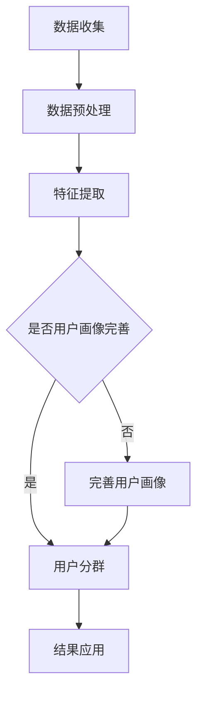

                 

关键词：用户分群、用户画像、数据挖掘、机器学习、个性化推荐、商业策略

> 摘要：本文将探讨如何通过有效的用户分群管理来提高企业的运营效率和用户满意度。我们将详细分析用户分群的核心概念、算法原理、数学模型以及实际应用，并提供代码实例和未来展望。

## 1. 背景介绍

在当今的信息时代，用户数据的重要性不言而喻。无论是互联网企业还是传统行业，通过对用户数据的深度挖掘和有效利用，可以显著提升业务运营效率和用户满意度。用户分群管理作为一种数据分析手段，通过对用户进行分类和标签化处理，帮助企业更好地理解用户需求，优化产品和服务。

用户分群管理不仅仅是简单的用户分类，它涉及到数据挖掘、机器学习、用户画像等多个领域。有效的用户分群可以帮助企业实现精准营销、提高用户留存率、增加转化率等商业目标。

## 2. 核心概念与联系

### 2.1 用户分群定义

用户分群是指根据用户的某些特征（如年龄、性别、地理位置、行为习惯等），将用户群体划分成不同的子群体。每个子群体内部的特征相似，而不同子群体之间的特征差异明显。

### 2.2 用户画像

用户画像是对用户特征的全面描述，通常包括用户的基本信息、兴趣爱好、行为轨迹等。用户画像为用户分群提供了基础数据支持。

### 2.3 数据挖掘与机器学习

数据挖掘和机器学习是用户分群的核心技术手段。通过数据挖掘，我们可以从大量用户数据中提取出有价值的信息。而机器学习算法则能够根据已有数据自动识别用户特征，并进行分群。

### 2.4 Mermaid 流程图

以下是一个简单的用户分群管理的 Mermaid 流程图：



## 3. 核心算法原理 & 具体操作步骤

### 3.1 算法原理概述

用户分群算法主要分为基于规则的分群和基于机器学习的分群。

- **基于规则的分群**：通过预先定义的规则对用户进行分类。这种方法简单易懂，但灵活性较低。
- **基于机器学习的分群**：利用机器学习算法（如K-means、层次聚类等）对用户进行自动分类。这种方法更加灵活，但需要大量数据和计算资源。

### 3.2 算法步骤详解

1. **数据收集**：收集用户的基本信息和行为数据。
2. **数据预处理**：清洗数据，处理缺失值和异常值。
3. **特征提取**：根据业务需求选择特征，并进行特征工程。
4. **模型选择**：选择合适的机器学习算法。
5. **模型训练**：使用训练数据训练模型。
6. **模型评估**：使用测试数据评估模型性能。
7. **分群结果应用**：根据分群结果进行用户画像、个性化推荐等。

### 3.3 算法优缺点

- **基于规则的分群**：优点是简单易懂，缺点是灵活性较低，难以适应复杂多变的业务需求。
- **基于机器学习的分群**：优点是灵活性高，能够适应复杂业务需求，缺点是需要大量数据和计算资源，且算法选择和调参较为复杂。

### 3.4 算法应用领域

用户分群管理广泛应用于电子商务、金融、医疗、教育等多个领域。例如，电子商务平台可以通过用户分群进行精准营销，提高转化率；金融机构可以通过用户分群进行风险评估和个性化服务；医疗机构可以通过用户分群优化医疗服务，提高患者满意度。

## 4. 数学模型和公式

### 4.1 数学模型构建

用户分群通常涉及到聚类算法，其中最常用的算法是K-means。K-means算法的基本思想是将用户数据划分为K个簇，使得同一簇内的用户尽可能相似，不同簇的用户尽可能不同。

### 4.2 公式推导过程

K-means算法的核心是距离度量。常用的距离度量方法有欧几里得距离、曼哈顿距离、切比雪夫距离等。以下以欧几里得距离为例进行推导：

假设有n个用户，每个用户有m个特征。用户i的特征向量为\(x_i \in R^m\)。两个用户i和j之间的欧几里得距离定义为：

\[d(x_i, x_j) = \sqrt{\sum_{k=1}^{m} (x_{ik} - x_{jk})^2}\]

### 4.3 案例分析与讲解

假设我们有一个包含100个用户的数据库，每个用户有3个特征：年龄、收入、购买金额。我们希望使用K-means算法将这100个用户分为3个簇。

1. **初始化**：随机选择3个初始质心。
2. **迭代过程**：
   - 对于每个用户，计算其与3个质心的距离。
   - 将用户分配到距离最近的质心所代表的簇。
   - 重新计算每个簇的质心。
   - 重复步骤2，直到质心不再发生显著变化。

通过上述步骤，我们可以得到三个簇，每个簇内部的用户特征相似，而不同簇之间的特征差异明显。

## 5. 项目实践：代码实例

### 5.1 开发环境搭建

- Python 3.8及以上版本
- Scikit-learn 库

### 5.2 源代码详细实现

```python
import numpy as np
from sklearn.cluster import KMeans
from sklearn.preprocessing import StandardScaler
import pandas as pd

# 加载数据集
data = pd.read_csv('user_data.csv')
X = data.values

# 数据标准化
scaler = StandardScaler()
X_scaled = scaler.fit_transform(X)

# K-means算法初始化
kmeans = KMeans(n_clusters=3, random_state=42)

# 模型训练
kmeans.fit(X_scaled)

# 分群结果
labels = kmeans.predict(X_scaled)

# 输出分群结果
print(labels)
```

### 5.3 代码解读与分析

1. 导入所需的库。
2. 加载数据集，并进行标准化处理。
3. 初始化K-means模型，并设置随机种子以保证结果可重复。
4. 使用训练数据训练模型。
5. 使用模型对数据进行分群，并输出结果。

### 5.4 运行结果展示

运行上述代码后，我们可以得到100个用户的分群结果。通过可视化工具（如matplotlib）可以直观地展示不同簇的用户分布。

```python
import matplotlib.pyplot as plt

# 可视化分群结果
plt.scatter(X_scaled[:, 0], X_scaled[:, 1], c=labels, cmap='viridis')
plt.xlabel('年龄')
plt.ylabel('收入')
plt.title('用户分群结果')
plt.show()
```

## 6. 实际应用场景

### 6.1 电子商务

电子商务平台可以通过用户分群进行精准营销，例如根据用户的购买习惯推荐相关的商品，提高转化率。

### 6.2 金融

金融机构可以通过用户分群进行风险评估，例如根据用户的财务状况和信用记录将其分为高风险和低风险群体，从而制定相应的风控策略。

### 6.3 医疗

医疗机构可以通过用户分群优化医疗服务，例如根据用户的健康状况和病史将其分为不同群体，从而提供个性化的医疗服务。

## 7. 工具和资源推荐

### 7.1 学习资源推荐

- 《用户分群与用户画像：大数据时代的营销策略》
- 《机器学习实战》

### 7.2 开发工具推荐

- Python
- Jupyter Notebook

### 7.3 相关论文推荐

- "User Segmentation in E-commerce using Clustering Algorithms"
- "Customer Segmentation for Personalized Marketing using Machine Learning"

## 8. 总结：未来发展趋势与挑战

### 8.1 研究成果总结

用户分群管理作为大数据和人工智能的重要应用领域，已经取得了显著的研究成果。随着技术的不断进步，用户分群管理将更加精细化、智能化。

### 8.2 未来发展趋势

- 用户分群算法将更加智能化，能够自适应地调整分群策略。
- 用户分群管理将与其他技术（如区块链、物联网等）相结合，实现更广泛的应用。
- 用户分群管理将更加注重用户隐私保护，遵循相关法律法规。

### 8.3 面临的挑战

- 数据质量和数据隐私保护仍是用户分群管理面临的重大挑战。
- 如何平衡分群的灵活性与计算复杂度是一个重要课题。

### 8.4 研究展望

用户分群管理将在未来继续发挥重要作用，成为企业提升竞争力的重要手段。我们期待更多的研究和技术创新，以应对不断变化的业务需求。

## 9. 附录：常见问题与解答

### 9.1 用户分群与用户画像的区别是什么？

用户分群是指将用户划分为不同的子群体，而用户画像是描述用户特征的全面数据。用户分群是用户画像的应用之一。

### 9.2 K-means算法有哪些缺点？

K-means算法的缺点包括：
- 对初始质心的选择敏感，可能导致局部最优解。
- 假设簇内用户密度均匀，无法处理非球形簇。
- 需要提前设定簇的数量，缺乏自动调整机制。

### 9.3 如何提高用户分群的效果？

提高用户分群效果的方法包括：
- 选择合适的特征，进行特征工程。
- 尝试不同的聚类算法，如层次聚类、DBSCAN等。
- 使用交叉验证等方法优化簇的数量。

---

作者：禅与计算机程序设计艺术 / Zen and the Art of Computer Programming
----------------------------------------------------------------

以上就是关于如何进行有效的用户分群管理的完整技术博客文章。这篇文章深入探讨了用户分群管理的核心概念、算法原理、数学模型、实际应用，并通过代码实例进行了详细解释。希望这篇文章能够对您在用户分群管理方面提供有价值的参考。在未来的研究和实践中，我们期待更多关于用户分群管理的技术创新和突破。

