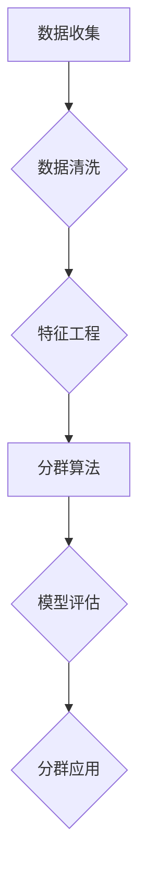

                 

用户分群管理是数据分析和营销中至关重要的一环。在当今高度个性化的数字时代，理解并有效地管理用户群体可以帮助企业更好地满足用户需求、提高客户满意度并最终实现业务增长。本文将深入探讨用户分群管理的核心概念、关键算法、数学模型、实际应用，以及未来的发展趋势和面临的挑战。

## 关键词

- 用户分群
- 数据分析
- 个性化营销
- 算法
- 数学模型
- 业务增长

## 摘要

本文旨在为IT专业人士和数据分析师提供一套系统的用户分群管理指南。首先，我们将回顾用户分群管理的背景和重要性，然后介绍核心概念和架构。接着，我们将探讨用户分群的核心算法，包括原理、步骤、优缺点和应用领域。随后，我们将详细讲解数学模型和公式，并通过具体案例进行分析。文章还将展示代码实例和运行结果，并探讨用户分群的实际应用场景。最后，我们将展望未来的发展趋势，并推荐相关的工具和资源，以帮助读者深入了解这一领域。

### 1. 背景介绍

用户分群管理的起源可以追溯到市场营销的早期阶段，当时商家通过简单的方法将客户分为不同的群体，例如根据年龄、性别或地理位置来制定营销策略。然而，随着大数据和人工智能技术的发展，用户分群管理变得更加复杂和精细。现代用户分群管理不仅考虑传统的人口统计学特征，还结合了用户的在线行为、偏好和反馈数据，实现了更为精准的用户洞察。

用户分群管理的重要性体现在多个方面。首先，它可以帮助企业更好地理解其客户群体，从而制定更为有效的营销策略。通过深入分析用户数据，企业可以发现不同用户群体的共同点和差异，从而实现个性化的营销沟通。其次，用户分群管理有助于提高客户满意度。当企业能够提供符合用户需求的产品和服务时，客户的忠诚度和满意度通常会得到提升。最后，有效的用户分群管理可以显著提升企业的业务增长。通过精准的市场定位和营销活动，企业可以更有效地吸引新客户并留住老客户，从而实现持续的业绩增长。

在实际操作中，用户分群管理通常涉及以下步骤：

1. **数据收集**：收集用户的个人信息、行为数据、交易数据等。
2. **数据清洗**：去除数据中的噪声和不准确信息。
3. **特征工程**：提取用户数据中的关键特征，例如用户活跃度、购买频率、平均消费金额等。
4. **分群算法**：选择合适的算法对用户进行分群，例如K-Means、决策树、聚类分析等。
5. **模型评估**：评估分群模型的准确性、稳定性和有效性。
6. **分群应用**：根据分群结果制定个性化的营销策略。

### 2. 核心概念与联系

#### 2.1. 用户分群的定义

用户分群（Customer Segmentation）是指根据用户的特征和行为，将用户划分为不同的群体。这些群体具有相似的需求、偏好和行为模式，从而便于企业有针对性地制定营销策略。

#### 2.2. 用户分群的目的

- **个性化营销**：针对不同用户群体的特征，制定个性化的产品和服务策略。
- **资源优化**：将有限的资源和预算集中投入到最有价值的用户群体。
- **风险评估**：识别潜在问题和风险，采取相应的预防措施。
- **客户满意度**：提供符合用户期望的产品和服务，提高客户满意度和忠诚度。

#### 2.3. 用户分群的关键要素

- **用户特征**：包括人口统计学特征、行为特征、心理特征等。
- **数据来源**：包括用户调查、社交媒体数据、网站访问数据、交易数据等。
- **分群算法**：包括聚类算法、决策树、神经网络等。
- **模型评估**：包括准确性、稳定性、有效性等。

#### 2.4. 用户分群管理架构


**Mermaid 流程图：**



### 3. 核心算法原理 & 具体操作步骤

#### 3.1. 算法原理概述

用户分群算法主要分为无监督学习和有监督学习两种类型。无监督学习算法，如K-Means、DBSCAN等，通过将相似的数据点归为同一类，从而实现用户分群。有监督学习算法，如决策树、随机森林、神经网络等，则需要使用预先标记的数据来训练模型，从而预测新的用户归属。

#### 3.2. 算法步骤详解

1. **数据收集**：收集用户的个人信息、行为数据、交易数据等。
2. **数据清洗**：去除数据中的噪声和不准确信息。
3. **特征工程**：提取用户数据中的关键特征，如用户活跃度、购买频率、平均消费金额等。
4. **模型选择**：根据数据特点和业务需求选择合适的算法，如K-Means、决策树、神经网络等。
5. **模型训练**：使用训练数据集对模型进行训练。
6. **模型评估**：使用测试数据集评估模型的准确性、稳定性和有效性。
7. **模型应用**：根据模型预测结果对用户进行分群，并制定个性化的营销策略。

#### 3.3. 算法优缺点

- **K-Means**：
  - 优点：简单易用，适用于数据量较大且特征较少的场合。
  - 缺点：对初始聚类中心的敏感度较高，可能导致局部最优解。

- **决策树**：
  - 优点：易于理解和解释，适合处理高维数据。
  - 缺点：可能产生过拟合，对噪声敏感。

- **神经网络**：
  - 优点：强大的非线性处理能力，适用于复杂数据分析。
  - 缺点：计算成本高，对数据质量和特征选择敏感。

#### 3.4. 算法应用领域

用户分群算法广泛应用于市场营销、风险控制、客户服务等多个领域。在市场营销中，企业可以根据用户分群结果制定个性化的营销策略，提升客户满意度和忠诚度。在风险控制中，企业可以通过用户分群识别潜在风险用户，从而采取相应的预防措施。在客户服务中，企业可以根据用户分群提供定制化的服务体验，提高客户满意度。

### 4. 数学模型和公式

#### 4.1. 数学模型构建

用户分群的核心在于构建一个数学模型来描述用户特征和群体之间的关系。常见的数学模型包括基于距离的模型、基于概率的模型和基于决策的模型。

#### 4.2. 公式推导过程

以K-Means算法为例，其数学模型可以通过以下公式描述：

- **目标函数**：

  $$\min_{C_1, C_2, ..., C_k} \sum_{i=1}^n \sum_{j=1}^k d(x_i, c_j)^2$$

  其中，$d(x_i, c_j)$表示用户$x_i$与聚类中心$c_j$之间的距离，$C_1, C_2, ..., C_k$表示$k$个聚类中心。

- **初始化**：

  $$c_j = \frac{1}{n_j} \sum_{i=1}^n x_i$$

  其中，$n_j$表示属于第$j$个聚类的用户数量。

- **迭代过程**：

  1. 计算每个用户与聚类中心的距离。
  2. 将用户分配到最近的聚类中心。
  3. 更新聚类中心的位置。

#### 4.3. 案例分析与讲解

假设我们有一个包含1000个用户的用户数据集，每个用户有3个特征（年龄、收入、消费金额）。我们选择K-Means算法进行用户分群，并假设要划分为3个群组。

1. **数据收集**：从企业数据库中提取用户数据。
2. **数据清洗**：去除无效数据和异常值。
3. **特征工程**：对数据进行归一化处理。
4. **模型初始化**：随机选择3个聚类中心。
5. **模型迭代**：重复执行以下步骤：
   - 计算每个用户与聚类中心的距离。
   - 将用户分配到最近的聚类中心。
   - 更新聚类中心的位置。
6. **模型评估**：计算簇内平均距离，评估分群效果。
7. **模型应用**：根据分群结果，制定个性化的营销策略。

### 5. 项目实践：代码实例和详细解释说明

#### 5.1. 开发环境搭建

- **Python**：Python是一种广泛使用的编程语言，适用于数据分析和机器学习。
- **NumPy**：NumPy是Python的科学计算库，用于处理大型多维数组。
- **pandas**：pandas是Python的数据分析库，用于数据处理和分析。
- **scikit-learn**：scikit-learn是Python的机器学习库，提供了丰富的算法和工具。

#### 5.2. 源代码详细实现

```python
import numpy as np
import pandas as pd
from sklearn.cluster import KMeans
from sklearn.preprocessing import StandardScaler

# 读取用户数据
data = pd.read_csv('user_data.csv')

# 数据清洗
data = data.dropna()

# 特征工程
data = StandardScaler().fit_transform(data)

# 初始化K-Means模型
kmeans = KMeans(n_clusters=3, random_state=0)

# 模型训练
kmeans.fit(data)

# 模型预测
clusters = kmeans.predict(data)

# 模型评估
inertia = kmeans.inertia_

print("Cluster Inertia: ", inertia)

# 模型应用
data['Cluster'] = clusters

# 可视化
import matplotlib.pyplot as plt

plt.scatter(data[:, 0], data[:, 1], c=clusters, cmap='viridis')
plt.show()
```

#### 5.3. 代码解读与分析

1. **数据读取与清洗**：从CSV文件中读取用户数据，并去除无效数据和异常值。
2. **特征工程**：使用StandardScaler对数据进行归一化处理，使不同特征之间具有相似的大小范围。
3. **模型初始化**：使用KMeans类初始化K-Means模型，设置聚类数量为3，随机种子为0以保证结果的可重复性。
4. **模型训练**：使用fit方法对模型进行训练。
5. **模型预测**：使用predict方法对数据进行预测，得到每个用户的聚类结果。
6. **模型评估**：计算簇内平均距离（inertia），评估模型的分群效果。
7. **模型应用**：将聚类结果添加到原始数据中，并使用matplotlib绘制聚类图。

### 6. 实际应用场景

用户分群管理在实际业务中具有广泛的应用。以下是一些典型的应用场景：

- **市场营销**：企业可以根据用户分群结果，为不同群体定制化的营销策略，提高营销效果。
- **客户服务**：企业可以根据用户分群提供个性化的服务体验，提高客户满意度和忠诚度。
- **风险控制**：金融机构可以通过用户分群识别潜在风险用户，采取相应的预防措施。
- **产品推荐**：电商平台可以根据用户分群推荐符合用户兴趣的产品，提高转化率。

### 7. 未来应用展望

随着人工智能和大数据技术的不断发展，用户分群管理将变得更加智能和精准。未来的发展趋势包括：

- **个性化推荐**：基于用户分群进行个性化推荐，提高用户满意度和转化率。
- **自动化分群**：利用自动化机器学习技术，实现实时用户分群和营销策略调整。
- **隐私保护**：在用户分群管理中引入隐私保护技术，确保用户数据的安全和隐私。

### 8. 工具和资源推荐

- **学习资源**：
  - 《机器学习实战》：提供丰富的机器学习算法和实践案例。
  - 《Python数据分析》：介绍Python在数据分析中的应用。
- **开发工具**：
  - Jupyter Notebook：用于数据分析和机器学习实验。
  - PyCharm：集成开发环境，适用于Python编程。
- **相关论文**：
  - "Customer Segmentation Using Clustering Techniques"：介绍用户分群算法。
  - "A Survey on Customer Segmentation in Data Mining"：综述用户分群管理领域的研究进展。

### 9. 总结：未来发展趋势与挑战

用户分群管理在未来将继续发展，面临着以下挑战：

- **数据隐私**：如何保护用户数据隐私，同时实现精准分群。
- **算法优化**：如何提高用户分群算法的准确性和效率。
- **技术融合**：如何将人工智能、大数据等新技术与用户分群管理相结合。

作者：禅与计算机程序设计艺术 / Zen and the Art of Computer Programming
----------------------------------------------------------------

这篇文章系统地介绍了用户分群管理的背景、核心概念、算法原理、数学模型、实际应用以及未来的发展趋势和挑战。通过具体的代码实例和案例分析，读者可以更深入地理解用户分群管理的实践应用。未来的研究将致力于解决数据隐私和算法优化等挑战，以推动用户分群管理的进一步发展。

