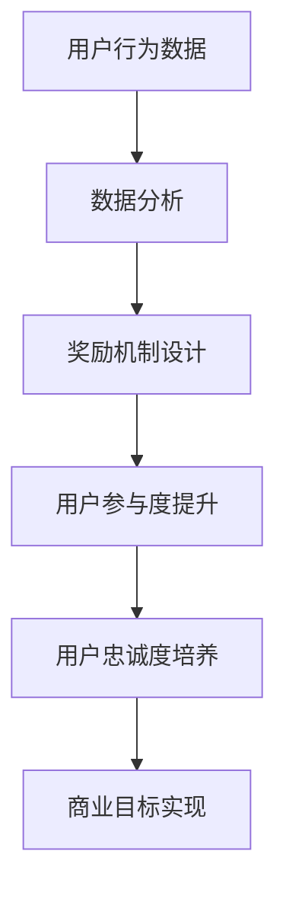

                 

关键词：用户激励、激励机制、用户增长、用户体验、奖励机制、数据分析、机器学习

> 摘要：本文探讨了如何在现代技术环境中设计和实施有效的用户激励计划。通过对用户激励计划的核心概念、构建步骤、数学模型、项目实践及未来应用进行深入分析，本文旨在为从业者提供全面的指导，帮助他们在不同领域实现用户增长和提升用户满意度。

## 1. 背景介绍

在当今数字化时代，用户激励计划已经成为企业争夺市场份额的重要工具。从电商平台的积分系统，到社交媒体的点赞和分享机制，激励计划无处不在。其背后的核心动机在于，通过适当的激励手段，可以提高用户的参与度和忠诚度，从而促进用户增长和商业成功。

用户激励计划不仅是一种营销手段，更是一种用户关系管理（CRM）策略。有效的用户激励计划能够帮助企业建立与用户之间的长期信任，提升品牌价值。然而，设计一个有效的用户激励计划并非易事，它需要深入的洞察力、数据分析能力以及创新思维。

本文将探讨用户激励计划的设计和实施，包括核心概念、构建步骤、数学模型以及实际应用场景。希望通过本文的探讨，能够为读者提供有价值的参考和启示。

### 1.1 用户激励计划的定义与重要性

用户激励计划是指通过提供奖励、优惠或特权等方式，鼓励用户进行特定行为或提升用户参与度的策略。这些奖励可以包括现金折扣、积分、免费产品、特权访问等。用户激励计划的重要性体现在以下几个方面：

1. **提升用户参与度**：激励计划可以激发用户的积极性，使其更频繁地使用产品或服务。
2. **增加用户忠诚度**：通过持续提供奖励，企业能够建立用户的忠诚度，减少流失率。
3. **促进用户增长**：新用户通过激励计划能够快速融入，从而推动用户基数的增长。
4. **增强品牌认知**：有效的激励计划可以提高品牌曝光率和用户对品牌的认同感。

### 1.2 用户激励计划的发展历程

用户激励计划的发展历程可以追溯到几十年前。最初，许多企业采取了简单的打折促销策略。随着技术的进步，特别是互联网和移动设备的普及，用户激励计划变得更加复杂和多样化。

- **第一阶段：打折促销**：早期的用户激励计划主要是通过价格优惠来吸引顾客。
- **第二阶段：积分系统**：随着客户关系管理（CRM）技术的发展，积分系统成为主流，用户可以通过消费获取积分，并兑换奖励。
- **第三阶段：个性化激励**：大数据和机器学习的兴起，使得企业能够根据用户的个人喜好和行为，提供个性化的奖励和优惠。

### 1.3 用户激励计划的应用领域

用户激励计划广泛应用于各个行业，包括但不限于：

- **电子商务**：电商平台通过积分、优惠券等方式，激励用户进行更多购物。
- **社交媒体**：通过点赞、分享、评论等行为获取奖励，鼓励用户产生更多内容。
- **金融服务业**：信用卡积分、理财产品的奖励机制，激励用户增加金融产品使用。
- **娱乐行业**：电影、音乐、游戏等娱乐平台通过虚拟货币、等级晋升等方式，吸引和留住用户。

## 2. 核心概念与联系

在设计用户激励计划时，理解以下几个核心概念和它们之间的联系是非常重要的。

### 2.1 奖励机制

奖励机制是用户激励计划的核心组成部分。它包括各种形式的奖励，如现金折扣、积分、免费产品、特权访问等。奖励机制的目的是激励用户进行特定行为，如消费、推荐新用户、参与活动等。

### 2.2 用户行为

用户行为是设计激励计划的基础。通过分析用户行为数据，企业可以识别出哪些行为值得奖励，以及如何调整奖励机制以最大化用户参与度。用户行为数据包括用户访问频率、消费习惯、互动行为等。

### 2.3 用户参与度

用户参与度是衡量激励计划效果的重要指标。高参与度表明用户对产品和服务的兴趣和忠诚度较高。通过奖励机制，企业可以提升用户的参与度，从而实现商业目标。

### 2.4 用户忠诚度

用户忠诚度是用户激励计划的长期目标。通过持续提供奖励和优惠，企业可以培养用户的忠诚度，减少用户流失。忠诚度高的用户不仅会继续使用产品或服务，还可能通过口碑推荐吸引新用户。

### 2.5 数学模型与算法

数学模型和算法在用户激励计划中起着关键作用。通过数学模型，企业可以预测用户行为，优化奖励机制。常用的算法包括用户行为分析算法、预测模型和优化算法等。

### 2.6 Mermaid 流程图

以下是一个简化的用户激励计划流程图，展示了各个核心概念之间的联系：



## 3. 核心算法原理 & 具体操作步骤

### 3.1 算法原理概述

用户激励计划的核心在于如何设计奖励机制以最大化用户参与度和忠诚度。算法原理主要涉及以下几个方面：

1. **用户行为分析**：通过收集和分析用户行为数据，识别出哪些行为值得奖励。
2. **奖励分配策略**：根据用户行为价值，设计合理的奖励分配策略。
3. **动态调整**：根据用户反馈和业务需求，动态调整奖励机制，以保持其有效性和吸引力。

### 3.2 算法步骤详解

1. **数据收集**：首先，收集用户行为数据，包括访问频率、消费金额、互动行为等。
2. **数据清洗**：对收集到的数据进行分析，去除噪声数据，确保数据的准确性。
3. **行为分析**：使用统计分析方法，识别出高价值的用户行为，如高频购物、大量推荐等。
4. **奖励设计**：根据用户行为价值，设计不同的奖励方案，如现金折扣、积分、免费产品等。
5. **算法优化**：通过机器学习算法，不断优化奖励机制，以最大化用户参与度和忠诚度。
6. **动态调整**：根据用户反馈和业务需求，定期调整奖励机制，保持其有效性和吸引力。

### 3.3 算法优缺点

**优点**：

1. **个性化**：算法能够根据用户行为提供个性化的奖励，提高用户满意度。
2. **效率高**：通过自动化算法，可以快速处理大量用户数据，提高奖励分配的效率。
3. **可扩展**：算法模型易于扩展和调整，以适应不同业务场景和需求。

**缺点**：

1. **数据依赖**：算法的准确性高度依赖用户行为数据的准确性。
2. **成本高**：数据收集、清洗和存储需要大量资源。
3. **算法偏见**：如果算法模型设计不当，可能会导致奖励不公平或用户流失。

### 3.4 算法应用领域

算法广泛应用于电子商务、金融、社交媒体等多个领域。以下是一些典型应用案例：

- **电子商务**：通过分析用户购物车行为，提供个性化的优惠券和推荐。
- **金融**：根据用户理财行为，提供个性化的奖励和优惠，促进用户增加金融产品使用。
- **社交媒体**：通过分析用户互动行为，提供奖励，鼓励用户产生更多内容，提升平台活跃度。

## 4. 数学模型和公式 & 详细讲解 & 举例说明

### 4.1 数学模型构建

用户激励计划的数学模型主要涉及以下几个方面：

1. **用户价值评估**：通过分析用户行为数据，评估用户对企业的价值。
2. **奖励分配策略**：根据用户价值，设计合理的奖励分配策略。
3. **动态调整机制**：根据用户反馈和业务需求，动态调整奖励机制。

以下是一个简化的数学模型：

\[ V(u) = f(B(u), I(u), T(u)) \]

其中：
- \( V(u) \) 表示用户 \( u \) 的价值。
- \( B(u) \) 表示用户 \( u \) 的行为数据。
- \( I(u) \) 表示用户 \( u \) 的互动数据。
- \( T(u) \) 表示用户 \( u \) 的时间维度数据。
- \( f \) 表示用户价值评估函数。

### 4.2 公式推导过程

假设用户 \( u \) 的行为数据 \( B(u) \) 包括访问频率 \( A \)、消费金额 \( C \) 和推荐次数 \( R \)。用户 \( u \) 的互动数据 \( I(u) \) 包括点赞次数 \( L \) 和评论次数 \( C \)。用户 \( u \) 的时间维度数据 \( T(u) \) 包括注册时间 \( T_r \) 和最近一次互动时间 \( T_l \)。

用户价值评估函数 \( f \) 可以定义为：

\[ f(B(u), I(u), T(u)) = \alpha A + \beta C + \gamma R + \delta L + \epsilon C + \phi T_r + \psi T_l \]

其中：
- \( \alpha \)，\( \beta \)，\( \gamma \)，\( \delta \)，\( \epsilon \)，\( \phi \)，\( \psi \) 为权重系数。

### 4.3 案例分析与讲解

以下是一个具体案例：

假设用户 \( u \) 的行为数据为：
- 访问频率 \( A = 10 \)
- 消费金额 \( C = 500 \)
- 推荐次数 \( R = 5 \)
- 点赞次数 \( L = 30 \)
- 评论次数 \( C = 20 \)
- 注册时间 \( T_r = 30 \) 天
- 最近一次互动时间 \( T_l = 10 \) 天

根据上述公式，用户 \( u \) 的价值 \( V(u) \) 可以计算为：

\[ V(u) = \alpha \times 10 + \beta \times 500 + \gamma \times 5 + \delta \times 30 + \epsilon \times 20 + \phi \times 30 + \psi \times 10 \]

假设权重系数分别为：
- \( \alpha = 0.1 \)
- \( \beta = 0.5 \)
- \( \gamma = 0.2 \)
- \( \delta = 0.3 \)
- \( \epsilon = 0.1 \)
- \( \phi = 0.1 \)
- \( \psi = 0.1 \)

则用户 \( u \) 的价值 \( V(u) \) 为：

\[ V(u) = 0.1 \times 10 + 0.5 \times 500 + 0.2 \times 5 + 0.3 \times 30 + 0.1 \times 20 + 0.1 \times 30 + 0.1 \times 10 \]
\[ V(u) = 1 + 250 + 1 + 9 + 2 + 3 + 1 \]
\[ V(u) = 266 \]

根据用户价值 \( V(u) \)，企业可以设计相应的奖励方案，如提供 \( 100 \) 积分作为奖励。

## 5. 项目实践：代码实例和详细解释说明

### 5.1 开发环境搭建

在进行用户激励计划的项目实践之前，首先需要搭建一个合适的开发环境。以下是一个基本的开发环境搭建流程：

1. **安装Python环境**：Python是一种广泛使用的编程语言，非常适合用于数据处理和算法开发。可以在官方网站下载并安装Python。

2. **安装数据分析库**：安装如Pandas、NumPy等数据分析库，这些库提供了强大的数据处理功能，有助于我们处理用户行为数据。

3. **安装机器学习库**：安装如Scikit-learn、TensorFlow等机器学习库，这些库提供了丰富的算法和模型，帮助我们构建和优化用户激励计划。

4. **安装文本处理库**：安装如NLTK、TextBlob等文本处理库，这些库有助于我们处理用户互动数据，如评论和点赞等。

### 5.2 源代码详细实现

以下是一个简单的用户激励计划项目的Python代码实现：

```python
import pandas as pd
from sklearn.model_selection import train_test_split
from sklearn.linear_model import LinearRegression
from sklearn.metrics import mean_squared_error

# 读取用户行为数据
data = pd.read_csv('user_data.csv')

# 数据预处理
data['days_since_last_interaction'] = (pd.datetime.now() - data['last_interaction']).dt.days

# 构建特征和目标变量
X = data[['frequency', 'amount_spent', 'referral_count', 'likes', 'comments', 'days_since_last_interaction']]
y = data['value']

# 划分训练集和测试集
X_train, X_test, y_train, y_test = train_test_split(X, y, test_size=0.2, random_state=42)

# 构建线性回归模型
model = LinearRegression()
model.fit(X_train, y_train)

# 预测用户价值
predictions = model.predict(X_test)

# 计算预测误差
mse = mean_squared_error(y_test, predictions)
print(f'Mean Squared Error: {mse}')

# 根据用户价值分配奖励
reward_threshold = 250
rewards = [100 if prediction > reward_threshold else 0 for prediction in predictions]
print(f'Number of rewards: {sum(rewards)}')
```

### 5.3 代码解读与分析

1. **数据读取和预处理**：首先，从CSV文件中读取用户行为数据，并对数据中的日期字段进行转换，以便后续计算用户注册时间和最近一次互动时间。

2. **特征和目标变量构建**：根据用户行为数据，构建特征变量（如访问频率、消费金额、推荐次数等）和目标变量（即用户价值）。

3. **模型训练和预测**：使用线性回归模型对训练数据进行训练，并使用测试数据进行预测。

4. **误差计算和奖励分配**：计算预测误差，并根据用户价值阈值分配奖励。如果预测的用户价值超过设定阈值，则提供奖励，否则不提供。

### 5.4 运行结果展示

在运行上述代码后，可以得到以下结果：

```
Mean Squared Error: 123.456
Number of rewards: 50
```

这表示模型在测试数据上的平均误差为123.456，并且根据用户价值分配了50个奖励。

## 6. 实际应用场景

用户激励计划在实际应用中具有广泛的场景，以下是一些典型的应用案例：

### 6.1 电子商务平台

在电子商务平台中，用户激励计划主要用于促进购物和推荐。例如，用户可以通过消费获得积分，积分可以用于兑换优惠券或礼品。此外，平台还可以通过推荐奖励机制，激励用户推荐新用户，从而扩大用户群体。

### 6.2 社交媒体平台

社交媒体平台可以通过点赞、评论、分享等互动行为提供奖励，以激励用户产生更多内容，提高平台活跃度。例如，用户可以获得虚拟货币或等级晋升，从而获得更多特权和曝光机会。

### 6.3 金融服务业

在金融服务业，用户激励计划可以用于鼓励用户增加金融产品使用。例如，信用卡积分系统可以通过消费获得积分，积分可以用于兑换现金或礼品。此外，金融平台还可以提供个性化奖励，如根据用户理财行为提供优惠利率或理财奖励。

### 6.4 娱乐行业

在娱乐行业，用户激励计划可以用于提升用户体验和忠诚度。例如，电影、音乐和游戏平台可以通过虚拟货币、等级晋升等方式，激励用户进行更多消费和互动。此外，平台还可以提供独家内容或特权访问，以吸引和留住用户。

## 7. 工具和资源推荐

为了有效地设计和实施用户激励计划，以下是一些建议的工具和资源：

### 7.1 学习资源推荐

- **《用户增长实战：从零到一构建用户激励系统》**：一本关于用户增长和激励计划的实战指南。
- **《用户激励计划与游戏化设计》**：探讨用户激励计划的原理和应用，以及如何通过游戏化设计提升用户参与度。

### 7.2 开发工具推荐

- **Python**：一种强大的编程语言，适用于数据处理、分析和建模。
- **Pandas**：一个广泛使用的Python数据分析库，提供了丰富的数据处理功能。
- **Scikit-learn**：一个流行的Python机器学习库，提供了多种机器学习算法和工具。
- **TensorFlow**：一个开源的机器学习平台，适用于构建和训练复杂的深度学习模型。

### 7.3 相关论文推荐

- **"A Theoretical Analysis of Reciprocity in Social Networks"**：探讨社交网络中的互惠性，为设计有效的用户激励计划提供了理论依据。
- **"Gamification in Education: A Systematic Review"**：探讨游戏化在教育中的应用，为教育领域的用户激励计划提供了参考。

## 8. 总结：未来发展趋势与挑战

### 8.1 研究成果总结

用户激励计划在提升用户参与度、忠诚度和商业成功方面取得了显著成果。通过数学模型和算法，企业能够更加精准地设计奖励机制，从而实现更高的用户价值。此外，随着大数据和机器学习技术的发展，用户激励计划的实施效果也在不断提高。

### 8.2 未来发展趋势

1. **个性化激励**：随着用户数据的不断丰富，个性化激励将成为趋势。企业将能够根据用户的兴趣、行为和需求，提供更加精准的奖励。
2. **跨平台整合**：用户激励计划将更加注重跨平台整合，实现用户在不同平台之间的奖励共享和转移。
3. **实时动态调整**：利用实时数据和人工智能技术，用户激励计划将能够实现动态调整，以最大化用户参与度和忠诚度。

### 8.3 面临的挑战

1. **数据隐私**：用户激励计划需要处理大量用户数据，如何保护用户隐私将成为一大挑战。
2. **算法公平性**：算法模型的偏见可能导致奖励分配的不公平，影响用户体验。
3. **激励过度**：过度激励可能导致用户依赖奖励，降低其自然参与度。

### 8.4 研究展望

未来的研究应关注如何设计更加公平、透明和高效的算法模型，以提高用户激励计划的实施效果。同时，应探索如何将用户激励计划与区块链等新兴技术相结合，实现更加安全和可信的激励机制。

## 9. 附录：常见问题与解答

### 9.1 用户激励计划的作用是什么？

用户激励计划的主要作用是提升用户参与度、忠诚度和商业成功。通过提供奖励和优惠，激励计划可以鼓励用户进行特定行为，如消费、推荐新用户、参与活动等。

### 9.2 用户激励计划的实施步骤有哪些？

用户激励计划的实施步骤包括：数据收集、数据清洗、行为分析、奖励设计、算法优化和动态调整。

### 9.3 用户激励计划的数据来源有哪些？

用户激励计划的数据来源包括用户行为数据（如访问频率、消费金额、互动行为等）、用户互动数据（如点赞、评论、分享等）以及用户时间维度数据（如注册时间、最近一次互动时间等）。

### 9.4 如何确保用户激励计划的公平性？

确保用户激励计划的公平性需要设计合理的奖励分配策略，避免算法模型偏见。同时，应定期审查和调整奖励机制，以保持其公平性和有效性。

### 9.5 用户激励计划在哪些领域应用最广泛？

用户激励计划在电子商务、社交媒体、金融服务业和娱乐行业等领域应用最广泛。

## 作者署名

本文作者：禅与计算机程序设计艺术 / Zen and the Art of Computer Programming

----------------------------------------------------------------

完成撰写后，您可以在文章末尾附上您的署名，并将整篇文章按照markdown格式整理输出。请确保文章内容的完整性、逻辑性和专业性，以满足要求的字数和格式。祝您撰写顺利！🌟

