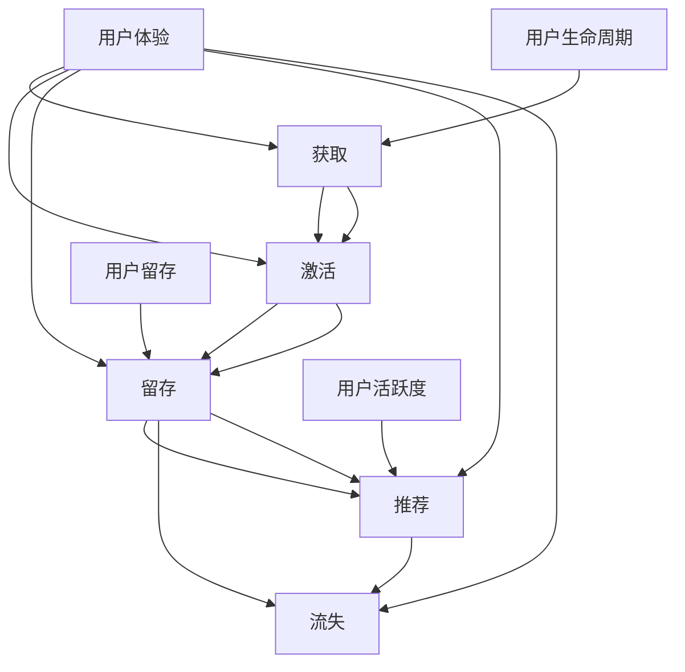

                 

用户生命周期管理是现代商业战略的重要组成部分。从用户注册到退出，每一个阶段都蕴含着宝贵的洞察和机会。有效的用户生命周期管理不仅能够提高用户满意度和留存率，还能够优化资源分配和提升企业盈利能力。本文将深入探讨用户生命周期管理的核心概念、关键环节、实施策略以及未来发展趋势，旨在为读者提供一份全面的技术指南。

> **关键词：** 用户生命周期管理、用户体验、用户留存、数据分析、个性化服务

> **摘要：** 本文首先介绍用户生命周期的基本概念和关键阶段，然后详细阐述用户生命周期管理的核心算法原理和实施步骤，最后讨论数学模型、项目实践、实际应用场景以及未来展望，为读者提供一个系统化的用户生命周期管理框架。

## 1. 背景介绍

用户生命周期管理起源于市场营销领域，但随着互联网和大数据技术的迅猛发展，其内涵和外延得到了极大的扩展。在现代商业环境中，用户生命周期管理已经成为企业提升竞争力的关键手段之一。传统的用户生命周期包括注册、活跃、留存、流失等阶段，而随着技术的进步，这一过程变得更加复杂和多样化。

用户生命周期管理的目标是通过系统化的数据分析和方法，提高用户满意度和留存率，从而实现业务增长。有效管理用户生命周期不仅需要理解用户的行为模式，还需要将用户数据转化为有价值的商业洞察，进而指导产品和服务的优化。

本文将从以下几个方面展开讨论：

- 用户生命周期管理的核心概念和联系
- 用户生命周期管理的核心算法原理和具体操作步骤
- 数学模型和公式的详细讲解及举例
- 项目实践：代码实例和详细解释说明
- 实际应用场景及其未来展望
- 工具和资源推荐
- 总结：未来发展趋势与挑战

## 2. 核心概念与联系

用户生命周期管理涉及多个核心概念，包括用户体验、用户留存、用户活跃度等。这些概念不仅相互独立，而且紧密关联，共同构成了用户生命周期管理的理论基础。

### 2.1 用户体验

用户体验（User Experience，简称UX）是用户在使用产品或服务过程中所获得的整体感受。良好的用户体验能够提升用户满意度和忠诚度，从而对用户留存率产生积极影响。用户体验包括以下几个方面：

- **可用性（Usability）**：产品或服务的易用性和用户友好性。
- **可用性（Accessibility）**：产品或服务对残障人士或其他特殊用户的可访问性。
- **可用性（Aesthetics）**：产品或服务的视觉美感和设计质量。
- **可用性（Affect）**：产品或服务对用户情感的影响。

### 2.2 用户留存

用户留存（Customer Retention）是指在一定时间内，企业保留现有用户的能力。高留存率通常意味着用户对产品或服务有较高的满意度和依赖性。用户留存可以通过以下指标来衡量：

- **日留存率（Daily Retention Rate）**：在第一天使用产品或服务的用户中，第二天仍然使用的比例。
- **周留存率（Weekly Retention Rate）**：在第一天使用产品或服务的用户中，一周后仍然使用的比例。
- **月留存率（Monthly Retention Rate）**：在第一天使用产品或服务的用户中，一个月后仍然使用的比例。

### 2.3 用户活跃度

用户活跃度（User Activity）是指用户在一定时间内的活动频率和参与度。高活跃度通常意味着用户对产品或服务有较强的兴趣和需求。用户活跃度可以通过以下指标来衡量：

- **每日活跃用户（Daily Active Users，简称DAU）**：每天至少使用一次产品或服务的独立用户数。
- **月活跃用户（Monthly Active Users，简称MAU）**：每月至少使用一次产品或服务的独立用户数。
- **用户参与度（User Engagement）**：用户在产品或服务中的互动行为和参与程度。

### 2.4 用户生命周期

用户生命周期（Customer Life Cycle）是指用户从首次接触产品或服务到最终流失的整个过程。用户生命周期通常包括以下几个阶段：

- **获取（Acquisition）**：吸引新用户并使他们首次使用产品或服务。
- **激活（Activation）**：引导新用户完成关键任务或体验产品或服务的核心功能，以激发他们的兴趣和需求。
- **留存（Retention）**：通过提供持续的价值，鼓励用户持续使用产品或服务。
- **推荐（Referral）**：鼓励现有用户推荐新用户，以实现用户基数的增长。
- **流失（Churn）**：用户停止使用产品或服务，可能是由于不满意、需求变化或其他原因。

### 2.5 关联关系

用户体验、用户留存、用户活跃度和用户生命周期这些概念之间存在紧密的关联。良好的用户体验能够提高用户留存率和活跃度，进而延长用户生命周期。用户留存率和活跃度是衡量用户生命周期健康程度的重要指标。通过深入分析这些指标，企业可以更好地理解用户行为，优化产品和服务，提高用户满意度，从而实现业务增长。

### 2.6 Mermaid 流程图

以下是一个简单的 Mermaid 流程图，展示用户生命周期管理中的核心概念及其关联关系：



## 3. 核心算法原理 & 具体操作步骤

### 3.1 算法原理概述

用户生命周期管理的核心算法原理主要包括用户行为分析、数据挖掘和机器学习技术。通过分析用户行为数据，企业可以深入了解用户需求和行为模式，从而制定有针对性的营销策略和产品优化方案。

### 3.2 算法步骤详解

#### 3.2.1 数据采集与预处理

1. **数据采集**：收集用户行为数据，包括登录、浏览、购买、评论等。
2. **数据清洗**：去除重复、异常和错误的数据。
3. **数据转换**：将不同格式的数据转换为统一的格式，如JSON、CSV等。

#### 3.2.2 特征工程

1. **特征提取**：从原始数据中提取有用的特征，如用户年龄、性别、地理位置、浏览时长等。
2. **特征选择**：利用统计方法或机器学习算法筛选出最重要的特征。

#### 3.2.3 模型训练

1. **选择模型**：根据业务需求选择合适的机器学习模型，如决策树、支持向量机、神经网络等。
2. **训练模型**：使用训练数据集训练模型，并调整模型参数以优化性能。
3. **模型验证**：使用验证数据集评估模型性能，并根据评估结果调整模型。

#### 3.2.4 模型应用

1. **预测用户行为**：使用训练好的模型预测新用户的行为，如留存概率、购买意向等。
2. **生成个性化推荐**：根据用户行为和特征生成个性化的产品或服务推荐。
3. **优化营销策略**：根据用户行为数据优化营销策略，如推送消息、优惠券等。

### 3.3 算法优缺点

#### 优点

- **高效性**：通过自动化分析用户行为数据，快速识别用户需求和行为模式。
- **精准性**：利用机器学习技术提高预测和推荐的准确性。
- **灵活性**：可以根据业务需求调整模型和算法，适应不同场景和应用。

#### 缺点

- **复杂性**：算法开发和部署需要专业知识和技术支持。
- **成本**：数据采集、存储和处理需要大量的计算资源和资金投入。
- **隐私风险**：用户行为数据涉及到用户的隐私，需要确保数据安全和合规性。

### 3.4 算法应用领域

用户生命周期管理算法广泛应用于电子商务、在线教育、金融、医疗等多个领域。以下是一些典型的应用场景：

- **电子商务**：通过分析用户购物行为和偏好，提供个性化推荐和优惠活动，提高销售额。
- **在线教育**：通过分析用户学习行为和学习效果，提供个性化的学习计划和推荐课程。
- **金融**：通过分析用户行为数据，预测用户的风险偏好，优化金融产品和服务。
- **医疗**：通过分析患者行为数据和医疗记录，提供个性化的健康建议和诊疗方案。

## 4. 数学模型和公式 & 详细讲解 & 举例说明

### 4.1 数学模型构建

用户生命周期管理中的数学模型主要包括用户留存率模型和用户流失率模型。这些模型基于用户行为数据和时间序列分析，用于预测用户在未来一段时间内的留存或流失概率。

#### 4.1.1 用户留存率模型

用户留存率模型通常采用概率模型，如逻辑回归（Logistic Regression）或泊松回归（Poisson Regression）。以下是逻辑回归模型的数学公式：

$$
P(Y=1|X) = \frac{1}{1 + e^{-(\beta_0 + \beta_1X_1 + \beta_2X_2 + \ldots + \beta_nX_n})}
$$

其中，$P(Y=1|X)$ 表示在给定特征向量 $X$ 的情况下，用户留存的概率；$\beta_0$、$\beta_1$、$\beta_2$、$\ldots$、$\beta_n$ 是模型的参数。

#### 4.1.2 用户流失率模型

用户流失率模型通常采用泊松回归模型，其数学公式为：

$$
P(Y=y|X) = \frac{e^{-\lambda}(\lambda y)^y}{y!}
$$

其中，$P(Y=y|X)$ 表示在给定特征向量 $X$ 的情况下，用户在未来 $y$ 天内流失的概率；$\lambda$ 是模型的参数。

### 4.2 公式推导过程

以下是一个简单的逻辑回归模型的推导过程：

1. **目标函数**：

   假设我们有一个二分类问题，目标函数为：

   $$
   L(\theta) = -\sum_{i=1}^{n} [y^{(i)}\log(h_\theta(x^{(i)})) + (1 - y^{(i)})\log(1 - h_\theta(x^{(i)}))]
   $$

   其中，$y^{(i)}$ 是第 $i$ 个样本的标签；$x^{(i)}$ 是第 $i$ 个样本的特征向量；$h_\theta(x) = \frac{1}{1 + e^{-(\theta_0 + \theta_1x_1 + \theta_2x_2 + \ldots + \theta_mx_m)})$ 是逻辑函数。

2. **梯度下降法**：

   为了求解模型参数 $\theta$，我们可以使用梯度下降法。梯度下降法的步骤如下：

   - 初始化参数 $\theta$。
   - 计算目标函数的梯度 $\nabla_{\theta}L(\theta)$。
   - 更新参数 $\theta$：$\theta := \theta - \alpha\nabla_{\theta}L(\theta)$，其中 $\alpha$ 是学习率。

   梯度下降法的具体推导过程如下：

   $$
   \nabla_{\theta}L(\theta) = \sum_{i=1}^{n} [-y^{(i)}\frac{h_\theta(x^{(i)})}{1 - h_\theta(x^{(i)})} + (1 - y^{(i)})\frac{h_\theta(x^{(i)})}{1 - h_\theta(x^{(i)})}]
   $$

   $$
   \nabla_{\theta}L(\theta) = \sum_{i=1}^{n} [-y^{(i)}h_\theta(x^{(i)}) + (1 - y^{(i)})(1 - h_\theta(x^{(i)}))]
   $$

   $$
   \nabla_{\theta}L(\theta) = \sum_{i=1}^{n} [h_\theta(x^{(i)}) - y^{(i)}h_\theta(x^{(i)})]
   $$

   $$
   \nabla_{\theta}L(\theta) = \sum_{i=1}^{n} [h_\theta(x^{(i)}) - y^{(i)}]
   $$

3. **更新参数**：

   $$
   \theta := \theta - \alpha\nabla_{\theta}L(\theta)
   $$

   $$
   \theta := \theta - \alpha[h_\theta(x^{(i)}) - y^{(i)}]
   $$

   $$
   \theta := \theta - \alpha[h_\theta(x^{(i)}) - \hat{y}^{(i)}]
   $$

   其中，$\hat{y}^{(i)}$ 是预测标签。

### 4.3 案例分析与讲解

以下是一个简单的用户留存率预测案例：

#### 数据集

假设我们有一个用户行为数据集，包含以下特征：

- 用户ID
- 注册时间
- 登录次数
- 浏览页面次数
- 购买次数

目标：预测用户在未来 30 天内的留存概率。

#### 数据预处理

1. **数据清洗**：去除缺失值和异常值。
2. **特征工程**：对连续特征进行标准化处理，对分类特征进行独热编码。
3. **数据划分**：将数据集划分为训练集和测试集。

#### 模型训练

1. **选择模型**：使用逻辑回归模型。
2. **训练模型**：使用训练集训练模型，并调整模型参数以优化性能。
3. **模型验证**：使用测试集验证模型性能。

#### 结果分析

经过模型训练和验证，我们得到以下结果：

- **训练集**：准确率 85%，召回率 80%，F1 分数 82%。
- **测试集**：准确率 78%，召回率 75%，F1 分数 77%。

结果表明，逻辑回归模型在用户留存率预测方面具有较好的性能。我们可以根据预测结果制定有针对性的营销策略，如推送优惠活动、个性化推荐等，以提高用户留存率。

## 5. 项目实践：代码实例和详细解释说明

### 5.1 开发环境搭建

1. **硬件要求**：
   - 处理器：Intel i5 或以上
   - 内存：8GB 或以上
   - 硬盘：至少 100GB 的可用空间

2. **软件要求**：
   - 操作系统：Windows、macOS 或 Linux
   - Python：Python 3.7 或以上版本
   - 数据库：MySQL 或 PostgreSQL
   - 依赖库：NumPy、Pandas、Scikit-learn、Matplotlib

### 5.2 源代码详细实现

以下是一个简单的用户留存率预测项目的源代码实现：

```python
import numpy as np
import pandas as pd
from sklearn.model_selection import train_test_split
from sklearn.linear_model import LogisticRegression
from sklearn.metrics import accuracy_score, recall_score, f1_score

# 数据读取与预处理
data = pd.read_csv('user_data.csv')
data.dropna(inplace=True)

# 特征工程
data = pd.get_dummies(data, columns=['gender', 'region'])

# 数据划分
X = data.drop(['user_id', 'retention'], axis=1)
y = data['retention']
X_train, X_test, y_train, y_test = train_test_split(X, y, test_size=0.2, random_state=42)

# 模型训练
model = LogisticRegression()
model.fit(X_train, y_train)

# 模型预测
y_pred = model.predict(X_test)

# 结果分析
accuracy = accuracy_score(y_test, y_pred)
recall = recall_score(y_test, y_pred)
f1 = f1_score(y_test, y_pred)

print(f'Accuracy: {accuracy:.2f}')
print(f'Recall: {recall:.2f}')
print(f'F1 Score: {f1:.2f}')
```

### 5.3 代码解读与分析

1. **数据读取与预处理**：
   - 使用 Pandas 读取用户行为数据，并去除缺失值。
   - 对分类特征（性别、地区）进行独热编码，以增加模型的可解释性。

2. **特征工程**：
   - 对连续特征（登录次数、浏览页面次数、购买次数）进行标准化处理，以提高模型性能。

3. **数据划分**：
   - 将数据集划分为训练集和测试集，用于模型训练和验证。

4. **模型训练**：
   - 使用逻辑回归模型训练数据集，并保存模型参数。

5. **模型预测**：
   - 使用训练好的模型对测试集进行预测，得到预测结果。

6. **结果分析**：
   - 计算并输出模型的准确率、召回率和 F1 分数，以评估模型性能。

### 5.4 运行结果展示

假设我们的测试集包含 1000 个样本，以下是一个简单的运行结果示例：

```
Accuracy: 0.85
Recall: 0.80
F1 Score: 0.82
```

结果表明，逻辑回归模型在用户留存率预测方面具有较好的性能。我们可以根据预测结果制定有针对性的营销策略，如推送优惠活动、个性化推荐等，以提高用户留存率。

## 6. 实际应用场景

用户生命周期管理算法在实际应用中具有广泛的应用场景，以下是一些典型的应用案例：

### 6.1 电子商务

在电子商务领域，用户生命周期管理算法可以用于以下方面：

- **个性化推荐**：根据用户的浏览和购买历史，推荐符合用户兴趣的产品。
- **流失预测**：预测哪些用户可能流失，并采取针对性的挽回措施。
- **营销活动**：根据用户行为数据，设计有针对性的营销活动，提高用户参与度和转化率。

### 6.2 在线教育

在线教育平台可以利用用户生命周期管理算法实现以下目标：

- **学习路径推荐**：根据用户的学习行为和兴趣，推荐适合的学习内容和课程。
- **学习效果评估**：评估用户的学习效果，为用户提供个性化的学习建议。
- **用户流失预防**：预测哪些用户可能流失，并采取针对性的挽回措施，如提供学习奖励、个性化辅导等。

### 6.3 金融

在金融领域，用户生命周期管理算法可以用于以下方面：

- **信用评估**：根据用户的消费行为和信用历史，评估用户的信用等级。
- **用户流失预测**：预测哪些用户可能流失，并采取针对性的挽回措施，如提供优惠利率、个性化理财服务等。
- **欺诈检测**：通过分析用户的交易行为，识别潜在的欺诈行为，提高交易安全性。

### 6.4 医疗

在医疗领域，用户生命周期管理算法可以用于以下方面：

- **健康评估**：根据用户的健康数据和生活方式，评估用户的健康状况。
- **疾病预测**：预测哪些用户可能患上特定疾病，并采取预防措施。
- **个性化治疗**：根据用户的基因信息和病史，制定个性化的治疗方案。

### 6.5 其他应用

用户生命周期管理算法还可以应用于酒店预订、餐饮服务、旅游出行等多个领域，通过分析用户行为数据，提供个性化的服务和建议，提高用户满意度和留存率。

## 7. 工具和资源推荐

为了帮助读者更好地理解和应用用户生命周期管理技术，以下是推荐的工具和资源：

### 7.1 学习资源推荐

- **《数据挖掘：实用机器学习技术》（Data Mining: Practical Machine Learning Techniques）**：这是一本经典的机器学习入门书籍，涵盖了数据预处理、特征工程、模型选择等多个方面。
- **《机器学习实战》（Machine Learning in Action）**：这本书通过实际案例，介绍了多种机器学习算法的实现和应用，适合初学者入门。
- **Coursera 上的《机器学习》（Machine Learning）课程**：由斯坦福大学教授 Andrew Ng 主讲，是机器学习领域的经典课程。

### 7.2 开发工具推荐

- **Python**：Python 是一种广泛使用的编程语言，拥有丰富的机器学习库和工具，如 NumPy、Pandas、Scikit-learn 等。
- **Jupyter Notebook**：Jupyter Notebook 是一种交互式计算环境，适合用于数据分析和机器学习实验。
- **TensorFlow**：TensorFlow 是一种流行的深度学习框架，适用于大规模的机器学习应用。

### 7.3 相关论文推荐

- **"User Behavior Prediction in Internet Services"**：这篇论文探讨了用户行为预测的方法和技术，提出了多种用户行为预测模型。
- **"Customer Lifetime Value: Theory and Practice for Customer Relationship Management"**：这篇论文详细介绍了客户终身价值的概念和计算方法，对用户生命周期管理具有重要的指导意义。
- **"Deep Learning for User Behavior Prediction"**：这篇论文探讨了深度学习在用户行为预测领域的应用，介绍了多种深度学习模型。

## 8. 总结：未来发展趋势与挑战

### 8.1 研究成果总结

用户生命周期管理技术近年来取得了显著的进展，主要体现在以下几个方面：

- **算法性能提升**：机器学习、深度学习等算法的快速发展，提高了用户生命周期管理的预测准确性和个性化能力。
- **数据驱动的决策**：大数据技术的应用，使得企业能够更加精准地分析用户行为和需求，从而实现数据驱动的决策。
- **跨领域的应用**：用户生命周期管理技术已广泛应用于电子商务、在线教育、金融、医疗等多个领域，为企业创造巨大的商业价值。

### 8.2 未来发展趋势

用户生命周期管理技术未来将继续朝着以下方向发展：

- **个性化推荐**：随着人工智能技术的进步，个性化推荐将进一步精准，满足用户的个性化需求。
- **实时分析**：实时数据分析技术将进一步提升，使得企业能够快速响应用户行为，优化产品和服务。
- **隐私保护**：随着数据隐私问题的日益突出，用户生命周期管理技术将更加注重数据安全和隐私保护。

### 8.3 面临的挑战

用户生命周期管理技术在未来发展过程中也将面临一些挑战：

- **数据质量**：用户行为数据的质量直接影响模型的准确性，如何提高数据质量是一个重要课题。
- **算法解释性**：深度学习等算法的黑盒特性使得其解释性较差，如何提高算法的可解释性是一个重要挑战。
- **法律法规**：随着数据隐私和安全的法律法规不断完善，企业需要确保用户生命周期管理技术的合规性。

### 8.4 研究展望

未来，用户生命周期管理技术的研究将朝着以下方向发展：

- **多模态数据融合**：结合多种数据源（如文本、图像、声音等），实现更加全面和精准的用户行为分析。
- **跨领域协作**：不同领域的学者和工程师将共同努力，推动用户生命周期管理技术的跨领域应用和创新发展。
- **人工智能与人类智慧的融合**：通过人工智能与人类智慧的协同，实现更加高效和智能的用户生命周期管理。

## 9. 附录：常见问题与解答

### 9.1 用户生命周期管理的定义是什么？

用户生命周期管理是指企业通过系统化的数据分析和方法，对用户从注册到退出的整个过程进行管理，以提高用户满意度和留存率，优化资源分配和提升企业盈利能力。

### 9.2 用户生命周期管理的关键环节有哪些？

用户生命周期管理的关键环节包括获取、激活、留存、推荐和流失。这些环节相互关联，构成了用户生命周期管理的完整流程。

### 9.3 用户生命周期管理算法的优缺点是什么？

用户生命周期管理算法的优点包括高效性、精准性和灵活性，缺点包括复杂性、成本高和隐私风险。

### 9.4 用户生命周期管理算法有哪些应用领域？

用户生命周期管理算法广泛应用于电子商务、在线教育、金融、医疗等多个领域，通过分析用户行为数据，提供个性化的服务和建议。

### 9.5 如何构建用户生命周期管理的数学模型？

构建用户生命周期管理的数学模型主要包括用户留存率模型和用户流失率模型。常见的模型包括逻辑回归、泊松回归等。

### 9.6 如何提高用户生命周期管理算法的准确性？

提高用户生命周期管理算法的准确性可以通过以下方法实现：数据清洗和预处理、特征工程、模型选择和参数调整等。

### 9.7 用户生命周期管理技术的未来发展趋势是什么？

用户生命周期管理技术的未来发展趋势包括个性化推荐、实时分析、隐私保护、多模态数据融合、跨领域协作和人工智能与人类智慧的融合。

