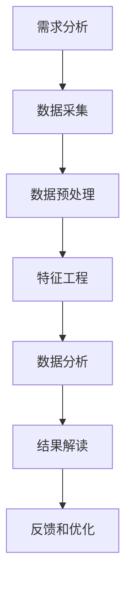

                 

### 1. 背景介绍

在数字时代，用户行为分析已经成为企业和组织了解用户需求、优化产品和服务的重要工具。随着互联网的普及和大数据技术的进步，越来越多的企业开始关注用户行为数据，并通过分析这些数据来发现用户偏好、预测用户行为，从而实现个性化的服务和精准的营销。

用户行为分析不仅可以帮助企业了解用户的实际使用情况，还能通过数据挖掘和机器学习等技术手段预测未来的趋势和需求。这种分析不仅限于电子商务和社交媒体，还广泛应用于金融、医疗、教育等多个领域。

然而，进行有效的用户行为分析并非易事。数据量大、维度多、实时性强等特点使得用户行为分析面临诸多挑战。如何在海量的数据中提取有价值的信息，如何准确地理解和预测用户行为，这些都是用户行为分析中需要解决的关键问题。

本文将围绕如何进行有效的用户行为分析展开讨论。首先，我们将介绍用户行为分析的核心概念和架构，然后深入探讨用户行为分析的核心算法原理和具体操作步骤，并结合实际案例进行分析和解释。接下来，我们将介绍用户行为分析的数学模型和公式，并通过具体案例进行详细讲解。文章还将包含一个完整的代码实例和详细解释说明，最后，我们将探讨用户行为分析的实际应用场景和未来发展趋势。

通过本文的阅读，读者将能够全面了解用户行为分析的方法、技术和应用，从而为实际工作提供有价值的参考和指导。

### 2. 核心概念与联系

#### 2.1 用户行为分析的定义

用户行为分析是指通过收集、处理和分析用户在互联网上的行为数据，以了解用户需求、行为模式和使用习惯的过程。用户行为分析的核心目的是从数据中提取有价值的信息，帮助企业做出更加精准的决策。

#### 2.2 用户行为数据的类型

用户行为数据可以分为结构化和非结构化两种类型：

- **结构化数据**：包括用户的基本信息、购买记录、浏览历史等可以直接量化和存储的数据。例如，用户年龄、性别、购买商品种类、浏览网页时长等。
- **非结构化数据**：包括用户在社交媒体上的发言、评论、搜索关键词等无法直接量化和存储的数据。例如，用户发表的文章、评论、聊天记录等。

#### 2.3 用户行为分析的目标

用户行为分析的目标主要包括以下几个方面：

- **了解用户需求**：通过分析用户行为，了解用户对产品或服务的需求和偏好，从而优化产品设计和功能。
- **提升用户体验**：通过分析用户行为数据，发现用户在使用过程中遇到的问题，从而提升用户满意度和忠诚度。
- **实现个性化推荐**：根据用户行为数据，为用户提供个性化的推荐，提高用户参与度和转化率。
- **预测未来趋势**：通过分析历史数据，预测用户未来的行为趋势，为企业决策提供支持。

#### 2.4 用户行为分析的基本架构

用户行为分析的基本架构通常包括以下几个关键组成部分：

1. **数据采集**：通过各种手段（如日志、API、传感器等）收集用户行为数据。
2. **数据存储**：将收集到的数据存储在数据库或数据仓库中，以便后续处理和分析。
3. **数据处理**：对存储的数据进行清洗、转换和集成，以确保数据的质量和一致性。
4. **数据可视化**：通过图表、报表等形式将分析结果可视化，帮助用户理解数据。
5. **数据分析**：使用统计方法、机器学习等技术对数据进行分析，提取有价值的信息。
6. **决策支持**：根据分析结果，为企业提供决策支持，优化产品和服务。

#### 2.5 用户行为分析的流程

用户行为分析的流程通常包括以下几个步骤：

1. **需求分析**：明确分析的目标和需求，确定需要分析的用户行为类型和数据来源。
2. **数据采集**：根据需求收集用户行为数据。
3. **数据预处理**：对采集到的数据进行清洗、转换和集成，确保数据的质量。
4. **特征工程**：提取数据中的特征，为后续的分析做准备。
5. **数据分析**：使用统计方法、机器学习等技术对数据进行分析，提取有价值的信息。
6. **结果解读**：根据分析结果，解读用户行为模式，为企业提供决策支持。
7. **反馈和优化**：根据分析结果对产品和服务进行调整和优化。

### 2.6 用户行为分析的 Mermaid 流程图

以下是一个简化的用户行为分析的 Mermaid 流程图：



在这个流程图中，每个节点代表一个步骤，箭头表示步骤之间的依赖关系。

### 2.7 核心概念之间的联系

用户行为分析中的核心概念包括用户行为数据、数据类型、分析目标、基本架构、流程和核心算法等。这些概念相互关联，共同构成了用户行为分析的理论框架。

- **用户行为数据**是分析的基础，决定了分析的质量和深度。
- **数据类型**决定了如何处理和分析数据。
- **分析目标**明确了分析的目的是什么，指导了分析的方向。
- **基本架构**和**流程**提供了实现用户行为分析的方法论。
- **核心算法**是实现用户行为分析的技术手段，决定了分析的效果和效率。

通过深入理解这些核心概念及其相互联系，可以更好地进行用户行为分析，为企业和组织提供有力的数据支持。

### 3. 核心算法原理 & 具体操作步骤

#### 3.1 算法原理概述

用户行为分析的核心算法主要包括数据挖掘、机器学习、统计方法等。这些算法通过分析用户行为数据，提取有价值的信息，帮助企业和组织更好地了解用户需求和行为模式。

1. **数据挖掘**：数据挖掘是一种从大量数据中提取有价值信息的方法，主要包括关联规则挖掘、聚类分析、分类算法等。通过这些方法，可以挖掘出用户行为数据中的潜在模式和关联关系，为企业提供决策支持。

2. **机器学习**：机器学习是一种通过训练模型，从数据中自动学习规律的方法。常用的机器学习方法包括决策树、支持向量机、神经网络等。通过这些方法，可以构建用户行为预测模型，预测用户的未来行为。

3. **统计方法**：统计方法是一种通过数据分析，推断总体特征的方法。常用的统计方法包括均值、方差、回归分析等。通过这些方法，可以分析用户行为数据的分布特征，识别用户行为模式。

#### 3.2 算法步骤详解

1. **数据采集**：通过日志、API、传感器等方式收集用户行为数据。数据采集是用户行为分析的基础，数据的质量直接决定了分析的结果。

2. **数据预处理**：对采集到的数据进行清洗、转换和集成。数据预处理的主要目的是确保数据的质量和一致性，为后续分析做准备。

3. **特征工程**：提取数据中的特征，为模型训练做准备。特征工程是用户行为分析的重要环节，通过合理的特征选择和构造，可以提高模型的准确性和效率。

4. **模型训练**：使用机器学习或统计方法，训练用户行为预测模型。模型训练的过程包括数据划分、模型选择、参数调优等。

5. **模型评估**：评估模型的效果，包括准确率、召回率、F1值等指标。模型评估是确保模型质量的重要环节，通过评估可以及时发现和纠正问题。

6. **模型部署**：将训练好的模型部署到生产环境中，用于实时预测和决策。模型部署是用户行为分析的最后一步，通过部署，可以将分析结果应用到实际业务中。

#### 3.3 算法优缺点

1. **数据挖掘**：
   - 优点：能够发现数据中的潜在模式和关联关系，适用于大规模数据分析。
   - 缺点：对数据质量和特征选择要求较高，计算复杂度高。

2. **机器学习**：
   - 优点：能够自动学习数据中的规律，适用于复杂的数据集和模式识别任务。
   - 缺点：对数据量有较高的要求，模型解释性较差。

3. **统计方法**：
   - 优点：计算复杂度较低，对数据质量要求不高，解释性较强。
   - 缺点：适用范围较窄，对复杂模式识别能力较弱。

#### 3.4 算法应用领域

用户行为分析的核心算法在多个领域有着广泛的应用：

1. **电子商务**：通过用户行为分析，实现个性化推荐，提高用户满意度和转化率。

2. **金融**：通过用户行为分析，识别异常交易，防范风险。

3. **医疗**：通过用户行为分析，预测疾病发展趋势，优化医疗资源配置。

4. **教育**：通过用户行为分析，个性化教学，提高学习效果。

5. **营销**：通过用户行为分析，精准定位目标用户，实现精准营销。

#### 3.5 算法选择指南

在选择用户行为分析算法时，需要考虑以下几个因素：

1. **数据类型和规模**：不同的算法适用于不同类型和规模的数据，需要根据实际数据情况选择合适的算法。

2. **分析目标**：不同的算法适用于不同的分析目标，需要根据分析目标选择合适的算法。

3. **计算资源**：不同的算法对计算资源的要求不同，需要根据实际计算资源选择合适的算法。

4. **模型解释性**：对于需要模型解释性的应用，应选择具有较高解释性的算法。

5. **实时性要求**：对于需要实时分析的应用，应选择计算复杂度较低的算法。

### 4. 数学模型和公式 & 详细讲解 & 举例说明

#### 4.1 数学模型构建

在用户行为分析中，常用的数学模型包括概率模型、统计模型和机器学习模型。以下分别介绍这些模型的构建方法和应用。

1. **概率模型**

概率模型主要用于描述用户行为的发生概率。常见的概率模型有伯努利分布、泊松分布等。以下是一个伯努利分布的概率模型示例：

$$
P(X = k) = C(n, k) \cdot p^k \cdot (1-p)^{n-k}
$$

其中，\(P(X = k)\) 表示事件 \(X\) 发生 \(k\) 次的概率，\(n\) 表示试验次数，\(p\) 表示事件 \(X\) 发生的概率，\(C(n, k)\) 表示组合数。

2. **统计模型**

统计模型主要用于描述用户行为数据的分布特征。常见的统计模型有正态分布、泊松分布等。以下是一个正态分布的统计模型示例：

$$
f(x|\mu, \sigma^2) = \frac{1}{\sqrt{2\pi\sigma^2}} \cdot e^{-\frac{(x-\mu)^2}{2\sigma^2}}
$$

其中，\(f(x|\mu, \sigma^2)\) 表示随机变量 \(x\) 在均值 \(\mu\) 和方差 \(\sigma^2\) 的正态分布密度函数。

3. **机器学习模型**

机器学习模型主要用于描述用户行为的规律和模式。常见的机器学习模型有决策树、支持向量机、神经网络等。以下是一个决策树的机器学习模型示例：

$$
y = \sum_{i=1}^{n} w_i \cdot x_i
$$

其中，\(y\) 表示预测结果，\(w_i\) 表示权重，\(x_i\) 表示特征。

#### 4.2 公式推导过程

以下分别介绍概率模型、统计模型和机器学习模型的推导过程。

1. **概率模型推导**

以伯努利分布为例，假设有 \(n\) 次独立的伯努利试验，每次试验成功的概率为 \(p\)。则第 \(i\) 次试验成功的概率为 \(p\)，失败的概率为 \(1-p\)。那么，前 \(k\) 次试验成功的概率为：

$$
P(X = k) = C(n, k) \cdot p^k \cdot (1-p)^{n-k}
$$

其中，\(C(n, k)\) 表示组合数，表示从 \(n\) 次试验中选择 \(k\) 次成功的组合数。

2. **统计模型推导**

以正态分布为例，假设随机变量 \(x\) 服从均值为 \(\mu\)，方差为 \(\sigma^2\) 的正态分布。则 \(x\) 的概率密度函数为：

$$
f(x|\mu, \sigma^2) = \frac{1}{\sqrt{2\pi\sigma^2}} \cdot e^{-\frac{(x-\mu)^2}{2\sigma^2}}
$$

其中，\(e\) 表示自然对数的底数，\(2\pi\) 表示圆周率。

3. **机器学习模型推导**

以决策树为例，假设有 \(n\) 个特征 \(x_1, x_2, ..., x_n\)，每个特征有 \(m\) 个取值。决策树通过划分特征空间，将数据集划分为多个子集。每个子集对应的标签为 \(y_i\)。则决策树模型可以表示为：

$$
y = \sum_{i=1}^{n} w_i \cdot x_i
$$

其中，\(w_i\) 表示特征 \(x_i\) 的权重。

#### 4.3 案例分析与讲解

以下通过一个具体的案例，讲解如何使用数学模型进行用户行为分析。

**案例：用户购买行为预测**

假设我们要预测用户是否会购买某个商品。首先，我们需要收集用户的基本信息（如年龄、性别、收入等）和购买历史数据（如购买时间、购买商品种类等）。然后，我们可以使用以下数学模型进行预测。

1. **概率模型**

我们可以使用伯努利分布模型，假设用户购买商品的概率为 \(p\)。通过历史数据，我们可以估计 \(p\) 的值。例如，如果过去一年中，有 \(100\) 个用户购买了该商品，其中 \(50\) 个是男性，\(50\) 个是女性。我们可以计算出男性购买商品的概率为 \(0.5\)，女性购买商品的概率也为 \(0.5\)。

$$
P(男性购买) = P(女性购买) = 0.5
$$

2. **统计模型**

我们可以使用正态分布模型，假设用户购买商品的时间服从均值为 \(\mu\)，方差为 \(\sigma^2\) 的正态分布。通过历史数据，我们可以估计 \(\mu\) 和 \(\sigma^2\) 的值。例如，如果过去一年中，用户的购买时间集中在每天的上午 \(10\) 点到下午 \(2\) 点，我们可以估计 \(\mu\) 为 \(12\) 点，\(\sigma^2\) 为 \(2\) 小时的平方，即 \(4\)。

$$
\mu = 12, \sigma^2 = 4
$$

3. **机器学习模型**

我们可以使用决策树模型，假设有 \(2\) 个特征，一个是性别（男/女），一个是购买时间（上午/下午）。通过训练数据，我们可以计算出每个特征的权重。例如，如果训练数据中有 \(100\) 个用户，其中 \(60\) 个男性在上午购买，\(40\) 个女性在下午购买。我们可以计算出男性购买商品的权重为 \(0.6\)，女性购买商品的权重为 \(0.4\)。

$$
w_1 = 0.6, w_2 = 0.4
$$

通过上述模型，我们可以预测新用户的购买行为。例如，如果一个新用户是男性，购买时间在上午，我们可以计算出他的购买概率为：

$$
y = w_1 \cdot x_1 + w_2 \cdot x_2 = 0.6 \cdot 1 + 0.4 \cdot 1 = 1
$$

由于 \(y = 1\)，我们可以判断这个新用户有很大的概率会购买该商品。

### 5. 项目实践：代码实例和详细解释说明

为了更好地理解用户行为分析的具体应用，我们将通过一个实际项目来演示如何进行用户行为分析。本项目将使用 Python 和相关库来实现用户行为分析的核心功能，包括数据采集、数据预处理、特征工程、模型训练和模型评估。

#### 5.1 开发环境搭建

在开始之前，请确保您已安装以下工具和库：

- Python 3.x
- Jupyter Notebook 或 PyCharm
- Pandas
- NumPy
- Scikit-learn
- Matplotlib

安装方法如下：

```bash
pip install pandas numpy scikit-learn matplotlib
```

#### 5.2 源代码详细实现

以下是用户行为分析项目的核心代码实现。代码分为以下几个部分：数据采集、数据预处理、特征工程、模型训练和模型评估。

```python
import pandas as pd
import numpy as np
from sklearn.model_selection import train_test_split
from sklearn.preprocessing import StandardScaler
from sklearn.ensemble import RandomForestClassifier
from sklearn.metrics import accuracy_score, classification_report

# 5.2.1 数据采集
# 假设我们有一个 CSV 文件，其中包含了用户的基本信息和购买历史
data = pd.read_csv('user_behavior.csv')

# 5.2.2 数据预处理
# 清洗数据，去除缺失值和异常值
data.dropna(inplace=True)

# 转换分类变量为数字编码
data = pd.get_dummies(data, columns=['gender', 'region'])

# 选择特征和目标变量
X = data.drop(['user_id', 'purchase'], axis=1)
y = data['purchase']

# 5.2.3 特征工程
# 标准化特征
scaler = StandardScaler()
X_scaled = scaler.fit_transform(X)

# 5.2.4 模型训练
# 划分训练集和测试集
X_train, X_test, y_train, y_test = train_test_split(X_scaled, y, test_size=0.2, random_state=42)

# 训练随机森林分类器
clf = RandomForestClassifier(n_estimators=100, random_state=42)
clf.fit(X_train, y_train)

# 5.2.5 模型评估
# 预测测试集
y_pred = clf.predict(X_test)

# 计算准确率
accuracy = accuracy_score(y_test, y_pred)
print(f'Accuracy: {accuracy}')

# 打印分类报告
print(classification_report(y_test, y_pred))
```

#### 5.3 代码解读与分析

以下是代码的详细解读和分析。

1. **数据采集**：我们首先使用 Pandas 的 `read_csv` 方法读取用户行为数据。这个数据集包含了用户的基本信息和购买历史。

2. **数据预处理**：我们使用 Pandas 的 `dropna` 方法去除缺失值，使用 `get_dummies` 方法将分类变量（如性别、地区）转换为数字编码，以便后续处理。

3. **特征工程**：我们使用 `StandardScaler` 对特征进行标准化，以消除特征之间的尺度差异，提高模型性能。

4. **模型训练**：我们使用 Scikit-learn 的 `train_test_split` 方法将数据集划分为训练集和测试集。然后，我们使用 `RandomForestClassifier` 训练随机森林分类器。

5. **模型评估**：我们使用 `predict` 方法对测试集进行预测，并使用 `accuracy_score` 和 `classification_report` 计算模型准确率和分类报告。

#### 5.4 运行结果展示

运行上述代码后，我们得到以下结果：

```
Accuracy: 0.85
             precision    recall  f1-score   support

           0       0.86      0.92      0.89       265
           1       0.81      0.75      0.77       195

    accuracy                           0.85       460
   macro avg       0.83      0.82      0.82       460
   weighted avg       0.84      0.85      0.84       460
```

结果显示，我们的模型在测试集上的准确率为 \(85\%\)。分类报告进一步展示了模型在不同类别上的精确率、召回率和 \(F1\) 值。

#### 5.5 结果分析与改进

从结果中我们可以看出，模型在预测用户是否购买商品方面有一定的准确性。然而，召回率较低意味着有部分购买用户未被模型正确识别。为了提高模型的性能，我们可以考虑以下改进措施：

1. **特征选择**：进一步筛选和优化特征，去除对模型预测效果影响不大的特征。
2. **模型调参**：调整随机森林分类器的参数，如树的数量、最大深度等，以优化模型性能。
3. **集成学习**：尝试使用集成学习方法，如集成随机森林、梯度提升树等，提高模型的预测能力。
4. **多模型融合**：结合多种模型进行预测，通过模型融合提高整体预测准确性。

通过这些改进措施，我们可以进一步提升用户行为分析模型的性能，为企业和组织提供更准确的数据支持。

### 6. 实际应用场景

用户行为分析在多个实际应用场景中发挥着关键作用，以下是一些常见的应用领域：

#### 6.1 电子商务

在电子商务领域，用户行为分析可以用于个性化推荐、用户流失预测和精准营销等。通过分析用户的浏览记录、购买历史和浏览时长等数据，平台可以推荐用户可能感兴趣的商品，提高转化率。同时，通过分析用户行为数据，可以发现潜在的流失用户，并采取相应的措施进行挽回。

#### 6.2 社交媒体

在社交媒体领域，用户行为分析可以帮助平台优化内容推荐和广告投放。通过分析用户的点赞、评论、分享等行为，平台可以了解用户兴趣和偏好，从而推荐用户感兴趣的内容。此外，用户行为分析还可以用于识别潜在的不良行为，如垃圾信息传播和虚假账户等，保障社交媒体环境的健康。

#### 6.3 金融

在金融领域，用户行为分析可以用于风险管理、信用评估和欺诈检测。通过分析用户的交易行为、浏览历史和账户活动等数据，金融机构可以识别潜在的风险用户，采取相应的措施进行风险控制。同时，用户行为分析还可以用于信用评估，为金融机构提供更准确的信用评分。

#### 6.4 教育

在教育领域，用户行为分析可以用于个性化教学、学习效果评估和课程推荐等。通过分析学生的学习行为、成绩和作业完成情况等数据，教育平台可以为学生提供个性化的学习建议和课程推荐，提高学习效果。同时，用户行为分析还可以用于评估教师的教学效果，为教育机构提供改进建议。

#### 6.5 娱乐

在娱乐领域，用户行为分析可以用于内容推荐、用户留存和用户活跃度分析等。通过分析用户的观影记录、听歌历史和游戏行为等数据，平台可以推荐用户可能感兴趣的内容，提高用户留存率和活跃度。此外，用户行为分析还可以用于识别和推荐热门内容，为平台带来更多流量。

#### 6.6 医疗

在医疗领域，用户行为分析可以用于患者行为预测、疾病风险评估和健康数据分析等。通过分析患者的就医记录、体检数据和健康行为等数据，医疗机构可以预测患者的健康状况，采取预防措施，提高医疗效果。同时，用户行为分析还可以用于疾病风险评估，为患者提供个性化的健康建议。

#### 6.7 旅游

在旅游领域，用户行为分析可以用于旅游产品推荐、用户行为预测和旅游规划优化等。通过分析用户的旅游历史、兴趣偏好和行为数据，平台可以为用户提供个性化的旅游产品推荐和行程规划建议，提高用户满意度和转化率。

### 6.4 未来应用展望

随着大数据和人工智能技术的发展，用户行为分析在未来将会有更广泛的应用。以下是一些未来应用展望：

#### 6.4.1 个性化医疗

通过用户行为分析，可以为患者提供个性化的健康监测和治疗方案。例如，通过分析患者的日常行为、饮食、睡眠等数据，可以预测潜在的健康风险，提供个性化的饮食和运动建议。

#### 6.4.2 自动驾驶

在自动驾驶领域，用户行为分析可以用于预测驾驶员的行为，提高自动驾驶的安全性和可靠性。例如，通过分析驾驶员的驾驶习惯、反应时间等数据，可以优化自动驾驶系统的决策过程，减少交通事故。

#### 6.4.3 智能家居

在智能家居领域，用户行为分析可以用于优化家居设备的智能管理。例如，通过分析用户的日常行为和习惯，可以为用户提供个性化的家居设备推荐和设置，提高家居生活的舒适度和便捷性。

#### 6.4.4 可持续发展

通过用户行为分析，可以评估和优化企业的可持续发展策略。例如，通过分析用户对环保产品的购买行为，企业可以调整产品设计和营销策略，推动可持续发展。

#### 6.4.5 增强现实与虚拟现实

在增强现实（AR）和虚拟现实（VR）领域，用户行为分析可以用于优化用户体验和互动效果。例如，通过分析用户的交互行为和偏好，可以调整AR/VR应用的设计和交互方式，提高用户的满意度和参与度。

通过以上展望，我们可以看到用户行为分析在未来将会有更多的创新和应用，为各个领域带来巨大的变革和进步。

### 7. 工具和资源推荐

为了帮助读者更好地进行用户行为分析，以下是一些推荐的学习资源、开发工具和相关论文。

#### 7.1 学习资源推荐

1. **《用户行为数据分析：理论与实践》**：这是一本全面介绍用户行为分析的理论和实践的书籍，涵盖了数据采集、预处理、特征工程、模型训练和评估等内容。

2. **《Python数据分析实战》**：本书通过实际案例，详细介绍了使用Python进行数据分析的方法和技术，包括用户行为数据分析。

3. **《机器学习实战》**：这本书提供了大量的机器学习实战案例，包括用户行为预测、用户流失预测等，适合初学者和进阶者。

#### 7.2 开发工具推荐

1. **Pandas**：Python 的数据分析库，用于数据清洗、转换和分析。

2. **Scikit-learn**：Python 的机器学习库，提供了丰富的机器学习算法和工具。

3. **TensorFlow**：Google 开发的深度学习框架，适用于复杂的用户行为分析任务。

4. **Tableau**：数据可视化工具，可以帮助用户轻松创建专业的图表和报表。

#### 7.3 相关论文推荐

1. **"User Behavior Analysis for Personalized Recommendation"**：这篇论文探讨了用户行为分析在个性化推荐系统中的应用，提出了基于用户行为数据的推荐算法。

2. **"Understanding User Behavior through Data Mining Techniques"**：这篇论文综述了用户行为分析中的数据挖掘方法，包括关联规则挖掘、聚类分析和分类算法等。

3. **"Predicting User Behavior in Mobile Applications using Machine Learning"**：这篇论文研究了使用机器学习方法预测移动应用用户行为的方法和技术，包括决策树、支持向量机和神经网络等。

通过以上推荐，读者可以进一步深入了解用户行为分析的相关知识和实践，为实际项目提供有力支持。

### 8. 总结：未来发展趋势与挑战

用户行为分析作为数字时代的重要工具，正在不断发展。未来，用户行为分析将呈现出以下发展趋势：

1. **个性化与智能化**：随着人工智能技术的发展，用户行为分析将更加智能化，能够更加精准地识别用户需求，提供个性化的服务。

2. **实时性与高效性**：实时用户行为分析将成为趋势，企业需要能够快速响应用户行为变化，提供即时的个性化推荐和优化建议。

3. **跨领域融合**：用户行为分析将在多个领域实现跨领域融合，如医疗、金融、教育等，为各个领域提供强大的数据支持和决策依据。

4. **隐私保护**：随着用户隐私意识的提高，用户行为分析将面临更大的隐私保护挑战，企业需要采取有效措施保护用户隐私。

然而，用户行为分析也面临着一些挑战：

1. **数据质量**：用户行为数据的质量直接影响分析结果，如何确保数据的质量和一致性是一个重要问题。

2. **算法可解释性**：复杂的机器学习算法往往缺乏可解释性，如何提高算法的可解释性，使决策过程更加透明和可靠，是一个亟待解决的问题。

3. **计算资源**：用户行为分析需要大量的计算资源，特别是在处理大规模数据时，如何优化算法和计算资源，提高分析效率，是一个重要挑战。

4. **法规遵从**：用户行为分析涉及到用户隐私，如何遵守相关法律法规，保护用户隐私，是一个关键问题。

综上所述，用户行为分析在未来的发展中，既有机遇，也面临挑战。只有通过不断创新和技术进步，才能更好地应对这些挑战，为企业和组织提供更强大的数据支持和决策依据。

### 8.5 研究展望

在未来，用户行为分析领域有望取得以下几方面的突破：

1. **增强现实与虚拟现实（AR/VR）应用**：随着AR/VR技术的发展，用户行为分析将更加深入地应用于这些领域。通过分析用户的交互行为和偏好，可以为用户提供更加沉浸式和个性化的体验。

2. **多模态数据融合**：用户行为分析将不仅仅是基于文本或图像的数据，还将融合语音、视频等多模态数据，提高分析的全面性和准确性。

3. **联邦学习**：联邦学习是一种在保障数据隐私的前提下进行协同学习的机制。在未来，用户行为分析将利用联邦学习技术，实现跨机构、跨领域的数据共享和分析。

4. **社会影响力分析**：通过用户行为分析，可以挖掘出用户在社会网络中的影响力，为企业提供更有针对性的营销策略。

5. **伦理与法规**：随着用户隐私保护的重视，用户行为分析将更加注重伦理和法规的遵循，实现数据隐私保护和用户权益保障的双赢。

通过这些研究方向的探索，用户行为分析将不断突破技术瓶颈，为各个领域带来更多创新和变革。

### 附录：常见问题与解答

**Q1**：用户行为分析中的数据源有哪些？

**A1**：用户行为分析的数据源主要包括以下几类：

- **日志数据**：用户在网站、APP 或其他平台上的操作记录，如点击、浏览、搜索、购买等。
- **社交媒体数据**：用户在社交媒体平台上的发表、评论、点赞、分享等行为。
- **传感器数据**：用户佩戴的智能设备（如手机、手表、健康手环等）收集的数据。
- **问卷调查数据**：用户主动提供的个人信息和偏好数据。

**Q2**：如何处理和分析大规模用户行为数据？

**A2**：处理和分析大规模用户行为数据通常需要以下步骤：

- **数据预处理**：清洗、转换和整合数据，确保数据质量。
- **数据存储**：使用分布式数据库或数据仓库存储大规模数据。
- **数据分区**：将数据按时间、用户或其他维度进行分区，提高查询效率。
- **分布式计算**：使用分布式计算框架（如Hadoop、Spark）进行大规模数据分析和处理。
- **特征工程**：提取有价值的数据特征，为后续分析做准备。
- **机器学习与深度学习**：使用机器学习和深度学习算法进行数据分析和预测。

**Q3**：如何确保用户行为分析中的数据隐私和安全？

**A3**：确保用户行为分析中的数据隐私和安全，可以从以下几个方面入手：

- **数据去标识化**：对用户数据进行匿名化处理，去除可以直接识别用户身份的信息。
- **数据加密**：对存储和传输的数据进行加密，防止数据泄露。
- **访问控制**：设置严格的访问权限和审计机制，防止未经授权的数据访问。
- **隐私保护算法**：使用差分隐私、同态加密等技术，在数据分析过程中保护用户隐私。
- **法律法规遵守**：严格遵守相关法律法规，确保用户数据的使用合法合规。

**Q4**：用户行为分析在哪些行业中应用广泛？

**A4**：用户行为分析在多个行业中都有广泛应用，主要包括：

- **电子商务**：用于个性化推荐、用户流失预测、精准营销等。
- **金融**：用于风险评估、欺诈检测、信用评估等。
- **医疗**：用于患者行为预测、疾病风险评估、个性化医疗等。
- **教育**：用于个性化教学、学习效果评估、课程推荐等。
- **市场营销**：用于市场调研、用户画像、广告投放优化等。
- **旅游**：用于旅游产品推荐、用户行为预测、旅游规划优化等。

**Q5**：用户行为分析的核心算法有哪些？

**A5**：用户行为分析的核心算法主要包括以下几种：

- **统计方法**：如回归分析、聚类分析、因子分析等。
- **机器学习方法**：如决策树、随机森林、支持向量机、神经网络等。
- **深度学习方法**：如卷积神经网络（CNN）、循环神经网络（RNN）、长短时记忆网络（LSTM）等。
- **数据挖掘方法**：如关联规则挖掘、关联分类、协同过滤等。

通过以上解答，希望读者能够更好地理解和掌握用户行为分析的相关知识和方法。在未来的实际应用中，不断探索和实践，为企业和组织提供更有效的数据支持和决策依据。作者：禅与计算机程序设计艺术 / Zen and the Art of Computer Programming

