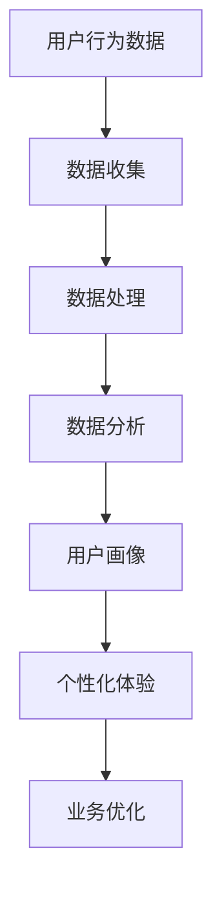

                 

用户行为洞察是现代科技中不可或缺的一部分，无论是在电子商务、社交媒体、在线教育还是金融服务领域，理解用户行为对于提供个性化体验、提高客户满意度和推动业务增长至关重要。本文旨在探讨如何进行有效的用户行为洞察，并提供实用的技术方法和案例研究。

> 关键词：用户行为洞察、数据分析、机器学习、个性化体验

> 摘要：本文首先介绍了用户行为洞察的重要性，然后详细讨论了数据收集、处理和分析的方法，包括机器学习算法在用户行为分析中的应用。此外，文章还提供了实际案例，展示了用户行为洞察如何帮助企业实现业务目标，并提出了未来的发展趋势和面临的挑战。

## 1. 背景介绍

用户行为洞察涉及收集、分析和理解用户在使用产品或服务时的行为数据。这些数据可以帮助企业了解用户的需求、偏好和痛点，从而优化产品功能、提升用户体验，并制定更加精准的市场营销策略。随着互联网的普及和大数据技术的发展，用户行为洞察的重要性日益凸显。

用户行为洞察的应用场景广泛，包括但不限于以下几个方面：

1. **电子商务**：通过分析用户的浏览历史、购买行为和偏好，电商平台可以提供个性化的商品推荐和促销活动。
2. **社交媒体**：社交媒体平台利用用户行为数据来优化内容推荐，提高用户参与度和留存率。
3. **在线教育**：教育平台通过分析用户的学习行为，可以提供个性化的学习路径和资源推荐。
4. **金融服务**：金融机构利用用户行为数据来识别欺诈行为，提供个性化的金融产品和服务。

## 2. 核心概念与联系

为了进行有效的用户行为洞察，我们需要了解以下几个核心概念：

### 2.1 用户行为数据

用户行为数据是指用户在使用产品或服务过程中产生的所有数据，包括但不限于浏览行为、点击行为、购买行为、评论、分享等。

### 2.2 数据收集

数据收集是指通过各种渠道（如网站、应用程序、传感器等）获取用户行为数据的过程。

### 2.3 数据处理

数据处理是指对收集到的用户行为数据进行清洗、转换和整合，以便进一步分析。

### 2.4 数据分析

数据分析是指利用统计方法、机器学习算法等工具，从用户行为数据中提取有价值的信息和洞见。

### 2.5 用户画像

用户画像是指通过对用户行为数据的分析，构建出反映用户特征和需求的模型。

### 2.6 个性化体验

个性化体验是指根据用户的个性化需求和偏好，提供个性化的产品和服务。

### 2.7 Mermaid 流程图

以下是用户行为洞察的 Mermaid 流程图：



## 3. 核心算法原理 & 具体操作步骤

### 3.1 算法原理概述

用户行为洞察的核心在于如何从大量的行为数据中提取有价值的信息。常用的算法包括聚类分析、关联规则学习、分类算法等。

### 3.2 算法步骤详解

#### 3.2.1 数据预处理

- 数据清洗：去除重复、错误或缺失的数据。
- 数据转换：将不同格式的数据转换为统一的格式。
- 数据整合：将来自不同渠道的数据进行整合。

#### 3.2.2 数据分析

- 聚类分析：将用户行为数据按照相似性进行分组。
- 关联规则学习：发现用户行为数据中的关联关系。
- 分类算法：将用户行为数据分类，以识别不同类型的用户。

#### 3.2.3 用户画像构建

- 基于用户行为的特征提取。
- 用户行为的时序分析。
- 用户画像的构建和更新。

### 3.3 算法优缺点

#### 优点：

- **高效性**：通过算法，可以快速处理和分析大量的用户行为数据。
- **准确性**：通过聚类、分类等算法，可以准确地识别用户群体和行为模式。

#### 缺点：

- **数据依赖性**：算法的效果高度依赖于数据的质量和数量。
- **计算复杂度**：对于大规模的用户行为数据，算法的计算复杂度较高。

### 3.4 算法应用领域

- **电子商务**：个性化推荐、用户流失预测。
- **社交媒体**：内容推荐、广告投放优化。
- **在线教育**：学习路径推荐、学习效果评估。
- **金融服务**：欺诈检测、信用评估。

## 4. 数学模型和公式 & 详细讲解 & 举例说明

### 4.1 数学模型构建

用户行为洞察的数学模型通常包括以下几个部分：

- **用户特征向量**：\[ X = (x_1, x_2, ..., x_n) \]
- **行为序列**：\[ Y = (y_1, y_2, ..., y_m) \]
- **用户画像**：\[ Z = (z_1, z_2, ..., z_k) \]

### 4.2 公式推导过程

#### 4.2.1 聚类分析

- **K-means 算法**：

\[ \text{目标函数} = \sum_{i=1}^{k} \sum_{x \in S_i} ||x - \mu_i||^2 \]

其中，\( \mu_i \) 是第 \( i \) 个聚类中心的坐标，\( S_i \) 是第 \( i \) 个聚类的数据点集合。

#### 4.2.2 关联规则学习

- **Apriori 算法**：

\[ \text{支持度} = \frac{\text{支持}(\text{项集})}{\text{总交易数}} \]

\[ \text{置信度} = \frac{\text{支持}(\text{项集})}{\text{支持}(\text{大项集})} \]

### 4.3 案例分析与讲解

#### 4.3.1 案例背景

假设一家电子商务公司想要通过用户行为数据来优化其推荐系统。

#### 4.3.2 数据预处理

- 数据清洗：去除重复和错误的数据。
- 数据转换：将不同格式的数据转换为统一的格式。
- 数据整合：将用户行为数据、商品数据等整合在一起。

#### 4.3.3 数据分析

- 聚类分析：使用 K-means 算法将用户分为不同的群体。
- 关联规则学习：使用 Apriori 算法发现用户购买行为中的关联规则。

#### 4.3.4 用户画像构建

- 基于用户行为的特征提取：提取用户的浏览历史、购买行为等特征。
- 用户行为的时序分析：分析用户行为的时序模式。
- 用户画像的构建：将用户特征和行为模式整合成用户画像。

## 5. 项目实践：代码实例和详细解释说明

### 5.1 开发环境搭建

- 硬件环境：计算机、网络连接。
- 软件环境：Python 3.x、NumPy、Pandas、Scikit-learn、Matplotlib。

### 5.2 源代码详细实现

```python
# 导入必要的库
import numpy as np
import pandas as pd
from sklearn.cluster import KMeans
from sklearn association_rules import association_rules
import matplotlib.pyplot as plt

# 读取数据
data = pd.read_csv('user_behavior_data.csv')

# 数据预处理
# ... (数据清洗、转换和整合)

# 聚类分析
kmeans = KMeans(n_clusters=3, random_state=0)
clusters = kmeans.fit_predict(data)

# 关联规则学习
rules = association_rules(data, metric='support', min_threshold=0.1)

# 用户画像构建
# ... (基于用户行为的特征提取、时序分析和画像构建)

# 可视化
plt.scatter(data['feature1'], data['feature2'], c=clusters)
plt.xlabel('Feature 1')
plt.ylabel('Feature 2')
plt.title('User Clusters')
plt.show()

# 打印关联规则
print(rules)
```

### 5.3 代码解读与分析

- **数据读取与预处理**：首先，读取用户行为数据，并进行清洗、转换和整合。
- **聚类分析**：使用 K-means 算法将用户分为不同的群体，并可视化聚类结果。
- **关联规则学习**：使用 Apriori 算法发现用户购买行为中的关联规则。
- **用户画像构建**：基于用户行为的特征提取、时序分析和画像构建。

### 5.4 运行结果展示

- **聚类结果**：用户被分为三个不同的群体，每个群体具有不同的特征和行为模式。
- **关联规则**：发现了一些用户购买行为中的关联关系，如“购买A商品”通常伴随着“购买B商品”。

## 6. 实际应用场景

### 6.1 电子商务

- **个性化推荐**：根据用户的浏览和购买历史，提供个性化的商品推荐。
- **用户流失预测**：根据用户的活跃度和购买行为，预测用户可能会流失，并采取相应的营销策略。

### 6.2 社交媒体

- **内容推荐**：根据用户的行为和兴趣，推荐用户可能感兴趣的内容。
- **广告投放优化**：根据用户的行为和特征，优化广告投放策略，提高广告点击率。

### 6.3 在线教育

- **学习路径推荐**：根据用户的学习行为和成绩，推荐个性化的学习路径。
- **学习效果评估**：根据用户的学习行为和成绩，评估学习效果，并调整教学策略。

### 6.4 金融服务

- **欺诈检测**：根据用户的交易行为和特征，识别潜在的欺诈行为。
- **信用评估**：根据用户的财务行为和信用记录，评估用户的信用等级。

## 7. 工具和资源推荐

### 7.1 学习资源推荐

- **书籍**：
  - 《数据科学入门：Python实现》
  - 《机器学习实战》
- **在线课程**：
  - Coursera 的《机器学习》课程
  - edX 的《数据科学基础》课程

### 7.2 开发工具推荐

- **Python**：数据分析的最佳语言。
- **Jupyter Notebook**：交互式数据分析环境。
- **TensorFlow**：用于机器学习的开源库。

### 7.3 相关论文推荐

- 《K-means++：The Advantages of Converting to a Generative Model》
- 《Efficient Computation of Itemset Frequentness in Large Databases》

## 8. 总结：未来发展趋势与挑战

### 8.1 研究成果总结

- 用户行为洞察技术已经取得了显著进展，尤其是在数据分析、机器学习和人工智能领域。
- 个性化推荐、用户流失预测和欺诈检测等应用取得了良好的效果。

### 8.2 未来发展趋势

- **深度学习**：深度学习算法将在用户行为洞察中发挥更大的作用。
- **实时分析**：实时分析技术将提高用户行为洞察的响应速度和准确性。
- **跨平台整合**：跨平台的数据整合和分析将变得更加普遍。

### 8.3 面临的挑战

- **数据隐私**：随着数据隐私法规的加强，用户行为数据的收集和处理将面临更多挑战。
- **数据质量**：数据质量对于用户行为洞察的效果至关重要。
- **计算资源**：大规模用户行为数据的处理需要更多的计算资源。

### 8.4 研究展望

- **隐私保护技术**：开发更加隐私保护的算法和技术。
- **自适应系统**：开发能够自动调整模型和策略的自适应系统。
- **跨学科研究**：结合心理学、社会学等学科，深入理解用户行为。

## 9. 附录：常见问题与解答

### 9.1 用户行为数据有哪些类型？

用户行为数据主要包括以下类型：

- **浏览行为**：用户的浏览历史、页面停留时间等。
- **点击行为**：用户的点击事件、点击次数等。
- **购买行为**：用户的购买记录、购买频率等。
- **评论与分享**：用户的评论内容、分享行为等。

### 9.2 用户行为洞察的主要挑战是什么？

用户行为洞察的主要挑战包括：

- **数据隐私**：如何在不侵犯用户隐私的前提下收集和使用数据。
- **数据质量**：如何确保数据的准确性和完整性。
- **计算资源**：如何处理大规模的用户行为数据。

### 9.3 如何评估用户行为洞察的效果？

评估用户行为洞察的效果可以通过以下指标：

- **准确率**：算法预测的准确度。
- **覆盖率**：算法能够覆盖的用户比例。
- **响应速度**：算法的响应时间。
- **业务价值**：算法对业务目标的贡献。

作者：禅与计算机程序设计艺术 / Zen and the Art of Computer Programming
----------------------------------------------------------------

这篇文章详细探讨了用户行为洞察的重要性、方法和技术，并结合实际案例进行了说明。文章旨在为读者提供一个全面的指南，帮助他们理解和应用用户行为洞察，以实现业务目标。未来的研究将继续探索更加隐私保护、高效和自适应的用户行为洞察方法。

