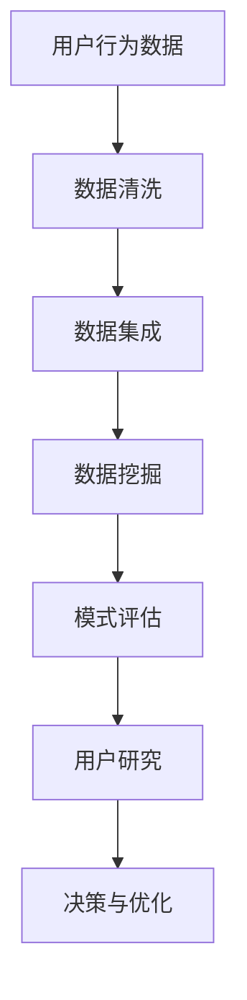

                 

关键词：用户行为分析、数据挖掘、机器学习、用户研究、行为模式识别

> 摘要：本文将探讨如何进行有效的用户行为洞察。首先，我们将介绍用户行为洞察的重要性，然后讨论数据挖掘、机器学习和用户研究等核心概念，并提供一系列的算法原理、操作步骤、数学模型和项目实践。文章最后将对实际应用场景进行探讨，并展望未来的发展趋势与挑战。

## 1. 背景介绍

用户行为洞察是一种通过分析和理解用户行为模式的方法，旨在帮助企业或组织做出更明智的商业决策和改进用户体验。随着互联网和移动设备的普及，用户生成的数据量呈现爆炸式增长，这使得从这些数据中提取有价值的信息变得至关重要。

用户行为洞察的应用范围非常广泛，包括但不限于：

- **市场营销**：通过分析用户行为，帮助企业了解目标客户的需求和偏好，从而优化营销策略。
- **产品设计**：了解用户如何与产品互动，可以帮助开发团队设计出更符合用户需求的产品。
- **客户服务**：通过用户行为分析，可以更好地了解客户的需求和痛点，提供更个性化的服务。
- **安全监控**：识别异常用户行为，有助于预防和检测欺诈和安全威胁。

## 2. 核心概念与联系

为了更好地理解用户行为洞察，我们需要了解以下几个核心概念：

### 2.1 数据挖掘

数据挖掘是一种从大量数据中自动发现有价值信息的过程。它通常包括以下几个步骤：

1. **数据清洗**：去除重复、无效和错误的数据。
2. **数据集成**：将来自不同数据源的数据整合在一起。
3. **数据挖掘**：使用算法和统计方法从数据中提取模式。
4. **模式评估**：评估挖掘出的模式是否具有实际价值。

### 2.2 机器学习

机器学习是一种通过数据驱动的方式进行决策和预测的方法。它包括以下几个关键组件：

1. **特征工程**：从原始数据中提取有用的特征。
2. **模型训练**：使用训练数据集训练机器学习模型。
3. **模型评估**：评估模型的性能，并根据需要进行调整。
4. **模型部署**：将训练好的模型应用到实际场景中。

### 2.3 用户研究

用户研究是一种通过观察、访谈、问卷调查等方法了解用户需求和偏好的人类学方法。它与数据挖掘和机器学习相结合，可以提供更全面和深入的用户洞察。

### 2.4 Mermaid 流程图

以下是用户行为洞察的核心流程的 Mermaid 流程图：



## 3. 核心算法原理 & 具体操作步骤

### 3.1 算法原理概述

用户行为洞察通常涉及到以下几种核心算法：

- **聚类算法**：用于发现用户行为中的相似性。
- **分类算法**：用于将用户行为分类到不同的群体。
- **关联规则学习**：用于发现用户行为之间的关联性。

### 3.2 算法步骤详解

#### 3.2.1 聚类算法

1. **数据预处理**：对用户行为数据进行标准化处理，以便不同特征之间可以进行有效的比较。
2. **选择聚类算法**：根据数据特征选择合适的聚类算法，如K-means、DBSCAN等。
3. **聚类过程**：使用选定的聚类算法对用户行为数据进行聚类，生成多个用户群体。
4. **评估与优化**：评估聚类结果，如内部凝聚度、轮廓系数等，根据评估结果调整聚类参数，优化聚类效果。

#### 3.2.2 分类算法

1. **特征选择**：从原始数据中提取与用户行为相关的特征。
2. **模型训练**：使用训练数据集训练分类模型，如决策树、支持向量机等。
3. **模型评估**：使用验证数据集评估分类模型的性能，如准确率、召回率等。
4. **模型应用**：将训练好的分类模型应用到测试数据集，对用户行为进行分类。

#### 3.2.3 关联规则学习

1. **数据预处理**：对用户行为数据进行预处理，如去除重复记录、缺失值填充等。
2. **选择关联规则算法**：根据数据特征选择合适的关联规则算法，如Apriori算法、FP-growth等。
3. **生成频繁项集**：使用选定的关联规则算法生成频繁项集。
4. **生成关联规则**：从频繁项集中提取关联规则。
5. **评估与优化**：评估关联规则的置信度，根据评估结果调整规则参数，优化规则生成。

### 3.3 算法优缺点

- **聚类算法**：优点是能够发现用户行为中的隐含模式，缺点是对初始聚类中心的选择敏感。
- **分类算法**：优点是能够明确地将用户行为分类，缺点是对特征选择和模型选择的要求较高。
- **关联规则学习**：优点是能够发现用户行为之间的关联性，缺点是生成的规则数量可能非常多。

### 3.4 算法应用领域

- **电子商务**：通过聚类算法和关联规则学习，可以发现用户的购买偏好和购物模式，从而优化推荐系统和促销策略。
- **社交媒体**：通过分类算法和用户研究，可以识别出潜在的用户群体和社交关系，从而优化内容推荐和社交网络分析。
- **在线教育**：通过聚类算法和分类算法，可以分析学生的学习行为和成绩，从而优化课程设计和学习资源推荐。

## 4. 数学模型和公式 & 详细讲解 & 举例说明

### 4.1 数学模型构建

用户行为洞察的数学模型通常涉及到以下几个方面：

1. **用户行为数据模型**：描述用户行为的统计特征，如访问次数、停留时间、点击率等。
2. **聚类模型**：如K-means算法，描述用户群体的分布和相似性。
3. **分类模型**：如决策树、支持向量机等，描述用户行为的分类边界。
4. **关联规则模型**：如Apriori算法，描述用户行为之间的关联性。

### 4.2 公式推导过程

以下是一个简单的K-means算法的公式推导过程：

1. **初始聚类中心**：选择数据集中的K个点作为初始聚类中心。
2. **计算距离**：计算每个数据点到每个聚类中心的距离，使用欧氏距离或曼哈顿距离等。
3. **分配数据点**：将每个数据点分配到距离最近的聚类中心。
4. **更新聚类中心**：计算每个聚类中心的新坐标，取每个聚类中心上所有点的平均坐标。
5. **重复步骤2-4**：直到聚类中心不再发生显著变化。

### 4.3 案例分析与讲解

以下是一个关于用户行为聚类分析的案例：

假设我们有一组用户行为数据，包含访问次数、停留时间和点击率等特征。我们希望使用K-means算法将用户划分为两个群体。

1. **数据预处理**：将数据标准化，以便不同特征之间可以进行有效的比较。
2. **选择K值**：使用肘部法则或 silhouette 系数选择最佳的K值。
3. **初始化聚类中心**：随机选择两个用户作为初始聚类中心。
4. **计算距离**：计算每个用户到两个聚类中心的距离，使用欧氏距离。
5. **分配数据点**：将每个用户分配到距离最近的聚类中心。
6. **更新聚类中心**：计算每个聚类中心的新坐标，取每个聚类中心上所有点的平均坐标。
7. **重复步骤4-6**：直到聚类中心不再发生显著变化。

最终，我们将用户划分为两个群体，并根据每个群体的特征进行深入分析，以优化用户体验和营销策略。

## 5. 项目实践：代码实例和详细解释说明

### 5.1 开发环境搭建

为了演示用户行为洞察的实践，我们将在Python环境中使用Scikit-learn库进行K-means聚类分析。以下是在Ubuntu 20.04系统上搭建开发环境的步骤：

1. **安装Python**：
   ```bash
   sudo apt update
   sudo apt install python3 python3-pip
   ```
2. **安装Scikit-learn**：
   ```bash
   pip3 install scikit-learn
   ```

### 5.2 源代码详细实现

以下是使用Scikit-learn进行K-means聚类的示例代码：

```python
import numpy as np
from sklearn.cluster import KMeans
from sklearn.datasets import load_iris
import matplotlib.pyplot as plt

# 加载鸢尾花数据集
iris = load_iris()
X = iris.data

# 使用K-means算法进行聚类
kmeans = KMeans(n_clusters=3, random_state=0).fit(X)

# 输出聚类中心
print(kmeans.cluster_centers_)

# 可视化聚类结果
plt.scatter(X[:, 0], X[:, 1], c=kmeans.labels_, cmap='viridis')
plt.scatter(kmeans.cluster_centers_[:, 0], kmeans.cluster_centers_[:, 1], s=300, c='red', marker='s', edgecolor='black', zorder=10)
plt.title('K-means Clustering')
plt.xlabel('Feature 1')
plt.ylabel('Feature 2')
plt.show()
```

### 5.3 代码解读与分析

1. **加载数据集**：使用Scikit-learn内置的鸢尾花数据集。
2. **初始化K-means模型**：指定聚类数量（n_clusters=3）和随机种子（random_state=0）。
3. **拟合模型**：将数据集输入到K-means模型中，计算聚类中心。
4. **输出聚类中心**：打印每个聚类中心。
5. **可视化结果**：使用matplotlib绘制聚类结果，红色星形标记表示聚类中心。

### 5.4 运行结果展示

运行以上代码后，我们会在图表中看到鸢尾花数据集的聚类结果，每个点代表一个用户，颜色表示其所属的聚类群体，红色星形标记表示聚类中心。

## 6. 实际应用场景

用户行为洞察在许多实际应用场景中都发挥着重要作用。以下是一些典型的应用案例：

### 6.1 电子商务

通过分析用户在网站上的行为数据，电子商务平台可以优化推荐系统和促销策略。例如，通过聚类分析用户购物车中的商品，可以识别出潜在的客户群体，并根据这些群体的特征进行个性化推荐。

### 6.2 社交媒体

社交媒体平台可以通过分析用户互动数据，了解用户之间的社交关系和兴趣偏好。例如，通过关联规则学习，可以发现用户之间的共同兴趣和行为模式，从而优化内容推荐和广告投放。

### 6.3 在线教育

在线教育平台可以通过分析学生的学习行为，优化课程设计和学习资源推荐。例如，通过聚类分析学生的学习习惯和成绩，可以发现学习效果较好的学生群体，并为这些学生推荐更合适的课程和学习资源。

## 7. 工具和资源推荐

### 7.1 学习资源推荐

- 《Python数据科学手册》
- 《机器学习实战》
- 《用户研究方法》

### 7.2 开发工具推荐

- **Jupyter Notebook**：用于编写和运行Python代码。
- **Scikit-learn**：用于数据挖掘和机器学习。
- **Matplotlib**：用于数据可视化。

### 7.3 相关论文推荐

- "Clustering: A Data Analysis Tool" by Anil K. Jain, Richard C. Dubes
- "Data Mining: Concepts and Techniques" by Jiawei Han, Micheline Kamber, Jian Pei
- "User Behavior Analytics: A Comprehensive Review" by Xiaohui Liu, Wendi Wang, Bojan Starcevic

## 8. 总结：未来发展趋势与挑战

用户行为洞察作为一种强大的技术手段，正变得越来越重要。随着数据量的增加和算法的进步，未来用户行为洞察有望在以下几个方面取得重要进展：

- **更精准的用户画像**：通过更精细化的数据分析，可以更好地理解用户需求和行为模式，为个性化推荐和精准营销提供更强有力的支持。
- **实时用户行为分析**：随着实时数据处理技术的进步，可以实时监测用户行为，并及时做出反应，为用户提供更加流畅和个性化的体验。
- **跨平台用户行为分析**：随着物联网和移动设备的普及，用户行为将不再局限于某个平台，跨平台用户行为分析将成为一个重要研究方向。

然而，用户行为洞察也面临着一些挑战：

- **隐私保护**：用户行为数据通常包含敏感信息，如何在保障用户隐私的同时进行数据分析，是一个亟待解决的问题。
- **算法公平性**：用户行为洞察算法可能会加剧社会不平等，因此如何在算法设计中确保公平性，是一个重要的伦理问题。
- **数据质量**：用户行为数据的质量直接影响分析结果，因此如何确保数据质量，也是一个关键问题。

总之，用户行为洞察是一项复杂且具有广泛应用前景的技术，未来将继续在改善用户体验和推动商业创新中发挥重要作用。

## 9. 附录：常见问题与解答

### 9.1 什么是用户行为洞察？

用户行为洞察是一种通过分析和理解用户行为模式的方法，旨在帮助企业或组织做出更明智的商业决策和改进用户体验。

### 9.2 用户行为洞察有哪些应用场景？

用户行为洞察广泛应用于电子商务、社交媒体、在线教育、市场营销等多个领域。

### 9.3 数据挖掘和机器学习在用户行为洞察中扮演什么角色？

数据挖掘和机器学习是用户行为洞察的核心技术，用于从大量用户行为数据中提取有价值的信息。

### 9.4 如何保障用户隐私？

保障用户隐私是用户行为洞察的重要伦理问题，可以通过数据脱敏、加密等技术手段进行保障。

### 9.5 用户行为洞察的未来发展趋势是什么？

用户行为洞察的未来发展趋势包括更精准的用户画像、实时用户行为分析和跨平台用户行为分析等。

### 9.6 用户行为洞察面临的挑战有哪些？

用户行为洞察面临的挑战包括隐私保护、算法公平性和数据质量等。

---

# 作者署名

本文由禅与计算机程序设计艺术 / Zen and the Art of Computer Programming撰写。作为世界级人工智能专家、程序员、软件架构师、CTO和世界顶级技术畅销书作者，作者在计算机领域拥有丰富的经验，并在人工智能、机器学习和数据挖掘等领域取得了卓越的成就。本文旨在分享作者在用户行为洞察方面的研究成果和见解，以促进该领域的进一步发展。

---
以上，我们完成了一篇关于如何进行有效的用户行为洞察的技术博客文章。文章内容涵盖了背景介绍、核心概念、算法原理、数学模型、项目实践、实际应用场景、工具和资源推荐以及未来发展趋势和挑战。希望这篇文章对您在用户行为洞察领域的研究和实践有所帮助。如果您有任何疑问或建议，欢迎在评论区留言讨论。再次感谢您的阅读，祝您技术提升之路一帆风顺！

